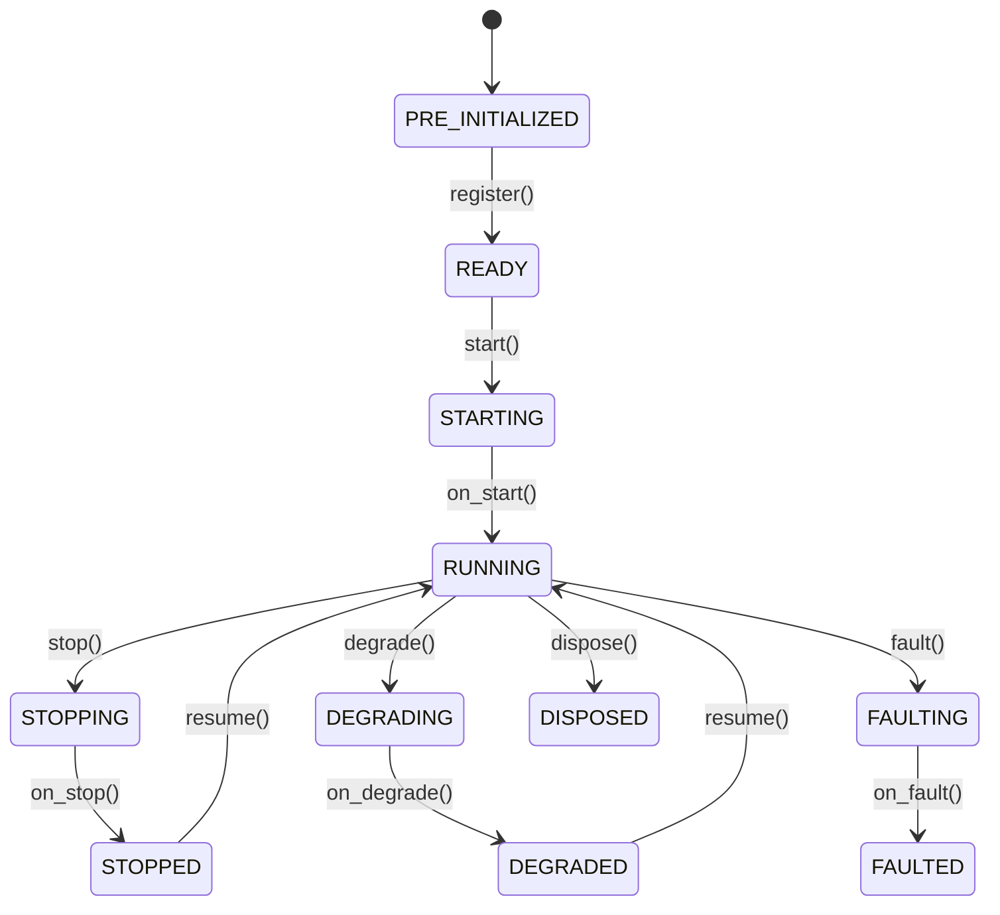

# Actors

`Actor` 接收数据 (data)、处理事件 (event) 并管理状态 (state)。`Strategy` 类继承自 Actor，
并增加了订单管理功能。

**核心能力**：

- 数据订阅 (subscription) 和请求（市场数据、自定义数据）。
- 事件处理和发布。
- 定时器和告警。
- 缓存 (cache) 和投资组合访问。
- 日志记录。

## 基本示例

Actor 支持通过类似策略 (strategy) 的模式进行配置 (configuration)。

```python
from nautilus_trader.config import ActorConfig
from nautilus_trader.model import InstrumentId
from nautilus_trader.model import Bar, BarType
from nautilus_trader.common.actor import Actor


class MyActorConfig(ActorConfig):
    instrument_id: InstrumentId   # 示例值: "ETHUSDT-PERP.BINANCE"
    bar_type: BarType             # 示例值: "ETHUSDT-PERP.BINANCE-15-MINUTE[LAST]-INTERNAL"
    lookback_period: int = 10


class MyActor(Actor):
    def __init__(self, config: MyActorConfig) -> None:
        super().__init__(config)

        # 自定义状态变量
        self.count_of_processed_bars: int = 0

    def on_start(self) -> None:
        # 订阅与配置的 bar_type 匹配的 K线 (bar)
        self.subscribe_bars(self.config.bar_type)

    def on_bar(self, bar: Bar) -> None:
        self.count_of_processed_bars += 1
```

## Actor 配置与 ID

Actor 可以接收一个 `ActorConfig` 的子类。基础配置中可以包含 `actor_id`；
如果提供了该字段，Actor 会以这个 ID 注册。如果省略，系统会派生出一个运行时 Actor ID。

把配置当作 Actor 的构造数据来对待。通过 `self.config` 读取用户提供的设置，
并把运行时状态保存在 Actor 自身上。

:::info Rust 实现
对于 Rust Actor，生成或分配的运行时 ID 存放在 Actor core 上，而不是回写到 `DataActorConfig` 中。
这与 Python 桥接路径不同：在从可导入的配置创建 Python 对象时，桥接路径可能会把继承的配置字段
复制到运行时状态中。
:::

## 生命周期

Actor 在其生命周期 (lifecycle) 中遵循预定义的状态机：



重写以下方法以挂钩生命周期事件：

| 方法              | 调用时机                                                          |
|-----------------|---------------------------------------------------------------------|
| `on_start()`    | Actor 正在启动（在此处订阅数据）。                                    |
| `on_stop()`     | Actor 正在停止（取消定时器、清理资源）。                               |
| `on_resume()`   | Actor 正在从停止状态恢复。                                           |
| `on_reset()`    | 重置指标和内部状态（在回测 (backtest) 运行之间调用）。                  |
| `on_degrade()`  | Actor 正在进入降级状态（部分功能可用）。                               |
| `on_fault()`    | Actor 遇到了严重故障。                                               |
| `on_dispose()`  | Actor 正在被销毁（最终清理）。                                        |

## 定时器和告警

Actor 可以访问时钟 (clock) 进行调度：

```python
def on_start(self) -> None:
    # 设置带回调的循环定时器（每 5 秒触发一次）
    self.clock.set_timer(
        "my_timer",
        timedelta(seconds=5),
        callback=self._on_timer,
    )

    # 设置带回调的一次性告警
    self.clock.set_time_alert(
        "my_alert",
        self.clock.utc_now() + timedelta(minutes=1),
        callback=self._on_alert,
    )

def on_stop(self) -> None:
    # 取消定时器以防止在 stop/resume 周期中产生资源泄漏
    self.clock.cancel_timer("my_timer")

def _on_timer(self, event: TimeEvent) -> None:
    self.log.info("Timer fired!")

def _on_alert(self, event: TimeEvent) -> None:
    self.log.info("Alert triggered!")
```

传入一个 `callback` 可以把 `TimeEvent` 对象定向到你自己的方法上。如果省略该回调，
事件将改为传递给 `on_event`。

:::warning 并发安全：定时器与回调的约束

Nautilus 采用单线程核心设计（参见[架构](architecture.md#线程模型)），所有 Actor/Strategy 回调（包括 `on_bar()`、`on_timer()`、`on_order_filled()` 等）均在**同一线程上顺序执行**。这意味着：

- **不存在真正的并发**：`on_timer()` 和 `on_bar()` 不会同时运行——一个完成后才会调用下一个。
- **无需加锁**：可以在不同回调间安全地共享实例变量，无需使用 `threading.Lock`。
- **长时间阻塞会延迟其他事件**：如果 `on_bar()` 中有耗时操作（如同步网络请求），会导致定时器事件和后续 K 线的处理延迟。应将耗时操作改为异步，或减少在回调中执行的工作量。
- **定时器精度有限**：定时器事件在主循环处理完当前事件后才触发，不保证纳秒级精确触发时间。
:::

## 系统访问

Actor 可以访问核心系统组件 (component)：

| 属性              | 描述                                                     |
|-------------------|----------------------------------------------------------|
| `self.cache`      | 金融工具 (instrument)、订单、持仓等的共享状态。             |
| `self.portfolio`  | 投资组合状态和计算。                                       |
| `self.clock`      | 当前时间和定时器/告警调度。                                 |
| `self.log`        | 结构化日志。                                               |
| `self.msgbus`     | 发布/订阅自定义消息。                                      |

关于组件间的自定义消息传递，请参阅[消息总线 (Message Bus)](message_bus.md)指南。

## 数据处理和回调

系统根据数据是历史数据还是实时数据，使用不同的回调处理器 (handler)。
理解数据*请求/订阅*与其对应处理器之间的关系是关键所在。

### 历史数据 vs 实时数据

系统区分两种类型的数据流：

1. **历史数据**（来自*请求*）：
   - 通过 `request_bars()`、`request_quote_ticks()` 等方法获取。
   - 通过 `on_historical_data()` 处理器处理。
   - 用于初始数据加载和历史分析。

2. **实时数据**（来自*订阅*）：
   - 通过 `subscribe_bars()`、`subscribe_quote_ticks()` 等方法获取。
   - 通过特定处理器如 `on_bar()`、`on_quote_tick()` 等处理。
   - 用于实时数据处理。

### 回调处理器

以下是不同数据操作与其处理器的映射关系：

| 操作                                 | 类别       | 处理器                   | 用途                                              |
|--------------------------------------|------------|--------------------------|---------------------------------------------------|
| `subscribe_data()`                   | 实时       | `on_data()`              | 实时数据更新。                                     |
| `subscribe_instrument()`             | 实时       | `on_instrument()`        | 实时金融工具定义更新。                             |
| `subscribe_instruments()`            | 实时       | `on_instrument()`        | 实时金融工具定义更新（按交易场所 (venue)）。       |
| `subscribe_order_book_deltas()`      | 实时       | `on_order_book_deltas()` | 实时订单簿增量。                                   |
| `subscribe_order_book_depth()`       | 实时       | `on_order_book_depth()`  | 实时订单簿深度快照。                               |
| `subscribe_order_book_at_interval()` | 实时       | `on_order_book()`        | 按间隔获取实时订单簿快照。                         |
| `subscribe_quote_ticks()`            | 实时       | `on_quote_tick()`        | 实时报价更新。                                     |
| `subscribe_trade_ticks()`            | 实时       | `on_trade_tick()`        | 实时成交更新。                                     |
| `subscribe_mark_prices()`            | 实时       | `on_mark_price()`        | 实时标记价格更新。                                 |
| `subscribe_index_prices()`           | 实时       | `on_index_price()`       | 实时指数价格更新。                                 |
| `subscribe_bars()`                   | 实时       | `on_bar()`               | 实时 K线 更新。                                    |
| `subscribe_funding_rates()`          | 实时       | `on_funding_rate()`      | 实时资金费率更新。                                 |
| `subscribe_instrument_status()`      | 实时       | `on_instrument_status()` | 实时金融工具状态更新。                             |
| `subscribe_instrument_close()`       | 实时       | `on_instrument_close()`  | 实时金融工具收盘更新。                             |
| `subscribe_option_greeks()`          | 实时       | `on_option_greeks()`     | 实时期权希腊字母更新。                             |
| `subscribe_option_chain()`           | 实时       | `on_option_chain()`      | 实时期权链切片快照。                               |
| `subscribe_order_fills()`            | 实时       | `on_order_filled()`      | 某金融工具的实时订单成交事件。                     |
| `subscribe_order_cancels()`          | 实时       | `on_order_canceled()`    | 某金融工具的实时订单取消事件。                     |
| `request_data()`                     | 历史       | `on_historical_data()`   | 历史数据处理。                                     |
| `request_order_book_deltas()`        | 历史       | `on_historical_data()`   | 历史订单簿增量。                                   |
| `request_order_book_depth()`         | 历史       | `on_historical_data()`   | 历史订单簿深度。                                   |
| `request_order_book_snapshot()`      | 历史       | `on_historical_data()`   | 历史订单簿快照。                                   |
| `request_instrument()`               | 历史       | `on_instrument()`        | 金融工具定义。                                     |
| `request_instruments()`              | 历史       | `on_instrument()`        | 金融工具定义（批量）。                             |
| `request_quote_ticks()`              | 历史       | `on_historical_data()`   | 历史报价处理。                                     |
| `request_trade_ticks()`              | 历史       | `on_historical_data()`   | 历史成交处理。                                     |
| `request_bars()`                     | 历史       | `on_historical_data()`   | 历史 K线 处理。                                    |
| `request_aggregated_bars()`          | 历史       | `on_historical_data()`   | 历史聚合 K线（即时生成）。                         |
| `request_funding_rates()`            | 历史       | `on_historical_data()`   | 历史资金费率处理。                                 |

:::tip 请求（历史数据）与订阅（实时数据）的关键区别

| 维度 | 请求（历史数据） | 订阅（实时数据） |
|------|---------------|---------------|
| 方法前缀 | `request_*` | `subscribe_*` |
| 回调处理器 | `on_historical_data()` | `on_bar()`、`on_quote_tick()` 等专用处理器 |
| 数据传递方式 | 批量返回（一次性） | 逐条推送（流式） |
| 典型用途 | 启动时加载历史数据、预热指标 | 接收实时市场更新、触发交易逻辑 |
| 回测中行为 | 立即同步返回数据 | 随历史数据回放逐条触发 |
| 实盘中行为 | 发起 REST 请求，异步回调 | 订阅 WebSocket 流 |

建议在 `on_start()` 中先 `request_*` 预热指标，再 `subscribe_*` 开始接收实时更新。
:::

### 示例

以下示例演示了历史数据和实时数据的处理方式：

```python
from nautilus_trader.common.actor import Actor
from nautilus_trader.config import ActorConfig
from nautilus_trader.core.data import Data
from nautilus_trader.model import Bar, BarType
from nautilus_trader.model import ClientId, InstrumentId


class MyActorConfig(ActorConfig):
    instrument_id: InstrumentId  # 示例值: "AAPL.XNAS"
    bar_type: BarType            # 示例值: "AAPL.XNAS-1-MINUTE-LAST-EXTERNAL"


class MyActor(Actor):
    def __init__(self, config: MyActorConfig) -> None:
        super().__init__(config)
        self.bar_type = config.bar_type

    def on_start(self) -> None:
        # 请求历史数据 - 将由 on_historical_data() 处理器处理
        self.request_bars(
            bar_type=self.bar_type,
            # 多个可选参数
            start=None,                # pd.Timestamp | None
            end=None,                  # pd.Timestamp | None
            callback=None,             # Callable[[UUID4], None] | None
            update_catalog_mode=None,  # UpdateCatalogMode | None
            params=None,               # dict[str, Any] | None
        )

        # 订阅实时数据 - 将由 on_bar() 处理器处理
        self.subscribe_bars(
            bar_type=self.bar_type,
            # 多个可选参数
            client_id=None,  # ClientId, 可选
            params=None,     # dict[str, Any], 可选
        )

    def on_historical_data(self, data: Data) -> None:
        # 处理历史数据（来自请求）
        if isinstance(data, Bar):
            self.log.info(f"Received historical bar: {data}")

    def on_bar(self, bar: Bar) -> None:
        # 处理实时 K线 更新（来自订阅）
        self.log.info(f"Received real-time bar: {bar}")
```

将历史数据和实时数据处理器分开，使你可以根据数据上下文采用不同的处理逻辑。例如：

- 使用历史数据初始化指标或建立基准指标。
- 以不同方式处理实时数据以进行实盘交易决策。
- 对历史数据和实时数据应用不同的验证或日志策略。

:::tip
调试数据流问题时，请检查你是否在查看与数据源对应的正确处理器。
如果你在 `on_bar()` 中没有看到数据，但日志中有接收到 K线 的消息，请检查 `on_historical_data()`，
因为数据可能来自请求而非订阅。
:::

## 订单成交订阅

Actor 可以使用 `subscribe_order_fills()` 订阅特定金融工具的订单成交事件。这对于监控交易活动、
进行成交分析或跟踪执行质量非常有用。

订阅后，指定金融工具的所有订单成交都会被转发到 `on_order_filled()` 处理器，
无论原始订单是由哪个策略或组件生成的。

### 示例

```python
from nautilus_trader.common.actor import Actor
from nautilus_trader.config import ActorConfig
from nautilus_trader.model import InstrumentId
from nautilus_trader.model.events import OrderFilled


class MyActorConfig(ActorConfig):
    instrument_id: InstrumentId  # 示例值: "ETHUSDT-PERP.BINANCE"


class FillMonitorActor(Actor):
    def __init__(self, config: MyActorConfig) -> None:
        super().__init__(config)
        self.fill_count = 0
        self.total_volume = 0.0

    def on_start(self) -> None:
        # 订阅该金融工具的所有成交
        self.subscribe_order_fills(self.config.instrument_id)

    def on_order_filled(self, event: OrderFilled) -> None:
        # 处理订单成交事件
        self.fill_count += 1
        self.total_volume += float(event.last_qty)

        self.log.info(
            f"Fill received: {event.order_side} {event.last_qty} @ {event.last_px}, "
            f"Total fills: {self.fill_count}, Volume: {self.total_volume}"
        )

    def on_stop(self) -> None:
        # 取消订阅成交事件
        self.unsubscribe_order_fills(self.config.instrument_id)
```

:::note
订单成交订阅仅通过消息总线 (message bus) 实现，不涉及数据引擎。
`on_order_filled()` 处理器仅在 Actor 处于运行状态时才会接收事件。
:::

## 订单取消订阅

Actor 可以使用 `subscribe_order_cancels()` 订阅特定金融工具的订单取消事件。这对于监控订单取消、
或跟踪订单生命周期事件非常有用。

订阅后，指定金融工具的所有订单取消都会被转发到 `on_order_canceled()` 处理器，
无论原始订单是由哪个策略或组件生成的。

### 示例

```python
from nautilus_trader.common.actor import Actor
from nautilus_trader.config import ActorConfig
from nautilus_trader.model import InstrumentId
from nautilus_trader.model.events import OrderCanceled


class MyActorConfig(ActorConfig):
    instrument_id: InstrumentId  # 示例值: "ETHUSDT-PERP.BINANCE"


class CancelMonitorActor(Actor):
    def __init__(self, config: MyActorConfig) -> None:
        super().__init__(config)
        self.cancel_count = 0

    def on_start(self) -> None:
        # 订阅该金融工具的所有取消事件
        self.subscribe_order_cancels(self.config.instrument_id)

    def on_order_canceled(self, event: OrderCanceled) -> None:
        # 处理订单取消事件
        self.cancel_count += 1

        self.log.info(
            f"Cancel received: {event.client_order_id}, "
            f"Total cancels: {self.cancel_count}"
        )

    def on_stop(self) -> None:
        # 取消订阅取消事件
        self.unsubscribe_order_cancels(self.config.instrument_id)
```

:::note
订单取消订阅仅通过消息总线实现，不涉及数据引擎。
`on_order_canceled()` 处理器仅在 Actor 处于运行状态时才会接收事件。
:::

## 相关指南

- [策略 (Strategies)](strategies.md) - 策略在 Actor 的基础上扩展了订单管理功能。
- [数据 (Data)](data.md) - Actor 可用的数据类型和订阅。
- [消息总线 (Message Bus)](message_bus.md) - Actor 用于通信的消息系统。
