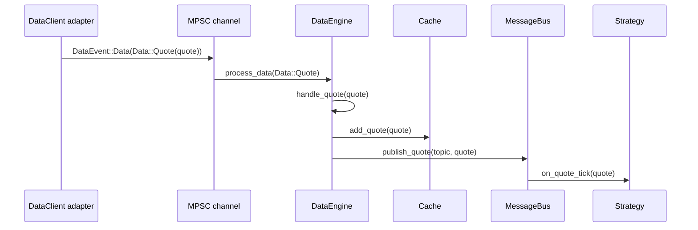
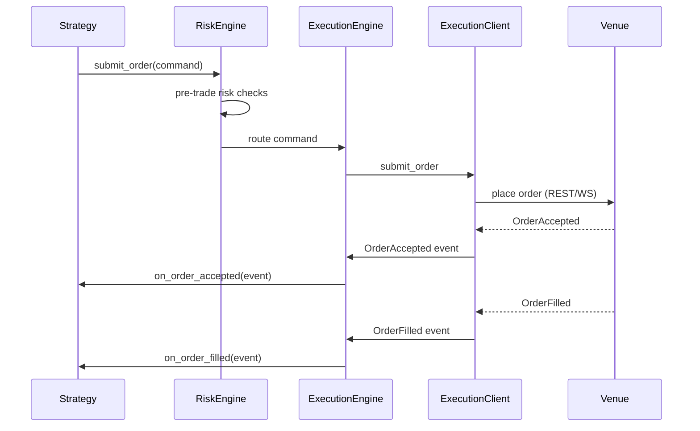
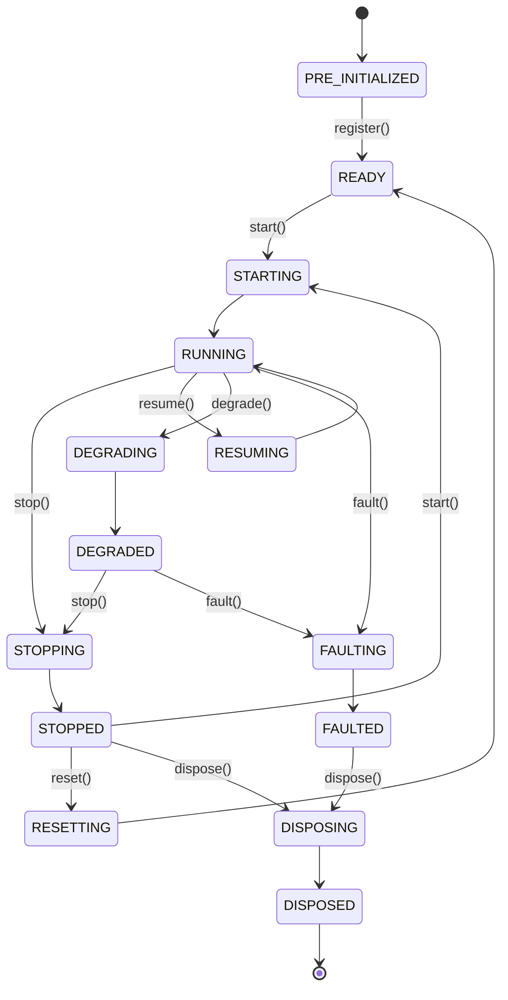
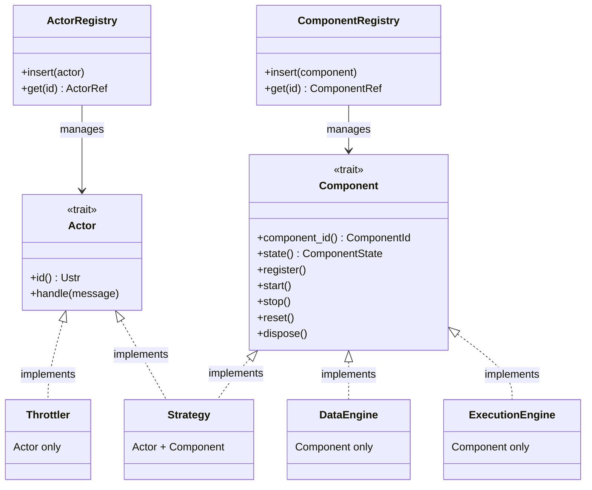
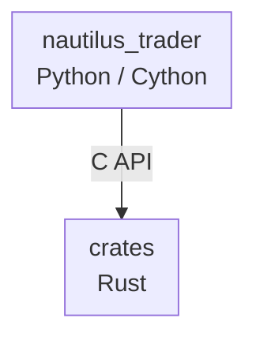
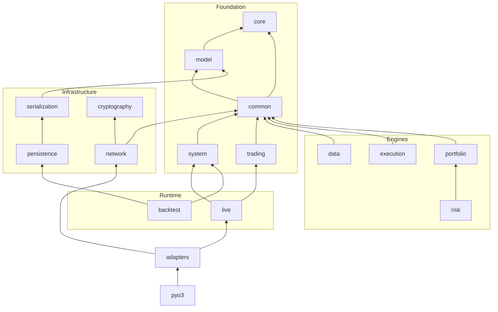

# 架构 (Architecture)

本指南涵盖 NautilusTrader 的架构 (architecture) 原则与结构：

- 设计哲学和质量属性。
- 核心组件 (component) 及其交互方式。
- 环境上下文（回测 (backtest)、沙盒、实盘交易 (live trading)）。
- 框架 (framework) 组织和代码结构。

:::note
在整个文档中，*"Nautilus 系统边界"* 一词指的是在单个 Nautilus 节点 (node)（也称为"交易者 (trader) 实例"）运行时内的操作。
:::

## 设计哲学

NautilusTrader 采用的主要架构技术和设计模式包括：

- [领域驱动设计 (Domain Driven Design, DDD)](https://en.wikipedia.org/wiki/Domain-driven_design)
- [事件驱动 (event-driven) 架构](https://en.wikipedia.org/wiki/Event-driven_programming)
- [消息模式](https://en.wikipedia.org/wiki/Messaging_pattern)（发布/订阅、请求/响应、点对点）
- [端口与适配器 (adapter)](https://en.wikipedia.org/wiki/Hexagonal_architecture_(software))
- [仅崩溃设计](#仅崩溃设计)

这些技术有助于实现特定的架构质量属性。

### 质量属性

架构决策通常是在相互竞争的优先级之间进行权衡。以下质量属性指导设计与架构决策，大致按权重排序。

- 可靠性
- 性能 (performance)
- 模块 (module) 化
- 可测试性
- 可维护性
- 可部署性

### 保障驱动工程

NautilusTrader 正在逐步采用高保障思维：关键代码路径应携带可执行的不变量，以验证行为是否符合业务需求。实际上这意味着我们：

- 识别故障影响范围（blast radius）最大的组件（核心领域 (domain) 类型、风险 (risk) 和执行 (execution) 流程），并用通俗语言记录其不变量。
- 将这些不变量编纂为可执行检查（单元测试、属性测试、模糊测试、静态断言），在 CI 中运行，保持反馈循环轻量。
- 优先使用 Rust 内置的零成本安全技术（所有权、`Result` 表面、`panic = abort`），仅在确有价值时才添加有针对性的形式化工具。
- 将"保障债务"与功能开发并行跟踪，使新集成扩展安全网而非绕过它。

这种方法在保持平台交付节奏的同时，为关键任务流程提供了所需的额外审查力度。

延伸阅读：[High Assurance Rust](https://highassurance.rs/)。

### 仅崩溃设计

NautilusTrader 借鉴了[仅崩溃设计](https://en.wikipedia.org/wiki/Crash-only_software)原则，尤其是在处理不可恢复故障方面。核心洞察是：能从崩溃中干净恢复的系统比拥有独立（且很少被测试的）优雅关闭路径的系统更加健壮。

关键原则：

- **统一恢复路径** - 启动和崩溃恢复共享同一代码路径，确保其经过充分测试。
- **外部化状态** - 关键状态在配置后被持久化到外部，从而降低数据丢失风险；持久性取决于后端存储。
- **快速重启** - 系统被设计为在崩溃后能快速重启，最大限度减少停机时间。
- **幂等操作** - 操作被设计为在重启后可安全重试。
- **不可恢复错误快速失败** - 数据损坏或不变量违规会触发立即终止，而非试图在受损状态下继续运行。

:::note
系统确实提供了用于正常操作的优雅关闭流程（`stop`、`dispose`）。这些流程会拆除客户端 (client)、持久化状态并刷新写入器。仅崩溃理念专门适用于*不可恢复的故障*，此时尝试优雅清理可能会造成更大损害。
:::

此设计与[快速失败策略](#数据完整性与快速失败策略)相辅相成，其中不可恢复错误会导致进程立即终止。

**参考资料：**

- [Crash-Only Software](https://www.usenix.org/conference/hotos-ix/crash-only-software) - Candea & Fox, HotOS 2003（原始研究论文）
- [Microreboot: A technique for cheap recovery](https://www.usenix.org/events/osdi04/tech/candea.html) - Candea et al., OSDI 2004
- [The properties of crash-only software](https://brooker.co.za/blog/2012/01/22/crash-only.html) - Marc Brooker 的博客
- [Crash-only software: More than meets the eye](https://lwn.net/Articles/191059/) - LWN.net 文章
- [Recovery-Oriented Computing (ROC) Project](http://roc.cs.berkeley.edu/) - UC Berkeley/Stanford 研究

### 数据完整性与快速失败策略

NautilusTrader 在交易操作中优先考虑数据完整性而非可用性。系统对算术运算和数据处理采用严格的快速失败策略，以防止可能导致错误交易决策的静默数据损坏。

#### 快速失败原则

系统在遇到以下情况时会快速失败（panic 或返回错误）：

- 对时间戳、价格或数量进行操作时的算术溢出或下溢，超出有效范围。
- 反序列化 (serialization) 期间的无效数据，包括市场数据或配置 (configuration) 中的 NaN、Infinity 或超范围值。
- 类型转换失败，例如在只允许正值的地方出现负值（时间戳、数量）。
- 价格、时间戳或精度值的格式错误输入解析。

原因：

在交易系统中，损坏的数据比没有数据更糟糕。单个错误的价格、时间戳或数量可能在系统中级联传播，导致：

- 不正确的持仓 (position) 规模或风险计算。
- 以错误价格下达的订单 (order)。
- 回测产生误导性的结果。
- 静默的财务损失。

通过在无效数据上立即崩溃，NautilusTrader 力求提供：

1. **无静默损坏** - 快速失败策略旨在防止无效数据传播；这依赖于覆盖输入的检查。
2. **即时反馈** - 问题在开发和测试期间被发现，而非在生产环境中。
3. **审计追踪** - 崩溃日志 (logging) 清楚地标识无效数据的来源。
4. **确定性行为** - 在确定性排序和配置下，相同的无效输入应触发相同的失败；非确定性来源可能改变结果。

#### 快速失败的适用场景

Panic 用于：

- 程序员错误（逻辑缺陷、不正确的 API 使用）。
- 违反基本不变量的数据（负时间戳、NaN 价格）。
- 可能静默产生错误结果的算术运算。

Result 或 Option 用于：

- 预期的运行时故障（网络错误、文件 I/O）。
- 业务逻辑验证（订单约束、风险限制）。
- 用户输入验证。
- 暴露给下游 crate 的库 API，调用者需要显式的错误处理而非依赖 panic 进行控制流。

#### 示例场景

```rust
// CORRECT: Panics on overflow - prevents data corruption
let total_ns = timestamp1 + timestamp2; // Panics if result > u64::MAX

// CORRECT: Rejects NaN during deserialization
let price = serde_json::from_str("NaN"); // Error: "must be finite"

// CORRECT: Explicit overflow handling when needed
let total_ns = timestamp1.checked_add(timestamp2)?; // Returns Option<UnixNanos>
```

此策略贯穿核心类型（`UnixNanos`、`Price`、`Quantity` 等），帮助 NautilusTrader 在生产交易中保持强数据正确性。

在生产部署中，系统通常在 release 构建中配置 `panic = abort`，确保任何 panic 都会导致干净的进程终止，由进程管理器或编排系统处理。这与[仅崩溃设计](#仅崩溃设计)原则一致，其中不可恢复错误导致立即重启，而非试图在潜在损坏的状态下继续运行。

## 系统架构

NautilusTrader 代码库实际上既是一个用于组合交易系统的框架，也是一组可以在各种[环境上下文](#环境上下文)中运行的默认系统实现。


### 核心组件

若干核心组件协同工作，组成交易系统：

#### `NautilusKernel`

负责中央编排的组件，其职责为：

- 初始化和管理所有系统组件。
- 配置消息基础设施。
- 维护特定于环境的行为。
- 协调共享资源和生命周期管理。
- 为系统操作提供统一入口点。

#### `MessageBus`

组件间通信的骨干，实现了：

- **发布/订阅模式**：向多个消费者广播事件和数据。
- **请求/响应 (request/response) 通信**：用于需要确认的操作。
- **命令 (command)/事件 (event) 消息**：用于触发动作和通知状态变更。
- **可选状态持久化**：使用 Redis 实现持久性和重启能力。

#### `Cache`

高性能内存存储系统：

- 存储金融工具 (instrument)、账户、订单、持仓等。
- 为交易组件提供高性能获取能力。
- 在整个系统中维护一致状态。
- 支持读写操作，具有优化的访问模式。

#### `DataEngine`

在整个系统中处理和路由市场数据：

- 处理多种数据类型（报价 (quote)、成交 (trade)、K线 (bar)、订单簿、自定义数据等）。
- 根据订阅将数据路由到适当的消费者。
- 管理从外部来源到内部组件的数据流。

#### `ExecutionEngine`

管理订单生命周期和执行：

- 将交易命令路由到适当的适配器客户端。
- 跟踪订单和持仓状态。
- 与风险管理系统协调。
- 处理来自交易场所 (venue) 的执行报告和成交。
- 处理外部执行状态的对账。

#### `RiskEngine`

提供风险管理：

- 交易前风险检查和验证。
- 持仓和敞口监控。
- 实时风险计算。
- 可配置的风险规则和限额。

### 环境上下文

NautilusTrader 中的环境上下文定义了你正在使用的数据和交易场所的类型。理解这些上下文对于回测、开发和实盘交易都很重要。

以下是可供使用的环境：

- `Backtest`：历史数据与模拟交易场所。
- `Sandbox`：实时数据与模拟交易场所。
- `Live`：实时数据与真实交易场所（模拟交易或真实账户）。

### 公共核心

该平台被设计为在回测、沙盒和实盘交易系统之间尽可能共享公共代码。这在 `system` 子包中被正式化，你将在其中找到 `NautilusKernel` 类，提供公共核心系统"内核"。

*端口与适配器*架构风格使模块化组件能够集成到核心系统中，为用户定义或自定义组件实现提供各种挂钩点。

### 数据与执行流模式

理解数据和执行如何在系统中流动，有助于你使用该平台。

#### 数据流：一个 quote tick 的一生

下面的追踪展示了 `QuoteTick` 从网络到你的策略所经历的每一步。成交（trade）和 K线（bar）遵循相同的"先缓存后发布"路径，只是处理器名称不同。订单簿增量（order book deltas）和深度快照（depth snapshots）走的是另一条路径（参见步骤下方的提示框）。



**逐步说明：**

1. **适配器接收原始数据。** 特定于交易场所的 `DataClient`（例如 Binance、Bybit）接收 WebSocket 消息，对其解析，并构造一个 `QuoteTick`。
2. **适配器发送数据事件。** 适配器通过 MPSC 通道发送 `DataEvent::Data(Data::Quote(quote))`。在实盘模式下这是一个异步无界通道；在回测中引擎直接馈送数据。
3. **DataEngine 处理事件。** 通道接收方将事件路由到 `DataEngine::process_data`，后者再分派给 `handle_quote`。
4. **Cache 存储 quote。** `handle_quote` 通过 `cache.add_quote(quote)` 将 quote 写入 `Cache`，使其可被任何组件通过 `self.cache.quote_tick(instrument_id)` 访问。
5. **MessageBus 发布。** 引擎在一个由金融工具 ID 派生的 topic 上发布该 quote（例如 `data.quotes.BINANCE.BTCUSDT-PERP`）。`MessageBus` 找到所有订阅了该 topic 的处理器。
6. **策略处理器触发。** 每个已订阅策略的 `on_quote_tick(quote)` 在单线程内核上运行。在处理器执行之前 quote 已经在缓存中，因此 `self.cache.quote_tick(instrument_id)` 返回的就是同一个 quote。

:::tip
对于报价、成交和 K线，"先缓存后发布"的顺序意味着你的策略处理器总能从缓存中读到最新值。订单簿增量和深度快照则是直接发布的；订单簿状态通过 `BookUpdater` 订阅单独维护。
:::

#### 执行流：一个订单的一生

当策略提交订单时，它会经历验证、路由，再以执行事件的形式回流：



1. **策略创建命令。** 策略调用 `self.submit_order(order)`。
2. **RiskEngine 验证。** 运行交易前检查（持仓限额、名义金额限额、下单速率）。如果某项检查失败，策略会收到 `OrderDenied`，订单永远不会到达交易场所。
3. **ExecutionEngine 路由。** 命令被路由到目标交易场所的 `ExecutionClient`。
4. **ExecutionClient 提交。** 适配器通过 REST 或 WebSocket 将订单发送到交易场所。
5. **事件回流。** 交易场所以确认和成交作出响应。每个事件（Accepted、Filled、Canceled、Rejected、Expired）通过 `ExecutionEngine` 回流，后者在 `Cache` 中更新订单状态，并将事件交付给策略的处理器。成交事件还会触发持仓和投资组合更新。

#### 组件状态管理

所有组件遵循有限状态机模式。`ComponentState` 枚举定义了稳定状态和过渡状态：



**稳定状态：**

- **PRE_INITIALIZED**：组件已实例化，但尚未准备好履行其规范。
- **READY**：组件已配置，可以启动。
- **RUNNING**：组件正在正常运行，可以履行其规范。
- **STOPPED**：组件已成功停止。
- **DEGRADED**：组件已降级，可能无法满足其完整规范。
- **FAULTED**：组件因检测到故障而关闭。
- **DISPOSED**：组件已关闭并释放了其所有资源。

**过渡状态：**

- **STARTING**：组件正在执行 `start` 上的动作。
- **STOPPING**：组件正在执行 `stop` 上的动作。
- **RESUMING**：组件在初次启动后正在再次启动。
- **RESETTING**：组件正在执行 `reset` 上的动作。
- **DISPOSING**：组件正在执行 `dispose` 上的动作。
- **DEGRADING**：组件正在执行 `degrade` 上的动作。
- **FAULTING**：组件正在执行 `fault` 上的动作。

过渡状态是状态转换期间出现的短暂中间状态。组件不应长时间停留在过渡状态中。

:::note 过渡状态的退出条件

每个过渡状态在对应的生命周期回调**正常返回**后自动退出：

| 过渡状态 | 退出条件 | 目标稳定状态 |
|---------|---------|------------|
| `STARTING` | `on_start()` 正常返回 | `RUNNING` |
| `STOPPING` | `on_stop()` 正常返回 | `STOPPED` |
| `RESUMING` | `on_resume()` 正常返回 | `RUNNING` |
| `RESETTING` | `on_reset()` 正常返回 | `READY` |
| `DISPOSING` | `on_dispose()` 正常返回 | `DISPOSED` |
| `DEGRADING` | `on_degrade()` 正常返回 | `DEGRADED` |
| `FAULTING` | `on_fault()` 正常返回 | `FAULTED` |

如果回调中抛出未捕获的异常，组件将进入 `FAULTED` 状态。若某组件长时间停留在 `STARTING` 或 `STOPPING` 状态，通常意味着回调中存在阻塞操作（如同步网络请求），应改为异步实现。
:::

#### Actor 与 Component trait

在 Rust 实现层面，系统区分了两个互补的 trait：



**`Actor` trait** - 消息分发：

- 提供 `handle` 方法，用于接收通过 Actor 注册表分发的消息。
- 通过 Actor ID 实现类型安全的查找和消息分发。
- 被需要接收定向消息的组件使用（Strategy、节流器）。

**`Component` trait** - 生命周期管理：

- 管理状态转换（`start`、`stop`、`reset`、`dispose`）。
- 提供与系统内核的注册（`register`）。
- 通过上述有限状态机跟踪组件状态。
- 被所有需要生命周期管理的系统组件使用。

:::note
所有组件都可以直接通过 `MessageBus` 发布和订阅消息 - 这与 `Actor` trait 无关。`Actor` trait 专门用于启用基于注册表的消息分发模式，其中消息通过 ID 路由到特定的 Actor。
:::

这种分离使得：

- **仅 Actor**：不需要生命周期的轻量级消息处理器（如 `Throttler`）。
- **仅 Component**：具有生命周期但使用直接 MessageBus 发布/订阅的系统基础设施（如 `DataEngine`、`ExecutionEngine`）。
- **两个 trait 都实现**：需要生命周期管理和定向消息分发的交易策略。

这两个 trait 由独立的注册表管理，以支持其不同的访问模式 - 生命周期方法按顺序调用，而消息处理器可能在回调期间被重入调用。

### 消息传递

为促进模块化和松耦合，一个高效的 `MessageBus` 在组件之间传递消息（数据、命令和事件）。

#### 线程模型

在一个节点内，*内核*在单个线程上消费和分发消息。内核包含：

- `MessageBus` 和 Actor 回调分发。
- 策略逻辑和订单管理。
- 风险引擎 (engine) 检查和执行协调。
- 缓存读写。

这种单线程核心提供确定性事件排序，并有助于维护回测与实盘的一致性，尽管实盘输入和延迟仍可能导致行为差异。组件以*类似于* [Actor 模型](https://en.wikipedia.org/wiki/Actor_model)的模式同步消费消息。

:::note
值得关注的是 LMAX 交易所架构，它在单线程上实现了屡获殊荣的性能。你可以在 Martin Fowler 的[这篇有趣的文章](https://martinfowler.com/articles/lmax.html)中了解他们基于 *disruptor* 模式的架构。
:::

后台服务使用独立线程或异步运行时：

- **网络 I/O** - WebSocket 连接、REST 客户端和异步数据源。
- **持久化** - 通过多线程 Tokio 运行时执行 DataFusion 查询和数据库操作。
- **适配器** - 通过线程池执行器执行异步适配器操作。

这些服务通过 `MessageBus` 将结果传回内核。消息总线本身是线程本地的，因此每个线程都有自己的实例，跨线程通信通过通道进行，最终将事件传递到单线程核心。

:::note 跨线程消息流转机制

Nautilus 的跨线程通信采用以下机制：

1. **后台线程产生事件**：WebSocket 适配器、Tokio 异步运行时等在独立线程中运行，产生市场数据或执行事件。
2. **通道传递**：后台线程通过 Rust MPSC（多生产者单消费者）通道将事件发送给主线程。
3. **主线程消费**：单线程核心的 `MessageBus` 从通道接收事件，并同步分发给已注册的订阅者（Actor、Strategy 回调）。

这种设计保证了：
- 策略回调（如 `on_bar()`、`on_order_filled()`）始终在同一线程上顺序执行，**无需加锁**。
- 策略代码不需要是线程安全的，可以自由使用实例变量。
- 回测与实盘使用完全相同的分发路径，保证行为一致性。
:::

## 框架组织

代码库按抽象层次进行组织，将内聚的概念分组到逻辑子包中。你可以从左侧导航菜单导航到每个子包的文档。

### 核心 / 底层

- `core`：整个框架中使用的常量、函数和底层组件。
- `common`：用于组装框架各组件的公共部分。
- `network`：网络客户端的底层基础组件。
- `serialization`：序列化基础组件和序列化器实现。
- `model`：定义丰富的交易领域模型 (model)。

### 组件

- `accounting`：不同的账户类型和账户管理机制。
- `adapters`：平台的集成适配器，包括经纪商和交易所。
- `analysis`：与交易性能统计和分析相关的组件。
- `cache`：提供公共缓存基础设施。
- `data`：平台的数据栈和数据工具。
- `execution`：平台的执行栈。
- `indicators`：一组高效的指标和分析器。
- `persistence`：数据存储、编目和检索，主要用于支持回测。
- `portfolio`：投资组合管理功能。
- `risk`：风险相关的组件和工具。
- `trading`：交易领域特定的组件和工具。

### 系统实现

- `backtest`：回测组件以及回测引擎和节点实现。
- `live`：实盘引擎和客户端实现以及用于实盘交易的节点。
- `system`：`backtest`、`sandbox`、`live` [环境上下文](#环境上下文)之间共享的核心系统内核。

## 代码结构

代码库的基础是 `crates` 目录，包含一组 Rust crate，其中包括由 `cbindgen` 生成的 C 外部函数接口 (FFI)。

大部分生产代码位于 `nautilus_trader` 目录中，包含一组 Python/Cython 子包和模块。

Rust 核心的 Python 绑定通过在编译时将 Rust 库静态链接到 Cython 生成的 C 扩展模块来提供（有效地扩展了 CPython API）。

### 依赖流



### Rust crate

`crates/` 目录包含以清晰依赖边界组织的聚焦 crate 的 Rust 实现。
功能标志控制可选功能 - 例如，`streaming` 启用基于 catalog 的数据流持久化，`cloud` 启用云存储后端（S3、Azure、GCP）。

依赖流（箭头指向依赖项）：



**Crate 分类：**

| 类别       | Crate                                                     | 用途                                                     |
|------------|-----------------------------------------------------------|----------------------------------------------------------|
| 基础层     | `core`、`model`、`common`、`system`、`trading`            | 基本类型、领域模型、内核、Actor 和策略基类。             |
| 引擎层     | `data`、`execution`、`portfolio`、`risk`                  | 核心交易引擎组件。                                       |
| 基础设施层 | `serialization`、`network`、`cryptography`、`persistence` | 编码、网络、签名、存储。                                 |
| 运行时层   | `live`、`backtest`                                        | 特定于环境的节点实现。                                   |
| 外部集成   | `adapters/*`                                              | 交易场所和数据集成。                                     |
| 绑定层     | `pyo3`                                                    | Python 绑定。                                            |

**功能标志：**

| 功能标志    | Crate                      | 效果                                                       |
|-------------|----------------------------|------------------------------------------------------------|
| `streaming` | `data`、`system`、`live`   | 启用 `persistence` 依赖以支持 catalog 流式传输。           |
| `cloud`     | `persistence`              | 启用云存储后端（S3、Azure、GCP、HTTP）。                   |
| `python`    | 大多数 crate               | 启用 PyO3 绑定（自动启用 `streaming`、`cloud`）。          |
| `defi`      | `common`、`model`、`data`  | 启用 DeFi/区块链数据类型。                                 |

:::note
Rust 和 Cython 都是构建依赖。构建产生的二进制 wheel 在运行时不需要安装 Rust 或 Cython。
:::

### 类型安全

平台设计优先考虑软件正确性和安全性。

`crates/` 下的 Rust 代码库依赖 `rustc` 编译器对安全代码的保证。任何 `unsafe` 块都是显式的退出点，我们必须自行维护所需的不变量（参见[开发者指南](../developer_guide/rust.md)的 Rust 部分）；整体内存和类型安全取决于这些不变量能否成立。

Cython 在编译时和运行时都在 C 级别提供类型安全：

:::info
如果你向具有类型参数的 Cython 实现模块传递了无效类型的参数，你将在运行时收到 `TypeError`。
:::

如果函数或方法的参数未显式声明为接受 `None`，传递 `None` 作为参数将在运行时导致 `ValueError`。

:::warning
上述异常未被显式记录在文档中，以防止文档字符串过度膨胀。
:::

### 错误与异常

文档力求覆盖 NautilusTrader 代码可能引发的所有异常及其触发条件。

:::warning
Python 标准库或第三方库依赖可能会引发其他未记录的异常。
:::

### 进程与线程

:::warning[每个进程一个节点]
由于全局单例状态，不支持在同一进程中**并发**运行多个 `TradingNode` 或 `BacktestNode` 实例：

- **回测强制停止标志** - `_FORCE_STOP` 全局标志在进程中所有引擎之间共享。
- **日志模式和时间戳** - 日志子系统使用全局状态；回测在静态和实时模式之间切换。
- **运行时单例** - 全局 Tokio 运行时、回调注册表和其他 `OnceLock` 实例是进程级别的。

**顺序执行**多个节点（一个接一个，运行之间正确释放）是完全支持的，并在测试套件中使用。

对于生产部署，在一个进程的**单个 TradingNode** 中添加多个策略。
对于并行执行或工作负载隔离，在各自独立的进程中运行每个节点。
:::

## 相关指南

- [概览](overview.md) - NautilusTrader 的高层介绍。
- [消息总线](message_bus.md) - 核心消息基础设施。
