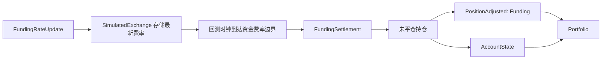
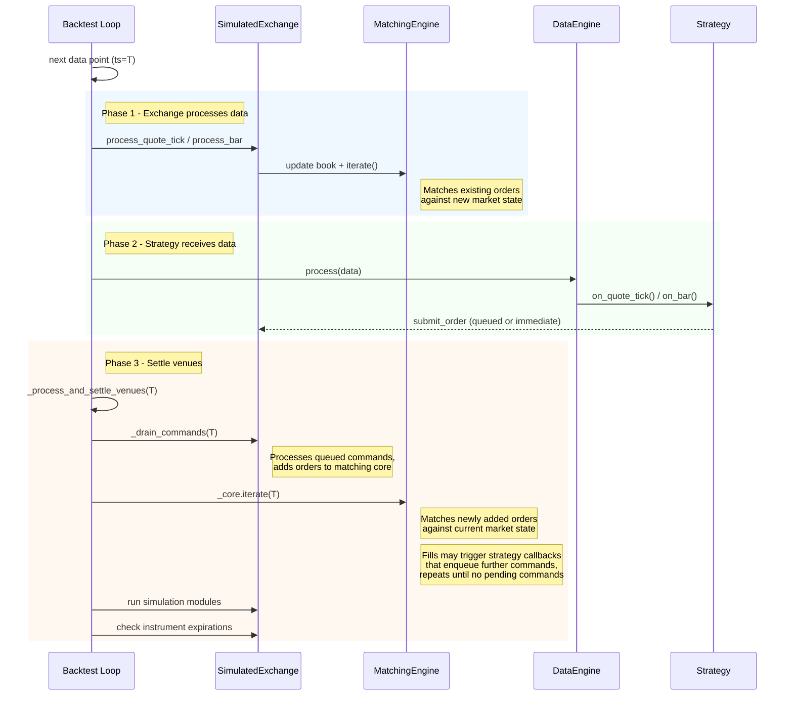

# 回测 (Backtesting)

回测使用特定的系统实现来模拟交易。该系统由内置引擎 (engine)、`Cache`、[消息总线](message_bus.md)、`Portfolio`、[Actor](actors.md)、[策略](strategies.md)、[执行算法](execution.md)以及用户自定义模块构成。`BacktestEngine` 处理一个历史数据流。当数据流处理完毕后，引擎生成结果和绩效指标供分析。

NautilusTrader 提供两个级别的回测 API：

- **高级 API**：使用 `BacktestNode` 和配置 (configuration) 对象（内部使用 `BacktestEngine`）。
- **低级 API**：直接使用 `BacktestEngine`，需要更多"手动"设置。

:::note
**Parquet 格式说明**

Parquet 是 Apache 开源的**列式存储**文件格式，专为大数据分析设计。与行式存储（如 CSV）的区别：

```
行式（CSV）：              列式（Parquet）：
ts    | price | qty       ts:    [1000, 1001, 1002]
1000    100.0   10        price: [100.0, 100.1, 99.9]
1001    100.1    5        qty:   [10, 5, 8]
1002     99.9    8
```

回测时通常只需读取部分列（如 `price`），列式存储可跳过不需要的列，大幅减少 I/O。

| | **CSV** | **Parquet** |
|---|---|---|
| 格式 | 文本，行式 | 二进制，列式 |
| 体积 | 大 | 小（压缩比通常 5–10x） |
| 读取速度 | 慢（全行扫描） | 快（按列、按时间范围裁剪） |
| 内存占用 | 高（需全量加载） | 低（支持流式分批读取） |
| 可读性 | 人类可读 | 需工具（如 `pyarrow`） |

`ParquetDataCatalog` 是 NautilusTrader 专用数据目录，以 Nautilus 定义的 schema 存储 Parquet 文件，支持按时间范围查询和流式读取。**Tick 级别历史数据动辄 GB~TB，这是高级 API 的标准选择。**
:::

## 选择 API 级别

在以下情况下考虑使用**低级** API：

- 整个数据流可以在可用的机器资源（如内存）内处理。
- 不需要以 Nautilus 专用的 Parquet 格式存储数据。
- 有特定需求或偏好保留原始格式的数据（如 CSV、二进制格式等）。
- 需要对 `BacktestEngine` 进行细粒度控制，例如在相同数据集上重新运行回测，同时替换组件（如 Actor 或策略）或调整参数配置。

在以下情况下考虑使用**高级** API：

- 数据流超出可用内存，需要分批流式加载数据。
- 希望利用 `ParquetDataCatalog` 的性能和便捷性，以 Nautilus 专用的 Parquet 格式存储数据。
- 重视通过配置对象来定义和管理多个回测运行的灵活性和功能，可以同时跨多个引擎执行。

## 低级 API

低级 API 以 `BacktestEngine` 为核心，通过 Python 脚本手动初始化和添加输入。
已实例化的 `BacktestEngine` 可以接受以下内容：

- `Data` 对象列表，会自动按 `ts_init` 排序为单调递增顺序。
- 多个交易场所 (venue)，需手动初始化。
- 多个 Actor，需手动初始化和添加。
- 多个执行算法，需手动初始化和添加。

这种方法提供了对回测过程的详细控制，允许手动配置每个组件。

### 高效加载大数据集

当处理跨多个金融工具 (instrument) 的大量数据时，数据加载方式会显著影响性能。

#### 性能考虑

默认情况下，`BacktestEngine.add_data()` 在每次调用时（当 `sort=True`，即默认值时）都会对整个数据流（已有数据 + 新添加的数据）进行排序。这意味着：

- 第一次调用 100 万根 K线 (bar)：排序 100 万根 K线。
- 第二次调用 100 万根 K线：排序 200 万根 K线。
- 第三次调用 100 万根 K线：排序 300 万根 K线。
- 以此类推...

这种对越来越大的数据集进行重复排序的方式，在加载多个金融工具的数据时可能成为瓶颈。

#### 优化策略

**策略 1：延迟到最后排序（推荐用于多个金融工具）**

```python
from nautilus_trader.backtest.engine import BacktestEngine

engine = BacktestEngine()

# 设置交易场所和金融工具
engine.add_venue(...)
engine.add_instrument(instrument1)
engine.add_instrument(instrument2)
engine.add_instrument(instrument3)

# 加载所有数据，每次调用时不排序
engine.add_data(instrument1_bars, sort=False)
engine.add_data(instrument2_bars, sort=False)
engine.add_data(instrument3_bars, sort=False)

# 最后排序一次 - 效率高得多！
engine.sort_data()

# 现在运行回测
engine.add_strategy(strategy)
engine.run()
```

**策略 2：收集后一次性添加**

```python
# 先收集所有数据
all_bars = []
all_bars.extend(instrument1_bars)
all_bars.extend(instrument2_bars)
all_bars.extend(instrument3_bars)

# 一次性添加并排序
engine.add_data(all_bars, sort=True)
```

**策略 3：对超大数据集使用流式 API**

对于无法放入内存的数据集，有两种流式方法：

**自动分块** —— 提供一个逐块产出批次的生成器。引擎在单次 `run()` 调用过程中惰性拉取数据块：

```python
def data_generator():
    # 逐块生成数据（每块是一个 Data 对象列表）
    yield load_chunk_1()
    yield load_chunk_2()
    yield load_chunk_3()

engine.add_data_iterator(
    data_name="my_data_stream",
    generator=data_generator(),
)

engine.run()  # 数据块按需消费
```

**手动分块** —— 由你自己加载并运行每个批次。这是 `BacktestNode` 内部使用的模式，可对批次边界进行完全控制：

```python
engine.add_strategy(strategy)

for batch in data_batches:
    engine.add_data(batch)
    engine.run(streaming=True)
    engine.clear_data()

engine.end()  # 收尾：刷新剩余定时器、停止引擎、产出结果
```

:::note
在流式模式下，每个批次的数据耗尽时定时器推进会停止。计划在最后一个数据点之后触发的定时器（如 K线聚合区间）会被推迟，直到更多数据到达或调用 `end()`——后者会刷新到上一次 `run()` 调用的 `end` 边界。
:::

:::tip[性能影响]
对于包含 10 个金融工具、每个有 100 万根 K线的回测：

- 每次调用都排序：约 10 次递增大小的排序（100 万、200 万、300 万、... 1000 万根 K线）。
- 最后排序一次：对 1000 万根 K线排序 1 次。

延迟排序方法对于大数据集可以**显著更快**。
:::

### 数据加载契约

`BacktestEngine` 强制执行重要的不变量以确保数据完整性：

**要求：**

- 所有数据必须在调用 `run()` 之前排序。
- 使用 `sort=False` 时，**必须**在运行前调用 `sort_data()`。
- 引擎会验证这一点，如果检测到未排序的数据，会抛出 `RuntimeError`。
- 多次调用 `sort_data()` 是安全的（幂等操作）。

**安全保证：**

- 数据列表在内部始终会被复制，以防止外部修改影响引擎状态。
- 将数据传递给 `add_data()` 后，可以安全地清除或修改数据列表。
- 使用 `sort=True` 添加的数据可以立即用于回测。

这种设计在保证数据完整性的同时，为大数据集提供了性能优化能力。

## 资金费率 (Funding)

回测会根据 `FundingRateUpdate` 数据，在资金费率结算边界处结算永续合约的资金费率。当一次更新带有 `next_funding_ns` 时，模拟交易所会存储最新的费率，回测时钟在该时间戳发出一次 `FundingSettlement`。如果没有 `next_funding_ns`，交易所仅在 `ts_event` 落在 `interval` 边界上时结算。不带边界的更新仍作为策略数据，不会产生资金费率支付。



`PositionAdjusted` 仍然是持仓会计事件。正的资金费率向多头持仓收取费用、向空头持仓支付费用。由此产生的调整会改变已实现盈亏 (realized PnL)，相应的账户余额更新记录现金流动。

## 高级 API

高级 API 以 `BacktestNode` 为核心，它负责编排管理多个 `BacktestEngine` 实例，每个实例由一个 `BacktestRunConfig` 定义。多个配置可以打包成一个列表，由节点 (node) 在一次运行中处理。

每个 `BacktestRunConfig` 对象由以下部分组成：

- `BacktestDataConfig` 对象列表。
- `BacktestVenueConfig` 对象列表。
- `ImportableActorConfig` 对象列表。
- `ImportableStrategyConfig` 对象列表。
- `ImportableExecAlgorithmConfig` 对象列表。
- 可选的 `ImportableControllerConfig` 对象。
- 可选的 `BacktestEngineConfig` 对象，如未指定则使用默认配置。

## 出错时关闭

设置 `BacktestEngineConfig.shutdown_on_error=True`，这样一条 Rust 错误日志就会结束回测运行。Rust 日志器记录内核启动后发出的第一条 `log::error!`，内核会在回测循环下次检查关闭请求时，将该触发器转换为一条 `ShutdownSystem` 命令。

关闭请求遵循正常的回测停止路径。它会停止 trader 和引擎，然后返回截至关闭时刻收集到的回测结果。它不会中止进程。

```python
from nautilus_trader.backtest import BacktestEngineConfig

config = BacktestEngineConfig(shutdown_on_error=True)
```

被组件过滤器或 `bypass_logging=True` 抑制的错误日志仍会请求关闭。当新的内核运行开始时，该触发器会被清除并重新装载，因此一个进程无需重新初始化日志系统即可运行另一次回测。出错时关闭机制观测的是 Rust `log` 记录，而非 Python 的 `logging.error(...)` 调用。

## 重复运行

进行多次回测运行时，了解组件如何重置非常重要，以避免意外行为。

### BacktestEngine.reset()

`.reset()` 方法将引擎状态和已加载组件的状态恢复到其**初始值**。它会保留已加载的组件、数据、金融工具和已注册的交易场所。

**被重置的内容：**

- 所有交易状态（订单 (order)、持仓 (position)、账户余额）。
- 已加载的 Actor、策略和执行算法会被原地重置。
- 引擎计数器和时间戳。

**保留的内容：**

- 通过 `.add_data()` 添加的数据（使用 `.clear_data()` 来移除）。
- 金融工具（必须与保留的数据匹配）。
- 交易场所配置。
- 已加载的 Actor、策略和执行算法。

**金融工具处理：**

对于 `BacktestEngine`，金融工具默认在重置后保留（因为数据保留了，金融工具必须与数据匹配）。这通过默认 `BacktestEngineConfig` 中的 `CacheConfig.drop_instruments_on_reset=False` 来配置。

### 多次回测运行的方法

运行多次回测有两种主要方法：

#### 1. 使用 BacktestNode（推荐用于生产环境）

高级 API 专为使用不同配置进行多次回测运行而设计：

```python
from nautilus_trader.backtest.node import BacktestNode
from nautilus_trader.config import BacktestRunConfig

# 定义多个运行配置
configs = [
    BacktestRunConfig(...),  # 运行 1
    BacktestRunConfig(...),  # 运行 2
    BacktestRunConfig(...),  # 运行 3
]

# 执行所有运行
node = BacktestNode(configs=configs)
results = node.run()
```

每次运行都会获得一个全新的引擎和干净的状态 - 无需调用 reset()。

#### 2. 使用 BacktestEngine.reset()

使用低级 API 进行细粒度控制：

```python
from nautilus_trader.backtest.engine import BacktestEngine

engine = BacktestEngine()

# 一次性设置
engine.add_venue(...)
engine.add_instrument(ETHUSDT)
engine.add_data(data)

# 运行 1
engine.add_strategy(strategy1)
engine.run()

# 重置后用同一个已加载的策略运行 2
engine.reset()
engine.run()

# 重置后用不同的策略运行 3
engine.reset()
engine.clear_strategies()
engine.add_strategy(strategy2)
engine.run()
```

:::note
对于 `BacktestEngine`，金融工具和数据默认在重置后保留，使参数优化变得简单直接。
:::

:::tip[最佳实践]

- **生产回测：** 使用 `BacktestNode` 配合配置对象。
- **参数优化：** 使用 `BacktestEngine.reset()` 保留数据和金融工具，然后在添加替换策略实例之前调用 `clear_strategies()`。
- **快速实验：** 两种方法都可以 - 根据具体使用场景选择。

:::

:::info 低级 API 与高级 API 可以混合使用吗？

两种 API **不能在同一回测运行中混合**——`BacktestEngine`（低级）和 `BacktestNode`（高级）是独立的系统入口。但在**项目层面**可以分阶段使用：

- 用低级 API 快速验证策略逻辑（代码简洁、便于调试）。
- 将成熟策略迁移到高级 API 进行大规模数据回测和参数优化（使用 `ParquetDataCatalog` 流式加载 TB 级数据）。
- 两种 API 使用相同的策略类和配置对象，迁移成本低。
:::

## 数据

回测提供的数据驱动着执行流程。由于可以使用多种数据类型，确保交易场所配置与回测数据匹配至关重要。数据与配置之间的不匹配可能导致执行过程中的意外行为。

NautilusTrader 主要针对订单簿 (order book) 数据进行设计和优化，订单簿提供了市场中每个价格级别或订单的完整表示，反映了交易场所的实时行为。这确保了最高级别的执行粒度和真实性。但是，如果精细的订单簿数据不可用或不必要，平台也能按以下详细程度递减的顺序处理市场数据：


1. **订单簿数据/增量（L3 逐笔委托）**：
   - 全面的市场深度，可见所有单个订单。

2. **订单簿数据/增量（L2 逐档行情）**：
   - 所有价格级别的市场深度可见性。

3. **报价 Tick（L1 逐档行情）**：
   - 仅盘口最优价 - 最佳买价和卖价及其数量。

4. **成交 Tick**：
   - 实际执行的成交。

5. **K线**：
   - 固定时间间隔内的聚合交易活动（如 1 分钟、1 小时、1 天）。

### 选择数据：成本与精度

对于许多交易策略而言，K线数据（如 1 分钟）对于回测和策略开发可能已经足够。这一点尤其重要，因为与 Tick 或订单簿数据相比，K线数据通常更容易获取且成本更低。

鉴于这一实际情况，Nautilus 被设计为支持基于 K线的回测，并提供高级功能来最大化模拟精度，即使使用较低粒度的数据也是如此。

:::tip
对于某些交易策略，从 K线数据开始开发以验证核心交易思路可能是可行的。如果策略看起来有前景，但对精确的执行时机更敏感（例如，需要在 OHLC 级别之间的特定价格成交，或使用较紧的止盈/止损水平），那么可以再投资获取更高粒度的数据以进行更准确的验证。
:::

## 交易场所

初始化回测交易场所时，必须从以下选项中指定其内部订单 `book_type` 以用于执行处理：

- `L1_MBP`：L1 逐档行情（默认）。仅维护订单簿的最优一档。
- `L2_MBP`：L2 逐档行情。维护订单簿深度，每个价格级别聚合一个订单。
- `L3_MBO`：L3 逐笔委托。维护订单簿深度，数据提供的所有单个订单都被跟踪。

`book_type` 决定撮合引擎使用哪些数据类型来更新订单簿状态和驱动执行。对给定 `book_type` 不适用的数据类型在订单簿和价格更新中会被忽略，但精度验证仍然适用，引擎时钟仍然推进。无论 `book_type` 如何，策略始终通过数据引擎接收所有已订阅的数据。

| 数据类型           | L1_MBP        | L2_MBP        | L3_MBO        |
| ------------------ | ------------- | ------------- | ------------- |
| `QuoteTick`        | 更新订单簿    | *忽略*        | *忽略*        |
| `TradeTick`        | 触发撮合      | 触发撮合      | 触发撮合      |
| `Bar`              | 更新订单簿    | *忽略*        | *忽略*        |
| `OrderBookDelta`   | *忽略*        | 更新订单簿    | 更新订单簿    |
| `OrderBookDeltas`  | *忽略*        | 更新订单簿    | 更新订单簿    |
| `OrderBookDepth10` | 更新订单簿    | 更新订单簿    | 更新订单簿    |

:::note
数据的粒度必须与指定的订单 `book_type` 匹配。Nautilus 无法从较低级别的数据（如报价、成交或 K线）生成更高粒度的数据（L2 或 L3）。
:::

:::warning
如果将 `L2_MBP` 或 `L3_MBO` 指定为交易场所的 `book_type`，报价和 K线将不会更新订单簿。请确保提供订单簿增量数据，否则订单可能看起来永远不会被成交。
:::

:::warning
当使用 `L1_MBP`（默认）时，撮合引擎会忽略订单簿增量。如果你订阅了订单簿增量，请将交易场所的 `book_type` 设置为 `L2_MBP` 或 `L3_MBO`。这同样适用于沙盒 (sandbox) 执行，其撮合引擎使用相同的 `book_type` 配置。
:::

## 执行

### 数据和消息排序

在主回测循环中，新的市场数据首先被处理用于订单执行，然后才通过数据引擎发送给 Actor/策略。

#### 主循环流程

对于每个数据点，引擎运行三个阶段：

- **交易所处理数据。** 模拟交易所根据传入的市场数据更新其订单簿并迭代撮合引擎。这会成交任何当前与新市场状态匹配的已有订单。
- **策略接收数据。** 数据引擎通过回调（如 `on_quote_tick`、`on_bar`）将数据点分发给 Actor 和策略。策略可以在这些回调中提交、取消或修改订单。
- **结算交易场所。** 引擎排空所有排队的交易场所命令，然后迭代撮合引擎以成交新提交的订单。这个循环会重复直到没有待处理命令为止，因此级联订单（例如从 `on_order_filled` 提交的对冲单）会在同一时间戳内结算。



定时器事件使用相同的结算机制，但按时间戳批处理：时间戳 T 的所有回调先执行，然后在推进到 T+1 之前先结算 T 时刻的交易场所。

#### 命令结算

当一次订单成交触发一个提交额外订单的策略回调（例如在 `on_order_filled` 中提交止损单）时，这些级联命令会在同一时间戳/事件周期内结算。引擎会反复排空交易场所命令队列以及任何新生成的命令，直到当前时间戳没有命令处于待处理状态。仿真模块每个周期只运行一次，在所有命令结算之后。

当配置了 `LatencyModel` 时，命令会被放入交易场所的在途 (inflight) 队列，并带有从模拟延迟推导出的未来时间戳。结算循环会将在当前时间戳到期的在途命令视为待处理，因此零延迟或同 Tick 延迟的配置仍能正确结算。带有未来时间戳的命令会被推迟，并在引擎到达该时间时处理。

#### 关闭语义

`BacktestEngine::end()` 会调用每个策略的 `on_stop` 处理器，排空并结算它发出的任何命令（如 `close_all_positions`、`cancel_all_orders`），然后停止引擎。

- `on_stop` 命令使用正常的交易场所排队和延迟。它们不会比更早的在途命令获得优先权。
- 如果一个停止前的订单在 `on_stop` 取消命令之前到达交易场所，它仍可能成交。随后一个仅减仓 (reduce-only) 平仓单可能因成交改变了净敞口而被拒绝。
- 需要确定性平仓的策略应在停止前进入仅退出 (exit-only) 状态，并在取消和平仓命令在途期间避免新的开仓订单。
- 策略事件处理器不会因由此产生的事件而触发：策略已处于 `Stopped` 状态，因此 `OrderFilled` 等事件会被记录日志但会绕过 `on_order_filled` 及同类处理器。对成交做出反应的逻辑必须在 `on_stop` 返回之前运行。
- 仿真模块不会在关闭时重新运行。`SimulationModule::process` 每个时间戳只运行一次；重新调用会重复施加副作用，例如外汇展期利息。
- `LatencyModel` 会为尾随命令（在最后一个数据 Tick 上或在 `on_stop` 中发出的命令）加上其配置的延迟。关闭路径会将引擎时钟推进到最晚的在途到达时间戳，以便这些命令仍能在引擎停止前结算。

### 成交建模理念

NautilusTrader 在回测期间将历史订单簿和成交数据视为**不可变 (immutable)**。市场中发生过的事情会被精确地按记录保留。成交永远不会修改底层订单簿状态。

这弥补了学术文献中的一个空白：大多数研究关注的是订单簿实际演化的实时市场动态。使用冻结快照的历史回测是一个独特的工程问题：我们如何针对不会因我们的订单而改变的数据来模拟真实的成交？

**设计选择：**

- **不可变历史数据**：订单簿和成交数据永远不会被修改。
- **可选的消耗追踪**：当 `liquidity_consumption=True` 时，引擎按价格级别追踪已消耗的流动性，以防止重复成交。配置方法见[订单簿不可变性](#订单簿不可变性)。
- **可复现的结果**：固定的 `random_seed` 会固定概率成交模型的 PRNG。同进程内重跑预期结果一致；由于成交模型之外的哈希排序效应，跨进程重跑在极少数情况下可能不同。

### 成交价格的确定

撮合引擎根据订单类型、订单簿类型和市场状态确定成交价格。

#### L2/L3 订单簿数据

拥有完整订单簿深度时，成交由实际的订单簿模拟确定：

| 订单类型               | 成交价格                                            |
| ---------------------- | --------------------------------------------------- |
| `MARKET`               | 逐档穿过订单簿，在每个价格级别成交（taker）。        |
| `MARKET_TO_LIMIT`      | 逐档穿过订单簿，在每个价格级别成交（taker）。        |
| `LIMIT`                | 撮合时使用订单的限价（maker）。                      |
| `STOP_MARKET`          | 触发时逐档穿过订单簿。                               |
| `STOP_LIMIT`           | 触发并撮合时使用订单的限价。                         |
| `MARKET_IF_TOUCHED`    | 触发时逐档穿过订单簿。                               |
| `LIMIT_IF_TOUCHED`     | 触发时使用订单的限价。                               |
| `TRAILING_STOP_MARKET` | 激活并触发时逐档穿过订单簿。                         |
| `TRAILING_STOP_LIMIT`  | 激活、触发并撮合时使用订单的限价。                   |

使用 L2/L3 数据时，如果盘口最优档流动性不足，市价类订单可能跨多个价格级别部分成交。限价类订单在触发后作为等待订单 (resting order)，如果市场未达到限价则可能保持未成交。`MARKET_TO_LIMIT` 先以 taker 成交，然后将剩余数量以其首次成交价格作为限价单等待。

#### L1 订单簿数据（报价、成交、K线）

仅有盘口最优档数据时，使用同样的订单簿模拟，但订单簿只有单档：

| 订单类型               | 买入成交价格   | 卖出成交价格   |
| ---------------------- | -------------- | -------------- |
| `MARKET`               | 最优卖价       | 最优买价       |
| `MARKET_TO_LIMIT`      | 最优卖价       | 最优买价       |
| `LIMIT`                | 限价           | 限价           |
| `STOP_MARKET`          | 最优卖价       | 最优买价       |
| `STOP_LIMIT`           | 限价           | 限价           |
| `MARKET_IF_TOUCHED`    | 最优卖价       | 最优买价       |
| `LIMIT_IF_TOUCHED`     | 限价           | 限价           |
| `TRAILING_STOP_MARKET` | 最优卖价       | 最优买价       |
| `TRAILING_STOP_LIMIT`  | 限价           | 限价           |

使用 L1 数据时，模拟订单簿只有单个价格级别。订单针对该级别的可用数量成交。如果订单在耗尽盘口最优档流动性后仍有剩余数量，市价单和可成交的限价类订单会滑动一个 Tick 来成交剩余部分。

特别是对于 K线数据，当 K线在其高/低价处理过程中穿过触发价时，`STOP_MARKET` 和 `TRAILING_STOP_MARKET` 订单可能在触发价而非最优卖/买价成交。详见[K线数据下的止损订单成交行为](#k线数据下的止损订单成交行为)。

:::note
成交模型可以改变这些成交价格。关于配置执行模拟的详情，见[成交模型](#成交模型-fill-models)一节。
:::

#### 订单类型语义

- **市价执行**：以当前市场价格（买价/卖价）成交。这模拟了真实交易所的行为，即这些订单在触发后以最佳可用价格执行。例外：使用 K线数据时，在高/低价处理过程中触发的 `STOP_MARKET` 和 `TRAILING_STOP_MARKET` 订单在触发价成交（见下文）。
- **限价执行**：撮合时以订单的限价成交。提供价格保证，但如果市场未达到限价则可能不成交。

#### K线数据下的止损订单成交行为

当仅使用 K线数据（无 Tick 数据）进行回测时，撮合引擎对 `STOP_MARKET` 和 `TRAILING_STOP_MARKET` 订单区分两种情形：

**跳空情形**（K线开盘价越过触发价）：
当一根 K线的开盘价跳空越过触发价时，止损立即触发并以市场价格（开盘价）成交。这模拟了真实交易所中止损市价单在跳空期间不提供价格保证的行为。

示例 - 触发价为 100 的卖出 `STOP_MARKET`：

- 上一根 K线收于 105。
- 下一根 K线开于 90（隔夜向下跳空）。
- 止损在开盘时触发并在 90 成交。

**穿越情形**（K线穿过触发价）：
当一根 K线正常开盘，随后其最高价或最低价穿过触发价时，止损在触发价成交。由于我们只有 OHLC 数据，我们假设市场平滑地穿过触发价，订单会在那里成交。

示例 - 触发价为 100 的卖出 `STOP_MARKET`：

- K线开于 102（无跳空）。
- K线最低价触及 98，穿过 100 处的触发价。
- 止损在 100（触发价）成交。

这种行为在有序的市场波动期间限制了潜在滑点，同时仍准确模拟跳空滑点。如需 Tick 级精度，请使用报价或成交 Tick 数据而非 K线。

### 价格保护

价格保护定义了交易所计算的价格边界，防止可成交订单以过于激进的价格执行。这模拟了像 Binance 和 CME 这样为市价单和止损市价单实施保护机制的交易所。

**配置：**

```python
from nautilus_trader.backtest.config import BacktestVenueConfig

venue_config = BacktestVenueConfig(
    name="BINANCE",
    oms_type="NETTING",
    account_type="MARGIN",
    starting_balances=["100_000 USDT"],
    price_protection_points=100,  # 100 个 point = 2 位小数金融工具的 1.00 偏移
)
```

**工作原理：**

撮合引擎在成交时根据当前最优买/卖价计算保护边界：

- **买入订单**：`protection_price = ask + (points × price_increment)`
- **卖出订单**：`protection_price = bid - (points × price_increment)`

引擎会过滤掉超出保护边界的成交。例如，对于一个 `price_increment=0.01` 的金融工具，设置 `price_protection_points=100`：

- 最优卖价为 1001.00。
- 保护价格 = 1001.00 + (100 × 0.01) = 1002.00。
- 买入市价单仅在价格 ≤ 1002.00 时成交。
- 1003.00 或更高处的流动性被过滤，使订单保持部分成交。

**触发时刻语义：**

引擎在成交时而非订单提交时计算保护：

- **市价单**：订单处理时立即计算保护。
- **止损市价单**：止损触发时计算保护，使用那一刻的买/卖价。

这种设计允许即使订单簿对侧为空时也能提交止损单，因为引擎会在止损触发时再计算保护。

**受影响的订单类型：**

- `MARKET`
- `STOP_MARKET`

限价单不受影响，因为它们已经定义了价格边界。

:::note
设置 `price_protection_points=0` 可禁用价格保护（默认行为）。
:::

### 滑点 (Slippage) 和价差处理

使用不同类型的数据进行回测时，Nautilus 对滑点和价差模拟有特定的处理方式：

对于 L2（逐档行情）或 L3（逐笔委托）数据，滑点通过以下方式进行高精度模拟：

- 根据实际订单簿级别成交订单。
- 在每个价格级别按顺序匹配可用数量。
- 维护真实的订单簿深度影响（按订单成交）。

对于 L1 数据类型（如 L1 订单簿、成交、报价、K线），滑点通过 `FillModel` 处理：

**逐次成交滑点** (`prob_slippage`)：

- 当使用 L1 订单簿并配置了 `FillModel` 时，适用于每次成交。
- 影响所有订单类型（市价、限价、止损等）。
- 触发时，将成交价格向不利于订单方向移动一个 Tick。
- 示例：当 `prob_slippage=0.5` 时，买入订单有 50% 的概率在最优卖价上方一个 Tick 成交。

:::note
当使用 K线数据进行回测时，请注意价格信息粒度的降低会影响滑点机制。为了获得最真实的回测结果，在可用时考虑使用更高粒度的数据源，如 L2 或 L3 订单簿数据。
:::

#### 模拟如何因数据类型而异

`FillModel` 的行为根据使用的订单簿类型而调整：

**L2/L3 订单簿数据**

拥有完整的订单簿深度时，`FillModel` 纯粹专注于通过 `prob_fill_on_limit` 模拟限价单的队列位置。订单簿本身根据每个价格级别的可用流动性自然处理滑点。

- `prob_fill_on_limit` 激活 - 模拟队列位置。
- `prob_slippage` 不使用 - 真实订单簿深度决定价格影响。

:::warning
历史订单簿在回测期间不可变。成交后订单簿深度**不会**被扣减。默认情况下（`liquidity_consumption=False`），同一笔流动性可以在一次迭代内被反复消耗。启用 `liquidity_consumption=True` 可按价格级别追踪已消耗的流动性。当该级别有新数据到达时消耗会重置。详见[订单簿不可变性](#订单簿不可变性)。
:::

**L1 订单簿数据**

仅有最优买/卖价可用时，`FillModel` 提供额外的模拟：

- `prob_fill_on_limit` 激活 - 模拟队列位置。
- `prob_slippage` 激活 - 由于缺乏真实深度信息，模拟基本价格影响。

**K线/报价/成交数据**

使用较低粒度数据时，与 L1 相同的行为适用：

- `prob_fill_on_limit` 激活 - 模拟队列位置。
- `prob_slippage` 激活 - 模拟基本价格影响。

#### 重要注意事项

- **部分成交**：使用 L2/L3 数据时，成交受限于每个价格级别的可用流动性。使用 L1 数据时，订单的全部数量在单一可用级别成交。
- **消耗追踪**：关于防止重复成交的详情，见[订单簿不可变性](#订单簿不可变性)。

### 订单簿不可变性

历史订单簿数据在回测期间不可变。当你的订单针对订单簿流动性成交时，订单簿状态保持不变。这保留了历史数据的完整性。

撮合引擎可以选择使用**按级别消耗追踪 (per-level consumption tracking)**，在防止重复成交的同时，允许新流动性到达时进行成交。此行为由 `liquidity_consumption` 配置选项控制。

**配置：**

```python
from nautilus_trader.backtest.config import BacktestVenueConfig

venue_config = BacktestVenueConfig(
    name="SIM",
    oms_type="NETTING",
    account_type="CASH",
    starting_balances=["100_000 USD"],
    liquidity_consumption=True,  # 启用消耗追踪（默认：False）
)
```

- `liquidity_consumption=False`（默认）：每次迭代都独立针对完整的订单簿流动性成交。行为更简单，假设你是一个小参与者，订单不会显著影响可用流动性。
- `liquidity_consumption=True`：按价格级别追踪已消耗的流动性。防止同一显示流动性产生多次成交。当该级别有新数据到达时重置。

**消耗追踪的工作原理（启用时）：**

对于每个价格级别，引擎维护：

- `original_size`：开始追踪时订单簿的数量。
- `consumed`：针对该级别已成交多少。

处理一次成交时：

1. 检查此级别订单簿的当前数量是否与 `original_size` 匹配
2. 如果不同（有新数据到达），重置该条目：`original_size = current_size`，`consumed = 0`
3. 计算 `available = original_size - consumed`
4. 成交后，将 `consumed` 增加成交数量

**示例：**

1. 订单簿在卖价 100.00 处显示 100 单位。引擎追踪：`(original=100, consumed=0)`。
2. 你的买入订单成交 30 单位。引擎更新：`(original=100, consumed=30)`。可用 = 70。
3. 另一个买入订单尝试 50 单位。可用 = 70，因此成交 50。`(original=100, consumed=80)`。
4. 一个增量将卖价 100.00 更新为 120 单位。引擎重置：`(original=120, consumed=0)`。
5. 新订单现在可以针对新的 120 单位成交。

**L1 数据上的被动限价单成交：**

使用 L1 数据（报价、成交、K线）时，订单簿每侧只有单个价格级别。当市场穿过一个被动 (MAKER) 限价单的价格时，引擎必须决定在耗尽显示流动性后如何处理订单的剩余数量。

| `liquidity_consumption` | 市场穿过被动限价单时的行为                                          |
| ----------------------- | ----------------------------------------------------------------- |
| `False`（默认）         | 以限价成交整个订单。假设市场波动意味着曾存在足够的流动性。         |
| `True`                  | 仅针对显示流动性成交。订单保持开放以待后续成交。                   |

**示例场景**（`liquidity_consumption=True`）：

1. 报价显示卖价 100.10，50 单位。
2. 你在 100.05 下买入限价单 1000 单位（被动，停留在卖价下方）。
3. 下一个报价显示卖价 100.00，30 单位（市场穿过了你的限价）。
4. 订单针对显示流动性成交 30 单位。剩余 970 单位开放。
5. 下一个报价显示卖价 99.95，200 单位。
6. 订单再成交 200 单位。剩余 770 单位开放。
7. 随着新流动性在被穿越的价格级别到达，成交继续。

这种行为提供保守的成交模拟：你的订单只针对数据中实际观测到的流动性成交，而不是从价格波动推断流动性。

**成交 Tick 流动性：**

成交 Tick 提供了在成交价格处可执行流动性的证据。当一笔成交发生在当前订单簿未反映的价格级别时，引擎可以将成交数量用作可用流动性，同样受消耗追踪规则约束（启用时）。

**成交消耗预置 (seeding)：**

使用 L2/L3 订单簿数据且一笔成交 Tick 触发订单撮合时（例如触发一个等待中的止损单），该成交本身已从订单簿消耗了流动性。在为被触发的订单模拟成交之前，引擎会用该成交已消耗的量预先填充消耗映射。这防止被触发的订单针对触发成交已消耗的流动性成交。此预置对 L1 订单簿跳过，因为成交 Tick 已直接更新了单一的盘口最优档级别。

例如，如果订单簿在最优卖价有 10 单位，一笔大小为 8 的买入成交触发了一个 5 单位的止损买入市价单，止损单只看到最优卖价剩余 2 单位（10 - 8），必须在下一个价格级别成交剩余 3 单位。没有这个预置，止损单会错误地以最优卖价全部成交 5 单位。

引擎使用时间戳防护以避免重复计算：如果订单簿最近的更新（`ts_last`）比成交的事件时间（`ts_event`）更新，则跳过预置。这处理了像 Binance 这样深度增量在对应成交 Tick 之前到达的交易所，此时订单簿已反映了消耗的流动性，额外的预置会过度惩罚成交。

:::note
随着 `FillModel` 的持续演进，未来版本可能会引入更复杂的订单执行动态模拟，包括：

- 基于订单大小的可变滑点。
- 更复杂的队列位置建模。

:::

#### 已知局限性

**级别内无队列位置**：消耗追踪确定一个级别*剩余多少*流动性，但不建模你的订单相对于其他参与者*在队列中的位置*。使用 `prob_fill_on_limit` 以概率方式模拟队列位置。

**成交驱动的成交是机会性的**：当成交 Tick 表明订单簿中没有的价格存在流动性时，引擎将其用作成交证据。然而，这代表了短暂存在的流动性，可能不反映持续的可用性。

### 基于成交的执行

成交 Tick 数据默认触发订单成交（`trade_execution=True`）。一笔成交 Tick 表明在成交价格处访问了流动性，允许等待中的限价单进行撮合。这与 K线数据的默认行为（`bar_execution=True`）一致。

希望将执行隔离到仅使用 L1 订单簿数据（报价或订单簿更新）的高级用户可以禁用基于成交的执行：

```python
venue_config = BacktestVenueConfig(
    name="SIM",
    oms_type="NETTING",
    account_type="CASH",
    starting_balances=["100_000 USD"],
    trade_execution=False,  # 禁用基于成交的成交
)
```

当 `trade_execution=False` 或 `bar_execution=False` 时，相应的数据类型会跳过订单撮合和维护操作（GTD 订单到期、移动止损激活、金融工具到期检查）。报价 Tick 始终触发维护，因此在使用多种数据类型时这通常是可以接受的。

撮合引擎使用"瞬态覆盖 (transient override)"机制：在撮合过程中，它临时将撮合核心的最优买价（对于 BUYER 成交）或最优卖价（对于 SELLER 成交）朝成交价格调整。这允许被动方的等待订单跨越价差并成交。注意：底层订单簿数据永远不会被修改（保持不可变）；仅调整撮合核心的内部价格引用。

**成交确定：**

当一笔成交 Tick 触发订单撮合时，引擎按如下方式确定成交：

1. **订单簿反映成交价**：如果订单簿在成交价处有流动性，成交使用订单簿深度（标准行为）。
2. **订单簿不反映成交价**：如果订单簿的流动性在不同价格，引擎使用以订单限价计的"成交驱动成交"，上限为 `min(order.leaves_qty, trade.size)`。

这确保了当一笔成交穿过价差但订单簿尚未更新时，成交受成交 Tick 实际证明的量约束。当 `liquidity_consumption=False`（默认）时，同一成交大小可以在一次迭代内成交多个订单。当 `liquidity_consumption=True` 时，消耗追踪也适用于成交驱动的成交。在同一成交价的重复成交会受已消耗流动性约束，直到新数据到达。

**恢复行为：**

撮合后，只有当成交价格改善了核心的买价/卖价（使其远离价差）时，才将其恢复为原始值：

- **SELLER 成交**：仅当成交价格低于原始卖价时才恢复卖价。
- **BUYER 成交**：仅当成交价格高于原始买价时才恢复买价。

如果成交价格没有改善报价（例如，一笔等于或高于卖价的 SELLER 成交），核心保留成交价格。这意味着在价差处或之外的重复成交可以逐步移动核心的买价/卖价。

**成交价格：**

- **价格 P 处的 SELLER 成交**：引擎将核心的最优卖价设为 P（如果 P < 当前卖价）。在 P 或更高处等待的买入限价单将以其限价成交（如果订单簿没有该级别）或以订单簿价格成交（如果订单簿有）。
- **价格 P 处的 BUYER 成交**：引擎将核心的最优买价设为 P（如果 P > 当前买价）。在 P 或更低处等待的卖出限价单将以其限价成交（如果订单簿没有该级别）或以订单簿价格成交（如果订单簿有）。

这种保守方法确保成交发生在订单的限价而非可能更优的成交价格。例如，一个在 100.05 的买入限价单，被一笔 100.00 的 SELLER 成交触发，将在 100.05 成交，而非 100.00。

:::tip
将成交数据与订单簿或报价数据结合使用以获得最佳效果：订单簿/报价数据建立基准价差，而成交 Tick 触发可能位于价差内或领先于报价更新的订单执行。
:::

#### 理解成交 Tick 的攻击方 (aggressor side)

成交 Tick 上的 `aggressor_side` 字段是一个常见的困惑来源：

- **SELLER 成交**：卖方发起攻击，向买价卖出。这为成交价格处的**买入**订单提供了可成交流动性的证据。
- **BUYER 成交**：买方发起攻击，从卖价买入。这为成交价格处的**卖出**订单提供了可成交流动性的证据。

换句话说，成交 Tick 触发攻击方**对侧**订单的成交。一笔 100.00 的 SELLER 成交可以成交你在 100.00 等待的买入限价单，但不能成交你的卖出限价单，因为该成交已代表别人在卖出。

#### 将 L2 订单簿数据与成交 Tick 结合

当使用 L2 订单簿数据（如 100ms 节流的深度快照）结合成交 Tick 数据时：

1. **订单簿更新建立价差**：每次订单簿增量/快照更新撮合引擎对每个价格级别可用流动性的视图。

2. **成交 Tick 提供执行证据**：成交 Tick 表明在特定价格访问了流动性，可能发生在订单簿快照之间。

3. **成交数量确定**：当一笔成交触发成交时：
   - 如果订单簿已反映成交价处的流动性，成交使用订单簿深度
   - 如果成交价在价差内（不在当前订单簿中），成交受 `min(order.leaves_qty, trade.size)` 约束

4. **时序考虑**：使用节流的订单簿数据（如 100ms）时，订单簿可能落后于成交。一笔在订单簿尚未反映价格处的成交将使用成交驱动的成交逻辑。

**常见误解**：用户有时期望每笔成交 Tick 都触发成交。请记住：

- 只有**对侧**的成交才能成交你的订单。
- SELLER 成交 -> 潜在买入成交。
- BUYER 成交 -> 潜在卖出成交。
- 订单簿 UPDATE 事件会移动市场，但只有价格穿过你的订单时才触发成交。

#### 队列位置追踪

当 `queue_position=True` 与 `trade_execution=True` 同时启用时，撮合引擎会模拟限价订单的队列位置。这通过追踪在给定价格级别"排在你订单前面"的订单数量，提供更真实的成交行为。

**工作原理：**

1. **订单下达**：当一个 LIMIT 订单被接受时，引擎对订单价格级别处当前的同向订单簿深度进行快照。这代表队列中排在前面的订单。

2. **成交 Tick**：当在订单价格级别发生成交 Tick 时，"前方数量"按成交大小递减。只有正确方向的成交才会影响队列（BUYER 成交递减 SELL 订单的队列，SELLER 成交递减 BUY 订单的队列）。带有 `NO_AGGRESSOR` 的成交（常见于缺少攻击方元数据的历史数据集）会同时影响两侧。这是悲观假设，但可防止订单永久滞留。

3. **成交资格**：仅当前方数量归零后，订单才有资格成交。在清空队列的那一笔 Tick 上，只有超出部分（成交大小减去前方队列量）可用于成交，以防止过度成交。

4. **价格级别 DELETE**：如果订单簿级别被删除（BookAction.DELETE），队列立即清空，使订单具备成交资格。UPDATE 操作被忽略（队列不变）。

5. **订单修改**：如果订单被修改（价格或数量变更），队列位置重置。订单移动到其新价格级别的队列末尾。

**配置：**

```python
from nautilus_trader.backtest.config import BacktestVenueConfig

venue_config = BacktestVenueConfig(
    name="SIM",
    oms_type="NETTING",
    account_type="MARGIN",
    starting_balances=["100_000 USD"],
    trade_execution=True,      # queue_position 的前提条件
    queue_position=True,       # 启用队列位置追踪
)
```

**示例场景：**

1. 订单簿在买价 100.00 处显示 100 单位。
2. 你在 100.00 下买入限价单 50 单位。前方队列 = 100。
3. 100.00 处一笔 80 单位的 SELLER 成交 -> 前方队列 = 20。暂不成交。
4. 100.00 处一笔 30 单位的 SELLER 成交 -> 队列清空，超出 10 单位。成交 = 10 单位。
5. 下一笔 50 单位的 SELLER 成交 -> 成交剩余 40 单位。

**局限性：**

- 仅适用于 `LIMIT` 订单。此实现不追踪止损限价单和限价触发单。
- 队列位置是每个订单独立的，不在同一价格的多个订单间共享。
- 队列快照基于订单接受时的订单簿状态。
- 带有 `NO_AGGRESSOR` 的成交会同时递减两侧的队列，可能导致订单比实际更早成交（对队列估计偏保守，但可防止滞留）。

**L1 基于报价的模式：**

当使用 `BookType.L1_MBP`（仅盘口最优报价）时，队列位置追踪使用成交 Tick 递减队列（与 L2/L3 相同的机制），而报价 Tick 负责价格移动检测和延迟快照解析。

- **成交 Tick**：在订单价格级别的成交按成交大小递减前方队列，与 L2/L3 行为一致。只有正确攻击方向的成交才影响队列（SELLER 成交递减 BUY 订单的队列，BUYER 成交递减 SELL 订单的队列）。
- **价格移开**：如果买价跌破一个 BUY 订单的价格（或卖价升过一个 SELL 订单的价格），订单的价格级别已被"穿越"，队列清空为零，使订单在下一笔撮合成交时具备成交资格。
- **价格移向**：如果买价上涨（或卖价下跌），订单价格处的级别未被消耗，因此队列位置被保留。
- **价格返回某级别**：当价格移开后又返回时，如果前方队列之前更大，则上限为新显示的大小。
- **BBO 后方的订单（pending）**：当一个限价单挂在最优买/卖价之后（如买入价低于最优买价）时，队列快照会被推迟，因为 L1 数据在该级别没有可见深度。成交会被阻止，直到 BBO 到达订单的价格，此时从显示大小对队列进行快照。当成交穿过其价格级别时，待处理订单也会被解析。

L1 模式使用相同的配置：设置 `queue_position=True` 并配合 `book_type=BookType.L1_MBP`。这在仅有盘口最优报价时，提供了完整 L2/L3 数据的一种轻量替代方案。

:::note
队列位置追踪提供队列动态的启发式模拟。真实交易所的队列行为取决于很多因素（订单优先级规则、隐藏订单等），这些无法从历史数据中完美还原。
:::

### 基于 K线的执行

K线数据为每个时间周期提供了四个关键价格的市场活动摘要（假设 K线按成交聚合）：

- **开盘价 (Open)**：开盘价（第一笔成交）
- **最高价 (High)**：最高成交价格
- **最低价 (Low)**：最低成交价格
- **收盘价 (Close)**：收盘价（最后一笔成交）

虽然这为我们提供了价格变动的概览，但与更精细的数据相比，我们丢失了一些重要信息：

- 我们不知道市场以什么顺序触及最高价和最低价。
- 我们无法确切看到时间周期内价格何时发生变化。
- 我们不知道发生的实际成交序列。

这就是为什么 Nautilus 通过一个系统来处理 K线数据，该系统尽管存在这些局限性，仍试图维持最真实且保守的市场行为。其核心是，平台始终维护一个订单簿模拟 - 即使你提供的数据粒度较低，如报价、成交或 K线（尽管模拟只会有一个盘口最优档位）。

:::warning
当使用 K线进行执行模拟时（通过交易场所配置中的 `bar_execution=True` 默认启用），Nautilus 严格要求每根 K线的初始化时间戳（`ts_init`）代表其**收盘时间**。这确保了准确的时间顺序处理，防止前视偏差 (look-ahead bias)，并将市场更新（Open -> High -> Low -> Close）与 K线完成的时刻对齐。

事件时间戳（`ts_event`）可以代表 K线的开盘或收盘时间：

- 如果 `ts_event` 在**收盘**时间，处理 K线时确保 `ts_init_delta=0`（默认值）。
- 如果 `ts_event` 在**开盘**时间，将 `ts_init_delta` 设置为 K线的持续时间，以将 `ts_init` 偏移到收盘时间。

:::

#### K线时间戳约定

如果你的数据源提供的 K线以**开盘时间**为时间戳（某些数据提供商常见），你需要确保 `ts_init` 被设置为收盘时间以进行正确的执行模拟。有两种方法：

**方法 1：调整数据时间戳（推荐）**

- 使用适配器特定的配置，如 `bars_timestamp_on_close=True`（例如 Bybit 或 Databento 适配器），在数据摄入时自动处理。
- 对于自定义数据，在加载前手动将时间戳偏移 K线持续时间（例如，为 `1-MINUTE` K线加 1 分钟）。
- 这种方法最清晰，因为数据本身反映了收盘时间。

**方法 2：使用 `ts_init_delta` 参数**

- 调用 `BarDataWrangler.process()` 时，将 `ts_init_delta` 设置为 K线持续时间的纳秒值（例如，1 分钟 K线为 `60_000_000_000`）。
- 整理器计算 `ts_init = ts_event + ts_init_delta`，将执行时间偏移到收盘时间。
- 当无法或不愿修改源数据时间戳时使用此方法。

始终使用小样本验证数据的时间戳约定，以避免模拟不准确。错误的时间戳处理可能导致前视偏差和不真实的回测结果。

#### 处理 K线数据

即使你提供的是 K线数据，Nautilus 也会像真实交易场所那样为每个金融工具维护一个内部订单簿。

1. **时间处理**：
   - Nautilus 对 K线数据*的执行*有特定的时间处理方式，这对于准确的模拟至关重要。
   - 初始化时间戳（`ts_init`）用于执行时间，必须代表 K线的收盘时间。这种方法最合理，因为它代表了 K线完全形成、聚合完成的时刻。
   - 事件时间戳（`ts_event`）代表数据事件发生的时间，根据数据源可能与 `ts_init` 不同：
     - 如果 K线以**收盘**时间为时间戳（推荐默认），在 `BarDataWrangler` 中使用 `ts_init_delta=0`，使 `ts_init = ts_event`。
     - 如果 K线以**开盘**时间为时间戳，将 `ts_init_delta` 设置为 K线持续时间的纳秒值（例如，1 分钟 K线为 60_000_000_000），以将 `ts_init` 偏移到收盘时间。
   - 平台确保所有事件按 `ts_init` 的正确顺序发生，防止回测中出现任何前视偏差的可能性。

:::note[K线执行的例外情况]
在以下情况下，K线**不会**被处理用于执行（也不会更新订单簿）：

- **内部聚合的 K线**：具有 `AggregationSource.INTERNAL` 的 K线会被跳过，以避免处理从已处理的 Tick 数据派生的 K线。
- **非 L1 簿类型**：当交易场所的 `book_type` 配置为 `L2_MBP` 或 `L3_MBO` 时，K线数据在执行处理中被忽略，因为 K线仅来源于盘口最优价。

在这些情况下，策略仍然会收到 K线用于分析和决策，但它们不会触发订单撮合或更新模拟订单簿。
:::

2. **价格处理**：
   - 平台将每根 K线的 OHLC 价格转换为一系列市场更新。
   - 默认情况下，更新遵循顺序：Open -> High -> Low -> Close（可通过 `bar_adaptive_high_low_ordering` 配置）。
   - 如果你提供多个时间框架（如 1 分钟和 5 分钟 K线），平台会使用更精细的数据以获得最高精度。

3. **执行**：
   - 当你下单时，订单会像在真实交易场所一样与模拟订单簿交互。
   - 对于市价 (MARKET) 订单，执行发生在当前模拟市场价格加上任何配置的延迟 (latency)。
   - 对于在市场中等待的限价 (LIMIT) 订单，如果 K线的任何价格达到或穿过你的限价，它们就会被执行（见下文）。
   - 撮合引擎 (matching engine) 在 OHLC 价格移动时持续处理订单，而不是等待完整的 K线。

#### OHLC 价格模拟

在回测执行期间，每根 K线被转换为四个价格点的序列：

1. 开盘价
2. 最高价 *（高/低价的顺序可配置。见下方 `bar_adaptive_high_low_ordering`。）*
3. 最低价
4. 收盘价

该 K线的交易量**平均分配**到这四个价格点（每个 25%），余数加到收盘价的成交上以保持总量。在边际情况下，如果 K线的成交量除以 4 小于金融工具的最小 `size_increment`，我们会在每个价格点使用最小 `size_increment` 以确保有效的市场活动（例如，CME 集团交易所为 1 张合约）。

如何排列这些价格点可以通过配置交易场所时的 `bar_adaptive_high_low_ordering` 参数来控制。

Nautilus 支持两种 K线处理模式：

1. **固定排序** (`bar_adaptive_high_low_ordering=False`，默认)
   - 以固定顺序处理每根 K线：`Open -> High -> Low -> Close`。
   - 简单且确定性的方法。

2. **自适应排序** (`bar_adaptive_high_low_ordering=True`)
   - 使用 K线结构估计可能的价格路径：
     - 如果开盘价更接近最高价：按 `Open -> High -> Low -> Close` 处理。
     - 如果开盘价更接近最低价：按 `Open -> Low -> High -> Close` 处理。
   - [研究](https://gist.github.com/stefansimik/d387e1d9ff784a8973feca0cde51e363)表明，这种方法在预测正确的高/低价顺序时准确率约为 75-85%（相比固定排序的统计约 50% 准确率）。
   - 当止盈和止损水平都出现在同一根 K线内时，这一点尤为重要 - 因为顺序决定了哪个订单先被成交。

以下是如何为交易场所配置自适应 K线排序，包括账户设置：

```python
from nautilus_trader.backtest.engine import BacktestEngine
from nautilus_trader.model.enums import OmsType, AccountType
from nautilus_trader.model import Money, Currency

# 初始化回测引擎
engine = BacktestEngine()

# 添加带有自适应K线排序的交易场所及必要的账户设置
engine.add_venue(
    venue=venue,  # 你的 Venue 标识符，例如 Venue("BINANCE")
    oms_type=OmsType.NETTING,
    account_type=AccountType.CASH,
    starting_balances=[Money(10_000, Currency.from_str("USDT"))],
    bar_adaptive_high_low_ordering=True,  # 启用高/低价K线价格的自适应排序
)
```

#### 订单提交时机

K线 N 的 OHLC 序列在 `on_bar(N)` 触发之前处理。在没有 `LatencyModel` 的情况下，从 `on_bar` 提交的订单会立即结算，并针对当前订单簿撮合，其盘口反映 K线 N 的收盘价。

为交易场所附加一个 `LatencyModel` 以推迟订单的有效到达时间。在仅有 K线数据且无中间定时器事件的情况下，订单会在下一根 K线的 OHLC 扫描后结算，因此成交价格是那根 K线的收盘价（如果延迟超过 K线间隔，则是更晚一根 K线的收盘价）。更精细的数据（报价、成交）或 K线之间由定时器驱动的结算可以更早地排空订单，针对那一刻的订单簿成交：

```python
from nautilus_trader.backtest.models import LatencyModel

engine.add_venue(
    venue=venue,
    oms_type=OmsType.NETTING,
    account_type=AccountType.CASH,
    starting_balances=[Money(10_000, Currency.from_str("USDT"))],
    latency_model=LatencyModel(base_latency_nanos=1_000_000_000),  # 1 秒
)
```

:::note
平台不提供原生的"下一根 K线开盘价"执行模式。一根 K线的 `ts_init` 是其收盘时间戳，因此开盘价只有在 K线到达后才可知。基于前一根 K线生成的信号以那个开盘价成交将需要前视。
:::

### 内部 K线聚合时机

从 Tick 数据在内部聚合时间 K线时，数据引擎使用定时器在区间边界处关闭 K线。当数据恰好在 K线收盘时间戳到达时，会出现一个时序边界问题——定时器可能在处理边界数据之前触发。

在 `DataEngineConfig` 中配置 `time_bars_build_delay` 以延迟 K线关闭定时器：

```python
from nautilus_trader.config import BacktestEngineConfig
from nautilus_trader.data.config import DataEngineConfig

config = BacktestEngineConfig(
    data_engine=DataEngineConfig(
        time_bars_build_delay=1,  # 微秒
    ),
)
```

:::tip
较小的延迟（1 微秒）可确保边界数据在 K线关闭前被处理。当 Tick 数据密集出现在整数区间时间戳时非常有用。
:::

:::note
仅影响内部聚合的 K线（`AggregationSource.INTERNAL`）。
:::

### 纯定时器回测

回测引擎支持在没有市场数据的情况下仅通过定时器运行。这适用于计划性操作或测试基于定时器的逻辑。定时器按时间顺序触发，定时器回调可以通过 `add_data_iterator()` 动态添加数据，这些数据将按顺序处理。

:::warning
由定时器回调在精确开始时间添加的数据，其时间戳应**晚于**开始时间。引擎在处理开始时间定时器之前会读取第一个数据点，因此时间戳等于或早于开始时间的动态添加数据可能无法按预期顺序处理。
:::

### 成交模型 (Fill Models)

成交模型在回测期间模拟订单执行动态。它们解决了一个根本性挑战：*即使拥有完美的历史市场数据，我们也无法完全模拟订单在实时环境中可能与其他市场参与者的交互方式*。

基础 `FillModel` 提供用于队列位置和滑点模拟的概率参数。子类可以重写 `get_orderbook_for_fill_simulation()` 方法，为更复杂的流动性建模生成合成订单簿。

#### 可用成交模型

| 模型                         | 描述                                               | 适用场景                              |
| ---------------------------- | -------------------------------------------------- | ------------------------------------- |
| `FillModel`                  | 带概率化成交/滑点参数的基础模型。                   | 简单队列位置和滑点模拟。              |
| `BestPriceFillModel`         | 以最优价格成交，流动性无限。                         | 乐观地测试基本策略逻辑。              |
| `OneTickSlippageFillModel`   | 对所有订单强制施加恰好 1 个 Tick 的滑点。            | 保守滑点测试。                        |
| `TwoTierFillModel`           | 最优价格成交 10 张合约，其余差 1 个 Tick 成交。      | 基本市场深度模拟。                    |
| `ThreeTierFillModel`         | 50/30/20 张合约分布在三个价格档位。                  | 更真实的深度模拟。                    |
| `ProbabilisticFillModel`     | 50% 概率以最优价格成交，50% 概率差 1 个 Tick。       | 随机化执行质量。                      |
| `SizeAwareFillModel`         | 根据订单大小（≤10 vs >10）采用不同执行方式。         | 与大小相关的市场冲击。                |
| `LimitOrderPartialFillModel` | 每次触价最多成交 5 张合约。                          | 通过部分成交模拟队列位置。            |
| `MarketHoursFillModel`       | 低流动性时段扩大价差。                               | 感知交易时段的执行模拟。              |
| `VolumeSensitiveFillModel`   | 基于近期成交量决定流动性深度。                       | 成交量自适应深度。                    |
| `CompetitionAwareFillModel`  | 仅可用可见流动性的一定比例。                         | 多参与者竞争场景。                    |

#### 配置成交模型

**使用带概率参数的基础 FillModel：**

```python
from nautilus_trader.backtest.config import BacktestVenueConfig
from nautilus_trader.backtest.config import ImportableFillModelConfig

venue_config = BacktestVenueConfig(
    name="SIM",
    oms_type="NETTING",
    account_type="CASH",
    starting_balances=["100_000 USD"],
    fill_model=ImportableFillModelConfig(
        fill_model_path="nautilus_trader.backtest.models:FillModel",
        config_path="nautilus_trader.backtest.config:FillModelConfig",
        config={
            "prob_fill_on_limit": 0.2,    # 限价单在价格匹配时成交的概率
            "prob_slippage": 0.5,         # 1 个 Tick 滑点的概率（仅 L1 数据）
            "random_seed": 42,            # 可选：设置以获得可复现的结果
        },
    ),
)
```

**使用订单簿仿真模型：**

```python
from nautilus_trader.backtest.config import BacktestVenueConfig
from nautilus_trader.backtest.config import ImportableFillModelConfig

venue_config = BacktestVenueConfig(
    name="SIM",
    oms_type="NETTING",
    account_type="CASH",
    starting_balances=["100_000 USD"],
    fill_model=ImportableFillModelConfig(
        fill_model_path="nautilus_trader.backtest.models:ThreeTierFillModel",
    ),
)
```

#### 概率参数（基础 FillModel）

**prob_fill_on_limit**（默认值：`1.0`）

通过控制限价单在其价格级别被触及（但未穿过）时成交的概率来模拟队列位置。

- `0.0`：触及时永不成交（队列最末尾）。
- `0.5`：50% 成交概率（队列中间）。
- `1.0`：触及时始终成交（队列最前面）。

**prob_slippage**（默认值：`0.0`）

模拟每次成交的价格滑点。仅适用于真实深度不可用的 L1 数据类型（报价、成交、K线）。作为 taker 执行时影响所有订单类型。

- `0.0`：无滑点（以最优价格成交）。
- `0.5`：每次成交有 50% 的一个 Tick 滑点概率。
- `1.0`：始终滑动一个 Tick。

#### 订单簿仿真模型

这些模型重写 `get_orderbook_for_fill_simulation()` 方法，生成表示预期市场流动性的合成订单簿。撮合引擎针对此模拟订单簿成交订单。

**工作原理：**

1. 在处理成交前，撮合引擎调用 `get_orderbook_for_fill_simulation()`。
2. 如果模型返回合成订单簿，则成交针对该订单簿的流动性执行。
3. 如果模型返回 `None`，则使用标准成交逻辑。

:::note
当自定义成交模型提供模拟订单簿时，`liquidity_consumption`（流动性消耗）追踪**不会**应用。自定义成交模型负责在返回的订单簿内管理其自身的流动性模拟。流动性消耗追踪仅影响内置成交逻辑（当 `get_orderbook_for_fill_simulation()` 返回 `None` 时）。
:::

**示例：ThreeTierFillModel**

该模型创建一个流动性分布在三个价格档位的订单簿：

- 最优价格处 50 张合约
- 差 1 个 Tick 处 30 张合约
- 差 2 个 Tick 处 20 张合约

100 张合约的市价单将在每个档位逐级部分成交，呈现真实的价格冲击。

**创建自定义成交模型：**

```python
from nautilus_trader.backtest.models import FillModel
from nautilus_trader.model.book import OrderBook, BookOrder
from nautilus_trader.model.enums import OrderSide
from nautilus_trader.core.rust.model import BookType

class MyCustomFillModel(FillModel):
    def get_orderbook_for_fill_simulation(
        self,
        instrument,
        order,
        best_bid,
        best_ask,
    ):
        book = OrderBook(
            instrument_id=instrument.id,
            book_type=BookType.L2_MBP,
        )

        # 根据你的市场模型添加自定义流动性
        # ...

        return book
```

### 精度要求和不变量

撮合引擎强制执行严格的精度不变量以确保整个成交管道中的数据完整性。所有价格和数量必须匹配金融工具配置的精度（`price_precision` 和 `size_precision`）。不匹配会立即抛出 `RuntimeError`，防止成交数量的静默损坏。

| 数据/操作      | 字段                          | 要求精度                     | 验证位置                    |
| -------------- | ----------------------------- | ---------------------------- | --------------------------- |
| `QuoteTick`    | `bid_price`, `ask_price`      | `instrument.price_precision` | `process_quote_tick`        |
| `QuoteTick`    | `bid_size`, `ask_size`        | `instrument.size_precision`  | `process_quote_tick`        |
| `TradeTick`    | `price`                       | `instrument.price_precision` | `process_trade_tick`        |
| `TradeTick`    | `size`                        | `instrument.size_precision`  | `process_trade_tick`        |
| `Bar`          | `open`, `high`, `low`, `close`| `instrument.price_precision` | `process_bar`               |
| `Bar`          | `volume`（基础单位）          | `instrument.size_precision`  | `process_bar`               |
| `Order`        | `quantity`                    | `instrument.size_precision`  | `process_order`             |
| `Order`        | `price`                       | `instrument.price_precision` | `process_order`             |
| `Order`        | `trigger_price`               | `instrument.price_precision` | `process_order`             |
| `Order`        | `activation_price`\*          | `instrument.price_precision` | `process_order`             |
| 订单更新       | `quantity`                    | `instrument.size_precision`  | `update_order`              |
| 订单更新       | `price`, `trigger_price`      | `instrument.price_precision` | `update_order`              |
| 成交           | `fill_qty`                    | `instrument.size_precision`  | `apply_fills`, `fill_order` |
| 成交           | `fill_px`                     | `instrument.price_precision` | `apply_fills`               |

\*`activation_price` 在订单提交后不可变。

:::warning
`Bar.volume` 必须以**基础货币单位**计量。某些数据提供商报告的是报价货币的成交量；加载前需转换为基础单位（除以价格或使用提供商特定的字段）。
:::

:::tip
如果遇到精度不匹配错误，请将数据与金融工具对齐：

```python
# 将价格/数量对齐到金融工具精度
price = instrument.make_price(raw_price)
qty = instrument.make_qty(raw_qty)
```

还需验证：

1. 金融工具定义与数据源的精度匹配。
2. 数据在加载过程中未被无意四舍五入或截断。
3. 自定义数据加载器保留了原始精度元数据。

:::

## 账户

每个回测交易场所都附加三个 `account_type` 值之一：`CASH`、`MARGIN` 或 `BETTING`。关于完整的数据模型、查询 API 和保证金模型参考，见[会计](accounting.md)。

为回测交易场所添加 `CASH` 账户的示例：

```python
from nautilus_trader.adapters.binance import BINANCE_VENUE
from nautilus_trader.backtest.engine import BacktestEngine
from nautilus_trader.model.currencies import USDT
from nautilus_trader.model.enums import OmsType, AccountType
from nautilus_trader.model import Money, Currency

# 初始化回测引擎
engine = BacktestEngine()

# 为交易场所添加 CASH 账户
engine.add_venue(
    venue=BINANCE_VENUE,  # 创建或引用一个 Venue 标识符
    oms_type=OmsType.NETTING,
    account_type=AccountType.CASH,
    starting_balances=[Money(10_000, USDT)],
)
```

## 保证金模型

保证金模型决定模拟交易所在回测运行中如何为订单和持仓预留抵押品。模型类型（`StandardMarginModel` 与 `LeveragedMarginModel`）、它们的公式、默认行为以及自定义模型编写，都在专门的[会计](accounting.md#margin-models)指南中介绍。

本节仅涵盖回测特定的配置。

### 回测交易场所配置

通过 `MarginModelConfig` 在 `BacktestVenueConfig` 上指定保证金模型：

```python
from nautilus_trader.backtest.config import BacktestVenueConfig
from nautilus_trader.backtest.config import MarginModelConfig

venue_config = BacktestVenueConfig(
    name="SIM",
    oms_type="NETTING",
    account_type="MARGIN",
    starting_balances=["1_000_000 USD"],
    margin_model=MarginModelConfig(model_type="standard"),  # 选项：'standard'、'leveraged'
)
```

可用的 `model_type` 值：

- `"leveraged"`：保证金按杠杆降低（默认）。
- `"standard"`：固定比例（传统经纪商）。
- 自定义模型的完全限定类路径：`"my_package.my_module:MyMarginModel"`。

### 高级回测 API

使用高级 API 时，以相同方式附加保证金模型：

```python
from nautilus_trader.backtest.config import BacktestVenueConfig
from nautilus_trader.backtest.config import MarginModelConfig
from nautilus_trader.config import BacktestRunConfig

venue_config = BacktestVenueConfig(
    name="SIM",
    oms_type="NETTING",
    account_type="MARGIN",
    starting_balances=["1_000_000 USD"],
    margin_model=MarginModelConfig(
        model_type="standard",  # 模拟传统经纪商
    ),
)

config = BacktestRunConfig(
    venues=[venue_config],
    # ... 其他配置
)
```

带参数的自定义模型：

```python
margin_model=MarginModelConfig(
    model_type="my_package.my_module:CustomMarginModel",
    config={
        "risk_multiplier": 1.5,
        "use_leverage": False,
        "volatility_threshold": 0.02,
    },
)
```

该模型在回测执行期间应用于模拟交易所。

## Trade ID 推导

模拟交易所（回测和沙盒执行均使用）为每个生成的成交发出一个确定性的 `TradeId`。该 ID 格式为 `T-{hash:016x}-{count:03d}`，其中 16 个字符的十六进制是 `(venue, raw_id, ts_init)` 的 FNV-1a 哈希，结尾的计数器用于区分同一 `ts_init` 处的多个成交（例如，K线驱动成交的多个分腿）。

**特性**：

- 跨运行确定性：相同的回放数据每次都产生相同的 `TradeId`，因此下游去重和黄金输出 (golden-output) 比对保持稳定。
- 跨重置防碰撞：`ts_init` 在回测数据中固定，在实盘/沙盒中单调递增，因此一次 `BacktestEngine.reset()`（或在持久化订单的沙盒中重置内存 `IdsGenerator`）不会生成与缓存中已有 ID 碰撞的 `TradeId`。
- 长度有界：哈希使标识符无论交易场所名称多长都保持在 36 字符的 `TradeId` 上限以内。

`use_random_ids` 交易场所标志仍然控制 `VenueOrderId` 和 `PositionId` 的生成，但 `TradeId` 始终是确定性的，不受该标志影响。

## 相关指南

- [策略](strategies.md) - 开发用于回测的策略。
- [可视化](visualization.md) - 从回测结果生成绩效报告 (tearsheet)。
- [报告](reports.md) - 分析回测绩效数据。
