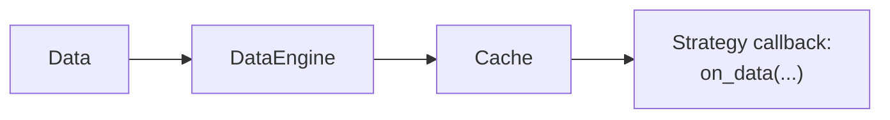

# 缓存 (Cache)

`Cache` 是一个核心的内存数据库 (in-memory database)，自动存储和管理所有与交易相关的数据。
可以将其视为交易系统的记忆——从市场数据到订单历史再到自定义计算，一切都存储在其中。

缓存具有以下几个关键用途：

1. **存储市场数据**：
   - 存储近期的市场历史记录（例如订单簿 (order book)、报价 (quote)、成交 (trade)、K线 (bar)）。
   - 让你的策略 (strategy) 能够访问当前和历史市场数据。

2. **跟踪交易数据**：
   - 维护完整的 `Order` 历史和当前执行状态。
   - 跟踪所有 `Position`（持仓）和 `Account`（账户）信息。
   - 存储 `Instrument`（金融工具）定义和 `Currency`（货币）信息。

3. **存储自定义数据**：
   - 你可以在 `Cache` 中存储任何用户自定义对象或数据，以供后续使用。
   - 支持在不同策略之间共享数据。

## 缓存的工作原理

**内置类型**：

- 系统会在数据流转过程中自动将其添加到 `Cache`。
- 在实盘 (live) 环境中，引擎异步地应用更新，因此在事件发生和其出现在 `Cache` 之间可能存在短暂延迟。
- 所有数据在到达策略的回调函数之前都会先经过 `Cache`——参见下图：



### 基本示例

在策略中，你可以通过 `self.cache` 访问 `Cache`。以下是一个典型示例：

:::note
在 `Strategy` 类中，`self` 指的是策略实例。
:::

```python
def on_bar(self, bar: Bar) -> None:
    # 当前 K线 通过参数 'bar' 提供

    # 从缓存中获取历史 K线
    last_bar = self.cache.bar(self.bar_type, index=0)        # 最新的 K线（实际上与 'bar' 参数相同）
    previous_bar = self.cache.bar(self.bar_type, index=1)    # 前一根 K线
    third_last_bar = self.cache.bar(self.bar_type, index=2)  # 倒数第三根 K线

    # 获取当前持仓信息
    if self.last_position_opened_id is not None:
        position = self.cache.position(self.last_position_opened_id)
        if position.is_open:
            # 检查持仓详情
            current_pnl = position.unrealized_pnl

    # 获取当前金融工具的所有未完成订单
    open_orders = self.cache.orders_open(instrument_id=self.instrument_id)
```

## 配置

使用 `CacheConfig` 类来配置 `Cache` 的行为和容量。
你可以将此配置提供给 `BacktestEngine` 或 `TradingNode`，具体取决于你的[环境上下文](architecture.md#environment-contexts)。

以下是配置 `Cache` 的基本示例：

```python
from nautilus_trader.config import CacheConfig, BacktestEngineConfig, TradingNodeConfig

# 用于回测
engine_config = BacktestEngineConfig(
    cache=CacheConfig(
        tick_capacity=10_000,  # 每个金融工具存储最近 10,000 个 Tick
        bar_capacity=5_000,    # 每种 K线 类型存储最近 5,000 根 K线
    ),
)

# 用于实盘交易
node_config = TradingNodeConfig(
    cache=CacheConfig(
        tick_capacity=10_000,
        bar_capacity=5_000,
    ),
)
```

:::tip
默认情况下，`Cache` 为每种 K线 类型保留最近 10,000 根 K线，为每个金融工具保留 10,000 个成交 Tick。
这些限制在内存使用和数据可用性之间提供了良好的平衡。如果你的策略需要更多历史数据，可以增加这些值。
:::

### 配置选项

`CacheConfig` 类支持以下参数：

```python
from nautilus_trader.config import CacheConfig

cache_config = CacheConfig(
    database: DatabaseConfig | None = None,  # 用于持久化的数据库配置
    encoding: str = "msgpack",               # 数据编码格式（'msgpack' 或 'json'）
    timestamps_as_iso8601: bool = False,     # 将时间戳存储为 ISO8601 字符串
    buffer_interval_ms: int | None = None,   # 批量操作的缓冲间隔
    use_trader_prefix: bool = True,          # 在键中使用交易者前缀
    use_instance_id: bool = False,           # 在键中包含实例 ID
    flush_on_start: bool = False,            # 启动时清空数据库
    drop_instruments_on_reset: bool = True,  # 重置时清除金融工具
    tick_capacity: int = 10_000,             # 每个金融工具存储的最大 Tick 数
    bar_capacity: int = 10_000,              # 每种 K线 类型存储的最大 K线 数
)
```

:::note
`encoding` 支持两种格式：

| | **msgpack**（默认） | **json** |
|---|---|---|
| 格式 | 二进制 | 文本 |
| 体积 | 更小（通常小 20–30%） | 更大 |
| 速度 | 序列化/反序列化更快 | 较慢 |
| 可读性 | 不可读（二进制） | 人类可读 |
| 调试 | 需要工具解码 | 可直接用 `redis-cli` 查看 |

**建议**：生产环境使用默认的 `msgpack` 以获得更好的性能；调试或开发时可切换为 `json` 以便直接查看 Redis 中的缓存内容。
:::

:::note
每种 K线 类型各自维护独立的容量。例如，如果你同时使用 1 分钟和 5 分钟 K线，每种类型最多存储 `bar_capacity` 根 K线。
当达到 `bar_capacity` 时，`Cache` 会自动移除最旧的数据。
:::

### 数据库配置

为了在系统重启之间实现持久化 (persistence)，你可以配置数据库后端。

在什么情况下使用持久化比较有用？

- **长时间运行的系统**：如果你希望数据在系统重启、升级或意外故障后仍然保留，配置数据库有助于从上次中断处继续。
- **历史分析**：当你需要保存过去的交易数据以进行详细的事后分析或审计时。
- **多节点或分布式部署**：如果多个服务或节点需要访问相同的状态，持久化存储有助于确保数据的共享和一致性。

```python
from nautilus_trader.config import DatabaseConfig

config = CacheConfig(
    database=DatabaseConfig(
        type="redis",      # 数据库类型
        host="localhost",  # 数据库主机
        port=6379,         # 数据库端口
        timeout=2,         # 连接超时（秒）
    ),
)
```

## 使用缓存

### 访问市场数据

`Cache` 提供了全面的接口来访问订单簿、报价、成交和 K线。
缓存中的所有市场数据使用反向索引，因此最新的条目位于索引 0。

#### 访问 K线

```python
# 获取某种 K线 类型的所有缓存 K线 列表
bars = self.cache.bars(bar_type)  # 返回 list[Bar]，如果没有找到 K线 则返回空列表

# 获取最新的 K线
latest_bar = self.cache.bar(bar_type)  # 返回 Bar 或 None（如果不存在该对象）

# 通过索引获取特定的历史 K线（0 = 最新）
second_last_bar = self.cache.bar(bar_type, index=1)  # 返回 Bar 或 None（如果不存在该对象）

# 检查 K线 是否存在并获取数量
bar_count = self.cache.bar_count(bar_type)  # 返回指定 K线 类型在缓存中的 K线 数量
has_bars = self.cache.has_bars(bar_type)    # 返回布尔值，表示指定 K线 类型是否存在 K线
```

#### 报价 Tick

```python
# 获取报价
quotes = self.cache.quote_ticks(instrument_id)                     # 返回 list[QuoteTick]，如果没有找到报价则返回空列表
latest_quote = self.cache.quote_tick(instrument_id)                # 返回 QuoteTick 或 None（如果不存在该对象）
second_last_quote = self.cache.quote_tick(instrument_id, index=1)  # 返回 QuoteTick 或 None（如果不存在该对象）

# 检查报价可用性
quote_count = self.cache.quote_tick_count(instrument_id)  # 返回该金融工具在缓存中的报价数量
has_quotes = self.cache.has_quote_ticks(instrument_id)    # 返回布尔值，表示该金融工具是否存在报价
```

#### 成交 Tick

```python
# 获取成交
trades = self.cache.trade_ticks(instrument_id)         # 返回 list[TradeTick]，如果没有找到成交则返回空列表
latest_trade = self.cache.trade_tick(instrument_id)    # 返回 TradeTick 或 None（如果不存在该对象）
second_last_trade = self.cache.trade_tick(instrument_id, index=1)  # 返回 TradeTick 或 None（如果不存在该对象）

# 检查成交可用性
trade_count = self.cache.trade_tick_count(instrument_id)  # 返回该金融工具在缓存中的成交数量
has_trades = self.cache.has_trade_ticks(instrument_id)    # 返回布尔值，表示是否存在成交
```

#### 订单簿

```python
# 获取当前订单簿
book = self.cache.order_book(instrument_id)  # 返回 OrderBook 或 None（如果不存在该对象）

# 检查订单簿是否存在
has_book = self.cache.has_order_book(instrument_id)  # 返回布尔值，表示订单簿是否存在

# 获取订单簿更新次数
update_count = self.cache.book_update_count(instrument_id)  # 返回已接收的更新次数
```

#### 价格访问

```python
from nautilus_trader.core.rust.model import PriceType

# 按类型获取当前价格；返回 Price 或 None。
price = self.cache.price(
    instrument_id=instrument_id,
    price_type=PriceType.MID,  # 选项：BID, ASK, MID, LAST
)
```

#### K线 类型

```python
from nautilus_trader.core.rust.model import PriceType, AggregationSource

# 获取某个金融工具所有可用的 K线 类型；返回 list[BarType]。
bar_types = self.cache.bar_types(
    instrument_id=instrument_id,
    price_type=PriceType.LAST,  # 选项：BID, ASK, MID, LAST
    aggregation_source=AggregationSource.EXTERNAL,
)
```

#### 简单示例

```python
class MarketDataStrategy(Strategy):
    def on_start(self):
        # 订阅 1 分钟 K线
        self.bar_type = BarType.from_str(f"{self.instrument_id}-1-MINUTE-LAST-EXTERNAL")  # instrument_id 示例 = "EUR/USD.FXCM"
        self.subscribe_bars(self.bar_type)

    def on_bar(self, bar: Bar) -> None:
        bars = self.cache.bars(self.bar_type)[:3]
        if len(bars) < 3:   # 等待至少有 3 根 K线
            return

        # 访问最近 3 根 K线 进行分析
        current_bar = bars[0]    # 最新的 K线
        prev_bar = bars[1]       # 倒数第二根 K线
        prev_prev_bar = bars[2]  # 倒数第三根 K线

        # 获取最新的报价和成交
        latest_quote = self.cache.quote_tick(self.instrument_id)
        latest_trade = self.cache.trade_tick(self.instrument_id)

        if latest_quote is not None:
            current_spread = latest_quote.ask_price - latest_quote.bid_price
            self.log.info(f"Current spread: {current_spread}")
```

### 交易对象

`Cache` 提供了对系统内所有交易对象的全面访问，包括：

- 订单 (Order)
- 持仓 (Position)
- 账户 (Account)
- 金融工具 (Instrument)

#### 订单

你可以通过多种方法访问和查询订单，并支持按交易场所 (venue)、策略、金融工具和订单方向进行灵活筛选。

##### 基本订单访问

```python
# 通过客户端订单 ID 获取特定订单
order = self.cache.order(ClientOrderId("O-123"))

# 获取系统中的所有订单
orders = self.cache.orders()

# 通过特定条件筛选订单
orders_for_venue = self.cache.orders(venue=venue)                       # 特定交易场所的所有订单
orders_for_strategy = self.cache.orders(strategy_id=strategy_id)        # 特定策略的所有订单
orders_for_instrument = self.cache.orders(instrument_id=instrument_id)  # 特定金融工具的所有订单
```

##### 订单状态查询

```python
# 按当前状态获取订单
open_orders = self.cache.orders_open()          # 当前在交易场所活跃的订单
closed_orders = self.cache.orders_closed()      # 已完成生命周期的订单
emulated_orders = self.cache.orders_emulated()  # 系统在本地模拟的订单
inflight_orders = self.cache.orders_inflight()  # 已提交（或修改）到交易场所但尚未确认的订单

# 检查特定订单状态
exists = self.cache.order_exists(client_order_id)            # 检查缓存中是否存在具有给定 ID 的订单
is_open = self.cache.is_order_open(client_order_id)          # 检查订单是否当前处于打开状态
is_closed = self.cache.is_order_closed(client_order_id)      # 检查订单是否已关闭
is_emulated = self.cache.is_order_emulated(client_order_id)  # 检查订单是否正在本地模拟
is_inflight = self.cache.is_order_inflight(client_order_id)  # 检查订单是否已提交或修改但尚未确认
```

##### 订单统计

```python
# 获取不同状态的订单数量
open_count = self.cache.orders_open_count()          # 未完成订单数量
closed_count = self.cache.orders_closed_count()      # 已关闭订单数量
emulated_count = self.cache.orders_emulated_count()  # 模拟订单数量
inflight_count = self.cache.orders_inflight_count()  # 在途订单数量
total_count = self.cache.orders_total_count()        # 系统中的订单总数

# 获取带筛选条件的订单数量
buy_orders_count = self.cache.orders_open_count(side=OrderSide.BUY)  # 当前未完成的买入订单数量
venue_orders_count = self.cache.orders_total_count(venue=venue)      # 给定交易场所的订单总数
```

#### 持仓

`Cache` 维护所有持仓的记录，并提供多种查询方式。

##### 持仓访问

```python
# 通过 ID 获取特定持仓
position = self.cache.position(PositionId("P-123"))

# 按状态获取持仓
all_positions = self.cache.positions()            # 系统中的所有持仓
open_positions = self.cache.positions_open()      # 所有当前未平仓持仓
closed_positions = self.cache.positions_closed()  # 所有已平仓持仓

# 通过各种条件筛选持仓
venue_positions = self.cache.positions(venue=venue)                       # 特定交易场所的持仓
instrument_positions = self.cache.positions(instrument_id=instrument_id)  # 特定金融工具的持仓
strategy_positions = self.cache.positions(strategy_id=strategy_id)        # 特定策略的持仓
long_positions = self.cache.positions(side=PositionSide.LONG)             # 所有多头持仓
```

##### 持仓状态查询

```python
# 检查持仓状态
exists = self.cache.position_exists(position_id)        # 检查是否存在具有给定 ID 的持仓
is_open = self.cache.is_position_open(position_id)      # 检查持仓是否未平仓
is_closed = self.cache.is_position_closed(position_id)  # 检查持仓是否已平仓

# 获取持仓和订单的关联关系
orders = self.cache.orders_for_position(position_id)       # 与特定持仓相关的所有订单
position = self.cache.position_for_order(client_order_id)  # 查找与特定订单关联的持仓
```

##### 持仓统计

```python
# 获取不同状态的持仓数量
open_count = self.cache.positions_open_count()      # 当前未平仓持仓数量
closed_count = self.cache.positions_closed_count()  # 已平仓持仓数量
total_count = self.cache.positions_total_count()    # 系统中的持仓总数

# 获取带筛选条件的持仓数量
long_positions_count = self.cache.positions_open_count(side=PositionSide.LONG)              # 未平仓多头持仓数量
instrument_positions_count = self.cache.positions_total_count(instrument_id=instrument_id)  # 给定金融工具的持仓数量
```

#### 账户

```python
# 访问账户信息
account = self.cache.account(account_id)       # 通过 ID 获取账户
account = self.cache.account_for_venue(venue)  # 获取特定交易场所的账户
account_id = self.cache.account_id(venue)      # 获取交易场所的账户 ID
accounts = self.cache.accounts()               # 获取缓存中的所有账户
```

#### 清除缓存状态

缓存暴露了显式的维护钩子，用于移除已关闭或过期的对象，同时保留安全检查：

- `purge_closed_orders(ts_now, buffer_secs=0, purge_from_database=False)` 删除已不活跃至少 `buffer_secs` 秒的已关闭订单。关联的条件单 (contingency order) 会保留，直到所有依赖的子订单都已关闭。
- `purge_closed_positions(ts_now, buffer_secs=0, purge_from_database=False)` 移除已超出缓冲窗口期的已平仓持仓，并删除关联的索引。
- `purge_account_events(ts_now, lookback_secs=0, purge_from_database=False)` 修剪回溯窗口之外的账户事件历史，并可级联删除到后端数据库。

关键安全机制：

- 未完成订单和未平仓持仓永远不会被清除；缓存会记录警告并保持该项目不变。
- 关联订单会将父订单保留在缓存中，直到所有子订单都已关闭，防止过早移除条件单链。
- 索引和反向查找会与主对象一起清理，以避免悬空引用。
- 只有当 `purge_from_database=True` 且已配置缓存数据库时，才会执行数据库删除，确保内存清除不会无声地擦除已持久化的数据。

在提供 `ts_now` 时使用交易时钟（例如 `self.clock.timestamp_ns()`）。仅在你打算同时从 Redis 或 PostgreSQL 中删除已持久化的记录时，才设置 `purge_from_database=True`。在实盘交易中，当执行引擎配置了清除间隔时，这些方法会自动运行；详见[内存管理](live.md#memory-management)中的调度器设置。

#### 金融工具和货币

##### 金融工具

```python
# 获取金融工具信息
instrument = self.cache.instrument(instrument_id) # 通过 ID 获取特定金融工具
all_instruments = self.cache.instruments()        # 获取缓存中的所有金融工具

# 筛选金融工具
venue_instruments = self.cache.instruments(venue=venue)              # 特定交易场所的金融工具
instruments_by_underlying = self.cache.instruments(underlying="ES")  # 按标的资产筛选金融工具

# 获取金融工具标识符
instrument_ids = self.cache.instrument_ids()                   # 获取所有金融工具 ID
venue_instrument_ids = self.cache.instrument_ids(venue=venue)  # 获取特定交易场所的金融工具 ID
```

##### 货币

```python
# 获取货币信息
currency = self.cache.load_currency("USD")  # 加载 USD 的货币数据
```

---

### 自定义数据

除了内置的市场数据和交易对象外，`Cache` 还可以存储和检索自定义数据类型。
使用它在系统组件之间共享任何用户自定义数据，主要用于 Actor 和策略之间。

#### 基本存储和检索

```python
# 在 Strategy 方法中调用此代码（`self` 指的是 Strategy）

# 存储数据
self.cache.add(key="my_key", value=b"some binary data")

# 检索数据
stored_data = self.cache.get("my_key")  # 返回 bytes 或 None
```

对于更复杂的用例，`Cache` 可以存储继承自 `nautilus_trader.core.Data` 基类的自定义数据对象。

:::warning
`Cache` 并非为完全替代数据库而设计。对于大型数据集或复杂查询需求，请考虑使用专用的数据库系统。
:::

## 最佳实践和常见问题

### 缓存与投资组合的使用对比

`Cache` 和 `Portfolio`（投资组合）组件在 NautilusTrader 中服务于不同但互补的目的：

**缓存**：

- 维护交易系统的历史知识和当前状态。
- 在本地状态变更时立即更新（例如，在提交订单前初始化订单）。
- 在外部事件发生时异步更新（例如，当订单被成交时）。
- 提供完整的交易活动和市场数据历史。
- 将策略接收到的每个事件保存在缓存中。

**投资组合**：

- 聚合持仓、敞口和账户信息。
- 提供当前状态，不包含历史记录。

**示例**：

```python
class MyStrategy(Strategy):
    def on_position_changed(self, event: PositionEvent) -> None:
        # 当你需要历史视角时使用缓存
        position_history = self.cache.position_snapshots(event.position_id)

        # 当你需要当前实时状态时使用投资组合
        current_exposure = self.portfolio.net_exposure(event.instrument_id)
```

### 缓存与策略变量的使用对比

在 `Cache` 中存储数据还是使用策略变量，取决于你的具体需求：

**缓存存储**：

- 用于需要在策略之间共享的数据。
- 最适合需要在系统重启之间持久化的数据。
- 作为所有组件可访问的中心数据库。
- 适用于需要在策略重置后保留的状态。

**策略变量**：

- 用于策略特定的计算。
- 更适合临时值和中间结果。
- 提供更快的访问速度和更好的封装性。
- 最适合仅你的策略需要的数据。

**示例**：

以下示例展示了如何在 `Cache` 中存储数据，以便多个策略可以访问相同的信息。

```python
import pickle

class MyStrategy(Strategy):
    def on_start(self):
        # 准备要与其他策略共享的数据
        shared_data = {
            "last_reset": self.clock.timestamp_ns(),
            "trading_enabled": True,
            # 包含你希望其他策略读取的任何其他字段
        }

        # 使用描述性的键将其存储在缓存中
        # 这样，多个策略可以调用 self.cache.get("shared_strategy_info")
        # 来检索相同的数据
        self.cache.add("shared_strategy_info", pickle.dumps(shared_data))

```

另一个策略可以按如下方式检索缓存的数据：

```python
import pickle

class AnotherStrategy(Strategy):
    def on_start(self):
        # 从相同的键加载共享数据
        data_bytes = self.cache.get("shared_strategy_info")
        if data_bytes is not None:
            shared_data = pickle.loads(data_bytes)
            self.log.info(f"Shared data retrieved: {shared_data}")
```
