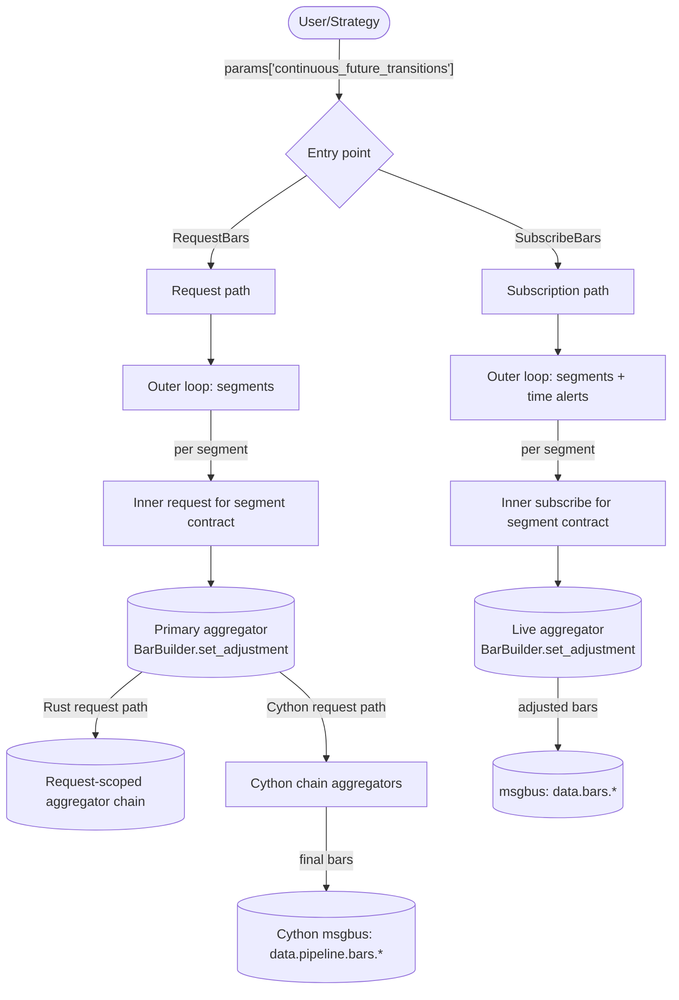
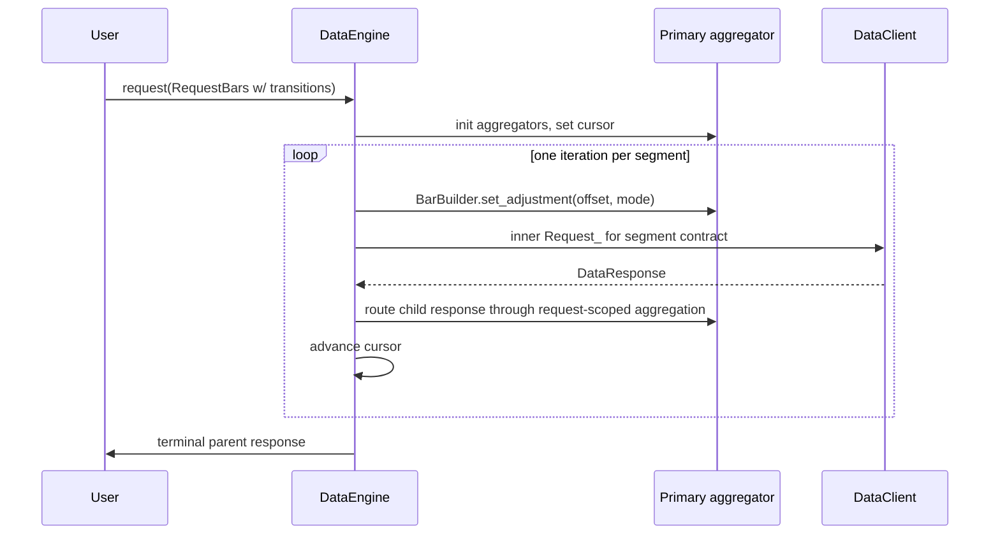
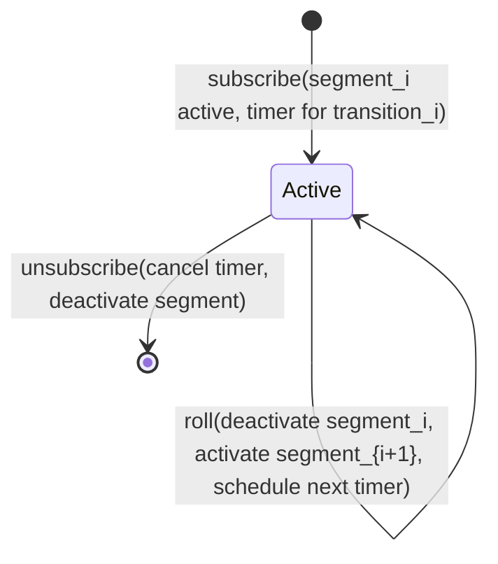
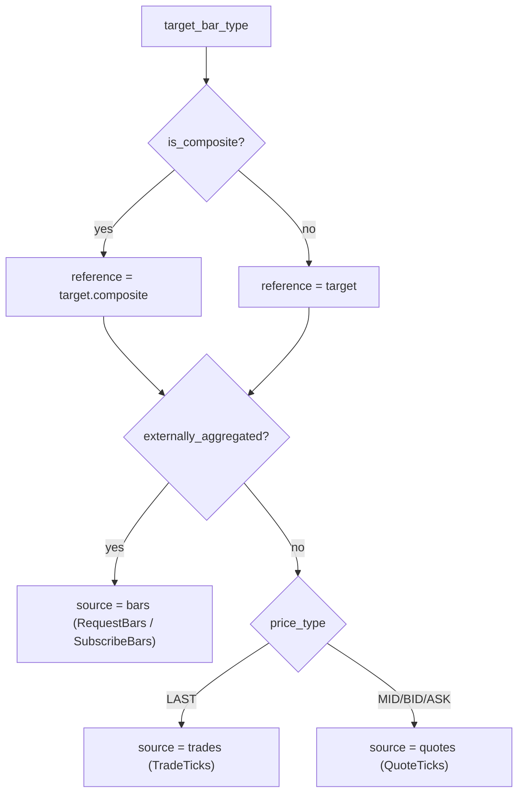
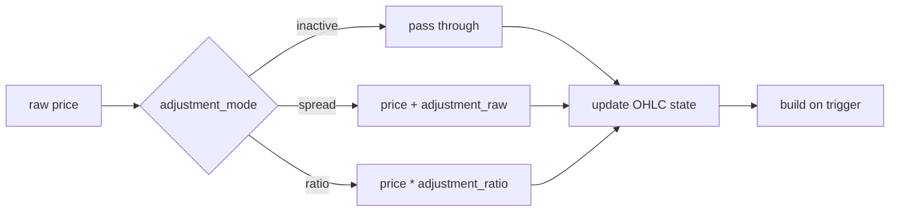

# 连续期货 (Continuous Futures)

连续期货是一个派生序列，它把连续的多个期货合约拼接成一条经过调整的价格流。每个底层合约都会到期；连续序列通过在过渡点滚动到下一个合约，并把历史价格平移到新合约的坐标框架中，从而保持活跃，使得最终的序列不会出现由滚动引发的跳变。

Nautilus 把连续期货建模为一个目标 `BarType`，加上一份在 request 或 subscribe 参数中显式提供的滚动过渡列表。数据引擎逐个遍历每个合约的分段，计算每个分段的累计价格调整量，并把经过调整的源数据送入正常的 bar 聚合路径。

## 调整模式 (Adjustment modes)

`ContinuousFutureAdjustmentType` 把方向（向后或向前）与操作（价差或比率）组合在一起：

| 模式              | 操作            | 锚定分段             |
|-------------------|-----------------|----------------------|
| `BACKWARD_SPREAD` | 加法            | 最新的合约           |
| `FORWARD_SPREAD`  | 加法            | 第一个合约           |
| `BACKWARD_RATIO`  | 乘法            | 最新的合约           |
| `FORWARD_RATIO`   | 乘法            | 第一个合约           |

在 `N` 个过渡中，第 `k` 个分段处的累计调整量为：

```text
BACKWARD_SPREAD: sum over i in [k, N) of (post_i - pre_i)
FORWARD_SPREAD:  sum over i in [0, k) of (pre_i - post_i)
BACKWARD_RATIO:  product over i in [k, N) of (post_i / pre_i)
FORWARD_RATIO:   product over i in [0, k) of (pre_i / post_i)
```

价差（spread）模式累加加法偏移量。比率（ratio）模式累乘乘法因子，并要求价格严格为正。

## 输入 (Inputs)

连续期货的 request 或 subscription，是指任何在 `params` 中携带 `continuous_future_transitions` 条目的 `RequestBars` 或 `SubscribeBars`：

```python
params = {
    "continuous_future_transitions": [
        {
            "transition_time_ns": 1773671460000000000,  # ESH26 滚动到 ESM26 的时刻
            "pre_instrument_id": "ESH26.XCME",
            "post_instrument_id": "ESM26.XCME",
            "pre_price": "6001.00",                     # 滚动前 ESH26 的最后价格
            "post_price": "5995.50",                    # 滚动后 ESM26 的首个价格
        },
        # ... 更多过渡 ...
    ],
    "continuous_future_adjustment_mode": ContinuousFutureAdjustmentType.BACKWARD_SPREAD,
    # 可选：把累计调整的上端封顶在 post_instrument_id 与之匹配的那个过渡处
    # （即向后模式的锚点）。
    # "last_post_instrument_id": "ESM26.XCME",
    # 可选：把累计调整的下端封顶在 pre_instrument_id 与之匹配的那个过渡处
    # （即向前模式的锚点）。
    # "first_pre_instrument_id": "ESM26.XCME",
}
```

request 或 command 上的 `bar_type` 是**目标**连续 bar 类型，例如 `"ES.XCME-1-MINUTE-LAST-INTERNAL@1-MINUTE-EXTERNAL"`。根标识符（`ES.XCME`）是连续根，而非真实合约。每个分段的原始源数据来自过渡列表中的真实合约。

连续目标 bar 类型必须是**内部聚合**的。外部聚合的 bar 不被支持作为连续目标，但它们可以充当每个分段的源。

### 有界链 (Bounded chains)

两个可选边界用于限制过渡表中处于活跃状态的部分：

- `last_post_instrument_id` 把上端封顶在第一个 `post_instrument_id` 与之匹配的过渡处。向后模式把它用作锚点（锚定分段的累计调整量为零）；向前模式用它来限制后续合约累计的范围。
- `first_pre_instrument_id` 把下端封顶在第一个 `pre_instrument_id` 与之匹配的过渡处。向前模式把它用作锚点；向后模式用它来限制更早合约累计的范围。

这让调用方可以传入一份较宽的过渡表，同时把调整后的序列锚定到任一侧的某个特定合约上。

## 校验 (Validation)

Rust 的 request 路径（`crates/data/src/engine/requests.rs`）以及 Cython 的 request 和 subscription 路径（`engine.pyx::_continuous_future_validate_transitions`）在分配任何聚合器之前，会先校验过渡参数：

- `continuous_future_adjustment_mode` 必须能解析为一个有效的 `ContinuousFutureAdjustmentType`。
- `continuous_future_transitions` 必须是由字典行构成的 list 或 tuple。
- 每一行都必须包含一个非负整数 `transition_time_ns`，并且各过渡时间必须严格递增。
- 每个 `pre_instrument_id` 和 `post_instrument_id` 都必须能解析为有效的 `InstrumentId`，且其交易所与目标交易所一致。
- 链必须是连续的：第 `i` 行的 `post_instrument_id` 必须等于第 `i + 1` 行的 `pre_instrument_id`。
- 每一行都必须包含有限的 `pre_price` 和 `post_price`。比率模式还额外要求两个价格都为正。
- 如果调用方提供了 `last_post_instrument_id`，它必须能解析为 `InstrumentId`、与目标交易所匹配，并且作为某个 `post_instrument_id` 出现在过渡列表中。`first_pre_instrument_id` 同理。

校验失败时，Rust 的 request 会在分配子分段状态之前返回错误。Cython 的 request 处理器会调用 `_abort_request` 以丢弃它已开始建立的工作流状态；Cython 的 subscription 路径则记录一条特定错误并返回。

## 目标 instrument 自动合成 (Target instrument auto-synthesis)

连续根（例如 `ES.XCME`）是一个合成 id，自身没有市场数据，但下游消费者（聚合器、缓存查找、序列化）仍然期望缓存中存在一个 `Instrument`。校验之后，Rust 的 request 路径以及 Cython 的 request 和 subscription 路径会确保目标 instrument 存在：

- 如果目标 id 已经被缓存，则目标设置是一个空操作。调用方可以预先注册一个自定义连续 instrument，引擎会尊重它。
- 否则，目标设置会从缓存中取出第一个分段的 instrument 并对其进行克隆，仅覆盖 `id`、`raw_symbol`，并把 `activation_ns` 和 `expiration_ns` 清零为 `0`。其余每一个字段（currency、precision、increment、multiplier、lot size、underlying、fees、margins、exchange、tick scheme、info）都从该分段复用。
- 如果第一个分段尚未在缓存中，或者它不是一个 `FuturesContract`，则该设置会记录一条警告并返回。此时调用方必须手动注册连续 instrument。

## 架构总览 (Architecture overview)



该设计有两个入口点，一种外层循环形态（遍历各分段），两种获取每个分段数据的方式（历史子请求或实时子订阅），以及一种调整机制（在每个分段边界处调用 `BarBuilder.set_adjustment`）。

## 分段 (Segments)

一个**分段**是由某个真实合约所拥有的一段连续时间切片。过渡把各分段分隔开。给定 `transitions[0..N)`：

- 分段 0：在 `transitions[0].pre_instrument_id` 上的 `(-inf, transitions[0].time)`。
- 分段 k（k 在 `[1, N)` 中）：在 `transitions[k].pre_instrument_id` 上的 `[transitions[k-1].time, transitions[k].time)`。
- 分段 N：在 `transitions[N-1].post_instrument_id` 上的 `[transitions[N-1].time, +inf)`。

request 和 subscription 路径会返回从 `cursor_ns` 开始、被钳制到 `end_ns` 的下一个分段。

## 请求流程 (Request flow)

request 路径在上一层镜像了 `_handle_long_request`：每次迭代触发一个内层 request，获取一个分段份量的数据，而内层请求的完成回调会推进游标。



如果调用方在 params 中设置了 `time_range_generator` 和 `durations_seconds`，则内层 request 会继承它们，并且自身也变成一个 long request，把该分段的时间范围切分成另外 N 个子-子请求。外层连续期货循环会忽略内层的这种分块：每个内层 request 仍然只会回传恰好一个合并响应，从而触发外层循环进入下一个分段。

### 链式聚合器 (Chain aggregators)

如果调用方设置了 `bar_types = (bar_type_1, bar_type_2)` 以进行多层内部聚合，则该设置会创建所有以 `parent.id` 为键的聚合器。Rust 的 request 路径把分段源响应路由进主连续目标，然后把发出的 bar 转发给匹配的、request 作用域内的下游聚合器。Cython 路径则在各层之间接线 pipeline 主题，使该链自动向上遍历。只有主构建器会被调用 `set_adjustment`；在两条路径中，更高层级都是对已经调整过的数据进行再聚合。

## 订阅流程 (Subscription flow)

一个小型状态机通过单个待处理时间提醒来驱动每个活跃订阅：



当一个过渡触发时，引擎会停用当前分段（取消订阅其源），激活下一个分段（解析新的源、应用新的偏移量、进行订阅），并为下一个过渡重新装填计时器。

## 源解析 (Source resolution)

对于任何连续期货目标 `BarType`，供给主聚合器的原始数据都位于**分段合约**上，而非连续 id 上。目标的形态决定了源的类型：



## BarBuilder 调整 (BarBuilder adjustment)

构建器会在每次 `update(price, ...)` 和 `update_bar(bar, ...)` 调用时**在入口处**施加调整。运行中的 OHLC 状态始终处于调整后的（公共）坐标框架中，因此在 bar 中途改变调整量只会影响后续的价格。无需进行部分 bar 的缓冲。



`BarBuilder` 只关心比率与价差之分，以此决定是做加法还是做乘法。引擎在调用 `set_adjustment` 之前，会把方向信息折叠成累计偏移量的符号与大小。`reset()` 方法会清除序列中下一根 bar 所需的每根 bar 的 OHLCV 状态，但会有意保留调整配置：滚动发生的频率远低于 bar 重置，因此调整被当作分段作用域的状态来对待。

## bar 中途的滚动边界 (Mid-bar roll boundary)

如果一次滚动落在一根正在进行的目标 bar 内部，构建器会保留当前的 OHLC 状态，并仅对后续的更新施加新的调整。边界之前的部分保持旧的偏移量；边界之后的部分使用新的偏移量。这是有意的策略：在每次滚动时重写运行中的 OHLC 将需要为每个分段缓冲原始输入，这会增加开销，而对于调整后分段在边界两侧被无缝构建这一常见情形而言，并不会改变调整后的结果。

## 局限性 (Limitations)

- 该特性要求提供过渡元数据。引擎不会发现滚动、选择合约或推断滚动价格：这是调用方的职责。
- 比率调整在热路径中会经过 `float`（`price_as_f64 * ratio` 然后得到 `price_new`）。对于高精度 instrument，相较于等价的 `Decimal` 乘法，舍入可能会使最终的原始值偏移 1 ULP。价差模式则是精确的，因为它直接作用于 `PriceRaw`（int64/int128）。
