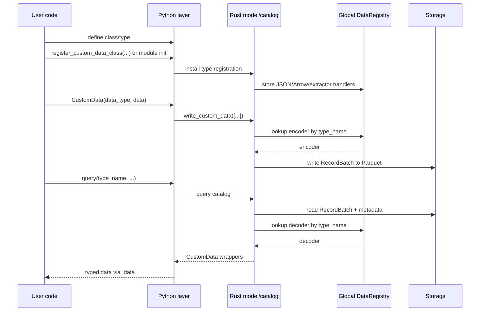
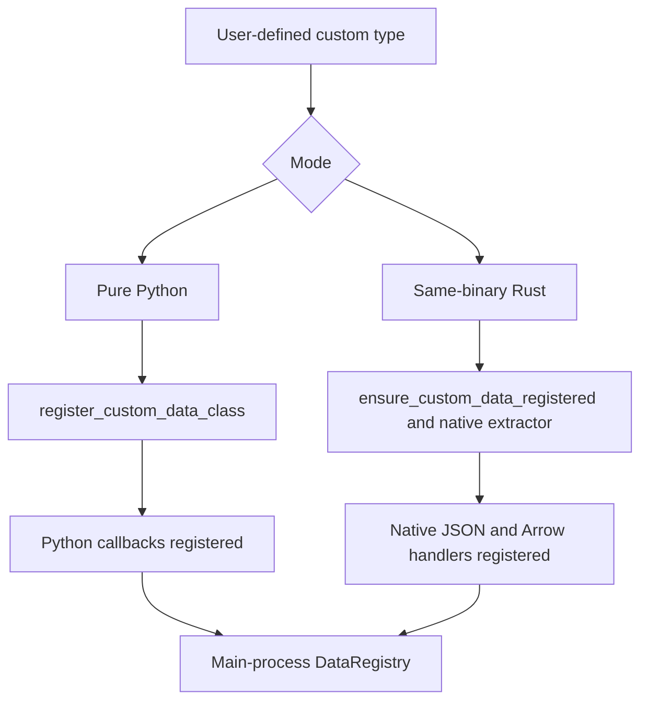
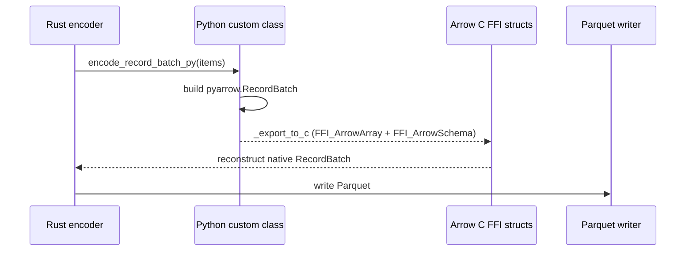

# 自定义数据 (Custom Data)

Nautilus Trader 支持使用 Python 和 Rust 编写的自定义数据，并让这些数据通过与平台其余部分相同的运行时、持久化和查询流水线流转。

本文档说明自定义数据如何：

- 在运行时注册。
- 跨 Python/Rust 边界进行封装。
- 序列化到 Arrow/Parquet 以及从中反序列化。
- 通过 actor 和策略进行路由。

## 目标

自定义数据架构满足以下需求：

- 允许用户用纯 Python 定义自定义数据，无需编写 Rust 代码。
- 允许 Rust 定义的自定义数据使用原生的 Rust JSON 和 Arrow 处理器。
- 在 PyO3 边界处保留单一的、面向用户的 `CustomData` 封装。
- 支持在 `ParquetDataCatalog` 中通过动态类型注册（而非硬编码 schema）进行持久化。
- 让自定义数据可以通过正常的数据引擎、actor 和策略订阅流程进行路由。

## 高层模型

支持两种编写模式：

| 模式              | 示例                                            | 注册路径                                       | 编码/解码路径              | 封装后端           |
|-------------------|----------------------------------------------------|---------------------------------------------------------|---------------------------------|---------------------------|
| 纯 Python       | `@customdataclass_pyo3` 类                      | `register_custom_data_class(...)`                       | Python 回调 + Arrow C FFI   | `PythonCustomDataWrapper` |
| 同二进制 Rust  | `#[custom_data]` 或 `#[custom_data(pyo3)]` 类型    | `ensure_custom_data_registered::<T>()` 加原生提取器 | 原生 Rust                 | 原生 Rust 载荷       |

两种模式都汇聚到同一个外层 PyO3 `CustomData` 封装，以及同一套 `DataType` 身份模型。

## 端到端流程

## 核心组件

### `DataRegistry`

`crates/model/src/data/registry.rs` 是主进程中自定义数据的中央运行时注册表模块。注册使用原子化的 `DashMap::entry()`，以确保并发的 `register_*` 和 `ensure_*` 调用不会发生竞态。

该模块包含若干以 `OnceLock` 初始化的 `DashMap` 单例：

- 以 `type_name` 为键的 JSON 反序列化器。
- 以 `type_name` 为键的 Arrow schema、编码器和解码器。
- 将 Python 对象转换为 `Arc<dyn CustomDataTrait>` 的 Python 提取器。
- 为同二进制类型生成 Python 提取器的 Rust 提取器工厂。

Nautilus 不会把每个类型硬编码进主二进制文件，而是在运行时利用存储在 `DataType` 和 Parquet 元数据中的 `type_name` 来解析处理器。

### `CustomData`

外层 PyO3 `CustomData` 封装是跨越 FFI 边界的通用容器。

构造函数签名：`CustomData(data_type, data)`，其中 `DataType` 在前，内部载荷在后。

它包含：

- 一个 `DataType`。
- 一个实现了 `CustomDataTrait` 的内部自定义载荷（封装在 `Arc<dyn CustomDataTrait>` 中）。

时间戳（`ts_event`、`ts_init`）被委托给内部的 `CustomDataTrait` 实现，并作为封装上的属性暴露出来。

在 Python 侧，`CustomData` 暴露值语义：实现了 `__eq__` 和 `__repr__`（相等性使用 Rust 的 `PartialEq` 逻辑）。实例被有意设计为不可哈希，以保证相等性与内部载荷的比较保持一致。

该封装在两种自定义数据模式之间共享。用户代码面对的是单一 API，即使底层载荷可能是：

- 一个 Python 支撑的封装。
- 一个同二进制 Rust 值。

#### `CustomData` JSON 信封

当序列化为 JSON 时（例如用于 `to_json_bytes` / `from_json_bytes`、SQL 缓存或 Redis），`CustomData` 使用单一的规范信封，使反序列化不依赖于用户载荷的字段名：

- `type`：自定义类型名（来自 `CustomDataTrait::type_name`）。
- `data_type`：一个包含 `type_name`、`metadata` 以及可选 `identifier` 的对象。
- `payload`：仅包含内部载荷（`CustomDataTrait::to_json` 的结果，被解析为一个值）。已注册的反序列化器在 `from_json` 中只接收这个值，因此用户结构体可以使用任意字段名（包括 `value`）而不与封装元数据冲突。

该信封由 Rust 的 `CustomData` 序列化产生，并在从 JSON 反序列化自定义数据时由 `DataRegistry` 消费。

### `DataType`

`DataType` 用于标识自定义数据，以便进行路由和持久化。

构造函数：`DataType(type_name, metadata=None, identifier=None)`。

它包括：

- `type_name`。
- 可选的 `metadata`。
- 可选的 `identifier`（仅用于 catalog 路径，不用于路由或相等性判断）。

相等性、哈希和主题路由仅由 `type_name` 和 `metadata` 推导得出。两个具有相同类型名和元数据但 identifier 不同的 `DataType` 值比较时相等，并发布到同一个消息总线主题。`identifier` 只影响 `data/custom/<type_name>/<identifier...>` 下的存储路径。

自定义数据的存储和查询使用 `DataType`，而不仅仅是裸的 Rust/Python 类名。这使得同一个逻辑类型可以在不同的元数据或 identifier 下存储，同时仍然通过同一个已注册的处理器进行解码。

## 注册架构

注册弥合了 Python 对象与 Rust trait 对象之间的鸿沟。

### 纯 Python 注册

当 Python 代码调用 `register_custom_data_class(MyType)` 时：

1. 该类型被注册到 Python 序列化层，以支持 JSON 和 Arrow。
2. Rust 注册一个 Python 提取器，将 Python 实例封装为 `PythonCustomDataWrapper`。
3. Rust 在 `DataRegistry` 中注册 Arrow schema/编码/解码回调。

这条路径灵活且对用户友好，但 Arrow 编码和重建依赖 Python 回调。

### 同二进制 Rust 注册

对于定义在 Nautilus 内部的 Rust 类型：

1. `#[custom_data]` 或 `#[custom_data(pyo3)]` 生成所需的 trait、JSON 和 Arrow 实现。
2. `ensure_custom_data_registered::<T>()` 将原生的 schema/编码器/解码器处理器插入 `DataRegistry`。
3. 对于通过 PyO3 暴露的类型，原生提取器可以把 Python 实例转换回具体的 Rust 类型，而不是退回到 Python 封装。

这条路径在编码/解码时完全保持原生 Rust。

### 注册优先级

`register_custom_data_class(...)` 按以下顺序解析类型：

1. 同二进制原生 Rust 注册。
2. 纯 Python 回退注册。

这一排序保证了对于主二进制文件已原生知晓的类型，优先选用可用的最快路径。

## 封装后端

在内部，外层 `CustomData` 封装可以持有不同的载荷实现。

### `PythonCustomDataWrapper`

用于纯 Python 自定义数据。

职责：

- 存储对 Python 对象的引用。
- 缓存 `ts_event`、`ts_init` 和 `type_name`。
- 实现 `CustomDataTrait`。
- 在持有 GIL 的情况下调用 Python 方法完成 JSON 和 Arrow 相关操作。

当主进程没有该类型的原生 Rust 表示时，这是回退路径。

### 原生同二进制 Rust 载荷

对于编译进 Nautilus 的 Rust 类型，内部载荷就是具体的 Rust 类型本身，可以直接从 `Arc<dyn CustomDataTrait>` 向下转型（downcast）得到。

序列化或解码无需任何 Python 回调路径。

## 持久化架构

### 为什么需要动态 Arrow 注册

Nautilus 内置的数据类型具有 Rust 二进制文件静态已知的 schema 和编码器。自定义数据则没有。因此持久化层使用已注册的 `type_name` 动态解析自定义数据。

### Catalog 写入流程

`ParquetDataCatalog` 期望自定义写入以 `CustomData` 值的形式传入。

自定义数据写入路径：

1. 从 `DataType` 中提取 `type_name`、`metadata` 和 `identifier`。
2. 在 `DataRegistry` 中查找 Arrow 编码器。
3. 将这些值编码为一个 `RecordBatch`。
4. 追加一个包含被持久化的 `DataType` 的 `data_type` 列。
5. 把 `type_name` 和元数据附加到 Arrow schema 上。
6. 将该批次写入自定义数据路径下的 Parquet。

路径布局为：

- `data/custom/<type_name>/<identifier...>`

identifier 在成为路径段之前会被归一化。

### Catalog 读取流程

查询时：

1. catalog 读取匹配的 Parquet 文件。
2. 从 schema 元数据中提取 `type_name`。
3. 向 `DataRegistry` 请求已注册的解码器。
4. 将 `RecordBatch` 解码为 `Vec<Data>`。
5. 用原始的 `DataType` 重建 `CustomData`。

这使得自定义数据的查询解析与写入时的注册对称。当把 Feather 流转换为 Parquet 时（例如回测之后），自定义数据分支会解码这些批次，并通过 `write_custom_data_batch` 将它们写出，从而保证通过 Feather writer 写入的自定义数据被正确转换为 Parquet。

## Arrow C FFI 桥

纯 Python 自定义数据无法直接提供原生的 Rust Arrow 编码逻辑。对于这类类型，Nautilus 使用 Arrow C FFI 接口在 Python 和 Rust 之间传递 `RecordBatch` 数据，且不带序列化开销。

### 纯 Python 编码路径

对于纯 Python 类：

1. Rust 获取 GIL。
2. Rust 在 Python 类上调用 `encode_record_batch_py(...)`。
3. Python 将对象转换为一个 `pyarrow.RecordBatch`。
4. Python 通过 `_export_to_c` 将该批次导出到 Arrow C FFI 结构体。
5. Rust 从这些 FFI 结构体重建一个原生 `RecordBatch` 并写出。

### 纯 Python 解码路径

反方向时：

1. Rust 将其 `RecordBatch` 转换为 Arrow C FFI 结构体。
2. Python 通过 `RecordBatch._import_from_c` 导入该批次。
3. Python 在该类上调用 `decode_record_batch_py(metadata, batch)`。
4. Rust 将返回的 Python 对象封装进 `PythonCustomDataWrapper`。

### 原生路径

Arrow C FFI 桥不用于同二进制 Rust 自定义数据。这些类型使用在主进程中注册的原生 Rust 编码/解码处理器。

## 查询时的重建

当从 catalog 加载回自定义数据时，重建方式取决于后端：

- 同二进制 Rust 类型直接解码为原生 Rust 值。
- 纯 Python 类型通过已注册的 Python 类，使用 `from_dict` 或 `from_json` 进行重建。

无论哪种情况，调用方在 PyO3 API 边界处都会收到同一个外层 `CustomData` 封装。

## 运行时集成

自定义数据不仅是一个持久化特性。它也参与 Nautilus 的运行时路由。

相关集成包括：

- `crates/data/src/engine/mod.rs` 通过消息总线发布 `CustomData`。
- `crates/common/src/msgbus/switchboard.rs` 从 `DataType` 推导自定义主题。
- `crates/common/src/actor/*` 将自定义数据路由到 actor 订阅中。
- `crates/trading/src/python/strategy.rs` 将自定义数据暴露给 Python 策略的 `on_data`。
- `crates/backtest/src/engine.rs` 将 `Data::Custom` 视为数据引擎投递的输入，而非交易所路由的数据。

一个已注册的自定义类型可以被持久化、查询、订阅和消费，所用的运行时接口与其他数据族相同。

## SQL 缓存与数据库集成

SQL 缓存/数据库层同样支持 `CustomData`。

当前行为：

- PostgreSQL 将自定义数据存储在 `custom` 表中。
- 存储的记录包含 `data_type`、`metadata`、`identifier` 以及完整的 JSON 载荷。
- 读取时使用 `CustomData::from_json_bytes(...)` 重建 `CustomData`。
- Python 的 SQL 绑定暴露了 `add_custom_data` 和 `load_custom_data`。
- Redis 缓存将自定义数据存储在键 `custom:<ts_init_020>:<uuid>` 下，值为完整的 `CustomData` JSON。
- Redis 的 `add_custom_data` 和 `load_custom_data` 按 `DataType`（type_name、metadata、identifier）过滤，并返回按 `ts_init` 排序的结果；这通过 PyO3 的 `RedisCacheDatabase` API 暴露。

## Cython 自定义数据

Cython 的 `@customdataclass` 系统与本架构是分离的。本文档描述的是 PyO3 自定义数据系统：

- PyO3 的 `CustomData`。
- 动态运行时注册。
- Arrow/Parquet 持久化。
- 原生 Rust 执行路径。

## 实际意义

这一架构赋予 Nautilus 两个重要特性：

1. 面向只想编写 Python 的用户的 Python 优先可扩展性。
2. 面向内置或编译型自定义类型的原生 Rust 性能。

最终结果是一个概念上统一的自定义数据系统，背后有两个后端，而不是为纯 Python 和纯 Rust 数据类型分设彼此隔离的功能孤岛。
