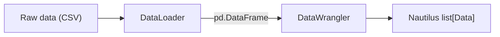

# 数据 (Data)

常见的内置数据类型 (data types) 包括：

- `OrderBookDelta` (L1/L2/L3)：表示最细粒度的订单簿 (order book) 更新。
- `OrderBookDeltas` (L1/L2/L3)：将多个订单簿增量数据批量处理以提高效率。
- `OrderBookDepth10`：聚合的订单簿快照（买卖双方各最多10档）。
- `QuoteTick`：表示盘口 (top-of-book) 的最优买价和卖价及其数量。
- `TradeTick`：交易对手之间的单笔成交/撮合事件。
- `Bar`：OHLCV（开盘价、最高价、最低价、收盘价、成交量）K线/蜡烛图，使用指定的*聚合方法 (aggregation method)*进行聚合。
- `MarkPriceUpdate`：金融工具 (instrument) 的当前标记价格（通常用于衍生品交易）。
- `IndexPriceUpdate`：金融工具的指数价格（用于标记价格计算的标的价格）。
- `FundingRateUpdate`：永续合约的资金费率（多空双方之间的定期支付）。
- `InstrumentStatus`：金融工具级别的状态事件。
- `InstrumentClose`：金融工具的收盘价。

完整的内置数据类和包装器集合请参见 API 参考文档。

NautilusTrader 主要设计用于处理细粒度的订单簿数据，为执行模拟提供最高的真实度。
回测 (backtest) 也可以基于任何受支持的行情数据 (market data) 类型进行，具体取决于所需的模拟精度。

当数据通过消息总线 (message bus) 流动时，可按主题寻址的数据都位于 `data`
根之下。实时数据流使用 `data.<kind>...`；数据管道路径使用
`data.pipeline.<kind>...`。主题层级 (topic hierarchy) 详见
[消息总线](message_bus.md#topic-hierarchy)。

## 订单簿

NautilusTrader 提供了一个用 Rust 实现的高性能订单簿，可根据提供的数据维护订单簿状态。

`OrderBook` 实例按金融工具维护，同时适用于回测和实盘交易 (live trading)，支持以下簿类型：

- `L3_MBO`：**逐笔委托 (Market by order, MBO)** 或 L3 数据，使用每个价格级别上的每笔订单簿事件，以订单 ID 为键。
- `L2_MBP`：**逐笔价格 (Market by price, MBP)** 或 L2 数据，按价格级别聚合订单簿事件。
- `L1_MBP`：**逐笔价格 (Market by price, MBP)** 或 L1 数据，也称为最优买卖报价 (BBO)，仅捕获顶层更新。

:::note
盘口数据（如 `QuoteTick`、`TradeTick` 和 `Bar`）也可用于回测，市场将以 `L1_MBP` 簿类型运行。
:::

### 增量标志与事件边界

每个 `OrderBookDelta` 都携带一个 `flags` 字段，使用 `RecordFlag` 位掩码值
向 `DataEngine` 标示事件边界：

- `F_LAST`：标记一个逻辑事件组中的最后一个增量。当启用 `buffer_deltas`
  时，`DataEngine` 会累积增量，仅在遇到 `F_LAST` 时才向订阅者发布。
  每个事件组**必须**以一个设置了 `F_LAST` 的增量结束。
- `F_SNAPSHOT`：标记属于快照（而非增量更新）的增量。快照序列以一个
  `Clear` 动作开始，随后是一系列重建完整簿状态的 `Add` 增量。快照中的最后一个
  增量同时设置了 `F_SNAPSHOT | F_LAST`。

:::warning
事件组中最后一个增量缺失 `F_LAST` 会导致带缓冲的消费者无限累积增量而不发布。
这同时适用于增量更新和快照，包括仅发出一个 `Clear` 增量的空簿快照。
:::

## 金融工具

所有行情数据都归属于某个金融工具。金融工具定义提供了使数据具有意义的身份标识、
精度、价格和数量增量、限制、货币以及合约语义。

金融工具的分类法及各类型的指南请参见[金融工具](instruments/)。

## K线与聚合

### K线简介

*K线 (bar)*（也称为蜡烛图、K线图或 kline）是一种表示特定时段内价格和成交量信息的数据结构，包括：

- 开盘价
- 最高价
- 最低价
- 收盘价
- 成交量（或以 Tick 数作为成交量的替代）

系统使用*聚合方法*根据特定条件对数据进行分组来生成 K线。

### 数据聚合的目的

NautilusTrader 中的数据聚合将细粒度的行情数据转换为结构化的 K线或蜡烛图，原因如下：

- 为技术指标和策略 (strategy) 开发提供数据。
- 时间聚合数据（如分钟 K线）通常已能满足许多策略的需求。
- 与高频 L1/L2/L3 行情数据相比，成本更低。

### 聚合方法

平台实现了多种聚合方法：

| 名称               | 描述                                                                       | 类别         |
|:-------------------|:---------------------------------------------------------------------------|:-------------|
| `TICK`             | 按一定数量的 Tick 进行聚合。                                                | 阈值         |
| `TICK_IMBALANCE`   | 按 Tick 的买卖不平衡进行聚合。                                              | 阈值         |
| `TICK_RUNS`        | 按 Tick 的连续买卖序列进行聚合。                                            | 信息         |
| `VOLUME`           | 按成交量进行聚合。                                                          | 阈值         |
| `VOLUME_IMBALANCE` | 按成交量的买卖不平衡进行聚合。                                              | 阈值         |
| `VOLUME_RUNS`      | 按成交量的连续买卖序列进行聚合。                                            | 信息         |
| `VALUE`            | 按交易名义价值进行聚合（也称为"美元 K线"）。                                | 阈值         |
| `VALUE_IMBALANCE`  | 按名义价值交易的买卖不平衡进行聚合。                                        | 阈值         |
| `VALUE_RUNS`       | 按名义价值交易的连续买卖序列进行聚合。                                      | 信息         |
| `RENKO`            | 基于固定价格变动（以 Tick 为砖块大小）进行聚合。                            | 阈值         |
| `MILLISECOND`      | 按毫秒粒度的时间间隔聚合。                                                  | 时间         |
| `SECOND`           | 按秒粒度的时间间隔聚合。                                                    | 时间         |
| `MINUTE`           | 按分钟粒度的时间间隔聚合。                                                  | 时间         |
| `HOUR`             | 按小时粒度的时间间隔聚合。                                                  | 时间         |
| `DAY`              | 按天粒度的时间间隔聚合。                                                    | 时间         |
| `WEEK`             | 按周粒度的时间间隔聚合。                                                    | 时间         |
| `MONTH`            | 按月粒度的时间间隔聚合。                                                    | 时间         |
| `YEAR`             | 按年粒度的时间间隔聚合。                                                    | 时间         |

### 信息驱动型 K线

信息驱动型 K线根据市场活跃度调整其采样频率，而非使用固定间隔。它们基于*主动方
(aggressor side)*（即成交的发起方是买方还是卖方）的概念，分为两个系列：**不平衡 (imbalance)**
和**连续 (runs)**。

**不平衡 K线**在*净*买卖活动达到阈值时收线。每笔成交贡献一个带符号的值：买方发起的成交为正，
卖方发起的为负。当不平衡的绝对值达到配置的步长时，K线收线。这意味着方向相反的成交会相互抵消，
因此不平衡 K线在均衡市场中形成较慢，而在单边行情中形成较快。

**连续 K线**在来自同一主动方的*连续*活动达到阈值时收线。与不平衡 K线不同，连续 K线在
主动方切换时会重置计数器。这使它对持续的单边压力（而非净不平衡）更为敏感。

两个系列根据所衡量的对象各有三个变体：

| 变体    | 不平衡             | 连续          | 衡量对象                            |
|:--------|:-------------------|:--------------|:------------------------------------|
| Tick    | `TICK_IMBALANCE`   | `TICK_RUNS`   | 成交笔数（每笔成交计为 1）           |
| Volume  | `VOLUME_IMBALANCE` | `VOLUME_RUNS` | 成交量（数量）                       |
| Value   | `VALUE_IMBALANCE`  | `VALUE_RUNS`  | 名义价值（价格 x 数量）              |

:::note
信息驱动型 K线需要 `TradeTick` 数据，因为它们需要 `aggressor_side` 字段来对每笔成交进行分类。
它们无法仅从 `QuoteTick` 数据聚合得到。
:::

### 聚合类型

NautilusTrader 实现了三种不同的数据聚合方法：

1. **成交到 K线聚合**：从 `TradeTick` 对象（已执行的成交）创建 K线
   - 用例：用于分析成交价格的策略，或直接使用成交数据时。
   - K线规格 (bar specification) 中始终使用 `LAST` 价格类型。

2. **报价到 K线聚合**：从 `QuoteTick` 对象（买卖报价）创建 K线
   - 用例：用于关注买卖价差或市场深度分析的策略。
   - K线规格中使用 `BID`、`ASK` 或 `MID` 价格类型。

3. **K线到 K线聚合**：从较小时间框架的 `Bar` 对象创建较大时间框架的 `Bar` 对象
   - 用例：将现有的较小时间框架 K线（1分钟）重采样为较大时间框架（5分钟、小时）。
   - 规格中始终需要使用 `@` 符号。

### K线类型

NautilusTrader 基于以下组件定义唯一的 *K线类型 (bar type)*（`BarType` 类）：

- **金融工具 ID** (`InstrumentId`)：指定 K线对应的特定金融工具。
- **K线规格** (`BarSpecification`)：
  - `step`：定义每根 K线的间隔或频率。
  - `aggregation`：指定数据聚合所使用的方法（见上表）。
  - `price_type`：指示 K线的价格基准（如 bid、ask、mid、last）。
- **聚合来源** (`AggregationSource`)：指示 K线是在内部（Nautilus 内部）聚合的，
  还是在外部（由交易场所 (venue) 或数据提供商）聚合的。

:::note
`BarSpecification` 会校验固定子单位的时间聚合，以确保 K线能与其父级时钟或日历单位整齐对齐。
`MILLISECOND` 步长必须能整除 1000 且小于 1000；`SECOND` 和 `MINUTE` 步长必须能整除 60 且小于 60；
`HOUR` 步长必须能整除 24 且小于 24；`MONTH` 步长必须能整除 12 且小于 12。当步长等于一个父级单位时，
请使用更大的聚合方法，例如用 `1-HOUR` 而非 `60-MINUTE`。`DAY`、`WEEK`、`YEAR`、阈值、信息和
`RENKO` 型 K线不受此固定子单位规则限制。

未来版本将允许高级用户为不对齐到时钟或日历边界的任意 K线周期覆盖此校验。
:::

K线类型还可以分为*标准型*或*复合型*：

- **标准型**：从细粒度行情数据生成，如报价 Tick 或成交 Tick。
- **复合型**：通过对更高粒度的 K线类型进行子采样推导而来（如从1分钟 K线聚合出5分钟 K线）。

### 聚合来源

K线数据聚合可以是*内部*或*外部*的：

- `INTERNAL`：K线在本地 Nautilus 系统边界内聚合。
- `EXTERNAL`：K线在本地 Nautilus 系统边界外聚合（通常由交易场所或数据提供商完成）。

对于 K线到 K线聚合，目标 K线类型始终为 `INTERNAL`（因为聚合在 NautilusTrader 内部完成），
但源 K线可以是 `INTERNAL` 或 `EXTERNAL`，即可以聚合外部提供的 K线，也可以聚合已在内部聚合过的 K线。

### 使用*字符串语法*定义 K线类型

#### 标准 K线

可以使用以下约定从字符串定义标准 K线类型：

`{instrument_id}-{step}-{aggregation}-{price_type}-{INTERNAL | EXTERNAL}`

例如，定义一个在纳斯达克 (XNAS) 上 AAPL 成交数据（最新价）的 `BarType`，使用5分钟间隔，
由 Nautilus 在本地从成交数据聚合：

```python
bar_type = BarType.from_str("AAPL.XNAS-5-MINUTE-LAST-INTERNAL")
```

#### 复合 K线

复合 K线通过将更高粒度的 K线聚合为目标 K线类型来生成。使用以下约定定义复合 K线：

`{instrument_id}-{step}-{aggregation}-{price_type}-INTERNAL@{step}-{aggregation}-{INTERNAL | EXTERNAL}`

**注意**：

- 派生 K线类型必须使用 `INTERNAL` 聚合来源（因为这是 K线的聚合方式）。
- 采样 K线类型必须具有比派生 K线类型更高的粒度。
- 采样金融工具 ID 被推断为与派生 K线类型的金融工具 ID 相同。
- 复合 K线可以从 `INTERNAL` 或 `EXTERNAL` 聚合来源进行聚合。

例如，定义一个在纳斯达克 (XNAS) 上 AAPL 成交数据（最新价）的 `BarType`，使用5分钟间隔，
由 Nautilus 在本地聚合，数据源为外部聚合的1分钟间隔 K线：

```python
bar_type = BarType.from_str("AAPL.XNAS-5-MINUTE-LAST-INTERNAL@1-MINUTE-EXTERNAL")
```

### 聚合语法示例

`BarType` 字符串格式同时编码了目标 K线类型和（可选的）源数据类型：

```
{instrument_id}-{step}-{aggregation}-{price_type}-{source}@{step}-{aggregation}-{source}
```

`@` 符号后的部分是可选的，仅用于 K线到 K线聚合：

- **不带 `@`**：从 `TradeTick` 对象聚合（当 price_type 为 `LAST` 时）或从 `QuoteTick` 对象聚合（当 price_type 为 `BID`、`ASK` 或 `MID` 时）。
- **带 `@`**：从现有 `Bar` 对象聚合（指定源 K线类型）。

#### 成交到 K线示例

```python
def on_start(self) -> None:
    # 定义从 TradeTick 对象聚合的 K线类型
    # 使用 price_type=LAST 表示以 TradeTick 数据为源
    bar_type = BarType.from_str("6EH4.XCME-50-VOLUME-LAST-INTERNAL")
    start = self.clock.utc_now() - timedelta(days=30)

    # 请求历史数据（将在 on_historical_data 处理器中接收 K线）
    self.request_bars(bar_type, start=start)

    # 订阅实时数据（将在 on_bar 处理器中接收 K线）
    self.subscribe_bars(bar_type)
```

#### 报价到 K线示例

```python
def on_start(self) -> None:
    # 从 ASK 价格（QuoteTick 对象中的）创建1分钟 K线
    bar_type_ask = BarType.from_str("6EH4.XCME-1-MINUTE-ASK-INTERNAL")

    # 从 BID 价格（QuoteTick 对象中的）创建1分钟 K线
    bar_type_bid = BarType.from_str("6EH4.XCME-1-MINUTE-BID-INTERNAL")

    # 从 MID 价格（QuoteTick 对象中 ASK 和 BID 价格的中间值）创建1分钟 K线
    bar_type_mid = BarType.from_str("6EH4.XCME-1-MINUTE-MID-INTERNAL")
    start = self.clock.utc_now() - timedelta(days=30)

    # 请求历史数据并订阅实时数据
    self.request_bars(bar_type_ask, start=start)  # 历史 K线在 on_historical_data 中处理
    self.subscribe_bars(bar_type_ask)  # 实时 K线在 on_bar 中处理
```

#### K线到 K线示例

```python
def on_start(self) -> None:
    # 从1分钟 K线（Bar 对象）创建5分钟 K线
    # 格式：target_bar_type@source_bar_type
    # 注意：价格类型 (LAST) 仅在左侧目标部分需要，源部分不需要
    bar_type = BarType.from_str("6EH4.XCME-5-MINUTE-LAST-INTERNAL@1-MINUTE-EXTERNAL")
    start = self.clock.utc_now() - timedelta(days=30)

    # 通过提供依赖顺序的聚合链请求历史数据
    self.request_aggregated_bars([bar_type], start=start)

    # 订阅实时更新（在 on_bar(...) 处理器中处理）
    self.subscribe_bars(bar_type)
```

#### 高级 K线到 K线示例

可以创建复杂的聚合链，从已聚合的 K线再次聚合：

```python
# 首先从 TradeTick 对象创建1分钟 K线（LAST 表示 TradeTick 数据源）
primary_bar_type = BarType.from_str("6EH4.XCME-1-MINUTE-LAST-INTERNAL")

# 然后从1分钟 K线创建5分钟 K线
# 注意 @1-MINUTE-INTERNAL 部分标识了源 K线
intermediate_bar_type = BarType.from_str("6EH4.XCME-5-MINUTE-LAST-INTERNAL@1-MINUTE-INTERNAL")

# 然后从5分钟 K线创建小时 K线
# 注意 @5-MINUTE-INTERNAL 部分标识了源 K线
hourly_bar_type = BarType.from_str("6EH4.XCME-1-HOUR-LAST-INTERNAL@5-MINUTE-INTERNAL")
```

### 使用 K线：请求与订阅

NautilusTrader 提供两种不同的 K线操作方式：

- **`request_bars()`**：获取标准 `BarType` 的历史数据，由 `on_historical_data()`
  处理器处理。
- **`request_aggregated_bars()`**：获取依赖顺序的 K线类型列表的历史数据，
  并即时构建内部 K线。
- **`subscribe_bars()`**：建立实时数据流，由 `on_bar()` 处理器处理。
  它要求 `BarType` 对应的金融工具已经加载到缓存 (cache) 中。

报价、成交、订单簿及其他实时订阅同样适用上述缓存前提条件。

这些方法在典型工作流中配合使用：

1. 首先，`request_bars()` 加载历史数据，以过去的市场行为初始化指标或策略状态。
2. 然后，`subscribe_bars()` 确保策略继续实时接收新形成的 K线。

`on_start()` 中的使用示例：

```python
def on_start(self) -> None:
    # 定义 K线类型
    bar_type = BarType.from_str("6EH4.XCME-5-MINUTE-LAST-INTERNAL")
    start = self.clock.utc_now() - timedelta(days=30)

    # 在请求历史数据之前注册指标，以便它们也能接收历史更新
    self.register_indicator_for_bars(bar_type, self.my_indicator)

    # 请求历史数据以初始化指标
    # 这些 K线将传递到策略的 on_historical_data(...) 处理器
    self.request_bars(bar_type, start=start)

    # 订阅实时更新
    # 新 K线将传递到策略的 on_bar(...) 处理器
    self.subscribe_bars(bar_type)
```

策略中接收数据所需的处理器：

```python
def on_historical_data(self, data):
    # 处理来自 request_bars() 或 request_aggregated_bars() 的历史 Data 对象
    # 注意：通过 register_indicator_for_bars 注册的指标
    # 会自动使用历史数据进行更新
    pass

def on_bar(self, bar):
    # 处理来自 subscribe_bars() 的实时单根 K线
    # 注册到此 K线类型的指标将自动更新，且会在调用此处理器之前完成更新
    pass
```

### 带聚合的历史数据请求

在为回测或初始化指标请求历史 K线时，对标准 K线类型使用 `request_bars()`，
对即时聚合使用 `request_aggregated_bars()`：

```python
start = self.clock.utc_now() - timedelta(days=30)

# 请求原始1分钟 K线（由 LAST 价格类型指示，从 TradeTick 对象聚合）
self.request_bars(
    BarType.from_str("6EH4.XCME-1-MINUTE-LAST-EXTERNAL"),
    start=start,
)

# 请求从历史成交 Tick 聚合的 K线
self.request_aggregated_bars(
    [BarType.from_str("6EH4.XCME-100-VOLUME-LAST-INTERNAL")],
    start=start,
)

# 请求从1分钟 K线聚合的5分钟 K线
self.request_aggregated_bars(
    [BarType.from_str("6EH4.XCME-5-MINUTE-LAST-INTERNAL@1-MINUTE-EXTERNAL")],
    start=start,
)
```

### 常见陷阱

**在请求数据之前注册指标**：确保在请求历史数据之前注册指标，以便它们能正确更新。

```python
start = self.clock.utc_now() - timedelta(days=30)

# 正确顺序
self.register_indicator_for_bars(bar_type, self.ema)
self.request_bars(bar_type, start=start)

# 错误顺序
self.request_bars(bar_type, start=start)  # 指标将不会接收到历史数据
self.register_indicator_for_bars(bar_type, self.ema)
```

### 性能考量

K线聚合器通过定点 `Price` 类型跟踪 OHLC 价格。Tick 和成交量聚合器的阈值比较使用整数运算，
而基于价值的聚合器以及不平衡/连续聚合器目前对名义价值和带符号累加使用 `f64`（这些正在迁移到
定点整数运算）。聚合方法的选择对每次更新的开销有适度影响：

- **时间 K线**对高吞吐量数据最为高效。聚合器在每次更新时累积 OHLCV 状态；K线的发出由定时器
  驱动，而非逐 Tick 逻辑。
- **阈值 K线**（Tick、成交量、价值）在每次更新时增加一个轻量级的计数器或累加器检查。当单笔大额成交
  超过剩余阈值时，成交量和价值型 K线可能会将其拆分到多根 K线中。
- **信息驱动型 K线**（不平衡、连续）需要在每次更新时跟踪主动方和带符号累加。其开销略高于阈值 K线，
  但仍然很小。
- **Renko K线**由价格驱动，单次大幅价格变动可发出多根 K线。除此之外，其每次更新的成本与阈值 K线相当。
- **复合 K线**（K线到 K线）是在已有较低时间框架 K线时生成更高时间框架 K线的最高效方式，因为每根输入
  K线代表的是一个已聚合的时段，而非单个 Tick。

### 时间 K线配置

时间 K线的行为通过 `DataEngineConfig` 控制。以下选项适用于所有基于时间的聚合（从毫秒到年）：

| 选项                                | 类型   | 默认值        | 描述                                                                                                          |
|:------------------------------------|:-------|:--------------|:------------------------------------------------------------------------------------------------------------|
| `time_bars_interval_type`           | `str`  | `"left-open"` | `"left-open"`：排除起点、包含终点。`"right-open"`：包含起点、排除终点。                                       |
| `time_bars_timestamp_on_close`      | `bool` | `True`        | 为 `True` 时，`ts_event` 为 K线收盘时间。为 `False` 时，`ts_event` 为 K线开盘时间。                          |
| `time_bars_skip_first_non_full_bar` | `bool` | `False`       | 当聚合从某个时段中途开始时跳过该 K线的发出，避免启动时出现不完整的 K线。                                      |
| `time_bars_build_with_no_updates`   | `bool` | `True`        | 为 `True` 时，即使该时段内没有市场更新到达，也会发出 K线。                                                    |
| `time_bars_origin_offset`           | `dict` | `None`        | 将 `BarAggregation` 类型映射到 `pd.Timedelta` 或 `pd.DateOffset` 值，用于偏移 K线对齐（如对齐到 09:30 开盘）。 |
| `time_bars_build_delay`             | `int`  | `0`           | 构建 K线前的延迟（微秒）。在回测中很有用，可确保 K线边界时间戳处的数据在定时器触发前已被处理。                |

```python
from nautilus_trader.data.config import DataEngineConfig

config = DataEngineConfig(
    time_bars_timestamp_on_close=True,
    time_bars_build_with_no_updates=False,
    time_bars_skip_first_non_full_bar=True,
)
```

## 时间戳

平台使用两个基础时间戳 (timestamp) 字段，出现在许多对象中，包括行情数据、订单 (order) 和事件。
这些时间戳具有不同的用途，有助于在整个系统中维护精确的时间信息：

- `ts_event`：UNIX 时间戳（纳秒），表示事件实际发生的时间。
- `ts_init`：UNIX 时间戳（纳秒），表示 Nautilus 创建代表该事件的内部对象的时间。

### 示例

| **事件类型**     | **`ts_event`**                                        | **`ts_init`** |
| -----------------| ------------------------------------------------------| --------------|
| `TradeTick`      | 成交在交易所发生的时间。                                | Nautilus 接收到成交数据的时间。 |
| `QuoteTick`      | 报价在交易所发生的时间。                                | Nautilus 接收到报价数据的时间。 |
| `OrderBookDelta` | 订单簿更新在交易所发生的时间。                          | Nautilus 接收到订单簿更新的时间。 |
| `Bar`            | K线收盘的时间（精确到分钟/小时）。                       | Nautilus 生成（内部 K线）或接收到 K线数据（外部 K线）的时间。 |
| `DefiData`       | 区块或资金池事件发生的时间。                            | Nautilus 从链上数据创建对象的时间。 |
| `OrderFilled`    | 订单在交易所被成交的时间。                              | Nautilus 接收并处理成交确认的时间。 |
| `OrderCanceled`  | 撤单在交易所被处理的时间。                              | Nautilus 接收并处理撤单确认的时间。 |
| `NewsEvent`      | 新闻发布的时间。                                       | Nautilus 中事件对象被创建（内部事件）或接收（外部事件）的时间。 |
| 自定义事件       | 事件条件实际发生的时间。                                | Nautilus 中事件对象被创建（内部事件）或接收（外部事件）的时间。 |

:::note
`ts_init` 字段表示的概念比事件的"接收时间"更为广泛。
它表示对象（如数据点或命令）在 Nautilus 内部被初始化时的时间戳。
这一区分很重要，因为 `ts_init` 不仅限于"接收的事件"——它适用于任何内部初始化过程。

例如，`ts_init` 字段也用于命令，而命令不涉及接收的概念。
这种更广泛的定义确保了系统中各类对象的初始化时间戳处理方式的一致性。
:::

### 延迟分析

双时间戳系统使平台内的延迟分析成为可能：

- 延迟可以通过 `ts_init - ts_event` 计算。
- 该差值代表总系统延迟，包括网络传输时间、处理开销和任何排队延迟。
- 需要注意的是，产生这些时间戳的时钟很可能没有同步。

### 环境特定行为

#### 回测环境

- 数据按 `ts_init` 使用稳定排序进行排序。
- DeFi 数据 (`DefiData`) 在 `ts_init` 相同时按链上位置（区块号、交易索引、日志索引）打破平局，
  以使来自同一区块的事件按规范的链上顺序回放。
- 此行为确保了确定性的处理顺序，并模拟了包含延迟在内的真实系统行为。

#### 实盘交易环境

- 系统在数据到达时即进行处理，以最小化延迟并实现实时决策。
  - 对于来自交易场所的数据，`ts_init` 通常是 Nautilus 在收到更新后创建本地对象的时间。
  - `ts_event` 反映事件在外部发生的时间，便于在外部事件时间和系统接收时间之间进行准确比较。
- 可以使用 `ts_init` 和 `ts_event` 之间的差值来检测网络或处理延迟。

### 其他注意事项

- 对于来自外部源的数据，`ts_init` 通常是本地接收或归一化的时间，但由于时钟偏差，不能保证它一定
  大于或等于 `ts_event`。
- 对于在 Nautilus 内部创建的数据，`ts_init` 和 `ts_event` 可以相同，因为对象的初始化与事件发生在同一时刻。
- 并非每个具有 `ts_init` 字段的类型都一定有 `ts_event` 字段。这反映了以下情况：
  - 对象的初始化与事件本身同时发生。
  - 外部事件时间的概念不适用。

#### 持久化数据

`ts_init` 字段保留了原始的初始化时间戳。对于交易场所数据，这通常是接收时间；对于内部创建的数据，
则是该对象的创建时间。

## 数据流

从 `DataEngine` 开始，无论
[环境上下文](architecture.md#environment-contexts)（回测、沙盒、实盘）如何，
数据都遵循相同的路径。在实盘和沙盒模式下，交易场所适配器创建一个归一化的数据
对象并通过通道发送；在回测中，引擎直接馈送数据。无论哪种方式，`DataEngine`
都会将其存储到 `Cache`（针对可缓存类型）中，并在 `MessageBus` 上发布给已订阅的处理器。
逐步追踪及时序图请参见
[数据流：一个报价 Tick 的一生](architecture.md#data-flow-life-of-a-quote-tick)。

对于需要更多灵活性的用户，平台还支持创建自定义数据类型。
有关如何实现用户自定义数据类型的详情，请参见下方的[自定义数据](#custom-data)部分。

## 加载数据

NautilusTrader 为三种主要用例提供数据加载和转换功能：

- 为 `BacktestEngine` 提供数据以运行回测。
- 通过 `ParquetDataCatalog.write_data(...)` 将 Nautilus 特定的 Parquet 格式持久化 (persistence) 到数据目录 (data catalog)，以供后续通过 `BacktestNode` 使用。
- 用于研究目的（确保研究和回测之间的数据一致性）。

无论目标是什么，过程都是相同的：将多种外部数据格式转换为 Nautilus 数据结构。

为此，需要两个主要组件：

- 一种 DataLoader（通常针对特定的原始数据源/格式），能够读取数据并返回具有所需 Nautilus 对象正确模式的 `pd.DataFrame`。
- 一种 DataWrangler（针对特定的数据类型），接收该 `pd.DataFrame` 并返回 Nautilus 对象列表 `list[Data]`。

### 数据加载器

数据加载器组件 (component) 通常针对原始数据源/格式和每个集成而定制。例如，Binance 订单簿数据以其原始 CSV 文件格式存储，
与 [Databento 二进制编码 (DBN)](https://databento.com/docs/knowledge-base/new-users/dbn-encoding/getting-started-with-dbn) 文件的格式完全不同。

### 数据整理器

数据整理器按特定的 Nautilus 数据类型实现，可在 `nautilus_trader.persistence.wranglers` 模块中找到。
常见的 v1 整理器包括：

- `OrderBookDeltaDataWrangler`
- `QuoteTickDataWrangler`
- `TradeTickDataWrangler`
- `BarDataWrangler`

对于 Arrow v2 / PyO3 工作流，v2 模块还提供了 `OrderBookDepth10DataWranglerV2`。

:::warning
有一些 **DataWrangler v2** 组件，它们接收通常具有不同固定宽度 Nautilus Arrow v2 模式的 `pd.DataFrame`，
并输出仅与当前正在开发的新版 Nautilus 核心兼容的 PyO3 Nautilus 对象。

**这些 PyO3 数据对象与期望 v1 旧版 Cython 对象的位置不兼容（例如，直接添加到 `BacktestEngine`）。**
:::

### 定点精度与原始值

NautilusTrader 对 `Price` 和 `Quantity` 类型使用定点运算，以实现无浮点误差的精确金融计算。
在创建数据或使用目录时，理解原始值的工作方式至关重要。

#### 原始值要求

使用 `from_raw()` 构造 `Price` 或 `Quantity` 时，原始值**必须**是给定精度下缩放因子的有效倍数。
有效的原始值应来自：

- 访问现有值的 `.raw` 字段（如 `price.raw`）。
- 使用 Nautilus 定点转换函数。
- 来自 Nautilus 生成的 Arrow 数据的值。

:::warning
非有效倍数的原始值会导致 panic。原始值必须能被 `10^(FIXED_PRECISION - precision)` 整除，
其中 `FIXED_PRECISION` 为 9（标准模式）或 16（高精度模式）。
:::

#### 自动原始值修正

目录数据可能包含带有浮点精度误差的原始值。当原始值用 `int(value * FIXED_SCALAR)`
而非精度感知转换产生时，就会发生这种情况：

```python
int(value * FIXED_SCALAR)             # 引入浮点误差
round(value * 10**precision) * scale  # 正确的精度感知转换
```

例如，`int(0.67068 * 1e9)` 产生 `670680000000001`，而非预期的 `670680000000000`。

Arrow 解码路径会通过四舍五入到最近的有效倍数来自动修正这些值，因此受影响的目录无需数据迁移即可正常工作。

:::note
此修正会在数据解码期间增加少量开销。
:::

### 转换管道

**处理流程**：

1. 原始数据（如 CSV）被输入到管道中。
2. DataLoader 处理原始数据并将其转换为 `pd.DataFrame`。
3. DataWrangler 进一步处理 `pd.DataFrame` 以生成 Nautilus 对象列表。
4. Nautilus `list[Data]` 是数据加载过程的输出。

下图说明了原始数据如何被转换为 Nautilus 数据结构：



具体而言，这将涉及：

- `BinanceOrderBookDeltaDataLoader.load(...)` 从磁盘读取 Binance 提供的 CSV 文件，并返回 `pd.DataFrame`。
- `OrderBookDeltaDataWrangler.process(...)` 接收 `pd.DataFrame` 并返回 `list[OrderBookDelta]`。

以下示例展示了如何在 Python 中完成上述操作：

```python
from nautilus_trader import TEST_DATA_DIR
from nautilus_trader.adapters.binance.loaders import BinanceOrderBookDeltaDataLoader
from nautilus_trader.persistence.wranglers import OrderBookDeltaDataWrangler
from nautilus_trader.test_kit.providers import TestInstrumentProvider


# 加载原始数据
data_path = TEST_DATA_DIR / "binance" / "btcusdt-depth-snap.csv"
df = BinanceOrderBookDeltaDataLoader.load(data_path)

# 设置数据整理器
instrument = TestInstrumentProvider.btcusdt_binance()
wrangler = OrderBookDeltaDataWrangler(instrument)

# 处理为 Nautilus 的 `OrderBookDelta` 对象列表
deltas = wrangler.process(df)
```

## 数据目录

数据目录是 Nautilus 数据的集中存储，以 [Parquet](https://parquet.apache.org) 文件格式持久化。它作为回测和实盘交易场景的主要数据管理系统，提供高效的存储、检索和流式传输 (streaming) 功能。

### 概述与架构

NautilusTrader 数据目录建立在双后端架构之上，将 Rust 的高性能与 Python 的灵活性相结合：

**核心组件：**

- **ParquetDataCatalog**：数据操作的主要 Python 接口。
- **Rust 后端**：针对核心数据类型（`OrderBookDelta`、`OrderBookDeltas`、
  `OrderBookDepth10`、`QuoteTick`、`TradeTick`、`Bar`、`MarkPriceUpdate`）
  以及已注册的同二进制 Rust 自定义数据的高性能查询引擎。
- **PyArrow 后端**：用于自定义数据类型和高级过滤的灵活备选方案。
- **fsspec 集成**：支持本地和云存储（S3、GCS、Azure 等）。

**主要优势**：

- **高性能**：Rust 后端为核心行情数据类型提供优化的查询性能。
- **灵活性**：PyArrow 后端处理自定义数据类型和复杂过滤场景。
- **可扩展性**：高效的压缩和列式存储降低了存储成本并提高了 I/O 性能。
- **云原生**：通过 fsspec 内置支持云存储提供商。
- **无依赖**：自包含解决方案，无需外部数据库或服务。

**存储格式优势：**

- 与 CSV/JSON/HDF5 相比，具有更优的压缩比和读取性能。
- 列式存储支持高效的过滤和聚合。
- 支持模式演进，适应数据模型变更。
- 跨语言兼容性（Python、Rust、Java、C++ 等）。

用于 Parquet 格式的 Arrow 模式在两处定义：核心行情数据类型在 Rust 的 `model` 和 `persistence` crate 中定义，
其余类型在 Python 的 `serialization/arrow/schema.py` 模块中定义。

### 初始化

数据目录可以通过 `NAUTILUS_PATH` 环境变量进行初始化，也可以通过显式传入路径对象来初始化。

:::note[NAUTILUS_PATH 环境变量]
`NAUTILUS_PATH` 环境变量应指向包含 Nautilus 数据的**根**目录。目录会自动在此路径后追加 `/catalog`。

例如：

- 如果 `NAUTILUS_PATH=/home/user/trading_data`。
- 则目录将位于 `/home/user/trading_data/catalog`。

使用 `ParquetDataCatalog.from_env()` 时这是一种常见模式——请确保 `NAUTILUS_PATH` 指向父目录，而非目录本身。
:::

以下示例展示了如何在给定路径上已有数据写入磁盘时初始化数据目录。

```python
from pathlib import Path
from nautilus_trader.persistence.catalog import ParquetDataCatalog


CATALOG_PATH = Path.cwd() / "catalog"

# 创建新的目录实例
catalog = ParquetDataCatalog(CATALOG_PATH)

# 替代方案：基于环境变量初始化
catalog = ParquetDataCatalog.from_env()  # 使用 NAUTILUS_PATH 环境变量
```

### 文件系统协议与存储选项

目录通过 fsspec 集成支持多种文件系统协议，实现在本地和云存储系统之间的无缝操作。

#### 支持的文件系统协议

**本地文件系统 (`file`)：**

```python
catalog = ParquetDataCatalog(
    path="/path/to/catalog",
    fs_protocol="file",  # 默认协议
)
```

**Amazon S3 (`s3`)：**

```python
catalog = ParquetDataCatalog(
    path="s3://my-bucket/nautilus-data/",
    fs_protocol="s3",
    fs_storage_options={
        "key": "your-access-key-id",
        "secret": "your-secret-access-key",
        "endpoint_url": "https://s3.amazonaws.com",  # 可选自定义端点
    }
)
```

**Google Cloud Storage (`gcs`)：**

```python
catalog = ParquetDataCatalog(
    path="gcs://my-bucket/nautilus-data/",
    fs_protocol="gcs",
    fs_storage_options={
        "project": "my-project-id",
        "token": "/path/to/service-account.json",  # 或 "cloud" 使用默认凭证
    }
)
```

**Azure Blob Storage：**

`abfs` 协议

```python
catalog = ParquetDataCatalog(
    path="abfs://container@account.dfs.core.windows.net/nautilus-data/",
    fs_protocol="abfs",
    fs_storage_options={
        "account_name": "your-storage-account",
        "account_key": "your-account-key",
        # 或使用 SAS 令牌: "sas_token": "your-sas-token"
    }
)
```

`az` 协议

```python
catalog = ParquetDataCatalog(
    path="az://container/nautilus-data/",
    fs_protocol="az",
    fs_storage_options={
        "account_name": "your-storage-account",
        "account_key": "your-account-key",
        # 或使用 SAS 令牌: "sas_token": "your-sas-token"
    }
)
```

#### 基于 URI 的初始化

为方便起见，可以使用 URI 字符串自动解析协议和存储选项：

```python
# 本地文件系统
catalog = ParquetDataCatalog.from_uri("/path/to/catalog")

# S3 存储桶
catalog = ParquetDataCatalog.from_uri("s3://my-bucket/nautilus-data/")

# 带存储选项
catalog = ParquetDataCatalog.from_uri(
    "s3://my-bucket/nautilus-data/",
    fs_storage_options={
        "access_key_id": "your-key",
        "secret_access_key": "your-secret"
    }
)
```

### 写入数据

使用 `write_data()` 方法将数据存储到目录中。所有 Nautilus 内置的 `Data` 对象均受支持，任何继承自 `Data` 的数据都可以写入。

```python
# 写入数据对象列表
catalog.write_data(quote_ticks)

# 使用自定义时间戳范围写入
catalog.write_data(
    trade_ticks,
    start=1704067200000000000,  # 可选的起始时间戳覆盖（UNIX 纳秒）
    end=1704153600000000000,    # 可选的结束时间戳覆盖（UNIX 纳秒）
)

# 跳过不连续检查以处理重叠数据
catalog.write_data(bars, skip_disjoint_check=True)
```

### 文件命名与数据组织

目录根据写入数据的时间戳范围自动生成文件名。文件使用 `{start_timestamp}_{end_timestamp}.parquet`
模式命名，其中每个时间戳都是一个 ISO 8601 值，通过将 `:` 和 `.` 替换为 `-` 转换为文件名安全的形式。

数据按数据类型和标识符（金融工具 ID、K线类型或自定义标识符）组织在目录中。标识符通过移除 `/`
变为 URI 安全形式：

```
catalog/
├── data/
│   ├── quote_ticks/
│   │   └── EURUSD.SIM/
│   │       └── 2024-01-01T00-00-00-000000000Z_2024-01-01T23-59-59-999999999Z.parquet
│   └── trade_ticks/
│       └── BTCUSD.BINANCE/
│           └── 2024-01-01T00-00-00-000000000Z_2024-01-01T23-59-59-999999999Z.parquet
```

**Rust 后端数据类型（增强性能）：**

以下数据类型使用优化的 Rust 实现：

- `OrderBookDelta`。
- `OrderBookDeltas`。
- `OrderBookDepth10`。
- `QuoteTick`。
- `TradeTick`。
- `Bar`。
- `MarkPriceUpdate`。

:::warning
默认情况下，重叠写入将引发 `ValueError` 以维护数据完整性。在需要时可使用 `write_data()` 中的
`skip_disjoint_check=True` 来绕过此检查。
:::

### 读取数据

使用 `query()` 方法从目录中读取数据：

```python
from nautilus_trader.model import QuoteTick, TradeTick

# 查询特定金融工具和时间范围的报价 Tick
quotes = catalog.query(
    data_cls=QuoteTick,
    identifiers=["EUR/USD.SIM"],
    start="2024-01-01T00:00:00Z",
    end="2024-01-02T00:00:00Z"
)

# 查询特定金融工具和时间范围的成交 Tick
trades = catalog.query(
    data_cls=TradeTick,
    identifiers=["BTC/USD.BINANCE"],
    start="2024-01-01",
    end="2024-01-02",
)
```

### `BacktestDataConfig` - 回测数据规格

`BacktestDataConfig` 类是在回测开始前指定数据需求的主要机制。它定义了应从目录加载哪些数据，以及在回测执行期间如何进行过滤和处理。

#### 核心参数

**必需参数：**

- `catalog_path`：数据目录的路径。
- `data_cls`：数据类型类（如 QuoteTick、TradeTick、OrderBookDelta、Bar）。

**可选参数：**

- `catalog_fs_protocol`：文件系统协议（'file'、's3'、'gcs' 等）。
- `catalog_fs_storage_options`：特定于存储的选项（凭证、区域等）。
- `catalog_fs_rust_storage_options`：Rust 后端的特定于存储的选项。
- `instrument_id`：要加载数据的特定金融工具。
- `instrument_ids`：金融工具列表（替代单个 instrument_id）。
- `start_time`：数据过滤的起始时间（ISO 字符串或 UNIX 纳秒）。
- `end_time`：数据过滤的结束时间（ISO 字符串或 UNIX 纳秒）。
- `filter_expr`：额外的 PyArrow 过滤表达式。
- `client_id`：自定义数据类型的客户端 ID。
- `metadata`：数据查询的附加元数据。
- `bar_spec`：K线数据的 K线规格（如 `"1-MINUTE-LAST"`）。当与 `instrument_id` 或
  `instrument_ids` 结合使用时，会构建 `...-EXTERNAL` K线标识符。
- `bar_types`：完整 K线类型的显式列表。用于 `INTERNAL` 型 K线或复合 K线。
- `optimize_file_loading`：在受支持时加载目录而非单个文件。

#### 基本用法示例

**加载报价 Tick：**

```python
from nautilus_trader.config import BacktestDataConfig
from nautilus_trader.model import QuoteTick, InstrumentId

data_config = BacktestDataConfig(
    catalog_path="/path/to/catalog",
    data_cls=QuoteTick,
    instrument_id=InstrumentId.from_str("EUR/USD.SIM"),
    start_time="2024-01-01T00:00:00Z",
    end_time="2024-01-02T00:00:00Z",
)
```

**加载多个金融工具：**

```python
data_config = BacktestDataConfig(
    catalog_path="/path/to/catalog",
    data_cls=TradeTick,
    instrument_ids=["BTC/USD.BINANCE", "ETH/USD.BINANCE"],
    start_time="2024-01-01T00:00:00Z",
    end_time="2024-01-02T00:00:00Z",
)
```

**加载 K线数据：**

```python
data_config = BacktestDataConfig(
    catalog_path="/path/to/catalog",
    data_cls=Bar,
    instrument_id=InstrumentId.from_str("AAPL.NASDAQ"),
    bar_spec="5-MINUTE-LAST",  # 加载 AAPL.NASDAQ-5-MINUTE-LAST-EXTERNAL
    start_time="2024-01-01",
    end_time="2024-01-31",
)
```

#### 高级配置示例

**云存储与自定义过滤：**

```python
data_config = BacktestDataConfig(
    catalog_path="s3://my-bucket/nautilus-data/",
    catalog_fs_protocol="s3",
    catalog_fs_storage_options={
        "key": "your-access-key",
        "secret": "your-secret-key",
        "region": "us-east-1"
    },
    data_cls=OrderBookDelta,
    instrument_id=InstrumentId.from_str("BTC/USD.COINBASE"),
    start_time="2024-01-01T09:30:00Z",
    end_time="2024-01-01T16:00:00Z",
)
```

**带客户端 ID 的自定义数据：**

```python
data_config = BacktestDataConfig(
    catalog_path="/path/to/catalog",
    data_cls="my_package.data.NewsEventData",
    client_id="NewsClient",
    metadata={"source": "reuters", "category": "earnings"},
    start_time="2024-01-01",
    end_time="2024-01-31",
)
```

#### 与 BacktestRunConfig 的集成

`BacktestDataConfig` 对象通过 `BacktestRunConfig` 集成到回测框架中：

```python
from nautilus_trader.config import BacktestRunConfig, BacktestVenueConfig

# 定义多个数据配置
data_configs = [
    BacktestDataConfig(
        catalog_path="/path/to/catalog",
        data_cls=QuoteTick,
        instrument_id="EUR/USD.SIM",
        start_time="2024-01-01",
        end_time="2024-01-02",
    ),
    BacktestDataConfig(
        catalog_path="/path/to/catalog",
        data_cls=TradeTick,
        instrument_id="EUR/USD.SIM",
        start_time="2024-01-01",
        end_time="2024-01-02",
    ),
]

# 创建回测运行配置
run_config = BacktestRunConfig(
    venues=[BacktestVenueConfig(name="SIM", oms_type="HEDGING")],
    data=data_configs,  # 数据配置列表
    start="2024-01-01T00:00:00Z",
    end="2024-01-02T00:00:00Z",
)
```

#### 数据加载过程

当回测运行时，`BacktestNode` 处理每个 `BacktestDataConfig`：

1. **目录加载**：根据配置创建 `ParquetDataCatalog` 实例。
2. **查询构建**：从配置属性构建查询参数。
3. **数据检索**：使用适当的后端执行目录查询。
4. **金融工具加载**：如需要则加载金融工具定义。
5. **引擎集成**：将数据以正确的排序添加到回测引擎。

系统自动处理：

- 金融工具 ID 的解析和验证。
- 数据类型的验证和转换。
- 大数据集的内存高效流式传输。
- 错误处理和日志记录。

### DataCatalogConfig - 即时数据加载

`DataCatalogConfig` 类为即时数据加载场景提供配置，特别适用于可能涉及大量金融工具的回测场景。
与预先指定回测数据的 `BacktestDataConfig` 不同，`DataCatalogConfig` 允许在运行时灵活访问目录。
以此方式定义的目录也可用于请求历史数据。

#### 核心参数

**必需参数：**

- `path`：数据目录的路径。

**可选参数：**

- `fs_protocol`：文件系统协议（'file'、's3'、'gcs'、'azure' 等）。
- `fs_storage_options`：特定于协议的存储选项。
- `fs_rust_storage_options`：Rust 后端的特定于协议的存储选项。
- `name`：目录配置的可选名称标识符。

#### 基本用法示例

**本地目录配置：**

```python
from nautilus_trader.persistence.config import DataCatalogConfig

catalog_config = DataCatalogConfig(
    path="/path/to/catalog",
    fs_protocol="file",
    name="local_market_data"
)

# 转换为目录实例
catalog = catalog_config.as_catalog()
```

**云存储配置：**

```python
catalog_config = DataCatalogConfig(
    path="s3://my-bucket/market-data/",
    fs_protocol="s3",
    fs_storage_options={
        "key": "your-access-key",
        "secret": "your-secret-key",
        "region": "us-west-2",
        "endpoint_url": "https://s3.us-west-2.amazonaws.com"
    },
    name="cloud_market_data"
)
```

#### 与实盘交易的集成

`DataCatalogConfig` 常用于实盘交易配置中以访问历史数据：

```python
from nautilus_trader.config import TradingNodeConfig
from nautilus_trader.persistence.config import DataCatalogConfig

# 为实盘系统配置目录
catalog_config = DataCatalogConfig(
    path="/data/nautilus/catalog",
    fs_protocol="file",
    name="historical_data"
)

# 在交易节点配置中使用
node_config = TradingNodeConfig(
    # ... 其他配置
    catalogs=[catalog_config],  # 启用历史数据访问
)
```

#### 流式传输配置

要在实盘交易或回测期间将数据流式传输到目录，使用 `StreamingConfig`：

```python
from nautilus_trader.persistence.config import StreamingConfig, RotationMode
import pandas as pd

streaming_config = StreamingConfig(
    catalog_path="/path/to/streaming/catalog",
    fs_protocol="file",
    flush_interval_ms=1000,  # 每秒刷新一次
    replace_existing=False,
    rotation_mode=RotationMode.INTERVAL,
    rotation_interval=pd.Timedelta(hours=1),
    max_file_size=1024 * 1024 * 100,  # 最大文件大小 100MB
)
```

#### 使用场景

**历史数据分析：**

- 在实盘交易期间加载历史数据用于策略计算。
- 访问参考数据进行金融工具查询。
- 检索过往绩效指标。

**动态数据加载：**

- 根据运行时条件加载数据。
- 实现自定义数据加载策略。
- 支持多个目录数据源。

**研究与开发：**

- 在 Jupyter notebook 中进行交互式数据探索。
- 临时分析和回测。
- 数据质量验证和监控。

### 查询系统与双后端架构

目录的查询系统使用双后端架构，根据数据类型和查询参数选择查询引擎。

#### 后端选择逻辑

**Rust 后端（高性能）：**

- **支持的类型**：OrderBookDelta、OrderBookDeltas、OrderBookDepth10、QuoteTick、TradeTick、Bar、MarkPriceUpdate。
- **条件**：当 `files` 参数为 None（自动文件发现）时使用。
- **优势**：优化的性能、内存效率、原生 Arrow 集成。
  已注册的同二进制 Rust 自定义数据类型也可以使用此路径。

**PyArrow 后端（灵活）：**

- **支持的类型**：所有数据类型，包括自定义数据类。
- **条件**：用于自定义数据类型或指定了 `files` 参数时。
- **优势**：高级过滤、自定义数据支持、复杂查询表达式。

#### 查询方法与参数

**核心查询参数：**

```python
catalog.query(
    data_cls=QuoteTick,                    # 要查询的数据类型
    identifiers=["EUR/USD.SIM"],           # 金融工具标识符
    start="2024-01-01T00:00:00Z",         # 起始时间（支持多种格式）
    end="2024-01-02T00:00:00Z",           # 结束时间
    files=None,                           # 留空以自动发现文件
)
```

- `where=` 向 Rust 支持的查询传入一个 DataFusion SQL 谓词。
- `filter_expr=` 向 PyArrow 支持的查询传入一个已解析的 PyArrow 数据集表达式。

**时间格式支持：**

- ISO 8601 字符串：`"2024-01-01T00:00:00Z"`。
- UNIX 纳秒：`1704067200000000000`（或 ISO 格式：`"2024-01-01T00:00:00Z"`）。
- Pandas Timestamps：`pd.Timestamp("2024-01-01", tz="UTC")`。
- Python datetime 对象（建议使用时区感知对象）。

**过滤说明：**

- 对 Rust 支持的内置行情数据查询使用 `where=`。
- 对 PyArrow 支持的查询使用 `filter_expr=`，包括自定义数据以及通过 `files=`
  强制走 PyArrow 路径的查询。

### 目录操作

目录提供了多种操作函数用于维护和组织数据文件。这些操作有助于优化存储、提高查询性能并确保数据完整性。

#### 重置文件名

重置 Parquet 文件名以匹配其实际内容的时间戳。这确保了基于文件名的过滤能正确工作。

**重置目录中的所有文件：**

```python
# 重置目录中所有 Parquet 文件
catalog.reset_all_file_names()
```

**重置特定数据类型：**

```python
# 重置所有报价 Tick 文件的文件名
catalog.reset_data_file_names(QuoteTick)

# 重置特定金融工具的成交文件的文件名
catalog.reset_data_file_names(TradeTick, "BTC/USD.BINANCE")
```

#### 合并目录

将多个小型 Parquet 文件合并为更大的文件，以提高查询性能并减少存储开销。

**合并整个目录：**

```python
# 合并目录中的所有文件
catalog.consolidate_catalog()

# 在特定时间范围内合并文件
catalog.consolidate_catalog(
    start="2024-01-01T00:00:00Z",
    end="2024-01-02T00:00:00Z",
    ensure_contiguous_files=True
)
```

**合并特定数据类型：**

```python
# 合并所有报价 Tick 文件
catalog.consolidate_data(QuoteTick)

# 合并特定金融工具的文件
catalog.consolidate_data(
    TradeTick,
    identifier="BTC/USD.BINANCE",
    start="2024-01-01",
    end="2024-01-31"
)
```

#### 按时间段合并目录

将数据文件分割为固定的时间段，以实现标准化的文件组织。

**按时间段合并整个目录：**

```python
import pandas as pd

# 按1天时间段合并所有文件
catalog.consolidate_catalog_by_period(
    period=pd.Timedelta(days=1)
)

# 在时间范围内按1小时时间段合并
catalog.consolidate_catalog_by_period(
    period=pd.Timedelta(hours=1),
    start="2024-01-01T00:00:00Z",
    end="2024-01-02T00:00:00Z"
)
```

**按时间段合并特定数据：**

```python
# 按4小时时间段合并报价数据
catalog.consolidate_data_by_period(
    data_cls=QuoteTick,
    period=pd.Timedelta(hours=4)
)

# 按30分钟时间段合并特定金融工具
catalog.consolidate_data_by_period(
    data_cls=TradeTick,
    identifier="EUR/USD.SIM",
    period=pd.Timedelta(minutes=30),
    start="2024-01-01",
    end="2024-01-31"
)
```

#### 删除数据范围

删除特定数据类型和金融工具在指定时间范围内的数据。此操作会永久删除数据，并智能处理文件交叉。

**删除整个目录范围：**

```python
# 删除整个目录中某个时间范围内的所有数据
catalog.delete_catalog_range(
    start="2024-01-01T00:00:00Z",
    end="2024-01-02T00:00:00Z"
)

# 删除从开始到特定时间的所有数据
catalog.delete_catalog_range(end="2024-01-01T00:00:00Z")
```

**删除特定数据类型：**

```python
# 删除特定金融工具的所有报价 Tick 数据
catalog.delete_data_range(
    data_cls=QuoteTick,
    identifier="BTC/USD.BINANCE"
)

# 删除特定时间范围内的成交数据
catalog.delete_data_range(
    data_cls=TradeTick,
    identifier="EUR/USD.SIM",
    start="2024-01-01T00:00:00Z",
    end="2024-01-31T23:59:59Z"
)
```

:::warning
删除操作会永久移除数据且无法撤销。与删除范围部分重叠的文件会被拆分，以保留范围外的数据。
:::

### Feather 流式传输与转换

目录支持在回测期间将数据流式传输到临时 Feather 文件，然后转换为永久的 Parquet 格式以实现高效查询。

**示例：期权希腊值流式传输**

```python
from option_trader.greeks import GreeksData
from nautilus_trader.persistence.config import StreamingConfig

# 1. 为自定义数据配置流式传输
streaming = StreamingConfig(
    catalog_path=catalog.path,
    include_types=[GreeksData],
    flush_interval_ms=1000,
)

# 2. 启用流式传输运行回测
engine_config = BacktestEngineConfig(streaming=streaming)
results = node.run()

# 3. 将流式传输的数据转换为永久目录
catalog.convert_stream_to_data(
    results[0].instance_id,
    GreeksData,
)

# 4. 查询转换后的数据
greeks_data = catalog.query(
    data_cls=GreeksData,
    start="2024-01-01",
    end="2024-01-31",
    where="delta > 0.5",
)
```

### 目录总结

NautilusTrader 数据目录提供全面的行情数据管理：

**核心功能**：

- **双后端**：Rust 的高性能 + Python 的灵活性。
- **多协议**：本地、S3、GCS、Azure 存储。
- **流式传输**：Feather 到 Parquet 的转换管道。
- **操作功能**：重置文件名、合并数据、基于时间段的组织。

**主要用例**：

- **回测**：通过 BacktestDataConfig 预配置数据加载。
- **实盘交易**：通过 DataCatalogConfig 实现按需数据访问。
- **维护**：文件合并和组织操作。
- **研究**：交互式查询和分析。

## 数据迁移

NautilusTrader 在 `nautilus_model` crate 中定义了内部数据格式。
这些模型被序列化为 Arrow 记录批次并写入 Parquet 文件。
Nautilus 回测在使用这些 Nautilus 格式的 Parquet 文件时效率最高。

然而，在[精度模式](../getting_started/installation.md#precision-mode)之间迁移数据模型以及处理模式变更可能具有挑战性。
本指南介绍如何使用我们的实用工具处理数据迁移。

### 迁移工具

`nautilus_persistence` crate 提供了两个关键工具：

#### `to_json`

将 Parquet 文件转换为 JSON 并保留元数据：

- 创建两个文件：

  - `<input>.json`：包含反序列化的数据
  - `<input>.metadata.json`：包含模式元数据和行组配置

- 从文件名自动检测数据类型：

  - `OrderBookDelta`（包含 "deltas" 或 "order_book_delta"）
  - `QuoteTick`（包含 "quotes" 或 "quote_tick"）
  - `TradeTick`（包含 "trades" 或 "trade_tick"）
  - `Bar`（包含 "bars"）

#### `to_parquet`

将 JSON 转换回 Parquet 格式：

- 读取数据 JSON 和元数据 JSON 文件。
- 保留原始元数据中的行组大小。
- 使用 ZSTD 压缩。
- 创建 `<input>.parquet`。

### 迁移过程

以下迁移示例均使用成交数据（也可以用相同方式迁移其他数据类型）。
所有命令应在 `persistence` crate 的根目录下运行。

#### 从标准精度（64位）迁移到高精度（128位）

本示例描述了从标准精度模式迁移到高精度模式的场景。

:::note
如果从使用 `Int64` 和 `UInt64` Arrow 数据类型来表示价格和数量的目录迁移，
请确保在编译写入初始 JSON 的代码**之前**检出提交 [e284162](https://github.com/nautechsystems/nautilus_trader/commit/e284162cf27a3222115aeb5d10d599c8cf09cf50)。
:::

**1. 从标准精度 Parquet 转换为 JSON**：

```bash
cargo run --bin to_json trades.parquet
```

这将创建 `trades.json` 和 `trades.metadata.json` 文件。

**2. 从 JSON 转换为高精度 Parquet**：

添加 `--features high-precision` 标志以将数据写入高精度（128位）模式的 Parquet。

```bash
cargo run --features high-precision --bin to_parquet trades.json
```

这将创建一个具有高精度模式数据的 `trades.parquet` 文件。

#### 迁移模式变更

本示例描述了从一个模式版本迁移到另一个模式版本的场景。

**1. 从旧模式 Parquet 转换为 JSON**：

如果源数据使用高精度（128位）模式，请添加 `--features high-precision` 标志。

```bash
cargo run --bin to_json trades.parquet
```

这将创建 `trades.json` 和 `trades.metadata.json` 文件。

**2. 切换到新模式版本**：

```bash
git checkout <new-version>
```

**3. 从 JSON 转换回新模式 Parquet**：

```bash
cargo run --features high-precision --bin to_parquet trades.json
```

这将创建一个具有新模式的 `trades.parquet` 文件。

### 最佳实践

- 始终先用小数据集测试迁移。
- 保留原始文件的备份。
- 迁移后验证数据完整性。
- 在暂存环境中执行迁移，然后再应用到生产数据。

## 自定义数据

由于 Nautilus 的模块化设计，可以设置具有非常灵活数据流的系统，
包括自定义的用户定义数据类型。本指南涵盖了此功能的一些可能用例。

可以在 Nautilus 系统中创建自定义数据类型。首先需要通过继承 `Data` 来定义数据。

:::info
由于 `Data` 不持有状态，严格来说不必调用 `super().__init__()`。
:::

```python
from nautilus_trader.core import Data


class MyDataPoint(Data):
    """
    This is an example of a user-defined data class, inheriting from the base class `Data`.

    The fields `label`, `x`, `y`, and `z` in this class are examples of arbitrary user data.
    """

    def __init__(
        self,
        label: str,
        x: int,
        y: int,
        z: int,
        ts_event: int,
        ts_init: int,
    ) -> None:
        self.label = label
        self.x = x
        self.y = y
        self.z = z
        self._ts_event = ts_event
        self._ts_init = ts_init

    @property
    def ts_event(self) -> int:
        """
        UNIX timestamp (nanoseconds) when the data event occurred.

        Returns
        -------
        int

        """
        return self._ts_event

    @property
    def ts_init(self) -> int:
        """
        UNIX timestamp (nanoseconds) when the object was initialized.

        Returns
        -------
        int

        """
        return self._ts_init
```

`Data` 抽象基类作为系统内的契约，要求所有数据类型具有两个属性：`ts_event` 和 `ts_init`。
它们分别表示事件发生和对象初始化时的 UNIX 纳秒时间戳。

满足此契约的推荐方法是将 `ts_event` 和 `ts_init` 赋值给后备字段，
然后如上所示为每个属性实现 `@property`（为了完整性，文档字符串从 `Data` 基类中复制而来）。

:::info
这些时间戳使 Nautilus 能够使用单调递增的 `ts_init` UNIX 纳秒来正确排序回测的数据流。
:::

现在可以在回测和实盘交易中使用此数据类型。例如，
可以创建一个适配器 (adapter) 来解析和创建此类型的对象——并将其发送回 `DataEngine` 供订阅者消费。

可以在 actor/策略中使用消息总线以下列方式发布自定义数据类型：

```python
self.publish_data(
    DataType(MyDataPoint, metadata={"some_optional_category": 1}),
    MyDataPoint(...),
)
```

`metadata` 字典可选地添加更细粒度的信息，用于消息总线发布数据时的主题名称。

额外的元数据信息也可以传递给 `BacktestDataConfig` 配置对象，以丰富和描述在回测上下文中使用的自定义数据对象：

```python
from nautilus_trader.config import BacktestDataConfig

data_config = BacktestDataConfig(
    catalog_path=str(catalog.path),
    data_cls=MyDataPoint,
    metadata={"some_optional_category": 1},
)
```

可以在 actor/策略中以下列方式订阅自定义数据类型：

```python
self.subscribe_data(
    data_type=DataType(MyDataPoint,
    metadata={"some_optional_category": 1}),
    client_id=ClientId("MY_ADAPTER"),
)
```

`client_id` 提供一个标识符，用于将数据订阅路由到特定的客户端。

这将导致 actor/策略将接收到的 `MyDataPoint` 对象传递给 `on_data` 方法。
需要检查类型，因为此方法作为所有自定义数据的灵活处理器。

```python
def on_data(self, data: Data) -> None:
    # First check the type of data
    if isinstance(data, MyDataPoint):
        # Do something with the data
```

### 发布和接收信号数据

以下是从 actor 或策略使用 `MessageBus` 发布和接收信号数据的示例。
信号是一种自动生成的自定义数据，由名称标识，只包含一个基本类型
（str、float、int、bool 或 bytes）的值。

```python
self.publish_signal("signal_name", value, ts_event)
self.subscribe_signal("signal_name")

def on_signal(self, signal):
    print("Signal", signal)
```

### 期权希腊值示例

本示例演示如何为期权希腊值创建自定义数据类型，特别是 delta。
通过遵循这些步骤，可以创建自定义数据类型、订阅它们、发布它们，并将其存储在 `Cache` 或 `ParquetDataCatalog` 中以实现高效检索。

```python
import msgspec
from nautilus_trader.core import Data
from nautilus_trader.core.datetime import unix_nanos_to_iso8601
from nautilus_trader.model import DataType
from nautilus_trader.serialization.base import register_serializable_type
from nautilus_trader.serialization.arrow.serializer import register_arrow
import pyarrow as pa

from nautilus_trader.model import InstrumentId
from nautilus_trader.core.datetime import dt_to_unix_nanos, unix_nanos_to_dt, format_iso8601


class GreeksData(Data):
    def __init__(
        self, instrument_id: InstrumentId = InstrumentId.from_str("ES.GLBX"),
        ts_event: int = 0,
        ts_init: int = 0,
        delta: float = 0.0,
    ) -> None:
        self.instrument_id = instrument_id
        self._ts_event = ts_event
        self._ts_init = ts_init
        self.delta = delta

    def __repr__(self):
        return (f"GreeksData(ts_init={unix_nanos_to_iso8601(self._ts_init)}, instrument_id={self.instrument_id}, delta={self.delta:.2f})")

    @property
    def ts_event(self):
        return self._ts_event

    @property
    def ts_init(self):
        return self._ts_init

    def to_dict(self):
        return {
            "instrument_id": self.instrument_id.value,
            "ts_event": self._ts_event,
            "ts_init": self._ts_init,
            "delta": self.delta,
        }

    @classmethod
    def from_dict(cls, data: dict):
        return GreeksData(InstrumentId.from_str(data["instrument_id"]), data["ts_event"], data["ts_init"], data["delta"])

    def to_bytes(self):
        return msgspec.msgpack.encode(self.to_dict())

    @classmethod
    def from_bytes(cls, data: bytes):
        return cls.from_dict(msgspec.msgpack.decode(data))

    def to_catalog(self):
        return pa.RecordBatch.from_pylist([self.to_dict()], schema=GreeksData.schema())

    @classmethod
    def from_catalog(cls, table: pa.Table):
        return [GreeksData.from_dict(d) for d in table.to_pylist()]

    @classmethod
    def schema(cls):
        return pa.schema(
            {
                "instrument_id": pa.string(),
                "ts_event": pa.int64(),
                "ts_init": pa.int64(),
                "delta": pa.float64(),
            }
        )
```

#### 发布和接收数据

以下是从 actor 或策略使用 `MessageBus` 发布和接收数据的示例：

```python
register_serializable_type(GreeksData, GreeksData.to_dict, GreeksData.from_dict)

def publish_greeks(self, greeks_data: GreeksData):
    self.publish_data(DataType(GreeksData), greeks_data)

def subscribe_to_greeks(self):
    self.subscribe_data(DataType(GreeksData))

def on_data(self, data):
    if isinstance(data, GreeksData):
        print("Data", data)
```

#### 使用缓存写入和读取数据

以下是从 actor 或策略使用 `Cache` 写入和读取数据的示例：

```python
def greeks_key(instrument_id: InstrumentId):
    return f"{instrument_id}_GREEKS"

def cache_greeks(self, greeks_data: GreeksData):
    self.cache.add(greeks_key(greeks_data.instrument_id), greeks_data.to_bytes())

def greeks_from_cache(self, instrument_id: InstrumentId):
    return GreeksData.from_bytes(self.cache.get(greeks_key(instrument_id)))
```

#### 使用目录写入和读取数据

要将自定义数据流式传输到 Feather 文件或将其写入目录中的 Parquet 文件
（需要使用 `register_arrow`）：

```python
register_arrow(GreeksData, GreeksData.schema(), GreeksData.to_catalog, GreeksData.from_catalog)

from nautilus_trader.persistence.catalog import ParquetDataCatalog
catalog = ParquetDataCatalog('.')

catalog.write_data([GreeksData()])
```

### 自动创建自定义数据类

`@customdataclass` 装饰器可以创建一个自定义数据类，并为上述所有功能提供默认实现。

每个方法也可以根据需要进行覆盖。以下是其使用示例：

```python
from nautilus_trader.model.custom import customdataclass


@customdataclass
class GreeksTestData(Data):
    instrument_id: InstrumentId = InstrumentId.from_str("ES.GLBX")
    delta: float = 0.0


GreeksTestData(
    instrument_id=InstrumentId.from_str("CL.GLBX"),
    delta=1000.0,
    ts_event=1,
    ts_init=2,
)
```

#### 配合 PyO3 目录的纯 Python 自定义数据

要将自定义数据用于 Rust 支持的目录（来自 `nautilus_pyo3` 的 `ParquetDataCatalog`），
请使用 `@customdataclass_pyo3()` 装饰器而非 `@customdataclass`。它会添加 Rust 目录所需的方法
（JSON 和 Arrow IPC 序列化）。定义类之后，需要将其注册一次。可以传入**类型**（推荐）
或一个**样本实例**：

```python
from nautilus_trader.core.nautilus_pyo3 import ParquetDataCatalog
from nautilus_trader.core.nautilus_pyo3.model import CustomData
from nautilus_trader.core.nautilus_pyo3.model import DataType
from nautilus_trader.core.nautilus_pyo3.model import register_custom_data_class
from nautilus_trader.model.custom import customdataclass_pyo3


@customdataclass_pyo3()
class MarketTickPython:
    symbol: str = ""
    price: float = 0.0
    volume: int = 0


# Register by type (no instance needed; call once, e.g. at startup)
register_custom_data_class(MarketTickPython)

catalog = ParquetDataCatalog("/path/to/catalog")
data_type = DataType("MarketTickPython", metadata={"exchange": "NASDAQ"})
wrapped = [
    CustomData(
        data_type,
        MarketTickPython(ts_event=1, ts_init=1, symbol="AAPL", price=150.5, volume=1000),
    ),
]
catalog.write_custom_data(wrapped)
result = catalog.query("MarketTickPython")
ticks = [item.data for item in result]
```

详情请参见 `nautilus_trader.model.custom.customdataclass_pyo3`。

#### 自定义数据类型存根

为了获得更好的 IDE 代码建议，可以创建一个 `.pyi` 存根文件，
其中包含自定义数据类型的正确构造函数签名以及属性的类型提示。
当构造函数在运行时动态生成时，这特别有用，因为它允许 IDE 识别并提供类的方法和属性建议。

例如，如果在 `greeks.py` 中定义了一个自定义数据类，可以创建一个对应的 `greeks.pyi` 文件，
其构造函数签名如下：

```python
from nautilus_trader.core import Data
from nautilus_trader.model import InstrumentId


class GreeksData(Data):
    instrument_id: InstrumentId
    delta: float

    def __init__(
        self,
        ts_event: int = 0,
        ts_init: int = 0,
        instrument_id: InstrumentId = InstrumentId.from_str("ES.GLBX"),
        delta: float = 0.0,
  ) -> GreeksData: ...
```

## 相关指南

- [金融工具](instruments/) - 数据所引用的金融工具。
- [期权](options.md) - 期权工具、期权链订阅和行权价过滤。
- [希腊值](greeks.md) - 交易场所提供的和本地计算的期权希腊值。
- [缓存](cache.md) - 数据的存储和检索。
- [适配器](adapters.md) - 数据源与连接。
