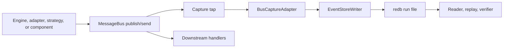
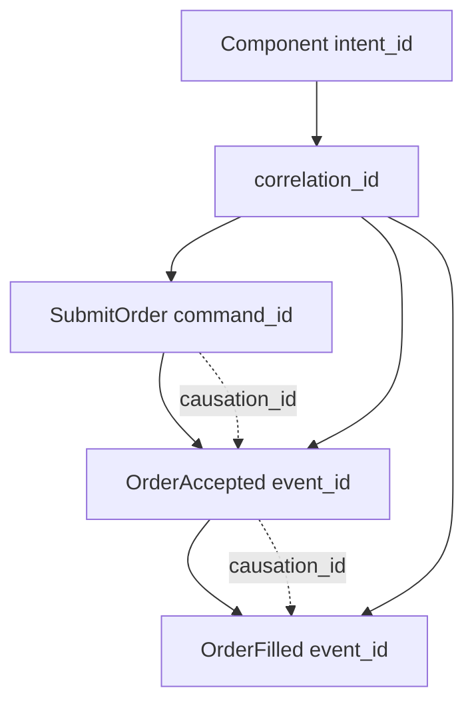
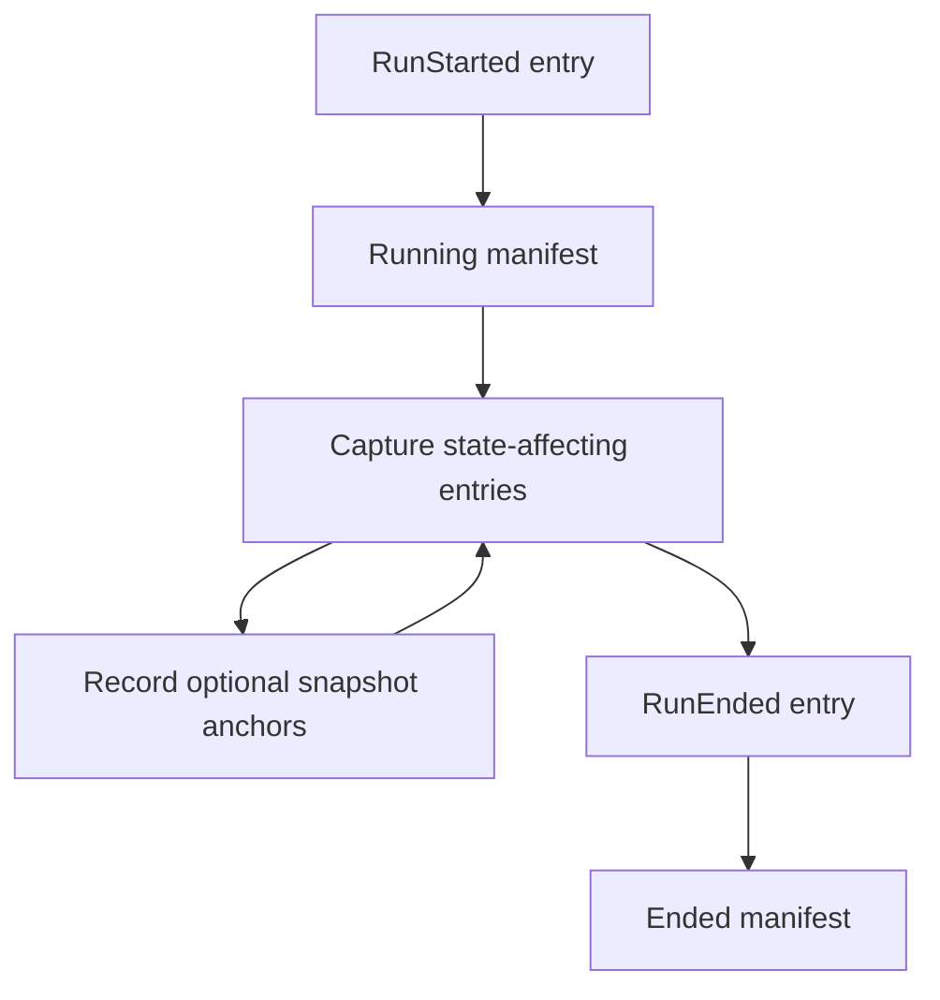
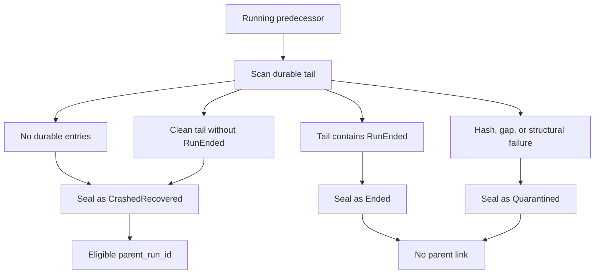
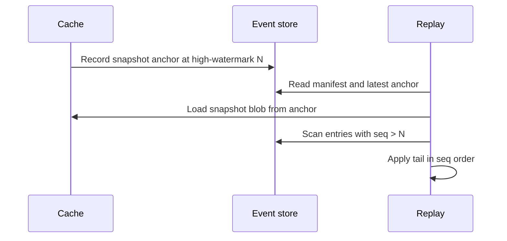

# 事件溯源 (Event Sourcing)

事件溯源为 NautilusTrader 提供了一份持久且有序的记录，记下所有会改变引擎状态的消息。事件存储 (event store) 在系统边界处记录这些消息，随后读取器、回放工具与校验器使用同一份日志来重建已发生的事情并重建状态。

**核心理念**：

- 事件存储是关乎状态变更历史的持久权威。
- 缓存是一个写穿透 (write-through) 投影，而不是真理源。
- 缓存回放通过将捕获到的历史应用到缓存所拥有的状态上来重建状态。
- 市场数据仍保留在数据目录 (data catalog) 中；事件存储记录的是影响状态的消息。
- 只有当 Nautilus 把外部 I/O 捕获为命令、原始报告或其他影响状态的输入时，它才会变得可回放。

:::note
事件存储的捕获、回放、校验、恢复以及保留规划都已有针对性的测试覆盖，但 API 表面仍在演进中。请将这里的概念视为当前开发的设计契约，并使用 crate README 获取当前的 API 细节。
:::

## 为什么需要事件溯源

缓存回答的是"现在什么为真"。事件存储回答的是"Nautilus 是如何走到这一步的"。它为读取器、回放工具与校验器提供了一份限定于单次运行 (run-scoped) 的历史，解释过去的状态时无需依赖策略逻辑、交易场所查询或活跃缓存。

事件存储为 Nautilus 提供了一个持久的基础，用于：

- 在回放或归档之前证明一次已封存 (sealed) 的运行是否干净。
- 检视某个订单或组件意图背后确切的命令、报告与事件序列。
- 从捕获到的历史中重建缓存状态，包括一个快照锚点加上运行尾部 (run tail)。
- 沿着一个意图追踪由它引发的引擎侧消息。
- 在进程退出或写入器停止后、下一次运行开始之前，封存陈旧的运行文件。

## 术语

- 运行 (Run)：针对一个实例、二进制文件与配置的单次内核会话。
- 条目 (Entry)：一条被捕获的消息加上回放元数据。
- `seq`：由写入器分配、用作回放顺序的每次运行内序列号。
- 高水位线 (High-watermark)：后端已持久确认的最大 `seq`。
- 快照锚点 (Snapshot anchor)：与缓存快照一起记录的高水位线。
- 头部 (Headers)：随被捕获消息一同传播的关联 (correlation) 与因果 (causation) 元数据。

## 存储记录了什么

事件存储记录的是单个交易实例、单次运行的、影响状态的消息总线流量。一次运行在内核启动时开始，在进程干净停止或崩溃时结束。

**被捕获的条目包括**：

- 执行命令，例如提交 (submit)、修改 (modify) 与取消 (cancel)。
- 定义 actor 或策略观测窗口的数据订阅命令。
- 已触发的时间事件，以及生成的订单、持仓与账户事件。
- 在对账 (reconciliation) 合成派生事件之前的原始交易场所执行报告。
- 由这些原始报告产生的对账输出。
- 跨越总线且影响状态的请求与响应消息，或它们与审计相关的元数据。
- 运行生命周期条目，例如 `RunStarted` 与 `RunEnded`。

事件存储不替代数据目录。市场数据观测仍保留在 Feather 流式目录中。事件存储记录的是命令流、原始报告、生成的事件，以及回放引擎如何对那个世界做出反应所需的元数据。

## 边界

事件存储被刻意设计得很窄：

- 它不替代数据目录。
- 它不提供分析能力或 OLAP 查询。
- 它不把多个交易者实例聚合成一份共识日志。
- 它尚未定义脱敏 (redaction)、静态加密 (encryption-at-rest) 或防篡改证据。

## 捕获流程

捕获发生在消息总线分发边界处，先于下游处理器观测到该消息。这个位置之所以重要，是因为任何能改变状态的处理器都必须只看到事件存储已经接受的消息。



**操作步骤如下**：

- 生产者发布或发送一条影响状态的消息。
- 总线捕获探针 (capture tap) 在下游处理器运行之前构建一个事件存储条目。
- 写入器分配下一个 `seq`，写入一个批次，并在后端确认持久性之后推进高水位线。
- 处理器在被捕获的条目到达写入器边界之后才运行。
- 读取器扫描已封存或正在运行的后端，但不暴露追加 (append) 操作。

写入器使用一个有界通道。如果写入器停顿超过其配置的阈值，Nautilus 会停机，而不是丢弃条目或允许未经审计的状态变更。

某些消息会合理地跨越不止一个探针可见的边界：执行引擎把一个订单事件发送到组合 (portfolio) 端点，同时在它的策略主题上发布同一个事件；交易命令则从策略跳到风控再跳到执行。捕获适配器会基于已注册的消息标识 (事件 id、命令 id) 去重，因此每条逻辑消息恰好变成一个条目，回放也绝不会把同一个事件应用两次。

## 生命周期选项

`EventStoreConfig` 仍是可序列化的运行策略。进程本地的构造策略则存放于 `EventStoreLifecycleOptions` 中，高级调用方通过 `EventStoreLifecycle::boot_with_options(...)` 传入它。

默认情况下，生命周期会打开 `RedbBackend` 并安装默认的编码器注册表。调用方可以使用生命周期选项来：

- 在总线探针开始捕获之前，提供一个自定义的编码器注册表。
- 提供一个后端打开器 (opener)，它为新的运行返回任意 `EventStore` 实现。

后端打开器是面向内存捕获的、对仿真安全的路径。一个 DST 测试框架或聚焦测试可以通过正常的生命周期打开 `MemoryBackend`，保留相同的总线探针与写入器语义，并在封存之后于进程内读取被捕获的条目。在 `cfg(madsim)` 下，写入器会同步提交每次提交，因此被捕获的 `seq` 顺序是确定性的。使用 `MemoryBackend` 打开器时，捕获不需要任何 `redb` 运行文件。

## 条目模型

每个事件存储条目都是一条被捕获的消息加上元数据：

- `seq`：每次运行内回放顺序的权威。
- `ts_init`：被捕获消息上的领域时间戳。
- `ts_publish`：当排序细节很重要时，总线接受该消息的时间。
- `topic`：总线主题或逻辑端点。
- `payload_type`：已编码的消息类型。
- `payload`：已编码的消息字节。
- `headers`：关联与因果元数据。
- `entry_hash`：对条目内容计算的规范哈希。

`seq` 决定回放顺序。时间戳有助于解释这次运行，但它们不会覆盖 `seq`。

当前的二级索引支持按 `client_order_id` 和 `venue_order_id` 查找。当某个具体的检视调用方需要那种查找模式时，可以添加 `correlation_id` 索引；在那之前，关联扫描可以遍历被捕获的流。

## 关联模型

Nautilus 记录三个层级的标识，以便读取器回答关于作用域、谱系与消息标识的问题。

- `correlation_id`：逻辑工作流或链条。组件的 `intent_id` 在分发边界处被记录到这个字段里。
- `causation_id`：导致这条消息的直接父消息。
- `command_id`、`event_id` 或 `report_id`：这条具体消息的标识。



这让运维人员可以提出两个常见问题：

- "显示这个工作流中的所有内容"：按 `correlation_id` 过滤或扫描。
- "显示这个事件为什么发生"：沿着 `causation_id` 回溯到直接父消息。

## 运行文件与清单

默认后端是 `redb`。它在以下路径下为每次运行存储一个文件：

```text
<base>/<instance_id>/<run_id>.redb
```

每个运行文件包含：

- 以 `seq` 为键的条目。
- 面向订单标识符的二级索引。
- 一份在运行开始时写入、在运行结束时封存的清单 (manifest)。
- 一个用于缓存恢复的可选快照锚点。

清单记录运行标识以及可复现性输入：

- 运行标识：
  - `run_id`
  - `parent_run_id`
  - `instance_id`

- 构建标识：
  - `binary_hash`
  - `crate_versions`
  - `feature_flags`
  - 适配器版本

- 配置标识：
  - `config_hash`
  - 已注册的组件
  - 可选的种子 (seed)

- 生命周期状态：
  - `start_ts_init`
  - `end_ts_init`
  - `high_watermark`
  - 状态

运行状态是 `Running`、`Ended`、`CrashedRecovered` 或 `Quarantined` 之一。

## 运行生命周期



从操作角度看：

- `RunStarted` 是一次全新运行的第一个条目。在同一进程内重复调用 `open()` 会在启动新运行之前封存当前会话。
- 当清单处于 `Running` 状态时，总线探针记录影响状态的条目，缓存快照可以针对持久的高水位线记录锚点。
- 一次干净的关闭、内核丢弃 (drop) 或 reset/rerun 封存会追加 `RunEnded` 并把清单封存为 `Ended`。
- 一个失败停机 (halted) 的会话会跳过进程内封存；这交由下一次启动时的恢复扫描接管。停机信号的作用域限定于触发它的那次运行：稍后的 `open()` 会重新装填一个全新的信号，因此一次停机不会污染同一进程内后续的运行。

## 恢复封存

前驱 (predecessor) 是指同一实例的、清单仍标记为 `Running` 的一个较旧运行文件。这意味着上一个进程没有完成正常的生命周期，或者写入器在清单封存完成之前就停机了。



启动恢复会扫描每个 `Running` 前驱，并从持久的尾部选择一个最终的清单状态。一个没有 `RunEnded` 的干净尾部会被封存为 `CrashedRecovered`，一个以 `RunEnded` 结尾的尾部会被封存为 `Ended`，而哈希不匹配、缺口或结构性损坏则会被封存为 `Quarantined`。

这次扫描绝不会因为某一个运行文件损坏而让交易者无法启动。一个被硬终止的进程 (SIGKILL、OOM 终止、断电) 会留下一个 redb 拒绝以只读方式打开的文件；列举操作会退回到可写打开，这会在恢复继续进行之前执行 redb 的修复流程。一个仍然无法打开、或缺少清单的文件会被跳过并记录错误，留到下一次启动时重试，于是恢复与保留得以在健康的运行上继续进行。

只有 `CrashedRecovered` 前驱才会成为 `parent_run_id`。配置的 `replay_from_run_id` 在校验之后会覆盖一个已恢复的父运行。只读校验器是独立的：它可以在不改变某次已封存运行的情况下检视它，并报告 `quarantine=not-performed`。

## 回放模式

回放遵循一条排序规则：按 `seq` 顺序应用事件存储条目。`ts_init` 和 `ts_publish` 解释消息何时发生，但 `seq` 才是持久的回放顺序。

Rust 的回放输入 API 让规划与执行保持分离：

- 仅事件存储的回放输入只返回条目。
- 目录联接 (catalog-joined) 的回放输入会加入调用方选定的目录切片，用于上下文分析。

目录规划器接收显式的 `CatalogSliceSelector` 值和一个只读的 `ReplayCatalog`。除非选择器提供了显式边界，否则规划会从事件存储扫描中解析目录的时间边界，报告缺失的目录切片，并保留 `seq` 作为条目排序权威。加载会返回 `ReplayInputs`：按 `seq` 顺序排列的事件存储条目，加上归类在各自选定切片之下的目录记录。

Rust 调用方可以启用默认关闭的 `persistence` 特性，并用 `nautilus_event_store::ParquetReplayCatalog` 包裹一个 `ParquetDataCatalog`，以规划选定的目录文件以及从文件名派生的区间。这个桥接器可以把 `quotes`、`trades` 和 `bars` 加载为有类型的 `CatalogReplayRecord` 值。

:::note
持久化桥接器是只读的：它使用目录发现与查询 API，但**不向目录写入**。不受支持的目录类在回放为该类添加有类型的载荷契约之前会加载失败。
:::

## 数据序列旁车 (sidecar) 设计

:::note
本节是一个设计目标。Nautilus 尚未实现旁车写入器、读取器或配置标志。
:::

确切的数据投递顺序不会从目录时间戳推断而来。这个紧凑的旁车设计在消息总线分发边界处记录被观测到的数据标记 (marker)，置于事件存储运行的旁侧，而不把完整的市场数据载荷写入 `EventStoreEntry` 行中。

旁车可以支持一项审计主张：当启用标记捕获时，Nautilus 在该次运行的总线边界处按 `marker_seq` 顺序观测到了数据投递标记，并且每个标记都包含足够的标识以便联接回候选目录行。它无法证明仅凭目录时间戳就能定义总线顺序，无法在目录行缺失或被改动时重建某个数据点，无法证明 Nautilus 观测到消息之前交易场所的发送顺序，也无法对那些标记捕获被禁用的运行说出任何东西。

标记不消耗事件存储的 `seq` 值，也不会在条目表中制造缺口。每个标记都有它自己单调递增的 `marker_seq`，外加 `event_seq_before`，即在该标记被观测到之前所分配的最大事件存储 `seq`。一个面向已封存运行的分析器可以从 `event_seq_before + 1` 推导出标记之后的下一个事件存储条目；共享同一 `event_seq_before` 的标记按 `marker_seq` 排序。对于影响状态的条目，事件存储 `seq` 仍是回放顺序的权威。

最小的标记字段是：

- `marker_seq`：运行本地的标记顺序。
- `event_seq_before`：最近的先前事件存储条目。
- `topic`：探针观测到的总线主题。
- `data_cls`：目录类，例如 `quotes`、`trades` 或 `bars`。
- `identifier`：quotes 和 trades 的 instrument ID，或 bars 的 bar type。
- `ts_event` 与 `ts_init`：目录行的时间戳键。
- `same_ts_ordinal`：在具有相同 `data_cls`、`identifier` 与 `ts_init` 的标记之中被观测到的序数。
- `record_fingerprint`：对规范的有类型行字段计算的固定大小哈希。

`same_ts_ordinal` 与 `record_fingerprint` 在不存储价格、数量、规模或 MessagePack 载荷的情况下，消除同一时间戳重复数据的歧义。如果两个目录行对于相同的键和时间戳是逐字节相同的，旁车可以证明 Nautilus 以特定的标记顺序观测到了两次投递；但在目录压实 (compaction) 重写了行顺序之后，它无法指名某个唯一的物理目录行。

稳定的契约是标记 schema、可选启用 (opt-in) 的捕获与读取器原语、无缺口的标记校验，以及目录联接规则。分析工具可以在这个契约之上构建，用于选择窗口、解释特定交易场所的数据、对标记进行排名或聚类、呈现报告，以及打包运行捆绑 (bundle)。

旁车在实现后默认保持关闭。一个独立的配置标志启用标记捕获，禁用路径不安装任何数据标记写入器。缓存回放与实盘重启不读取这个旁车：快照尾部回放仍按 `seq` 顺序应用事件存储条目，实盘重启仍从缓存所拥有的状态加上事件存储的父链接启动。

这些 API **不会**：

- 打开实盘交易场所客户端
- 运行策略或 actor
- 重新运行对账
- 删除文件
- 回放时钟注册/取消的生命周期

由内核管理的回放使用 `EventStoreConfig::replay_from_run_id`。当设置该值时，内核会从已封存的运行中恢复缓存状态，把那次运行记录为全新子运行的父运行，并跳过实盘引擎、客户端、启动流程与交易场所对账。

缓存回放加载器是仅状态的 (state-only)。它恢复缓存所拥有的快照，按 `seq` 顺序扫描事件存储尾部，解码受支持的、影响缓存的载荷，并把它们直接应用到 `Cache`。受支持的载荷包括：

- 合成的账户、订单与持仓事件
- 被捕获的订单列表
- 针对 instruments、quotes、trades、funding rates 与 bars 的完整数据响应

它**不会**：

- 把回放的条目发布到实盘消息总线
- 运行策略或 actor 代码
- 查询交易场所
- 运行对账
- 再次派生标识符
- 重新装填时钟

在这条路径上，已触发的 `TimeEvent` 和原始交易场所报告是检视记录；回放应用的是在运行后期被捕获的、合成的订单、持仓与账户事件。

## 快照锚定恢复

缓存快照由缓存拥有。事件存储只存储快照锚点：快照时刻的高水位线，加上指向快照 blob 的内容寻址 (content-addressed) 引用。



恢复的各种情形按消息推进的程度排序：

- 入队之前：消息从未到达写入器，因此适用生产者的重试策略。
- 入队之后、提交之前：在途的批次尚未持久，因此高水位线不会推进。
- 提交之后、快照锚点之前：恢复会加载先前的快照并回放尾部。
- 快照锚点之后：恢复会加载最新的快照并回放锚点之后的条目。

:::info
实盘重启目前仍使用"快照加对账"。只有在捕获覆盖率与回放规则覆盖了每一条影响状态的路径之后，事件存储恢复才会成为实盘重启路径。
:::

回放的正确性取决于四项检查：

- 条目由不可变的 `seq` 值寻址。
- 写入拒绝乱序的提交。
- 读取器检测高水位线内部的缺口。
- 快照回放计划拒绝指向超出持久高水位线的锚点。

## 保留规划

保留以整个运行文件作为回收 (reclaim) 单位。事件存储暴露一个非破坏性的规划器，它列出已封存的运行清单，检视它们最新的快照锚点状态，并返回候选运行文件，供稍后的监督进程或运维进程回收。

规划器支持三种模式：

- `Full`：保留每一次已封存的运行，不返回任何回收候选。
- `Bounded { keep_last }`：保留最新的若干次已封存运行，同时还至少保留一个已知良好的恢复点。
- `SnapshotAnchored`：只回收比最新的已知良好恢复点更旧的已封存运行。

一个已知良好的恢复点是指一次已封存的、非 `Quarantined` 的运行，它带有一个有效的快照锚点，且该锚点的高水位线不超过该运行的持久高水位线 (即实际落盘的最后一个条目，而非清单记录的值，于是一个尾部被裁剪过的运行无法冒充恢复点)。`Running` 运行绝不会被列为已封存运行或被选为回收候选。缺失、损坏或无效的快照锚点不计为恢复点，因此当规划器无法证明至少还剩一个可用的恢复点时，它不返回任何候选。

## 校验覆盖

事件存储测试套件钉牢了当前 alpha 表面下承重的正确性保证：

- 默认编码器注册表覆盖了经过审计的、影响状态的捕获表面。
- 已触发的 `TimeEvent` 通过 `TimeEventHandler::run` 命中已安装的事件存储探针。
- 写入器在有界背压下停机，而不是丢弃已接受的条目。
- 条目哈希校验检测字节级的载荷损坏。
- 进程隔离的校验把被截断或尾部为零的运行文件报告为损坏。
- 对于生成的被捕获事件流，缓存回放重建出与活跃缓存相同的、被观测到的账户、订单与持仓状态。
- 跨多个总线边界分发的同一个订单事件只被捕获一次。
- 解码失败或指向超出持久高水位线的快照锚点会作为校验器发现项浮现，而不是被校验为干净。
- 目录联接的回放输入规划覆盖了选定的切片、缺失的切片、时间边界以及事件存储的 `seq` 排序。
- 崩溃恢复根据持久尾部把 `Running` 前驱封存为 `Ended`、`CrashedRecovered` 或 `Quarantined`，且只有 `CrashedRecovered` 运行成为父运行。
- 启动恢复修复硬崩溃的运行文件，并跳过不可读的文件，而不是让整次扫描失败。

## 完整性与校验

每个条目都携带一个对其完整内容计算的规范哈希。读取器与校验器会重新计算该哈希并报告不匹配。校验器还会检查清单/高水位线状态，对照条目表校验二级索引，并报告解码失败或指向超出持久高水位线的快照锚点，因此一次恢复路径已损坏的运行无法被校验为干净。

运行校验是进程隔离的。这一点很重要，因为某些损坏的 `redb` 文件可能在打开或首次读取时 panic，而 release 构建使用 `panic = "abort"`。校验器在一个工作子进程中运行扫描，于是一个坏文件中止的是工作进程，而不是调用方。

校验一个已封存的运行文件：

```fish
cargo run -p nautilus-event-store --bin verify -- /path/to/run.redb
```

干净的输出看起来像：

```text
clean run_id=1700000000-cafe0001 status=Ended high_watermark=3 entries_scanned=3
```

损坏的输出包含 `quarantine=not-performed`：

```text
corrupt run_id=1700000000-cafe0001 status=Ended high_watermark=3 entries_scanned=3 findings=1 quarantine=not-performed
- hash mismatch at seq 2
```

退出码：

- `0`：运行是干净的。
- `1`：运行有损坏发现项，或工作进程中止或超时。
- `2`：校验器无法打开或针对所请求的文件运行。

:::note
校验器报告损坏但不改变运行文件。隔离 (quarantine) 是一项运维或监督策略。
:::

## 当前的操作性用法

当前 alpha 阶段的用法聚焦于对运行文件进行本地检视与校验。

在复制或恢复一个运行之后校验它：

```fish
cargo run -p nautilus-event-store --bin verify -- ./event_store/trader-001/1700000000-cafe0001.redb
```

为一个大型已封存运行增加校验器超时：

```fish
env NAUTILUS_EVENT_STORE_VERIFY_TIMEOUT_SECS=120 \
    cargo run -p nautilus-event-store --bin verify -- ./event_store/trader-001/1700000000-cafe0001.redb
```

从 Rust 读取一个已封存的运行：

```rust
use nautilus_event_store::{EventStoreReader, RedbBackend, ScanDirection};

fn inspect_run() -> Result<(), Box<dyn std::error::Error>> {
    let backend =
        RedbBackend::open_sealed_file("./event_store/trader-001/1700000000-cafe0001.redb")?;
    let reader = EventStoreReader::new(backend);
    let high_watermark = reader.high_watermark()?;

    for entry in reader.scan_range(1, high_watermark, ScanDirection::Forward) {
        let entry = entry?;
        println!("{} {}", entry.seq, entry.topic);
    }

    Ok(())
}
```

校验器是只读检视。它在不改变运行文件的情况下报告损坏，因此隔离决策仍位于这个命令路径之外。

## 与 DST 的关系

事件存储与确定性仿真测试 (DST) 解决回放的不同部分。

- 事件存储提供被捕获的输入历史。
- DST 控制调度、时间、带种子的随机性以及其他在作用域内的非确定性。
- 二者合在一起，让一次运行能够在确定性仿真作用域内复现引擎行为，当它由以下项标识时：
  - `seed`
  - `binary_hash`
  - `config_hash`
  - `schema_version`
  - `log`

在 `cfg(madsim)` 下，写入器同步提交，而不是派生它的写入器线程。当仿真测试框架通过生命周期选项提供一个 `MemoryBackend` 打开器时，捕获保持在进程内，不需要 `redb` 文件。在那条高级选项路径之外，redb 仍是默认的持久后端。

适配器的网络 I/O 仍处于逐位相同 (bit-identical) 回放之外，除非 Nautilus 捕获相关的原始输入并通过确定性接口路由它们。
