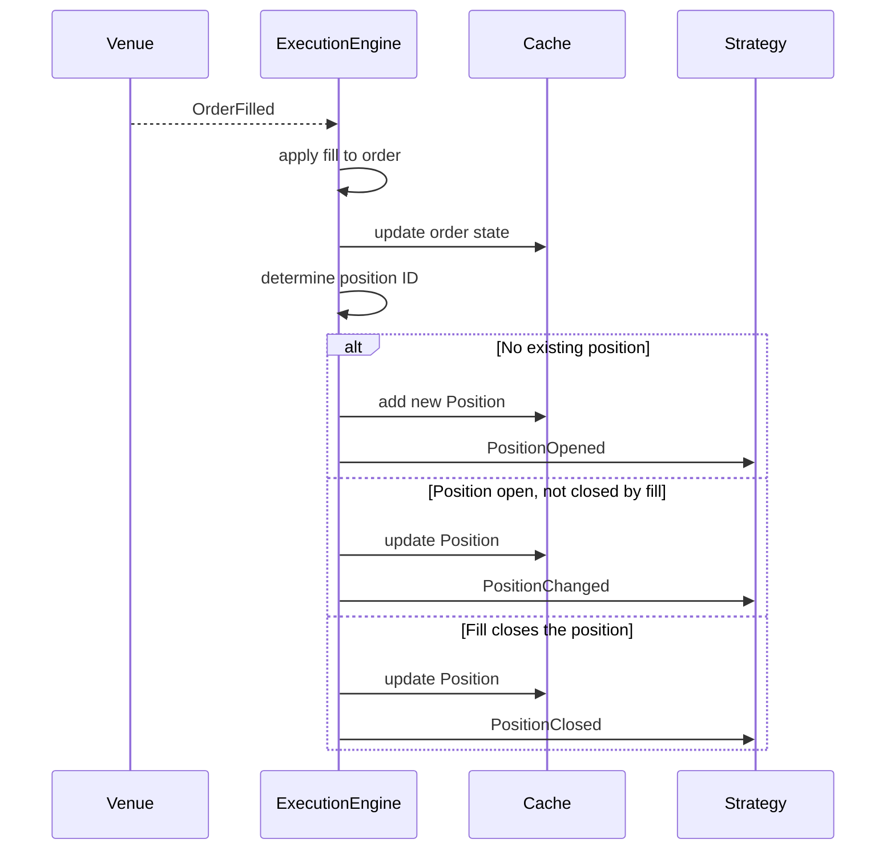

# 事件 (Events)

Nautilus 是事件驱动的：系统中的每一次状态变化都由一个事件对象表示，这些事件对象通过 `MessageBus` 流向策略和 actor 的处理器。本指南介绍各类事件类型、它们如何被分派，以及订单成交如何产生持仓事件。

## 事件分类

| 分类     | 示例                                            | 来源                            |
|----------|-------------------------------------------------|---------------------------------|
| Order    | `OrderAccepted`、`OrderFilled`、`OrderCanceled` | `ExecutionEngine`（来自交易场所）|
| Position | `PositionOpened`、`PositionChanged`             | `ExecutionEngine`（来自成交）   |
| Account  | `AccountState`                                  | `ExecutionClient` / `Portfolio` |
| Time     | `TimeEvent`                                     | `Clock`（计时器和提醒）         |

## 处理器分派

当一个事件到达策略时，系统会按照固定的优先级顺序调用处理器。第一个匹配的处理器先运行，然后是下一个层级，这样你就可以按所需的粒度处理事件。

### 订单事件

1. 专用处理器（例如 `on_order_filled`）
2. `on_order_event`（接收所有订单事件）
3. `on_event`（接收所有事件）

### 持仓事件

1. 专用处理器（例如 `on_position_opened`）
2. `on_position_event`（接收所有持仓事件）
3. `on_event`（接收所有事件）

### 时间事件

计时器和提醒会产生 `TimeEvent` 对象。在调用 `set_timer` 或 `set_time_alert` 时传入一个 `callback`，即可将事件导向你自己的方法。如果省略 callback，事件则会改为投递到 `on_event`。

## 订单事件

每个订单事件都对应[订单状态机](orders/index.md#order-state-flow)中的一次状态转换。`ExecutionEngine` 将事件应用到订单上，更新 `Cache`，并将其发布到 `MessageBus`。下表展示了主要的状态转换；部分成交和已触发的订单还支持其他转换，详见完整的[订单状态流](orders/index.md#order-state-flow)。

| 事件                   | 主要转换                            | 处理器                     |
|------------------------|-------------------------------------|----------------------------|
| `OrderInitialized`     | （在本地创建）                      | `on_order_initialized`     |
| `OrderDenied`          | Initialized -> Denied               | `on_order_denied`          |
| `OrderEmulated`        | Initialized -> Emulated             | `on_order_emulated`        |
| `OrderReleased`        | Emulated -> Released                | `on_order_released`        |
| `OrderSubmitted`       | Initialized/Released -> Submitted   | `on_order_submitted`       |
| `OrderAccepted`        | Submitted -> Accepted               | `on_order_accepted`        |
| `OrderRejected`        | Submitted -> Rejected               | `on_order_rejected`        |
| `OrderTriggered`       | Accepted -> Triggered               | `on_order_triggered`       |
| `OrderPendingUpdate`   | Accepted -> PendingUpdate           | `on_order_pending_update`  |
| `OrderPendingCancel`   | Accepted -> PendingCancel           | `on_order_pending_cancel`  |
| `OrderUpdated`         | PendingUpdate -> Accepted           | `on_order_updated`         |
| `OrderModifyRejected`  | PendingUpdate -> Accepted           | `on_order_modify_rejected` |
| `OrderCancelRejected`  | PendingCancel -> Accepted           | `on_order_cancel_rejected` |
| `OrderCanceled`        | PendingCancel/Accepted -> Canceled  | `on_order_canceled`        |
| `OrderExpired`         | Accepted -> Expired                 | `on_order_expired`         |
| `OrderFilled`          | Accepted -> Filled/PartiallyFilled  | `on_order_filled`          |

### 通用订单事件字段

所有订单事件都共享以下字段：

| 字段               | 说明                                     |
|--------------------|------------------------------------------|
| `trader_id`        | 交易者实例标识符。                       |
| `strategy_id`      | 提交该订单的策略。                       |
| `instrument_id`    | 该订单对应的金融工具。                   |
| `client_order_id`  | 客户端分配的订单标识符。                 |
| `venue_order_id`   | 交易场所分配的订单标识符。               |
| `account_id`       | 该订单所属的账户。                       |
| `reconciliation`   | 是否在对账过程中生成。                   |
| `event_id`         | 唯一的事件标识符。                       |
| `ts_event`         | 事件发生时的时间戳。                     |
| `ts_init`          | 事件创建时的时间戳。                     |

各个具体事件会添加其特有的字段（例如 `OrderFilled` 会添加 `last_qty`、`last_px`、`trade_id`、`commission`）。每种事件类型的完整字段列表请参阅 API 参考文档。

:::tip
重写 `on_order_event` 即可在一处统一处理所有订单事件。由于专用处理器会先触发，因此你可以将两种方式混合使用。
:::

## 持仓事件

持仓事件是成交事件的直接结果。`ExecutionEngine` 处理每一个 `OrderFilled`，更新或创建一个持仓，并发出对应的持仓事件。

| 事件                | 触发时机                                  | 处理器                |
|---------------------|-------------------------------------------|-----------------------|
| `PositionOpened`    | 首次成交创建一个新持仓。                  | `on_position_opened`  |
| `PositionChanged`   | 后续成交改变了数量或方向。                | `on_position_changed` |
| `PositionClosed`    | 成交将数量减少至零。                      | `on_position_closed`  |

### 从成交到持仓：因果链条

下面的图示展示了单个 `OrderFilled` 事件如何产生一个持仓事件。这是订单管理与持仓跟踪之间的关键纽带。



**逐步说明：**

1. **成交到达。** `ExecutionEngine` 从交易场所适配器接收到一个 `OrderFilled` 事件。
2. **订单状态更新。** 引擎将成交应用到订单对象上，并把更新后的订单写入 `Cache`。
3. **解析持仓 ID。** 引擎根据 OMS 类型和策略配置，确定这笔成交属于哪个持仓。
4. **创建或更新持仓。** 有三种结果：
   - **该 ID 不存在持仓**：引擎根据成交创建一个 `Position`，将其添加到 `Cache`，并发出 `PositionOpened`。
   - **持仓已存在且成交后仍保持开放**：引擎将成交应用到该持仓上，更新 `Cache`，并发出 `PositionChanged`。
   - **持仓已存在且被平掉**（数量归零）：引擎应用该成交，更新 `Cache`，并发出 `PositionClosed`。
5. **反手情形。** 当一笔成交反转了持仓（例如多头 10 手成交了卖出 15 手），引擎会将成交拆分为两部分：一部分平掉原有持仓（`PositionClosed`），另一部分开立新持仓（`PositionOpened`）。

### 持仓事件字段

| 字段                 | Opened | Changed | Closed | 说明                              |
|----------------------|--------|---------|--------|-----------------------------------|
| `trader_id`          | ✓      | ✓       | ✓      | 交易者实例标识符。                |
| `strategy_id`        | ✓      | ✓       | ✓      | 拥有该持仓的策略。                |
| `instrument_id`      | ✓      | ✓       | ✓      | 该持仓对应的金融工具。            |
| `position_id`        | ✓      | ✓       | ✓      | 唯一的持仓标识符。                |
| `account_id`         | ✓      | ✓       | ✓      | 该持仓所属的账户。                |
| `opening_order_id`   | ✓      | ✓       | ✓      | 开立该持仓的订单。                |
| `closing_order_id`   | -      | -       | ✓      | 平掉该持仓的订单。                |
| `entry`              | ✓      | ✓       | ✓      | 开仓成交的方向。                  |
| `side`               | ✓      | ✓       | ✓      | 当前持仓方向。                    |
| `signed_qty`         | ✓      | ✓       | ✓      | 带符号的数量（负=空头）。         |
| `quantity`           | ✓      | ✓       | ✓      | 无符号的持仓数量。                |
| `peak_qty`           | -      | ✓       | ✓      | 持有过的最大数量。                |
| `last_qty`           | ✓      | ✓       | ✓      | 最近一笔成交的数量。              |
| `last_px`            | ✓      | ✓       | ✓      | 最近一笔成交的价格。              |
| `currency`           | ✓      | ✓       | ✓      | 结算货币。                        |
| `avg_px_open`        | ✓      | ✓       | ✓      | 平均开仓价格。                    |
| `avg_px_close`       | -      | ✓       | ✓      | 平均平仓价格。                    |
| `realized_return`    | -      | ✓       | ✓      | 已实现收益率（比率形式）。        |
| `realized_pnl`       | -      | ✓       | ✓      | 已实现盈亏。                      |
| `unrealized_pnl`     | -      | ✓       | ✓      | 未实现盈亏。                      |
| `duration_ns`        | -      | -       | ✓      | 持有时长（纳秒）。                |
| `ts_opened`          | -      | ✓       | ✓      | 持仓开立时的时间戳。              |
| `ts_closed`          | -      | -       | ✓      | 持仓平掉时的时间戳。              |
| `event_id`           | ✓      | ✓       | ✓      | 唯一的事件标识符。                |
| `ts_event`           | ✓      | ✓       | ✓      | 触发事件的成交的时间戳。          |
| `ts_init`            | ✓      | ✓       | ✓      | 事件创建时的时间戳。              |

### 追踪订单到持仓

`Cache` 提供了在订单和持仓之间进行导航的方法：

```python
# 从一个持仓出发，找到所有为其贡献成交的订单
orders = self.cache.orders_for_position(position.id)

# 从一个订单出发，找到它所属的持仓
position = self.cache.position_for_order(order.client_order_id)

# 开仓订单直接存储在持仓上
opening_order_id = position.opening_order_id
```

## 账户事件

`AccountState` 事件表示余额和保证金的快照。它们在以下情况触发：

- 交易场所报告账户更新（通过执行客户端）。
- `Portfolio` 在持仓更新后重新计算账户状态（针对启用了 `calculate_account_state` 的保证金账户）。

账户状态包含余额、保证金、账户类型和基础货币。`Portfolio` 在内部订阅这些事件，以维护敞口和余额的跟踪。

## 事件订阅

除了策略处理器之外，actor 还可以订阅其并不交易的金融工具的特定事件流。这些订阅直接使用 `MessageBus`，不涉及 `DataEngine`。

| 方法                         | 处理器                | 接收内容                       |
|------------------------------|-----------------------|--------------------------------|
| `subscribe_order_fills()`    | `on_order_filled()`   | 某个金融工具的所有成交。       |
| `subscribe_order_cancels()`  | `on_order_canceled()` | 某个金融工具的所有撤单。       |

对于那些跟踪跨策略执行质量或成交率、但不参与订单管理的监控型 actor 来说，这些订阅非常有用。

更多细节和示例，请参阅[订单成交订阅](actors.md#order-fill-subscriptions)和[订单撤单订阅](actors.md#order-cancel-subscriptions)。

## 相关指南

- [订单](orders/) - 订单类型和状态机。
- [持仓](positions.md) - 持仓生命周期和盈亏。
- [执行](execution.md) - 执行流程和风险检查。
- [策略](strategies.md) - 策略中的处理器实现。
- [架构](architecture.md) - 数据流与执行流模式。
