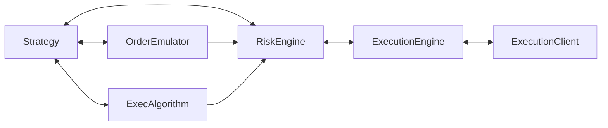

# 执行 (Execution)

NautilusTrader 可以同时处理多个策略 (strategy) 和交易场所 (venue) 的交易执行和订单 (order) 管理（每个实例）。执行过程涉及多个交互组件，因此理解执行消息（命令 (command) 和事件 (event)）的可能流向至关重要。

主要的执行相关组件包括：

- `Strategy`
- `ExecAlgorithm`（执行算法）
- `OrderEmulator`
- `RiskEngine`
- `ExecutionEngine` 或 `LiveExecutionEngine`
- `ExecutionClient` 或 `LiveExecutionClient`

## 执行流程

`Strategy` 基类继承自 `Actor`，因此包含所有常用的数据相关方法。它还提供了管理订单和交易执行的方法：

- `submit_order(...)`（提交订单）
- `submit_order_list(...)`（提交订单列表）
- `modify_order(...)`（改单）
- `cancel_order(...)`（撤单）
- `cancel_orders(...)`（批量撤单）
- `cancel_all_orders(...)`（撤销全部订单）
- `close_position(...)`（平仓）
- `close_all_positions(...)`（全部平仓）
- `query_account(...)`（查询账户）
- `query_order(...)`（查询订单）

这些方法在内部创建必要的执行命令，并通过消息总线将其发送到相关组件（点对点），同时发布任何事件（例如新订单的初始化，即 `OrderInitialized` 事件）。

一般的执行流程如下（每个箭头表示消息通过消息总线传递）：

`Strategy` -> `OrderEmulator` -> `ExecAlgorithm` -> `RiskEngine` -> `ExecutionEngine` -> `ExecutionClient`

`OrderEmulator` 和 `ExecAlgorithm` 组件在流程中是可选的，取决于各个订单的参数（如下所述）。

下图展示了 Nautilus 执行组件之间的消息流（命令和事件）。



## 订单管理系统 (Order Management System, OMS)

订单管理系统 (OMS) 类型是指用于将订单分配到持仓 (position) 并跟踪某个品种持仓的方法。OMS 类型同时适用于策略和交易场所（模拟和实盘）。即使交易场所没有明确说明所使用的方法，OMS 类型也始终有效。组件的 OMS 类型可以使用 `OmsType` 枚举来指定。

`OmsType` 枚举有三个变体：

- `UNSPECIFIED`：OMS 类型根据应用位置默认设定（详见下文）
- `NETTING`：每个品种 ID 的持仓合并为单一持仓
- `HEDGING`：支持每个品种 ID 的多个持仓（多空双向）

下表描述了不同配置组合及其适用场景。当策略和交易场所的 OMS 类型不同时，`ExecutionEngine` 会通过覆盖或分配 `position_id` 值来处理收到的 `OrderFilled` 事件。"虚拟持仓"是指在 Nautilus 系统中存在但在交易场所实际不存在的持仓 ID。

| 策略 OMS                      | 交易场所 OMS            | 描述                                                                                                                                                |
|:-----------------------------|:-----------------------|:-----------------------------------------------------------------------------------------------------------------------------------------------------------|
| `NETTING`                    | `NETTING`              | 策略使用交易场所的原生 OMS 类型，每个品种 ID 对应单一持仓 ID。                                                                 |
| `HEDGING`                    | `HEDGING`              | 策略使用交易场所的原生 OMS 类型，每个品种 ID 支持多个持仓 ID（`LONG` 和 `SHORT`）。                                      |
| `NETTING`                    | `HEDGING`              | 策略**覆盖**交易场所的原生 OMS 类型。交易场所跟踪每个品种 ID 的多个持仓，但 Nautilus 维护单一持仓 ID。 |
| `HEDGING`                    | `NETTING`              | 策略**覆盖**交易场所的原生 OMS 类型。交易场所跟踪每个品种 ID 的单一持仓，但 Nautilus 维护多个持仓 ID。 |

:::note
分别为策略和交易场所配置 OMS 类型会增加平台复杂性，但允许支持多种交易风格和偏好（见下文）。
:::

OMS 配置示例：

- 大多数加密货币交易所使用 `NETTING` OMS 类型，每个市场对应单一持仓。交易者可能希望为某个策略跟踪多个"虚拟"持仓。
- 一些外汇 ECN 或经纪商使用 `HEDGING` OMS 类型，跟踪 `LONG` 和 `SHORT` 的多个持仓。交易者可能只关心每个货币对的净持仓。

:::info
Nautilus 尚不支持交易场所侧的对冲模式，例如 Binance 的 `BOTH` 与 `LONG/SHORT`（交易场所按方向净额计算）。建议将 Binance 账户配置保持为 `BOTH`，以便单一持仓进行净额计算。
:::

### OMS 配置

如果策略 OMS 类型未通过 `oms_type` 配置选项显式设置，则默认为 `UNSPECIFIED`。这意味着 `ExecutionEngine` 不会覆盖任何交易场所的 `position_id`，OMS 类型将遵循交易场所的 OMS 类型。

:::tip
配置回测 (backtest) 时，可以为交易场所指定 `oms_type`。为提高回测准确性，建议将其与交易场所实际使用的 OMS 类型相匹配。
:::

## 风险引擎 (Risk Engine)

`RiskEngine` 是每个 Nautilus 系统的核心组件，包括回测、沙盒和实盘环境。每个订单命令和事件都会通过风险引擎，除非在 `RiskEngineConfig` 中特别绕过。

风险引擎包含多个内置的交易前风险 (risk) 检查，包括：

- 价格精度与品种一致。
- 价格为正值（期权类型品种除外）。
- 数量精度与品种一致。
- 低于品种的最大名义价值。
- 在品种的最大或最小数量范围内。
- 当订单指定了 `reduce_only` 执行指令时，仅允许减仓操作。

如果任何风险检查失败，系统会生成 `OrderDenied` 事件，有效地关闭该订单并阻止其继续进行。该事件包含可读的拒绝原因。

### 交易状态

此外，Nautilus 系统的当前交易状态也会影响订单流。

`TradingState` 枚举有三个变体：

- `ACTIVE`：正常运行。
- `HALTED`：在状态改变之前不处理后续订单命令。
- `REDUCING`：仅处理撤单或减少未平仓持仓的命令。

:::info
更多详情请参阅 `RiskEngineConfig` [API 参考](../api_reference/config#risk)。
:::

## 执行算法

平台支持自定义执行算法组件，并提供一些内置算法，例如时间加权平均价格 (Time-Weighted Average Price, TWAP) 算法。

### TWAP（时间加权平均价格）

TWAP 执行算法旨在通过在指定的时间范围内均匀分配来执行订单。算法接收一个代表总数量和方向的主订单，然后通过派生较小的子订单来拆分，这些子订单在整个时间范围内按固定间隔执行。

这有助于减少主订单全部数量对市场的冲击，最大限度地降低任何给定时间的交易量集中度。

算法会立即提交第一个订单，最后提交的订单是时间范围结束时的主订单。

以 TWAP 算法为例（位于 ``/examples/algorithms/twap.py``），以下示例演示了如何直接在 `BacktestEngine` 中初始化和注册 TWAP 执行算法（假设引擎已初始化）：

```python
from nautilus_trader.examples.algorithms.twap import TWAPExecAlgorithm

# `engine` 是一个已初始化的 BacktestEngine 实例
exec_algorithm = TWAPExecAlgorithm()
engine.add_exec_algorithm(exec_algorithm)
```

对于这个特定的算法，必须指定两个参数：

- `horizon_secs`
- `interval_secs`

`horizon_secs` 参数决定算法执行的时间周期，`interval_secs` 参数设置各个订单执行之间的时间间隔。这些参数决定了主订单如何被拆分为一系列派生订单。

```python
from decimal import Decimal
from nautilus_trader.model.data import BarType
from nautilus_trader.test_kit.providers import TestInstrumentProvider
from nautilus_trader.examples.strategies.ema_cross_twap import EMACrossTWAP, EMACrossTWAPConfig

# 配置你的策略
config = EMACrossTWAPConfig(
    instrument_id=TestInstrumentProvider.ethusdt_binance().id,
    bar_type=BarType.from_str("ETHUSDT.BINANCE-250-TICK-LAST-INTERNAL"),
    trade_size=Decimal("0.05"),
    fast_ema_period=10,
    slow_ema_period=20,
    twap_horizon_secs=10.0,   # 执行算法参数（总时间范围，秒）
    twap_interval_secs=2.5,    # 执行算法参数（订单间隔，秒）
)

# 实例化你的策略
strategy = EMACrossTWAP(config=config)
```

或者，你可以按订单动态指定这些参数，根据实际市场条件来确定。在这种情况下，策略配置参数可以提供给执行模型，由其决定时间范围和间隔。

:::info
执行算法参数的数量没有限制。参数必须是一个字符串键和原始值的字典（可以通过网络序列化的值，如 int、float 和 string）。
:::

### 编写执行算法

要实现自定义执行算法，必须定义一个继承自 `ExecAlgorithm` 的类。

执行算法是 `Actor` 的一种类型，因此它能够：

- 请求和订阅数据。
- 访问 `Cache`。
- 使用 `Clock` 设置时间警报和/或定时器。

此外它还可以：

- 访问中央 `Portfolio`。
- 从收到的主（原始）订单派生次级订单。

一旦执行算法注册且系统运行后，它将通过 `exec_algorithm_id` 订单参数从消息总线接收寻址到其 `ExecAlgorithmId` 的订单。订单还可能携带 `exec_algorithm_params`，它是一个 `dict[str, Any]`。

:::warning
由于 `exec_algorithm_params` 字典的灵活性，务必彻底验证所有键值对以确保算法正确运行（首先确认字典不为 ``None`` 且所有必需参数确实存在）。
:::

收到的订单将通过以下 `on_order(...)` 方法到达。这些收到的订单在被执行算法处理时被称为"主"（原始）订单。

```python
from nautilus_trader.model.orders.base import Order

def on_order(self, order: Order) -> None:
    # 在此处处理订单
```

当算法准备派生次级订单时，可以使用以下方法之一：

- `spawn_market(...)`（派生 `MARKET` 订单）
- `spawn_market_to_limit(...)`（派生 `MARKET_TO_LIMIT` 订单）
- `spawn_limit(...)`（派生 `LIMIT` 订单）

:::note
未来版本将根据需要实现更多订单类型。
:::

这些方法中的每一个都以主（原始）`Order` 作为第一个参数。主订单数量将减去传入的 `quantity`（成为派生订单的数量）。

:::warning
主订单必须有足够的剩余数量（这会被验证）。
:::

一旦派生了所需数量的次级订单且执行例程结束，算法的意图是最终发送主（原始）订单。

### 派生订单

从执行算法派生的所有次级订单都会携带 `exec_spawn_id`，即主（原始）订单的 `ClientOrderId`，其 `client_order_id` 由该原始标识符按以下约定派生：

- `exec_spawn_id`（主订单的 `client_order_id` 值）
- `spawn_sequence`（派生订单的序列号）

```
{exec_spawn_id}-E{spawn_sequence}
```

例如：`O-20230404-001-000-E1`（第一个派生订单）

:::note
"主"和"次级"/"派生"术语的选择是为了避免与"父"和"子"条件订单术语产生冲突或混淆（执行算法也可能处理条件订单）。
:::

### 管理执行算法订单

`Cache` 提供了多种方法来帮助管理（跟踪）执行算法的活动。调用以下方法将返回给定查询过滤条件下的所有执行算法订单。

```python
def orders_for_exec_algorithm(
    self,
    exec_algorithm_id: ExecAlgorithmId,
    venue: Venue | None = None,
    instrument_id: InstrumentId | None = None,
    strategy_id: StrategyId | None = None,
    side: OrderSide = OrderSide.NO_ORDER_SIDE,
) -> list[Order]:
```

还可以更具体地查询某个执行系列/派生的订单。调用以下方法将返回给定 `exec_spawn_id` 的所有订单（如果找到）。

```python
def orders_for_exec_spawn(self, exec_spawn_id: ClientOrderId) -> list[Order]:
```

:::note
这也包括主（原始）订单。
:::

## 自有订单簿

自有订单簿 (own order book) 是 L3 订单簿，仅跟踪你自己（用户）的订单并按价格级别组织，与交易场所的公共订单簿分开维护。

### 用途

自有订单簿有多种用途：

- 实时监控你的订单在交易场所公共订单簿中的状态。
- 在提交前检查价格级别的可用流动性，验证订单放置的合理性。
- 通过识别你自己的订单已存在的价格级别，帮助防止自成交。
- 支持依赖队列位置的高级订单管理策略。
- 在实盘交易中实现内部状态与交易场所状态之间的对账 (reconciliation)。

### 生命周期

自有订单簿按品种维护，并在订单经历其生命周期时自动更新。订单在提交或接受时添加，在修改时更新，在成交 (fill)、撤销、拒绝或过期时移除。

只有带有价格的订单才能在自有订单簿中表示。市价订单和其他没有明确价格的订单类型被排除在外，因为它们无法定位在特定价格级别。

### 安全撤单查询

查询自有订单簿中要撤销的订单时，使用**排除** `PENDING_CANCEL` 的 `status` 过滤器，以避免处理已在撤销中的订单。

:::warning
在状态过滤器中包含 `PENDING_CANCEL` 可能导致：

- 对同一订单发出重复撤单请求。
- 未平仓订单计数偏高（处于 `PENDING_CANCEL` 的订单在确认撤销前仍属于"未平仓"）。
- 当多个策略尝试撤销相同订单时导致订单状态爆炸。

:::

许多方法公开的可选 `accepted_buffer_ns` 参数是一个基于时间的保护机制，仅返回 `ts_accepted` 至少在指定纳秒之前的订单。尚未被交易场所接受的订单其 `ts_accepted = 0`，因此在缓冲窗口过去后它们会被包含在内。要排除这些在途订单，必须将缓冲与显式状态过滤器配合使用（例如，限制为 `ACCEPTED` / `PARTIALLY_FILLED`）。

### 审计

在实盘交易中，可以定期将自有订单簿与缓存的订单索引进行审计对比，以确保一致性。审计机制验证已关闭的订单是否已正确移除，以及在途订单（已提交但尚未接受）是否在交易场所延迟窗口期间仍被跟踪。

审计间隔可以通过实盘交易配置中的 `own_books_audit_interval_secs` 参数进行配置。

## 超额成交 (Overfill)

超额成交是指订单的累计成交数量超过原始订单数量。例如，一个 100 单位的订单收到的成交总量为 110 单位，则有 10 单位的超额成交。

### 超额成交的发生原因

超额成交可能由两种根本不同的原因导致：

- 重复的成交事件（网络/消息问题）。
- 撮合引擎的真实超额成交（实际执行结果）。

**撮合引擎的真实超额成交**

在某些情况下，撮合引擎实际执行的数量超过了订单请求的数量。这是真实的执行结果，而非重复事件：

- **撮合引擎竞态条件**：在高并发的快速市场中，订单可能在从订单簿完全移除之前几乎同时与多个对手方成交。
- **最小手数限制**：如果订单的剩余数量低于交易场所的最小可交易手数，某些撮合引擎会以最小手数成交，而不是留下无法交易的余额。
- **DEX/AMM 机制**：使用自动做市商的去中心化交易所可能存在执行机制，由于价格影响计算，实际成交数量与请求数量略有不同。
- **多笔成交的原子性**：某些交易场所不保证部分执行之间的原子性成交数量，允许聚合成交超过原始订单数量。

**重复的成交事件**

与真实超额成交不同，同一成交事件可能被多次投递：

- WebSocket 重连时重放之前收到的事件。
- 交易场所内部的重试或投递保证机制。
- 交易场所执行报告中的 API 时序问题。

系统通过 `trade_id` 去重来处理重复事件（见下文），但具有不同 `trade_id` 值的重复则需要超额成交处理。

**对账竞态条件**

在实盘交易中，系统通过两个并行通道维护状态：

- 通过 WebSocket 到达的实时成交事件。
- 定期对账轮询交易场所的成交历史。

如果同一笔成交通过两个通道以不同标识符到达，且在去重之前两者都可能被应用到订单上。这在以下情况下尤其可能发生：

- 系统启动时，对账在 WebSocket 连接建立的同时运行。
- 网络不稳定导致成交过程中重连。
- 高频交易中成交到达速度快于对账周期。

以下情况会增加对账竞态条件的可能性：

- **阈值降低**：`open_check_threshold_ms` 和 `inflight_check_threshold_ms` 设置（两者默认均为 5,000 毫秒）定义了引擎在差异上采取行动前等待的时间。将其降低到与交易场所的往返延迟以下会增加通过对账处理成交先于实时事件到达（或反之）的可能性。
- **对账频率增加**：将 `open_check_interval_secs` 设置为激进的值（例如 1-2 秒）会增加系统轮询交易场所的频率，从而增加与实时事件产生竞态条件的机会。
- **启动延迟降低**：`reconciliation_startup_delay_secs` 设置（默认 10 秒）在持续对账开始前为 WebSocket 连接的稳定提供时间。降低此值会增加启动窗口期间重复成交的可能性。

更多配置详情请参阅[持续对账](live.md#continuous-reconciliation)。

### 系统行为

`ExecutionEngine` 在应用每个成交事件之前，通过比较订单当前的 `filled_qty` 加上传入的 `last_qty` 与原始 `quantity` 来检查潜在的超额成交。

`allow_overfills` 配置选项（默认：`False`）控制超额成交的处理方式：

| `allow_overfills` | 行为                                                                   |
|-------------------|----------------------------------------------------------------------------|
| `False`           | 记录错误日志并拒绝该成交，保持订单当前状态。  |
| `True`            | 记录警告日志，应用该成交，并在 `overfill_qty` 中跟踪超额数量。 |

当允许超额成交时，订单的 `overfill_qty` 字段跟踪超额数量。订单转换为 `FILLED` 状态，`leaves_qty` 被截断为零。

### 重复成交检测

`Order` 模型强制每个 `trade_id` 只能被应用一次。在 `Order.apply()` 内部，如果传入成交的 `trade_id` 已存在于该订单上，硬检查会引发错误。这是防止重复计算执行的不变量。

**核心引擎路径（回测和实时事件处理）**

在核心 `ExecutionEngine` 中（用于回测和处理实时成交事件），在调用 `apply()` 之前，引擎会检查 `Order.is_duplicate_fill()`，它比较以下字段：

- `trade_id`
- `order_side`
- `last_px`
- `last_qty`

如果所有字段与已存在的成交完全匹配，该事件将以警告日志优雅地跳过。这避免了对良性的精确重放（例如来自 WebSocket 重连）引发错误。如果 `trade_id` 匹配但其他字段不同（"噪声重放"），四字段检查会通过，但 `Order.apply()` 会因重复的 `trade_id` 引发错误。引擎会捕获此错误，记录带有完整上下文的异常信息，并丢弃该成交——不会导致崩溃。

**实盘对账过滤器**

在实盘对账期间，`LiveExecutionEngine` 在生成成交事件*之前*仅对 `trade_id` 进行预过滤。此检查在上述四字段检查之前运行。如果成交报告到达时其 `trade_id` 已存在于订单上，无论价格或数量是否不同，都会被跳过。当数据确实不同时，会记录警告日志以提醒运维人员注意潜在的交易场所数据质量问题。

此预过滤确保来自交易场所重放或对账竞态的"噪声重复"在触发模型完整性错误之前就被过滤掉。如果交易场所确实需要更正成交数据，应使用正确的执行报告语义，而不是使用相同的 `trade_id` 重新发送。

### 配置

对于实盘交易，在 `LiveExecEngineConfig` 中启用超额成交容忍：

```python
from nautilus_trader.live.config import LiveExecEngineConfig

config = LiveExecEngineConfig(
    allow_overfills=True,  # 记录警告而非拒绝
)
```

:::tip
在已知会发出重复成交的交易场所交易，或预期持仓对账与交易所成交事件存在竞态时，启用 `allow_overfills=True`。监控日志中的超额成交警告，以识别可能需要针对特定交易场所处理的模式。
:::

:::warning
当 `allow_overfills=False`（默认值）时，被拒绝的成交可能导致系统与交易场所之间的持仓差异。请使用[对账](live.md#execution-reconciliation)功能来检测和解决此类差异。
:::
