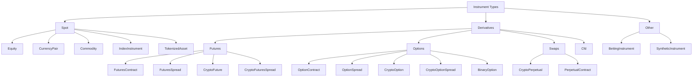

# 金融工具 (Instruments)

金融工具 (instrument) 代表某个可交易资产、合约或本地合成市场的规格定义。市场数据、订单、持仓、记账、组合计算以及适配器的代码体系，最终都会回溯到一个 `InstrumentId` 及其对应的工具定义。

NautilusTrader 向 Rust 和 Python 用户暴露相同的金融工具模型。Rust 示例使用 `nautilus_model`；Python 示例使用 `nautilus_trader.model.instruments`。

## 工具类型 (Instrument types)

| 工具类型                                                  | 类别               | 描述                                                  | 典型适配器                       |
|----------------------------------------------------------|--------------------|------------------------------------------------------|---------------------------------|
| [`Equity`](equity.md)                                    | 现货               | 在现金市场交易的上市股票或 ETF。                      | Databento, Interactive Brokers. |
| [`CurrencyPair`](currency_pair.md)                       | 现货               | 以 base/quote 形式表示的法币外汇或加密货币现货对。   | Binance, Kraken, OKX, Tardis.   |
| [`Commodity`](commodity.md)                              | 现货               | 现货商品，例如黄金或原油。                            | Interactive Brokers.            |
| [`Cfd`](cfd.md)                                          | 差价合约           | 跟踪某一标的的差价合约。                              | Interactive Brokers.            |
| [`IndexInstrument`](index_instrument.md)                 | 现货参考           | 参考指数，不可直接交易。                              | Interactive Brokers.            |
| [`TokenizedAsset`](tokenized_asset.md)                   | 代币化现货         | 加密交易场所上的代币化资产。                          | Kraken.                         |
| [`FuturesContract`](futures_contract.md)                 | 期货               | 可交割期货合约。                                      | Databento, Interactive Brokers. |
| [`FuturesSpread`](futures_spread.md)                     | 期货价差           | 交易所定义的多腿期货策略。                            | Databento, Interactive Brokers. |
| [`CryptoFuture`](crypto_future.md)                       | 加密期货           | 有到期日的加密期货合约。                              | BitMEX, Bybit, Deribit, OKX.    |
| [`CryptoFuturesSpread`](crypto_futures_spread.md)        | 加密价差           | 交易所定义的加密期货价差。                            | Deribit, OKX.                   |
| [`CryptoPerpetual`](crypto_perpetual.md)                 | 互换               | 加密永续期货合约。                                    | Binance, BitMEX, Bybit, dYdX.   |
| [`PerpetualContract`](perpetual_contract.md)             | 通用互换           | 跨资产类别的永续期货合约。                            | Architect AX.                   |
| [`OptionContract`](option_contract.md)                   | 期权               | 交易所交易的看跌或看涨期权。                          | Databento, Interactive Brokers. |
| [`OptionSpread`](option_spread.md)                       | 期权价差           | 交易所定义的多腿期权策略。                            | Databento, Interactive Brokers. |
| [`CryptoOption`](crypto_option.md)                       | 加密期权           | 标的为加密货币的期权。                                | Bybit, Deribit, OKX, Tardis.    |
| [`CryptoOptionSpread`](crypto_option_spread.md)          | 加密价差           | 交易所定义的加密期权价差。                            | Deribit, OKX.                   |
| [`BinaryOption`](binary_option.md)                       | 二元结果           | 以 0 或 1 结算的二元工具。                            | Hyperliquid, OKX, Polymarket.   |
| [`BettingInstrument`](betting_instrument.md)             | 博彩市场           | 体育或游戏市场选项。                                  | Betfair.                        |
| [`SyntheticInstrument`](synthetic_instrument.md)         | 本地合成           | 由公式衍生的本地工具。                                | 仅限本地。                      |

## 分类法 (Taxonomy)

NautilusTrader 按工具所代表的市场结构对其进行分组：



## 公共字段 (Common fields)

大多数具体工具共享相同的核心结构。各类型的专属页面会列出该类型完整的构造函数和结构体字段。

| 字段                | 含义                                                                    |
|---------------------|-------------------------------------------------------------------------|
| `id`                | Nautilus `InstrumentId`，由 symbol 和 venue 组成。                       |
| `raw_symbol`        | Nautilus 标准化之前的原生交易场所代码。                                  |
| `price_precision`   | 价格允许的小数位数。                                                     |
| `size_precision`    | 数量允许的小数位数。                                                     |
| `price_increment`   | 最小有效价格步进。                                                       |
| `size_increment`    | 最小有效数量步进。                                                       |
| `multiplier`        | 用于名义价值和盈亏计算的合约乘数。                                       |
| `lot_size`          | 当交易场所发布手数时的整手或标准交易单位。                              |
| `margin_init`       | 初始保证金费率，以名义价值的小数比例表示。                              |
| `margin_maint`      | 维持保证金费率，以名义价值的小数比例表示。                              |
| `maker_fee`         | Maker 费率。负值表示返佣。                                               |
| `taker_fee`         | Taker 费率。负值表示返佣。                                               |
| `max_quantity`      | 已知时的最大订单数量。                                                   |
| `min_quantity`      | 已知时的最小订单数量。                                                   |
| `max_notional`      | 已知时的最大订单名义价值。                                               |
| `min_notional`      | 已知时的最小订单名义价值。                                               |
| `max_price`         | 已知时的最大有效报价或订单价格。                                         |
| `min_price`         | 已知时的最小有效报价或订单价格。                                         |
| `info`              | 从交易场所或数据源保留下来的适配器元数据。                              |
| `ts_event`          | 定义事件发生时的 UNIX 纳秒时间戳。                                       |
| `ts_init`           | Nautilus 初始化该对象时的 UNIX 纳秒时间戳。                              |
| `tick_scheme_name`  | 当类型支持时，已注册的可变 tick scheme 名称。                            |

## 代码体系 (Symbology)

每个金融工具都有一个唯一的 `InstrumentId`，由原生代码和交易场所组成，以句点分隔。例如，Binance Futures 将以太坊永续合约表示为：

```text
ETHUSDT-PERP.BINANCE
```

原生代码在一个交易场所内应当是唯一的，但并非每个交易所都能保证这一点。`{symbol}.{venue}` 这一组合在一个 Nautilus 系统内必须是唯一的。

:::warning
工具定义必须与市场数据以及交易场所的订单语义相匹配。错误的工具可能截断价格或数量、用错误的货币计算名义价值，或者让回测接受一个实盘交易场所本会拒绝的价格。
:::

:::tip 处理 Binance 现货/期货代码冲突
Binance 现货市场和期货市场共享部分相同的交易代码（如 `BTCUSDT`）。Nautilus 通过**适配器将其映射为不同的 InstrumentId** 来避免冲突：

| 市场 | InstrumentId 示例 | 备注 |
|------|----------------|------|
| Binance 现货 | `BTCUSDT.BINANCE` | 现货交易对 |
| Binance U 本位永续 | `BTCUSDT-PERP.BINANCE` | `-PERP` 后缀区分永续合约 |
| Binance 币本位永续 | `BTCUSD-PERP.BINANCE` | 币本位用 `USD` 而非 `USDT` |

如果你在同一系统中同时连接现货和期货市场，请确保使用不同的 `DataClient` 实例，并通过正确的 `client_id` 路由数据请求，以避免金融工具定义混淆。
:::

## Rust 与 Python 接口 (Rust and Python surfaces)

Rust 用户使用 `nautilus_model` 的工具结构体和 `InstrumentAny`：

```rust
use nautilus_model::instruments::{CurrencyPair, InstrumentAny};
```

Python 用户通常使用 `nautilus_trader.model.instruments` 中的工具类：

```python
from nautilus_trader.model.instruments import CurrencyPair
```

两套接口表示的是同一份工具契约：标识、精度、步进、货币、限制、保证金、费用、元数据和时间戳。

## 加载金融工具 (Loading instruments)

通用测试工具可以通过 `TestInstrumentProvider` 实例化：

```python
from nautilus_trader.test_kit.providers import TestInstrumentProvider

audusd = TestInstrumentProvider.default_fx_ccy("AUD/USD")
```

实盘集成适配器暴露 `InstrumentProvider` 对象，用于缓存工具定义。在集成支持的情况下使用 `InstrumentProviderConfig(load_all=True)`，或使用 `load_ids` 加载一组已知工具。订阅和下单方法要求匹配的工具已经存在于缓存中。

## 查找金融工具 (Finding instruments)

策略和 actor 从中央缓存获取金融工具：

```rust tab="Rust"
use nautilus_model::identifiers::InstrumentId;

let instrument_id = InstrumentId::from("ETHUSDT-PERP.BINANCE");
let instrument = cache.instrument(&instrument_id);
```

```python tab="Python"
from nautilus_trader.model import InstrumentId

instrument_id = InstrumentId.from_str("ETHUSDT-PERP.BINANCE")
instrument = self.cache.instrument(instrument_id)
```

也可以订阅某个工具，或某个交易场所的全部工具：

```python
self.subscribe_instrument(instrument_id)
self.subscribe_instruments(venue)
```

当 `DataEngine` 收到工具更新时，会将对象传递给 `on_instrument()` 处理方法。

## 精度 (Precision)

精度定义了某个工具的价格和数量所允许的小数位数。NautilusTrader 严格执行这一约束，因为交易所会校验同样的限制，而回测也不应在生产环境中不可能存在的价格或数量上成交订单。

| 字段              | 约束对象                             | 示例             |
|-------------------|--------------------------------------|------------------|
| `price_precision` | 订单价格、触发价格、成交价格。       | `2` -> `50000.01` |
| `size_precision`  | 订单数量和成交数量。                 | `5` -> `1.00001`  |

步进精度必须与声明的精度一致。例如，`price_precision=2` 与 `price_increment=Price(0.01, 2)` 相配对。

在生成订单价格和数量时，使用工具的工厂方法：

```python
instrument = self.cache.instrument(instrument_id)

price = instrument.make_price(0.90500)
quantity = instrument.make_qty(150)
```

:::warning
`RiskEngine` 不会自动对数值进行取整。如果你为一个仅支持 2 位小数的工具创建了 5 位小数的 `Price`，订单会被拒绝。请使用 `instrument.make_price()` 和 `instrument.make_qty()` 进行显式取整。
:::

:::info 精度与增量属性详解
每个金融工具对象包含以下 6 个关键只读属性：

**精度 (Precision)** — 控制小数位数：

| 属性 | 类型 | 含义 | 示例 |
|------|------|------|------|
| `price_precision` | `int` | 价格的小数位数 | `2` → 价格如 1.01, 1.02 |
| `size_precision` | `int` | 数量的小数位数 | `8` → 数量如 0.00000001 |

**增量 (Increment)** — 控制最小步进值：

| 属性 | 类型 | 含义 | 示例 |
|------|------|------|------|
| `price_increment` | `Price` | 最小价格变动（即 tick size） | 外汇: `0.0001`, 股票: `0.01` |
| `size_increment` | `Quantity` | 最小数量步进 | 加密货币: `0.00001`, 股票: `1.0` |

精度与增量必须一致：`price_increment` 的精度等于 `price_precision`，`size_increment` 的精度等于 `size_precision`。若未指定 `price_increment`，系统自动计算为 `10^(-price_precision)`。

**合约乘数 (Multiplier)** — 决定名义价值和盈亏：

| 属性 | 类型 | 含义 | 示例 |
|------|------|------|------|
| `multiplier` | `Quantity` | 合约价值乘数 | 现货: `1.0`, CME ES 期货: `50` |

名义价值计算公式：`notional = quantity × multiplier × price`。例如 CME 标普 500 期货（ES），`multiplier = 50`，若价格为 5000，1 份合约的名义价值为 `1 × 50 × 5000 = 250,000 美元`。每变动 1 点（tick），盈亏 = `tick_size × multiplier = 0.25 × 50 = 12.50 美元`。

**标准手数 (Lot Size)** — 标准交易单位（可选）：

| 属性 | 类型 | 含义 | 示例 |
|------|------|------|------|
| `lot_size` | `Quantity` 或 `None` | 标准交易手数单位 | 黄金: `100`（盎司）, 期权: `100`（股） |

`lot_size` 是可选属性（可为 `None`），定义交易所的标准交易单位。与 `size_increment`（最小可下单步进）不同，`lot_size` 表示该工具约定俗成的"一手"大小。例如外汇中 1 标准手 = 100,000 单位基础货币，黄金期货 1 手 = 100 盎司。
:::

## 限制、保证金与费用 (Limits, margins, and fees)

交易场所和适配器的定义可以包含可选的限制：

- `max_quantity` 和 `min_quantity`。
- `max_notional` 和 `min_notional`。
- `max_price` 和 `min_price`。

`MarginAccount` 在计算初始保证金和维持保证金时会使用 `margin_init`、`margin_maint` 和 taker 费用。Nautilus 在所有适配器和回测中使用统一的费率约定：

- 正费率表示佣金。
- 负费率表示返佣。

关于更深入的记账行为，请参阅 [记账 (Accounting)](../accounting.md)。

## 元数据 (Metadata)

`info` 字段以可 JSON 序列化的字典形式保留原始或适配器特有的元数据。当交易场所发布的某些有用细节不适合放入统一的 Nautilus 工具 API 时，可以使用这个字段。

## 相关指南 (Related guides)

- [数据 (Data)](../data.md) 介绍引用工具的市场数据类型。
- [订单 (Orders)](../orders/) 介绍引用工具的订单字段。
- [合成工具 (Synthetics)](../synthetics.md) 介绍由本地公式衍生的工具。
- [Python API 参考文档](/docs/python-api-latest/model/instruments.html) 列出了 Python 的构造函数和成员。
