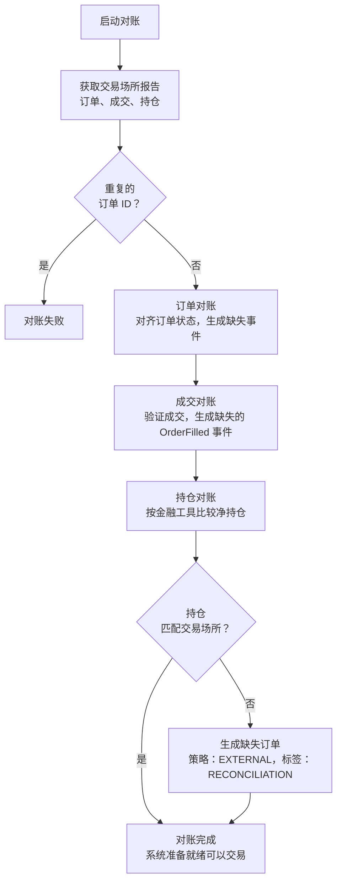

# 实盘交易 (Live Trading)

NautilusTrader 使交易者能够将经过回测 (backtest) 的策略 (strategy) 部署到实时交易环境中，无需修改任何代码。从回测到实盘交易的无缝过渡是该平台的核心特性，确保了一致性和可靠性。

**实盘交易涉及真实的金融风险，需要谨慎的风险管理方法。在部署到生产环境之前，请确保你充分了解系统配置 (configuration)、节点 (node) 操作、执行对账 (execution reconciliation) 以及回测与实盘交易之间差异的所有方面。**

本指南概述了实盘交易的关键要素。

:::warning **每个进程只能运行一个 TradingNode**
由于全局单例状态的限制，不支持在同一进程中并发运行多个 `TradingNode` 实例。
请将多个策略添加到单个节点中，或在单独的进程中运行额外的节点以实现并行执行。

详见 [进程与线程](architecture.md#processes-and-threads)。
:::

:::danger **不建议在 Jupyter notebook 中进行实盘交易**
由于事件循环冲突和运维风险，**不建议**在 Jupyter notebook 中运行实盘交易节点：

- Jupyter 运行自己的 asyncio 事件循环，这与 `TradingNode` 的事件循环管理存在冲突。
- 像 `nest_asyncio` 这样的变通方案不是生产级的解决方案。
- notebook 对于生产环境来说不够稳定：单元格可能被乱序重新执行，内核可能崩溃，状态可能丢失。
- 缺乏生产交易系统所需的正确日志记录、监控和优雅关闭能力。

请使用 Jupyter notebook 进行回测、分析和实验。对于实盘交易，请将交易节点作为独立的 Python 脚本或服务运行，并配合适当的进程管理。
:::

:::info 平台差异
Windows 的信号处理与类 Unix 系统不同。如果你在 Windows 上运行，请阅读 [Windows 信号处理](#windows-signal-handling) 部分的说明，了解优雅关闭行为和 Ctrl+C (SIGINT) 支持的相关指引。
:::

## 配置

在运行实盘交易系统时，正确配置执行引擎 (execution engine) 和策略对于确保可靠性、准确性和性能至关重要。以下是实盘配置所涉及的关键概念和设置的概述。

### `TradingNodeConfig`

实盘交易系统的主要配置类是 `TradingNodeConfig`，它继承自 `NautilusKernelConfig` 并提供实盘特定的配置选项：

```python
from nautilus_trader.config import TradingNodeConfig

config = TradingNodeConfig(
    trader_id="MyTrader-001",

    # 组件配置
    cache=CacheConfig(),
    message_bus=MessageBusConfig(),
    data_engine=LiveDataEngineConfig(),
    risk_engine=LiveRiskEngineConfig(),
    exec_engine=LiveExecEngineConfig(),
    portfolio=PortfolioConfig(),

    # 客户端配置
    data_clients={
        "BINANCE": BinanceDataClientConfig(),
    },
    exec_clients={
        "BINANCE": BinanceExecClientConfig(),
    },
)
```

#### 核心配置参数

| 设置                     | 默认值       | 描述                                        |
|--------------------------|--------------|---------------------------------------------|
| `trader_id`              | "TRADER-001" | 唯一的交易者标识符（名称-标签格式）。         |
| `instance_id`            | `None`       | 可选的唯一实例标识符。                       |
| `timeout_connection`     | 30.0         | 连接 (connection) 超时时间（秒）。           |
| `timeout_reconciliation` | 10.0         | 对账超时时间（秒）。                         |
| `timeout_portfolio`      | 10.0         | 投资组合初始化超时时间。                     |
| `timeout_disconnection`  | 10.0         | 断开连接超时时间。                           |
| `timeout_post_stop`      | 5.0          | 停止后清理超时时间。                         |

#### 缓存数据库配置

使用后端数据库配置数据持久化：

```python
from nautilus_trader.config import CacheConfig
from nautilus_trader.config import DatabaseConfig

cache_config = CacheConfig(
    database=DatabaseConfig(
        host="localhost",
        port=6379,
        username="nautilus",
        password="pass",
        timeout=2.0,
    ),
    encoding="msgpack",  # 或 "json"
    timestamps_as_iso8601=True,
    buffer_interval_ms=100,
    flush_on_start=False,
)
```

#### MessageBus 配置

配置消息路由和外部流传输：

```python
from nautilus_trader.config import MessageBusConfig
from nautilus_trader.config import DatabaseConfig

message_bus_config = MessageBusConfig(
    database=DatabaseConfig(timeout=2),
    timestamps_as_iso8601=True,
    use_instance_id=False,
    types_filter=[QuoteTick, TradeTick],  # 过滤特定消息类型
    stream_per_topic=False,
    autotrim_mins=30,  # 自动消息修剪
    heartbeat_interval_secs=1,
)
```

### 多交易场所配置

实盘交易系统通常连接到多个交易场所 (venue)。以下是为 Binance 配置现货和期货市场的示例：

```python
config = TradingNodeConfig(
    trader_id="MultiVenue-001",

    # 针对不同市场类型的多个数据客户端
    data_clients={
        "BINANCE_SPOT": BinanceDataClientConfig(
            account_type=BinanceAccountType.SPOT,
            testnet=False,
        ),
        "BINANCE_FUTURES": BinanceDataClientConfig(
            account_type=BinanceAccountType.USDT_FUTURES,
            testnet=False,
        ),
    },

    # 对应的执行客户端
    exec_clients={
        "BINANCE_SPOT": BinanceExecClientConfig(
            account_type=BinanceAccountType.SPOT,
            testnet=False,
        ),
        "BINANCE_FUTURES": BinanceExecClientConfig(
            account_type=BinanceAccountType.USDT_FUTURES,
            testnet=False,
        ),
    },
)
```

### 执行引擎配置

`LiveExecEngineConfig` 用于设置实盘执行引擎，管理订单 (order) 处理、执行事件以及与交易场所的对账。
以下概述了主要的配置选项。

通过周全地配置这些参数，你可以确保交易系统高效运行，正确处理订单，并在面对潜在问题（如丢失事件或数据/信息冲突）时保持弹性。

完整详情请参阅 `LiveExecEngineConfig` [API 参考](../api_reference/config#class-liveexecengineconfig)。

#### 对账

**用途**：通过恢复任何遗漏的事件（如订单和持仓 (position) 状态更新），确保系统状态与交易场所保持一致。

| 设置                                | 默认值  | 描述                                                                                               |
|-----------------------------------|---------|----------------------------------------------------------------------------------------------------|
| `reconciliation`                  | True    | 在启动时激活对账，使系统内部状态与交易场所状态对齐。                                                 |
| `reconciliation_lookback_mins`    | None    | 指定系统向前回溯多少分钟来请求过去的事件以对账未缓存的状态。                                         |
| `reconciliation_instrument_ids`   | None    | 用于对账的特定金融工具 (instrument) ID 包含列表。                                                   |
| `filtered_client_order_ids`       | None    | 从对账中过滤的客户端订单 ID 列表（当交易场所存在重复订单时有用）。                                   |

详见[执行对账](#execution-reconciliation)以获取更多背景信息。

#### 订单过滤

**用途**：管理系统应处理哪些订单事件和报告，以避免与其他交易节点冲突以及不必要的数据处理。

| 设置                               | 默认值  | 描述                                                                                                |
|------------------------------------|---------|------------------------------------------------------------------------------------------------------------|
| `filter_unclaimed_external_orders` | False   | 过滤未认领的外部订单，防止不相关的订单影响策略。                                                     |
| `filter_position_reports`          | False   | 过滤持仓状态报告，当多个节点交易同一账户时有助于避免冲突。                                           |

#### 持续对账

**用途**：通过在启动对账完成*之后*运行的持续对账循环来维护准确的执行状态，该循环：

- (1) 监控在途订单 (in-flight order) 是否存在超过配置阈值的延迟。
- (2) 按可配置的间隔与交易场所对账未结订单。
- (3) 审计内部*自有*订单簿与交易场所公开订单簿的一致性。

**启动顺序**：持续对账循环会等待启动对账完成后才开始周期性检查。这可以防止持续检查干扰初始状态对账的竞态条件。`reconciliation_startup_delay_secs` 参数在启动对账完成*之后*应用额外的延迟。

如果某个订单在用尽所有重试次数后仍无法对账，引擎将按如下方式解决该订单：

**在途订单超时解决**（当交易场所在最大重试次数后仍未响应时）：

| 当前状态         | 解决为      | 理由                                       |
|------------------|-------------|--------------------------------------------|
| `SUBMITTED`      | `REJECTED`  | 未收到交易场所的确认。                      |
| `PENDING_UPDATE` | `CANCELED`  | 修改请求未被确认。                          |
| `PENDING_CANCEL` | `CANCELED`  | 交易场所从未确认取消操作。                  |

**订单一致性检查**（当缓存状态与交易场所状态不同时）：

| 缓存状态           | 交易场所状态 | 解决方式    | 理由                                                                |
|--------------------|--------------|-------------|---------------------------------------------------------------------|
| `ACCEPTED`         | 未找到       | `REJECTED`  | 订单在交易场所不存在，可能从未成功提交。                             |
| `ACCEPTED`         | `CANCELED`   | `CANCELED`  | 交易场所取消了该订单（用户操作或交易场所发起）。                     |
| `ACCEPTED`         | `EXPIRED`    | `EXPIRED`   | 订单在交易场所达到 GTD 过期时间。                                   |
| `ACCEPTED`         | `REJECTED`   | `REJECTED`  | 交易场所在初始接受后拒绝（罕见但可能发生）。                         |
| `PARTIALLY_FILLED` | `CANCELED`   | `CANCELED`  | 订单在交易场所被取消，成交记录保留。                                 |
| `PARTIALLY_FILLED` | 未找到       | `CANCELED`  | 订单不存在但有成交记录（对账成交历史）。                             |

:::note
**重要的对账注意事项：**

- **"未找到"解决方式**：这些仅在全历史模式（`open_check_open_only=False`）下执行。在仅未结订单模式（`open_check_open_only=True`，默认值）下，这些检查会被有意跳过。这是因为仅未结订单模式使用交易场所特定的"未结订单"端点，这些端点在设计上排除了已关闭的订单，因此无法区分真正缺失的订单和最近关闭的订单。
- **近期订单保护**：引擎会跳过最后事件时间戳在 `open_check_threshold_ms` 窗口（默认 5 秒）内的订单的对账操作。这可以防止因订单可能仍在交易场所处理中而导致的误报。
- **定向查询保护**：在将订单标记为 `REJECTED` 或 `CANCELED`（"未找到"时）之前，引擎会尝试向交易场所发起一次针对性的单订单查询。这有助于防止因批量查询限制或时序延迟导致的漏报。
- **`FILLED` 订单**：当一个 `FILLED` 订单在交易场所"未找到"时，这被视为正常行为（交易场所通常不跟踪已完成的订单），会被忽略且不产生警告。

:::

#### 重试协调和回溯行为

执行引擎对在途检查循环（受 `inflight_check_retries` 约束）和未结订单循环（受 `open_check_missing_retries` 约束）复用同一个重试计数器（`_recon_check_retries`）。这种共享预算确保更严格的限制优先生效，并防止对同一订单状态进行重复的交易场所查询。

当未结订单循环用尽其重试次数时，引擎会在应用终态之前发出一次针对性的 `GenerateOrderStatusReport` 探测。如果交易场所返回了该订单，对账将继续进行，重试计数器会自动重置。

**单订单查询保护**：为了防止在许多订单需要逐个查询时耗尽速率限制，引擎通过 `max_single_order_queries_per_cycle`（默认：10）限制每个对账周期的单订单查询次数。当达到此限制时，剩余订单将推迟到下一个周期。此外，引擎在单订单查询之间添加可配置的延迟（`single_order_query_delay_ms`，默认：100ms），以进一步防止速率限制。这确保了系统在批量查询对数百个订单失败时，不会压垮交易场所 API。

超过 `open_check_lookback_mins` 时间的订单依赖于这种针对性探测。对于历史窗口较短的交易场所，请保持回溯时间足够大，如果交易场所时间戳落后于本地时钟，请考虑增加 `open_check_threshold_ms`，以防止最近更新的订单被过早标记为缺失。

这确保了交易节点即使在不可靠的条件下也能维护一致的执行状态。

| 设置                                 | 默认值           | 描述                                                                                                                         |
|--------------------------------------|----------------|-------------------------------------------------------------------------------------------------------------------------------------|
| `inflight_check_interval_ms`         | 2,000&nbsp;ms  | 确定系统检查在途订单状态的频率。设为 0 可禁用。                                                                                |
| `inflight_check_threshold_ms`        | 5,000&nbsp;ms  | 设置在途订单触发交易场所状态检查的时间阈值。如果服务器共置，请调整以避免竞态条件。                                               |
| `inflight_check_retries`             | 5&nbsp;次重试  | 指定引擎验证在途订单在交易场所状态的重试次数（在初始尝试失败的情况下）。                                                        |
| `open_check_interval_secs`           | None           | 确定检查交易场所未结订单的频率（秒）。设为 None 或 0.0 可禁用。建议值：5-10 秒，需考虑 API 速率限制。                           |
| `open_check_open_only`               | True           | 启用时，检查期间仅请求未结订单；禁用时，获取完整订单历史（资源密集型）。                                                        |
| `open_check_lookback_mins`           | 60&nbsp;分钟   | 持续对账期间订单状态轮询的回溯窗口（分钟）。仅考虑在此窗口内修改的订单。                                                        |
| `open_check_threshold_ms`            | 5,000&nbsp;ms  | 订单最后一次缓存事件之后的最短时间，超过此时间未结订单检查才会对交易场所的差异（缺失、状态不匹配等）采取行动。                    |
| `open_check_missing_retries`         | 5&nbsp;次重试  | 在将缓存中未结但在交易场所未找到的订单解决之前的最大重试次数。防止竞态条件导致的误报。                                           |
| `max_single_order_queries_per_cycle` | 10             | 每个对账周期的最大单订单查询次数。防止在许多订单批量查询检查失败时耗尽速率限制。                                                 |
| `single_order_query_delay_ms`        | 100&nbsp;ms    | 单订单查询之间的延迟（毫秒），用于防止速率限制耗尽。                                                                            |
| `reconciliation_startup_delay_secs`  | 10.0&nbsp;秒   | 启动对账完成*之后*应用的额外延迟（秒），在开始持续对账循环之前。为系统额外稳定提供时间。                                         |
| `own_books_audit_interval_secs`      | None           | 设置自有订单簿与公开订单簿之间审计的间隔（秒）。验证同步性并记录不一致的错误日志。                                               |

:::warning
**重要配置指引：**

- **`open_check_lookback_mins`**：不要降低到 60 分钟以下。此回溯窗口必须对你的交易场所的订单历史保留时间足够大。设置过短可能会触发错误的"订单缺失"解决，即使有内置保护，因为订单可能只是在查询窗口之外而非真正缺失。
- **`reconciliation_startup_delay_secs`**：生产系统不要降低到 10 秒以下。此延迟在启动对账完成*之后*应用，允许在持续对账检查开始之前有额外的系统稳定时间。这可以防止持续检查在启动对账完成后立即开始。

:::

#### 附加选项

以下附加选项提供了对执行行为的进一步控制：

| 设置                               | 默认值  | 描述                                                                                                |
|------------------------------------|---------|------------------------------------------------------------------------------------------------------------|
| `allow_overfills`                  | False   | 启用后，允许超过订单数量的成交（记录警告而非抛出异常）。当持仓对账与交易所成交事件竞争时有用。         |
| `generate_missing_orders`          | True    | 在对账期间是否生成 `LIMIT` 订单事件以对齐持仓差异。这些订单使用策略 ID `EXTERNAL` 和标签 `RECONCILIATION`，确保正确的持仓净额计算。 |
| `snapshot_orders`                  | False   | 是否在订单事件时拍摄订单快照。                                                                       |
| `snapshot_positions`               | False   | 是否在持仓事件时拍摄持仓快照。                                                                       |
| `snapshot_positions_interval_secs` | None    | 启用时持仓快照之间的间隔（秒）。                                                                     |
| `debug`                            | False   | 启用调试模式以获取额外的执行日志。                                                                   |

#### 内存管理

**用途**：定期从内存缓存中清除已关闭的订单、已关闭的持仓和账户事件，以在长时间运行/高频交易操作期间优化资源使用和性能。

| 设置                                   | 默认值  | 描述                                                                                                                             |
|----------------------------------------|---------|-----------------------------------------------------------------------------------------------------------------------------------------|
| `purge_closed_orders_interval_mins`    | None    | 设置从内存清除已关闭订单的频率（分钟）。建议值：10-15 分钟。不影响数据库记录。                                                    |
| `purge_closed_orders_buffer_mins`      | None    | 指定订单关闭后多长时间才被清除（分钟）。建议值：60 分钟，以确保处理过程完成。                                                     |
| `purge_closed_positions_interval_mins` | None    | 设置从内存清除已关闭持仓的频率（分钟）。建议值：10-15 分钟。不影响数据库记录。                                                    |
| `purge_closed_positions_buffer_mins`   | None    | 指定持仓关闭后多长时间才被清除（分钟）。建议值：60 分钟，以确保处理过程完成。                                                     |
| `purge_account_events_interval_mins`   | None    | 设置从内存清除账户事件的频率（分钟）。建议值：10-15 分钟。不影响数据库记录。                                                      |
| `purge_account_events_lookback_mins`   | None    | 指定账户事件发生后多长时间才被清除（分钟）。建议值：60 分钟。                                                                     |
| `purge_from_database`                  | False   | 启用后，清除操作也会从后端数据库（Redis/PostgreSQL）删除数据，而不仅仅是内存。**请谨慎使用**。                                     |

通过适当配置这些内存管理设置，你可以防止在长时间运行/高频交易会话期间内存使用量无限增长，同时确保最近关闭的订单、已关闭的持仓和账户事件在内存中保持可用，以供可能需要它们的任何正在进行的操作使用。
设置间隔值以启用相应的清除循环；不设置则同时禁用调度和删除。
每个循环委托给[清除缓存状态](cache.md#purging-cached-state)中描述的缓存 API。

#### 队列管理

**用途**：处理订单事件的内部缓冲，以确保平滑处理并防止系统资源过载。

| 设置                             | 默认值   | 描述                                                                                          |
|----------------------------------|----------|------------------------------------------------------------------------------------------------------|
| `qsize`                          | 100,000  | 设置内部队列缓冲区的大小，管理引擎内的数据流。                                                |
| `graceful_shutdown_on_exception` | False    | 当消息队列处理期间发生意外异常时，系统是否应执行优雅关闭（不包括用户 actor/策略异常）。         |

### 策略配置

`StrategyConfig` 类定义了交易策略的配置，确保每个策略使用正确的参数并有效管理订单。
完整参数列表请参阅 `StrategyConfig` [API 参考](../api_reference/config#class-strategyconfig)。

#### 标识

**用途**：为每个策略提供唯一标识符，以防止冲突并确保正确跟踪订单。

| 设置                        | 默认值  | 描述                                                                                            |
|-----------------------------|---------|--------------------------------------------------------------------------------------------------------|
| `strategy_id`               | None    | 策略的唯一 ID，确保其可被明确识别。                                                              |
| `order_id_tag`              | None    | 策略订单的唯一标签，用于区分来自多个策略的订单。                                                  |

#### 订单管理

**用途**：控制策略级别的订单处理，包括持仓 ID 处理、认领相关的外部订单、自动化条件订单逻辑（OUO/OCO），以及跟踪 GTD 过期。

| 设置                        | 默认值  | 描述                                                                                                            |
|-----------------------------|---------|------------------------------------------------------------------------------------------------------------------------|
| `oms_type`                  | None    | 指定 [OMS 类型](../concepts/execution#oms-configuration)，用于持仓 ID 处理和订单处理流程。                       |
| `use_uuid_client_order_ids` | False   | 是否使用 UUID4 作为客户端订单 ID 值（某些交易场所如 Coinbase Intx 需要此设置）。                                  |
| `external_order_claims`     | None    | 列出策略应认领的外部订单的金融工具 ID，有助于准确的订单管理。                                                     |
| `manage_contingent_orders`  | False   | 启用后，策略自动管理条件订单，减少人工干预。                                                                      |
| `manage_gtd_expiry`         | False   | 启用后，策略管理 GTD 过期，确保订单按预期保持活跃。                                                               |

### Windows 信号处理

:::warning
Windows：asyncio 事件循环未实现 `loop.add_signal_handler`。因此，传统的 `TradingNode` 在 Windows 上不会通过 asyncio 接收操作系统信号。请使用 Ctrl+C (SIGINT) 处理或编程式关闭；不应期待 Windows 上的 SIGTERM 对等功能。
:::

在 Windows 上，asyncio 事件循环未实现 `loop.add_signal_handler`，因此 Unix 风格的信号集成不可用。因此，`TradingNode` 在 Windows 上不会通过 asyncio 接收操作系统信号，除非你进行干预，否则不会优雅停止。

Windows 上推荐的方法：

- 用 `try/except KeyboardInterrupt` 包装 `run`，并调用 `node.stop()` 然后 `node.dispose()`。Windows 上的 Ctrl+C 会在主线程中引发 `KeyboardInterrupt`，提供一个干净的关闭路径。
- 或者，以编程方式发布 `ShutdownSystem` 命令（或从 actor/组件中调用 `shutdown_system(...)`）来触发相同的关闭路径。

"inflight check loop task still pending" 消息与 Windows 上缺少 asyncio 信号处理一致，即正常的优雅关闭路径没有被触发。

这作为增强请求被跟踪，以在传统路径中支持 Windows 的 Ctrl+C (SIGINT)。
<https://github.com/nautechsystems/nautilus_trader/issues/2785>

对于新的 v2 系统，`LiveNode` 已经通过 `tokio::signal::ctrl_c()` 和 Python SIGINT 桥接干净地支持 Ctrl+C，因此运行器可以正常停止，任务可以干净地关闭。

Windows 的示例模式：

```python
try:
    node.run()
except KeyboardInterrupt:
    pass
finally:
    try:
        node.stop()
    finally:
        node.dispose()
```

## 执行对账

执行对账是将订单和持仓（包括已关闭和未结的）的外部实际状态与系统基于事件构建的内部状态进行对齐的过程。
此过程主要适用于实盘交易，这就是为什么只有 `LiveExecutionEngine` 具有对账能力。

:::note 术语
**在途订单** (in-flight order) 是正在等待交易场所确认的订单：

- `SUBMITTED` - 初始提交，等待接受/拒绝。
- `PENDING_UPDATE` - 已请求修改，等待确认。
- `PENDING_CANCEL` - 已请求取消，等待确认。

这些订单由持续对账循环监控，以检测过期或丢失的消息。
:::

对账有两种主要场景：

- **存在先前缓存的执行状态**：当存在缓存的执行状态时，使用报告中的信息生成缺失事件以对齐状态。
- **无先前缓存的执行状态**：当不存在缓存状态时，所有外部存在的订单和持仓都从头生成。

:::tip
**最佳实践**：将所有执行事件持久化到缓存数据库中，以最大限度减少对交易场所历史的依赖，确保即使在较短的回溯窗口下也能完全恢复。
:::

### 对账配置

除非通过将 `reconciliation` 配置参数设置为 false 来禁用对账，否则执行引擎将对每个交易场所执行执行对账程序。
此外，你可以通过设置 `reconciliation_lookback_mins` 配置参数来指定对账的回溯窗口。

:::tip
我们建议不设置特定的 `reconciliation_lookback_mins`。这允许向交易场所发出的请求利用可用的最大执行历史进行对账。
:::

:::warning
如果执行发生在回溯窗口之前，将生成必要的事件以对齐内部和外部状态。这可能导致一些本可通过更长的回溯窗口避免的信息丢失。

此外，某些交易场所可能在特定条件下过滤或丢弃执行信息，导致进一步的信息丢失。如果所有事件都持久化在缓存数据库中，则不会发生这种情况。
:::

每个策略还可以配置为使用 `external_order_claims` 配置参数来认领对账期间为某个金融工具 ID 生成的任何外部订单。
这在以下情况下很有用：系统启动时没有缓存状态，或者希望策略恢复其操作并继续管理特定金融工具的现有未结订单。

在持仓对账期间使用策略 ID `EXTERNAL` 和标签 `RECONCILIATION` 生成的订单是引擎内部的，不能通过 `external_order_claims` 认领。
它们仅用于对齐持仓差异，不应由用户策略管理。

:::tip
要在策略中检测外部订单，请检查 `order.strategy_id.value == "EXTERNAL"`。这些订单像其他任何订单一样包含在投资组合计算和持仓跟踪中。
:::

完整的实盘交易选项列表请参阅 `LiveExecEngineConfig` [API 参考](../api_reference/config#class-liveexecengineconfig)。

### 对账程序

对账程序对所有适配器执行客户端 (execution client) 是标准化的，使用以下方法生成执行批量状态：

- `generate_order_status_reports`
- `generate_fill_reports`
- `generate_position_status_reports`



然后系统状态与代表外部"现实"的报告进行对账：

- **重复检查**：
  - 检查是否存在重复的客户端订单 ID 和交易 ID。
  - 重复的客户端订单 ID 会导致对账失败，以防止状态损坏。
- **订单对账**：
  - 生成并应用必要的事件，将订单从任何缓存状态更新到当前状态。
  - 如果缺少任何交易报告，将生成推断的 `OrderFilled` 事件。
  - 如果任何客户端订单 ID 未被识别，或订单报告缺少客户端订单 ID，将生成外部订单事件。
  - 使用基于容差的比较来验证成交报告数据的一致性，包括价格和佣金差异。
- **持仓对账**：
  - 使用金融工具精度处理，确保每个金融工具的净持仓与交易场所返回的持仓报告匹配。
  - 如果订单对账产生的持仓状态与外部状态不匹配，将生成外部订单事件以解决差异。
  - 当 `generate_missing_orders` 启用时（默认：True），使用策略 ID `EXTERNAL` 和标签 `RECONCILIATION` 生成订单，以对齐对账期间发现的持仓差异。
  - 分层价格确定策略确保即使数据有限也能继续对账：
    1. **计算的对账价格**（首选）：使用对账价格函数来实现目标平均持仓。
    2. **市场中间价**：如果无法计算对账价格，则回退到当前买卖价中点。
    3. **当前持仓平均价**：如果没有市场数据可用，则使用现有持仓平均价格。
    4. **市价单**（最后手段）：当没有任何价格信息时（无持仓、无市场数据），生成市价单。
  - 当可以确定价格时（情况 1-3），使用限价单，确保准确的盈亏计算。
  - 仅在没有可用定价数据的全新启动时，才使用市价单作为最后手段。
  - 精度舍入后的零数量差异会被优雅处理。
- **部分窗口调整**：
  - 当设置了 `reconciliation_lookback_mins` 时，对账窗口可能无法捕获完整的持仓历史（缺少开仓成交）。
  - 系统使用生命周期分析自动调整成交，以确保准确的持仓重建：
    - 检测零穿越（当持仓数量穿过 FLAT）以识别不同的持仓生命周期。
    - 当最早的生命周期不完整时添加合成开仓成交。
    - 当当前生命周期匹配交易场所持仓时过滤掉已关闭的生命周期。
    - 用反映交易场所持仓的合成成交替换不匹配的当前生命周期。
  - 合成成交使用计算的对账价格来实现目标平均持仓。
  - 详见[部分窗口调整场景](#partial-window-adjustment-scenarios)。
- **异常处理**：
  - 单个适配器的失败不会中止整个对账过程。
  - 当成交报告先于订单状态报告到达时，会被优雅处理。

如果对账失败，系统将不会继续启动，并会记录错误。

### 常见对账场景

以下场景分为启动对账（批量状态）和运行时/持续检查（在途订单检查、未结订单轮询和自有订单簿审计）。

#### 启动对账

| 场景                                   | 描述                                                                                              | 系统行为                                                                         |
|----------------------------------------|---------------------------------------------------------------------------------------------------|----------------------------------------------------------------------------------|
| **订单状态差异**                        | 本地订单状态与交易场所不同（例如，本地显示 `SUBMITTED`，交易场所显示 `REJECTED`）。                | 更新本地订单以匹配交易场所状态并发出缺失事件。                                    |
| **遗漏的成交**                          | 交易场所完成了订单成交，但引擎遗漏了成交事件。                                                    | 生成缺失的 `OrderFilled` 事件。                                                  |
| **多次成交**                            | 订单有多次部分成交，其中一些被引擎遗漏。                                                          | 从交易场所报告重建完整的成交历史。                                                |
| **外部订单**                            | 交易场所存在但本地缓存中不存在的订单（外部下单或来自其他系统）。                                  | 从交易场所报告创建订单；标记为 `EXTERNAL`。                                       |
| **部分成交后取消**                      | 订单部分成交后被交易场所取消。                                                                    | 将订单状态更新为 `CANCELED`，同时保留成交历史。                                   |
| **不同的成交数据**                      | 交易场所报告的成交价格/佣金与缓存不同。                                                          | 保留缓存的成交数据；记录报告中的差异。                                            |
| **被过滤的订单**                        | 通过配置标记为过滤的订单。                                                                        | 基于 `filtered_client_order_ids` 或金融工具过滤器跳过对账。                       |
| **重复的客户端订单 ID**                 | 交易场所报告中存在相同客户端订单 ID 的多个订单。                                                  | 对账失败以防止状态损坏。                                                          |
| **持仓数量不匹配（多头）**              | 内部多头持仓与外部不同（例如，内部：100，外部：150）。                                            | 当 `generate_missing_orders=True` 时，生成带计算价格的 BUY LIMIT 订单。           |
| **持仓数量不匹配（空头）**              | 内部空头持仓与外部不同（例如，内部：-100，外部：-150）。                                          | 当 `generate_missing_orders=True` 时，生成带计算价格的 SELL LIMIT 订单。          |
| **持仓减少**                            | 外部持仓小于内部（例如，内部：150 多头，外部：100 多头）。                                        | 生成带计算价格的反向 LIMIT 订单以减少持仓。                                       |
| **持仓方向翻转**                        | 内部持仓与外部方向相反（例如，内部：100 多头，外部：50 空头）。                                   | 生成带计算价格的 LIMIT 订单以平掉内部持仓并开立外部持仓。                          |
| **内部对账订单**                        | 持仓对账订单，策略 ID 为 "EXTERNAL"，标签为 "RECONCILIATION"。                                    | 永远不会被过滤，无论 `filter_unclaimed_external_orders` 设置如何（通过标签检查过滤）。 |

#### 运行时/持续检查

| 场景                                   | 描述                                                                        | 系统行为                                                                                                        |
|----------------------------------------|-----------------------------------------------------------------------------|------------------------------------------------------------------------------------------------------------------------|
| **在途订单超时**                        | 在途订单在超过阈值后仍未确认。                                              | 在 `inflight_check_retries` 次重试后，解决为 `REJECTED` 以维护一致状态。                                        |
| **未结订单检查差异**                    | 定期未结订单轮询在交易场所检测到状态变化。                                  | 在 `open_check_interval_secs` 间隔时，确认状态（遵循 `open_check_open_only`）并在变化时应用转换。               |
| **自有订单簿审计不匹配**               | 自有订单簿与交易场所公开订单簿出现偏差。                                    | 在 `own_books_audit_interval_secs` 间隔时，审计并记录不一致以供调查。                                           |

### 常见对账问题

- **缺失的交易报告**：某些交易场所会过滤掉较旧的交易，导致对账不完整。增加 `reconciliation_lookback_mins` 或确保所有事件在本地缓存。
- **持仓不匹配**：如果外部订单早于回溯窗口，持仓可能无法对齐。在重启系统前平掉账户以重置状态。
- **重复的订单 ID**：批量状态报告中的重复客户端订单 ID 将导致对账失败。确保交易场所数据完整性或联系支持。
- **精度差异**：持仓数量中的小数点差异使用金融工具精度自动处理，但大的差异可能表明存在缺失订单。
- **乱序报告**：在订单状态报告之前到达的成交报告会被推迟，直到订单状态可用。

:::tip
对于持续存在的对账问题，考虑在系统重启前删除缓存状态或平掉账户。
:::

### 对账不变量

对账系统维护以下不变量以确保持仓准确性：

1. **持仓数量准确性**：系统确保最终持仓数量与交易场所完全匹配（在金融工具精度范围内）。
2. **平均入场价格准确性**：系统确保持仓的平均入场价格与交易场所报告的平均价格匹配（在配置的容差范围内，默认 0.01%）。
3. **盈亏计算完整性**：所有生成的成交（包括合成成交）使用计算价格，以基于交易场所持仓数据保持正确的未实现盈亏。

即使在以下情况下，这些不变量也会得到维护：

- 对账窗口未捕获完整的成交历史。
- 交易场所报告中缺少成交。
- 持仓生命周期跨越回溯窗口之外。
- 发生了多次持仓翻转（零穿越）。

### 部分窗口调整场景

当对账窗口未捕获完整的持仓历史（受限的 `reconciliation_lookback_mins`）时，系统会分析成交的持仓生命周期，并应用调整以确保准确的持仓重建，同时维护对账不变量。

| 场景                                      | 描述                                                                                                          | 系统行为 |
|--------------------------------------------|-----------------------------------------------------------------------------------------------------------------------|-----------------|
| **完整生命周期**                           | 从持仓开仓到当前状态的所有成交都在窗口内捕获。                                                                | 无调整 - 成交原样返回。 |
| **不完整的单一生命周期**                   | 窗口遗漏了开仓成交，但未检测到零穿越（持仓沿一个方向累积）。                                                  | 在开头添加带计算价格的合成开仓成交，以实现目标平均持仓。 |
| **多个生命周期 - 当前匹配**               | 检测到零穿越，当前生命周期（最后一次零穿越之后）匹配交易场所持仓。                                            | 过滤掉旧生命周期 - 仅返回当前生命周期的成交（最后一次零穿越之后）。 |
| **多个生命周期 - 当前不匹配**             | 检测到零穿越，当前生命周期不匹配交易场所持仓（窗口遗漏了一些当前生命周期的成交）。                            | 用反映交易场所持仓的单一合成成交替换整个当前生命周期。 |
| **平仓状态**                               | 无论成交历史如何，交易场所报告 FLAT 持仓。                                                                    | 无调整 - 成交原样返回。 |
| **无成交**                                 | 对账窗口内没有成交报告。                                                                                      | 无调整 - 空结果。 |

**关键概念：**

- **零穿越 (Zero-crossing)**：当持仓数量穿过零（FLAT）时，标志着不同持仓生命周期之间的边界。
- **生命周期 (Lifecycle)**：零穿越之间的一系列成交，代表一个连续的持仓开仓-平仓周期。
- **合成成交 (Synthetic fill)**：系统创建的计算成交报告，用于表示缺失的交易活动，使用对账价格计算来实现正确的平均持仓。
- **容差 (Tolerance)**：持仓匹配使用可配置的价格容差（默认：0.0001 = 0.01% 相对差异）来考虑微小的计算差异。
