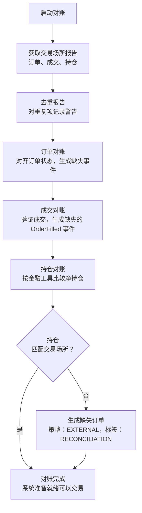

# 实盘交易 (Live Trading)

NautilusTrader 可以将经过回测 (backtest) 的策略部署到实时市场，无需修改任何代码。
相同的 actor、策略和执行算法既能在回测引擎上运行，也能在实盘交易节点上运行。

:::warning
**实盘交易涉及真实的金融风险。在部署到生产环境之前，请充分理解系统配置、节点操作、执行对账，
以及回测与实盘交易之间的差异。**
:::

## 配置

关于配置结构体如何处理默认值、`T` 与 `Option<T>` 的语义以及构建器模式，
请参阅 [配置](configuration.md) 概念指南。

关于 `TradingNodeConfig`、执行引擎选项、策略配置以及多交易场所连接的分步设置，
请参阅 [配置实盘交易节点](../how_to/configure_live_trading.md) how-to 指南。

## 实盘执行策略

### 订单命令结果策略

实盘命令的结果是以下之一：

- 被交易场所确认。
- 被交易场所明确拒绝，或被交易场所 API 拒绝接收。
- 在提交离开系统边界之前，被 Nautilus 在本地拒绝。
- 在 Nautilus 向交易场所查询最终状态期间，被记录为未解决。

拒绝事件只在出现明确的命令结果时产生，而不会在含糊的失败时产生：

- `OrderRejected`。
- `OrderModifyRejected`。
- `OrderCancelRejected`。

在订单进入 `SUBMITTED` 之前，Nautilus 可以在本地拒绝一次提交。这些失败会表现为
`OrderDenied`，不会发出 `OrderSubmitted` 事件。

当一次提交到达交易场所 API 之后，如果订单响应证明交易场所没有接受该订单，Nautilus 会发出
`OrderRejected`。这包括结构化的交易场所提交拒绝，以及交易场所语义保证不接受的 API 拒收，
例如 HTTP 400、401、403 和 429 状态响应。只有当交易场所特定的语义证明了不接受时，
状态码才是明确的。

| 命令类型                       | 拒绝事件              | 出现时机                                                  |
|--------------------------------|-----------------------|----------------------------------------------------------|
| 提交单个订单与提交订单列表     | `OrderRejected`       | 交易场所或 API 响应证明订单未被接受。                    |
| 修改                           | `OrderModifyRejected` | 交易场所返回针对修改命令的拒绝。                          |
| 取消、全部取消与批量取消       | `OrderCancelRejected` | 交易场所返回针对命令或针对单个订单的取消拒绝。            |

一个成功的响应仍可能包含针对单个订单的失败字段，这些字段属于明确的命令结果。一次整体请求失败
若没有针对单个订单的结果，则保持未解决状态，除非目标命令被证明已被拒收。

其他本地验证失败的报告方式不同：

- 取消、修改、全部取消和批量取消命令在本地检查失败时会记录警告，
  不会产生拒绝事件。

:::note[含糊的结果]
以下失败会导致交易场所的结果未知：

- 传输错误、WebSocket 发送失败、请求超时和断开连接。
- 被取消的本地任务、缺失的确认以及服务器错误。
- 请求可能已到达交易场所之后发生的解析失败。
- 没有针对单个订单的交易场所结果的整批失败。
- `PENDING_UPDATE` 和 `PENDING_CANCEL` 的在途重试耗尽。
- 速率限制，但被视为明确提交拒绝的创建订单 API 拒收除外。

当结果未知时，Nautilus 会记录该失败，让订单保持在当前的在途状态，并等待
WebSocket 更新、未结订单轮询、在途检查或启动对账来解决状态。
:::

:::note[术语]
**在途订单 (in-flight order)** 是正在等待交易场所确认的订单：

- `SUBMITTED` - 初始提交，等待接受/拒绝。
- `PENDING_UPDATE` - 已请求修改，等待确认。
- `PENDING_CANCEL` - 已请求取消，等待确认。

这些订单由 WebSocket 更新、未结订单轮询、在途检查和启动对账来监控。
:::

对于从未被确认的提交，`LiveExecutionEngine` 的在途检查会向交易场所查询。
如果订单在超过 `inflight_check_retries` 后仍未确认，引擎会将其解决为
`REJECTED`。待取消和待更新的结果在交易场所对账确认其最终状态之前保持未解决。
参见下文的运行时检查表。

## 执行对账

执行对账将交易场所的实际订单和持仓状态与系统基于事件构建的内部状态进行对齐。
只有 `LiveExecutionEngine` 执行对账，因为回测同时控制着双方。

两种场景：

- **存在缓存状态**：报告数据生成缺失事件以对齐状态。
- **无缓存状态**：交易场所的所有订单和持仓都从头生成。

:::tip
将所有执行事件持久化到缓存数据库。这能减少对交易场所历史的依赖，
即使回溯窗口很短也能完全恢复。
:::

### 对账配置

除非将 `reconciliation` 设置为 false，否则执行引擎会在启动时为每个交易场所对账状态。
`reconciliation_lookback_mins` 参数控制引擎请求历史的回溯距离。

:::tip
不要设置 `reconciliation_lookback_mins`。这能让引擎请求交易场所所提供的最大执行历史。
:::

:::warning
回溯窗口之前的执行仍会生成对齐事件，但会有一些信息丢失，而更长的窗口能避免这种丢失。
某些交易场所还会过滤或丢弃较旧的执行数据。将所有事件持久化到缓存数据库可以避免这两个问题。
:::

每个策略可以通过 `external_order_claims` 配置参数，为某个金融工具 ID 认领来自交易场所的外部订单
以及具体化的对账活动。这让策略在没有缓存状态时也能恢复对未结订单和持仓的管理。

未被认领的外部订单使用策略 ID `EXTERNAL`，标签为 `VENUE`。在持仓对账期间生成的未被认领订单使用
策略 ID `EXTERNAL`，标签为 `RECONCILIATION`。被认领的订单和成交使用认领策略的 ID，且没有
外部/对账标签，因此该策略可以继续管理恢复的状态。

:::tip
要在策略中检测未被认领的外部订单，请检查 `order.strategy_id.value == "EXTERNAL"`。
这些订单像其他任何订单一样参与投资组合计算和持仓跟踪。
:::

完整的实盘交易选项列表，请参阅 `LiveExecEngineConfig` [API 参考](/docs/python-api-latest/config.html#nautilus_trader.live.config.LiveExecEngineConfig)。

### 对账程序

所有适配器执行客户端都遵循相同的对账程序，调用三个方法来生成执行批量状态：

- `generate_order_status_reports`
- `generate_fill_reports`
- `generate_position_status_reports`



系统将其状态与这些代表外部现实的报告进行对账：

- **重复检查**：
  - 对批次内的订单报告去重并记录警告。
  - 将重复的交易 ID 作为警告记录以供调查。
- **订单对账**：
  - 生成并应用事件，将订单从缓存状态移动到当前状态。
  - 为缺失的交易报告推断 `OrderFilled` 事件。
  - 为无法识别的客户端订单 ID 或缺少客户端订单 ID 的报告生成外部订单事件。
  - 使用基于容差的价格和佣金比较来验证成交报告数据的一致性。
- **持仓对账**：
  - 使用金融工具精度，将每个账户和金融工具的净持仓与交易场所的持仓报告进行匹配。
  - 当订单对账后的持仓与交易场所不一致时，生成外部订单事件。
  - 当 `generate_missing_orders` 启用时（默认：True），使用策略 ID
    `EXTERNAL` 和标签 `RECONCILIATION` 生成订单以对齐差异。
  - 当同一账户和金融工具的 NETTING 所有权被拆分到多个策略时记录警告，
    因为交易场所的持仓报告是账户级别的净持仓。
  - 在生成对账订单时按以下价格层级逐级回退：
    1. **计算的对账价格**（首选）：以正确的平均持仓为目标。
    2. **市场中间价**：使用当前买卖价中点。
    3. **当前持仓平均价**：使用现有持仓的平均价格。
    4. **市价单 (MARKET)**（最后手段）：仅在不存在任何价格数据时（无持仓、无市场数据）使用。
  - 当可以确定价格时（情况 1-3），使用限价单以保持盈亏的准确性。
  - 跳过精度舍入后数量差异为零的情况。
- **部分窗口调整**：
  - 当设置了 `reconciliation_lookback_mins` 时，窗口可能会遗漏开仓成交。
  - 系统使用生命周期分析来调整成交，以准确重建持仓：
    - 检测零穿越（持仓数量穿过 FLAT）以识别不同的生命周期。
    - 当最早的生命周期不完整时添加合成开仓成交。
    - 当当前生命周期匹配交易场所持仓时过滤掉已关闭的生命周期。
    - 用反映交易场所持仓的合成成交替换不匹配的当前生命周期。
  - 合成成交使用计算的对账价格以正确的平均持仓为目标。
  - 详见[部分窗口调整场景](#partial-window-adjustment-scenarios)。
- **异常处理**：
  - 单个适配器的失败不会中止整个对账过程。
  - 在订单状态报告之前到达的成交报告会被推迟，直到订单状态可用。

如果对账失败，系统会记录错误并且不会启动。

### 常见对账场景

下表涵盖启动对账（批量状态）和运行时检查
（在途订单检查、未结订单轮询、自有订单簿审计）。

#### 启动对账

| 场景                                   | 描述                                                                              | 系统行为                                                                          |
|----------------------------------------|-----------------------------------------------------------------------------------|-----------------------------------------------------------------------------------|
| **订单状态差异**                       | 本地状态与交易场所不同（例如，本地 `SUBMITTED`，交易场所 `REJECTED`）。            | 更新本地订单以匹配交易场所状态，发出缺失事件。                                     |
| **遗漏的成交**                         | 交易场所完成了订单成交，但引擎遗漏了该事件。                                       | 生成缺失的 `OrderFilled` 事件。                                                    |
| **多次成交**                           | 订单有部分成交，其中一些被引擎遗漏。                                               | 从交易场所报告重建完整的成交历史。                                                 |
| **外部订单**                           | 交易场所存在但本地缓存中不存在的订单。                                             | 创建未被认领的订单，策略 ID 为 `EXTERNAL`，标签为 `VENUE`。                        |
| **部分成交后取消**                     | 订单部分成交后被交易场所取消。                                                     | 将状态更新为 `CANCELED`，保留成交历史。                                            |
| **不同的成交数据**                     | 交易场所报告的成交价格/佣金与缓存不同。                                            | 保留缓存数据，记录差异。                                                           |
| **被过滤的订单**                       | 通过配置标记为过滤的订单。                                                         | 基于 `filtered_client_order_ids` 或金融工具过滤器跳过。                            |
| **重复的订单报告**                     | 多个订单共享相同的标识符。                                                         | 去重并记录警告。                                                                   |
| **持仓数量不匹配（多头）**             | 内部多头持仓与交易场所不同（例如，100 与 150）。                                   | 当 `generate_missing_orders=True` 时，生成带计算价格的 BUY LIMIT。                 |
| **持仓数量不匹配（空头）**             | 内部空头持仓与交易场所不同（例如，-100 与 -150）。                                 | 当 `generate_missing_orders=True` 时，生成带计算价格的 SELL LIMIT。                |
| **持仓减少**                           | 交易场所持仓小于内部（例如，内部 150 多头，交易场所 100 多头）。                   | 生成带计算价格的反向 LIMIT 订单。                                                  |
| **持仓方向翻转**                       | 内部持仓与交易场所方向相反（例如，内部 100 多头，交易场所 50 空头）。              | 生成 LIMIT 订单以平掉内部持仓并开立外部持仓。                                      |
| **内部对账订单**                       | 为对齐持仓差异而生成的订单。                                                       | 配置时使用认领；否则使用 `EXTERNAL` + `RECONCILIATION`。                           |

#### 运行时检查

持续对账在启动对账完成后开始。它会：

- 监控在途订单是否存在超过配置阈值的延迟。
- 按配置的间隔与交易场所对账未结订单。
- 审计内部*自有*订单簿与交易场所的公开订单簿的一致性。

该循环会等待启动对账完成后才开始周期性检查。
`reconciliation_startup_delay_secs` 参数在启动对账完成*之后*增加额外延迟，
给系统留出稳定的时间。

| 场景                            | 描述                                                | 系统行为                                            |
|---------------------------------|-----------------------------------------------------|-----------------------------------------------------|
| **明确的提交 API 拒收**         | API 在接受之前拒绝创建订单。                         | 发出 `OrderRejected`。                              |
| **含糊的提交失败**              | 提交失败但没有确认的交易场所拒收。                  | 记录失败并等待对账。                                |
| **在途提交超时**                | `SUBMITTED` 在重试耗尽后仍未确认。                  | 解决为 `REJECTED`。                                 |
| **在途取消/更新超时**           | `PENDING_CANCEL` 或 `PENDING_UPDATE` 超过重试次数。 | 记录警告并保持未解决。                              |
| **未结订单检查差异**            | 周期性轮询检测到交易场所状态变化。                  | 确认状态并应用转换。                                |
| **自有订单簿审计不匹配**        | 自有订单簿与交易场所公开订单簿出现偏差。            | 审计并记录不一致。                                  |

**在途订单超时解决**（交易场所在达到最大重试次数后仍未响应）：

| 当前状态         | 解决为      | 理由                                       |
|------------------|-------------|--------------------------------------------|
| `SUBMITTED`      | `REJECTED`  | 未收到交易场所的接受确认。                  |
| `PENDING_UPDATE` | *未解决*    | 修改结果仍然未知。                          |
| `PENDING_CANCEL` | *未解决*    | 取消结果仍然未知。                          |

**订单一致性检查**（当缓存状态与交易场所状态不同时）：

*未找到* 行仅在全历史模式（`open_check_open_only=False`）下适用；
仅未结订单模式是默认值。

| 缓存状态           | 交易场所状态 | 解决方式    | 理由                                                                |
|--------------------|--------------|-------------|---------------------------------------------------------------------|
| `SUBMITTED`        | *未找到*     | `REJECTED`  | 订单从未被交易场所确认（例如，在网络错误中丢失）。                  |
| `ACCEPTED`         | *未找到*     | `REJECTED`  | 订单在交易场所不存在，可能从未成功下单。                            |
| `ACCEPTED`         | `CANCELED`   | `CANCELED`  | 交易场所取消了该订单（用户操作或交易场所发起）。                    |
| `ACCEPTED`         | `EXPIRED`    | `EXPIRED`   | 订单在交易场所达到 GTD 过期时间。                                   |
| `ACCEPTED`         | `REJECTED`   | `REJECTED`  | 交易场所在初始接受后拒绝（罕见但可能发生）。                        |
| `PENDING_UPDATE`   | *未找到*     | *未解决*    | 修改结果仍然未知。                                                  |
| `PENDING_CANCEL`   | *未找到*     | *未解决*    | 取消结果仍然未知。                                                  |
| `PARTIALLY_FILLED` | `CANCELED`   | `CANCELED`  | 订单在交易场所被取消，成交记录保留。                                |
| `PARTIALLY_FILLED` | *未找到*     | `CANCELED`  | 订单不存在但有成交记录（对账成交历史）。                            |

:::note
**运行时对账注意事项：**

- **仅未结订单模式**：交易场所的"未结订单"端点在设计上排除已关闭的订单，因此无法
  区分缺失的订单和最近关闭的订单。当缺失订单检查无法证明交易场所的最终状态时，
  待取消/待更新订单保持未解决。
- **近期订单保护**：引擎会跳过最后事件落在 `open_check_threshold_ms` 窗口内的订单的对账。
  这可以防止因交易场所仍在处理而产生竞态条件的误报。
- **定向查询保护**：在应用终态的"未找到"解决之前，引擎会向交易场所发起一次单订单查询。
  这能捕获因批量查询限制或时序延迟导致的漏报。
- **`FILLED` 订单** 在交易场所"未找到"时会被静默忽略。交易场所通常会从查询结果中
  丢弃已完成的订单。

:::

**重试协调。** 在途循环和未结订单循环共享同一个重试计数器
（`_recon_check_retries`），分别受 `inflight_check_retries` 和
`open_check_missing_retries` 约束。对于符合终态解决条件的状态，更严格的限制优先生效，
并避免对同一订单状态进行重复的交易场所查询。

当未结订单循环耗尽重试次数时，引擎会在应用终态或将含糊的待取消/待更新订单保持未解决之前，
发出一次定向的 `GenerateOrderStatusReport` 探测。如果交易场所返回了该订单，
对账将继续进行，重试计数器会重置。

**单订单查询节流。** 引擎通过 `max_single_order_queries_per_cycle` 限制每个周期的单订单查询次数。
剩余的订单推迟到下一个周期。`single_order_query_delay_ms` 在连续查询之间间隔，以避免速率限制。
这能在数百个订单的批量查询失败时进行处理，而不会压垮交易场所 API。

### 常见对账问题

- **缺失的交易报告**：某些交易场所会过滤掉较旧的交易。增大
  `reconciliation_lookback_mins` 或将所有事件缓存在本地。
- **持仓不匹配**：早于回溯窗口的外部订单会导致持仓漂移。
  在重启前平掉账户以重置状态。
- **拆分的 NETTING 所有权**：多个策略可以为同一账户和金融工具持有缓存持仓，
  但交易场所只报告单一的账户级净持仓。在恢复外部状态时，建议每个 NETTING 账户/金融工具对
  只用一个认领策略。
- **重复的订单 ID**：去重并记录警告。频繁出现重复可能表明
  交易场所存在数据完整性问题。
- **精度差异**：小数点差异使用金融工具精度处理。
  大的差异可能表明存在缺失订单。
- **乱序报告**：在订单状态报告之前到达的成交报告会被推迟，直到
  订单状态可用。

:::tip
对于持续存在的问题，请在重启前删除缓存状态或平掉账户。
:::

### 对账不变量

对账系统维护四个不变量：

1. **持仓数量**：最终数量在金融工具精度范围内与交易场所匹配。
2. **平均入场价格**：持仓的平均入场价格在容差范围内（默认 0.01%）与交易场所报告的价格匹配。
3. **盈亏完整性**：所有生成的成交（包括合成成交）都使用计算价格，以保持正确的未实现盈亏。
4. **ID 确定性**：对账期间发出的合成 `trade_id` 和 `venue_order_id` 值是逻辑事件的确定性函数。同一个逻辑成交或持仓调整订单在重启间会产生相同的 ID，因此重放的对账事件会与之前运行的事件去重，而不会被当作新事件处理。

即使在以下情况下，这些不变量仍然成立：

- 对账窗口未捕获完整的成交历史。
- 交易场所报告中缺少成交。
- 持仓生命周期跨越回溯窗口之外。
- 发生了多次零穿越。

### 部分窗口调整场景

当 `reconciliation_lookback_mins` 限制了窗口时，系统会从成交分析持仓生命周期，
并进行调整以准确重建持仓。

| 场景                                      | 描述                                                                  | 系统行为                                                             |
|-------------------------------------------|-----------------------------------------------------------------------|--------------------------------------------------------------------|
| **完整生命周期**                          | 从开仓到当前状态的所有成交都被捕获。                                  | 无调整。                                                           |
| **不完整的单一生命周期**                  | 窗口遗漏了开仓成交，无零穿越。                                        | 添加带计算价格的合成开仓成交。                                     |
| **多个生命周期，当前匹配**                | 检测到零穿越，当前生命周期匹配交易场所。                              | 过滤掉旧生命周期，仅返回当前生命周期。                             |
| **多个生命周期，当前不匹配**              | 检测到零穿越，当前生命周期与交易场所不同。                            | 用单一合成成交替换当前生命周期。                                   |
| **平仓持仓**                              | 无论成交历史如何，交易场所报告 FLAT。                                 | 无调整。                                                           |
| **无成交**                                | 窗口内没有成交报告。                                                  | 无调整，结果为空。                                                 |

**关键概念：**

- **零穿越 (Zero-crossing)**：持仓数量穿过零（FLAT），标志着生命周期边界。
- **生命周期 (Lifecycle)**：零穿越之间的一系列成交，代表一个开仓-平仓周期。
- **合成成交 (Synthetic fill)**：表示缺失活动的计算成交报告，其价格用于实现正确的平均持仓。
- **容差 (Tolerance)**：持仓匹配使用可配置的价格容差（默认 0.0001 = 0.01%）来吸收微小的计算差异。

## 出错时关闭

设置 `LiveNodeConfig.shutdown_on_error=True`，使 Rust 错误日志请求实盘节点关闭。
Rust logger 会记录内核启动后发出的第一条 `log::error!`（包括来自其他线程的错误日志），
内核会在实盘事件循环下一次检查关闭时发布一个 `ShutdownSystem` 命令。

关闭请求遵循正常的实盘节点停止路径。节点会停止 trader，
等待停止后延迟，断开客户端连接，并停止引擎。它不会中止进程。

```python
from nautilus_trader.live import LiveNodeConfig

config = LiveNodeConfig(shutdown_on_error=True)
```

被组件过滤器抑制或被日志旁路模式抑制的错误日志仍然会请求关闭。
当新的内核运行开始时，触发器会被清除并重新装载，因此进程可以重启
节点而无需重新初始化日志系统。每个引擎的
`graceful_shutdown_on_error` 选项已被移除；请在节点/内核级别配置出错时关闭。
出错时关闭观察的是 Rust `log` 记录，而不是 Python
`logging.error(...)` 调用。

## 相关指南

- [配置实盘交易节点](../how_to/configure_live_trading.md) - 节点和引擎配置。
- [适配器](adapters.md) - 交易场所连接。
- [执行](execution.md) - 实盘环境中的订单执行。
- [回测](backtesting.md) - 部署前测试策略。
