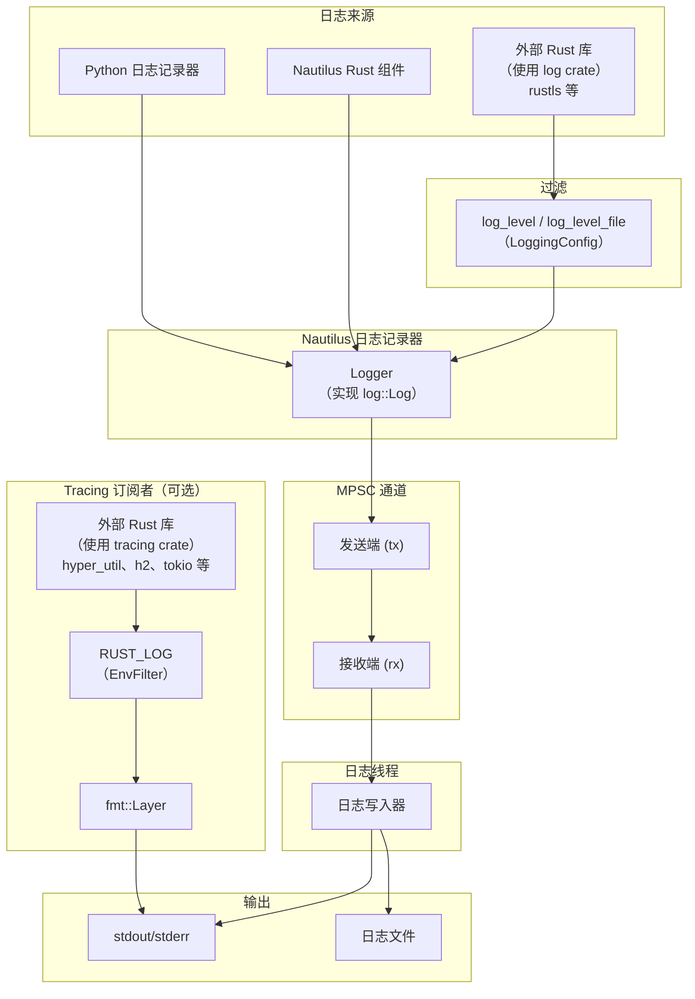

# 日志 (Logging)

平台为回测 (backtesting) 和实盘交易 (live trading) 提供了日志功能，使用 Rust 实现的高性能日志子系统 (logging subsystem)，
并基于 `log` crate 提供标准化的门面 (facade)。

:::note
**`log` crate 是什么？**

`log` crate 是 Rust 生态的标准日志门面（facade），本身不做实际输出，只定义统一接口（`log::info!`、`log::warn!` 等宏）。类比 Java 的 SLF4J：

```
你的代码 / 第三方 Rust 库
    ↓ 调用 log::info!("...")   ← 统一接口
log crate（门面，只定义接口）
    ↓ 转发
NautilusTrader 日志子系统（实际实现，写到 stdout / 文件）
```

好处：NautilusTrader 依赖的所有第三方 Rust 库，只要使用 `log` crate 记录日志，就会自动汇入统一的日志系统，无需单独配置每个库。
:::

核心日志记录器 (logger) 运行在独立线程中，使用多生产者单消费者 (MPSC) 通道接收日志消息。
这种设计确保主线程保持高性能 (performance)，避免日志字符串格式化或文件 I/O 操作造成潜在的瓶颈。

日志输出可配置 (configuration)，支持：

- **标准输出 (stdout)/标准错误 (stderr) 写入器** 用于控制台输出
- **文件写入器** 用于日志的持久化存储

:::info
可以集成 [Vector](https://github.com/vectordotdev/vector) 等基础设施来收集和聚合系统中的事件。

**与内部日志架构的关系**：两者是独立的两层，Vector 在进程外工作，与 NautilusTrader 内部的 `log` crate 门面和日志子系统无感知：

```
NautilusTrader 进程内
  log crate（门面）→ 日志子系统（独立线程）→ stdout / 日志文件
                                                      ↓
                                          Vector（进程外）
                                          读取文件或 stdout
                                          → 转发到 ES / Loki / S3 等
```

- `log` crate + 日志子系统：解决**进程内**如何高性能写日志
- Vector：解决日志落地后**跨机器收集、聚合、转发**到监控平台

两者的唯一结合点是 stdout 或日志文件路径，替换内部实现不影响 Vector 配置，反之亦然。
:::

## 架构

日志子系统从多个来源捕获事件，并通过 MPSC 通道路由到专用日志线程：



- **Python 和 Nautilus 组件**：直接通过 Nautilus 日志记录器记录日志。
- **外部 `log` crate 使用者**：由 `LoggingConfig` 中的 `log_level`/`log_level_file` 过滤。
- **外部 `tracing` crate 使用者**：启用时，输出直接写入 stdout（与 Nautilus 日志分离），由 `RUST_LOG` 环境变量过滤。
- **日志线程**：所有 Nautilus 日志事件通过 MPSC 通道发送到专用线程，确保主线程不被 I/O 操作阻塞。

## 配置

可以通过导入 `LoggingConfig` 对象来配置日志。
默认情况下，日志级别 (log level) 为 'INFO' 及以上的 `LogLevel` 事件会被写入标准输出/标准错误。

日志级别 (`LogLevel`) 的值包括以下几种（与标准日志级别约定一致）。

支持以下日志级别：

- `OFF` - 禁用日志。
- `TRACE` - 最详细；仅由 Rust 组件 (component) 发出（无法从 Python 生成）。
- `DEBUG` - 详细的诊断信息。
- `INFO` - 常规操作消息。
- `WARNING` - 不影响运行的潜在问题。
- `ERROR` - 可能影响功能的错误。

:::tip
你可以将 `TRACE` 设置为过滤级别来捕获 Rust 组件的跟踪日志，即使 Python 代码无法直接发出这些日志。
:::

:::note 为什么 Python 无法发出 TRACE 级别日志？

TRACE 级别的限制来自以下原因：

1. **Rust 零成本抽象**：Rust `log` crate 的 `log::trace!()` 宏可以在编译期被完全消除（当日志级别高于 TRACE 时），实现零运行时开销。Python 没有对等的编译期优化机制。
2. **Python 日志接口设计**：Nautilus 的 Python `Logger` 绑定的最低级别从 `DEBUG` 开始，不暴露 `trace()` 方法。
3. **语义差异**：TRACE 通常包含 Rust 内部状态的细粒度跟踪（如每次消息分发、缓存更新），这些细节在 Python 策略层面通常无意义。

若需调试 Rust 组件的内部行为，将 `log_level` 设置为 `"TRACE"` 即可在日志输出中捕获这些消息——它们会与 Python 产生的 DEBUG/INFO 消息混合出现。
:::

更多详情请参阅 `LoggingConfig` [API 参考](/docs/python-api-latest/config.html#nautilus_trader.common.config.LoggingConfig)。

日志可以通过以下方式配置：

- 标准输出/标准错误的最低 `LogLevel`。
- 日志文件 (log file) 的最低 `LogLevel`。
- 轮转日志文件前的最大大小。
- 轮转时保留的最大备份日志文件数量。
- 自动使用日期或时间戳 (timestamp) 组件命名日志文件，或自定义日志文件名。
- 写入日志文件的目录。
- 纯文本或 JSON 格式的日志文件。
- 按日志级别过滤单个组件。
- 日志行中的 ANSI 颜色。
- 完全绕过日志记录。
- 初始化时将 Rust 配置打印到标准输出。
- 可选地通过 PyO3 桥接初始化日志（`use_pyo3`）以捕获 Rust 组件发出的日志事件。
- 如果日志文件在启动时已存在，则截断该文件（`clear_log_file`）。

### 标准输出日志

日志消息通过标准输出/标准错误写入器写入控制台。可以使用 `log_level` 参数配置最低日志级别。

### 文件日志

默认情况下，日志文件写入当前工作目录。命名约定和轮转行为可配置，并根据你的设置遵循特定模式。

你可以使用 `log_directory` 指定自定义日志目录，和/或使用 `log_file_name` 指定自定义文件基础名称。

**日志文件格式：**

- `None`（默认）- 纯文本格式，扩展名为 `.log`。
- `"json"` - JSON 格式，扩展名为 `.json`，适用于日志聚合工具。

有关日志文件命名约定和轮转行为的详细信息，请参阅下方的[日志文件轮转](#日志文件轮转)和[日志文件命名约定](#日志文件命名约定)部分。

#### 日志文件轮转

轮转行为取决于是否存在大小限制以及是否提供了自定义文件名：

- **基于大小的轮转**：
  - 通过指定 `log_file_max_size` 参数启用（例如，`100_000_000` 表示 100 MB）。
  - 当写入日志条目会使当前文件超过此大小时，文件将被关闭并创建新文件。
- **基于日期的轮转（仅默认命名）**：
  - 当未指定 `log_file_max_size` 且未提供自定义 `log_file_name` 时适用。
  - 每次 UTC 日期变更（午夜）时，当前日志文件将被关闭并启动新文件，每个 UTC 日创建一个文件。
- **无轮转**：
  - 当提供了自定义 `log_file_name` 但没有 `log_file_max_size` 时，日志将继续追加到同一文件。
  - 注意：基于大小的轮转优先 - 如果同时提供了自定义名称和大小限制，仍会进行轮转。
- **备份文件管理**：
  - 由 `log_file_max_backup_count` 参数控制（默认值：5），限制保留的轮转文件总数。
  - 超过此限制时，最旧的备份文件将被自动删除。

#### 日志文件命名约定

默认的命名约定确保日志文件具有唯一标识和时间戳。
格式取决于是否启用了文件轮转：

**启用文件轮转时**：

- **格式**：`{trader_id}_{%Y-%m-%d_%H%M%S:%3f}_{instance_id}.{log|json}`
- **示例**：`TESTER-001_2025-04-09_210721:521_d7dc12c8-7008-4042-8ac4-017c3db0fc38.log`
- **组成部分**：
  - `{trader_id}`：交易者 (trader) 标识符（例如，`TESTER-001`）。
  - `{%Y-%m-%d_%H%M%S:%3f}`：符合 ISO 8601 标准的完整日期时间，精确到毫秒。
  - `{instance_id}`：唯一实例标识符。
  - `{log|json}`：基于格式设置的文件后缀。

**未启用基于大小的轮转时（默认命名）**：

- **格式**：`{trader_id}_{%Y-%m-%d}_{instance_id}.{log|json}`
- **示例**：`TESTER-001_2025-04-09_d7dc12c8-7008-4042-8ac4-017c3db0fc38.log`
- **组成部分**：
  - `{trader_id}`：交易者标识符。
  - `{%Y-%m-%d}`：仅日期（YYYY-MM-DD）。
  - `{instance_id}`：唯一实例标识符。
  - `{log|json}`：基于格式设置的文件后缀。
- **注意**：使用默认命名且无大小限制时，日志在每天 UTC 午夜轮转。

**自定义命名**：

如果设置了 `log_file_name`（例如，`my_custom_log`）：

- 禁用轮转时：文件将按提供的名称精确命名（例如，`my_custom_log.log`）。
- 启用轮转时：文件将包含自定义名称和时间戳（例如，`my_custom_log_2025-04-09_210721:521.log`）。

### 组件日志过滤

`log_component_levels` 参数可用于为每个组件单独设置日志级别。
输入值应为组件 ID 字符串到日志级别字符串的字典：`dict[str, str]`。

以下是一个交易节点日志配置的示例，包含了上述提到的部分选项：

```python
from nautilus_trader.config import LoggingConfig
from nautilus_trader.config import TradingNodeConfig

config_node = TradingNodeConfig(
    trader_id="TESTER-001",
    logging=LoggingConfig(
        log_level="INFO",
        log_level_file="DEBUG",
        log_file_format="json",
        log_component_levels={ "Portfolio": "INFO" },
    ),
    ... # 省略
)
```

对于回测，可以使用 `BacktestEngineConfig` 类代替 `TradingNodeConfig`，因为两者提供相同的选项。

### 环境变量配置

`NAUTILUS_LOG` 环境变量提供了一种使用分号分隔的规范字符串来配置日志的替代方式。这对于仅 Rust 二进制文件或在不修改代码的情况下覆盖日志设置非常有用。

```bash
export NAUTILUS_LOG="stdout=Info;fileout=Debug;RiskEngine=Error;is_colored"
```

**支持的键：**

| 键                    | 类型       | 描述                                               |
|-----------------------|------------|----------------------------------------------------|
| `stdout`              | 日志级别   | stdout 输出的最大级别。                             |
| `fileout`             | 日志级别   | 文件输出的最大级别。                                |
| `is_colored`          | 标志       | 启用 ANSI 颜色（默认：true）。                      |
| `print_config`        | 标志       | 启动时将配置打印到 stdout。                         |
| `log_components_only` | 标志       | 仅记录具有显式过滤器的组件。                        |
| `<Component>`         | 日志级别   | 组件特定级别（精确匹配）。                          |
| `<module::path>`      | 日志级别   | 模块特定级别（前缀匹配，仅 Rust）。                 |

标志通过在规范字符串中出现即可启用（无需值）。日志级别大小写不敏感：`Off`、`Trace`、`Debug`、`Info`、`Warning`（或 `Warn`）、`Error`。

:::note
对于仅 Rust 二进制文件，设置 `NAUTILUS_LOG` 可在首次使用时启用日志子系统的延迟初始化，无需显式调用 `init_logging()`。
:::

### 仅组件日志

当需要关注嘈杂系统中的某个子集时，启用 `log_components_only` 可以仅记录 `log_component_levels` 中明确列出的组件的消息。无论全局 `log_level` 或文件级别如何，其他所有组件都将被抑制。

示例（Python 配置）：

```python
logging = LoggingConfig(
    log_level="INFO",
    log_component_levels={
        "RiskEngine": "DEBUG",
        "Portfolio": "INFO",
    },
    log_components_only=True,
)
```

如果通过环境变量使用 Rust 规范字符串进行配置，请在组件过滤器旁包含 `log_components_only`，例如：

```bash
export NAUTILUS_LOG="stdout=Info;log_components_only;RiskEngine=Debug;Portfolio=Info"
```

### 模块路径过滤（仅 Rust）

使用 `NAUTILUS_LOG` 环境变量时，除组件名称外，还可以按 Rust 模块路径进行过滤。包含 `::` 的键被视为使用前缀匹配的模块路径过滤器，不含 `::` 的键则是使用精确匹配的组件过滤器。

```bash
# 将所有适配器过滤为 Warn 级别，但允许 OKX 使用 Debug 级别
export NAUTILUS_LOG="stdout=Info;nautilus_okx=Warn;nautilus_okx::websocket=Debug"
```

最长匹配前缀优先。在上面的示例中，`nautilus_okx::websocket::handler` 将使用 `Debug` 级别（更长的前缀），而 `nautilus_okx::data` 将使用 `Warn` 级别。

:::tip
Rust 日志宏在未提供显式组件时会自动捕获模块路径。这使模块级过滤能与标准日志调用无缝配合。
:::

:::note
模块路径过滤仅通过 `NAUTILUS_LOG` 环境变量可用。Python 的 `log_component_levels` 配置仅使用组件名称匹配。
:::

:::warning
如果 `log_components_only=True`（或规范字符串中存在 `log_components_only`）且 `log_component_levels` 为空，则不会向标准输出/标准错误或文件输出任何日志消息。请至少添加一个组件过滤器，或禁用仅组件日志。
:::

### 日志颜色

ANSI 颜色代码用于增强在终端中查看日志时的可读性。
在不支持 ANSI 颜色渲染的环境中（例如某些云环境或文本编辑器），
这些颜色代码可能不太合适，因为它们会显示为原始文本。

为了适应这些场景，可以将 `LoggingConfig.log_colors` 选项设置为 `false`。
禁用 `log_colors` 将阻止向日志消息添加 ANSI 颜色代码，
从而避免在不支持颜色渲染的环境中出现原始转义字符。

## 直接使用日志记录器

可以直接使用 `Logger` 对象，它们可以在任何地方初始化（与 Python 内置的 `logging` API 非常相似）。

如果你***没有***使用已经初始化了 `NautilusKernel`（和日志）的对象（如 `BacktestEngine` 或 `TradingNode`），
则可以通过以下方式激活日志：

```python
from nautilus_trader.common.component import init_logging
from nautilus_trader.common.component import Logger

log_guard = init_logging()
logger = Logger("MyLogger")
```

:::info
更多详情请参阅 `init_logging` [API 参考](/docs/python-api-latest/common.html)。
:::

:::warning
每个进程只能通过一次 `init_logging` 调用初始化一个日志子系统。可以同时存在多个 `LogGuard` 实例（最多 255 个），日志线程将保持活动状态，直到所有守卫 (guard) 被释放。
:::

## LogGuard：管理日志生命周期

`LogGuard` 确保日志子系统在进程的整个生命周期 (lifecycle) 中保持活动和可操作状态。
它防止在同一进程中运行多个引擎 (engine) 时日志子系统过早关闭。

### 引用计数实现

日志系统使用引用计数 (reference counting) 来跟踪活动的 `LogGuard` 实例：

- **计数器递增**：当创建新的 `LogGuard` 时，原子计数器递增。
- **计数器递减**：当 `LogGuard` 被释放时，计数器递减。
- **日志线程终止**：当计数器归零（最后一个 `LogGuard` 被释放）时，日志线程被正确地 join，确保所有待处理的日志消息在进程终止前被写入。
- **最大守卫数**：系统支持最多 255 个并发 `LogGuard` 实例。尝试创建更多将引发 `RuntimeError`。

此机制确保：

1. `LogGuard` 保持日志线程活动，并在释放时刷新日志；突然终止（崩溃、kill 信号）仍可能丢失缓冲中的日志。
2. 只要存在任何 `LogGuard`，日志线程就保持活动状态。
3. 当程序优雅关闭时，所有缓冲的日志都会被正确刷新到目标位置。

### 为什么使用 LogGuard？

如果不使用 `LogGuard`，在同一进程中顺序运行引擎的任何尝试都可能导致如下错误：

```
Error sending log event: [INFO] ...
```

这是因为当第一个引擎被释放时，日志子系统的底层通道和 Rust `Logger` 被关闭。
因此，后续引擎将失去对日志子系统的访问权限，导致这些错误。

通过使用 `LogGuard`，你可以确保在同一进程中跨多个回测或引擎运行时具有稳健的日志行为。
`LogGuard` 保留日志子系统的资源，确保日志继续正常运行，
即使引擎被释放和重新初始化。

:::note
使用 `LogGuard` 对于在具有多个引擎的进程中维持一致的日志行为至关重要。
:::

## 运行多个引擎

以下示例演示了在同一进程中顺序运行多个引擎时如何使用 `LogGuard`：

```python
log_guard = None  # 初始化 LogGuard 引用

for i in range(number_of_backtests):
    engine = setup_engine(...)

    # 分配 LogGuard 引用
    if log_guard is None:
        log_guard = engine.get_log_guard()

    # 添加 actor 并执行引擎
    actors = setup_actors(...)
    engine.add_actors(actors)
    engine.run()
    engine.dispose()  # 安全释放
```

### 步骤

- **初始化一次 LogGuard**：从第一个引擎获取 `LogGuard`（`engine.get_log_guard()`）并在整个进程中保留。这确保日志子系统保持活动状态。
- **安全释放引擎**：每个引擎在回测完成后被安全释放。`LogGuard` 在 `engine.dispose()` 后仍然有效 - 只有引擎被清理，日志子系统不受影响。
- **复用 LogGuard**：同一个 `LogGuard` 实例被后续引擎复用，防止日志子系统过早关闭。

### 注意事项

- **每个进程多个 LogGuard**：系统支持每个进程最多 255 个并发 `LogGuard` 实例。每个守卫在创建时递增引用计数器，在释放时递减。
- **线程安全**：日志子系统（包括 `LogGuard`）是线程安全的，确保即使在多线程环境中也能保持一致的行为。
- **自动清理**：当最后一个 `LogGuard` 被释放（引用计数归零）时，日志线程被正确地 join，确保所有待处理的日志在进程终止前被写入。

## 外部 Rust 库的 Tracing 订阅者

使用 `tracing` crate 的外部 Rust 库可以通过启用 tracing 订阅者来显示其日志输出。
这对于调试外部依赖项，或集成以独立 PyO3 扩展编译的自定义 Rust 组件（如特征提取器或适配器）时非常有用。

### 启用订阅者

在 `LoggingConfig` 中设置 `use_tracing=True` 以启用 tracing 订阅者：

```python
from nautilus_trader.config import LoggingConfig
from nautilus_trader.config import TradingNodeConfig

config_node = TradingNodeConfig(
    trader_id="TESTER-001",
    logging=LoggingConfig(
        log_level="INFO",
        use_tracing=True,
    ),
    ... # 省略
)
```

或者，直接调用 `init_tracing()`：

```python
from nautilus_trader.core import nautilus_pyo3

nautilus_pyo3.init_tracing()
```

### 使用 RUST_LOG 过滤

`RUST_LOG` 环境变量控制哪些 tracing 事件会被显示：

```bash
# 显示自定义库的 debug 日志，hyper 只显示 warn 及以上
RUST_LOG=my_feature_extractor=debug,hyper=warn python my_script.py
```

如果未设置 `RUST_LOG`，默认过滤级别为 `warn`。

### 工作原理

tracing 订阅者使用带有自定义格式化器的 `tracing-subscriber` fmt 层，直接输出到 stdout。
这与 Nautilus 日志基础设施是分离的——tracing 输出采用与 Nautilus 对齐的格式，带有纳秒级时间戳。

示例 tracing 输出：

```
2026-01-24T05:51:42.809619000Z [DEBUG] hyper_util::client::legacy::connect::http: connecting to 104.18.5.240:443
2026-01-24T05:51:42.810543000Z [DEBUG] hyper_util::client::legacy::pool: pooling idle connection for ("https", api.example.com)
```

**与 Nautilus 日志的区别：**

- Tracing 输出直接写入 stdout，而非通过 Nautilus 日志线程。
- Tracing 事件不会写入 Nautilus 日志文件。
- 过滤完全由 `RUST_LOG` 控制，与 `LoggingConfig` 无关。

对于使用 `log` crate 的外部库（如 `rustls`），其事件通过 Nautilus 日志记录器传递，
由 `LoggingConfig` 中的 `log_level`/`log_level_file` 过滤。

:::tip
`RUST_LOG` 仅影响使用 `tracing` 的 crate。对于使用 `log` 的 crate，通过 `LoggingConfig` 或 `NAUTILUS_LOG` 环境变量（如 `NAUTILUS_LOG=stdout=Debug`）配置详细程度。
:::

:::note
tracing 订阅者每个进程只能初始化一次。在 `LoggingConfig` 中使用 `use_tracing=True` 时，后续内核创建会安全跳过重复初始化。已初始化后直接调用 `init_tracing()` 将引发错误。
:::

## 平台特定注意事项

### Windows 关闭行为

在 Windows 上，解释器关闭期间的非确定性垃圾回收偶尔会阻止日志线程正确 join。当最后一个 `LogGuard` 被释放时，日志子系统会向后台线程发送关闭信号并 join 它，以确保所有待处理的消息被写入。如果 Python 的垃圾回收器延迟释放守卫直到解释器关闭开始后，此 join 可能无法完成，导致日志被截断。

此问题在 GitHub [issue #3027](https://github.com/nautechsystems/nautilus_trader/issues/3027) 中跟踪。
目前正在考虑一种更确定性的关闭机制。

## 相关指南

- [架构](architecture.md) - 系统架构，包括日志基础设施。
