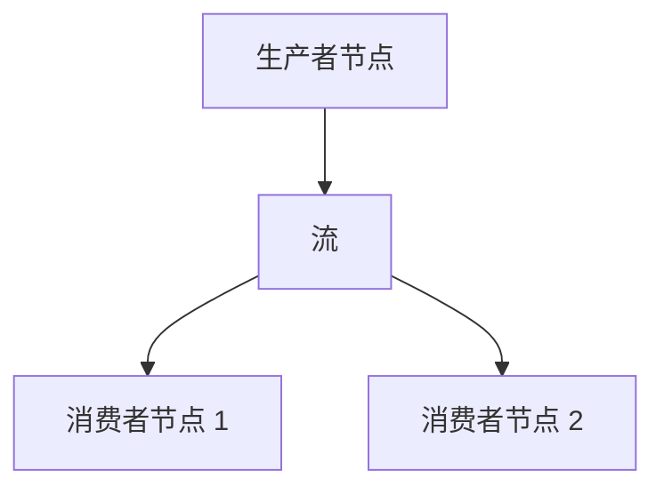

# 消息总线 (Message Bus)

`MessageBus` 是平台的基础组件，通过消息传递 (message passing) 实现系统组件之间的通信。这种设计创建了一个松耦合的架构，使组件之间无需直接依赖即可进行交互。

*消息模式 (messaging patterns)* 包括：

- 点对点 (Point-to-Point)
- 发布/订阅 (Publish/Subscribe)
- 请求/响应 (Request/Response)

:::note
**三种消息模式的区别**

| | **点对点** | **发布/订阅** | **请求/响应** |
|---|---|---|---|
| 内部存储 | `endpoints: IndexMap<端点名, 处理器>` | `subscriptions` + `topics` 缓存 | `correlation_index: AHashMap<UUID4, 回调>` |
| 接收者数量 | 一个（端点只能注册一个处理器） | 多个（所有匹配订阅者） | 一个（异步回调） |
| 通配符支持 | 否 | 是（`*`、`?`） | 否 |
| 是否阻塞 | 否（fire-and-forget） | 否 | 否（纯异步回调，非阻塞） |
| 典型用途 | 发送命令（下单、取消订单） | 广播市场数据、事件 | 查询数据（如 `request_bars()`） |

**请求/响应的真实流程**（源自 `crates/common/src/msgbus/`）：
1. 请求方创建 UUID4 作为关联 ID，并注册回调函数（存入 `correlation_index`）
2. 将请求发送到端点（走点对点），附带关联 ID
3. 响应方处理完后调用 `send_response(correlation_id, response)`
4. MessageBus 通过 UUID4 找到回调并触发

> 请求/响应不是"同步等待"，而是**注册回调的异步模式**，与点对点的区别在于：点对点没有回调机制，响应方不需要回复。
:::

通过 `MessageBus` 交换的消息分为三类：

- 数据 (Data)
- 事件 (Events)
- 命令 (Commands)

## 数据和信号发布

虽然 `MessageBus` 是一个较底层的组件，用户通常通过间接方式与之交互，`Actor` 和 `Strategy` 类提供了构建在其之上的便捷方法：

```python
def publish_data(self, data_type: DataType, data: Data) -> None:
def publish_signal(self, name: str, value, ts_event: int | None = None) -> None:
```

这些方法允许你高效地发布自定义数据和信号，无需直接使用 `MessageBus` 接口。

## 直接访问

对于高级用户或特殊用例，可以在 `Actor` 和 `Strategy` 类中通过 `self.msgbus` 引用直接访问消息总线，该引用提供完整的消息总线接口。

要直接发布自定义消息，你可以指定一个 `str` 类型的主题 (topic) 和任意 Python `object` 作为消息载荷，例如：

```python

self.msgbus.publish("MyTopic", "MyMessage")
```

## 消息风格

NautilusTrader 是一个**事件驱动 (event-driven)** 框架，组件之间通过发送和接收消息进行通信。理解不同的消息风格对于构建有效的交易系统至关重要。

本指南介绍 NautilusTrader 中三种主要的消息模式：

| **消息风格**                              | **用途**                         | **适用场景**                                    |
|:------------------------------------------|:---------------------------------|:------------------------------------------------|
| **MessageBus - 发布/订阅主题**            | 底层，直接访问消息总线           | 自定义事件，系统级通信                          |
| **基于 Actor - 发布/订阅数据**            | 结构化交易数据交换               | 交易指标、指示器、需要持久化的数据              |
| **基于 Actor - 发布/订阅信号**            | 轻量级通知                       | 简单警报、标志、状态更新                        |

每种方法服务于不同的目的，并提供独特的优势。本指南将帮助你在 NautilusTrader 应用中选择合适的消息模式。

### MessageBus 发布/订阅主题

#### 概念

`MessageBus` 是 NautilusTrader 中所有消息的中心枢纽。它支持**发布/订阅**模式，组件可以将事件发布到**命名主题**，其他组件可以订阅以接收这些消息。这解耦了组件，使它们能够通过消息总线间接交互。

#### 主要优势和用例

消息总线方法在以下场景中非常理想：

- **跨组件通信 (cross-component communication)**：在系统内部进行。
- **灵活性**：可以定义任何主题并发送任何类型的载荷（任意 Python 对象）。
- **解耦 (decoupling)**：发布者和订阅者之间无需相互了解。
- **全局覆盖**：消息可以被多个订阅者接收。
- 处理不适合预定义 `Actor` 模型的事件。
- 需要完全控制消息传递的高级场景。

#### 注意事项

- 你必须手动跟踪主题名称（拼写错误可能导致消息丢失）。
- 你必须手动定义处理器。

#### 快速概览代码

```python
from nautilus_trader.core.message import Event

# 定义一个自定义事件
class Each10thBarEvent(Event):
    TOPIC = "each_10th_bar"  # 主题名称
    def __init__(self, bar):
        self.bar = bar

# 在组件中订阅（在策略中）
self.msgbus.subscribe(Each10thBarEvent.TOPIC, self.on_each_10th_bar)

# 发布一个事件（在策略中）
event = Each10thBarEvent(bar)
self.msgbus.publish(Each10thBarEvent.TOPIC, event)

# 处理器（在策略中）
def on_each_10th_bar(self, event: Each10thBarEvent):
    self.log.info(f"Received 10th bar: {event.bar}")
```

#### 完整示例

[MessageBus 示例](https://github.com/nautechsystems/nautilus_trader/tree/develop/examples/backtest/example_09_messaging_with_msgbus)

### 基于 Actor 的发布/订阅数据

#### 概念

这种方法提供了一种在系统中的 `Actor` 之间交换交易特定数据的方式。
（注意：每个 `Strategy` 都继承自 `Actor`）。它继承自 `Data`，确保事件具有正确的时间戳和排序——这对于正确的回测 (backtest) 处理至关重要。

#### 主要优势和用例

数据发布/订阅方法在以下场景中表现出色：

- **交换结构化交易数据**：如市场数据、指示器、自定义指标或期权希腊字母。
- **正确的事件排序**：通过内置时间戳（`ts_event`、`ts_init`）实现，对回测准确性至关重要。
- **数据持久化和序列化 (serialization)**：通过 `@customdataclass` 装饰器，与 NautilusTrader 的数据目录系统无缝集成。
- **标准化的交易数据交换**：在系统组件之间进行。

#### 注意事项

- 需要定义一个继承自 `Data` 的类或使用 `@customdataclass`。

#### 继承 `Data` 与使用 `@customdataclass`

**继承 `Data` 类：**

- 定义了抽象属性 `ts_event` 和 `ts_init`，子类必须实现这些属性。它们确保回测中基于时间戳的正确数据排序。

**`@customdataclass` 装饰器：**

- 如果 `ts_event` 和 `ts_init` 属性不存在，则自动添加。
- 提供序列化函数：`to_dict()`、`from_dict()`、`to_bytes()`、`to_arrow()` 等。
- 支持数据持久化和外部通信。

#### 快速概览代码

```python
from nautilus_trader.core.data import Data
from nautilus_trader.model.custom import customdataclass

@customdataclass
class GreeksData(Data):
    delta: float
    gamma: float

# 发布数据（在 Actor / Strategy 中）
data = GreeksData(delta=0.75, gamma=0.1, ts_event=1_630_000_000_000_000_000, ts_init=1_630_000_000_000_000_000)
self.publish_data(GreeksData, data)

# 订阅接收数据（在 Actor / Strategy 中）
self.subscribe_data(GreeksData)

# 处理器（这是一个固定名称的静态回调函数）
def on_data(self, data: Data):
    if isinstance(data, GreeksData):
        self.log.info(f"Delta: {data.delta}, Gamma: {data.gamma}")
```

#### 完整示例

[基于 Actor 的数据示例](https://github.com/nautechsystems/nautilus_trader/tree/develop/examples/backtest/example_10_messaging_with_actor_data)

### 基于 Actor 的发布/订阅信号

#### 概念

**信号 (Signal)** 是在 Actor 框架内发布和订阅简单通知的轻量级方式。这是最简单的消息方法，无需自定义类定义。

#### 主要优势和用例

信号消息方法在以下场景中表现突出：

- **简单、轻量级的通知/警报**：如 "RiskThresholdExceeded" 或 "TrendUp"。
- **快速、即时的消息传递**：无需定义自定义类。
- **广播警报或标志**：作为原始数据类型（`int`、`float` 或 `str`）。
- **易于 API 集成**：提供简单直接的方法（`publish_signal`、`subscribe_signal`）。
- **多订阅者通信**：发布时所有订阅者都会接收到信号。
- **最小化设置开销**：无需类定义。

#### 注意事项

- 每个信号只能包含**单个值**，类型为：`int`、`float` 和 `str`。这意味着不支持复杂数据结构或其他 Python 类型。
- 在 `on_signal` 处理器中，你只能通过 `signal.value` 来区分信号，因为信号名称在处理器中不可访问。

#### 快速概览代码

```python
# 定义信号常量以更好地组织（可选但推荐）
import types
from nautilus_trader.core.datetime import unix_nanos_to_dt
from nautilus_trader.common.enums import LogColor

signals = types.SimpleNamespace()
signals.NEW_HIGHEST_PRICE = "NewHighestPriceReached"
signals.NEW_LOWEST_PRICE = "NewLowestPriceReached"

# 订阅信号（在 Actor/Strategy 中）
self.subscribe_signal(signals.NEW_HIGHEST_PRICE)
self.subscribe_signal(signals.NEW_LOWEST_PRICE)

# 发布一个信号（在 Actor/Strategy 中）
self.publish_signal(
    name=signals.NEW_HIGHEST_PRICE,
    value=signals.NEW_HIGHEST_PRICE,  # 为简单起见，value 可以与 name 相同
    ts_event=bar.ts_event,  # 触发事件的时间戳
)

# 处理器（这是一个固定名称的静态回调函数）
def on_signal(self, signal):
    # 重要：我们匹配的是 signal.value，而不是 signal.name
    match signal.value:
        case signals.NEW_HIGHEST_PRICE:
            self.log.info(
                f"New highest price was reached. | "
                f"Signal value: {signal.value} | "
                f"Signal time: {unix_nanos_to_dt(signal.ts_event)}",
                color=LogColor.GREEN
            )
        case signals.NEW_LOWEST_PRICE:
            self.log.info(
                f"New lowest price was reached. | "
                f"Signal value: {signal.value} | "
                f"Signal time: {unix_nanos_to_dt(signal.ts_event)}",
                color=LogColor.RED
            )
```

#### 完整示例

[基于 Actor 的信号示例](https://github.com/nautechsystems/nautilus_trader/tree/develop/examples/backtest/example_11_messaging_with_actor_signals)

### 总结和决策指南

以下是帮助你决定使用哪种消息风格的快速参考：

#### 决策指南：如何选择？

| **用例**                         | **推荐方法**                                                                      | **所需设置**      |
|:---------------------------------|:----------------------------------------------------------------------------------|:------------------|
| 自定义事件或系统级通信           | `MessageBus` + 发布/订阅主题                                                      | 主题 + 处理器管理 |
| 结构化交易数据                   | `Actor` + 发布/订阅数据 + 可选 `@customdataclass`（如需序列化）                   | 继承自 `Data` 的新类定义（处理器 `on_data` 已预定义） |
| 简单警报/通知                    | `Actor` + 发布/订阅信号                                                           | 仅需信号名称 |

## 外部发布

`MessageBus` 可以由任何已编写集成的数据库或消息代理 (message broker) 技术作为后端 (backing)，从而支持消息的外部发布。

:::info
Redis 目前支持所有可序列化的外部发布消息。
最低支持的 Redis 版本为 6.2（[流 (streams)](https://redis.io/docs/latest/develop/data-types/streams/) 功能所需）。
:::

:::tip
**将策略指标发送到 Telegram / Discord 等监控平台**

外部发布目前仅内置 Redis 后端，不直接支持 Telegram/Discord。推荐通过 **Redis 中转**实现，无需修改 NautilusTrader 代码：

```
策略 → MessageBus → Redis Stream → 独立消费者进程 → Telegram / Discord Bot
```

实现步骤：
1. 按正常方式配置 `MessageBusConfig`，启用 Redis 外部发布
2. 在策略中通过 `publish_signal` 或 `msgbus.publish` 发布性能指标
3. 编写独立消费者进程，从 Redis Stream 读取消息并转发到 Telegram/Discord

这种方式将通知逻辑与策略逻辑完全解耦，符合职责分离原则。
:::

在底层，当配置了后端数据库（或任何其他兼容技术）时，所有外发消息首先被序列化，然后通过多生产者单消费者 (MPSC) 通道传输到一个独立线程（用 Rust 实现）。在该独立线程中，消息被写入其最终目的地，目前是 Redis 流。

这种设计主要是出于性能考虑。通过将 I/O 操作卸载到独立线程，我们确保主线程保持畅通，不会被与数据库或客户端交互中可能耗时的操作所阻碍。

### 序列化

Nautilus 支持以下类型的序列化：

- 所有 Nautilus 内置类型（序列化为包含可序列化原始类型的字典 `dict[str, Any]`）。
- Python 原始类型（`str`、`int`、`float`、`bool`、`bytes`）。

你可以通过 `serialization` 子包注册自定义类型来添加序列化支持。

```python
def register_serializable_type(
    cls,
    to_dict: Callable[[Any], dict[str, Any]],
    from_dict: Callable[[dict[str, Any]], Any],
):
    ...
```

- `cls`：要注册的类型。
- `to_dict`：从对象实例化原始类型字典的委托。
- `from_dict`：从原始类型字典实例化对象的委托。

## 配置

消息总线的外部后端技术可以通过导入 `MessageBusConfig` 对象并将其传递给你的 `TradingNodeConfig` 来配置。以下将描述每个配置选项。

```python
...  # 其他配置省略
message_bus=MessageBusConfig(
    database=DatabaseConfig(),
    encoding="json",
    timestamps_as_iso8601=True,
    buffer_interval_ms=100,
    autotrim_mins=30,
    use_trader_prefix=True,
    use_trader_id=True,
    use_instance_id=False,
    streams_prefix="streams",
    types_filter=[QuoteTick, TradeTick],
)
...
```

### 数据库配置

必须提供一个 `DatabaseConfig`，对于本地回环地址上的默认 Redis 设置，你可以传入一个 `DatabaseConfig()`，它将使用匹配的默认值。

### 编码

`MessageBus` 使用的内置 `Serializer` 目前支持两种编码：

- JSON (`json`)
- MessagePack (`msgpack`)

使用 `encoding` 配置选项来控制消息写入的编码。

:::tip
默认使用 `msgpack` 编码，因为它提供最优的序列化和内存性能。
当性能不是首要关注点时，我们推荐使用 `json` 编码以获得人类可读性。
:::

### 时间戳格式化

默认情况下，时间戳格式化为 UNIX 纪元纳秒整数。你也可以通过将 `timestamps_as_iso8601` 设置为 `True` 来配置 ISO 8601 字符串格式化。

### 消息流键 (Stream Keys)

消息流键对于标识各个交易节点 (trader node) 和组织流中的消息至关重要。它们可以根据你的特定需求和用例进行定制。在消息总线流的上下文中，交易者键通常结构如下：

```
trader:{trader_id}:{instance_id}:{streams_prefix}
```

以下是配置消息流键的可用选项：

#### 交易者前缀

键是否应以 `trader` 字符串开头。

#### 交易者 ID

键是否应包含节点的交易者 ID。

#### 实例 ID

每个交易节点都被分配一个唯一的"实例 ID"，它是一个 UUIDv4。当消息分布在多个流中时，此实例 ID 有助于区分各个交易者。你可以通过将 `use_instance_id` 配置选项设置为 `True` 来在交易者键中包含实例 ID。当你需要在多节点交易系统中跨多个流跟踪和识别交易者时，这特别有用。

#### 流前缀

`streams_prefix` 字符串使你能够将单个交易者实例的所有流分组，或组织多个实例的消息。通过向 `streams_prefix` 配置选项传递字符串来进行配置，确保其他前缀设置为 false。

#### 每个主题独立流

指示生产者是否为每个主题写入单独的流。这对于 Redis 后端特别有用，因为 Redis 在监听流时不支持通配符主题。如果设置为 False，所有消息将写入同一个流。

:::info
Redis 不支持通配符流主题。为了更好地兼容 Redis，建议将此选项设置为 False。
:::

### 类型过滤

当消息在消息总线上发布时，如果已配置并启用了消息总线后端，消息将被序列化并写入流。为了防止高频报价等数据淹没流，你可以从外部发布中过滤掉某些类型的消息。

要启用此过滤机制，在消息总线配置中向 `types_filter` 参数传递一个 `type` 对象列表，指定哪些类型的消息应从外部发布中排除。

```python
from nautilus_trader.config import MessageBusConfig
from nautilus_trader.model.data import QuoteTick
from nautilus_trader.model.data import TradeTick

# 创建一个带有类型过滤的 MessageBusConfig 实例
message_bus = MessageBusConfig(
    types_filter=[QuoteTick, TradeTick]
)

```

### 流自动修剪

`autotrim_mins` 配置参数允许你指定消息流中自动流修剪的回溯窗口（以分钟为单位）。自动流修剪通过移除旧消息来帮助管理消息流的大小，确保流在存储和性能方面保持可管理。

:::info
当前 Redis 实现将 `autotrim_mins` 保持为最大宽度（加上大约一分钟，因为流修剪频率不超过每分钟一次）。而不是基于当前挂钟时间的最大回溯窗口。
:::

## 外部流 (External Streams)

`TradingNode`（节点）中的消息总线被称为"内部消息总线"。生产者节点是将消息发布到外部流的节点（参见[外部发布](#外部发布)）。消费者节点监听外部流以接收并将反序列化的消息载荷发布到其内部消息总线上。



:::tip
使用 `LiveDataEngineConfig.external_clients` 设置旨在表示外部流式传输 (streaming) 客户端的 `client_id` 列表。`DataEngine` 将过滤掉这些客户端的订阅命令，确保外部流式传输为这些客户端的任何订阅提供所需的数据。
:::

### 示例配置

以下示例详细说明了一个流式传输设置，其中生产者节点将 Binance 数据外部发布，下游消费者节点将这些数据消息发布到其内部消息总线上。

#### 生产者节点

我们配置生产者节点的 `MessageBus` 发布到 `"binance"` 流。`use_trader_id`、`use_trader_prefix` 和 `use_instance_id` 设置均为 `False`，以确保消费者节点可以注册的简单且可预测的流键。

```python
message_bus=MessageBusConfig(
    database=DatabaseConfig(timeout=2),
    use_trader_id=False,
    use_trader_prefix=False,
    use_instance_id=False,
    streams_prefix="binance",  # <---
    stream_per_topic=False,
    autotrim_mins=30,
),
```

#### 消费者节点

我们配置消费者节点的 `MessageBus` 从同一个 `"binance"` 流接收消息。该节点将监听外部流键，以将这些消息发布到其内部消息总线上。此外，我们将客户端 ID `"BINANCE_EXT"` 声明为外部客户端。这确保 `DataEngine` 不会尝试向此客户端 ID 发送数据命令，因为我们期望这些消息从外部流发布到内部消息总线上，节点已订阅了相关主题。

```python
data_engine=LiveDataEngineConfig(
    external_clients=[ClientId("BINANCE_EXT")],
),
message_bus=MessageBusConfig(
    database=DatabaseConfig(timeout=2),
    external_streams=["binance"],  # <---
),
```
