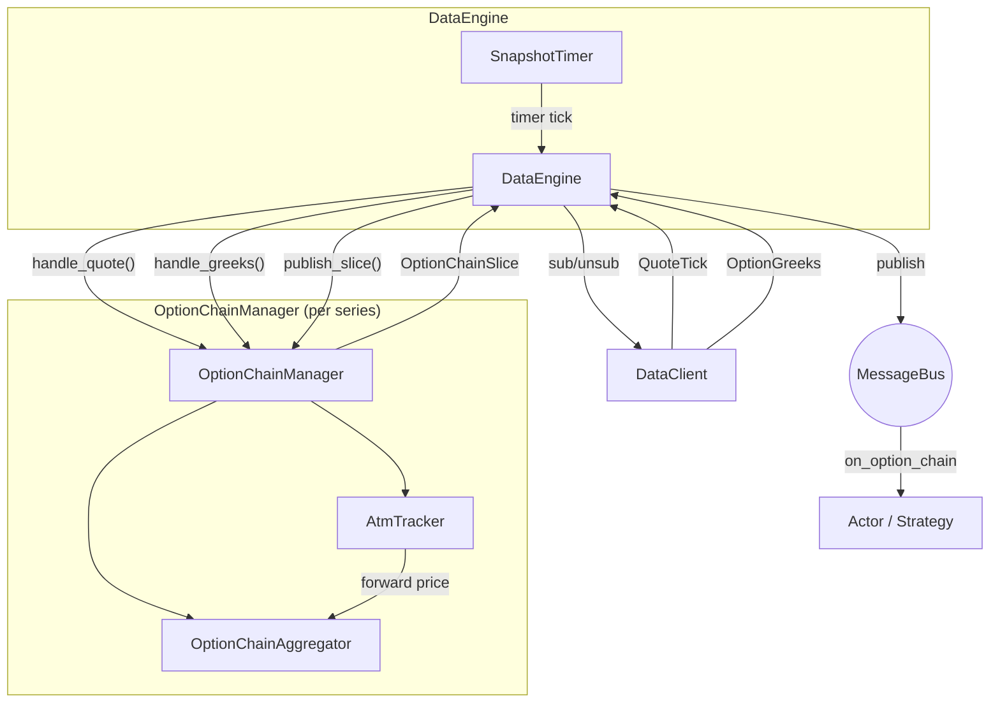

# 期权 (Options)

Nautilus 为传统市场和加密市场的期权交易提供一流支持。这包括期权专属的工具类型、交易场所提供的 Greeks 流式数据、期权链聚合，以及用于风险管理的本地 Black-Scholes Greeks 计算器。

## 期权工具类型

平台定义了若干期权工具类型：

| 工具                 | 描述                                                                  |
|----------------------|----------------------------------------------------------------------|
| `OptionContract`     | 在某标的上交易、带行权价和到期日的交易所挂牌期权。                    |
| `OptionSpread`       | 交易所定义的多腿期权策略，作为单一标的呈现。                          |
| `CryptoOption`       | 以加密资产计价/结算的加密期权；反向 (inverse) 或 quanto 风格。        |
| `CryptoOptionSpread` | 带反向、结算货币和分数化下单数量的加密期权价差。                      |
| `BinaryOption`       | 结算为 0 或 1 的固定赔付期权。                                        |

与 Greeks 相关的元数据因工具类型而异：

- `OptionContract`、`CryptoOption`：完整的 Greeks 输入，包括 `strike_price`、
  `option_kind`（CALL/PUT）、`expiration_utc`、`underlying`、`multiplier`。
- `OptionSpread`、`CryptoOptionSpread`：最多 4 条期权腿的组合，
  每条腿按比率加权。带有 `underlying`、`expiration_utc` 以及
  `strategy_type`（vertical、calendar、straddle 等）。逐腿的 `strike_price`
  和 `option_kind` 位于每条腿各自的 `OptionContract`/`CryptoOption` 上，而非
  价差本身。Greeks 逐腿计算后再聚合。价差通常用于下单（交易所将其作为单一订单执行），
  而各条腿则作为持仓出现。`CryptoOptionSpread` 还额外
  携带 `is_inverse` 和 `settlement_currency`，以适配 Deribit 等场所。
- `BinaryOption`：带有 `expiration_utc` 和 `outcome`/`description`，但没有
  `strike_price`、`option_kind` 或 `underlying`。

## 订阅 Greeks

Deribit、Bybit、OKX 等场所会在其期权市场旁实时发布 Greeks。
Nautilus 提供两种订阅级别：

- **逐工具 Greeks**：订阅单个期权合约。
- **期权链切片**：订阅整条期权系列的聚合视图。

### 逐工具 Greeks

在 actor 或 strategy 中订阅场所为单个期权合约提供的 Greeks：

```python
from nautilus_trader.model.identifiers import ClientId

client_id = ClientId("DERIBIT")
self.subscribe_option_greeks(instrument_id, client_id=client_id)
```

通过实现 `on_option_greeks` 处理器来处理收到的更新：

```python
def on_option_greeks(self, greeks) -> None:
    self.log.info(
        f"{greeks.instrument_id}: "
        f"delta={greeks.delta:.4f} gamma={greeks.gamma:.6f} "
        f"vega={greeks.vega:.4f} theta={greeks.theta:.4f} "
        f"mark_iv={greeks.mark_iv} underlying={greeks.underlying_price}"
    )
```

停止接收更新：

```python
self.unsubscribe_option_greeks(instrument_id, client_id=client_id)
```

### 期权链订阅

期权链订阅会把某条期权系列中所有行权价的报价和 Greeks 聚合成
`OptionChainSlice` 快照。`DataEngine` 为每条系列创建一个 Rust
`OptionChainManager`，并掌管其生命周期：创建管理器、路由
传入的数据、运行快照定时器，以及处理待落地的线缆 (wire) 订阅变更。

```python
from nautilus_trader.core import nautilus_pyo3

series_id = nautilus_pyo3.OptionSeriesId(...)  # 标识系列（场所、标的、到期日）

# 订阅 ATM 上下各 5 个行权价，每 1000ms 生成一次快照
strike_range = nautilus_pyo3.StrikeRange.atm_relative(strikes_above=5, strikes_below=5)
self.subscribe_option_chain(
    series_id,
    strike_range=strike_range,
    snapshot_interval_ms=1000,
)
```

通过实现 `on_option_chain` 处理器来处理快照：

```python
def on_option_chain(self, chain) -> None:
    for strike in chain.strikes():
        call = chain.get_call(strike)
        put = chain.get_put(strike)
        if call and call.greeks:
            self.log.info(f"Call {strike}: delta={call.greeks.delta:.4f}")
```

### 行权价范围过滤

`StrikeRange` 控制链订阅中哪些行权价处于活跃状态：

| 变体          | 描述                                                | 示例                                           |
|---------------|-----------------------------------------------------|------------------------------------------------|
| `Fixed`       | 订阅一组明确指定的行权价。                          | `nautilus_pyo3.StrikeRange.fixed([...])`       |
| `AtmRelative` | 当前 ATM 行权价上下各 N 个行权价。                  | `nautilus_pyo3.StrikeRange.atm_relative(5, 5)` |
| `AtmPercent`  | ATM 周围某个百分比区间内的所有行权价。             | `nautilus_pyo3.StrikeRange.atm_percent(0.10)`  |
| `Delta`       | call 或 put delta 接近某目标值的行权价。            | `nautilus_pyo3.StrikeRange.delta(0.25, 0.05)`  |

对于基于 ATM 的变体，订阅会延迟到 ATM 价格确定之后才进行。
ATM 由场所提供的 `OptionGreeks` 更新中嵌入的远期价格（`underlying_price`
字段）推导得出。它也可以由通过 HTTP 获取的初始远期价格预置 (seed)，
从而在实时 WebSocket tick 到达之前即时引导启动。随着 ATM
变动，活跃的行权价集合会自动再平衡。

`Delta` 依据场所提供的 Greeks 来解析：当某个行权价的 call 或 put delta
绝对值（call 为正、put 为负，按绝对值比较）落入
`target` 的 `tolerance` 范围内时，该行权价处于活跃状态。一个典型的虚值 (out-of-the-money) 目标如 `0.25`，会在 ATM
两侧各选出一个行权价。在 ATM/远期价格已知之前，`Delta` 会像其他
基于 ATM 的范围一样被延迟。在 ATM 已知之后，当没有任何活跃行权价的 Greeks 匹配该区间
（包括尚无任何 Greeks 到达时），`Delta` 会回退到 ATM
两侧各五个行权价的 ATM 相对窗口。在 raw 模式下，活跃集合可能在相邻 Greeks 到达之前
收窄到第一个报告匹配 delta 的行权价，丢弃窗口的其余部分，
直到选择回退或 ATM 变动；snapshot 模式则通过让 Greeks
在首次发布前积累来减轻这一现象。

### Snapshot 模式 vs. raw 模式

`snapshot_interval_ms` 参数控制发布行为：

- **Snapshot 模式**（`snapshot_interval_ms=1000`）：报价和 Greeks 在
  缓冲区中积累，并由定时器以 `OptionChainSlice` 形式发布。适用于周期性的
  组合再平衡或 UI 展示。
- **Raw 模式**（`snapshot_interval_ms=None`）：每次报价或 Greeks 更新都会立即
  发布一个切片。适用于对个别更新做出反应的延迟敏感型策略。

## 期权链回测

期权链回测与实时订阅使用相同的 `OptionChainManager` 和 `OptionChainAggregator`
路径。前提是有一个 Nautilus Parquet 目录 (catalog)，其中
已经包含期权工具以及构建链所需的逐工具数据：

- 每个期权合约的 `QuoteTick` 记录，携带回放的最优买价和卖价。
- 每个期权合约的 `OptionGreeks` 记录，携带 delta、隐含波动率、
  约定 (convention)，以及用于预置 ATM 的 `underlying_price`。
- 对应相同 instrument ID 的 `CryptoOption` 或 `OptionContract` 工具。

当期权盘口快照或报价被写为 `QuoteTick`、且 `option_summary` 消息被写为
`OptionGreeks` 时，Tardis 回放即满足这一约定。
回测过程中不会下载或请求目录中缺失的数据。

为系列中的期权工具配置一个同时包含两种数据流的 `BacktestNode` 运行：

```python
data = [
    BacktestDataConfig(
        data_type="QuoteTick",
        catalog_path="/path/to/catalog",
        instrument_ids=option_instrument_ids,
    ),
    BacktestDataConfig(
        data_type="OptionGreeks",
        catalog_path="/path/to/catalog",
        instrument_ids=option_instrument_ids,
    ),
]
```

然后从策略中订阅：

```python
strike_range = StrikeRange.delta(0.25, 0.05)
self.subscribe_option_chain(
    series_id,
    strike_range=strike_range,
    snapshot_interval_ms=1000,
)
```

使用 `snapshot_interval_ms=None` 启用 raw 模式。Raw 模式会在每次改变活跃链的
报价或 Greeks 更新后发布一个切片。使用整数间隔可获得
稀疏化 (thinned) 的快照。稀疏化模式会累积每个工具最新的 BBO 和 Greeks，
并按定时器节奏发布链，从而减少大型链的事件量。

每个 `OptionChainSlice` 按工具连接最新的 BBO 和 Greeks，然后按
行权价和期权类型对结果分组。报价可能先于 Greeks 到达，Greeks
也可能先于报价到达；聚合器保留最新状态，并在两者都可用时
一并附加。`OptionGreeks` 中的 `underlying_price` 驱动 ATM 检测。

选择既可以在订阅范围内进行，也可以在策略内部进行：

- 价值状态 (Moneyness)：使用 `StrikeRange.atm_relative(...)` 或 `StrikeRange.atm_percent(...)`。
- Delta：使用 `StrikeRange.delta(target, tolerance)`，或在 `on_option_chain`
  中检查 `entry.greeks.delta`。
- 行权价：使用 `StrikeRange.fixed([...])`，或读取 `chain.get_call(strike)` 和
  `chain.get_put(strike)`。

期权的撮合是报价驱动的。市价单和可成交的限价单作为 taker 对手回放的
对侧 BBO 成交。被动限价单挂在模拟盘口上，
并在后续 BBO 更新穿透限价时作为 maker 成交。
该模型不为期权模拟 L2 队列位置。

结构性期权费用模型在模拟交易场所上配置，而非
从场所名称推断：

```python
from decimal import Decimal

from nautilus_trader.execution import CappedOptionFeeModel
from nautilus_trader.execution import TieredNotionalOptionFeeModel

deribit_like = CappedOptionFeeModel(
    maker_rate=Decimal("0.0003"),
    taker_rate=Decimal("0.0003"),
)
okx_like = TieredNotionalOptionFeeModel(
    maker_rate=Decimal("0.0002"),
    taker_rate=Decimal("0.0005"),
)
```

将其中一个对象作为 `fee_model` 传给 `BacktestVenueConfig`。Rust 接口
使用 `FeeModelAny::CappedOption(CappedOptionFeeModel::new(...))` 和
`FeeModelAny::TieredNotionalOption(TieredNotionalOptionFeeModel::new(...))`。

参见 `examples/backtest/tardis_option_chain.py`，以及 `crates/backtest/examples/`
中的 Rust `tardis-option-chain` 示例。

## 期权链架构

期权链系统是事件驱动的，围绕逐系列隔离 (per-series isolation) 构建。
`DataEngine` 为每条订阅的期权系列创建一个 Rust `OptionChainManager`。该
管理器封装 `OptionChainAggregator` 和 `AtmTracker`，注册消息总线处理器、
发布快照，并将线缆订阅变更入队，供引擎处理落地。一个
独立的 PyO3 `OptionChainManager` 把相同的聚合内核暴露给 Python。



### 组件职责

#### DataEngine

为每个活跃的 `OptionSeriesId` 持有一个 `OptionChainManager`。在
`SubscribeOptionChain` 时，它从缓存解析工具、为基于 ATM 的范围请求远期
价格、创建管理器、将活跃工具订阅到数据客户端，
并设置快照定时器。在每次定时器触发时，管理器
检查是否需要再平衡、发布快照，并将任何线缆订阅
变更入队供引擎处理落地。在 `UnsubscribeOptionChain` 时，或当所有工具
到期时，它会拆除管理器、取消定时器，并取消订阅线缆级数据流。

#### OptionChainManager

围绕 `OptionChainAggregator` 和 `AtmTracker` 的逐系列 Rust 管理器。
`DataEngine` 通过 `handle_quote()` 和 `handle_greeks()` 向它馈送市场数据。
在 snapshot 模式下，定时器回调调用 `publish_slice()`。在 raw 模式下，每次活跃的
报价或 Greeks 更新都会立即调用 `publish_slice()`。面向 Python 的管理器
具有 `handle_*` 方法，这些方法返回首个 ATM 价格是否引导了活跃
工具集；Rust 管理器则在内部执行该引导。

#### OptionChainAggregator

使用 keep-latest（保留最新）语义将报价和 Greeks 累积进 call/put 缓冲区。
自上次快照以来未更新的工具仍会被包含在内。在某个工具的任何报价到达之前
就先到达的 Greeks，会被保存在 `pending_greeks`
缓冲区中，并在第一个报价到达时附加上去。在每次 `snapshot()` 调用时，
聚合器产生一个不可变的 `OptionChainSlice`。

#### AtmTracker

依据传入的 `OptionGreeks` 事件中的 `underlying_price` 字段（该到期日由场所提供的
远期价格）反应式地推导 ATM 价格。它也可以
从 HTTP 远期价格响应中预先预置，从而无需
等待 WebSocket tick 即可即时引导启动。

### 引导与再平衡

对于基于 ATM 的行权价范围（`AtmRelative`、`AtmPercent`），活跃工具
集合在 ATM 价格已知之前无法确定。有两条引导
路径：

**即时引导（远期价格可用）：**

1. `DataEngine` 收到 `SubscribeOptionChain`，从缓存解析该系列的所有工具，
   并向数据客户端请求远期价格。
2. 当远期价格响应到达时，引擎以预置好的
   ATM 价格创建管理器。管理器在
   构造期间计算活跃行权价集合。
3. 引擎立即订阅活跃工具。

**延迟引导（无远期价格）：**

1. 与上面相同，但在响应中未找到匹配的远期价格。
2. 引擎在没有初始 ATM 价格的情况下创建管理器。活跃集合为
   空，且不为该链建立任何线缆订阅。
3. 引导依赖于已经从其他订阅流入的相关 Greeks 数据
   （例如逐工具的 `subscribe_option_greeks` 调用）。当
   引擎通过 `handle_greeks()` 馈送一个带 `underlying_price` 的
   `OptionGreeks` 事件时，管理器会引导活跃工具集、注册
   消息总线处理器，并将新的线缆订阅入队供引擎处理落地。

引导完成后，聚合器监控 ATM 漂移。在每次快照定时器触发时，
引擎调用 `check_rebalance()`，它返回任何需要添加或
移除的工具。一个滞回 (hysteresis) 阈值和冷却期可防止在行权价
边界附近来回抖动。

## OptionGreeks 数据类型

`OptionGreeks` 携带场所为单个期权合约提供的敏感度和隐含波动率：

| 字段               | 类型               | 描述                                               |
|--------------------|--------------------|----------------------------------------------------|
| `instrument_id`    | `InstrumentId`     | 这些 Greeks 所适用的期权合约。                     |
| `convention`       | `GreeksConvention` | Greeks 的计价单位 (numeraire) 约定。               |
| `delta`            | `float`            | 期权价格对单位标的的变化率。                       |
| `gamma`            | `float`            | delta 对单位标的的变化率。                         |
| `vega`             | `float`            | 对隐含波动率变化 1% 的敏感度。                     |
| `theta`            | `float`            | 每日时间衰减（dV/dt / 365.25）。                   |
| `rho`              | `float`            | 对利率变化的敏感度。                               |
| `mark_iv`          | `float` 或 None    | 标记隐含波动率。                                   |
| `bid_iv`           | `float` 或 None    | 买价隐含波动率。                                   |
| `ask_iv`           | `float` 或 None    | 卖价隐含波动率。                                   |
| `underlying_price` | `float` 或 None    | 计算时刻的标的价格。                               |
| `open_interest`    | `float` 或 None    | 该合约的未平仓量。                                 |
| `ts_event`         | `int`              | 事件的 UNIX 时间戳（纳秒）。                       |
| `ts_init`          | `int`              | 初始化时的 UNIX 时间戳（纳秒）。                   |

## OptionChainSlice 数据类型

`OptionChainSlice` 是整条期权系列的某个时间点快照。

属性：

| 属性         | 类型                 | 描述                                |
|--------------|----------------------|-------------------------------------|
| `series_id`  | `OptionSeriesId`     | 期权系列标识符。                    |
| `atm_strike` | `Price` 或 None      | 当前 ATM 行权价（若已确定）。       |
| `ts_event`   | `int`                | UNIX 时间戳（纳秒）。               |
| `ts_init`    | `int`                | UNIX 时间戳（纳秒）。               |

call 和 put 数据通过方法访问，而非作为直接属性。
这些方法返回的每个 `OptionStrikeData` 都包含该行权价的一个 `quote`（`QuoteTick`）
和一个可选的 `greeks`（`OptionGreeks`）。

方法：

- `strikes()`：链中所有唯一的行权价。
- `strike_count()`、`call_count()`、`put_count()`：计数。
- `get_call(strike)`、`get_put(strike)`：完整的 `OptionStrikeData`。
- `get_call_greeks(strike)`、`get_put_greeks(strike)`：仅 Greeks。
- `get_call_quote(strike)`、`get_put_quote(strike)`：仅报价。
- `is_empty()`：链中无数据时为 true。

## 适配器支持

以下适配器目前支持期权 Greeks 订阅：

| 适配器  | 逐工具 Greeks | 期权链 |
|---------|:-------------:|:------:|
| Deribit | ✓             | ✓      |
| Bybit   | ✓             | ✓      |
| OKX     | ✓             | -      |

## 另请参阅

- [Greeks](greeks.md) - 本地 Greeks 计算与组合风险管理。
- [数据](data.md) - 内置数据类型与订阅模型。
- [Actors](actors.md) - 订阅与处理器参考表。
