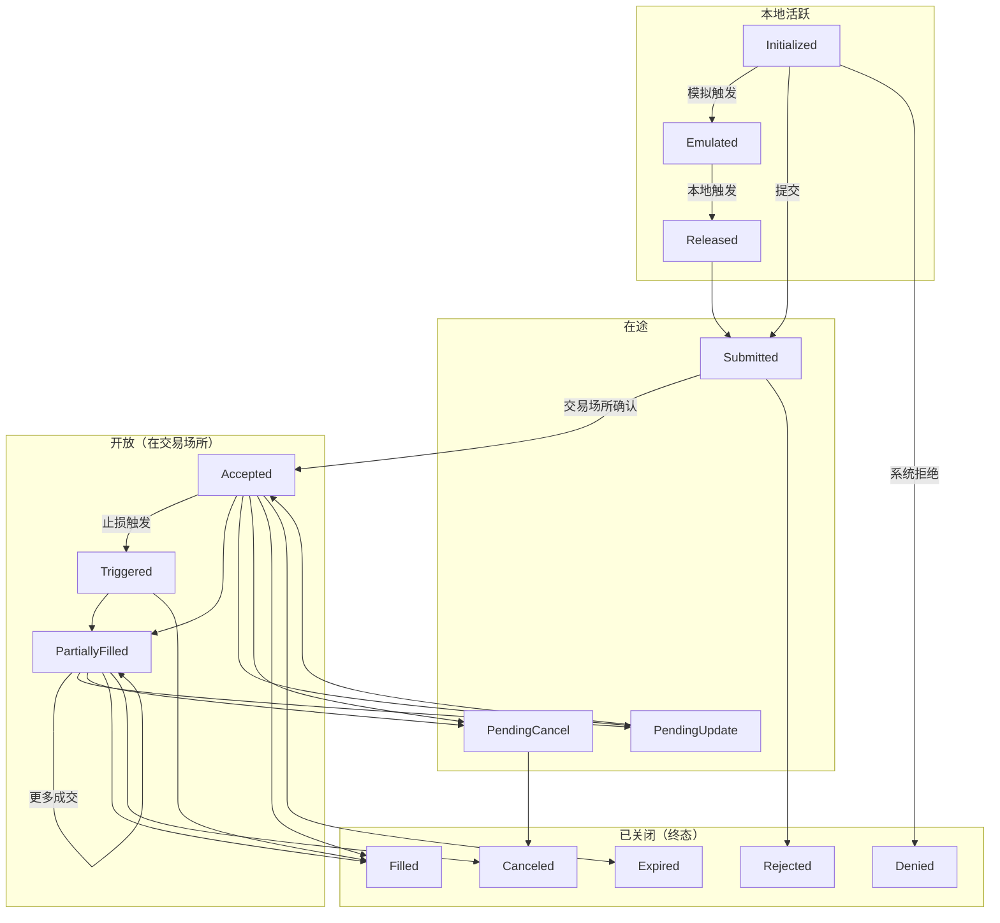

# 订单 (Orders)

本指南详细介绍了平台可用的订单 (order) 类型，以及每种类型支持的执行 (execution) 指令。

订单是任何算法交易策略的基本构建模块之一。
NautilusTrader 支持广泛的订单类型和执行指令，从标准到高级，
尽可能多地暴露交易场所 (venue) 的功能。这使交易者能够定义订单执行和管理的指令
与条件，从而促进几乎任何交易策略的创建。

## 概述

所有订单类型都源自两种基本类型：*市价单 (Market)* 和 *限价单 (Limit)*。在流动性方面，它们是相反的。
*市价单* 通过以最佳可用价格立即执行来消耗流动性，而 *限价单*
则通过在订单簿中以指定价格挂单等待匹配来提供流动性。

平台可用的订单类型如下（使用 `OrderType` 枚举值）：

- `MARKET`
- `LIMIT`
- `STOP_MARKET`
- `STOP_LIMIT`
- `MARKET_TO_LIMIT`
- `MARKET_IF_TOUCHED`
- `LIMIT_IF_TOUCHED`
- `TRAILING_STOP_MARKET`
- `TRAILING_STOP_LIMIT`

:::info
NautilusTrader 为多种订单类型和执行指令提供了统一的 API，但并非所有交易场所都支持每个选项。
如果订单包含目标交易场所不支持的指令或选项，系统不会提交该订单，
而是记录一条清晰的解释性错误信息。
:::

### 术语

- 如果订单类型为 `MARKET`，或作为 *可成交* 订单执行（即消耗流动性），则该订单是**主动的 (aggressive)**。
- 如果订单不可成交（即提供流动性），则该订单是**被动的 (passive)**。
- 如果订单处于以下三种非终态状态之一，保持在本地系统边界内，则该订单是**本地活跃的 (active local)**：
  - `INITIALIZED`
  - `EMULATED`
  - `RELEASED`
- 当订单处于以下状态之一时，该订单是**在途的 (in-flight)**：
  - `SUBMITTED`
  - `PENDING_UPDATE`
  - `PENDING_CANCEL`
- 当订单处于以下（非终态）状态之一时，该订单是**开放的 (open)**：
  - `ACCEPTED`
  - `TRIGGERED`
  - `PENDING_UPDATE`
  - `PENDING_CANCEL`
  - `PARTIALLY_FILLED`
- 当订单处于以下（终态）状态之一时，该订单是**已关闭的 (closed)**：
  - `DENIED`
  - `REJECTED`
  - `CANCELED`
  - `EXPIRED`
  - `FILLED`

### 订单状态流转

下图展示了订单生命周期和主要状态转换：



### 订单状态定义

| 状态                | 描述                                                                            |
|--------------------|---------------------------------------------------------------------------------|
| `INITIALIZED`      | 订单已在 Nautilus 系统中实例化。                                                    |
| `DENIED`           | 订单因无效、无法处理或超出风险限制而被 Nautilus 拒绝。                                   |
| `EMULATED`         | 订单正在由 `OrderEmulator` 组件进行模拟 (emulation)。                                |
| `RELEASED`         | 订单已从 `OrderEmulator` 组件释放。                                                 |
| `SUBMITTED`        | 订单已提交至交易场所（等待确认）。                                                     |
| `ACCEPTED`         | 订单已被交易场所确认接收且有效（可能已开始生效）。                                        |
| `REJECTED`         | 订单被交易场所拒绝。                                                                |
| `CANCELED`         | 订单已取消（终态）。                                                                |
| `EXPIRED`          | 订单已达到 GTD 到期时间（终态）。                                                     |
| `TRIGGERED`        | 订单的止损价格已在交易场所被触发。                                                     |
| `PENDING_UPDATE`   | 订单正在交易场所等待修改请求处理。                                                     |
| `PENDING_CANCEL`   | 订单正在交易场所等待取消请求处理。                                                     |
| `PARTIALLY_FILLED` | 订单已在交易场所部分成交 (fill)。                                                     |
| `FILLED`           | 订单已完全成交（终态）。                                                              |

## 执行指令

某些交易场所允许交易者指定订单处理和执行方式的条件与限制。以下是可用执行指令的简要总结。

### 有效期类型 (Time in force)

订单的有效期类型指定了订单在剩余数量被取消之前将保持开放或活跃的时间。

- `GTC` **（GTC，持续有效）**：订单保持活跃，直到交易者或交易场所取消。
- `IOC` **（IOC，立即成交或撤销）**：订单立即执行，未成交部分立即取消。
- `FOK` **（FOK，全部成交或撤销）**：订单必须立即全部成交，否则完全不执行。
- `GTD` **（GTD，指定时间前有效）**：订单保持活跃，直到指定的到期日期和时间。
- `DAY` **（DAY，当日有效）**：订单保持活跃，直到当前交易时段结束。
- `AT_THE_OPEN` **（OPG）**：订单仅在交易时段开盘时有效。
- `AT_THE_CLOSE`：订单仅在交易时段收盘时有效。

### 到期时间

此指令与 `GTD` 有效期类型配合使用，用于指定订单到期并从交易场所订单簿（或订单管理系统）中移除的时间。

### 仅挂单 (Post-only)

标记为 `post_only` 的订单将只提供流动性到限价订单簿，
永远不会作为主动方发起消耗流动性的交易。此选项对做市商或希望将订单限制在流动性 *提供者* 费率层级的交易者很重要。

### 仅减仓 (Reduce-only)

设置为 `reduce_only` 的订单将只减少某一工具上的现有仓位，
永远不会开立新仓位（如果已经平仓）。此指令的确切行为可能因交易场所而异。

但是，Nautilus `SimulatedExchange` 中的行为是典型的真实交易场所行为。

- 如果关联仓位被关闭（变为平仓），订单将被取消。
- 随着关联仓位规模的减小，订单数量将相应减少。

### 显示数量

`display_qty` 指定在限价订单簿上显示的 *限价* 订单的部分数量。
这些也被称为冰山订单 (iceberg orders)，因为有一个可见的显示部分，同时还有隐藏的更多数量。
指定显示数量为零也等同于将订单设置为 `hidden`（隐藏）。

### 触发类型 (Trigger type)

也称为[触发方法](https://www.interactivebrokers.com/en/software/tws/usersguidebook/configuretws/Modify%20the%20Stop%20Trigger%20Method.htm)，
适用于条件触发订单，指定触发止损价格的方法。

- `DEFAULT`：交易场所的默认触发类型（通常为 `LAST_PRICE` 或 `BID_ASK`）。
- `LAST_PRICE`：触发价格基于最近成交价。
- `BID_ASK`：触发价格基于买入订单的买价和卖出订单的卖价。
- `DOUBLE_LAST`：触发价格基于最近两次连续的成交价。
- `DOUBLE_BID_ASK`：触发价格基于最近两次连续的买价或卖价（视情况而定）。
- `LAST_OR_BID_ASK`：触发价格基于最近成交价或买卖价。
- `MID_POINT`：触发价格基于买价和卖价的中间点。
- `MARK_PRICE`：触发价格基于交易场所该工具的标记价格。
- `INDEX_PRICE`：触发价格基于交易场所该工具的指数价格。

### 触发偏移类型

适用于条件追踪止损 (trailing stop) 触发订单，指定基于与 *市场*（买价、卖价或最近成交价，视情况而定）的偏移来修改止损价格的方法。

- `DEFAULT`：交易场所的默认偏移类型（通常为 `PRICE`）。
- `PRICE`：偏移基于价格差值。
- `BASIS_POINTS`：偏移基于以基点表示的价格百分比差值（100bp = 1%）。
- `TICKS`：偏移基于跳动点数量。
- `PRICE_TIER`：偏移基于交易场所特定的价格层级。

### 条件单 (Contingent orders)

可以在订单之间指定更高级的关系。
例如，子订单可以被指定为仅在父订单被激活或成交时触发，或者订单可以被关联使得一个取消或减少另一个的数量。有关更多详情，请参阅[高级订单](#高级订单)部分。

## 订单工厂

创建新订单最简单的方法是使用内置的 `OrderFactory`，它
会自动附加到每个 `Strategy` 类上。此工厂将处理
底层细节——例如确保分配正确的交易者 ID 和策略 ID、生成
必要的初始化 ID 和时间戳，并抽象掉不一定适用于正在创建的订单类型的参数，
或仅在需要指定更高级执行指令时才需要的参数。

这使得工厂具有更简单的订单创建方法，所有
示例都将在 `Strategy` 上下文中利用 `OrderFactory`。

:::info
有关更多详情，请参阅 `OrderFactory` [API 参考](../api_reference/common.md#class-orderfactory)。
:::

## 订单类型

以下描述了平台可用的订单类型及代码示例。
所有可选参数都会用包含默认值的注释清楚标记。

### 市价单 (Market)

*市价单* 是交易者以最佳可用价格立即交易
给定数量的指令。您还可以指定多种有效期类型选项，
并指示此订单是否仅用于减少仓位。

在以下示例中，我们在 Interactive Brokers [IdealPro](https://ibkr.info/node/1708) 外汇 ECN 上
创建一个 *市价单*，以买入 100,000 AUD（使用 USD）：

```python
from nautilus_trader.model.enums import OrderSide
from nautilus_trader.model.enums import TimeInForce
from nautilus_trader.model import InstrumentId
from nautilus_trader.model import Quantity
from nautilus_trader.model.orders import MarketOrder

order: MarketOrder = self.order_factory.market(
    instrument_id=InstrumentId.from_str("AUD/USD.IDEALPRO"),
    order_side=OrderSide.BUY,
    quantity=Quantity.from_int(100_000),
    time_in_force=TimeInForce.IOC,  # <-- 可选（默认 GTC）
    reduce_only=False,  # <-- 可选（默认 False）
    tags=["ENTRY"],  # <-- 可选（默认 None）
)
```

:::info
有关更多详情，请参阅 `MarketOrder` [API 参考](../api_reference/model/orders.md#class-marketorder)。
:::

### 限价单 (Limit)

*限价单* 以特定价格挂在限价订单簿上，只会
以该价格（或更优价格）执行。

在以下示例中，我们在 Binance Futures 加密货币交易所创建一个 *限价单*，以做市商身份以 5000 USDT 的限价卖出 20 个 ETHUSDT-PERP 永续合约。

```python
from nautilus_trader.model.enums import OrderSide
from nautilus_trader.model.enums import TimeInForce
from nautilus_trader.model import InstrumentId
from nautilus_trader.model import Price
from nautilus_trader.model import Quantity
from nautilus_trader.model.orders import LimitOrder

order: LimitOrder = self.order_factory.limit(
    instrument_id=InstrumentId.from_str("ETHUSDT-PERP.BINANCE"),
    order_side=OrderSide.SELL,
    quantity=Quantity.from_int(20),
    price=Price.from_str("5_000.00"),
    time_in_force=TimeInForce.GTC,  # <-- 可选（默认 GTC）
    expire_time=None,  # <-- 可选（默认 None）
    post_only=True,  # <-- 可选（默认 False）
    reduce_only=False,  # <-- 可选（默认 False）
    display_qty=None,  # <-- 可选（默认 None，表示完全显示）
    tags=None,  # <-- 可选（默认 None）
)
```

:::info
有关更多详情，请参阅 `LimitOrder` [API 参考](../api_reference/model/orders.md#class-limitorder)。
:::

### 止损市价单 (Stop-Market)

*止损市价单* 是一种条件订单，一旦触发将立即
下达一个 *市价单*。此订单类型通常用作止损以限制损失，
可以是针对多头仓位的卖出订单，也可以是针对空头仓位的买入订单。

在以下示例中，我们在 Binance 现货/保证金交易所创建一个 *止损市价单*，
以 100,000 USDT 的触发价格 (trigger price) 卖出 1 BTC，持续有效：

```python
from nautilus_trader.model.enums import OrderSide
from nautilus_trader.model.enums import TimeInForce
from nautilus_trader.model.enums import TriggerType
from nautilus_trader.model import InstrumentId
from nautilus_trader.model import Price
from nautilus_trader.model import Quantity
from nautilus_trader.model.orders import StopMarketOrder

order: StopMarketOrder = self.order_factory.stop_market(
    instrument_id=InstrumentId.from_str("BTCUSDT.BINANCE"),
    order_side=OrderSide.SELL,
    quantity=Quantity.from_int(1),
    trigger_price=Price.from_int(100_000),
    trigger_type=TriggerType.LAST_PRICE,  # <-- 可选（默认 DEFAULT）
    time_in_force=TimeInForce.GTC,  # <-- 可选（默认 GTC）
    expire_time=None,  # <-- 可选（默认 None）
    reduce_only=False,  # <-- 可选（默认 False）
    tags=None,  # <-- 可选（默认 None）
)
```

:::info
有关更多详情，请参阅 `StopMarketOrder` [API 参考](../api_reference/model/orders.md#class-stopmarketorder)。
:::

### 止损限价单 (Stop-Limit)

*止损限价单* 是一种条件订单，一旦触发将立即
以指定价格下达一个 *限价单*。

在以下示例中，我们在 Currenex 外汇 ECN 上创建一个 *止损限价单*，以 1.3000 USD 的限价买入 50,000 GBP，
在市场达到 1.30010 USD 的触发价格后触发，有效期至 2022 年 6 月 6 日中午（UTC）：

```python
import pandas as pd
from nautilus_trader.model.enums import OrderSide
from nautilus_trader.model.enums import TimeInForce
from nautilus_trader.model.enums import TriggerType
from nautilus_trader.model import InstrumentId
from nautilus_trader.model import Price
from nautilus_trader.model import Quantity
from nautilus_trader.model.orders import StopLimitOrder

order: StopLimitOrder = self.order_factory.stop_limit(
    instrument_id=InstrumentId.from_str("GBP/USD.CURRENEX"),
    order_side=OrderSide.BUY,
    quantity=Quantity.from_int(50_000),
    price=Price.from_str("1.30000"),
    trigger_price=Price.from_str("1.30010"),
    trigger_type=TriggerType.BID_ASK,  # <-- 可选（默认 DEFAULT）
    time_in_force=TimeInForce.GTD,  # <-- 可选（默认 GTC）
    expire_time=pd.Timestamp("2022-06-06T12:00"),
    post_only=True,  # <-- 可选（默认 False）
    reduce_only=False,  # <-- 可选（默认 False）
    tags=None,  # <-- 可选（默认 None）
)
```

:::info
有关更多详情，请参阅 `StopLimitOrder` [API 参考](../api_reference/model/orders.md#class-stoplimitorder)。
:::

### 市价转限价单 (Market-To-Limit)

*市价转限价单* 以当前最优价格作为市价单提交。
如果订单部分成交，系统将取消剩余部分并以成交价格重新提交为 *限价单*。

> **典型使用场景：**
>
> - **大额订单执行**：当订单量较大、无法一次全部以市价成交时，先吃掉当前最优价格的流动性，剩余部分挂限价等待，避免进一步滑点。
> - **控制滑点**：相比纯市价单可能在多个价格层级扫单，MTL 确保未成交部分不会以更差价格执行，剩余部分锁定在首次成交价。
> - **兼顾执行速度与价格保护**：既想尽快成交（市价单的即时性），又不想为剩余数量付出额外滑点代价（限价单的价格保护）。

在以下示例中，我们在 Interactive Brokers [IdealPro](https://ibkr.info/node/1708) 外汇 ECN 上
创建一个 *市价转限价单*，以买入 200,000 USD（使用 JPY）：

```python
from nautilus_trader.model.enums import OrderSide
from nautilus_trader.model.enums import TimeInForce
from nautilus_trader.model import InstrumentId
from nautilus_trader.model import Quantity
from nautilus_trader.model.orders import MarketToLimitOrder

order: MarketToLimitOrder = self.order_factory.market_to_limit(
    instrument_id=InstrumentId.from_str("USD/JPY.IDEALPRO"),
    order_side=OrderSide.BUY,
    quantity=Quantity.from_int(200_000),
    time_in_force=TimeInForce.GTC,  # <-- 可选（默认 GTC）
    reduce_only=False,  # <-- 可选（默认 False）
    display_qty=None,  # <-- 可选（默认 None，表示完全显示）
    tags=None,  # <-- 可选（默认 None）
)
```

:::tip 限价如何确定？
`market_to_limit()` 工厂方法**没有 `price` 参数**——创建时 `price = None`。

限价由撮合引擎在**首次成交时自动确定**：引擎将成交价（fill price）设为该订单的限价，并通过 `OrderUpdated` 事件通知策略。此后，剩余未成交数量将作为限价单处理，只会以该价格或更优价格成交。

**示例：** 提交买入 100 手 MTL 订单 → 以 150.25 成交 60 手 → 引擎自动将 `price` 设为 150.25 → 剩余 40 手变为限价 150.25 的买入限价单（只会以 ≤ 150.25 成交）。
:::

:::info
有关更多详情，请参阅 `MarketToLimitOrder` [API 参考](../api_reference/model/orders.md#class-markettolimitorder)。
:::

:::warning
**注意事项：**
- 此订单类型**不支持本地模拟**（emulation），只能由交易场所原生处理。
- 适用于流动性充足但订单量可能超过单一价格层级深度的场景；在流动性极差的市场中，首次成交价本身可能已包含较大滑点。
- 剩余部分转为限价单后，若市场快速远离成交价，该限价单可能长时间无法成交，需关注 `time_in_force` 设置。
:::

### 触及市价单 (Market-If-Touched)

*触及市价单* 是一种条件订单，一旦触发将立即
下达一个 *市价单*。此订单类型通常用于在止损价格进入新仓位，
或为现有仓位获利了结，可以是针对多头仓位的卖出订单，
也可以是针对空头仓位的买入订单。

在以下示例中，我们在 Binance Futures 交易所创建一个 *触及市价单*，
以 10,000 USDT 的触发价格卖出 10 个 ETHUSDT-PERP 永续合约，持续有效：

```python
from nautilus_trader.model.enums import OrderSide
from nautilus_trader.model.enums import TimeInForce
from nautilus_trader.model.enums import TriggerType
from nautilus_trader.model import InstrumentId
from nautilus_trader.model import Price
from nautilus_trader.model import Quantity
from nautilus_trader.model.orders import MarketIfTouchedOrder

order: MarketIfTouchedOrder = self.order_factory.market_if_touched(
    instrument_id=InstrumentId.from_str("ETHUSDT-PERP.BINANCE"),
    order_side=OrderSide.SELL,
    quantity=Quantity.from_int(10),
    trigger_price=Price.from_str("10_000.00"),
    trigger_type=TriggerType.LAST_PRICE,  # <-- 可选（默认 DEFAULT）
    time_in_force=TimeInForce.GTC,  # <-- 可选（默认 GTC）
    expire_time=None,  # <-- 可选（默认 None）
    reduce_only=False,  # <-- 可选（默认 False）
    tags=["ENTRY"],  # <-- 可选（默认 None）
)
```

:::info
有关更多详情，请参阅 `MarketIfTouchedOrder` [API 参考](../api_reference/model/orders.md#class-marketiftouchedorder)。
:::

### 触及限价单 (Limit-If-Touched)

*触及限价单* 是一种条件订单，一旦触发将立即
以指定价格下达一个 *限价单*。

在以下示例中，我们在 Binance Futures 交易所创建一个 *触及限价单*，以 30,100 USDT 的限价买入 5 个 BTCUSDT-PERP 永续合约
（在市场达到 30,150 USDT 的触发价格后），有效期至 2022 年 6 月 6 日中午（UTC）：

```python
import pandas as pd
from nautilus_trader.model.enums import OrderSide
from nautilus_trader.model.enums import TimeInForce
from nautilus_trader.model.enums import TriggerType
from nautilus_trader.model import InstrumentId
from nautilus_trader.model import Price
from nautilus_trader.model import Quantity
from nautilus_trader.model.orders import LimitIfTouchedOrder

order: LimitIfTouchedOrder = self.order_factory.limit_if_touched(
    instrument_id=InstrumentId.from_str("BTCUSDT-PERP.BINANCE"),
    order_side=OrderSide.BUY,
    quantity=Quantity.from_int(5),
    price=Price.from_str("30_100"),
    trigger_price=Price.from_str("30_150"),
    trigger_type=TriggerType.LAST_PRICE,  # <-- 可选（默认 DEFAULT）
    time_in_force=TimeInForce.GTD,  # <-- 可选（默认 GTC）
    expire_time=pd.Timestamp("2022-06-06T12:00"),
    post_only=True,  # <-- 可选（默认 False）
    reduce_only=False,  # <-- 可选（默认 False）
    tags=["TAKE_PROFIT"],  # <-- 可选（默认 None）
)
```

:::info
有关更多详情，请参阅 `LimitIfTouched` [API 参考](../api_reference/model/orders.md#class-limitiftouchedorder-1)。
:::

### 追踪止损市价单 (Trailing-Stop-Market)

*追踪止损市价单* 是一种条件订单，其止损触发价格
与定义的市场价格保持固定偏移距离进行追踪。一旦触发，将立即下达一个 *市价单*。

在以下示例中，我们在 Binance Futures 交易所创建一个 *追踪止损市价单*，卖出 10 个 ETHUSD-PERP 币本位保证金永续合约，
激活价格为 5,000 USD，然后以 1%（以基点表示）的偏移距离追踪当前最近成交价：

```python
import pandas as pd
from decimal import Decimal
from nautilus_trader.model.enums import OrderSide
from nautilus_trader.model.enums import TimeInForce
from nautilus_trader.model.enums import TriggerType
from nautilus_trader.model.enums import TrailingOffsetType
from nautilus_trader.model import InstrumentId
from nautilus_trader.model import Price
from nautilus_trader.model import Quantity
from nautilus_trader.model.orders import TrailingStopMarketOrder

order: TrailingStopMarketOrder = self.order_factory.trailing_stop_market(
    instrument_id=InstrumentId.from_str("ETHUSD-PERP.BINANCE"),
    order_side=OrderSide.SELL,
    quantity=Quantity.from_int(10),
    activation_price=Price.from_str("5_000"),
    trigger_type=TriggerType.LAST_PRICE,  # <-- 可选（默认 DEFAULT）
    trailing_offset=Decimal(100),
    trailing_offset_type=TrailingOffsetType.BASIS_POINTS,
    time_in_force=TimeInForce.GTC,  # <-- 可选（默认 GTC）
    expire_time=None,  # <-- 可选（默认 None）
    reduce_only=True,  # <-- 可选（默认 False）
    tags=["TRAILING_STOP-1"],  # <-- 可选（默认 None）
)
```

:::info
有关更多详情，请参阅 `TrailingStopMarketOrder` [API 参考](../api_reference/model/orders.md#class-trailingstopmarketorder-1)。
:::

### 追踪止损限价单 (Trailing-Stop-Limit)

*追踪止损限价单* 是一种条件订单，其止损触发价格
与定义的市场价格保持固定偏移距离进行追踪。一旦触发，将立即
以定义的价格下达一个 *限价单*（该价格在触发前也会随市场变动而更新）。

在以下示例中，我们在 Currenex 外汇 ECN 上创建一个 *追踪止损限价单*，以 0.71000 USD 的限价买入 1,250,000 AUD（使用 USD），
激活价格为 0.72000 USD，然后以 0.00100 USD 的止损偏移距离追踪当前卖价，持续有效：

```python
import pandas as pd
from decimal import Decimal
from nautilus_trader.model.enums import OrderSide
from nautilus_trader.model.enums import TimeInForce
from nautilus_trader.model.enums import TriggerType
from nautilus_trader.model.enums import TrailingOffsetType
from nautilus_trader.model import InstrumentId
from nautilus_trader.model import Price
from nautilus_trader.model import Quantity
from nautilus_trader.model.orders import TrailingStopLimitOrder

order: TrailingStopLimitOrder = self.order_factory.trailing_stop_limit(
    instrument_id=InstrumentId.from_str("AUD/USD.CURRENEX"),
    order_side=OrderSide.BUY,
    quantity=Quantity.from_int(1_250_000),
    price=Price.from_str("0.71000"),
    activation_price=Price.from_str("0.72000"),
    trigger_type=TriggerType.BID_ASK,  # <-- 可选（默认 DEFAULT）
    limit_offset=Decimal("0.00050"),
    trailing_offset=Decimal("0.00100"),
    trailing_offset_type=TrailingOffsetType.PRICE,
    time_in_force=TimeInForce.GTC,  # <-- 可选（默认 GTC）
    expire_time=None,  # <-- 可选（默认 None）
    reduce_only=True,  # <-- 可选（默认 False）
    tags=["TRAILING_STOP"],  # <-- 可选（默认 None）
)
```

:::info
有关更多详情，请参阅 `TrailingStopLimitOrder` [API 参考](../api_reference/model/orders.md#class-trailingstoplimitorder-1)。
:::

## 高级订单

以下指南应与涉及这些订单类型、列表/组和执行指令的经纪商或交易场所的特定文档一起阅读（例如 Interactive Brokers 的文档）。

### 订单列表

条件单的组合或较大的订单批量可以使用共同的 `order_list_id` 分组到一个列表中。此列表中包含的订单可能彼此之间有也可能没有条件关系，
这取决于订单本身的构造方式以及它们被路由到的特定交易场所。

### 条件类型

- **OTO（触发后下单）** -- 父订单一旦执行，自动下达一个或多个子订单。
  - *完全触发模型*：子订单**仅在父订单完全成交后**才释放。常见于大多数零售股票/期权经纪商（如 Schwab、Fidelity、TD Ameritrade）和许多现货加密货币交易场所（Binance、Coinbase）。
  - *部分触发模型*：子订单**按每次部分成交按比例**释放。用于专业级平台，如 Interactive Brokers、大多数期货/外汇 OMS 以及 Kraken Pro。

- **OCO（二选一）** -- 两个（或多个）关联的活跃订单，执行一个将取消其余订单。

- **OUO（一更新另一）** -- 两个（或多个）关联的活跃订单，执行一个将减少其余订单的开放数量。

:::info
这些条件类型与 ContingencyType FIX 标签 <1385> <https://www.onixs.biz/fix-dictionary/5.0.sp2/tagnum_1385.html> 相关。
:::

#### OTO（触发后下单）

OTO 订单包含两个部分：

1. **父订单** -- 立即提交到撮合引擎。
2. **子订单** -- 在触发条件满足前保持 *挂起* 状态。

##### 触发模型

| 触发模型         | 子订单何时释放？                                                                                                                  |
|-----------------|----------------------------------------------------------------------------------------------------------------------------------|
| **完全触发**     | 当父订单的累计成交量等于其原始数量（即 *完全* 成交）时。                                                                                |
| **部分触发**     | 在父订单每次部分执行后立即释放；子订单的数量与已执行数量匹配，并随后续成交增加。                                                              |

:::info
NautilusTrader 的默认回测交易场所对 OTO 订单使用 *部分触发模型*。
未来的更新将添加配置以选择 *完全触发模型*。
:::

**在生产环境中使用部分触发：**

如果您的策略需要完全触发语义，但交易场所或回测引擎使用部分触发：

1. 提交父订单时不附带条件子订单。
2. 订阅父订单的 `OrderFilled` 事件。
3. 仅在确认父订单完全成交后才提交子订单（止损、止盈）。
4. 使用 `order.is_closed` 和 `order.filled_qty == order.quantity` 来验证完全成交。

> **为什么这个区别很重要**
> *完全触发* 留下一个风险窗口：任何部分成交的仓位在剩余数量成交之前都没有保护性出场订单。
> *部分触发* 通过确保每个已执行的份额立即有其关联的止损/限价来缓解该风险，代价是产生更多的订单流量和更新。

OTO 订单可以使用交易场所支持的任何资产类型（例如，股票入场配期权对冲、期货入场配 OCO 括号、加密货币现货入场配 TP/SL）。

| 交易场所 / 适配器 ID                            | 资产类别               | 子订单触发规则                                | 实用说明                                                         |
|----------------------------------------------|----------------------|-------------------------------------------|------------------------------------------------------------------|
| Binance / Binance Futures (`BINANCE`)        | 现货、永续合约           | **部分或完全** -- 首次成交时触发。              | OTOCO/TP-SL 子订单立即出现；注意保证金使用。                           |
| Bybit Spot (`BYBIT`)                         | 现货                  | **完全** -- 完成后下达子订单。                  | TP-SL 预设仅在限价单完全成交后激活。                                    |
| Bybit Perps (`BYBIT`)                        | 永续合约               | **部分和完全** -- 可配置。                     | "部分仓位" 模式随成交调整 TP-SL 大小。                                 |
| Kraken Futures (`KRAKEN`)                    | 期货和永续              | **部分和完全** -- 自动。                       | 子订单数量匹配每次部分执行。                                           |
| OKX (`OKX`)                                  | 现货、期货、期权         | **完全** -- 附加止损等待成交。                  | 仓位级 TP-SL 可以单独添加。                                          |
| Interactive Brokers (`INTERACTIVE_BROKERS`)  | 股票、期权、外汇、期货    | **可配置** -- OCA 可按比例调整。                | `OcaType 2/3` 减少剩余子订单数量。                                    |
| Coinbase International (`COINBASE_INTX`)     | 现货和永续              | **完全** -- 执行后添加括号。                    | 入场加括号不是同时的；在仓位建立后添加。                                   |
| dYdX v4 (`DYDX`)                             | 永续合约（DEX）         | 链上条件（精确大小）。                          | TP-SL 由预言机价格触发；部分成交不适用。                                  |
| Polymarket (`POLYMARKET`)                    | 预测市场（DEX）         | 不适用。                                      | 高级条件完全在策略层处理。                                              |
| Betfair (`BETFAIR`)                          | 体育博彩               | 不适用。                                      | 高级条件完全在策略层处理。                                              |

#### OCO（二选一）

OCO 订单是一组关联订单，其中**任何**订单的执行（完全 *或部分*）都会触发对其他订单的尽力取消。
两个订单同时活跃；一旦一个开始成交，交易场所会尝试取消其余订单的未执行部分。

#### OUO（一更新另一）

OUO 订单是一组关联订单，其中一个订单的执行会导致其他订单开放数量的立即 *减少*。
两个订单同时活跃，每次部分执行都会在尽力的基础上按比例更新对等订单的剩余数量。

### 条件单验证

使用条件单（OTO、OCO、OUO）时，请注意以下验证规则和错误场景：

**订单列表要求：**

- 条件组中的所有订单必须共享相同的 `order_list_id`。
- 父订单必须在其子订单之前或同时提交。
- 子订单通过 `parent_order_id` 引用其父订单。

**修改规则：**

- 父订单通常可以在挂起状态下修改，但修改可能会级联到子订单。
- 子订单在大多数交易场所可以独立修改，但请检查特定交易场所的行为。
- 取消父订单将取消所有关联的子订单。

**常见错误场景：**

| 场景 | 系统行为 |
|------|---------|
| 子订单引用不存在的父订单 | 订单以 `INVALID_ORDER` 错误被拒绝 |
| 父订单在子订单触发前被取消 | 子订单自动取消 |
| OCO 兄弟订单在取消传播前成交 | 部分成交被执行，剩余数量被取消 |
| 括号订单保证金不足 | 入场单可能执行，子订单被单独拒绝 |

:::warning
始终在策略中处理 `OrderDenied` 和 `OrderRejected` 事件，特别是对于条件单，
因为部分失败可能使仓位失去保护。
:::

### 括号订单

括号订单 (bracket orders) 是一种高级订单类型，允许交易者同时为一个仓位设置止盈和止损水平。这涉及下达一个父订单（入场订单）和两个子订单：
一个止盈 `LIMIT` 订单和一个止损 `STOP_MARKET` 订单。当父订单执行时，
系统下达子订单。止盈在市场有利移动时关闭仓位，止损在市场不利移动时限制损失。

括号订单可以使用 [OrderFactory](../api_reference/common.md#class-orderfactory) 轻松创建，
它支持多种订单类型、参数和指令。

:::warning
您应该了解仓位的保证金要求，因为括号订单会消耗更多的订单保证金。
:::

## 模拟订单 (Emulated orders)

### 简介

在深入技术细节之前，重要的是要理解 NautilusTrader 中模拟订单的基本用途。其核心功能是允许您使用某些订单类型，即使您的交易场所
本身不支持这些类型。

其工作原理是 Nautilus 在本地模拟这些订单类型的行为（例如 `STOP_LIMIT` 或 `TRAILING_STOP` 订单），
同时仅使用简单的 `MARKET` 和 `LIMIT` 订单在交易场所进行实际执行。

当您创建模拟订单时，Nautilus 持续跟踪特定类型的市场价格（由 `emulation_trigger` 参数指定），
并根据您设置的订单类型和条件，在触发条件满足时自动提交相应的基础订单（`MARKET` / `LIMIT`）。

例如，如果您创建一个模拟的 `STOP_LIMIT` 订单，Nautilus 将监控市场价格直到达到您的 `stop` 价格，
然后自动向交易场所提交一个 `LIMIT` 订单。

要执行模拟，Nautilus 需要知道应该监控**哪种类型的市场价格**。
默认情况下，它使用买卖价（报价），这就是为什么您在示例中经常看到 `emulation_trigger=TriggerType.DEFAULT`
（这等同于使用 `TriggerType.BID_ASK`）。然而，Nautilus 支持各种其他价格类型，
可以引导模拟过程。

### 提交模拟订单

模拟订单的唯一要求是将 `TriggerType` 传递给 `Order` 构造函数或 `OrderFactory` 创建方法的 `emulation_trigger` 参数。目前支持以下模拟触发类型：

- `NO_TRIGGER`：完全禁用本地模拟，订单完全提交到交易场所。
- `DEFAULT`：与 `BID_ASK` 相同。
- `BID_ASK`：使用报价触发模拟。
- `LAST_PRICE`：使用成交价触发模拟。

触发类型的选择决定了订单模拟的行为方式：

- 对于 `STOP` 订单，触发价格将与指定的触发类型进行比较。
- 对于 `TRAILING_STOP` 订单，追踪偏移将根据指定的触发类型进行更新。
- 对于正在模拟的 `LIMIT` 订单，限价将与指定的触发类型进行比较，以确定何时将订单作为 `MARKET` 订单释放。

以下是您可以设置到 `emulation_trigger` 参数的所有可用值及其用途：

| 触发类型           | 描述                                                                           | 常见使用场景                                                                         |
|:------------------|:-------------------------------------------------------------------------------|:-----------------------------------------------------------------------------------|
| `NO_TRIGGER`      | 完全禁用模拟。订单直接发送到交易场所，无需任何本地处理。                                    | 当您想使用交易场所原生订单处理时，或对于不需要模拟的简单订单类型。                               |
| `DEFAULT`         | 与 `BID_ASK` 相同。这是大多数模拟订单的标准选择。                                       | 当您想使用"默认"类型的市场价格进行通用模拟时。                                               |
| `BID_ASK`         | 使用最优买价和卖价（报价）引导模拟。                                                    | 止损单、追踪止损和其他应对当前市场价差做出反应的订单。                                          |
| `LAST_PRICE`      | 使用最近成交价引导模拟。                                                             | 应基于实际执行的交易而非报价触发的订单。                                                     |
| `DOUBLE_LAST`     | 使用两个连续的最近成交价确认触发条件。                                                   | 当您希望在触发前获得价格变动的额外确认时。                                                    |
| `DOUBLE_BID_ASK`  | 使用两个连续的买卖价更新确认触发条件。                                                   | 当您希望在触发前获得报价变动的额外确认时。                                                    |
| `LAST_OR_BID_ASK` | 根据最近成交价或买卖价触发。                                                          | 当您希望对任何类型的价格变动更敏感时。                                                       |
| `MID_POINT`       | 使用最优买价和卖价之间的中间点。                                                       | 应基于理论公允价格触发的订单。                                                             |
| `MARK_PRICE`      | 使用标记价格（衍生品市场常见）触发。                                                    | 特别适用于期货和永续合约。                                                                |
| `INDEX_PRICE`     | 使用标的指数价格触发。                                                               | 当交易跟踪指数的衍生品时。                                                                |

### 技术实现

平台使得在本地模拟大多数订单类型成为可能，无论该类型是否在交易场所得到支持。订单模拟的逻辑和代码路径在所有[环境上下文](/concepts/architecture.md#environment-contexts)中完全相同，
并使用通用的 `OrderEmulator` 组件。

:::note
对每个运行实例的模拟订单数量没有限制。
:::

### 生命周期

模拟订单将经历以下阶段：

1. 由 `Strategy` 通过 `submit_order` 方法提交。
2. 发送到 `RiskEngine` 进行交易前风险检查（此时可能被拒绝）。
3. 发送到 `OrderEmulator`，在那里被 *持有* / 模拟。
4. 一旦触发，模拟订单被转换为 `MARKET` 或 `LIMIT` 订单并释放（提交到交易场所）。
5. 释放的订单在提交到交易场所前经过最终风险检查。

:::note
模拟订单与 *常规* 订单受到相同的风险控制约束，可以被交易策略以正常方式修改和取消。取消所有订单时也会包含模拟订单。
:::

:::info
模拟订单在其整个生命周期中保留其原始客户端订单 ID，使其易于通过缓存查询。
:::

#### 持有中的模拟订单

以下操作将在 `OrderEmulator` 组件 *持有* 模拟订单时发生：

- 原始 `SubmitOrder` 命令将被缓存。
- 模拟订单将在本地 `MatchingCore` 组件中处理。
- `OrderEmulator` 将订阅任何所需的市场数据（如果尚未订阅）以更新撮合核心。
- 模拟订单可以被（交易者）修改和被（市场）更新，直到 *释放* 或取消。

#### 已释放的模拟订单

一旦数据到达在本地触发/匹配模拟订单，将发生以下 *释放* 操作：

- 订单将通过额外的 `OrderInitialized` 事件被转换为 `MARKET` 或 `LIMIT` 订单（见下表）。
- 订单的 `emulation_trigger` 将设置为 `NONE`（任何组件都不再将其视为模拟订单）。
- 附加到原始 `SubmitOrder` 命令的订单将被发回 `RiskEngine` 进行额外检查，因为自修改/更新以来可能有变化。
- 如果未被拒绝，则命令将继续到 `ExecutionEngine`，并通过 `ExecutionClient` 正常发送到交易场所。

### 可模拟的订单类型

下表列出了哪些订单类型可以模拟，以及它们在释放提交到交易场所时转换为的订单类型。

| 模拟的订单类型            | 可模拟 | 释放后类型   |
|:------------------------|:------|:-----------|
| `MARKET`                |       | 不适用      |
| `MARKET_TO_LIMIT`       |       | 不适用      |
| `LIMIT`                 | ✓     | `MARKET`   |
| `STOP_MARKET`           | ✓     | `MARKET`   |
| `STOP_LIMIT`            | ✓     | `LIMIT`    |
| `MARKET_IF_TOUCHED`     | ✓     | `MARKET`   |
| `LIMIT_IF_TOUCHED`      | ✓     | `LIMIT`    |
| `TRAILING_STOP_MARKET`  | ✓     | `MARKET`   |
| `TRAILING_STOP_LIMIT`   | ✓     | `LIMIT`    |

### 查询

编写交易策略时，可能需要了解系统中模拟订单的状态。
有几种方式可以查询模拟状态：

#### 通过缓存查询

以下 `Cache` 方法可用：

- `self.cache.orders_emulated(...)`：返回所有当前模拟的订单。
- `self.cache.is_order_emulated(...)`：检查特定订单是否为模拟订单。
- `self.cache.orders_emulated_count(...)`：返回模拟订单的数量。

有关更多详情，请参阅完整 [API 参考](../api_reference/cache.md)。

#### 直接订单查询

您可以直接查询订单对象：

- `order.is_emulated`

如果返回 `False`，则该订单已从 `OrderEmulator` *释放*，因此不再被视为模拟订单（或从未是模拟订单）。

:::warning
不建议保持对模拟订单的本地引用，因为当模拟订单被 *释放* 时订单对象将被转换。您应该依赖为此目的而设计的 `Cache`。
:::

### 持久化与恢复

如果运行中的系统在有活跃模拟订单时崩溃或关闭，
它们将从任何已配置的缓存数据库中重新加载到 `OrderEmulator` 中。
这确保了订单状态在系统重启和恢复之间的持久性。

### 最佳实践

使用模拟订单时，请考虑以下最佳实践：

1. 始终使用 `Cache` 来查询或跟踪模拟订单，而不是存储本地引用
2. 注意模拟订单在释放时会转换为不同类型
3. 记住模拟订单在提交和释放时都会经过风险检查

:::note
订单模拟允许您使用高级订单类型，即使交易场所本身不支持这些类型，
使您的交易策略在不同交易场所之间更具可移植性。
:::
