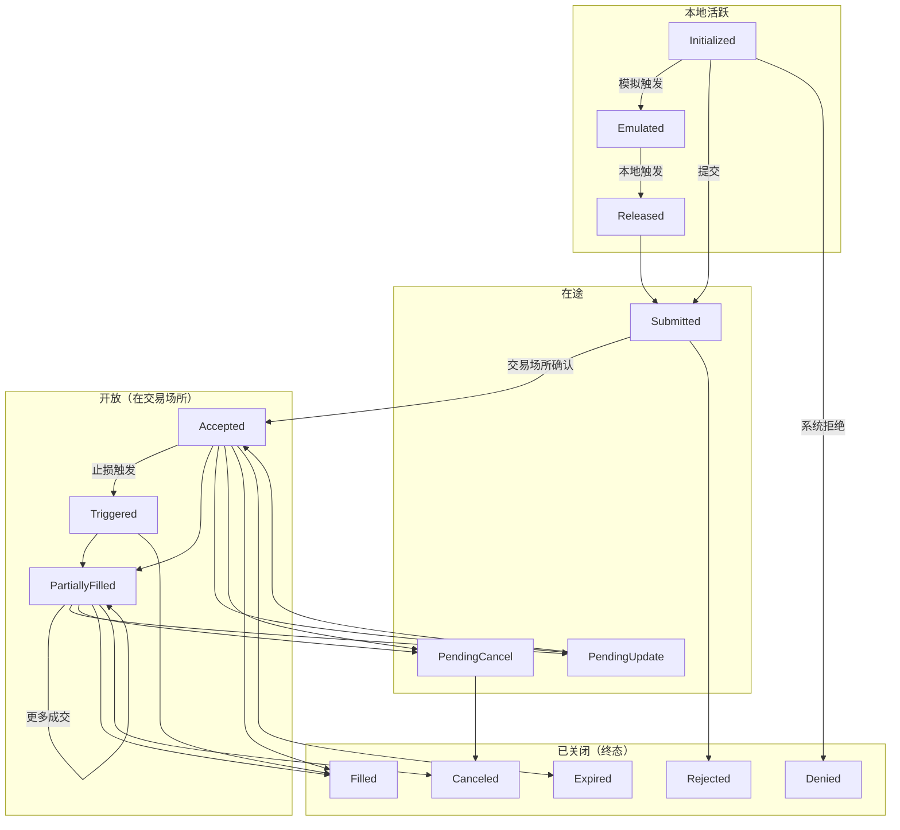

# 订单 (Orders)

NautilusTrader 支持广泛的订单类型和执行指令，尽可能多地暴露交易场所 (venue) 的功能。
交易者可以在任何交易策略中定义订单执行和管理的指令与条件。

## 概述

所有订单类型都源自两种基本类型：*市价单 (Market)* 和 *限价单 (Limit)*。在流动性方面，它们是相反的。
*市价单* 通过以最佳可用价格立即执行来消耗流动性，而 *限价单*
则通过在订单簿中以指定价格挂单等待匹配来提供流动性。

NautilusTrader 支持九种订单类型（即 `OrderType` 枚举值），它们汇总于
[订单类型](#订单类型)一节，并各自配有专门的指南。

:::info
NautilusTrader 为多种订单类型和执行指令提供了统一的 API，但并非所有交易场所都支持每个选项。
如果订单包含目标交易场所不支持的指令或选项，系统不会提交该订单，
而是记录一条清晰的解释性错误信息。
:::

:::tip 处理不支持的订单类型

当订单包含交易场所不支持的类型或指令时，系统会生成 `OrderDenied` 事件（拒绝原因包含具体说明），而**不会**向交易场所发送该订单。在策略中处理此情况：

```python
from nautilus_trader.model.events import OrderDenied

def on_order_denied(self, event: OrderDenied) -> None:
    self.log.warning(
        f"订单被拒绝: {event.client_order_id}, 原因: {event.reason}"
    )
    # 可回退到支持的替代订单类型（如改用 MARKET 代替 STOP_MARKET）
```

常见原因：
- 交易场所不支持该订单类型（如不支持 `TRAILING_STOP_MARKET`）。
- 不支持特定执行指令（如不支持 `post_only`）。

若需要跨交易场所兼容性，考虑使用**订单模拟**（`emulation_trigger`），由 Nautilus 在本地模拟高级订单类型。
:::

### 术语

- 如果订单类型为 `MARKET`，或作为 *可成交* 订单执行（即消耗流动性），则该订单是**主动的 (aggressive)**。
- 如果订单不可成交（即提供流动性），则该订单是**被动的 (passive)**。
- 如果订单处于以下三种非终态状态之一，保持在本地系统边界内，则该订单是**本地活跃的 (active local)**：
  - `INITIALIZED`
  - `EMULATED`
  - `RELEASED`
- 当订单处于以下状态之一时，该订单是**在途的 (in-flight)**：
  - `SUBMITTED`
  - `PENDING_UPDATE`
  - `PENDING_CANCEL`

:::note 在途订单超时处理

在实盘交易中，在途订单（`SUBMITTED`、`PENDING_UPDATE`、`PENDING_CANCEL`）表示已发送至交易场所但尚未收到确认。系统**不会自动超时取消**在途订单，因为该请求可能已在交易场所执行但确认延迟。

`LiveExecutionEngine` 通过定期对账检测并解决此类差异（参见[持续对账](../live.md#continuous-reconciliation)）。若需要在策略层主动处理超时，可使用定时器监控：

```python
from datetime import timedelta
from nautilus_trader.model.identifiers import ClientOrderId

def on_order_submitted(self, event) -> None:
    # 设置 30 秒超时检查
    self.clock.set_alert(
        f"inflight_timeout_{event.client_order_id}",
        self.clock.utc_now() + timedelta(seconds=30),
    )

def on_alert(self, event) -> None:
    if event.name.startswith("inflight_timeout_"):
        order_id = ClientOrderId(event.name.replace("inflight_timeout_", ""))
        if self.cache.is_order_inflight(order_id):
            self.query_order(order_id)  # 向交易场所查询最新状态
```
:::

- 当订单处于以下（非终态）状态之一时，该订单是**开放的 (open)**：
  - `ACCEPTED`
  - `TRIGGERED`
  - `PENDING_UPDATE`
  - `PENDING_CANCEL`
  - `PARTIALLY_FILLED`
- 当订单处于以下（终态）状态之一时，该订单是**已关闭的 (closed)**：
  - `DENIED`
  - `REJECTED`
  - `CANCELED`
  - `EXPIRED`
  - `FILLED`

### 订单状态流转

下图展示了订单生命周期和主要状态转换：



### 订单状态定义

| 状态                | 描述                                                                            |
|--------------------|---------------------------------------------------------------------------------|
| `INITIALIZED`      | 订单已在 Nautilus 系统中实例化。                                                    |
| `DENIED`           | 订单因无效、无法处理或超出风险限制而被 Nautilus 拒绝。                                   |
| `EMULATED`         | 订单正在由 `OrderEmulator` 组件进行模拟 (emulation)。                                |
| `RELEASED`         | 订单已从 `OrderEmulator` 组件释放。                                                 |
| `SUBMITTED`        | 订单已提交至交易场所（等待确认）。                                                     |
| `ACCEPTED`         | 订单已被交易场所确认接收且有效（可能已开始生效）。                                        |
| `REJECTED`         | 订单被交易场所拒绝。                                                                |
| `CANCELED`         | 订单已取消（终态）。                                                                |
| `EXPIRED`          | 订单已达到 GTD 到期时间（终态）。                                                     |
| `TRIGGERED`        | 订单的 STOP 价格已在交易场所被触发。                                                  |
| `PENDING_UPDATE`   | 订单正在交易场所等待修改请求处理。                                                     |
| `PENDING_CANCEL`   | 订单正在交易场所等待取消请求处理。                                                     |
| `PARTIALLY_FILLED` | 订单已在交易场所部分成交 (fill)。                                                     |
| `FILLED`           | 订单已完全成交（终态）。                                                              |

## 执行指令

某些交易场所允许交易者指定订单处理和执行方式的条件与限制。以下是可用执行指令的简要总结。

### 有效期类型 (Time in force)

订单的有效期类型指定了订单在剩余数量被取消之前将保持开放或活跃的时间。

- `GTC` **（Good Till Cancel，持续有效）**：订单保持活跃，直到交易者或交易场所取消。
- `IOC` **（Immediate or Cancel / Fill and Kill，立即成交或撤销）**：订单立即执行，未成交部分立即取消。
- `FOK` **（Fill or Kill，全部成交或撤销）**：订单必须立即全部成交，否则完全不执行。
- `GTD` **（Good Till Date，指定时间前有效）**：订单保持活跃，直到指定的到期日期和时间。
- `DAY` **（Good for session/day，当日有效）**：订单保持活跃，直到当前交易时段结束。
- `AT_THE_OPEN` **（OPG）**：订单仅在交易时段开盘时有效。
- `AT_THE_CLOSE`：订单仅在交易时段收盘时有效。

### 到期时间

此指令与 `GTD` 有效期类型配合使用，用于指定订单到期并从交易场所订单簿（或订单管理系统）中移除的时间。

### 仅挂单 (Post-only)

标记为 `post_only` 的订单将只提供流动性到限价订单簿，
永远不会作为主动方发起消耗流动性的交易。此选项对做市商或希望将订单限制在流动性 *提供者 (maker)* 费率层级的交易者很重要。

### 仅减仓 (Reduce-only)

设置为 `reduce_only` 的订单将只减少某一工具上的现有仓位，
永远不会开立新仓位（如果已经平仓）。此指令的确切行为可能因交易场所而异。

但是，Nautilus `SimulatedExchange` 中的行为是典型的真实交易场所行为。

- 如果关联仓位被关闭（变为平仓），订单将被取消。
- 随着关联仓位规模的减小，订单数量将相应减少。

### 显示数量

`display_qty` 指定在限价订单簿上显示的 *限价* 订单的部分数量。
这些也被称为冰山订单 (iceberg orders)，因为有一个可见的显示部分，同时还有隐藏的更多数量。
指定显示数量为零也等同于将订单设置为 `hidden`（隐藏）。

### 触发类型 (Trigger type)

也称为[触发方法](https://www.interactivebrokers.com/en/software/tws/usersguidebook/configuretws/Modify%20the%20Stop%20Trigger%20Method.htm)，
适用于条件触发订单，指定触发止损价格的方法。

- `DEFAULT`：交易场所的默认触发类型（通常为 `LAST_PRICE` 或 `BID_ASK`）。
- `LAST_PRICE`：触发价格基于最近成交价。
- `BID_ASK`：触发价格基于买入订单的买价和卖出订单的卖价。
- `DOUBLE_LAST`：触发价格基于最近两次连续的成交价。
- `DOUBLE_BID_ASK`：触发价格基于最近两次连续的买价或卖价（视情况而定）。
- `LAST_OR_BID_ASK`：触发价格基于最近成交价或买卖价。
- `MID_POINT`：触发价格基于买价和卖价的中间点。
- `MARK_PRICE`：触发价格基于交易场所该工具的标记价格。
- `INDEX_PRICE`：触发价格基于交易场所该工具的指数价格。

### 触发偏移类型

适用于条件追踪止损 (trailing stop) 触发订单，指定基于与 *市场*（买价、卖价或最近成交价，视情况而定）的偏移来修改止损价格的方法。

- `DEFAULT`：交易场所的默认偏移类型（通常为 `PRICE`）。
- `PRICE`：偏移基于价格差值。
- `BASIS_POINTS`：偏移基于以基点表示的价格百分比差值（100bp = 1%）。
- `TICKS`：偏移基于跳动点数量。
- `PRICE_TIER`：偏移基于交易场所特定的价格层级。

### 条件单 (Contingent orders)

可以在订单之间指定更高级的关系。
例如，子订单可以被指定为仅在父订单被激活或成交时触发，或者订单可以被关联使得一个取消或减少另一个的数量。有关更多详情，请参阅[高级订单](advanced.md)指南。

## 订单工厂

创建新订单最简单的方法是使用内置的 `OrderFactory`，它
会自动附加到每个 `Strategy` 类上。此工厂将处理
底层细节——例如确保分配正确的交易者 ID 和策略 ID、生成
必要的初始化 ID 和时间戳，并抽象掉不一定适用于正在创建的订单类型的参数，
或仅在需要指定更高级执行指令时才需要的参数。

这使得工厂具有更简单的订单创建方法，所有
示例都将在 `Strategy` 上下文中利用 `OrderFactory`。

有关更多详情，请参阅 [`OrderFactory` API 参考](/docs/python-api-latest/common.html#nautilus_trader.common.factories.OrderFactory)。

## 订单类型

NautilusTrader 支持以下订单类型。每种类型都链接到一份带有代码示例的专门指南；
可选参数会用包含默认值的注释标记。

| 订单类型                                            | 类别                 | 描述                                                              |
|----------------------------------------------------|----------------------|-----------------------------------------------------------------|
| [`MARKET`](market.md)                              | 主动                 | 以最佳可用价格立即交易该数量。                                       |
| [`LIMIT`](limit.md)                                | 被动                 | 挂在订单簿中，仅以限价或更优价格成交。                                |
| [`STOP_MARKET`](stop_market.md)                    | 条件                 | 一旦触发价格被触及，下达一个 *市价单*。                              |
| [`STOP_LIMIT`](stop_limit.md)                      | 条件                 | 一旦触发价格被触及，以设定价格下达一个 *限价单*。                     |
| [`MARKET_TO_LIMIT`](market_to_limit.md)            | 混合                 | 作为 *市价单* 提交；任何剩余部分以成交价挂为 *限价单*。               |
| [`MARKET_IF_TOUCHED`](market_if_touched.md)        | 条件                 | 一旦触发价格被触及，下达一个 *市价单*。                              |
| [`LIMIT_IF_TOUCHED`](limit_if_touched.md)          | 条件                 | 一旦触发价格被触及，以设定价格下达一个 *限价单*。                     |
| [`TRAILING_STOP_MARKET`](trailing_stop_market.md)  | 条件追踪             | 以一定偏移追踪触发价，随后下达一个 *市价单*。                        |
| [`TRAILING_STOP_LIMIT`](trailing_stop_limit.md)    | 条件追踪             | 以一定偏移追踪触发价，随后下达一个 *限价单*。                        |

### FIX OrdType 映射

每种类型映射到最接近的 FIX 5.0 SP2 [`OrdType <40>`](https://www.onixs.biz/fix-dictionary/5.0.sp2/tagnum_40.html)
值（在协议定义了相应值的情况下）：

| 订单类型              | FIX `OrdType <40>`                   |
|----------------------|--------------------------------------|
| Market               | `1` (Market)                         |
| Limit                | `2` (Limit)                          |
| Stop‑Market          | `3` (Stop)                           |
| Stop‑Limit           | `4` (Stop Limit)                     |
| Market‑To‑Limit      | `K` (Market With Left Over as Limit) |
| Market‑If‑Touched    | `J` (Market If Touched)              |
| Limit‑If‑Touched     | 无专用值 †                            |
| Trailing‑Stop‑Market | `3` (Stop) + 追踪 peg                 |
| Trailing‑Stop‑Limit  | `4` (Stop Limit) + 追踪 peg           |

† FIX 没有为 *Limit-If-Touched* 定义专用的 `OrdType`；它通常以 `4`（Stop Limit）
配合一个有利的触发价发送。追踪止损同样没有专用值，被建模为 `3`/`4`
加上追踪 peg 字段。

## 高级订单

订单可以分组为列表并通过条件关系（OTO、OCO、OUO）相互关联，括号订单则为入场订单附加止盈和止损子订单。
有关订单列表、条件类型、验证规则和括号订单的内容，请参阅[高级订单](advanced.md)指南。

## 模拟订单 (Emulated orders)

NautilusTrader 可以在本地模拟交易场所原生不支持的订单类型，实际执行时仅使用
`MARKET` 和 `LIMIT` 订单。有关模拟生命周期、支持的类型、查询和最佳实践，请参阅[模拟订单](emulated.md)指南。

## 相关指南

- [事件](../events.md) - 订单事件、仓位事件和处理器分发。
- [执行](../execution.md) - 订单执行与成交处理。
- [仓位](../positions.md) - 由订单成交创建的仓位。
- [策略](../strategies.md) - 来自策略的订单管理。
