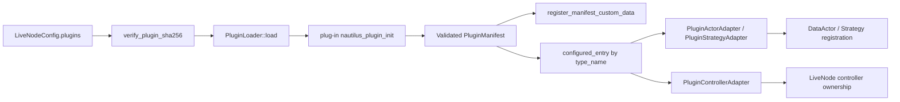
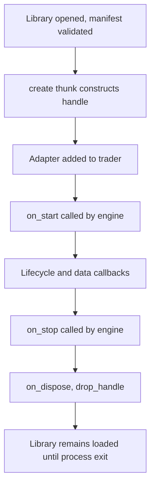
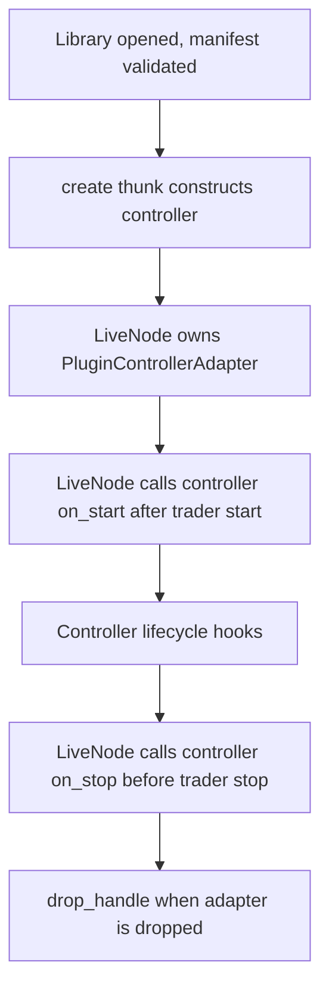

# 插件 (Plugins)

插件系统通过独立编译的 Rust cdylib 扩展 Nautilus 实时节点的能力。宿主（host）在实时节点处于 `Idle` 状态时加载每个 cdylib，并让其中的 actor、策略、控制器以及自定义数据类型与编译进内核的组件一同运行。宿主拥有 C-ABI 边界；插件作者只需编写标准的 Rust trait，由宏来生成边界胶水代码。

:::note
插件系统仅在 Linux 上受支持。
:::

**核心理念**：

- 边界采用 C ABI，因为 Rust 的 `#[repr(Rust)]` 布局在不同编译之间是不稳定的。
- 作者编写普通的 Rust trait；宏生成 `extern "C"` thunk 和 `#[repr(C)]` 虚函数表（vtable）。
- 插件在实时节点处于 `Idle` 状态时加载，通过经过校验的 manifest 注册，并存活至整个进程的生命周期。
- 宿主把 actor 和策略实例适配成 `DataActor` 或 `Strategy`，使实时引擎看不到任何 FFI。
- 实时节点直接拥有控制器实例，并在 trader 注册流程之外驱动它们的生命周期。
- 从 actor 或策略回调回宿主的调用，通过单一的静态函数指针表 `HostVTable` 路由。
- 控制器回调使用专属的 `ControllerHostVTable`。
- 每个插件回调都在 `catch_unwind` 下运行，没有任何路径会跨 FFI 边界展开（unwind）：
  - 可失败的插件 thunk 中发生的 panic 会以 `PluginError` 的形式浮现。
  - `create` 或自定义数据 `clone_handle` 中发生的 panic 会返回一个空句柄（null handle），宿主将其报告为一次可恢复的构造或克隆失败。
  - `drop_handle` thunk 中发生的 panic 会被吞掉，并导致该值泄漏。
  - 自定义数据 `ts_event`、`ts_init` 或 `eq_handles` 中发生的 panic 会中止（abort）进程，因为这些签名不存在合理的哨兵值（sentinel value）。

:::warning
插件 ABI 与 `LiveNodeConfig` 的接线尚处于早期 alpha 阶段。`NAUTILUS_PLUGIN_ABI_VERSION` 和 `PLUGIN_BUILD_ID_VERSION` 在此阶段始终保持为 `1`，即使边界发生变化也是如此。请将插件构建固定（pin）到匹配的宿主版本，并把这里的概念视为当前开发的设计契约，而非稳定的兼容性承诺。
:::

## 术语 (Terms)

- 插件 (Plug-in)：一个导出单一 `nautilus_plugin_init` 符号的 Rust cdylib。
- 插点 (Plug point)：插件可以贡献内容的某一个 trait 接口面（自定义数据、actor、策略、控制器）。
- Manifest：从 `nautilus_plugin_init` 返回的 `'static PluginManifest`，枚举其所有贡献内容。
- VTable：一个 `#[repr(C)]` 的函数指针结构体，宿主针对某个类型的某个插点来调用它。
- `HostVTable`：宿主交给每个 actor 或策略、用于可重入回调的函数指针表。
- `ControllerHostVTable`：宿主交给每个控制器、用于控制器专属宿主服务的函数指针表。
- `HostContext`：一个不透明（opaque）的边界指针，使宿主 thunk 能够把回调归因到发起调用的适配器。在宿主侧它指向一块 `HostContextInner` 分配，携带该适配器的 actor ID 以及调用方是否为策略。
- `ControllerHostContext`：一个不透明的边界指针，携带控制器的插件名与类型名，用于宿主服务归因。
- 适配器 (Adapter)：宿主侧的 `PluginActorAdapter`、`PluginStrategyAdapter` 或 `PluginControllerAdapter`，用于包裹一个插件句柄。

## 插件贡献什么 (What a plug-in contributes)

一个插件 cdylib 可以通过它的 manifest 发布四类贡献：

- 通过 `PluginCustomData`（`surfaces::custom_data`）提供自定义数据类型。
- 通过 `PluginActor`（`surfaces::actor`）提供插件 actor。
- 通过 `PluginStrategy`（`surfaces::strategy`）提供插件策略。
- 通过 `PluginController`（`surfaces::controller`）提供插件控制器。

每一类都拥有自己的 `#[repr(C)]` vtable 结构体、一个面向作者的 trait，以及一条 manifest 在 `Slice<'static, Registration>` 中列出的注册条目。新增一个未来的插点意味着新增一个模块和一个 slice 字段，然后重新构建插件以与宿主匹配。

每一个插点类别都携带一组固定的回调集合。今天的 actor 接口面涵盖：

- 生命周期钩子。
- 面向以下内容的市场数据回调：
  - 金融工具（instruments）
  - 订单簿（order books）与订单簿增量（book deltas）
  - 报价（quotes）、成交（trades）与 K 线（bars）
  - 标记价、指数价与资金费率价（mark, index, and funding prices）
  - 期权希腊值（option greeks）与期权链快照（option chain snapshots）
  - 金融工具状态（instrument status）与金融工具收盘（instrument close）
- 订单成交（filled）与撤单（canceled）事件。
- 信号（signals）与时间事件（time events）。
- 通过 `PluginCustomData` 注册的自定义数据值。

策略接口面在 actor 接口面之上增加了订单生命周期与持仓事件回调。

控制器接口面暴露一个静态的 `prepare` 钩子，外加运行时生命周期回调。控制器使用 JSON 请求与响应信封（envelope）来调用宿主服务，因为它们编排的是运行时组件，而非处理市场数据事件。

## 边界范围 (Boundaries)

插件系统在设计上是有意收窄的。今天不在范围内的内容包括：

- 用于数据与执行的异步客户端适配器。
- 作为插件的 catalog、cache 与 event-store 后端。
- 作为插件的交易前风险闸门（pre-trade risk gating）。
- 热重载（插件在实时节点处于 `Idle` 状态时加载，之后保持加载状态）。
- 可变的宿主 `OrderBook` 状态，以及 actor 或策略回调接口面上的原生或 Python `CustomData`。订单簿回调接收的是克隆出的快照，而非插件自定义数据则没有可供向下转型（downcast）的插件 vtable 和句柄。

## ABI 边界 (ABI boundary)

只有 `#[repr(C)]` 类型才可以在独立编译的插件与宿主之间穿越。以下模式覆盖了当前的接口面：

- 事件以借用的 `*const T` 指针流入插件，指向宿主中已经是 `#[repr(C)]` 的模型类型。无需序列化，也没有逐事件的内存分配。
- 非 `#[repr(C)]` 的入站负载以借用的句柄形式流入插件：
  - `InstrumentAnyHandle`
  - `OrderBookHandle`
  - `OrderBookDeltasHandle`
  - `OptionChainSliceHandle`
  在回调期间，宿主拥有每一个句柄。`OrderBookHandle` 包裹的是一份克隆出的订单簿快照，因此插件永远不会接收到可变的宿主订单簿状态。
- 订单命令以边界拥有（boundary-owned）的 `*const XHandle` 指针形式流出插件：
  - `SubmitOrderHandle`
  - `SubmitOrderListHandle`
  - `CancelOrderHandle`
  - `CancelOrdersHandle`
  - `CancelAllOrdersHandle`
  - `ModifyOrderHandle`
  - `ClosePositionHandle`
  - `CloseAllPositionsHandle`
  - `QueryAccountHandle`
  - `QueryOrderHandle`

  在调用期间，插件拥有这些命令结构体。宿主对句柄解引用并分派到匹配的 `Strategy` 命令，引擎内部的 `TradingCommand` 形态保持不变。在任何逐次调用的命令路径上都没有 JSON 穿越边界。
- 插件自定义数据以借用的 `PluginCustomDataRef` 形式流入 actor 与策略的 `on_data` 回调。宿主只会分派那些来自已加载 manifest 中 `PluginCustomData` 注册的自定义数据值，因为该包装器携带了在 cdylib 内部进行本地向下转型所需的插件 vtable 与不透明句柄。
- 历史插件自定义数据响应只有在值来自 `PluginCustomData` 注册时才使用同一条边界。宿主只在适配器内部检视 `&dyn Any`，提取出已注册的插件 `CustomData`，并以 `PluginCustomDataRef` 调用现有的 `on_data` 槽位。没有任何 `&dyn Any` 值穿越 cdylib 边界。

边界原语（boundary primitives）在 `nautilus_plugin::boundary` 中有文档说明：

- `BorrowedStr`
- `Slice`
- `OwnedBytes`
- `PluginError`
- `PluginResult`

### 标识符驻留 (Identifier interning)

Nautilus 标识符包裹的是 `Ustr`，包括：

- `ClientOrderId`
- `InstrumentId`
- `ClientId`
- `AccountId`
- `PositionId`
- `StrategyId`
- `TraderId`

一个 Rust cdylib 拥有它自己的 `ustr` 全局字符串缓存，因此相同的文本在宿主侧与插件侧可能对应不同的 `Ustr` 指针。边界将 `Ustr` 值视为接收方本地的（receiver-local）：

- 宿主命令分派在调用匹配的 `Strategy::*` 方法之前，会对边界拥有的命令句柄中的每一个标识符重新驻留（re-intern）。
- 插件事件 thunk 在调用 `PluginActor` 或 `PluginStrategy` 的 trait 方法之前，会对入站事件负载中的标识符重新驻留。
- 插件作者可以正常地比较和存储通过 trait 回调接收到的标识符。绕过宏生成 thunk 的代码必须用 `Ustr::from(value.as_str())` 对复制出的标识符重新驻留。

该策略同样覆盖命令或事件负载内部携带的嵌套标识符：

- `Symbol`
- `Venue`
- `OrderListId`
- `ExecAlgorithmId`
- `VenueOrderId`
- `OptionSeriesId`
- 原始的 `Ustr` 标签与名称
- 货币代码（currency codes）

这不会改变任何 vtable 或句柄布局，因此不需要重新构建插件。

## Manifest

Manifest 是插件从 `nautilus_plugin_init` 返回的、进程生命周期的静态数据。它标识构建（build）并枚举每一个插点贡献：

- `abi_version`：必须等于 `NAUTILUS_PLUGIN_ABI_VERSION`，否则宿主拒绝加载。
- `plugin_name`、`plugin_vendor`、`plugin_version`：标识符字符串。
- `build_id`：一个带版本的 `PluginBuildId`，携带：
  - `nautilus-plugin` crate 版本
  - `rustc` 版本
  - 目标三元组（target triple）
  - 构建配置（build profile）
  - 精度模式（precision mode）
  - 固定精度（fixed precision）
- `custom_data`、`actors`、`strategies`、`controllers`：注册 slice，每个插点一个。

加载器在把 manifest 暴露给实时节点之前，会对它运行 `ValidatedPluginManifest::new`。校验会检查标识符字符串、build-id 的 schema 版本、每一个注册的 vtable 指针、每一个必需的 vtable 槽位，以及类型名在所有插点之间的唯一性。它还会将插件的精度模式与固定精度与宿主进行核对，因为标准精度（standard-precision）与高精度（high-precision）构建在边界处使用不同的模型布局。

校验通过后，加载器会固定（pin）该构建：若 `rustc` 或 `nautilus-plugin` crate 版本与宿主不同，则加载会以 `LoadError::BuildMismatch` 失败，因为边界负载包含 `repr(Rust)` 内部结构，其布局只有在共享工具链（toolchain）下才有保证。`PluginLoader::set_allow_build_mismatch` 可将这种拒绝降级为警告。若某个 build-id 字段在任一侧为空则无法比较，并会记录一条警告。目标三元组与构建配置仅作诊断用途。

## 加载流程 (Load flow)



操作步骤如下：

- 节点克隆已配置的插件条目，并在自身不处于 `Idle` 状态时拒绝加载。
- 对于每一个路径，节点在 `LiveNode::load_configured_plugins` 中校验可选的 SHA-256 摘要，然后请求加载器对该 cdylib 进行 `dlopen` 并解析出 `nautilus_plugin_init`。`PluginLoader` 本身不对文件做哈希。
- 插件的 init thunk 接收宿主的 `HostVTable` 指针并返回其静态 manifest。
- 加载器先运行结构校验，再做构建固定。失败会产生一个 `LoadError`，其诊断信息包含插件名、版本以及完整的 `PluginBuildId`。
- 节点把每个已加载的 manifest 遍历一次，以向 `nautilus_model::data::registry` 注册自定义数据反序列化器。
- 节点再次遍历已配置的条目，把每个 `type_name` 解析为某个 actor、策略或控制器注册，并通过插件的 `create` thunk 实例化一个适配器。
- actor 与策略适配器被加入 trader，之后实时引擎会像驱动编译进内核的组件一样驱动它们。
- 控制器适配器仍由实时节点拥有。节点在 trader 启动后启动它们，并在 trader 关闭前停止它们。

加载器在遇到第一个错误时停止，并在整个进程生命周期内泄漏每一个已打开的 `Library`，包括被拒绝的那些。被接受的 manifest、vtable 以及复制进宿主注册表的 `drop_fn` 指针必须比加载器存活得更久；而一个被拒绝的插件已经运行过其静态初始化器和 `nautilus_plugin_init`，因此 `dlclose` 可能会卸载带有存活副作用的代码。

## actor 与策略适配器路由 (Actor and strategy adapter routing)

一旦某个 actor 或策略适配器被注册，回调便通过稳定的函数指针在两个方向上流动：


- 正向调用（引擎到插件）通过适配器经过校验的 vtable，由两层 `catch_unwind` 守护这次 FFI 调用，使插件 panic 以 `PluginError` 的形式浮现，而不是跨边界展开。
- 反向调用（插件到宿主）通过 `HostVTable`。宿主借助它在 create 时交给插件的、每个实例独有的 `HostContext` 指针把每次调用归因到调用方，并路由经过引擎的 cache、msgbus、clock、timer 以及订单流水线。
- 反向调用的分派在宿主侧的 `catch_unwind` 下运行：从插件调用触达的引擎 panic 会以错误码为 `Panic` 的 `PluginError` 浮现给插件，而不是中止节点。
- 宿主在每一个带错误通道的反向调用入口处对插件提供的字符串校验 UTF-8，违规时返回 `InvalidArgument`；不带错误通道的日志槽位则进行有损解码。
- 订单命令槽位拒绝来自 actor 上下文的调用；actor 不能提交订单。
- 默认的 `HostVTable` 对有状态回调返回 `NotImplemented`。引擎通过 `plugin_loader()` 安装一个已填充的 vtable，使插件能够触达真正的执行路径。

控制器适配器改用 `ControllerHostVTable`。它们的生命周期回调通过 `PluginControllerAdapter` 从实时节点流向插件；控制器到宿主的调用通过控制器专属的宿主服务表返回 JSON 信封。

## 生命周期 (Lifecycle)

actor 与策略插件实例遵循与编译进内核的 actor 和策略相同的生命周期：



控制器实例使用相同的 cdylib 加载与 `create`/`drop_handle` 所有权模型，但实时节点直接驱动它们的钩子：



要点：

- `create` 针对每个已配置的实例运行一次。actor 与策略适配器把它们的 `HostVTable` 指针、`HostContextInner` 指针以及逐字（verbatim）的 JSON 配置负载传给插件。
- 控制器适配器把它们的 `ControllerHostVTable` 指针、`ControllerHostContext` 指针以及同样逐字的 JSON 配置负载传给插件。
- 适配器析构（drop）会运行插件的 `drop_handle` thunk，并释放堆上分配的宿主上下文分配。
- `dlclose` 被有意地永不调用。`LoadedPlugin` 把它的 `libloading::Library` 包裹在 `ManuallyDrop` 中，使复制进宿主注册表的 manifest 与 vtable 指针永不悬空（dangle）。

## 加载 (Loading)

无论插件实例是声明在 `LiveNodeConfig.plugins` 上，还是在 Rust 中用 `LiveNode::add_plugin`、或在 Python 中用 `LiveNode.add_plugin` 命令式地添加，它们都使用相同的 `PluginConfig` 形态。

### 配置驱动加载 (Config-driven loading)

把插件实例声明为 `LiveNodeConfig.plugins` 上的一个 `PluginConfig` 条目列表：

```toml
[[plugins]]
path = "./target/debug/examples/libcustom_data_plugin.so"
type_name = "ExampleStrategy"
sha256 = "<optional 64-char hex digest>"

[plugins.config]
strategy_id = "STRAT-001"
order_id_tag = "001"
threshold = 10
```

每个条目绑定一个插件实例：

- `path`：cdylib 的绝对路径或相对于工作目录的路径。重复的路径只加载一次，并在多个条目之间共享。
- `type_name`：来自插件 manifest 的规范类型名。如果 manifest 把该名称暴露为多于一种的 actor、策略或控制器类别，宿主会拒绝该条目。
- `sha256`：可选的小写十六进制 SHA-256 摘要，针对该 cdylib。若设置，节点会在加载前对文件做哈希，并在不匹配时中止。
- `config`：一个自由格式的 JSON 对象，逐字序列化进插件 `create` thunk 接收到的 `config_json` 参数。

在实例化 actor 与策略条目时，节点会解读 `config` 内部的几个众所周知的键：

- `actor_id`：赋给适配器 `ActorId` 的标识符。默认为 manifest 的 `type_name`。
- `strategy_id`：赋给适配器 `StrategyId` 的标识符。默认为 `<type_name>-001`。
- `order_id_tag`：可选的订单 ID 标签，转发进策略的 `StrategyConfig`。
- `strategy_config`：可选的、完整成形的 `StrategyConfig` JSON 值，用于那些需要超出上述三个键的策略插件。

控制器条目在宿主中不使用这些键。它们的 `config` 对象仍会被逐字传入 `PluginController::new`。

### 命令式加载 (Imperative loading)

当代码需要在运行时构建插件列表时，在启动节点之前使用 `LiveNode::add_plugin`：

```rust
use std::collections::HashMap;

use nautilus_live::{config::PluginConfig, node::LiveNode};

let mut node = LiveNode::build("PLUGIN-NODE".to_string(), None)?;

node.add_plugin(PluginConfig {
    path: "./target/debug/examples/libcustom_data_plugin.so".to_string(),
    type_name: "ExampleActor".to_string(),
    config: HashMap::from([(
        "actor_id".to_string(),
        serde_json::json!("PLUGIN-ACTOR-001"),
    )]),
    sha256: None,
})?;
```

Python 暴露相同的路径，无需显式构造 `PluginConfig`：

```python
node = LiveNode.build("PLUGIN-NODE")
node.add_plugin(
    path="./target/debug/examples/libcustom_data_plugin.so",
    type_name="ExampleActor",
    config={"actor_id": "PLUGIN-ACTOR-001"},
)
```

两个入口都会在注册组件之前校验路径、类型名、可选的 SHA-256 摘要、ABI 版本、build ID 以及 manifest 内容（包括精度模式）。宿主在节点离开 `Idle` 状态之后会拒绝命令式注册。

插件支持由实时 crate 上的 `plugin` Cargo feature 控制，该 feature 默认开启。以 `--no-default-features` 编译的构建（或任何省略 `plugin` 的 feature 集合）会以一个清晰的错误拒绝非空的 `plugins` 列表，使插件用户不会在没有编译进宿主侧支持的情况下意外运行。当实时 crate 在没有插件支持的情况下构建时，`LiveNode::add_plugin` 会返回同一类 feature-gate 错误。

## 作者 API (Author API)

插件作者为每一个插点类别实现一个 trait，并调用 `nautilus_plugin!` 宏：

```rust
use nautilus_model::data::QuoteTick;
use nautilus_plugin::prelude::*;

#[derive(Default)]
pub struct ExampleActor {
    quotes_seen: u64,
}

impl PluginActor for ExampleActor {
    const TYPE_NAME: &'static str = "ExampleActor";

    fn new(_host: *const HostVTable, _ctx: *const HostContext, _config_json: &str) -> Self {
        Self::default()
    }

    fn on_quote(&mut self, _quote: &QuoteTick) -> anyhow::Result<()> {
        self.quotes_seen += 1;
        Ok(())
    }
}

nautilus_plugin::nautilus_plugin! {
    name: "example-actor-plugin",
    vendor: "Nautech",
    version: env!("CARGO_PKG_VERSION"),
    actors: [ExampleActor],
}
```

该宏会生成 `nautilus_plugin_init`、`'static PluginManifest` 以及每一个插点的 vtable。每个生成的 thunk 都携带与其签名匹配的 panic 守护（panic guard）：

- 可失败的 thunk 通过 `panic::guard` 转发，把 panic 映射为 `PluginError::Panic`。
- `create` 与自定义数据 `clone_handle` 通过 `guard_or_null` 转发，把 panic 映射为一个空句柄，宿主将其报告为一次可恢复的失败。
- `drop_handle` thunk 通过 `guard_drop` 转发，它会吞掉 panic 并泄漏该值。
- 自定义数据 `ts_event`、`ts_init` 与 `eq_handles` 通过 `guard_infallible` 转发，它会在 panic 时中止（abort），因为不存在合理的哨兵值。

那些不可能 panic 的平凡槽位（即 `type_name` thunk，它们只是返回一个覆盖 `&'static str` 常量的 `BorrowedStr`）完全不携带守护。

同一个宏接受 `custom_data`、`actors`、`strategies` 与 `controllers` 列表。作者永远不需要编写 `extern "C"` 或 `#[repr(C)]`。`unsafe` 需求取决于插件持有什么。`crates/plugin/examples/custom_data_plugin.rs` 中的示例 actor 丢弃了 `PluginActor::new` 接收到的 `*const HostVTable` 与 `*const HostContext` 指针，因此它不需要任何 `unsafe`。存储这些指针的插件（无论是 actor 还是策略）需要在该结构体上加 `unsafe impl Send`，并且任何对 `HostVTable` 槽位的直接调用都是 `unsafe extern "C"`，因而调用它本身就是 `unsafe`。控制器插件对 `ControllerHostVTable` 与 `ControllerHostContext` 遵循同样的规则。

cdylib 的 `Cargo.toml` 需要 `crate-type = ["cdylib"]` 以及对匹配的 `nautilus-plugin` 版本的依赖。产物会落在 `target/<profile>/<libname>.<so|dylib|dll>`，具体取决于宿主平台。

构建一个随 crate 一起发布的 cdylib 示例：

```fish
cargo build -p nautilus-plugin --example custom_data_plugin
```

## 运维注意事项 (Operating notes)

- 把每一个插件构建固定到宿主的 Nautilus 版本。加载器会检查 `abi_version` 和 build-id schema，拒绝以不同精度模式或固定精度构建的插件，并拒绝 `rustc` 或 `nautilus-plugin` crate 版本不匹配的插件，除非配置了 `PluginLoader::set_allow_build_mismatch`。目标三元组与构建配置作为诊断信息出现在加载错误的输出中。
- 把 `PluginConfig` 条目上的可选 `sha256` 字段用作部署时的完整性检查。
- 节点一旦离开 `Idle` 状态便拒绝加载插件。配置驱动的加载错误在节点构造期间浮现，而命令式 `add_plugin` 的错误在调用点浮现。
- 可失败回调中的插件 panic 会以 `PluginError::Panic` 浮现。`create` 中的 panic 会使该实例构造失败，`drop_handle` 中的 panic 会泄漏该值，而自定义数据 `ts_event`、`ts_init` 或 `eq_handles` 中的 panic 会中止进程；其理由参见 `nautilus_plugin::panic`。
- 加载器活动记录在 `nautilus_plugin` target 下。

## 与编译进内核的组件的关系 (Relationship to compiled-in components)

一旦适配器被注册，插件 actor 与策略的行为便与任何其他 `DataActor` / `Strategy` 无异：

- 相同的 trader 注册 API。
- 对通过适配器路由的订单命令，使用相同的 risk、OMS 与 event-store 路径。
- cache 读取、msgbus 发布与 timer 回调按设计绕过 `Strategy` 层，直接经过引擎服务。

控制器插件则不同：实时节点拥有它们，在 trader 启动后启动它们，并在 trader 停止前停止它们。它们可以通过 `ControllerHostVTable` 接口面编排运行时工作，但除非它们请求宿主创建那些组件，否则它们并不是 trader 的 actor 或策略。

共同的区别是结构性的：插件以独立的 cdylib 连同其自身的 manifest 一起发布，作为交换，它们可以在不重新编译宿主的前提下，作为树外（out-of-tree）部署。
