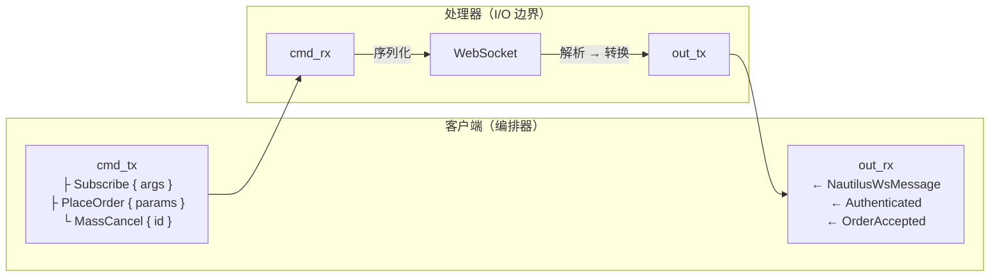

# 适配器

## 简介

本开发者指南提供了为 NautilusTrader 平台开发集成适配器（adapter）的规范和说明。
适配器提供与交易场所（venue）和数据提供商的连接——将原始场所 API 转换为 Nautilus 的统一接口和标准化领域模型。

## 适配器的结构

NautilusTrader 适配器遵循分层架构模式，包括：

- **Rust 核心层**，用于网络客户端和性能关键操作。
- **Python 层**，用于将 Rust 客户端集成到平台的数据和执行引擎中。

目前可作为标准化模式参考的良好示例有：

- OKX
- BitMEX
- Bybit

### Rust 核心层（`crates/adapters/your_adapter/`）

Rust 层负责处理：

- **HTTP 客户端**：原始 API 通信、请求签名、速率限制。
- **WebSocket 客户端**：低延迟流式连接、消息解析。
- **解析**：将场所数据快速转换为 Nautilus 领域模型。
- **Python 绑定**：通过 PyO3 导出，使 Rust 功能可供 Python 使用。

典型的 Rust 结构：

```
crates/adapters/your_adapter/
├── src/
│   ├── common/              # 共享类型和工具
│   │   ├── consts.rs        # 场所常量 / 经纪商 ID
│   │   ├── credential.rs    # API 密钥存储和签名辅助
│   │   ├── enums.rs         # 场所枚举，映射 REST/WS 载荷
│   │   ├── models.rs        # 共享模型类型
│   │   ├── parse.rs         # 共享解析辅助
│   │   ├── urls.rs          # 环境和产品感知的基础 URL 解析器
│   │   └── testing.rs       # 跨单元测试复用的测试固件
│   ├── data/                # 数据客户端（Rust 原生，可选）
│   │   └── mod.rs           # 数据客户端实现
│   ├── execution/           # 执行客户端（Rust 原生，可选）
│   │   └── mod.rs           # 执行客户端实现
│   ├── http/                # HTTP 客户端实现
│   │   ├── client.rs        # 带认证的 HTTP 客户端
│   │   ├── error.rs         # HTTP 特定错误类型
│   │   ├── models.rs        # REST 载荷的结构体
│   │   ├── parse.rs         # 响应解析函数
│   │   └── query.rs         # 请求和查询构建器
│   ├── websocket/           # WebSocket 实现
│   │   ├── client.rs        # WebSocket 客户端
│   │   ├── enums.rs         # WebSocket 特定枚举
│   │   ├── error.rs         # WebSocket 特定错误类型
│   │   ├── handler.rs       # 消息处理器 / Feed 处理器
│   │   ├── messages.rs      # 流载荷的结构体
│   │   └── parse.rs         # 消息解析函数
│   ├── python/              # PyO3 Python 绑定
│   │   ├── enums.rs         # Python 可见的枚举
│   │   ├── http.rs          # Python HTTP 客户端绑定
│   │   ├── urls.rs          # Python URL 辅助
│   │   ├── websocket.rs     # Python WebSocket 客户端绑定
│   │   └── mod.rs           # 模块导出
│   ├── config.rs            # 配置结构体
│   ├── error.rs             # 适配器级别的错误类型
│   ├── factories.rs         # 工厂函数（可选）
│   └── lib.rs               # 库入口点
├── tests/                   # 使用 mock 服务器的集成测试
│   ├── data.rs              # 数据客户端集成测试
│   ├── execution.rs         # 执行客户端集成测试
│   ├── http.rs              # HTTP 客户端集成测试
│   └── websocket.rs         # WebSocket 客户端集成测试
└── test_data/               # 规范的场所载荷
```

### Python 层（`nautilus_trader/adapters/your_adapter`）

Python 层通过以下组件提供集成接口：

1. **工具提供者**：通过 `InstrumentProvider` 提供金融工具定义。
2. **数据客户端**：通过 `LiveDataClient` 和 `LiveMarketDataClient` 处理市场数据流和历史数据请求。
3. **执行客户端**：通过 `LiveExecutionClient` 管理订单执行。
4. **工厂**：将场所特定数据转换为 Nautilus 领域模型。
5. **配置**：面向用户的客户端设置配置类。

典型的 Python 结构：

```
nautilus_trader/adapters/your_adapter/
├── config.py     # 配置类
├── constants.py  # 适配器常量
├── data.py       # LiveDataClient/LiveMarketDataClient
├── execution.py  # LiveExecutionClient
├── factories.py  # 金融工具工厂
├── providers.py  # InstrumentProvider
└── __init__.py   # 包初始化
```

## 适配器实现顺序

本节概述了实现适配器的推荐顺序。该顺序遵循依赖驱动的方法，每个阶段都建立在前一阶段的基础之上。
适配器采用 Rust 优先架构——在实现任何 Python 层之前先实现 Rust 核心。

### 阶段 1：Rust 核心基础设施

构建底层网络和解析基础。

| 步骤 | 组件                       | 描述                                                                                         |
|------|----------------------------|----------------------------------------------------------------------------------------------|
| 1.1  | HTTP 错误类型              | 定义 HTTP 特定的错误枚举，包含可重试/不可重试变体（`http/error.rs`）。                       |
| 1.2  | HTTP 客户端                | 实现凭证、请求签名、速率限制和重试逻辑。                                                     |
| 1.3  | HTTP API 模型              | 定义 REST 端点的请求/响应结构体（`http/models.rs`、`http/query.rs`）。                        |
| 1.4  | HTTP 解析                  | 将场所响应转换为 Nautilus 领域模型（`http/parse.rs`、`common/parse.rs`）。                    |
| 1.5  | WebSocket 错误类型         | 定义 WebSocket 特定的错误枚举（`websocket/error.rs`）。                                      |
| 1.6  | WebSocket 客户端           | 实现连接生命周期、认证、心跳和重连。                                                         |
| 1.7  | WebSocket 消息             | 定义流载荷类型（`websocket/messages.rs`）。                                                  |
| 1.8  | WebSocket 解析             | 将流消息转换为 Nautilus 领域模型（`websocket/parse.rs`）。                                   |
| 1.9  | Python 绑定                | 通过 PyO3 暴露 Rust 功能（`python/mod.rs`）。                                                |

**里程碑**：Rust crate 编译通过，单元测试通过，HTTP/WebSocket 客户端可以认证并流式传输/请求原始数据。

### 阶段 2：金融工具定义

金融工具是基础——数据客户端和执行客户端都依赖于它们。

| 步骤 | 组件                       | 描述                                                                                         |
|------|----------------------------|----------------------------------------------------------------------------------------------|
| 2.1  | 金融工具解析               | 将场所金融工具定义解析为 Nautilus 类型（现货、永续、期货、期权）。                            |
| 2.2  | 工具提供者                 | 实现 `InstrumentProvider` 来加载、过滤和缓存金融工具。                                       |
| 2.3  | 符号映射                   | 处理场所特定的符号格式和 Nautilus `InstrumentId` 转换。                                      |

**里程碑**：`InstrumentProvider.load_all_async()` 返回有效的 Nautilus 金融工具。

### 阶段 3：市场数据

构建数据订阅和历史数据请求。

| 步骤 | 组件                       | 描述                                                                                         |
|------|----------------------------|----------------------------------------------------------------------------------------------|
| 3.1  | 公共 WebSocket 流          | 订阅订单簿、成交、行情和其他公共频道。                                                       |
| 3.2  | 历史数据请求               | 通过 HTTP 获取历史 K 线、成交和订单簿快照。                                                  |
| 3.3  | 数据客户端（Python）       | 实现 `LiveDataClient` 或 `LiveMarketDataClient`，将 Rust 客户端接入数据引擎。                |

**里程碑**：数据客户端连接、订阅金融工具，并向平台发出市场数据。

### 阶段 4：订单执行

构建订单管理和账户状态。

| 步骤 | 组件                       | 描述                                                                                         |
|------|----------------------------|----------------------------------------------------------------------------------------------|
| 4.1  | 私有 WebSocket 流          | 订阅订单更新、成交、持仓和账户余额变动。                                                     |
| 4.2  | 基本订单提交               | 通过 HTTP 或 WebSocket 实现市价单和限价单。                                                  |
| 4.3  | 订单修改/撤销              | 实现订单修改和撤销。                                                                         |
| 4.4  | 执行客户端（Python）       | 实现 `LiveExecutionClient`，将 Rust 客户端接入执行引擎。                                     |
| 4.5  | 执行对账                   | 生成订单、成交和持仓状态报告，用于启动时的对账。                                             |

**里程碑**：执行客户端提交订单、接收成交，并在连接时对账状态。

### 阶段 5：高级功能

根据场所能力扩展覆盖范围。

| 步骤 | 组件                       | 描述                                                                                         |
|------|----------------------------|----------------------------------------------------------------------------------------------|
| 5.1  | 高级订单类型               | 条件单、止损单、止盈单、追踪止损单、冰山单等。                                               |
| 5.2  | 批量操作                   | 批量提交订单、批量撤销、全部撤销。                                                           |
| 5.3  | 场所特定功能               | 期权链、资金费率、强平或其他场所特定数据。                                                   |

### 阶段 6：配置和工厂

将所有组件组装在一起以供生产使用。

| 步骤 | 组件                       | 描述                                                                                         |
|------|----------------------------|----------------------------------------------------------------------------------------------|
| 6.1  | 配置类                     | 创建 `LiveDataClientConfig` 和 `LiveExecClientConfig` 子类。                                 |
| 6.2  | 工厂函数                   | 实现工厂函数以从配置实例化客户端。                                                           |
| 6.3  | 环境变量                   | 支持从环境变量解析凭证。                                                                     |

### 阶段 7：测试和文档

验证集成并编写使用文档。

| 步骤 | 组件                       | 描述                                                                                         |
|------|----------------------------|----------------------------------------------------------------------------------------------|
| 7.1  | Rust 单元测试              | 在 `#[cfg(test)]` 块中测试解析器、签名辅助和业务逻辑。                                      |
| 7.2  | Rust 集成测试              | 在 `tests/` 中使用 mock Axum 服务器测试 HTTP/WebSocket 客户端。                              |
| 7.3  | Python 集成测试            | 在 `tests/integration_tests/adapters/<adapter>/` 中测试数据/执行客户端。                     |
| 7.4  | 示例脚本                   | 提供可运行的示例，演示数据订阅和订单执行。                                                   |

有关详细的测试组织指南，请参阅[测试](#测试)部分。

---

## Rust 适配器模式

### 公共代码（`common/`）

将场所常量、凭证辅助、枚举和可复用解析器归入 `src/common` 下。
诸如 OKX 等适配器将 `consts`、`credential`、`enums` 和 `urls` 等子模块与 `testing` 模块放在一起用于测试固件，为横切关注点提供单一存放位置。
当适配器有多个环境或产品类别时，添加专门的 `common::urls` 辅助函数，使 REST/WebSocket 基础 URL 与 Python 层保持同步。

### 配置（`config.rs`）

在 `src/config.rs` 中暴露类型化的配置结构体，以便 Python 调用方切换场所特定行为（参考 OKX 如何配置演示 URL、重试和频道标志）。
保持默认值最小化，并将 URL 选择委托给 `common::urls` 中的辅助函数。

### 错误分类（`error.rs`）

将 HTTP/WebSocket 的故障处理集中在适配器特定的错误枚举中。
例如 BitMEX 区分了可重试、不可重试和致命变体，同时嵌入了原始传输错误——遵循这种模式，以便运维工具可以一致地做出反应。

### Python 导出（`python/mod.rs`）

通过 PyO3 模块镜像 Rust 的 API 表面，重新导出客户端、枚举和辅助函数。
当 Rust 中增加新功能时，将其添加到 `python/mod.rs` 中，以使 Python 层保持同步（OKX 适配器是一个很好的参考）。

### Python 绑定（`python/`）

通过 PyO3 将 Rust 功能暴露给 Python。
用 `#[pyclass]` 标记需要 Python 访问的场所特定结构体，并使用 `#[pymethods]` 块和 `#[getter]` 属性实现字段访问。

对于 HTTP 客户端中的 async 方法，使用 `pyo3_async_runtimes::tokio::future_into_py` 将 Rust future 转换为 Python awaitable。
当返回自定义类型的列表时，在构造 Python 列表之前使用 `Py::new(py, item)` 映射每个元素。
在 `python/mod.rs` 中使用 `m.add_class::<YourType>()` 注册所有导出的类和枚举，以便 Python 代码可以使用它们。

遵循其他适配器建立的模式：在 Rust 中为面向 Python 的方法添加 `py_*` 前缀，同时使用 `#[pyo3(name = "method_name")]` 在不带前缀的情况下暴露它们。

从 WebSocket 向 Python 传递金融工具时，使用 `instrument_any_to_pyobject()` 返回用于缓存的 PyO3 类型。
对于反向方向（Python→Rust），在 `cache_instrument()` 方法中使用 `pyobject_to_instrument_any()`。
永远不要直接在 `InstrumentAny` 上调用 `.into_py_any()`，因为它没有实现所需的 trait。

### 类型限定

适配器特定类型（枚举、结构体）和 Nautilus 领域类型不应完全限定。
在模块级别导入它们并使用短名称（例如 `OKXContractType` 而不是 `crate::common::enums::OKXContractType`，`InstrumentId` 而不是 `nautilus_model::identifiers::InstrumentId`）。
这使代码保持简洁和可读。
只对来自 `anyhow` 和 `tokio` 的类型进行完全限定，以避免与其他 crate 中同名类型产生歧义。

### 字符串驻留

对平台重复存储的任何非唯一字符串（场所、符号、金融工具 ID）使用 `ustr::Ustr`，以最小化分配和比较开销。

### 金融工具缓存标准化

所有缓存金融工具的客户端必须实现三个标准命名的方法：`cache_instruments()`（复数，批量替换）、`cache_instrument()`（单数，插入或更新）和 `get_instrument()`（按符号检索）。
WebSocket 客户端应使用 WebSocket 模式下文档记录的双层缓存架构（外层 `DashMap`、内层 `AHashMap`、命令通道同步）。

### 测试辅助（`common/testing.rs`）

将共享的测试固件和载荷加载器存储在 `src/common/testing.rs` 中，供 HTTP 和 WebSocket 单元测试使用。
这使 `#[cfg(test)]` 辅助函数远离生产模块，并鼓励复用。

## HTTP 客户端模式

适配器使用标准化的两层 HTTP 客户端架构，将底层 API 操作与高层领域逻辑分离，同时支持 Python 绑定所需的高效克隆。

### 客户端结构

该架构由两个互补的客户端组成：

1. **原始客户端**（`MyRawHttpClient`）- 匹配场所端点的底层 API 方法。
2. **领域客户端**（`MyHttpClient`）- 使用 Nautilus 领域类型的高层方法。

```rust
use std::sync::Arc;
use nautilus_network::http::HttpClient;

// 原始 HTTP 客户端 - 匹配场所端点的底层 API 方法
pub struct MyRawHttpClient {
    base_url: String,
    client: HttpClient,  // 使用 nautilus_network::http::HttpClient，而非直接使用 reqwest
    credential: Option<Credential>,
    retry_manager: RetryManager<MyHttpError>,
    cancellation_token: CancellationToken,
}

// 领域 HTTP 客户端 - 用 Arc 包装原始客户端，提供高层 API
pub struct MyHttpClient {
    pub(crate) inner: Arc<MyRawHttpClient>,
    // 额外的领域特定状态（例如金融工具缓存）
    instruments: DashMap<InstrumentId, InstrumentAny>,
}
```

**要点**：

- **原始客户端**（`MyRawHttpClient`）包含尽可能匹配场所端点命名的底层 HTTP 方法（例如 `get_instruments`、`get_balance`、`place_order`）。这些方法接受场所特定的查询对象并返回场所特定的响应类型。
- **领域客户端**（`MyHttpClient`）将原始客户端包装在 `Arc` 中以实现高效克隆（Python 绑定所需）。它提供接受 Nautilus 领域类型（例如 `InstrumentId`、`ClientOrderId`）并返回领域对象的高层方法。它可以缓存金融工具或其他场所元数据。
- 使用 `nautilus_network::http::HttpClient` 而不是直接使用 `reqwest::Client`——这提供了速率限制、重试逻辑和一致的错误处理。
- 两个客户端都暴露给 Python，但领域客户端是大多数用例的主要接口。

### 解析函数

解析函数将场所特定的数据结构转换为 Nautilus 领域对象。这些函数属于 `common/parse.rs`（用于横切转换，如金融工具、成交、K 线）或 `http/parse.rs`（用于 REST 特定的转换）。每个解析器接受场所数据加上下文（账户 ID、时间戳、金融工具引用），并返回包装在 `Result` 中的 Nautilus 领域类型。

**标准模式：**

- 使用 `.parse::<f64>()` 和 `anyhow::Context` 进行字符串到数值的转换，并提供适当的错误上下文。
- 在解析可选字段之前检查空字符串——场所经常返回 `""` 而不是省略字段。
- 使用 `match` 语句将场所枚举显式映射到 Nautilus 枚举，而不是实现可能隐藏映射错误的自动转换。
- 当构造 Nautilus 类型（数量、价格）需要精度或其他元数据时，接受金融工具引用。
- 使用描述性的函数名称：`parse_position_status_report`、`parse_order_status_report`、`parse_trade_tick`。

将解析辅助函数（`parse_price_with_precision`、`parse_timestamp`）作为私有函数放在同一模块中，当它们在多个解析器间复用时。

### 方法命名和组织

原始客户端包含紧密匹配场所端点的底层 API 方法，接受场所特定的查询参数类型并返回场所响应类型。领域客户端包装原始客户端并提供接受 Nautilus 领域类型的高层方法。

**命名约定：**

- **原始客户端方法**：尽可能匹配场所端点命名（例如 `get_instruments`、`get_balance`、`place_order`）。这些方法是原始客户端内部的，接受场所特定类型（构建器、JSON 值）。
- **领域客户端方法**：基于操作语义命名（例如 `request_instruments`、`submit_order`、`cancel_order`）。这些是暴露给 Python 的方法，接受 Nautilus 领域对象（InstrumentId、ClientOrderId、OrderSide 等）。

**领域方法流程：**

领域方法遵循三步模式：从 Nautilus 类型构建场所特定参数，调用相应的原始客户端方法，然后解析响应。对于返回领域对象的端点（持仓、订单、成交），调用 `common/parse` 中的解析函数。对于返回原始场所数据的端点（费率、余额），直接从响应信封中提取结果。以 `request_*` 为前缀的方法表示它们返回领域数据，而 `submit_*`、`cancel_*` 或 `modify_*` 等方法执行操作并返回确认。

领域客户端将原始客户端包装在 `Arc` 中，以实现 Python 绑定所需的高效克隆。

### 查询参数构建器

使用 `derive_builder` crate，配合适当的默认值和人性化的 Option 处理：

```rust
use derive_builder::Builder;

#[derive(Clone, Debug, Deserialize, Serialize, Builder)]
#[serde(rename_all = "camelCase")]
#[builder(setter(into, strip_option), default)]
pub struct InstrumentsInfoParams {
    pub category: ProductType,
    #[serde(skip_serializing_if = "Option::is_none")]
    pub symbol: Option<String>,
    #[serde(skip_serializing_if = "Option::is_none")]
    pub limit: Option<u32>,
}

impl Default for InstrumentsInfoParams {
    fn default() -> Self {
        Self {
            category: ProductType::Linear,
            symbol: None,
            limit: None,
        }
    }
}
```

**关键属性：**

- `#[builder(setter(into, strip_option), default)]` - 启用简洁的 API：`.symbol("BTCUSDT")` 而不是 `.symbol(Some("BTCUSDT".to_string()))`。
- `#[serde(skip_serializing_if = "Option::is_none")]` - 从查询字符串中省略可选字段。
- 始终为构建器参数实现 `Default`。

### 请求签名和认证

将签名逻辑保存在 `common/credential.rs` 下的 `Credential` 结构体中：

- 使用 `Ustr` 存储 API 密钥以实现高效比较，密钥使用 `Box<[u8]>` 配合 `#[zeroize]` 存储。
- 实现 `sign()` 和 `sign_bytes()` 方法来计算 HMAC-SHA256 签名。
- 将凭证传递给原始 HTTP 客户端；领域客户端通过内部客户端委托签名。

对于 WebSocket 认证，处理器使用相同的 `Credential::sign()` 方法构造登录消息，但使用 WebSocket 特定的时间戳格式。

### 环境变量约定

适配器支持在未直接提供 API 凭证时从环境变量加载。这使得无需硬编码密钥即可安全管理凭证。

**命名约定：**

| 环境         | API Key 变量              | API Secret 变量         |
|--------------|---------------------------|-------------------------|
| 主网/实盘    | `{VENUE}_API_KEY`         | `{VENUE}_API_SECRET`    |
| 测试网       | `{VENUE}_TESTNET_API_KEY` | `{VENUE}_TESTNET_API_SECRET` |
| 演示         | `{VENUE}_DEMO_API_KEY`    | `{VENUE}_DEMO_API_SECRET` |

某些场所需要额外的凭证：

- OKX：`OKX_API_PASSPHRASE`
- Coinbase INTX：`COINBASE_INTX_API_PASSPHRASE`、`COINBASE_INTX_PORTFOLIO_ID`

**实现模式：**

使用 `nautilus_core::env::get_or_env_var_opt` 进行可选凭证解析（缺失时返回 `None`），或使用 `get_or_env_var` 在需要凭证时（缺失则返回错误）：

```rust
use nautilus_core::env::get_or_env_var_opt;

let (api_key_env, api_secret_env) = if testnet {
    ("{VENUE}_TESTNET_API_KEY", "{VENUE}_TESTNET_API_SECRET")
} else {
    ("{VENUE}_API_KEY", "{VENUE}_API_SECRET")
};

let key = get_or_env_var_opt(api_key, api_key_env);
let secret = get_or_env_var_opt(api_secret, api_secret_env);
```

**关键原则：**

- 环境变量解析应在 Rust 核心代码中进行，而不是在 Python 绑定中。
- 对可选凭证使用 `get_or_env_var_opt`（仅公开的客户端）。
- 在需要凭证时使用 `get_or_env_var`（缺失则返回错误）。
- 在适配器 README 文件中记录支持的环境变量。

### 错误处理和重试逻辑

使用 `nautilus_network` 中的 `RetryManager` 实现一致的重试行为。

### 速率限制

通过 `HttpClient` 使用 `LazyLock<Quota>` 静态变量配置速率限制。

**命名约定：**

- REST 配额：`{VENUE}_REST_QUOTA`（例如 `OKX_REST_QUOTA`、`BYBIT_REST_QUOTA`）
- WebSocket 配额：`{VENUE}_WS_{OPERATION}_QUOTA`（例如 `OKX_WS_CONNECTION_QUOTA`、`OKX_WS_ORDER_QUOTA`）
- 速率限制键：`{VENUE}_RATE_LIMIT_KEY_{OPERATION}`（例如 `OKX_RATE_LIMIT_KEY_SUBSCRIPTION`、`OKX_RATE_LIMIT_KEY_ORDER`）

**WebSocket 标准速率限制键：**

| 键                              | 操作                             |
|---------------------------------|----------------------------------|
| `*_RATE_LIMIT_KEY_SUBSCRIPTION` | 订阅、取消订阅、登录。           |
| `*_RATE_LIMIT_KEY_ORDER`        | 下单（普通单和算法单）。         |
| `*_RATE_LIMIT_KEY_CANCEL`       | 撤单、批量撤单。                 |
| `*_RATE_LIMIT_KEY_AMEND`        | 修改订单。                       |

**示例：**

```rust
pub static OKX_REST_QUOTA: LazyLock<Quota> =
    LazyLock::new(|| Quota::per_second(NonZeroU32::new(250).unwrap()));

pub static OKX_WS_SUBSCRIPTION_QUOTA: LazyLock<Quota> =
    LazyLock::new(|| Quota::per_hour(NonZeroU32::new(480).unwrap()));

pub const OKX_RATE_LIMIT_KEY_ORDER: &str = "order";
```

在发送 WebSocket 消息时传递速率限制键以执行每操作的配额：

```rust
self.send_with_retry(payload, Some(vec![OKX_RATE_LIMIT_KEY_ORDER.to_string()])).await
```

## WebSocket 客户端模式

WebSocket 客户端处理实时流数据，需要仔细管理连接状态、认证、订阅和重连逻辑。

### 客户端结构

WebSocket 适配器使用**两层架构**来分离 Python 可访问的状态和高性能异步 I/O：

#### 连接状态跟踪

使用 `Arc<ArcSwap<AtomicU8>>` 跟踪连接状态，以在所有克隆间提供无锁、无竞态的可见性：

```rust
use arc_swap::ArcSwap;

pub struct MyWebSocketClient {
    connection_mode: Arc<ArcSwap<AtomicU8>>,  // 共享连接模式（无锁）
    signal: Arc<AtomicBool>,                   // 优雅关闭的取消信号
    // ...
}
```

**模式分解：**

- **外层 `Arc`**：在所有克隆间共享（Python 绑定在异步操作前克隆客户端）。
- **`ArcSwap`**：通过 `.store()` 启用原子指针替换，而无需替换外层 Arc。
- **内层 `Arc<AtomicU8>`**：来自 `WebSocketClient::connection_mode_atomic()` 的实际连接状态。

使用占位原子值（`ConnectionMode::Closed`）初始化，然后在 `connect()` 中调用 `.store(client.connection_mode_atomic())` 以原子方式交换到底层客户端的状态。所有克隆通过 `is_active()` 中的无锁 `.load()` 调用即时看到更新。

底层 `WebSocketClient` 在重连完成时发送 `RECONNECTED` 哨兵消息，触发处理器中的重新订阅逻辑。

**外层客户端**（`{Venue}WebSocketClient`）：

- 编排连接生命周期、认证、订阅。
- 使用 `Arc<DashMap<K, V>>` 维护 Python 访问的状态。
- 跟踪订阅状态以支持重连逻辑。
- 存储金融工具缓存以在重连时重放。
- 通过 `cmd_tx` 通道向处理器发送命令。
- 通过 `out_rx` 通道接收领域事件。

**内层处理器**（`{Venue}WsFeedHandler`）：

- 在专用的 Tokio 任务中运行，作为无状态 I/O 边界。
- 独占拥有 `WebSocketClient`（无需 `RwLock`）。
- 处理来自 `cmd_rx` 的命令 → 序列化为 JSON → 通过 WebSocket 发送。
- 接收原始 WebSocket 消息 → 反序列化 → 转换为 `NautilusWsMessage` → 通过 `out_tx` 发出。
- 使用 `AHashMap<K, V>` 拥有待处理请求状态（单线程，无锁）。
- 拥有用于转换的工作金融工具缓存。

**通信模式：**



**关键原则：**

- **热路径无共享锁**：处理器拥有 `WebSocketClient`，客户端通过无锁 mpsc 通道发送命令。
- **所有发送使用命令模式**：订阅、订单、撤销都通过 `HandlerCommand` 枚举路由。
- **状态使用事件模式**：处理器发出 `NautilusWsMessage` 事件（包括 `Authenticated`），客户端从事件维护状态。
- **待处理状态所有权**：处理器拥有 `AHashMap` 用于匹配响应（层间无 `Arc<DashMap>`）。
- **Python 约束**：客户端仅对 Python 可能查询的状态使用 `Arc<DashMap>`；处理器对内部匹配使用 `AHashMap`。

### 认证

认证状态通过事件管理：

- 处理器处理 `Login` 响应 → **立即返回** `NautilusWsMessage::Authenticated`。
- 客户端接收事件 → 更新本地认证状态 → 继续订阅。
- `AuthTracker` 可通过 `Arc` 共享用于状态查询，但处理器直接返回事件（无阻塞）。

**注意**：`Authenticated` 消息在客户端的 spawn 循环中被消费用于重连流协调，不会转发给下游消费者（数据/执行客户端）。下游消费者可以在需要时通过 `AuthTracker` 查询认证状态。执行客户端的 `Authenticated` 处理器仅在 debug 级别记录日志，没有关键逻辑依赖此事件。

### 订阅管理

#### 共享 `SubscriptionState` 模式

来自 `nautilus_network::websocket` 的 `SubscriptionState` 结构体在客户端和处理器之间共享，内部使用 `Arc<DashMap<>>` 实现线程安全访问：

- **`SubscriptionState` 通过 `Arc` 共享**：客户端和处理器都接收同一实例的 `.clone()`（Arc 指针的浅克隆）。
- **职责分离**：客户端跟踪用户意图（`mark_subscribe`、`mark_unsubscribe`），处理器跟踪服务器确认（`confirm_subscribe`、`confirm_unsubscribe`、`mark_failure`）。
- **为什么双方都需要它**：单一数据源具有无锁的并发访问，无同步开销。

#### 订阅生命周期

一个**订阅**代表处于两种状态之一的任何主题：

| 状态          | 描述 |
|---------------|------|
| **待确认**    | 订阅请求已发送到场所，等待确认。 |
| **已确认**    | 场所已确认订阅并正在主动流式传输数据。 |

状态转换遵循以下生命周期：

| 触发器            | 调用的方法              | 原状态     | 新状态     | 备注 |
|-------------------|------------------------|------------|-----------|------|
| 用户订阅          | `mark_subscribe()`      | —          | 待确认     | 主题添加到待确认集合。 |
| 场所确认          | `confirm()`             | 待确认     | 已确认     | 从待确认移到已确认。 |
| 场所拒绝          | `mark_failure()`        | 待确认     | 待确认     | 保持待确认以在重连时重试。 |
| 用户取消订阅      | `mark_unsubscribe()`    | 已确认     | 待确认     | 临时待确认直到收到确认。 |
| 取消订阅确认      | `clear_pending()`       | 待确认     | 已移除     | 主题完全移除。 |

**关键原则**：

- `subscription_count()` 仅报告**已确认的订阅**，不包括待确认的。
- 失败的订阅保持待确认状态，在重连时自动重试。
- 已确认和待确认的订阅在重连后都会恢复。
- 取消订阅操作必须检查确认消息中的 `op` 字段，以避免重新确认主题。

#### 主题格式模式

适配器使用场所特定的分隔符来构造订阅主题：

| 适配器     | 分隔符 | 示例                   | 模式                         |
|------------|--------|------------------------|------------------------------|
| **BitMEX** | `:`    | `trade:XBTUSD`         | `{channel}:{symbol}`         |
| **OKX**    | `:`    | `trades:BTC-USDT-SWAP` | `{channel}:{symbol}`         |
| **Bybit**  | `.`    | `orderbook.50.BTCUSDT` | `{channel}.{depth}.{symbol}` |

使用适当分隔符的 `split_once()` 解析主题以提取频道和符号组件。

### 重连逻辑

在重连时，恢复认证和订阅：

1. **跟踪订阅**：在集合中保留原始订阅参数（例如 `Arc<DashMap>`），以避免将主题解析回参数。

2. **重连流程**：
   - 从处理器接收 `NautilusWsMessage::Reconnected`。
   - 如果已认证：重新认证并等待确认。
   - 通过处理器命令恢复所有已跟踪的订阅。

### Ping/Pong 处理

同时支持 WebSocket 控制帧 ping 和应用级文本 ping：

- **控制帧 ping**：由 `WebSocketClient` 通过 `PingHandler` 回调自动处理。
- **文本 ping**：某些场所（例如 OKX）使用 `"ping"`/`"pong"` 文本消息。在 `WebSocketConfig` 中配置 `heartbeat_msg: Some(TEXT_PING.to_string())`，并在处理器中对收到的 `TEXT_PING` 回复 `TEXT_PONG`。

处理器应在消息处理循环的早期检查 ping 消息并立即响应，以维护连接健康。

### 金融工具缓存架构

缓存金融工具的 WebSocket 客户端使用**双层模式**以提高性能：

- **外层客户端**：`Arc<DashMap<Ustr, InstrumentAny>>` 为并发 Python 访问提供线程安全缓存。
- **内层处理器**：`AHashMap<Ustr, InstrumentAny>` 在消息解析期间为单线程热路径提供本地缓存。
- **命令通道**：`tokio::sync::mpsc::unbounded_channel` 将更新从外层同步到内层。

**命令枚举模式：**

- `HandlerCommand::InitializeInstruments(Vec<InstrumentAny>)` 在连接时重放缓存。
- `HandlerCommand::UpdateInstrument(InstrumentAny)` 在连接后同步单个更新。

**关键实现细节：** 当 `cache_instrument()` 在连接后被调用时，它必须向内层处理器发送 `UpdateInstrument` 命令。否则，动态添加的金融工具（例如来自 WebSocket 更新的）将无法用于解析市场数据。

### 消息路由

为转换管道定义两个消息枚举：

1. **`{Venue}WsMessage`**：直接从 WebSocket JSON 解析的场所特定消息变体（登录响应、订阅、频道数据）。根据场所格式使用 `#[serde(untagged)]` 或显式标签。

2. **`NautilusWsMessage`**：发送给客户端的标准化领域消息（数据、增量、订单事件、错误、`Reconnected`、`Authenticated`）。包含 `Raw(serde_json::Value)` 变体用于开发期间的未处理频道。

处理器将传入的 JSON 解析为 `{Venue}WsMessage`，转换为 `NautilusWsMessage`，并通过 `out_tx` 发送。客户端从 `out_rx` 接收并路由到数据/执行回调。

### 错误处理

#### 客户端侧错误传播

通道发送失败（客户端 → 处理器）应以 `Result<(), Error>` 大声传播：

```rust
impl MyWebSocketClient {
    async fn send_cmd(&self, cmd: HandlerCommand) -> Result<(), Error> {
        self.cmd_tx.read().await.send(cmd)
            .map_err(|e| Error::ClientError(format!("Handler not available: {e}")))
    }

    pub async fn submit_order(...) -> Result<(), Error> {
        let cmd = HandlerCommand::PlaceOrder { ... };
        self.send_cmd(cmd).await  // 传播通道失败
    }
}
```

#### 处理器侧重试逻辑

WebSocket 发送失败（处理器 → 网络）应由处理器使用 `RetryManager` 重试：

```rust
pub struct FeedHandler {
    inner: Option<WebSocketClient>,
    retry_manager: RetryManager<MyWsError>,
    // ...
}

impl FeedHandler {
    async fn send_with_retry(&self, payload: String, rate_limit_keys: Option<Vec<String>>) -> Result<(), MyWsError> {
        if let Some(client) = &self.inner {
            self.retry_manager.execute_with_retry(
                "websocket_send",
                || async {
                    client.send_text(payload.clone(), rate_limit_keys.clone())
                        .await
                        .map_err(|e| MyWsError::ClientError(format!("Send failed: {e}")))
                },
                should_retry_error,
                create_timeout_error,
            ).await
        } else {
            Err(MyWsError::ClientError("No active WebSocket client".to_string()))
        }
    }

    async fn handle_place_order(...) -> anyhow::Result<()> {
        let payload = serde_json::to_string(&request)?;

        match self.send_with_retry(payload, Some(vec![RATE_LIMIT_KEY])).await {
            Ok(()) => Ok(()),
            Err(e) => {
                // 重试耗尽后发出 OrderRejected 事件
                let rejected = OrderRejected::new(...);
                let _ = self.out_tx.send(NautilusWsMessage::OrderRejected(rejected));
                Err(anyhow::anyhow!("Failed to send order: {e}"))
            }
        }
    }
}

fn should_retry_error(error: &MyWsError) -> bool {
    match error {
        MyWsError::NetworkError(_) | MyWsError::Timeout(_) => true,
        MyWsError::AuthenticationError(_) | MyWsError::ParseError(_) => false,
    }
}
```

**关键原则：**

- 客户端立即传播通道失败（处理器不可用）。
- 处理器重试瞬态 WebSocket 失败（网络问题、超时）。
- 当重试耗尽时发出错误事件（`OrderRejected`、`OrderCancelRejected`）。
- 使用 `nautilus_network::retry` 中的 `RetryManager` 实现一致的退避。

### 命名约定

适配器遵循标准化的命名约定，以在所有场所集成间保持一致性。

#### 通道命名：`raw` → `msg` → `out`

WebSocket 消息通道遵循三阶段转换管道：

| 阶段  | 类型               | 描述                                | 示例 |
|-------|--------------------|------------------------------------|------|
| `raw` | 原始 WebSocket 帧  | 来自网络层的字节/文本。             | `raw_rx: UnboundedReceiver<Message>` |
| `msg` | 场所特定消息       | 解析后的场所消息类型。              | `msg_rx: UnboundedReceiver<BybitWsMessage>` |
| `out` | Nautilus 领域消息  | 标准化的平台消息。                  | `out_tx: UnboundedSender<NautilusWsMessage>` |

**示例流程：**

```rust
// 客户端创建场所消息和输出通道
let (msg_tx, msg_rx) = tokio::sync::mpsc::unbounded_channel();  // 场所消息 (BybitWsMessage)
let (out_tx, out_rx) = tokio::sync::mpsc::unbounded_channel();  // Nautilus 消息 (NautilusWsMessage)

// 处理器接收场所消息，输出 Nautilus 消息
let handler = FeedHandler::new(
    cmd_rx,
    msg_rx,  // 输入：BybitWsMessage
    out_tx,  // 输出：NautilusWsMessage
    // ...
);
```

通道名称反映数据转换阶段，而非目的地。仅对原始 WebSocket 帧（`Message`）使用 `raw_*`，对场所特定消息类型使用 `msg_*`，对 Nautilus 领域消息使用 `out_*`。

### 背压策略

延迟关键路径上的 WebSocket 通道是有意**无界的**。平台以延迟为先，宁可显式崩溃（OOM）也不愿在压力下延迟或丢弃数据。

:::note
除非延迟要求发生变化，否则不要添加有界通道、缓冲限制或背压。
:::

#### 字段命名：`inner` 和命令通道

持有对低层组件引用的结构体遵循以下约定：

| 字段          | 类型                                                | 描述 |
|---------------|-----------------------------------------------------|------|
| `inner`       | `Option<WebSocketClient>`                           | 网络级 WebSocket 客户端（仅处理器，独占拥有）。 |
| `cmd_tx`      | `Arc<tokio::sync::RwLock<UnboundedSender<...>>>`   | 到处理器的命令通道（客户端侧）。 |
| `cmd_rx`      | `UnboundedReceiver<HandlerCommand>`                 | 来自客户端的命令通道（处理器侧）。 |
| `out_tx`      | `UnboundedSender<NautilusWsMessage>`                | 到客户端的输出通道（处理器侧）。 |
| `out_rx`      | `Option<Arc<UnboundedReceiver<NautilusWsMessage>>>` | 来自处理器的输出通道（客户端侧）。 |
| `task_handle` | `Option<Arc<JoinHandle<()>>>`                       | 处理器任务句柄。 |

**示例：**

```rust
// 客户端结构体
pub struct OKXWebSocketClient {
    cmd_tx: Arc<tokio::sync::RwLock<UnboundedSender<HandlerCommand>>>,
    out_rx: Option<Arc<UnboundedReceiver<NautilusWsMessage>>>,
    task_handle: Option<Arc<JoinHandle<()>>>,
    connection_mode: Arc<ArcSwap<AtomicU8>>,  // 无锁连接状态
    // ...
}

impl OKXWebSocketClient {
    async fn send_cmd(&self, cmd: HandlerCommand) -> Result<(), Error> {
        self.cmd_tx.read().await.send(cmd)
            .map_err(|e| Error::ClientError(format!("Handler not available: {e}")))
    }
}

// 处理器结构体
pub struct FeedHandler {
    inner: Option<WebSocketClient>,  // 独占拥有 - 无 RwLock
    cmd_rx: UnboundedReceiver<HandlerCommand>,
    raw_rx: UnboundedReceiver<Message>,
    out_tx: UnboundedSender<NautilusWsMessage>,
    pending_requests: AHashMap<String, RequestData>,  // 单线程 - 无锁
    // ...
}
```

处理器独占拥有 `WebSocketClient`，无需锁。客户端通过 `cmd_tx`（包装在 `RwLock` 中以允许重连时替换通道）发送命令，并通过 `out_rx` 接收事件。使用 `send_cmd()` 辅助方法来标准化命令发送。

#### 类型命名：`{Venue}Ws{TypeSuffix}`

所有 WebSocket 相关类型遵循标准化命名模式：`{Venue}Ws{TypeSuffix}`

- `{Venue}`：大写的场所名称（例如 `OKX`、`Bybit`、`Bitmex`、`Hyperliquid`）。
- `Ws`：缩写的"WebSocket"（不完整拼写）。
- `{TypeSuffix}`：完整的类型描述符（例如 `Message`、`Error`、`Request`、`Response`）。

**示例：**

```rust
// 正确 - 缩写 Ws，完整类型后缀
pub enum OKXWsMessage { ... }
pub enum BybitWsError { ... }
pub struct HyperliquidWsRequest { ... }
```

**标准类型后缀：**

- `Message`：WebSocket 消息枚举。
- `Error`：WebSocket 错误类型。
- `Request`：请求消息类型。
- `Response`：响应消息类型。

**Tokio 通道限定：**

始终将 tokio 通道类型完全限定为 `tokio::sync::mpsc::`，以避免与其他 crate 中同名类型产生歧义。永远不要在模块级别直接导入 `mpsc`。

```rust
// 正确
let (tx, rx) = tokio::sync::mpsc::unbounded_channel::<MyMessage>();
```

## 建模场所载荷

在 Rust 中镜像上游 schema 时使用以下约定。

### REST 模型（`http::models` 和 `http::query`）

- 将请求和响应表示放在 `src/http/models.rs` 中并派生 `serde::Deserialize`（当适配器需要回传数据时添加 `serde::Serialize`）。
- 使用全局大小写属性如 `#[serde(rename_all = "camelCase")]` 或 `#[serde(rename_all = "snake_case")]` 来镜像上游载荷名称；仅在上游键是无效的 Rust 标识符或与关键字冲突时才添加逐字段重命名（例如 `#[serde(rename = "type")] pub order_type: String`）。
- 将查询参数的辅助结构体放在 `src/http/query.rs` 中，派生 `serde::Serialize` 以保持类型安全，并复用 `common::consts` 中的常量而不是重复字面量。

### WebSocket 消息（`websocket::messages`）

- 在 `src/websocket/messages.rs` 中定义流载荷类型，为每个场所主题提供一个镜像上游 JSON 的结构体或枚举。
- 应用与 REST 模型相同的命名指导：依赖全局大小写重命名，除非语法强制改变否则保持字段名与场所一致；考虑使用 serde 辅助如 `#[serde(tag = "op")]` 或 `#[serde(flatten)]` 并记录选择。
- 在代码注释和模块文档中注明与上游 schema 的任何有意偏差，以便其他贡献者可以快速理解映射关系。

---

## 测试

适配器应提供两层覆盖：与场所通信的 Rust crate 和将其暴露给更广泛平台的 Python 胶水层。
保持测试套件确定性并与其保护的生产代码放在一起。

**关键原则：** `tests/` 目录保留给需要外部基础设施的集成测试（mock Axum 服务器、模拟网络条件）。
解析、序列化和业务逻辑的单元测试属于源模块中的 `#[cfg(test)]` 块。

### Rust 测试

#### 布局

```
crates/adapters/your_adapter/
├── src/
│   ├── http/
│   │   ├── client.rs                  # HTTP 客户端 + 单元测试
│   │   └── parse.rs                   # REST 载荷解析器 + 单元测试
│   └── websocket/
│       ├── client.rs                  # WebSocket 客户端 + 单元测试
│       └── parse.rs                   # 流解析器 + 单元测试
├── tests/                             # 集成测试（mock 服务器）
│   ├── data.rs                        # 数据客户端集成测试
│   ├── execution.rs                   # 执行客户端集成测试
│   ├── http.rs                        # HTTP 客户端集成测试
│   └── websocket.rs                   # WebSocket 客户端集成测试
└── test_data/                         # 测试套件使用的规范场所载荷
    ├── http_{method}_{endpoint}.json  # 完整场所响应，含 retCode/result/time
    └── ws_{message_type}.json         # WebSocket 消息样本
```

#### 测试文件组织

| 文件                 | 用途                                                                                                                  |
|----------------------|-----------------------------------------------------------------------------------------------------------------------|
| `tests/data.rs`      | 数据客户端集成测试——验证数据订阅、历史数据请求和市场数据解析。                                                        |
| `tests/execution.rs` | 执行客户端集成测试——验证订单提交、修改、撤销和执行报告。                                                              |
| `tests/http.rs`      | 底层 HTTP 客户端测试——使用 mock Axum 服务器验证请求签名、错误处理和响应解析。                                         |
| `tests/websocket.rs` | WebSocket 客户端测试——验证连接生命周期、认证、订阅和消息路由。                                                        |

**指导原则：**

- 将单元测试放在它们测试的模块旁边（`#[cfg(test)]` 块）。使用 `src/common/testing.rs`（或等效的辅助模块）存放共享测试固件，以保持生产文件整洁。
- 将基于 Axum 的集成测试套件放在 `crates/adapters/<adapter>/tests/` 下，镜像公共 API（HTTP 客户端、WebSocket 客户端、数据客户端、执行客户端）。
- 数据和执行客户端测试（`data.rs`、`execution.rs`）应关注更高层次的行为：订阅工作流、订单生命周期和领域模型转换。HTTP 和 WebSocket 测试（`http.rs`、`websocket.rs`）关注传输层面的关注点。
- 将上游载荷样本（快照、REST 回复）存储在 `test_data/` 下，并从单元和集成测试中引用它们。一致地命名测试数据文件：REST 响应使用 `http_get_{endpoint_name}.json`，WebSocket 消息使用 `ws_{message_type}.json`。包含完整的场所响应信封（状态码、时间戳、结果包装器），而不仅仅是数据载荷。在每个文件中提供多个真实示例——例如，持仓数据应包含多头、空头和平仓持仓，以覆盖所有解析器分支。
- **测试数据来源**：测试数据必须从官方 API 文档示例或直接通过网络调用从实盘 API 获取。永远不要手动编造或生成测试数据，因为这有遗漏边缘情况的风险（例如负精度值、科学计数法、意外的字段类型），这些情况只会在真实场所响应中出现。

#### 单元测试

单元测试属于源模块中的 `#[cfg(test)]` 块，而不是 `tests/` 目录。

**应该测试什么（在源模块中）：**

- 将场所 JSON 载荷反序列化为 Rust 结构体。
- 将场所类型转换为 Nautilus 领域模型的解析函数。
- 请求签名和认证辅助。
- 枚举转换和映射逻辑。
- 价格、数量和精度计算。

**不应该测试什么：**

- 标准库行为（Vec 操作、HashMap 查找、字符串解析）。
- 第三方 crate 功能（chrono 日期运算、serde 属性）。
- 测试辅助代码本身（固件加载器、mock 构建器）。

测试应覆盖生产代码路径。如果一个测试只验证 `Vec::extend()` 是否工作或 chrono 能否解析日期字符串，它没有价值。

#### 集成测试

集成测试属于 `tests/` 目录，针对 mock 基础设施测试公共 API。

**应该测试什么（在 tests/ 目录中）：**

- 使用 mock Axum 服务器测试 HTTP 客户端请求。
- WebSocket 连接生命周期、认证和消息路由。
- 数据客户端订阅工作流和历史数据请求。
- 执行客户端订单提交、修改和撤销流程。
- 模拟失败的错误处理和重试行为。

至少应查阅现有适配器的测试套件以了解参考模式，并确保每个适配器验证相同的核心行为。

##### HTTP 客户端集成覆盖

- **正常路径** - 获取一个有代表性的公共资源（例如金融工具或标记价格），并确保响应被转换为 Nautilus 领域模型。
- **凭证守卫** - 在没有凭证的情况下调用私有端点并断言结构化错误；使用凭证重复以证明成功。
- **速率限制/重试映射** - 暴露场所特定的速率限制响应，并断言适配器产生正确的 `OkxError`/`BitmexHttpError` 变体，以便重试策略可以做出反应。
- **查询构建器** - 测试分页/时间限定端点（历史成交、K 线）的构建器，并断言发出的查询字符串匹配场所规范（`after`、`before`、`limit` 等）。
- **错误转换** - 验证非 2xx 的上游响应映射到附带原始代码/消息的适配器错误枚举。

##### WebSocket 客户端集成覆盖

- **登录握手** - 确认成功登录翻转内部认证状态，并测试服务器返回非零代码的失败情况；客户端应暴露错误并避免将自己标记为已认证。
- **Ping/Pong** - 证明文本 ping 和控制帧 ping 都能触发即时的 pong 响应。
- **订阅生命周期** - 断言公共和私有频道的订阅请求/确认被发出，并且取消订阅调用从缓存的订阅集中移除条目。
- **重连行为** - 模拟断开连接，确保客户端重新认证、恢复公共频道，并跳过断开前已明确取消订阅的私有频道。
- **消息路由** - 通过套接字输入有代表性的数据/确认/错误载荷，并断言它们作为正确的 `NautilusWsMessage` 变体到达公共流。
- **配额标记** -（可选但推荐）验证订单/撤销/修改操作被标记了适当的配额标签，以便速率限制可以独立于订阅流量执行。

**CI 健壮性：**

- 永远不要使用带有任意持续时间的裸 `tokio::time::sleep()` ——测试在 CI 负载下变得不稳定，且比必要的慢。
- 使用 `wait_until_async` 测试辅助函数以超时方式轮询条件。这使测试既更快（条件满足时立即返回）又更健壮（显式超时而不是寄希望于 sleep 时间足够长）。
- 优先使用共享状态的事件驱动断言（例如收集 `subscription_events`，跟踪待确认/已确认主题，等待 `connection_count` 转换）。
- 使用适配器特定的辅助函数来等待显式信号，如"认证已确认"或"重连完成"，以使套件在负载下保持确定性。

### Python 测试

#### 布局

```
tests/integration_tests/adapters/your_adapter/
├── conftest.py           # 共享测试固件（mock 客户端、测试金融工具）
├── test_data.py          # 数据客户端集成测试
├── test_execution.py     # 执行客户端集成测试
├── test_providers.py     # 工具提供者测试
├── test_factories.py     # 工厂和配置测试
└── __init__.py           # 包初始化
```

#### 测试文件组织

| 文件                | 用途                                                                                                               |
|---------------------|--------------------------------------------------------------------------------------------------------------------|
| `test_data.py`      | 测试 `LiveDataClient` 和 `LiveMarketDataClient`——验证订阅、数据解析和消息处理。                                    |
| `test_execution.py` | 测试 `LiveExecutionClient`——验证订单提交、修改、撤销和执行报告。                                                   |
| `test_providers.py` | 测试 `InstrumentProvider`——验证金融工具加载、过滤和缓存行为。                                                      |
| `test_factories.py` | 测试工厂函数——验证客户端实例化和配置接线。                                                                         |

**指导原则：**

- 在 `tests/integration_tests/adapters/<adapter>/` 中测试适配器的 Python 表面（工具提供者、数据/执行客户端、工厂）。
- Mock PyO3 边界（`nautilus_pyo3` 垫片、桩 Rust 客户端），使测试保持快速，同时验证配置、工厂接线和错误处理匹配导出的 Rust API。
- 镜像 Rust 集成覆盖：当 Rust 套件添加新行为（例如重连重放、错误传播）时，断言 Python 层执行相同的序列（连接/断开、提交/修改/撤销转换、场所 ID 传递、故障处理）。BitMEX 的 Python 测试提供了目标详细级别。

---

## 文档

所有适配器文档——模块级文档、文档注释和内联注释——应遵循[文档风格指南](docs.md)。
一致的文档帮助维护者和用户理解适配器行为，而无需阅读实现细节。

### Rust 文档要求

每个 Rust 模块、结构体和公共方法都必须有文档注释。
使用第三人称陈述语气（例如 "Returns the account ID" 而不是 "Return the account ID"）。

- **模块**：在每个文件顶部（许可证头之后）使用 `//!` 文档注释描述模块的用途。
- **结构体**：在结构体定义上方使用 `///` 文档注释。保持描述简洁——一句话通常就足够了。
- **公共方法**：每个 `pub fn` 和 `pub async fn` 都必须有 `///` 文档注释描述方法的功能。不要在单独的 `# Arguments` 部分记录单个参数——类型签名和名称应该是自解释的。当行为复杂或不明显时，可以在描述中提及参数。

**不应该记录什么**：

- 私有方法和字段（除非复杂逻辑需要）。
- 单个参数/参数列表（改用描述性名称）。
- 从代码中显而易见的实现细节。
- `python/` 模块中的文件（PyO3 绑定）——文档约定待定（*可能*使用 numpydoc 规范）。

---

## Python 适配器层

以下是使用提供的模板为新数据提供商构建适配器的分步指南。

### InstrumentProvider

`InstrumentProvider` 提供场所上可用的金融工具定义。这包括加载所有可用的金融工具、按 ID 加载特定金融工具，以及对金融工具列表应用过滤器。

```python
from nautilus_trader.common.providers import InstrumentProvider
from nautilus_trader.model import InstrumentId


class TemplateInstrumentProvider(InstrumentProvider):
    """示例 `InstrumentProvider`，展示完整集成所需的最小覆盖。"""

    async def load_all_async(self, filters: dict | None = None) -> None:
        raise NotImplementedError("implement `load_all_async` in your adapter subclass")

    async def load_ids_async(self, instrument_ids: list[InstrumentId], filters: dict | None = None) -> None:
        raise NotImplementedError("implement `load_ids_async` in your adapter subclass")

    async def load_async(self, instrument_id: InstrumentId, filters: dict | None = None) -> None:
        raise NotImplementedError("implement `load_async` in your adapter subclass")
```

| 方法             | 描述                                                       |
|------------------|-----------------------------------------------------------|
| `load_all_async` | 异步加载所有金融工具，可选使用过滤器。                     |
| `load_ids_async` | 按 ID 加载特定金融工具。                                   |
| `load_async`     | 按 ID 加载单个金融工具。                                   |

### DataClient

`LiveDataClient` 处理与市场数据无直接关系的数据流的订阅和管理。这可能包括新闻流、自定义数据流或其他增强交易策略但不直接表示市场活动的数据源。

```python
from nautilus_trader.data.messages import RequestData
from nautilus_trader.data.messages import SubscribeData
from nautilus_trader.data.messages import UnsubscribeData
from nautilus_trader.live.data_client import LiveDataClient
from nautilus_trader.model import DataType


class TemplateLiveDataClient(LiveDataClient):
    """示例 `LiveDataClient`，展示可覆盖的抽象方法。"""

    async def _connect(self) -> None:
        raise NotImplementedError("implement `_connect` in your adapter subclass")

    async def _disconnect(self) -> None:
        raise NotImplementedError("implement `_disconnect` in your adapter subclass")

    async def _subscribe(self, command: SubscribeData) -> None:
        raise NotImplementedError("implement `_subscribe` in your adapter subclass")

    async def _unsubscribe(self, command: UnsubscribeData) -> None:
        raise NotImplementedError("implement `_unsubscribe` in your adapter subclass")

    async def _request(self, request: RequestData) -> None:
        raise NotImplementedError("implement `_request` in your adapter subclass")
```

| 方法           | 描述                                       |
|----------------|--------------------------------------------|
| `_connect`     | 建立与数据提供商的连接。                   |
| `_disconnect`  | 关闭与数据提供商的连接。                   |
| `_subscribe`   | 订阅特定数据类型。                         |
| `_unsubscribe` | 取消订阅特定数据类型。                     |
| `_request`     | 从提供商请求数据。                         |

### MarketDataClient

`MarketDataClient` 处理市场特定数据，如订单簿、最优报价和成交，以及金融工具状态更新。它专注于提供对交易操作至关重要的历史和实时市场数据。

```python
from nautilus_trader.data.messages import RequestBars
from nautilus_trader.data.messages import RequestData
from nautilus_trader.data.messages import RequestInstrument
from nautilus_trader.data.messages import RequestInstruments
from nautilus_trader.data.messages import RequestOrderBookDepth
from nautilus_trader.data.messages import RequestOrderBookSnapshot
from nautilus_trader.data.messages import RequestQuoteTicks
from nautilus_trader.data.messages import RequestTradeTicks
from nautilus_trader.data.messages import SubscribeBars
from nautilus_trader.data.messages import SubscribeData
from nautilus_trader.data.messages import SubscribeFundingRates
from nautilus_trader.data.messages import SubscribeIndexPrices
from nautilus_trader.data.messages import SubscribeInstrument
from nautilus_trader.data.messages import SubscribeInstrumentClose
from nautilus_trader.data.messages import SubscribeInstruments
from nautilus_trader.data.messages import SubscribeInstrumentStatus
from nautilus_trader.data.messages import SubscribeMarkPrices
from nautilus_trader.data.messages import SubscribeOrderBook
from nautilus_trader.data.messages import SubscribeQuoteTicks
from nautilus_trader.data.messages import SubscribeTradeTicks
from nautilus_trader.data.messages import UnsubscribeBars
from nautilus_trader.data.messages import UnsubscribeData
from nautilus_trader.data.messages import UnsubscribeFundingRates
from nautilus_trader.data.messages import UnsubscribeIndexPrices
from nautilus_trader.data.messages import UnsubscribeInstrument
from nautilus_trader.data.messages import UnsubscribeInstrumentClose
from nautilus_trader.data.messages import UnsubscribeInstruments
from nautilus_trader.data.messages import UnsubscribeInstrumentStatus
from nautilus_trader.data.messages import UnsubscribeMarkPrices
from nautilus_trader.data.messages import UnsubscribeOrderBook
from nautilus_trader.data.messages import UnsubscribeQuoteTicks
from nautilus_trader.data.messages import UnsubscribeTradeTicks
from nautilus_trader.live.data_client import LiveMarketDataClient


class TemplateLiveMarketDataClient(LiveMarketDataClient):
    """示例 `LiveMarketDataClient`，展示可覆盖的抽象方法。"""

    async def _connect(self) -> None:
        raise NotImplementedError("implement `_connect` in your adapter subclass")

    async def _disconnect(self) -> None:
        raise NotImplementedError("implement `_disconnect` in your adapter subclass")

    async def _subscribe(self, command: SubscribeData) -> None:
        raise NotImplementedError("implement `_subscribe` in your adapter subclass")

    async def _unsubscribe(self, command: UnsubscribeData) -> None:
        raise NotImplementedError("implement `_unsubscribe` in your adapter subclass")

    async def _request(self, request: RequestData) -> None:
        raise NotImplementedError("implement `_request` in your adapter subclass")

    async def _subscribe_instruments(self, command: SubscribeInstruments) -> None:
        raise NotImplementedError("implement `_subscribe_instruments` in your adapter subclass")

    async def _unsubscribe_instruments(self, command: UnsubscribeInstruments) -> None:
        raise NotImplementedError("implement `_unsubscribe_instruments` in your adapter subclass")

    async def _subscribe_instrument(self, command: SubscribeInstrument) -> None:
        raise NotImplementedError("implement `_subscribe_instrument` in your adapter subclass")

    async def _unsubscribe_instrument(self, command: UnsubscribeInstrument) -> None:
        raise NotImplementedError("implement `_unsubscribe_instrument` in your adapter subclass")

    async def _subscribe_order_book_deltas(self, command: SubscribeOrderBook) -> None:
        raise NotImplementedError("implement `_subscribe_order_book_deltas` in your adapter subclass")

    async def _unsubscribe_order_book_deltas(self, command: UnsubscribeOrderBook) -> None:
        raise NotImplementedError("implement `_unsubscribe_order_book_deltas` in your adapter subclass")

    async def _subscribe_order_book_snapshots(self, command: SubscribeOrderBook) -> None:
        raise NotImplementedError("implement `_subscribe_order_book_snapshots` in your adapter subclass")

    async def _unsubscribe_order_book_snapshots(self, command: UnsubscribeOrderBook) -> None:
        raise NotImplementedError("implement `_unsubscribe_order_book_snapshots` in your adapter subclass")

    async def _subscribe_quote_ticks(self, command: SubscribeQuoteTicks) -> None:
        raise NotImplementedError("implement `_subscribe_quote_ticks` in your adapter subclass")

    async def _unsubscribe_quote_ticks(self, command: UnsubscribeQuoteTicks) -> None:
        raise NotImplementedError("implement `_unsubscribe_quote_ticks` in your adapter subclass")

    async def _subscribe_trade_ticks(self, command: SubscribeTradeTicks) -> None:
        raise NotImplementedError("implement `_subscribe_trade_ticks` in your adapter subclass")

    async def _unsubscribe_trade_ticks(self, command: UnsubscribeTradeTicks) -> None:
        raise NotImplementedError("implement `_unsubscribe_trade_ticks` in your adapter subclass")

    async def _subscribe_mark_prices(self, command: SubscribeMarkPrices) -> None:
        raise NotImplementedError("implement `_subscribe_mark_prices` in your adapter subclass")

    async def _unsubscribe_mark_prices(self, command: UnsubscribeMarkPrices) -> None:
        raise NotImplementedError("implement `_unsubscribe_mark_prices` in your adapter subclass")

    async def _subscribe_index_prices(self, command: SubscribeIndexPrices) -> None:
        raise NotImplementedError("implement `_subscribe_index_prices` in your adapter subclass")

    async def _unsubscribe_index_prices(self, command: UnsubscribeIndexPrices) -> None:
        raise NotImplementedError("implement `_unsubscribe_index_prices` in your adapter subclass")

    async def _subscribe_funding_rates(self, command: SubscribeFundingRates) -> None:
        raise NotImplementedError("implement `_subscribe_funding_rates` in your adapter subclass")

    async def _unsubscribe_funding_rates(self, command: UnsubscribeFundingRates) -> None:
        raise NotImplementedError("implement `_unsubscribe_funding_rates` in your adapter subclass")

    async def _subscribe_bars(self, command: SubscribeBars) -> None:
        raise NotImplementedError("implement `_subscribe_bars` in your adapter subclass")

    async def _unsubscribe_bars(self, command: UnsubscribeBars) -> None:
        raise NotImplementedError("implement `_unsubscribe_bars` in your adapter subclass")

    async def _subscribe_instrument_status(self, command: SubscribeInstrumentStatus) -> None:
        raise NotImplementedError("implement `_subscribe_instrument_status` in your adapter subclass")

    async def _unsubscribe_instrument_status(self, command: UnsubscribeInstrumentStatus) -> None:
        raise NotImplementedError("implement `_unsubscribe_instrument_status` in your adapter subclass")

    async def _subscribe_instrument_close(self, command: SubscribeInstrumentClose) -> None:
        raise NotImplementedError("implement `_subscribe_instrument_close` in your adapter subclass")

    async def _unsubscribe_instrument_close(self, command: UnsubscribeInstrumentClose) -> None:
        raise NotImplementedError("implement `_unsubscribe_instrument_close` in your adapter subclass")

    async def _request_instrument(self, request: RequestInstrument) -> None:
        raise NotImplementedError("implement `_request_instrument` in your adapter subclass")

    async def _request_instruments(self, request: RequestInstruments) -> None:
        raise NotImplementedError("implement `_request_instruments` in your adapter subclass")

    async def _request_quote_ticks(self, request: RequestQuoteTicks) -> None:
        raise NotImplementedError("implement `_request_quote_ticks` in your adapter subclass")

    async def _request_trade_ticks(self, request: RequestTradeTicks) -> None:
        raise NotImplementedError("implement `_request_trade_ticks` in your adapter subclass")

    async def _request_bars(self, request: RequestBars) -> None:
        raise NotImplementedError("implement `_request_bars` in your adapter subclass")

    async def _request_order_book_snapshot(self, request: RequestOrderBookSnapshot) -> None:
        raise NotImplementedError("implement `_request_order_book_snapshot` in your adapter subclass")

    async def _request_order_book_depth(self, request: RequestOrderBookDepth) -> None:
        raise NotImplementedError("implement `_request_order_book_depth` in your adapter subclass")
```

| 方法                                 | 描述                                                   |
|--------------------------------------|--------------------------------------------------------|
| `_connect`                           | 建立与场所 API 的连接。                                |
| `_disconnect`                        | 关闭与场所 API 的连接。                                |
| `_subscribe`                         | 订阅通用数据（自定义类型的基础）。                     |
| `_unsubscribe`                       | 取消订阅通用数据（自定义类型的基础）。                 |
| `_request`                           | 请求通用数据（自定义类型的基础）。                     |
| `_subscribe_instruments`             | 订阅多个金融工具的市场数据。                           |
| `_unsubscribe_instruments`           | 取消订阅多个金融工具的市场数据。                       |
| `_subscribe_instrument`              | 订阅单个金融工具的市场数据。                           |
| `_unsubscribe_instrument`            | 取消订阅单个金融工具的市场数据。                       |
| `_subscribe_order_book_deltas`       | 订阅订单簿增量更新。                                   |
| `_unsubscribe_order_book_deltas`     | 取消订阅订单簿增量更新。                               |
| `_subscribe_order_book_snapshots`    | 订阅订单簿快照更新。                                   |
| `_unsubscribe_order_book_snapshots`  | 取消订阅订单簿快照更新。                               |
| `_subscribe_quote_ticks`             | 订阅最优报价更新。                                     |
| `_unsubscribe_quote_ticks`           | 取消订阅报价 tick 更新。                               |
| `_subscribe_trade_ticks`             | 订阅成交 tick 更新。                                   |
| `_unsubscribe_trade_ticks`           | 取消订阅成交 tick 更新。                               |
| `_subscribe_mark_prices`             | 订阅标记价格更新。                                     |
| `_unsubscribe_mark_prices`           | 取消订阅标记价格更新。                                 |
| `_subscribe_index_prices`            | 订阅指数价格更新。                                     |
| `_unsubscribe_index_prices`          | 取消订阅指数价格更新。                                 |
| `_subscribe_funding_rates`           | 订阅资金费率更新。                                     |
| `_unsubscribe_funding_rates`         | 取消订阅资金费率更新。                                 |
| `_subscribe_bars`                    | 订阅 K 线/蜡烛图更新。                                |
| `_unsubscribe_bars`                  | 取消订阅 K 线更新。                                    |
| `_subscribe_instrument_status`       | 订阅金融工具状态更新。                                 |
| `_unsubscribe_instrument_status`     | 取消订阅金融工具状态更新。                             |
| `_subscribe_instrument_close`        | 订阅金融工具收盘价更新。                               |
| `_unsubscribe_instrument_close`      | 取消订阅金融工具收盘价更新。                           |
| `_request_instrument`                | 请求单个金融工具的历史数据。                           |
| `_request_instruments`               | 请求多个金融工具的历史数据。                           |
| `_request_quote_ticks`               | 请求历史报价 tick 数据。                               |
| `_request_trade_ticks`               | 请求历史成交 tick 数据。                               |
| `_request_bars`                      | 请求历史 K 线数据。                                    |
| `_request_order_book_snapshot`       | 请求订单簿快照。                                       |
| `_request_order_book_depth`          | 请求订单簿深度。                                       |

### ExecutionClient

`ExecutionClient` 负责订单管理，包括提交、修改和撤销订单。它是适配器的关键组件，与场所交易系统交互以管理和执行交易。

```python
from nautilus_trader.execution.messages import BatchCancelOrders
from nautilus_trader.execution.messages import CancelAllOrders
from nautilus_trader.execution.messages import CancelOrder
from nautilus_trader.execution.messages import GenerateFillReports
from nautilus_trader.execution.messages import GenerateOrderStatusReport
from nautilus_trader.execution.messages import GenerateOrderStatusReports
from nautilus_trader.execution.messages import GeneratePositionStatusReports
from nautilus_trader.execution.messages import ModifyOrder
from nautilus_trader.execution.messages import SubmitOrder
from nautilus_trader.execution.messages import SubmitOrderList
from nautilus_trader.execution.reports import FillReport
from nautilus_trader.execution.reports import OrderStatusReport
from nautilus_trader.execution.reports import PositionStatusReport
from nautilus_trader.live.execution_client import LiveExecutionClient


class TemplateLiveExecutionClient(LiveExecutionClient):
    """示例 `LiveExecutionClient`，概述所需的覆盖方法。"""

    async def _connect(self) -> None:
        raise NotImplementedError("implement `_connect` in your adapter subclass")

    async def _disconnect(self) -> None:
        raise NotImplementedError("implement `_disconnect` in your adapter subclass")

    async def _submit_order(self, command: SubmitOrder) -> None:
        raise NotImplementedError("implement `_submit_order` in your adapter subclass")

    async def _submit_order_list(self, command: SubmitOrderList) -> None:
        raise NotImplementedError("implement `_submit_order_list` in your adapter subclass")

    async def _modify_order(self, command: ModifyOrder) -> None:
        raise NotImplementedError("implement `_modify_order` in your adapter subclass")

    async def _cancel_order(self, command: CancelOrder) -> None:
        raise NotImplementedError("implement `_cancel_order` in your adapter subclass")

    async def _cancel_all_orders(self, command: CancelAllOrders) -> None:
        raise NotImplementedError("implement `_cancel_all_orders` in your adapter subclass")

    async def _batch_cancel_orders(self, command: BatchCancelOrders) -> None:
        raise NotImplementedError("implement `_batch_cancel_orders` in your adapter subclass")

    async def generate_order_status_report(
        self,
        command: GenerateOrderStatusReport,
    ) -> OrderStatusReport | None:
        raise NotImplementedError("method `generate_order_status_report` must be implemented in the subclass")

    async def generate_order_status_reports(
        self,
        command: GenerateOrderStatusReports,
    ) -> list[OrderStatusReport]:
        raise NotImplementedError("method `generate_order_status_reports` must be implemented in the subclass")

    async def generate_fill_reports(
        self,
        command: GenerateFillReports,
    ) -> list[FillReport]:
        raise NotImplementedError("method `generate_fill_reports` must be implemented in the subclass")

    async def generate_position_status_reports(
        self,
        command: GeneratePositionStatusReports,
    ) -> list[PositionStatusReport]:
        raise NotImplementedError("method `generate_position_status_reports` must be implemented in the subclass")
```

| 方法                               | 描述                                                    |
|------------------------------------|---------------------------------------------------------|
| `_connect`                         | 建立与场所 API 的连接。                                 |
| `_disconnect`                      | 关闭与场所 API 的连接。                                 |
| `_submit_order`                    | 向场所提交新订单。                                      |
| `_submit_order_list`               | 向场所提交订单列表。                                    |
| `_modify_order`                    | 修改场所上的现有订单。                                  |
| `_cancel_order`                    | 撤销场所上的特定订单。                                  |
| `_cancel_all_orders`               | 撤销场所上某个金融工具的所有订单。                      |
| `_batch_cancel_orders`             | 批量撤销场所上某个金融工具的订单。                      |
| `generate_order_status_report`     | 生成场所上特定订单的报告。                              |
| `generate_order_status_reports`    | 生成场所上所有订单的报告。                              |
| `generate_fill_reports`            | 生成已成交订单的报告。                                  |
| `generate_position_status_reports` | 生成持仓状态报告。                                      |

### 配置

配置文件定义适配器特定的设置，例如 API 密钥和连接详情。这些设置对于初始化和管理适配器与数据提供商的连接至关重要。

```python
from nautilus_trader.config import LiveDataClientConfig
from nautilus_trader.config import LiveExecClientConfig


class TemplateDataClientConfig(LiveDataClientConfig):
    """`TemplateDataClient` 实例的配置。"""

    api_key: str
    api_secret: str
    base_url: str


class TemplateExecClientConfig(LiveExecClientConfig):
    """`TemplateExecClient` 实例的配置。"""

    api_key: str
    api_secret: str
    base_url: str
```

**关键属性**：

- `api_key`：用于数据提供商认证的 API 密钥。
- `api_secret`：用于数据提供商认证的 API 密钥。
- `base_url`：连接到数据提供商 API 的基础 URL。

## 常见测试场景

在适配器声称支持的每种场所行为上进行测试。将这些场景纳入 Rust 和 Python 测试套件。

### 产品覆盖

确保测试每个支持的产品系列。

- 现货金融工具
- 衍生品（永续、期货、互换）
- 期权和结构化产品

### 订单流

- 在每种场所有效期选项、到期和拒绝处理下，覆盖每种支持的订单类型（限价单、市价单、止损单、条件单等）。
- 提交买入和卖出市价单，并断言余额、持仓和均价更新与场所响应一致。
- 提交有代表性的买入和卖出限价单，验证确认、执行报告、全部成交和部分成交，以及撤销流程。

### 状态管理

- 使用现有的未完成订单启动会话，以确保适配器在发出新命令前在连接时对账状态。
- 预设持仓并确认持仓快照、估值和盈亏在交易前与场所一致。
