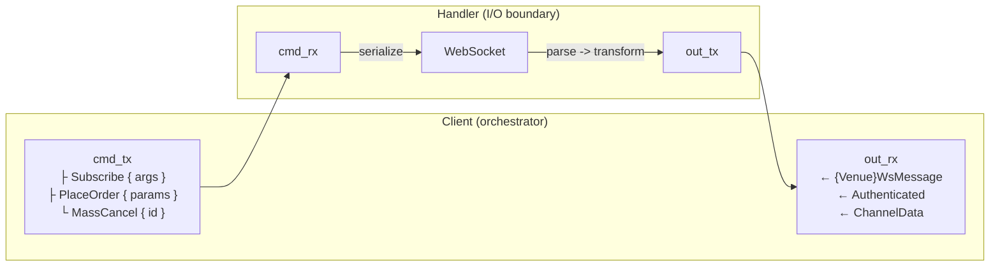

# 适配器 (Adapters)

## 简介

本开发者指南提供了为 NautilusTrader 平台开发集成适配器（adapter）的规范。

适配器连接交易场所（venue）和数据提供商，将它们的原生 API 转换为平台的统一接口和标准化领域模型。

## 适配器的结构

NautilusTrader 适配器遵循分层架构模式，包括：

- **Rust 核心层**，用于网络客户端和性能关键操作。
- **Python 层**，用于将 Rust 客户端集成到平台的数据和执行引擎中。

### Rust 核心层（`crates/adapters/your_adapter/`）

Rust 层负责处理：

- **HTTP 客户端**：原始 API 通信、请求签名、速率限制。
- **WebSocket 客户端**：低延迟流式连接、消息解析。
- **解析**：将场所数据快速转换为 Nautilus 领域模型。
- **Python 绑定**：通过 PyO3 导出，使 Rust 功能可供 Python 使用。

典型的 Rust 结构：

```
crates/adapters/your_adapter/
├── src/
│   ├── common/              # 共享类型和工具
│   │   ├── consts.rs        # 场所常量 / 经纪商 ID
│   │   ├── credential.rs    # API 密钥存储和签名辅助
│   │   ├── enums.rs         # 场所枚举，映射 REST/WS 载荷
│   │   ├── error.rs         # 适配器级别的错误聚合（适用时）
│   │   ├── models.rs        # 共享模型类型
│   │   ├── parse.rs         # 共享解析辅助
│   │   ├── retry.rs         # 重试分类（适用时）
│   │   ├── urls.rs          # 环境和产品感知的基础 URL 解析器
│   │   └── testing.rs       # 跨单元测试复用的测试固件
│   ├── http/                # HTTP 客户端实现
│   │   ├── client.rs        # 带认证的 HTTP 客户端
│   │   ├── error.rs         # HTTP 特定错误类型
│   │   ├── models.rs        # REST 载荷的结构体
│   │   ├── parse.rs         # 响应解析函数
│   │   └── query.rs         # 请求和查询构建器
│   ├── websocket/           # WebSocket 实现
│   │   ├── client.rs        # WebSocket 客户端
│   │   ├── dispatch.rs      # 执行事件分发和订单路由
│   │   ├── enums.rs         # WebSocket 特定枚举
│   │   ├── error.rs         # WebSocket 特定错误类型
│   │   ├── handler.rs       # Feed 处理器（I/O 边界）
│   │   ├── messages.rs      # 帧和消息枚举
│   │   ├── parse.rs         # 消息解析函数
│   │   └── subscription.rs  # 订阅主题辅助（可选）
│   ├── python/              # PyO3 Python 绑定
│   │   ├── enums.rs         # Python 可见的枚举
│   │   ├── http.rs          # Python HTTP 客户端绑定
│   │   ├── urls.rs          # Python URL 辅助
│   │   ├── websocket.rs     # Python WebSocket 客户端绑定
│   │   └── mod.rs           # 模块导出
│   ├── config.rs            # 配置结构体
│   ├── data.rs              # 数据客户端实现
│   ├── execution.rs         # 执行客户端实现
│   ├── factories.rs         # 工厂函数
│   └── lib.rs               # 库入口点
├── tests/                   # 使用 mock 服务器的集成测试
│   ├── data_client.rs       # 数据客户端集成测试
│   ├── exec_client.rs       # 执行客户端集成测试
│   ├── http.rs              # HTTP 客户端集成测试
│   └── websocket.rs         # WebSocket 客户端集成测试
└── test_data/               # 规范的场所载荷
```

### Python 层（`nautilus_trader/adapters/your_adapter`）

Python 层通过以下组件提供集成接口：

1. **工具提供者 (Instrument Provider)**：通过 `InstrumentProvider` 提供金融工具定义。
2. **数据客户端 (Data Client)**：通过 `LiveDataClient` 和 `LiveMarketDataClient` 处理市场数据流和历史数据请求。
3. **执行客户端 (Execution Client)**：通过 `LiveExecutionClient` 管理订单执行。
4. **工厂 (Factories)**：将场所特定数据转换为 Nautilus 领域模型。
5. **配置 (Configuration)**：面向用户的客户端设置配置类。

典型的 Python 结构：

```
nautilus_trader/adapters/your_adapter/
├── config.py     # 配置类
├── constants.py  # 适配器常量
├── data.py       # LiveDataClient/LiveMarketDataClient
├── execution.py  # LiveExecutionClient
├── factories.py  # 金融工具工厂
├── providers.py  # InstrumentProvider
└── __init__.py   # 包初始化
```

## 适配器实现顺序

构建适配器时遵循以下依赖驱动的顺序。每个阶段都建立在前一阶段的基础之上。在实现任何 Python 层之前先实现 Rust 核心。

### 阶段 1：Rust 核心基础设施

构建底层网络和解析基础。

| 步骤 | 组件                       | 描述                                                                                         |
|------|----------------------------|----------------------------------------------------------------------------------------------|
| 1.1  | HTTP 错误类型              | 定义 HTTP 特定的错误枚举，包含可重试/不可重试变体（`http/error.rs`）。                       |
| 1.2  | HTTP 客户端                | 实现凭证、请求签名、速率限制和重试逻辑。                                                     |
| 1.3  | HTTP API 模型              | 定义 REST 端点的请求/响应结构体（`http/models.rs`、`http/query.rs`）。                        |
| 1.4  | HTTP 解析                  | 将场所响应转换为 Nautilus 领域模型（`http/parse.rs`、`common/parse.rs`）。                    |
| 1.5  | WebSocket 错误类型         | 定义 WebSocket 特定的错误枚举（`websocket/error.rs`）。                                      |
| 1.6  | WebSocket 客户端           | 实现连接生命周期、认证、心跳和重连。                                                         |
| 1.7  | WebSocket 消息             | 定义流载荷类型（`websocket/messages.rs`）。                                                  |
| 1.8  | WebSocket 解析             | 将流消息转换为 Nautilus 领域模型（`websocket/parse.rs`）。                                   |
| 1.9  | Python 绑定                | 通过 PyO3 暴露 Rust 功能（`python/mod.rs`）。                                                |

**里程碑**：Rust crate 编译通过，单元测试通过，HTTP/WebSocket 客户端可以认证并流式传输/请求原始数据。

### 阶段 2：金融工具定义

金融工具是基础——数据客户端和执行客户端都依赖于它们。

| 步骤 | 组件                       | 描述                                                                                         |
|------|----------------------------|----------------------------------------------------------------------------------------------|
| 2.1  | 金融工具解析               | 将场所金融工具定义解析为 Nautilus 类型（现货、永续、期货、期权）。                            |
| 2.2  | 工具提供者                 | 实现 `InstrumentProvider` 来加载、过滤和缓存金融工具。                                       |
| 2.3  | 符号映射                   | 处理场所特定的符号格式和 Nautilus `InstrumentId` 转换。                                      |

**里程碑**：`InstrumentProvider.load_all_async()` 返回有效的 Nautilus 金融工具。

### 阶段 3：市场数据

构建数据订阅和历史数据请求。

| 步骤 | 组件                       | 描述                                                                                         |
|------|----------------------------|----------------------------------------------------------------------------------------------|
| 3.1  | 公共 WebSocket 流          | 订阅订单簿、成交、行情和其他公共频道。                                                       |
| 3.2  | 历史数据请求               | 通过 HTTP 获取历史 K 线、成交和订单簿快照。                                                  |
| 3.3  | 数据客户端（Python）       | 实现 `LiveDataClient` 或 `LiveMarketDataClient`，将 Rust 客户端接入数据引擎。                |

**里程碑**：数据客户端连接、订阅金融工具，并向平台发出市场数据。

### 阶段 4：订单执行

构建订单管理和账户状态。

| 步骤 | 组件                       | 描述                                                                                         |
|------|----------------------------|----------------------------------------------------------------------------------------------|
| 4.1  | 私有 WebSocket 流          | 订阅订单更新、成交、持仓和账户余额变动。                                                     |
| 4.2  | 基本订单提交               | 通过 HTTP 或 WebSocket 实现市价单和限价单。                                                  |
| 4.3  | 订单修改/撤销              | 实现订单修改和撤销。                                                                         |
| 4.4  | 执行客户端（Python）       | 实现 `LiveExecutionClient`，将 Rust 客户端接入执行引擎。                                     |
| 4.5  | 执行对账                   | 生成订单、成交和持仓状态报告，用于启动时的对账。                                             |

**里程碑**：执行客户端提交订单、接收成交，并在连接时对账状态。

### 阶段 5：高级功能

根据场所能力扩展覆盖范围。

| 步骤 | 组件                       | 描述                                                                                         |
|------|----------------------------|----------------------------------------------------------------------------------------------|
| 5.1  | 高级订单类型               | 条件单、止损单、止盈单、追踪止损单、冰山单等。                                               |
| 5.2  | 批量操作                   | 批量提交订单、批量撤销、全部撤销。                                                           |
| 5.3  | 场所特定功能               | 期权链、资金费率、强平或其他场所特定数据。                                                   |

### 阶段 6：配置和工厂

将所有组件组装在一起以供生产使用。

| 步骤 | 组件                       | 描述                                                                                         |
|------|----------------------------|----------------------------------------------------------------------------------------------|
| 6.1  | 配置类                     | 创建 `LiveDataClientConfig` 和 `LiveExecClientConfig` 子类。                                 |
| 6.2  | 工厂函数                   | 实现工厂函数以从配置实例化客户端。                                                           |
| 6.3  | 环境变量                   | 支持从环境变量解析凭证。                                                                     |

### 阶段 7：测试和文档

验证集成并编写使用文档。

| 步骤 | 组件                       | 描述                                                                                         |
|------|----------------------------|----------------------------------------------------------------------------------------------|
| 7.1  | Rust 单元测试              | 在 `#[cfg(test)]` 块中测试解析器、签名辅助和业务逻辑。                                      |
| 7.2  | Rust 集成测试              | 在 `tests/` 中使用 mock Axum 服务器测试 HTTP/WebSocket 客户端。                              |
| 7.3  | Python 集成测试            | 在 `tests/integration_tests/adapters/<adapter>/` 中测试数据/执行客户端。                     |
| 7.4  | 示例脚本                   | 提供可运行的示例，演示数据订阅和订单执行。                                                   |

有关详细的测试组织指南，请参阅[测试](#测试)部分。

---

## Rust 适配器模式

### 公共代码（`common/`）

将场所常量、凭证辅助、枚举和可复用解析器归入 `src/common` 下。
诸如 OKX 等适配器将 `consts`、`credential`、`enums` 和 `urls` 等子模块与 `testing` 模块（用于测试固件）放在一起，为横切关注点提供单一存放位置。
当适配器有多个环境或产品类别时，添加专门的 `common::urls` 辅助函数，使 REST/WebSocket 基础 URL 与 Python 层保持同步。

### 符号归一化（`common/symbol.rs`）

当场所使用与 Nautilus `InstrumentId` 不同的符号格式时，将双向转换辅助函数放在 `common/symbol.rs` 中。两个函数构成标准接口：

- `format_instrument_id(venue_symbol, product_type)` 将场所符号字符串转换为 Nautilus `InstrumentId`，按需追加或转换产品类型后缀（例如 `"BTCUSDT"` + `Linear` 变为 `"BTCUSDT-LINEAR.BYBIT"`）。
- `format_venue_symbol(instrument_id)` 去除 Nautilus 后缀以恢复用于 API 调用的场所原生符号。

跨适配器的常见模式：

- **基于后缀的产品类型**：Bybit 追加 `-SPOT`、`-LINEAR`、`-INVERSE`、`-OPTION`。`BybitSymbol` 包装器在构造时验证后缀并归一化为大写。
- **隐式产品映射**：Binance USD-M 期货在 Nautilus 层追加 `-PERP`，而 COIN-M 保留场所现有的 `_PERP` 后缀。
- **大小写归一化**：当场所大小写不敏感时，在输入时转换为大写。
- **`Ustr` 驻留**：将归一化的符号存储为 `Ustr` 以实现零成本比较。

对于原始符号与 `InstrumentId` 一一对应（无需后缀处理）的场所，`common/parse.rs` 中的内联辅助函数就足够了，不需要专门的 `symbol.rs`。

### URL 解析

在 `common/urls.rs` 中定义 URL 常量和解析函数：

```rust
const VENUE_WS_URL: &str = "wss://stream.venue.com/ws";
const VENUE_TESTNET_WS_URL: &str = "wss://testnet-stream.venue.com/ws";

pub const fn get_ws_base_url(testnet: bool) -> &'static str {
    if testnet { VENUE_TESTNET_WS_URL } else { VENUE_WS_URL }
}
```

配置结构体应提供覆盖字段（`base_url_http`、`base_url_ws` 等），未设置时回退到这些默认值。

### 配置（`config.rs`）

在 `src/config.rs` 中暴露类型化的配置结构体，以便 Python 调用方切换场所特定行为（参考 OKX 如何配置演示 URL、重试和频道标志）。
保持默认值最小化，并将 URL 选择委托给 `common::urls` 中的辅助函数。
有关面向用户的设计原理，请参阅[配置](../concepts/configuration.md)概念指南。

#### Builder 与 Default

配置结构体派生 `bon::Builder` 并实现 `Default`。构建器通过 `#[builder(default = value)]` 注解拥有所有默认值。`Default` 实现委托给构建器，使默认值恰好定义在一处：

```rust
#[derive(Clone, Debug, bon::Builder)]
pub struct VenueDataClientConfig {
    pub api_key: Option<String>,
    #[builder(default = 60)]
    pub http_timeout_secs: u64,
    #[builder(default = 3)]
    pub max_retries: u32,
}

impl Default for VenueDataClientConfig {
    fn default() -> Self {
        Self::builder().build()
    }
}
```

这可以防止构建器默认值与 `Default` 输出之间产生漂移。永远不要在 `Default` 实现体中重复默认值。

Bon 总是将 `Option<T>` 字段默认为 `None`。对于罕见情况——`Option<T>` 字段应默认为 `Some(value)`——在 `Default` 实现中覆盖它，并将其他所有内容委托给构建器：

```rust
impl Default for VenueDataClientConfig {
    fn default() -> Self {
        Self {
            poll_interval_secs: Some(60),
            ..Self::builder().build()
        }
    }
}
```

#### 字段类型规则

当字段总是有合理的默认值且下游代码直接消费该值时，使用普通的 `T` 配合 `#[builder(default = value)]`：

```rust
#[builder(default = 60)]
pub http_timeout_secs: u64,
```

当 `None` 携带独特含义（如"功能禁用"、"无界"或"从环境继承"）时，使用 `Option<T>`（无构建器注解）：

```rust
/// Interval in seconds between open order checks.
/// When `None`, open order polling is disabled.
pub open_check_interval_secs: Option<f64>,
```

根据配置自身的语义选择类型，而非下游函数签名。如果在配置层面 `None` 意味着"此功能关闭"，则使用 `Option<T>`。如果字段总是解析为具体值，则使用普通的 `T`，即使下游构造函数仍接受 `Option<T>` 且调用方用 `Some(config.field)` 包装也是如此。

#### Python 构造函数

`py_new` 构造函数对所有可配置字段接受 `Option<T>`（Python 调用方传入 `None` 表示"使用默认值"）。对于普通的 `T` 字段，对照默认值解包：

```rust
fn py_new(http_timeout_secs: Option<u64>) -> Self {
    let defaults = Self::default();
    Self {
        http_timeout_secs: http_timeout_secs.unwrap_or(defaults.http_timeout_secs),
        ..
    }
}
```

对于 `Option<T>` 字段，使用 `.or()` 回退到默认的 option 值。当默认值为 `None` 时，这会保留调用方的 `None`。当默认值为 `Some(value)` 时，如果调用方传入 `None`，这会填入默认值：

```rust
open_check_interval_secs: open_check_interval_secs.or(defaults.open_check_interval_secs),
```

#### 默认值

使用合理的生产默认值：凭证为 `None`（运行时从环境解析）、主网 URL、标准超时。对于 `trader_id` 和 `account_id`，使用占位值如 `TraderId::from("TRADER-001")` 和 `AccountId::from("VENUE-001")`。

`..Default::default()` 模式使示例和测试聚焦于与默认值不同的字段：

```rust
let config = VenueExecClientConfig {
    trader_id,
    account_id,
    environment: VenueEnvironment::Testnet,
    ..Default::default()
};
```

### 错误分类（`common/error.rs`）

对于具有多种客户端类型的适配器，在 `common/error.rs` 中定义一个聚合各组件错误的适配器级别错误枚举：

```rust
#[derive(Debug, thiserror::Error)]
pub enum VenueError {
    #[error("HTTP error: {0}")]
    Http(#[from] VenueHttpError),

    #[error("WebSocket error: {0}")]
    WebSocket(#[from] VenueWsError),

    #[error("Build error: {0}")]
    Build(#[from] VenueBuildError),
}
```

这使得能够在适配器边界进行统一的错误处理，同时为调试保留组件特定的错误细节。

### 重试分类（`common/retry.rs`）

当适配器需要复杂的重试逻辑时，在 `common/retry.rs` 中定义一个重试分类模块，区分可重试、不可重试和致命错误：

```rust
#[derive(Debug, thiserror::Error)]
pub enum VenueError {
    #[error("Retryable error: {source}")]
    Retryable {
        #[source]
        source: VenueRetryableError,
        retry_after: Option<Duration>,
    },

    #[error("Non-retryable error: {source}")]
    NonRetryable {
        #[source]
        source: VenueNonRetryableError,
    },

    #[error("Fatal error: {source}")]
    Fatal {
        #[source]
        source: VenueFatalError,
    },
}
```

包含 `from_http_status()`、`from_rate_limit_headers()`、`is_retryable()`、`is_fatal()` 和 `retry_after()` 等辅助方法，以便在整个适配器中实现一致的错误分类。参考 BitMEX 和 Bybit 适配器的参考实现。

### Python 导出（`python/mod.rs`）

通过 PyO3 模块镜像 Rust 的 API 表面，重新导出客户端、枚举和辅助函数。
当 Rust 中增加新功能时，将其添加到 `python/mod.rs` 中，以使 Python 层保持同步（OKX 适配器是一个很好的参考）。

### Python 绑定（`python/`）

通过 PyO3 将 Rust 功能暴露给 Python。
用 `#[pyclass]` 标记需要 Python 访问的场所特定结构体，并使用 `#[pymethods]` 块和 `#[getter]` 属性实现字段访问。

对于 HTTP 客户端中的 async 方法，使用 `pyo3_async_runtimes::tokio::future_into_py` 将 Rust future 转换为 Python awaitable。
当返回自定义类型的列表时，在构造 Python 列表之前使用 `Py::new(py, item)` 映射每个元素。
在 `python/mod.rs` 中使用 `m.add_class::<YourType>()` 注册所有导出的类和枚举，以便 Python 代码可以使用它们。

遵循其他适配器建立的模式：在 Rust 中为面向 Python 的方法添加 `py_*` 前缀，同时使用 `#[pyo3(name = "method_name")]` 在不带前缀的情况下暴露它们。

从 WebSocket 向 Python 传递金融工具时，使用 `instrument_any_to_pyobject()` 返回用于缓存的 PyO3 类型。
对于反向方向（Python→Rust），在 `cache_instrument()` 方法中使用 `pyobject_to_instrument_any()`。
永远不要直接在 `InstrumentAny` 上调用 `.into_py_any()`，因为它没有实现所需的 trait。

### 类型限定

适配器特定类型（枚举、结构体）和 Nautilus 领域类型不应完全限定。
在模块级别导入它们并使用短名称（例如 `OKXContractType` 而不是 `crate::common::enums::OKXContractType`，`InstrumentId` 而不是 `nautilus_model::identifiers::InstrumentId`）。
这使代码保持简洁和可读。
只对来自 `anyhow` 和 `tokio` 的类型进行完全限定，以避免与其他 crate 中同名类型产生歧义。

### 字符串驻留

对平台重复存储的任何非唯一字符串（场所、符号、金融工具 ID）使用 `ustr::Ustr`，以最小化分配和比较开销。

### 金融工具缓存标准化

所有缓存金融工具的客户端必须实现三个标准命名的方法：`cache_instruments()`（复数，批量替换）、`cache_instrument()`（单数，插入或更新）和 `get_instrument()`（按符号检索）。
WebSocket 客户端将金融工具存储在外层客户端的 `Arc<DashMap<Ustr, InstrumentAny>>` 中，以在克隆之间实现线程安全访问。

### 测试辅助（`common/testing.rs`）

将共享的测试固件和载荷加载器存储在 `src/common/testing.rs` 中，供 HTTP 和 WebSocket 单元测试使用。
这使 `#[cfg(test)]` 辅助函数远离生产模块，并鼓励复用。

### 金融工具状态差异检测（`common/status.rs`）

当数据客户端通过 REST 轮询金融工具状态时，将差异检测逻辑放在 `common/status.rs` 中，而不是内联在数据客户端中。标准函数签名为：

```rust
pub fn diff_and_emit_statuses(
    new_statuses: &AHashMap<InstrumentId, MarketStatusAction>,
    cached_statuses: &mut AHashMap<InstrumentId, MarketStatusAction>,
    subscriptions: Option<&DashSet<InstrumentId>>,
    sender: &tokio::sync::mpsc::UnboundedSender<DataEvent>,
    ts_event: UnixNanos,
    ts_init: UnixNanos,
)
```

该函数将 `new_statuses` 中的每个条目与 `cached_statuses` 进行比较，为 `MarketStatusAction` 发生变化的任何金融工具发出 `InstrumentStatus` 事件。在缓存中存在但在新快照中缺失的金融工具被视为已移除，并发出 `NotAvailableForTrading`。缓存始终反映完整的 API 状态。

将 `subscriptions` 作为 `Some(&set)` 传入以将发出限制为已订阅的金融工具，或传入 `None` 以无条件发出所有变化。数据客户端将缓存存储在 `Arc<RwLock<AHashMap<InstrumentId, MarketStatusAction>>>` 中，并在每个轮询周期调用此函数。

### 工厂模块（`factories.rs`）

复杂的适配器可以定义 `factories.rs` 模块以将场所数据转换为 Nautilus 类型。这集中了原本会分散在 HTTP 和 WebSocket 解析器中的转换逻辑：

```rust
// factories.rs
pub fn create_instrument(
    venue_instrument: &VenueInstrument,
    ts_init: UnixNanos,
) -> anyhow::Result<InstrumentAny> {
    match venue_instrument.instrument_type {
        InstrumentType::Perpetual => parse_perpetual(venue_instrument, ts_init),
        InstrumentType::Future => parse_future(venue_instrument, ts_init),
        InstrumentType::Option => parse_option(venue_instrument, ts_init),
    }
}
```

当同一场所数据结构在多处被解析（HTTP 响应、WebSocket 更新、历史数据）时使用此模式。

### 连接生命周期（`connect`）

数据客户端和执行客户端在 `connect()` 期间都遵循严格的初始化顺序，以防止与对账和策略启动产生竞态。平台在运行对账或启动策略之前等待所有客户端发出已连接信号，因此所有初始化都必须在 `connect()` 内完成。

#### 数据事件发出

数据客户端通过在构造时获得的无界通道向平台发出事件：

```rust
let data_sender = get_data_event_sender();
```

`DataEvent` 枚举携带客户端产生的所有数据类型：

| 变体                          | 用途                                                  |
|-------------------------------|-------------------------------------------------------|
| `DataEvent::Instrument`       | 引导和更新期间的金融工具定义。                        |
| `DataEvent::InstrumentStatus` | 来自轮询或 WS 流的市场状态变化。                      |
| `DataEvent::Data`             | 市场数据（成交、报价、订单簿增量、K 线）。            |
| `DataEvent::Response`         | 对历史数据请求的响应。                                |
| `DataEvent::FundingRate`      | 衍生品的资金费率更新。                                |

使用 `self.data_sender.send(DataEvent::Instrument(instrument))` 发送事件。发送失败时记录警告，但不要传播错误，因为接收方关闭意味着系统正在关闭。为从异步工作中发出数据的衍生任务克隆 sender。

#### 数据客户端

1. **通过 REST 获取金融工具** - 调用 `bootstrap_instruments()` 或等效方法。
2. **本地缓存** - 填充客户端的内部金融工具映射和 HTTP 客户端缓存。
3. **发出到数据引擎** - 通过 `data_sender` 将每个金融工具作为 `DataEvent::Instrument` 发送。这些事件在启动期间排队，并在对账运行之前处理。
4. **缓存到 WebSocket** - 调用 `ws.cache_instruments()` 以便处理器可以解析消息。
5. **连接 WebSocket** - 建立流式连接。

```rust
async fn connect(&mut self) -> anyhow::Result<()> {
    let instruments = self.bootstrap_instruments().await?;
    ws.cache_instruments(instruments);
    ws.connect().await?;
    ws.wait_until_active(10.0).await?;
    // ...
}
```

#### 执行客户端

1. **初始化金融工具** - 调用 `ensure_instruments_initialized_async()`，它检查 `self.core.instruments_initialized()`，如果金融工具已缓存则提前返回。否则它通过 REST 获取金融工具，并将其缓存到 HTTP 客户端、WebSocket 客户端和任何广播器客户端。
2. **连接 WebSocket** - 建立私有流式连接。
3. **订阅频道** - 订单、成交、持仓、钱包/保证金。
4. **启动 WebSocket 流处理器** - 开始处理传入消息。
5. **获取账户状态** - 调用 `refresh_account_state()`，它通过 REST 请求余额和保证金，构建 `AccountState`，并通过 `ExecutionEventEmitter` 发出。
6. **等待账户注册** - 调用 `await_account_registered(timeout_secs)`，它以 10ms 间隔轮询 `self.core.cache().account(&account_id)`，直到账户出现或超时。此步骤阻塞 connect，以便投资组合可以在对账期间处理订单。
7. **发出已连接信号** - 调用 `self.core.set_connected()`。

```rust
async fn connect(&mut self) -> anyhow::Result<()> {
    self.ensure_instruments_initialized_async().await?;

    self.ws_client.connect().await?;
    self.ws_client.wait_until_active(10.0).await?;
    // ... subscribe channels, start stream ...

    self.refresh_account_state().await?;
    self.await_account_registered(30.0).await?;

    self.core.set_connected();
    Ok(())
}
```

#### 账户状态发出

`ExecutionEventEmitter` 提供两个发出账户状态的方法：

- `emit_account_state(balances, margins, reported, ts_event)` 使用内部 `OrderEventFactory` 从原始参数构建 `AccountState`，然后分发它。当适配器拥有单独的余额和保证金值需要组合时使用此方法。
- `send_account_state(state)` 分发一个预先构建的 `AccountState`。当适配器已通过解析 HTTP 或 WebSocket 载荷获得一个完全构建的状态时使用此方法。

## HTTP 客户端模式

适配器使用两层 HTTP 客户端架构：用于底层 API 操作的原始客户端和用于高层逻辑的领域客户端。这种拆分还支持 Python 绑定所需的高效克隆。

### 客户端结构

该架构由两个互补的客户端组成：

1. **原始客户端**（`MyRawHttpClient`）- 匹配场所端点的底层 API 方法。
2. **领域客户端**（`MyHttpClient`）- 使用 Nautilus 领域类型的高层方法。

```rust
use std::sync::Arc;
use nautilus_network::http::HttpClient;

// 原始 HTTP 客户端 - 匹配场所端点的底层 API 方法
pub struct MyRawHttpClient {
    base_url: String,
    client: HttpClient,  // 使用 nautilus_network::http::HttpClient，而非直接使用 reqwest
    credential: Option<Credential>,
    retry_manager: RetryManager<MyHttpError>,
    cancellation_token: CancellationToken,
}

// 领域 HTTP 客户端 - 用 Arc 包装原始客户端，提供高层 API
pub struct MyHttpClient {
    pub(crate) inner: Arc<MyRawHttpClient>,
    // 额外的领域特定状态（例如金融工具缓存）
    instruments: DashMap<InstrumentId, InstrumentAny>,
}
```

**要点**：

- **原始客户端**（`MyRawHttpClient`）包含尽可能匹配场所端点命名的底层 HTTP 方法（例如 `get_instruments`、`get_balance`、`place_order`）。这些方法接受场所特定的查询对象并返回场所特定的响应类型。
- **领域客户端**（`MyHttpClient`）将原始客户端包装在 `Arc` 中以实现高效克隆（Python 绑定所需）。它提供接受 Nautilus 领域类型（例如 `InstrumentId`、`ClientOrderId`）并返回领域对象的高层方法。它还可以缓存金融工具或其他场所元数据。
- 使用 `nautilus_network::http::HttpClient` 而不是直接使用 `reqwest::Client`，以获得速率限制、重试逻辑和一致的错误处理。
- 两个客户端都暴露给 Python，但领域客户端是主要接口。

### 解析函数

解析函数将场所特定的数据结构转换为 Nautilus 领域对象。将它们放在 `common/parse.rs` 中用于横切转换（金融工具、成交、K 线），或放在 `http/parse.rs` 中用于 REST 特定的转换。每个解析器接受场所数据加上下文（账户 ID、时间戳、金融工具引用），并返回包装在 `Result` 中的 Nautilus 领域类型。

**标准模式：**

- 使用 `.parse::<f64>()` 和 `anyhow::Context` 处理字符串到数值的转换，并提供适当的错误上下文。
- 在解析可选字段之前检查空字符串——场所经常返回 `""` 而不是省略字段。
- 使用 `match` 语句将场所枚举显式映射到 Nautilus 枚举，而不是实现可能隐藏映射错误的自动转换。
- 当构造 Nautilus 类型（数量、价格）需要精度或其他元数据时，接受金融工具引用。
- 使用描述性的函数名称：`parse_position_status_report`、`parse_order_status_report`、`parse_trade_tick`。

将解析辅助函数（`parse_price_with_precision`、`parse_timestamp`）作为私有函数放在同一模块中，当它们在多个解析器间复用时。

### 时间戳约定

Nautilus 使用 `UnixNanos`（自纪元起的纳秒数）。大多数场所传递 `ms`（毫秒）。在解析器边界使用 `nautilus_core::datetime::millis_to_nanos` 进行转换；在结构体字段上记录线缆单位。`ts_event` 是转换后的场所时间戳；`ts_init` 是 `clock.get_time_ns()`。对于没有场所时间戳的记录（金融工具），两者都使用 `clock.get_time_ns()`。

### 方法命名和组织

原始客户端用场所特定的参数和响应类型镜像场所端点。领域客户端包装它并暴露接受 Nautilus 领域类型的高层方法。

**命名约定：**

- **原始客户端方法**：尽可能匹配场所端点命名（例如 `get_instruments`、`get_balance`、`place_order`）。这些方法是原始客户端内部的，接受场所特定类型（构建器、JSON 值）。
- **领域客户端方法**：基于操作语义命名（例如 `request_instruments`、`submit_order`、`cancel_order`）。这些是暴露给 Python 的方法，接受 Nautilus 领域对象（InstrumentId、ClientOrderId、OrderSide 等）。

**领域方法流程：**

领域方法遵循三步模式：从 Nautilus 类型构建场所特定参数，调用相应的原始客户端方法，然后解析响应。对于返回领域对象的端点（持仓、订单、成交），调用 `common/parse` 中的解析函数。对于返回原始场所数据的端点（费率、余额），直接从响应信封中提取结果。以 `request_*` 为前缀的方法表示它们返回领域数据，而 `submit_*`、`cancel_*` 或 `modify_*` 等方法执行操作并返回确认。

领域客户端将原始客户端包装在 `Arc` 中，以实现 Python 绑定所需的高效克隆。

### 查询参数构建器

使用 `derive_builder` crate，配合适当的默认值和人性化的 Option 处理：

```rust
use derive_builder::Builder;

#[derive(Clone, Debug, Deserialize, Serialize, Builder)]
#[serde(rename_all = "camelCase")]
#[builder(setter(into, strip_option), default)]
pub struct InstrumentsInfoParams {
    pub category: ProductType,
    #[serde(skip_serializing_if = "Option::is_none")]
    pub symbol: Option<String>,
    #[serde(skip_serializing_if = "Option::is_none")]
    pub limit: Option<u32>,
}

impl Default for InstrumentsInfoParams {
    fn default() -> Self {
        Self {
            category: ProductType::Linear,
            symbol: None,
            limit: None,
        }
    }
}
```

**关键属性：**

- `#[builder(setter(into, strip_option), default)]` - 启用简洁的 API：`.symbol("BTCUSDT")` 而不是 `.symbol(Some("BTCUSDT".to_string()))`。
- `#[serde(skip_serializing_if = "Option::is_none")]` - 从查询字符串中省略可选字段。
- 始终为构建器参数实现 `Default`。

### 请求签名和认证

将签名逻辑保存在 `common/credential.rs` 下的 `Credential` 结构体中：

- 使用 `Ustr` 存储 API 密钥以实现高效比较，密钥使用 `Box<[u8]>` 配合 `#[zeroize]` 存储。
- 实现 `sign()` 和 `sign_bytes()` 方法来计算 HMAC-SHA256 签名。
- 将凭证传递给原始 HTTP 客户端；领域客户端通过内部客户端委托签名。

对于 WebSocket 认证，处理器使用相同的 `Credential::sign()` 方法构造登录消息，但使用 WebSocket 特定的时间戳格式。

### 凭证模块结构

每个适配器的 `common/credential.rs` 必须提供两样东西：

1. **`credential_env_vars()` 自由函数**：以元组形式返回环境变量名称。
2. **`Credential::resolve()` 方法**：使用 `nautilus_core::env` 中的 `resolve_env_var_pair`，从配置值或环境变量解析凭证。

配置结构体是 DTO，不得包含凭证解析逻辑。所有解析都属于 `credential.rs`。

**标准布局：**

```rust
use nautilus_core::env::resolve_env_var_pair;

/// Returns the environment variable names for API credentials.
pub fn credential_env_vars(is_testnet: bool) -> (&'static str, &'static str) {
    if is_testnet {
        ("{VENUE}_TESTNET_API_KEY", "{VENUE}_TESTNET_API_SECRET")
    } else {
        ("{VENUE}_API_KEY", "{VENUE}_API_SECRET")
    }
}

impl Credential {
    /// Resolves credentials from provided values or environment variables.
    pub fn resolve(
        api_key: Option<String>,
        api_secret: Option<String>,
        is_testnet: bool,
    ) -> Option<Self> {
        let (key_var, secret_var) = credential_env_vars(is_testnet);
        let (k, s) = resolve_env_var_pair(api_key, api_secret, key_var, secret_var)?;
        Some(Self::new(k, s))
    }
}
```

### 环境变量约定

适配器在未直接提供 API 凭证时从环境变量加载，避免硬编码密钥。

**命名约定：**

| 环境         | API Key 变量              | API Secret 变量         |
|--------------|---------------------------|-------------------------|
| 主网/实盘    | `{VENUE}_API_KEY`         | `{VENUE}_API_SECRET`    |
| 测试网       | `{VENUE}_TESTNET_API_KEY` | `{VENUE}_TESTNET_API_SECRET` |
| 演示         | `{VENUE}_DEMO_API_KEY`    | `{VENUE}_DEMO_API_SECRET` |

某些场所需要额外的凭证：

- OKX：`OKX_API_PASSPHRASE`

**关键原则：**

- 环境变量名称必须集中在 `credential_env_vars()` 中，永远不要在各文件中以字符串字面量重复。
- 环境变量解析应在 Rust 核心代码中进行，而不是在 Python 绑定中。
- 对可选凭证使用 `get_or_env_var_opt`（缺失时返回 `None`）。
- 在需要凭证时使用 `get_or_env_var`（缺失则返回错误）。
- 无效凭证（例如格式错误的密钥）必须快速失败并返回错误，永远不要悄悄降级到未认证模式。

### 错误处理和重试逻辑

使用 `nautilus_network` 中的 `RetryManager` 实现一致的重试行为。

### 速率限制

通过 `HttpClient` 使用 `LazyLock<Quota>` 静态变量配置速率限制。

**命名约定：**

- REST 配额：`{VENUE}_REST_QUOTA`（例如 `OKX_REST_QUOTA`、`BYBIT_REST_QUOTA`）
- WebSocket 配额：`{VENUE}_WS_{OPERATION}_QUOTA`（例如 `OKX_WS_CONNECTION_QUOTA`、`OKX_WS_ORDER_QUOTA`）
- 速率限制键：`{VENUE}_RATE_LIMIT_KEY_{OPERATION}`（例如 `OKX_RATE_LIMIT_KEY_SUBSCRIPTION`、`OKX_RATE_LIMIT_KEY_ORDER`）

**WebSocket 标准速率限制键：**

| 键                              | 操作                             |
|---------------------------------|----------------------------------|
| `*_RATE_LIMIT_KEY_SUBSCRIPTION` | 订阅、取消订阅、登录。           |
| `*_RATE_LIMIT_KEY_ORDER`        | 下单（普通单和算法单）。         |
| `*_RATE_LIMIT_KEY_CANCEL`       | 撤单、批量撤单。                 |
| `*_RATE_LIMIT_KEY_AMEND`        | 修改订单。                       |

**示例：**

```rust
pub static OKX_REST_QUOTA: LazyLock<Quota> =
    LazyLock::new(|| Quota::per_second(NonZeroU32::new(250).unwrap()));

pub static OKX_WS_SUBSCRIPTION_QUOTA: LazyLock<Quota> =
    LazyLock::new(|| Quota::per_hour(NonZeroU32::new(480).unwrap()));

pub const OKX_RATE_LIMIT_KEY_ORDER: &str = "order";
```

在发送 WebSocket 消息时传递速率限制键以执行每操作的配额：

```rust
self.send_with_retry(payload, Some(vec![OKX_RATE_LIMIT_KEY_ORDER.to_string()])).await
```

## WebSocket 客户端模式

WebSocket 客户端处理实时流数据。它们管理连接状态、认证、订阅和重连逻辑。

### 客户端结构

WebSocket 适配器使用**两层架构**来分离 Python 可访问的状态和高性能异步 I/O：

#### 连接状态跟踪

使用 `Arc<ArcSwap<AtomicU8>>` 跟踪连接状态，以在所有克隆间提供无锁、无竞态的可见性：

```rust
use arc_swap::ArcSwap;

pub struct MyWebSocketClient {
    connection_mode: Arc<ArcSwap<AtomicU8>>,  // 共享连接模式（无锁）
    signal: Arc<AtomicBool>,                   // 优雅关闭的取消信号
    // ...
}
```

**模式分解：**

- **外层 `Arc`**：在所有克隆间共享（Python 绑定在异步操作前克隆客户端）。
- **`ArcSwap`**：通过 `.store()` 启用原子指针替换，而无需替换外层 Arc。
- **内层 `Arc<AtomicU8>`**：来自 `WebSocketClient::connection_mode_atomic()` 的实际连接状态。

使用占位原子值（`ConnectionMode::Closed`）初始化，然后在 `connect()` 中调用 `.store(client.connection_mode_atomic())` 以原子方式交换到底层客户端的状态。所有克隆通过 `is_active()` 中的无锁 `.load()` 调用即时看到更新。

底层 `WebSocketClient` 在重连完成时发送 `RECONNECTED` 哨兵消息，触发处理器中的重新订阅逻辑。

**外层客户端**（`{Venue}WebSocketClient`）：

- 编排连接生命周期、认证、订阅。
- 使用 `Arc<DashMap<K, V>>` 维护 Python 访问的状态。
- 跟踪订阅状态以支持重连逻辑。
- 存储金融工具缓存以在重连时重放。
- 通过 `cmd_tx` 通道向处理器发送命令。
- 通过 `out_rx` 通道接收场所事件。

**内层处理器**（`{Venue}WsFeedHandler`）：

- 在专用的 Tokio 任务中运行，作为无状态 I/O 边界。
- 独占拥有 `WebSocketClient`（无需 `RwLock`）。
- 处理来自 `cmd_rx` 的命令 → 序列化为 JSON → 通过 WebSocket 发送。
- 接收原始 WebSocket 消息 → 反序列化为 `{Venue}WsFrame` → 转换为 `{Venue}WsMessage` → 通过 `out_tx` 发出。
- 使用 `AHashMap<K, V>` 拥有待处理请求状态（单线程，无锁）。
- 使用 `VecDeque<{Venue}WsMessage>` 缓冲单次帧解析产生的多条消息。

某些场所为市场数据和订单管理暴露独立的 WebSocket 端点（不同的 URL、认证流程或消息协议）。在这种情况下，拆分为 `websocket/data/` 和 `websocket/orders/` 子目录下的两对客户端+处理器，每对都遵循相同的两层模式。将它们命名为 `{Venue}MdWebSocketClient` / `{Venue}MdWsFeedHandler` 和 `{Venue}OrdersWebSocketClient` / `{Venue}OrdersWsFeedHandler`。

**通信模式：**



**关键原则：**

- **热路径无共享锁**：处理器拥有 `WebSocketClient`，客户端通过无锁 mpsc 通道发送命令。
- **所有发送使用命令模式**：订阅、订单、撤销都通过 `HandlerCommand` 枚举路由。
- **状态使用事件模式**：处理器发出 `{Venue}WsMessage` 事件（包括 `Authenticated`），客户端从事件维护状态。
- **待处理状态所有权**：处理器拥有 `AHashMap` 用于匹配响应（层间无 `Arc<DashMap>`）。
- **消息缓冲**：处理器使用 `VecDeque<{Venue}WsMessage>` 缓冲产生多条输出消息的帧。`next()` 方法在轮询通道之前先排空队列。
- **Python 约束**：客户端仅对 Python 可能查询的状态使用 `Arc<DashMap>`；处理器对内部匹配使用 `AHashMap`。

#### 处理器初始化握手（`SetClient`）

处理器在构造时并不拥有它的 `WebSocketClient`。`WebSocketClient` 不是 `Clone`，且难以移动到已经派生的任务构造函数中；几个适配器通过命令通道使用延迟移交。Lighter 使用更严格的顺序：

1. 外层客户端调用 `WebSocketClient::connect(...)` 并获得活动客户端。
2. 外层客户端创建本地的 `cmd_tx`/`cmd_rx` 和 `out_tx`/`out_rx` 通道。在 `client` 被移动之前，将连接模式原子值捕获到一个本地变量中。
3. 外层客户端首先在本地 `cmd_tx` 上发送 `HandlerCommand::SetClient(client)`，随后是任何缓存重放命令（例如 `InitializeInstruments`）。
4. 只有在 `SetClient` 排队之后，外层客户端才发布新的命令通道（交换 `self.cmd_tx`）并存储捕获的连接模式（将 `is_active()` 转换为 true）。以相反的顺序执行会产生竞态：观察到 `is_active()` 的克隆可能在 SetClient 落地之前向已发布的 `cmd_tx` 入队一个 Subscribe，而处理器会丢弃它，因为 `inner == None`。
5. 外层客户端用 `cmd_rx` 派生处理器任务。处理器构造函数接受初始化为 `None` 的 `inner: Option<WebSocketClient>`；它处理的第一个命令是 `SetClient`，它将客户端移动到 `self.inner`。
6. 克隆在步骤 4 之后入队的任何 subscribe/order 命令在 `cmd_rx` 中落在 `SetClient` 和 `InitializeInstruments` 之后，因此它们以队列顺序到达完全接线的处理器。

```rust
pub enum HandlerCommand {
    SetClient(WebSocketClient),
    Disconnect,
    Subscribe { /* ... */ },
    // ... other commands
}

pub(super) struct {Venue}WsFeedHandler {
    inner: Option<WebSocketClient>,  // None until SetClient
    cmd_rx: tokio::sync::mpsc::UnboundedReceiver<HandlerCommand>,
    // ...
}

// In the cmd_rx match arm:
HandlerCommand::SetClient(client) => {
    self.inner = Some(client);
}
```

BitMEX、OKX、Bybit、Hyperliquid 和 Lighter 都使用 `SetClient` 将已连接的 `WebSocketClient` 移交给处理器。Lighter 在发布新的 `cmd_tx` 或标记连接为活动之前先入队 `SetClient`；较旧的适配器可能先发布命令通道。

### 认证

认证状态通过事件管理：

- 处理器处理 `Login` 响应 → **立即返回** `{Venue}WsMessage::Authenticated`。
- 客户端接收事件 → 更新本地认证状态 → 继续订阅。
- `AuthTracker`（来自 `nautilus_network::websocket::auth`）跨线程跟踪认证状态。

来自 `nautilus_network` 的 `AuthTracker` 结构体提供线程安全的认证状态：

```rust
pub struct AuthTracker {
    tx: Arc<Mutex<Option<AuthResultSender>>>,
    authenticated: Arc<AtomicBool>,
}
```

`AuthTracker` 内部基于 `Arc`，因此克隆共享状态。客户端和处理器都存储 `auth_tracker: AuthTracker`，并接收同一实例的 `.clone()`。该跟踪器暴露四方法生命周期：`begin()` 启动一次尝试并返回一个一次性接收器，`succeed()` 设置已认证标志并通知接收器，`fail(message)` 清除标志并附带错误，`invalidate()` 在断开连接时清除标志。下游消费者通过内部 `AtomicBool` 调用 `is_authenticated()` 进行无锁读取。

**注意**：`Authenticated` 消息在客户端的 spawn 循环中被消费用于重连流协调，不会转发给下游消费者（数据/执行客户端）。下游消费者可以在需要时通过 `AuthTracker` 查询认证状态。执行客户端的 `Authenticated` 处理器仅在 debug 级别记录日志，没有关键逻辑依赖此事件。

#### 认证令牌轮换（单端点混合信任适配器）

某些场所通过单一 WebSocket 端点运行公共市场数据和已认证账户频道，由附加到每个订阅请求的短期 bearer 令牌门控。Lighter 是典型示例：令牌是对 `(deadline, account_index, api_key_index)` 的 Schnorr 签名，场所强制的硬上限为 8 小时（`LIGHTER_AUTH_TOKEN_MAX_TTL`）。`build_auth_token_for(...)` 当前发出一个 7 小时的令牌，执行客户端每 6 小时刷新一次账户频道订阅。

这与逐消息签名模式（Hyperliquid）和会话登录模式（BitMEX、Bybit）形成对比；后两者都不需要会话内令牌轮换。

**令牌生命周期**

外层客户端拥有调度；处理器拥有线缆发送。流程如下：

1. **在账户订阅前铸造**：执行客户端在 WebSocket 达到活动状态后调用 `build_auth_token_for(...)`，然后将该令牌用于初始账户频道订阅。
2. **在订阅时分发**：`subscribe_account(...)` 将令牌附加到 `HandlerCommand::Subscribe`。WebSocket 客户端将确切的 `(channel, auth)` 对存储在 `subscription_args` 中以用于重连重放。
3. **调度刷新**：在执行 WebSocket 消费者启动后，执行客户端在 `get_runtime()` 上派生一个刷新任务。该任务睡眠 `AUTH_TOKEN_REFRESH_INTERVAL`（6 小时），铸造一个新令牌，并为每个账户频道重新发出 `subscribe_account(...)`。
4. **断开时停止**：刷新任务观察执行客户端的取消令牌，并在客户端停止或断开时退出。

**调度存放位置**

将轮换计时器放在外层客户端中，而不是处理器中。执行客户端拥有凭证并决定何时铸造；处理器仍然是发送所提供令牌、自身不签名任何内容的 I/O 边界。

```rust
fn spawn_auth_token_refresh(&self, credential: Credential) {
    let ws_client = self.ws_client.clone();
    let cancellation_token = self.cancellation_token.clone();
    let account_index = credential.account_index();
    let channels = [
        LighterWsChannel::AccountAllOrders(account_index),
        LighterWsChannel::AccountAllTrades(account_index),
        LighterWsChannel::AccountAllPositions(account_index),
        LighterWsChannel::AccountAllAssets(account_index),
    ];

    get_runtime().spawn(async move {
        loop {
            tokio::select! {
                () = cancellation_token.cancelled() => break,
                () = tokio::time::sleep(AUTH_TOKEN_REFRESH_INTERVAL) => {
                    if let Ok(token) = build_auth_token_for(&credential) {
                        for channel in channels.clone() {
                            let _ = ws_client
                                .subscribe_account(channel, token.clone())
                                .await;
                        }
                    }
                }
            }
        }
    });
}
```

**重连交互**

在 `Reconnected` 时，Lighter WebSocket 客户端通过 `HandlerCommand::Subscribe` 重放被跟踪的 `subscription_args`。它不会在重连时铸造新令牌；新的账户频道令牌来自调度的执行客户端刷新任务。

**故障处理**

订阅发送失败会调用 `mark_failure(topic)`，以便重连重放使该主题保持待处理。Lighter 目前未实现会话中场所拒绝时的立即认证令牌刷新路径。

### 订阅管理

#### 共享 `SubscriptionState` 模式

来自 `nautilus_network::websocket` 的 `SubscriptionState` 结构体在客户端和处理器之间共享，内部使用 `Arc<DashMap<>>` 实现线程安全访问：

- **`SubscriptionState` 通过 `Arc` 共享**：客户端和处理器都接收同一实例的 `.clone()`（Arc 指针的浅克隆）。
- **职责分离**：客户端跟踪用户意图（`mark_subscribe`、`mark_unsubscribe`），处理器跟踪服务器确认（`confirm_subscribe`、`confirm_unsubscribe`、`mark_failure`）。
- **为什么双方都需要它**：单一数据源具有无锁的并发访问，无同步开销。

#### 订阅生命周期

一个**订阅**代表处于两种状态之一的任何主题：

| 状态          | 描述 |
|---------------|------|
| **待确认**    | 订阅请求已发送到场所，等待确认。 |
| **已确认**    | 场所已确认订阅并正在主动流式传输数据。 |

状态转换遵循以下生命周期：

| 触发器            | 调用的方法              | 原状态     | 新状态     | 备注 |
|-------------------|------------------------|------------|-----------|------|
| 用户订阅          | `mark_subscribe()`      | —          | 待确认     | 主题添加到待确认集合。 |
| 场所确认          | `confirm()`             | 待确认     | 已确认     | 从待确认移到已确认。 |
| 场所拒绝          | `mark_failure()`        | 待确认     | 待确认     | 保持待确认以在重连时重试。 |
| 用户取消订阅      | `mark_unsubscribe()`    | 已确认     | 待确认     | 临时待确认直到收到确认。 |
| 取消订阅确认      | `clear_pending()`       | 待确认     | 已移除     | 主题完全移除。 |

**关键原则**：

- `subscription_count()` 仅报告**已确认的订阅**，不包括待确认的。
- 失败的订阅保持待确认状态，在重连时自动重试。
- 已确认和待确认的订阅在重连后都会恢复。
- 取消订阅操作必须检查确认消息中的 `op` 字段，以避免重新确认主题。

#### 确认时机

处理器负责将主题从待确认转换为已确认。已建立两种模式，根据线缆格式提供的内容按场所选择：

**显式确认（场所支持时优先）**：由 BitMEX、OKX、Bybit 和 Lighter 使用。场所发送专门的订阅/取消订阅确认帧（通常为 `{ "event": "subscribe", "arg": ..., "code": ... }` 或类似形式）。处理器匹配该帧，从其 `arg`/`req_id` 字段派生主题，并分发：

- 成功 → `confirm_subscribe(topic)` / `confirm_unsubscribe(topic)`。
- 失败 → `mark_failure(topic)`（保持待确认；在重连时重试）。
- 取消订阅失败应被视为仍处于订阅状态并重新确认。

将确认处理保持在从线缆帧 match 分支调用的单个分支或函数中，以便生命周期可在一处审计。

**首帧隐式确认（回退）**：由 Lighter 作为后备使用，以及任何省略订阅确认或确认不可靠的场所使用。处理器在该主题的第一个入站数据帧到达时调用 `confirm_subscribe(topic)`。主题从帧的 `channel` 字段恢复。当显式确认被丢弃或在第一个数据帧之后到达时，这也兼作后备。

```rust
// Inside the data-frame match arm:
let topic = frame_topic(&frame);
self.subscriptions.confirm_subscribe(&topic);
// ... then parse and emit
```

两种模式可以共存：有时发送确认有时不发送的场所可以对确认帧使用显式处理器，对数据帧使用隐式后备；`confirm_subscribe()` 是幂等的。

失败路径必须调用 `mark_failure(topic)`（而不是悄悄丢弃订阅）。`mark_failure()` 使主题保持待确认，以便重连重放恢复它。

#### 主题格式模式

适配器使用场所特定的分隔符来构造订阅主题：

| 适配器       | 分隔符    | 示例                   | 模式                         |
|--------------|-----------|------------------------|------------------------------|
| **BitMEX**   | `:`       | `trade:XBTUSD`         | `{channel}:{symbol}`         |
| **OKX**      | `:`       | `trades:BTC-USDT-SWAP` | `{channel}:{symbol}`         |
| **Bybit**    | `.`       | `orderbook.50.BTCUSDT` | `{channel}.{depth}.{symbol}` |
| **Lighter**  | `:` / `/` | `order_book:0`         | `{channel}:{market_index}`   |

使用适当分隔符的 `split_once()` 解析主题以提取频道和符号组件。

##### 入站与出站分隔符不对称

某些场所对出站订阅载荷和入站帧 `channel` 字段使用不同的分隔符。Lighter 是典型示例：出站订阅使用 `order_book/0`（斜杠），入站帧携带 `"channel": "order_book:0"`（冒号）。

已建立的解决方法：

- 为 `SubscriptionState::new(delimiter)` 选择入站分隔符，以便处理器可以直接针对每个接收帧的 `channel` 字段确认订阅。
- 在场所的频道/订阅枚举上暴露两个方法：
  - `subscription_channel()` 返回出站格式的载荷（在序列化订阅/取消订阅请求时使用）。
  - `topic_key()` 返回规范主题键（匹配入站形式），用于键控 `SubscriptionState` 和重连重放映射。

这在整个处理器中保持单一规范主题标识，同时在发送时尊重场所的线缆格式。

### 重连逻辑

在重连时，恢复认证和订阅：

1. **跟踪订阅**：在集合中保留原始订阅参数（例如 `Arc<DashMap>`），以避免将主题解析回参数。

2. **重连流程**：
   - 从处理器接收 `{Venue}WsMessage::Reconnected`。
   - 如果已认证：重新认证并等待确认。
   - 通过处理器命令恢复所有已跟踪的订阅。
   - 当下游消费者需要重置本地状态时，通过 `out_tx` 将 `{Venue}WsMessage::Reconnected` 转发给它们。BitMEX、OKX、Bybit 和 Lighter 在启动恢复后转发此事件；Hyperliquid 目前在重新订阅后于 WebSocket 客户端内消费它。

对于具有 `Authenticated` 事件的适配器，客户端 spawn 循环可以消费它用于重连协调，而不是转发它。下游消费者在需要认证状态时可以查询 `AuthTracker`。

**保留订阅参数：**

将原始订阅参数存储在单独的集合中，以实现确定性的重连重放，而无需将主题解析回参数：

```rust
pub struct MyWebSocketClient {
    subscription_state: Arc<SubscriptionState>,
    subscription_args: Arc<DashMap<String, SubscriptionArgs>>,  // topic -> original args
    // ...
}

impl MyWebSocketClient {
    async fn subscribe(&self, args: SubscriptionArgs) -> Result<(), Error> {
        let topic = args.to_topic();
        self.subscription_state.mark_subscribe(&topic);
        self.subscription_args.insert(topic.clone(), args.clone());
        self.send_cmd(HandlerCommand::Subscribe(args)).await
    }

    async fn unsubscribe(&self, topic: &str) -> Result<(), Error> {
        self.subscription_state.mark_unsubscribe(topic);
        self.subscription_args.remove(topic);
        self.send_cmd(HandlerCommand::Unsubscribe(topic.to_string())).await
    }

    async fn restore_subscriptions(&self) {
        for entry in self.subscription_args.iter() {
            let _ = self.send_cmd(HandlerCommand::Subscribe(entry.value().clone())).await;
        }
    }
}
```

这避免了复杂的主题解析，并确保订阅完全按最初请求的方式重放。

### Ping/Pong 处理

同时支持 WebSocket 控制帧 ping 和应用级文本 ping：

- **控制帧 ping**：由 `WebSocketClient` 通过 `PingHandler` 回调自动处理。
- **文本 ping**：某些场所（例如 OKX）使用 `"ping"`/`"pong"` 文本消息。在 `WebSocketConfig` 中配置 `heartbeat_msg: Some(TEXT_PING.to_string())`，并在处理器中对收到的 `TEXT_PING` 回复 `TEXT_PONG`。

处理器应在消息处理循环的早期检查 ping 消息并立即响应，以维护连接健康。

### 断开连接生命周期（`close`）

`close()` 方法遵循三步关闭序列：信号、命令、等待。

```rust
impl MyWebSocketClient {
    pub async fn close(&mut self) -> Result<(), MyWsError> {
        tracing::debug!("Starting close process");

        // 1. Send disconnect command so handler can clean up gracefully
        if let Err(e) = self.cmd_tx.read().await.send(HandlerCommand::Disconnect) {
            tracing::warn!("Failed to send disconnect command to handler: {e}");
        }

        // 2. Set stop signal so handler loop exits after processing disconnect
        self.signal.store(true, Ordering::Release);

        // 3. Await task handle with timeout, abort if stuck
        if let Some(task_handle) = self.task_handle.take() {
            match Arc::try_unwrap(task_handle) {
                Ok(handle) => {
                    let abort_handle = handle.abort_handle();
                    match tokio::time::timeout(Duration::from_secs(2), handle).await {
                        Ok(Ok(())) => tracing::debug!("Handler task completed"),
                        Ok(Err(e)) => tracing::error!("Handler task error: {e:?}"),
                        Err(_) => {
                            tracing::warn!("Timeout waiting for handler task, aborting");
                            abort_handle.abort();
                        }
                    }
                }
                Err(arc_handle) => {
                    tracing::debug!("Cannot unwrap task handle, aborting");
                    arc_handle.abort();
                }
            }
        }

        Ok(())
    }
}
```

**要点：**

- 在设置停止信号之前发送 `Disconnect`，以便处理器在退出前处理它。
- 返回 `Result<(), {Venue}WsError>`，以便调用方可以处理失败。
- 在信号 store 上使用 `Ordering::Release`，以便处理器看到该写入。
- 在 await 之前提取 `abort_handle`，以便它在超时后仍然可用。
- 当 `Arc::try_unwrap` 失败（存在其他克隆）时，直接 abort。

### 流消费（`stream`）

外层客户端暴露一个 `stream()` 方法，将 `out_rx` 的所有权作为异步流移交给调用方。数据和执行客户端调用一次以驱动其消息处理循环：

```rust
impl MyWebSocketClient {
    pub fn stream(&mut self) -> impl Stream<Item = MyWsMessage> + 'static {
        let rx = self
            .out_rx
            .take()
            .expect("Stream receiver already taken or not connected");
        let mut rx = Arc::try_unwrap(rx)
            .expect("Cannot take ownership - other references exist");
        async_stream::stream! {
            while let Some(msg) = rx.recv().await {
                yield msg;
            }
        }
    }
}
```

数据/执行客户端在 `tokio::select!` 循环中消费该流，配合取消令牌或停止信号，匹配 `{Venue}WsMessage` 变体并调用解析函数以产生 Nautilus 领域类型。

### 订阅主题辅助（`subscription.rs`）

当场所的订阅主题具有复杂结构（多个参数类型，金融工具类型/族/ID 变体，K 线宽度编码）时，将主题构建和解析提取到 `websocket/subscription.rs`。这使 `client.rs` 聚焦于连接生命周期，`handler.rs` 聚焦于 I/O。

对于具有简单 `{channel}:{symbol}` 主题的场所，客户端中的内联辅助函数就足够了，不需要单独的模块。

### 处理器配置常量

定义处理器特定的调优常量以实现一致的行为：

| 常量                       | 用途                                             | 典型值        |
|----------------------------|--------------------------------------------------|---------------|
| `DEFAULT_HEARTBEAT_SECS`   | 发送保活消息的间隔。                             | 15-30         |
| `WEBSOCKET_AUTH_WINDOW_MS` | 认证时间戳的最大年龄。                           | 5000-30000    |
| `BATCH_PROCESSING_LIMIT`   | 每个事件循环周期处理的最大消息数。               | 100-1000      |

根据作用域将这些放在 `websocket/handler.rs` 或 `common/consts.rs` 中。

### 消息路由

处理器使用两个消息枚举将线缆反序列化与发出的事件分离。数据和执行客户端层将发出的事件转换为 Nautilus 领域类型。

定义两个枚举：

1. **`{Venue}WsFrame`**：Serde 反序列化的线缆帧。包含场所可以发送的所有 JSON 形态（登录响应、订阅确认、频道数据、订单响应、错误、ping）。通常为 `pub(super)`，因为只有处理器使用它。

2. **`{Venue}WsMessage`**：在 `out_tx` 上发出的处理器输出事件。包含客户端需要的线缆数据子集，加上没有线缆表示的合成控制变体（`Reconnected`、`Authenticated`、`SendFailed`）。这是消费者匹配的 `pub` 类型。

处理器将原始文本反序列化为 `{Venue}WsFrame`，在内部处理控制帧（订阅确认、登录、ping），并将相关帧转换为通过 `out_tx` 发送的 `{Venue}WsMessage` 事件。客户端从 `out_rx` 接收并路由到数据/执行回调，这些回调使用解析函数将场所类型转换为 Nautilus 领域类型。

#### 消息类型命名约定

以场所名称为前缀的类型（例如 `OKX`、`Bitmex`）包含原始的交易所特定类型。以 `Nautilus` 为前缀的类型包含为交易系统准备好的标准化领域类型。

**线缆帧枚举（serde 反序列化，处理器内部）：**

```rust
pub(super) enum MyWsFrame {
    Login { event, code, msg, conn_id },
    Subscription { event, arg, conn_id, code, msg },
    OrderResponse { id, op, code, msg, data },
    BookData { arg, action, data: Vec<MyBookMsg> },
    Data { arg, data: Value },
    Error { code, msg },
    Ping,
    Reconnected,
}
```

**处理器输出枚举（发出给客户端）：**

```rust
pub enum MyWsMessage {
    BookData { arg, action, data: Vec<MyBookMsg> },
    ChannelData { channel, inst_id, data: Value },
    Orders(Vec<MyOrderMsg>),
    OrderResponse { id, op, code, msg, data },
    SendFailed { request_id, client_order_id, op, error },
    Instruments(Vec<MyInstrument>),
    Error(MyWebSocketError),
    Reconnected,
    Authenticated,
}
```

帧枚举包含每种线缆形态（登录确认、订阅确认、ping）用于反序列化。输出枚举丢弃处理器内部消费的形态，并添加源自处理器逻辑而非线缆的合成变体（`Authenticated`、`SendFailed`）。

为场所确认（下单、撤单、修改）包含 `OrderResponse`，为重试耗尽后的 WebSocket 发送失败包含 `SendFailed`。执行客户端分发层在场所明确拒绝命令时可以将 `OrderResponse` 转换为 Nautilus 拒绝事件。它必须将 `SendFailed` 视为未知结果，并使订单状态保持开放以待对账。

**在数据/执行客户端中的转换：**

数据客户端的消息循环匹配 `{Venue}WsMessage` 变体并调用解析函数以产生 Nautilus 领域类型（`Data`、`OrderBookDeltas` 等）。执行客户端的分发层处理 `OrderResponse`、`SendFailed` 和 `Orders` 变体。`SendFailed` 记录场所结果未知；它不是拒绝。这使处理器聚焦于 I/O 和反序列化，而客户端层拥有领域转换。

执行分发使用两级路由契约转换订单和成交消息：

1. 处理器发出场所特定的订单类型（例如 `Orders(Vec<MyOrderMsg>)`）。
2. 客户端分发层跟踪哪些订单是通过此客户端提交的。
3. **被跟踪的订单**：将场所类型转换为订单事件（`OrderAccepted`、`OrderCanceled`、`OrderFilled` 等），并合成任何缺失的生命周期事件（例如在快速成交之前的 `OrderAccepted`）。
4. **外部/未知订单**：转换为报告（`OrderStatusReport` 或 `FillReport`）以供下游对账。

#### `WsDispatchState`

执行分发状态存放在 `websocket/dispatch.rs` 中定义的 `WsDispatchState` 结构体中。它跟踪哪些生命周期事件已经发出，以防止跨重连和快速成交竞态的重复：

```rust
#[derive(Debug, Default)]
pub struct WsDispatchState {
    pub order_identities: DashMap<ClientOrderId, OrderIdentity>,
    pub emitted_accepted: DashSet<ClientOrderId>,
    pub triggered_orders: DashSet<ClientOrderId>,
    pub filled_orders: DashSet<ClientOrderId>,
    clearing: AtomicBool,
}
```

| 字段                | 用途                                                            |
|---------------------|-----------------------------------------------------------------|
| `order_identities`  | 将客户端订单 ID 映射到提交时设置的标识元数据。                  |
| `emitted_accepted`  | 防止重复的 `OrderAccepted` 事件。                              |
| `triggered_orders`  | 跟踪已触发的条件单。                                            |
| `filled_orders`     | 防止重连重放时重复的 `OrderFilled` 事件。                      |
| `clearing`          | 在集合达到容量时守卫并发驱逐。                                  |

每个 `DashSet` 受 `DEDUP_CAPACITY` 常量（通常为 10,000）限制。当集合达到容量时，`evict_if_full()` 使用对 `clearing` 标志的 compare-exchange 原子地清除它，以防止并发清除。

同一模块中的 `dispatch_ws_message()` 自由函数将 `{Venue}WsMessage` 变体路由到适当的订单事件构建器，使用 `WsDispatchState` 进行去重，使用 `OrderIdentity` 进行被跟踪与外部的分类。

#### 跨源成交去重

`WsDispatchState` 在单个流内防止重复的生命周期事件。当适配器从多个来源（WebSocket 用户数据和 HTTP 对账）接收成交时，需要单独的交易 ID 级别去重，以防止同一成交被发出两次。

`BoundedDedup<T>` 模式用固定容量的集合解决此问题，由 `VecDeque` 支持插入顺序，由 `AHashSet` 支持 O(1) 查找。当集合达到容量时，最旧的条目被驱逐（FIFO）。如果值已存在，`insert()` 方法返回 `true`，表示重复：

```rust
struct BoundedDedup<T> {
    order: VecDeque<T>,
    set: AHashSet<T>,
    capacity: usize,
}
```

在执行客户端中使用此模式来跟踪交易 ID（通常为符号和交易 ID 的 `(Ustr, i64)` 元组）。10,000 的容量为大多数场所提供了足够的覆盖，而不会无界地增长内存。

#### 撤销-替换修改与在途成交

某些场所（例如 Hyperliquid）将修改实现为撤销-替换：场所分配一个新的场所订单 ID，并发出 `ACCEPTED(new_voi)` 和 `CANCELED(old_voi)`。分发将新腿提升为 `OrderUpdated` 并抑制陈旧的撤销。旧场所订单 ID 上的成交单独计算，因此替换单按剩余量（`target - filled`）而非总量定大小。

该减法在分发修改时运行，因此在请求发送后落地的成交会使替换单超额，场所可能超额成交订单。为防止这一点，撤销-替换提升：

- 重新读取累计成交数量；
- 在超额时为新场所订单排队一个纠正性减量到真正的剩余量；
- 在新场所订单 ID 上重新装备在途标记，以抑制纠正操作的撤销腿。

该减量在接收循环之外发布。它缩小但并不消除竞态：如果替换单在减量落地之前成交，引擎的超额成交守卫是后备。

### 错误处理

#### 订单命令结果策略

适配器必须仅从场所发起的信号发出这些拒绝事件：

- `OrderRejected`。
- `OrderModifyRejected`。
- `OrderCancelRejected`。

确凿的场所证据包括结构化订单响应、逐订单批量响应，或明确报告拒绝的订单状态消息。

本地验证不是场所拒绝：

- 在 `OrderSubmitted` 之前验证提交命令，并在验证失败时发出 `OrderDenied`。
- 如果提交验证在 `OrderSubmitted` 之后失败，记录失败并使订单保持在途。
- 如果撤销或修改验证在本地失败，记录警告且不发出拒绝事件。

不要为使场所结果未知的错误发出拒绝事件。未知结果包括传输错误、WebSocket 发送失败、请求超时、断开连接、被取消的本地任务、缺失确认、HTTP 5xx 响应、速率限制、重试耗尽、请求可能已到达场所之后的解析失败，以及没有逐订单场所结果的整批请求失败。

当结果未知时，使订单保持其当前在途状态，让 WebSocket 更新、在途检查、未完成订单轮询、启动对账或显式查询命令解析最终状态。对于批量命令，仅为明确拒绝命令的逐订单场所结果发出拒绝事件；整个请求失败不得变成每个订单一个拒绝。

撤销和修改错误需要场所特定的允许列表。通用的场所错误如 "not found"、"already closed" 或 "unknown order" 可能意味着订单在请求被处理之前已成交或撤销。仅当场所语义使命令拒绝明确无误时才发出 `OrderCancelRejected` 或 `OrderModifyRejected`。

#### 客户端侧错误传播

通道发送失败（客户端 → 处理器）应以 `Result<(), Error>` 大声传播：

```rust
impl MyWebSocketClient {
    async fn send_cmd(&self, cmd: HandlerCommand) -> Result<(), Error> {
        self.cmd_tx.read().await.send(cmd)
            .map_err(|e| Error::ClientError(format!("Handler not available: {e}")))
    }

    pub async fn submit_order(...) -> Result<(), Error> {
        let cmd = HandlerCommand::PlaceOrder { ... };
        self.send_cmd(cmd).await  // Propagates channel failures
    }
}
```

#### 处理器侧重试逻辑

WebSocket 发送失败（处理器 → 网络）应由处理器使用 `RetryManager` 重试：

```rust
pub struct MyWsFeedHandler {
    inner: Option<WebSocketClient>,
    retry_manager: RetryManager<MyWsError>,
    // ...
}

impl MyWsFeedHandler {
    async fn send_with_retry(&self, payload: String, rate_limit_keys: Option<Vec<String>>) -> Result<(), MyWsError> {
        if let Some(client) = &self.inner {
            self.retry_manager.execute_with_retry(
                "websocket_send",
                || async {
                    client.send_text(payload.clone(), rate_limit_keys.clone())
                        .await
                        .map_err(|e| MyWsError::ClientError(format!("Send failed: {e}")))
                },
                should_retry_error,
                create_timeout_error,
            ).await
        } else {
            Err(MyWsError::ClientError("No active WebSocket client".to_string()))
        }
    }

    async fn handle_place_order(...) -> anyhow::Result<()> {
        let payload = serde_json::to_string(&request)?;

        match self.send_with_retry(payload, Some(vec![RATE_LIMIT_KEY])).await {
            Ok(()) => Ok(()),
            Err(e) => {
                // Emit SendFailed so dispatch can record an unknown outcome.
                let _ = self.out_tx.send(MyWsMessage::SendFailed {
                    request_id: request_id.clone(),
                    client_order_id: Some(client_order_id),
                    op: Some(MyWsOperation::Order),
                    error: e.to_string(),
                });
                Err(anyhow::anyhow!("Failed to send order: {e}"))
            }
        }
    }
}

fn should_retry_error(error: &MyWsError) -> bool {
    match error {
        MyWsError::NetworkError(_) | MyWsError::Timeout(_) => true,
        MyWsError::AuthenticationError(_) | MyWsError::ParseError(_) => false,
    }
}
```

**关键原则：**

- 客户端立即传播通道失败（处理器不可用）。
- 处理器重试瞬态 WebSocket 失败（网络问题、超时）。
- 当重试耗尽时处理器发出 `SendFailed`；执行客户端分发记录未知结果，并等待对账或稍后的场所更新。
- 使用 `nautilus_network::retry` 中的 `RetryManager` 实现一致的退避。

### 命名约定

适配器遵循标准化的命名约定，以在所有场所集成间保持一致性。

#### 通道命名：`raw` → `out`

WebSocket 消息通道在处理器内遵循两阶段转换管道：

| 阶段  | 类型               | 描述                                | 示例 |
|-------|--------------------|------------------------------------|------|
| `raw` | 原始 WebSocket 帧  | 来自网络层的字节/文本。             | `raw_rx: UnboundedReceiver<Message>` |
| `out` | 场所特定消息       | 解析后的场所消息类型。              | `out_tx: UnboundedSender<MyWsMessage>` |

处理器将原始帧反序列化为场所特定类型，并在 `out_tx` 上发出它们。数据和执行客户端层随后将场所类型转换为 Nautilus 领域类型。

**示例流程：**

```rust
// Client creates output channel for venue messages
let (out_tx, out_rx) = tokio::sync::mpsc::unbounded_channel();  // Venue messages (MyWsMessage)

// Handler receives raw frames, outputs venue messages
let handler = MyWsFeedHandler::new(
    cmd_rx,
    raw_rx,  // Input: Message (raw WebSocket frames)
    out_tx,  // Output: MyWsMessage
    // ...
);
```

通道名称反映数据转换阶段，而非目的地。对原始 WebSocket 帧（`Message`）使用 `raw_*`，对场所特定消息类型使用 `out_*`。

### 背压策略

延迟关键路径上的 WebSocket 通道是有意**无界的**。平台以延迟为先，宁可显式崩溃（OOM）也不愿延迟或丢弃数据。

:::note
除非延迟要求发生变化，否则不要添加有界通道、缓冲限制或背压。
:::

#### 字段命名：`inner` 和命令通道

持有对低层组件引用的结构体遵循以下约定：

| 字段          | 类型                                                | 描述 |
|---------------|-----------------------------------------------------|------|
| `inner`       | `Option<WebSocketClient>`                           | 网络级 WebSocket 客户端（仅处理器，独占拥有）。 |
| `cmd_tx`      | `Arc<tokio::sync::RwLock<UnboundedSender<...>>>`   | 到处理器的命令通道（客户端侧）。 |
| `cmd_rx`      | `UnboundedReceiver<HandlerCommand>`                 | 来自客户端的命令通道（处理器侧）。 |
| `out_tx`      | `UnboundedSender<{Venue}WsMessage>`                 | 到客户端的输出通道（处理器侧）。 |
| `out_rx`      | `Option<Arc<UnboundedReceiver<{Venue}WsMessage>>>`  | 来自处理器的输出通道（客户端侧）。 |
| `task_handle` | `Option<Arc<JoinHandle<()>>>`                       | 处理器任务句柄。 |

**示例：**

```rust
// Client struct
pub struct MyWebSocketClient {
    cmd_tx: Arc<tokio::sync::RwLock<UnboundedSender<HandlerCommand>>>,
    out_rx: Option<Arc<UnboundedReceiver<MyWsMessage>>>,
    task_handle: Option<Arc<JoinHandle<()>>>,
    connection_mode: Arc<ArcSwap<AtomicU8>>,  // Lock-free connection state
    // ...
}

impl MyWebSocketClient {
    async fn send_cmd(&self, cmd: HandlerCommand) -> Result<(), Error> {
        self.cmd_tx.read().await.send(cmd)
            .map_err(|e| Error::ClientError(format!("Handler not available: {e}")))
    }
}

// Handler struct
pub(super) struct MyWsFeedHandler {
    inner: Option<WebSocketClient>,  // Exclusively owned - no RwLock
    cmd_rx: UnboundedReceiver<HandlerCommand>,
    raw_rx: UnboundedReceiver<Message>,
    out_tx: UnboundedSender<MyWsMessage>,
    pending_requests: AHashMap<String, RequestData>,  // Single-threaded - no locks
    pending_messages: VecDeque<MyWsMessage>,           // Multi-message buffer
    // ...
}
```

处理器独占拥有 `WebSocketClient`，无需锁。客户端通过 `cmd_tx`（包装在 `RwLock` 中以允许重连时替换通道）发送命令，并通过 `out_rx` 接收事件。使用 `send_cmd()` 辅助方法来标准化命令发送。

#### 类型命名：`{Venue}Ws{TypeSuffix}`

所有 WebSocket 相关类型遵循标准化命名模式：`{Venue}Ws{TypeSuffix}`

- `{Venue}`：大写的场所名称（例如 `OKX`、`Bybit`、`Bitmex`、`Hyperliquid`）。
- `Ws`：缩写的"WebSocket"（不完整拼写）。
- `{TypeSuffix}`：完整的类型描述符（例如 `Message`、`Error`、`Request`、`Response`）。

**示例：**

```rust
// Correct - abbreviated Ws, full type suffix
pub enum OKXWsMessage { ... }
pub enum BybitWsError { ... }
pub struct HyperliquidWsRequest { ... }
```

**标准类型后缀：**

- `Message`：WebSocket 消息枚举。
- `Error`：WebSocket 错误类型。
- `Request`：请求消息类型。
- `Response`：响应消息类型。

**Tokio 通道限定：**

始终将 tokio 通道类型完全限定为 `tokio::sync::mpsc::`，以避免与其他 crate 中同名类型产生歧义。永远不要在模块级别直接导入 `mpsc`。

```rust
// Correct
let (tx, rx) = tokio::sync::mpsc::unbounded_channel::<MyMessage>();
```

### 拆分 WebSocket 架构

某些场所暴露多个具有不同协议或编码的 WebSocket 端点。当场所要求为市场数据和订单管理建立独立连接时，将 `websocket/` 模块拆分为镜像连接边界的子模块：

```
src/
├── websocket/
│   ├── mod.rs              # Re-exports from submodules
│   ├── streams/            # Market data pub/sub connection
│   │   ├── client.rs       # Streams client
│   │   ├── handler.rs      # Streams feed handler
│   │   ├── messages.rs     # Streams message types
│   │   └── mod.rs
│   └── trading/            # Order management + user data (authenticated WS API)
│       ├── client.rs       # Trading client
│       ├── handler.rs      # Trading handler
│       ├── messages.rs     # Trading message types
│       ├── user_data.rs    # User data stream venue types (execution reports, etc.)
│       ├── parse.rs        # Parse functions for user data -> Nautilus types
│       ├── error.rs        # Trading error types
│       └── mod.rs
```

每个子模块都遵循上述相同的两层客户端/处理器模式。父级 `websocket/mod.rs` 重新导出公共客户端类型。

`trading/` 模块同时处理订单操作（下单、撤单、修改）和用户数据流（执行报告、账户更新）。当场所的已认证 WebSocket API 支持 `session.logon` 和内联用户数据订阅时，两个关注点共享单个已认证连接。这避免了单独的 `execution/` 模块和已弃用的 REST listenKey 生命周期。

对于用户数据事件在单独的流连接上到达的场所（例如返回 listenKey 用于专用流 URL 的期货 API），`streams/` 处理器从组合连接分发市场数据和用户数据事件。

#### 拆分架构的命名约定

类型名称包含子模块限定符以避免歧义：

| 子模块       | 命令类型                             | 消息类型                            |
|--------------|--------------------------------------|-------------------------------------|
| `streams/`   | `{Venue}WsStreamsCommand`            | `{Venue}WsMessage`（场所类型）      |
| `trading/`   | `{Venue}WsTradingCommand`            | `{Venue}WsTradingMessage`           |

`{Venue}Ws` 前缀遵循标准类型命名约定。限定符（`Streams`、`Trading`）区分在子模块间本会冲突的类型。

#### 何时拆分

当场所具有以下情况时拆分 WebSocket 模块：

- 不同端点使用不同协议（例如市场数据使用 SBE 二进制，交易使用 JSON）
- 专用的订单管理 WebSocket API（`ws-api` 风格）与 pub/sub 流并存
- 用户数据在已认证的交易连接上内联交付，而不是通过单独的 listenKey 流

当单个连接通过基于通道的多路复用处理所有消息类型时不要拆分（OKX、Bybit 和类似场所的常见模式）。

### 多产品 WebSocket 管理

某些场所对所有产品类型使用相同的 WebSocket 协议，但在单独的端点上提供服务（例如 Bybit 为 Linear、Spot 和 Inverse 提供不同的 URL）。在这种情况下，数据客户端为每种产品类型创建一个 WebSocket 客户端，并在映射中管理它们：

```rust
pub struct MyDataClient {
    ws_clients: AHashMap<MyProductType, MyWebSocketClient>,
}
```

每个客户端都遵循相同的两层客户端/处理器模式。订阅路由检查金融工具的产品类型以选择正确的客户端。在连接时，数据客户端遍历映射以连接所有客户端；在断开时，它关闭所有客户端。

这与拆分架构（`streams/` 与 `trading/`）不同，后者按协议或目的分离。多产品管理按产品类型分离，同时共享相同协议。

## 建模场所载荷

在 Rust 中镜像上游 schema 时使用以下约定。

### REST 模型（`http::models` 和 `http::query`）

- 将请求和响应表示放在 `src/http/models.rs` 中并派生 `serde::Deserialize`（当适配器需要回传数据时添加 `serde::Serialize`）。
- 使用全局大小写属性如 `#[serde(rename_all = "camelCase")]` 或 `#[serde(rename_all = "snake_case")]` 来镜像上游载荷名称；仅在上游键是无效的 Rust 标识符或与关键字冲突时才添加逐字段重命名（例如 `#[serde(rename = "type")] pub order_type: String`）。
- 将查询参数的辅助结构体放在 `src/http/query.rs` 中，派生 `serde::Serialize` 以保持类型安全，并复用 `common::consts` 中的常量而不是重复字面量。

### WebSocket 消息（`websocket::messages`）

- 在 `src/websocket/messages.rs` 中定义流载荷类型，为每个场所主题提供一个镜像上游 JSON 的结构体或枚举。
- 应用与 REST 模型相同的命名指导：依赖全局大小写重命名，除非语法强制改变否则保持字段名与场所一致；考虑使用 serde 辅助如 `#[serde(tag = "op")]` 或 `#[serde(flatten)]` 并记录选择。
- 在代码注释和模块文档中注明与上游 schema 的任何有意偏差，以便其他贡献者可以快速理解映射关系。

### 开放场所值集的枚举加固

严格的枚举若无回退，在场所第一次发送它未建模的值时就会硬失败整条消息。根据字段驱动的内容选择行为：

- 引用/描述性（金融工具或产品类型、市场状态、行情类型、公共成交类型）：添加 `Unknown` 回退，使新值优雅降级。使用 `#[serde(other)] Unknown`，或当枚举还派生 `strum::EnumString` 时使用 `deserialize_{field}_or_unknown` 垫片（参见 `coinbase/src/common/parse.rs`）。警告并将 `Unknown` 映射到跳过或安全默认；永远不要捏造一个值。
- 订单/成交/持仓状态（订单/持仓状态、订单/成交类型、流动性、有效期、触发字段）：保持严格，无 catch-all。未建模的值必须使反序列化失败，以便处理器大声记录它，而不是让引擎与场所失去同步。

显式建模已知值而非通过 catch-all：一个文档化的 `"unknown"` 哨兵成为一个映射到安全默认并带警告的变体（参见 `kraken/src/common/enums.rs`）；一个变更日志命名的值如 `FillOrKill` 成为一个真实变体。

---

## 任务管理

### 派生异步任务（`spawn_task`）

数据和执行客户端为 WebSocket 流处理、周期性轮询和订单提交派生后台任务。用提供错误日志记录和句柄跟踪的 `spawn_task()` 方法包装所有派生的工作：

```rust
fn spawn_task<F>(&self, description: &'static str, fut: F)
where
    F: Future<Output = anyhow::Result<()>> + Send + 'static,
{
    let runtime = get_runtime();
    let handle = runtime.spawn(async move {
        if let Err(e) = fut.await {
            log::warn!("{description} failed: {e:?}");
        }
    });

    let mut tasks = self.pending_tasks.lock().expect(MUTEX_POISONED);
    tasks.retain(|handle| !handle.is_finished());
    tasks.push(handle);
}
```

将任务句柄存储在 `pending_tasks: Mutex<Vec<JoinHandle<()>>>` 中。每次调用 `spawn_task` 在推入新句柄之前修剪已完成的句柄，防止无界增长。在断开时，中止所有剩余的句柄。

### 永远不要在 trait 方法中使用 `block_on`

实时运行器从 tokio 运行时内部调用同步的 `ExecutionClient` 和 `DataClient` trait 方法。在这些方法中使用 `runtime.block_on()` 会以 *"Cannot start a runtime from within a runtime"* panic。改用 `spawn_task`：

```rust
// Wrong: panics at runtime
fn query_order(&self, cmd: &QueryOrder) -> anyhow::Result<()> {
    get_runtime().block_on(async { self.http_client.get_order(&id).await })
}

// Correct: clone what you need, spawn, return immediately
fn query_order(&self, cmd: &QueryOrder) -> anyhow::Result<()> {
    let http_client = self.http_client.clone();
    let emitter = self.emitter.clone();

    self.spawn_task("query_order", async move {
        let report = http_client.get_order(&id).await?;
        emitter.send_order_status_report(report);
        Ok(())
    });
    Ok(())
}
```

`block_on` 在运行于 tokio 运行时之外的上下文中有效：

| 上下文                        | 为何安全                                       |
|-------------------------------|------------------------------------------------|
| PyO3 `#[pymethods]`          | 从 Python 调用，无环境运行时                    |
| 二进制 `main()` 函数          | 顶级入口点，运行时尚未启动                      |
| 专用后台线程                  | 在 tokio 工作池之外创建的线程                  |
| `block_in_place` 包装器       | 先将线程移出工作池                              |
| 拥有自己运行时的测试代码      | `Runtime::new()` 创建一个隔离的运行时           |

### 使用 `CancellationToken` 进行优雅关闭

使用 `tokio_util::sync::CancellationToken` 协调跨多个派生任务的关闭。客户端在构造时创建一个令牌，并将克隆传递给每个派生任务。任务在其主要工作旁边对令牌进行 select：

```rust
tokio::select! {
    msg = stream.next() => { /* process */ }
    _ = cancellation_token.cancelled() => { break; }
}
```

在断开时，客户端取消令牌，向所有任务发出退出其循环的信号。这补充了处理器级别的 `signal: Arc<AtomicBool>` 模式：`AtomicBool` 门控处理器的 I/O 循环，而 `CancellationToken` 协调客户端在处理器之外派生的任务（轮询循环、对账任务、流消费者）的关闭。

在重连时通过用全新的 `CancellationToken::new()` 替换令牌来重置它，使后续任务不会一出生就被取消。

---

## 测试

适配器应提供两层覆盖：与场所通信的 Rust crate 和将其暴露给更广泛平台的 Python 胶水层。
保持测试套件确定性并与其保护的生产代码放在一起。

**关键原则：** `tests/` 目录保留给需要外部基础设施的集成测试（mock Axum 服务器、模拟网络条件）。
解析、序列化和业务逻辑的单元测试属于源模块中的 `#[cfg(test)]` 块。

### Rust 测试

#### 布局

```
crates/adapters/your_adapter/
├── src/
│   ├── http/
│   │   ├── client.rs                  # HTTP client + unit tests
│   │   └── parse.rs                   # REST payload parsers + unit tests
│   └── websocket/
│       ├── client.rs                  # WebSocket client + unit tests
│       └── parse.rs                   # Streaming parsers + unit tests
├── tests/                             # Integration tests (mock servers)
│   ├── data_client.rs                 # Data client integration tests
│   ├── exec_client.rs                 # Execution client integration tests
│   ├── http.rs                        # HTTP client integration tests
│   └── websocket.rs                   # WebSocket client integration tests
└── test_data/                         # Canonical venue payloads used by the suites
    ├── http_{method}_{endpoint}.json  # Full venue responses with retCode/result/time
    └── ws_{message_type}.json         # WebSocket message samples
```

#### 测试文件组织

| 文件                 | 用途                                                                                                                  |
|----------------------|-----------------------------------------------------------------------------------------------------------------------|
| `tests/data_client.rs` | 数据客户端集成测试——验证数据订阅、历史数据请求和市场数据解析。                                                       |
| `tests/exec_client.rs` | 执行客户端集成测试——验证订单提交、修改、撤销和执行报告。                                                             |
| `tests/http.rs`      | 底层 HTTP 客户端测试——使用 mock Axum 服务器验证请求签名、错误处理和响应解析。                                         |
| `tests/websocket.rs` | WebSocket 客户端测试——验证连接生命周期、认证、订阅和消息路由。                                                        |

**指导原则：**

- 将单元测试放在它们测试的模块旁边（`#[cfg(test)]` 块）。使用 `src/common/testing.rs`（或等效的辅助模块）存放共享测试固件，以保持生产文件整洁。
- 将基于 Axum 的集成测试套件放在 `crates/adapters/<adapter>/tests/` 下，镜像公共 API（HTTP 客户端、WebSocket 客户端、数据客户端、执行客户端）。
- 数据和执行客户端测试（`data_client.rs`、`exec_client.rs`）应关注更高层次的行为：订阅工作流、订单生命周期和领域模型转换。HTTP 和 WebSocket 测试（`http.rs`、`websocket.rs`）关注传输层面的关注点。
- 将上游载荷样本（快照、REST 回复）存储在 `test_data/` 下，并从单元和集成测试中引用它们。一致地命名测试数据文件：REST 响应使用 `http_get_{endpoint_name}.json`，WebSocket 消息使用 `ws_{message_type}.json`。包含完整的场所响应信封（状态码、时间戳、结果包装器），而不仅仅是数据载荷。在每个文件中提供多个真实示例——例如，持仓数据应包含多头、空头和平仓持仓，以覆盖所有解析器分支。
- **测试数据来源**：测试数据必须从官方 API 文档示例或直接通过网络调用从实盘 API 获取。永远不要手动编造或生成测试数据，因为这有遗漏边缘情况的风险（例如负精度值、科学计数法、意外的字段类型），这些情况只会在真实场所响应中出现。

#### 单元测试

单元测试属于源模块中的 `#[cfg(test)]` 块，而不是 `tests/` 目录。

**应该测试什么（在源模块中）：**

- 将场所 JSON 载荷反序列化为 Rust 结构体。
- 将场所类型转换为 Nautilus 领域模型的解析函数。
- 请求签名和认证辅助。
- 枚举转换和映射逻辑。
- 价格、数量和精度计算。

**不应该测试什么：**

- 标准库行为（Vec 操作、HashMap 查找、字符串解析）。
- 第三方 crate 功能（chrono 日期运算、serde 属性）。
- 测试辅助代码本身（固件加载器、mock 构建器）。

测试应覆盖生产代码路径。如果一个测试只验证 `Vec::extend()` 是否工作或 chrono 能否解析日期字符串，它没有价值。

##### WebSocket 单元测试覆盖

WebSocket 单元测试涵盖三个领域：消息反序列化、解析分发和处理器逻辑。每个领域都存放在它所测试模块内的 `#[cfg(test)]` 块中。

**消息类型（`messages.rs`）：**

- 从 `test_data/` 中的固件 JSON 文件反序列化每个消息变体。
- 往返测试：序列化一个构造的结构体，反序列化输出，并断言相等。往返测试能捕获仅反序列化测试会遗漏的字段重命名、缺失的 `skip_serializing_if` 属性和精度损失。
- 覆盖场所载荷中的边缘情况：null 可选字段、空数组、零数量。

**解析函数（`parse.rs`）：**

- 为每个类型标签或判别值测试快速路径字节扫描器。
- 测试慢速路径回退（字段不在预期字节位置）。
- 验证未知类型标签产生描述性错误，而非 panic。

**处理器逻辑（`handler.rs`）：**

- 验证处理器过滤内部消息（心跳、订阅确认、pong 帧）并且不将它们转发给消费者。
- 验证重连信号触发重新认证并发出 `Reconnected` 变体。
- 验证多消息缓冲：当单个原始帧产生多条输出消息时，所有消息以正确顺序从 `next()` 出现。
- 验证错误和成功响应时的待处理订单清理。

#### 集成测试

集成测试属于 `tests/` 目录，针对 mock 基础设施测试公共 API。

**应该测试什么（在 tests/ 目录中）：**

- 使用 mock Axum 服务器测试 HTTP 客户端请求。
- WebSocket 连接生命周期、认证和消息路由。
- 数据客户端订阅工作流和历史数据请求。
- 执行客户端订单提交、修改和撤销流程。
- 模拟失败的错误处理和重试行为。

至少应查阅现有适配器的测试套件以了解参考模式，并确保每个适配器验证相同的核心行为。

##### HTTP 客户端集成覆盖

- **正常路径** - 获取一个有代表性的公共资源（例如金融工具或标记价格），并验证响应被转换为 Nautilus 领域模型。
- **凭证守卫** - 在没有凭证的情况下调用私有端点并断言结构化错误；使用凭证重复以证明成功。
- **速率限制/重试映射** - 暴露场所特定的速率限制响应，并断言适配器产生正确的 `OkxError`/`BitmexHttpError` 变体，以便重试策略可以做出反应。
- **查询构建器** - 测试分页/时间限定端点（历史成交、K 线）的构建器，并断言发出的查询字符串匹配场所规范（`after`、`before`、`limit` 等）。
- **错误转换** - 验证非 2xx 的上游响应映射到附带原始代码/消息的适配器错误枚举。

##### WebSocket 客户端集成覆盖

- **登录握手** - 确认成功登录翻转内部认证状态，并测试服务器返回非零代码的失败情况；客户端应暴露错误并避免将自己标记为已认证。
- **Ping/Pong** - 证明文本 ping 和控制帧 ping 都能触发即时的 pong 响应。
- **订阅生命周期** - 断言公共和私有频道的订阅请求/确认被发出，并且取消订阅调用从缓存的订阅集中移除条目。
- **重连行为** - 模拟断开连接，确保客户端重新认证、恢复公共频道，并跳过断开前已明确取消订阅的私有频道。
- **消息路由** - 通过套接字输入有代表性的数据/确认/错误载荷，并断言它们作为正确的 `{Venue}WsMessage` 变体到达公共流。
- **配额标记** -（可选但推荐）验证订单/撤销/修改操作被标记了适当的配额标签，以便速率限制可以独立于订阅流量执行。

**CI 健壮性：**

- 永远不要使用带有任意持续时间的裸 `tokio::time::sleep()` ——测试在 CI 负载下变得不稳定，且比必要的慢。
- 使用 `wait_until_async` 测试辅助函数以超时方式轮询条件。测试在条件满足时立即返回，并在超时时确定性地失败，而不是依赖任意的 sleep 时间。
- 优先使用共享状态的事件驱动断言（例如收集 `subscription_events`，跟踪待确认/已确认主题，等待 `connection_count` 转换）。
- 使用适配器特定的辅助函数来等待显式信号，如"认证已确认"或"重连完成"，以使套件在负载下保持确定性。

##### 数据和执行客户端集成测试

数据（`tests/data_client.rs`）和执行（`tests/exec_client.rs`）客户端集成测试验证从 WebSocket 经解析到事件发出的完整消息流。

**测试基础设施：**

| 组件                          | 用途                                                                               |
|-------------------------------|------------------------------------------------------------------------------------|
| Mock Axum 服务器              | 提供 HTTP 端点（金融工具、费率、持仓）和 WebSocket 频道。                          |
| `TestServerState`             | 跟踪连接、订阅和认证状态以供断言。                                                  |
| 线程局部事件通道              | `set_data_event_sender()` / `set_exec_event_sender()`，用于捕获发出的事件。        |
| `wait_until_async`            | 以超时方式轮询条件，用于确定性的异步断言。                                          |

**数据客户端覆盖：**

| 测试场景                     | 验证                                                            |
|------------------------------|----------------------------------------------------------------|
| 连接/断开                    | 连接生命周期、WebSocket 建立、干净关闭。                       |
| 订阅成交                     | 成交 tick 事件发出到数据通道。                                 |
| 订阅报价                     | 来自行情（LINEAR）或订单簿（SPOT）的报价事件。                |
| 订阅订单簿增量               | 来自订单簿快照/更新的 OrderBookDeltas 事件。                   |
| 订阅标记/指数价格            | 按订阅状态过滤（仅在订阅时发出）。                             |
| 重置状态                     | 订阅跟踪已清除，连接终止。                                     |
| 连接时金融工具               | 连接设置期间发出的金融工具事件。                               |

**执行客户端覆盖：**

| 测试场景                     | 验证                                                            |
|------------------------------|----------------------------------------------------------------|
| 连接/断开                    | 认证握手、私有 + 交易 WS 连接、订阅。                          |
| 演示模式                     | 仅私有 WS 连接（交易 WS 因 HTTP 回退而跳过）。                |
| 订单提交                     | 订单接受/拒绝事件、场所 ID 关联。                              |
| 订单修改/撤销                | 更新和撤销确认事件。                                           |
| 持仓/钱包更新                | PositionStatusReport 和 AccountState 事件。                    |

**关键模式：**

- 每个 `#[tokio::test]` 在新线程上运行，确保线程局部通道隔离。
- 对订阅/连接状态使用 `wait_until_async`，而非任意的 sleep。
- 在订阅测试之前排空金融工具事件以隔离断言。
- 在断言发出的事件之前，在 `TestServerState` 中验证订阅状态。

### Python 测试

#### 布局

```
tests/integration_tests/adapters/your_adapter/
├── conftest.py           # Shared fixtures (mock clients, test instruments)
├── test_data.py          # Data client integration tests
├── test_execution.py     # Execution client integration tests
├── test_providers.py     # Instrument provider tests
├── test_factories.py     # Factory and configuration tests
└── __init__.py           # Package initialization
```

#### 测试文件组织

| 文件                | 用途                                                                                                               |
|---------------------|--------------------------------------------------------------------------------------------------------------------|
| `test_data.py`      | 测试 `LiveDataClient` 和 `LiveMarketDataClient`——验证订阅、数据解析和消息处理。                                    |
| `test_execution.py` | 测试 `LiveExecutionClient`——验证订单提交、修改、撤销和执行报告。                                                   |
| `test_providers.py` | 测试 `InstrumentProvider`——验证金融工具加载、过滤和缓存行为。                                                      |
| `test_factories.py` | 测试工厂函数——验证客户端实例化和配置接线。                                                                         |

**指导原则：**

- 在 `tests/integration_tests/adapters/<adapter>/` 中测试适配器的 Python 表面（工具提供者、数据/执行客户端、工厂）。
- Mock PyO3 边界（`nautilus_pyo3` 垫片、桩 Rust 客户端），使测试保持快速，同时验证配置、工厂接线和错误处理匹配导出的 Rust API。
- 镜像 Rust 集成覆盖：当 Rust 套件添加新行为（例如重连重放、错误传播）时，断言 Python 层执行相同的序列（连接/断开、提交/修改/撤销转换、场所 ID 传递、故障处理）。BitMEX 的 Python 测试提供了目标详细级别。

---

## 文档

所有适配器文档（模块级文档、文档注释和内联注释）应遵循[文档风格指南](docs.md)。

### Rust 文档要求

每个 Rust 模块、结构体和公共方法都必须有文档注释。
使用第三人称陈述语气（例如 "Returns the account ID" 而不是 "Return the account ID"）。

- **模块**：在每个文件顶部（许可证头之后）使用 `//!` 文档注释描述模块的用途。
- **结构体**：在结构体定义上方使用 `///` 文档注释。保持描述简洁——一句话通常就足够了。
- **公共方法**：每个 `pub fn` 和 `pub async fn` 都必须有 `///` 文档注释描述方法的功能。不要在单独的 `# Arguments` 部分记录单个参数——类型签名和名称应该是自解释的。当行为复杂或不明显时，可以在描述中提及参数。

**不应该记录什么**：

- 私有方法和字段（除非复杂逻辑需要）。
- 单个参数/参数列表（改用描述性名称）。
- 从代码中显而易见的实现细节。
- `python/` 模块中的文件（PyO3 绑定）——文档约定待定（*可能*使用 numpydoc 规范）。

---

## Python 适配器层

使用提供的模板构建适配器 Python 层的分步指南。

### 方法排序约定

实现适配器类时，按以下顺序对方法分组：

1. **连接处理器**：`_connect`、`_disconnect`
2. **订阅处理器**：`_subscribe`、`_subscribe_*`
3. **取消订阅处理器**：`_unsubscribe`、`_unsubscribe_*`
4. **请求处理器**：`_request`、`_request_*`

这使相关功能保持在一起，而不是交错排列订阅/取消订阅对。

### InstrumentProvider

`InstrumentProvider` 从场所加载金融工具定义：所有金融工具、按 ID 加载特定金融工具，或过滤后的子集。

```python
from nautilus_trader.common.providers import InstrumentProvider
from nautilus_trader.model import InstrumentId


class TemplateInstrumentProvider(InstrumentProvider):
    """Example `InstrumentProvider` showing the minimal overrides required for a complete integration."""

    async def load_all_async(self, filters: dict | None = None) -> None:
        raise NotImplementedError("implement `load_all_async` in your adapter subclass")

    async def load_ids_async(self, instrument_ids: list[InstrumentId], filters: dict | None = None) -> None:
        raise NotImplementedError("implement `load_ids_async` in your adapter subclass")

    async def load_async(self, instrument_id: InstrumentId, filters: dict | None = None) -> None:
        raise NotImplementedError("implement `load_async` in your adapter subclass")
```

| 方法             | 描述                                                       |
|------------------|-----------------------------------------------------------|
| `load_all_async` | 异步加载所有金融工具，可选使用过滤器。                     |
| `load_ids_async` | 按 ID 加载特定金融工具。                                   |
| `load_async`     | 按 ID 加载单个金融工具。                                   |

### DataClient

`LiveDataClient` 处理非市场数据的数据流：新闻流、自定义数据流或其他非市场来源。

```python
from nautilus_trader.data.messages import RequestData
from nautilus_trader.data.messages import SubscribeData
from nautilus_trader.data.messages import UnsubscribeData
from nautilus_trader.live.data_client import LiveDataClient
from nautilus_trader.model import DataType


class TemplateLiveDataClient(LiveDataClient):
    """Example `LiveDataClient` showing the overridable abstract methods."""

    async def _connect(self) -> None:
        raise NotImplementedError("implement `_connect` in your adapter subclass")

    async def _disconnect(self) -> None:
        raise NotImplementedError("implement `_disconnect` in your adapter subclass")

    async def _subscribe(self, command: SubscribeData) -> None:
        raise NotImplementedError("implement `_subscribe` in your adapter subclass")

    async def _unsubscribe(self, command: UnsubscribeData) -> None:
        raise NotImplementedError("implement `_unsubscribe` in your adapter subclass")

    async def _request(self, request: RequestData) -> None:
        raise NotImplementedError("implement `_request` in your adapter subclass")
```

| 方法           | 描述                                       |
|----------------|--------------------------------------------|
| `_connect`     | 建立与数据提供商的连接。                   |
| `_disconnect`  | 关闭与数据提供商的连接。                   |
| `_subscribe`   | 订阅特定数据类型。                         |
| `_unsubscribe` | 取消订阅特定数据类型。                     |
| `_request`     | 从提供商请求数据。                         |

### MarketDataClient

`MarketDataClient` 处理市场特定数据：订单簿、最优报价和成交、金融工具状态更新，以及历史数据请求。

```python
from nautilus_trader.data.messages import RequestBars
from nautilus_trader.data.messages import RequestData
from nautilus_trader.data.messages import RequestInstrument
from nautilus_trader.data.messages import RequestInstruments
from nautilus_trader.data.messages import RequestOrderBookDeltas
from nautilus_trader.data.messages import RequestOrderBookDepth
from nautilus_trader.data.messages import RequestOrderBookSnapshot
from nautilus_trader.data.messages import RequestQuoteTicks
from nautilus_trader.data.messages import RequestTradeTicks
from nautilus_trader.data.messages import SubscribeBars
from nautilus_trader.data.messages import SubscribeData
from nautilus_trader.data.messages import SubscribeFundingRates
from nautilus_trader.data.messages import SubscribeIndexPrices
from nautilus_trader.data.messages import SubscribeInstrument
from nautilus_trader.data.messages import SubscribeInstrumentClose
from nautilus_trader.data.messages import SubscribeInstruments
from nautilus_trader.data.messages import SubscribeInstrumentStatus
from nautilus_trader.data.messages import SubscribeMarkPrices
from nautilus_trader.data.messages import SubscribeOrderBook
from nautilus_trader.data.messages import SubscribeQuoteTicks
from nautilus_trader.data.messages import SubscribeTradeTicks
from nautilus_trader.data.messages import UnsubscribeBars
from nautilus_trader.data.messages import UnsubscribeData
from nautilus_trader.data.messages import UnsubscribeFundingRates
from nautilus_trader.data.messages import UnsubscribeIndexPrices
from nautilus_trader.data.messages import UnsubscribeInstrument
from nautilus_trader.data.messages import UnsubscribeInstrumentClose
from nautilus_trader.data.messages import UnsubscribeInstruments
from nautilus_trader.data.messages import UnsubscribeInstrumentStatus
from nautilus_trader.data.messages import UnsubscribeMarkPrices
from nautilus_trader.data.messages import UnsubscribeOrderBook
from nautilus_trader.data.messages import UnsubscribeQuoteTicks
from nautilus_trader.data.messages import UnsubscribeTradeTicks
from nautilus_trader.live.data_client import LiveMarketDataClient


class TemplateLiveMarketDataClient(LiveMarketDataClient):
    """Example `LiveMarketDataClient` showing the overridable abstract methods."""

    async def _connect(self) -> None:
        raise NotImplementedError("implement `_connect` in your adapter subclass")

    async def _disconnect(self) -> None:
        raise NotImplementedError("implement `_disconnect` in your adapter subclass")

    async def _subscribe(self, command: SubscribeData) -> None:
        raise NotImplementedError("implement `_subscribe` in your adapter subclass")

    async def _subscribe_instruments(self, command: SubscribeInstruments) -> None:
        raise NotImplementedError("implement `_subscribe_instruments` in your adapter subclass")

    async def _subscribe_instrument(self, command: SubscribeInstrument) -> None:
        raise NotImplementedError("implement `_subscribe_instrument` in your adapter subclass")

    async def _subscribe_order_book_deltas(self, command: SubscribeOrderBook) -> None:
        raise NotImplementedError("implement `_subscribe_order_book_deltas` in your adapter subclass")

    async def _subscribe_order_book_depth(self, command: SubscribeOrderBook) -> None:
        raise NotImplementedError("implement `_subscribe_order_book_depth` in your adapter subclass")

    async def _subscribe_quote_ticks(self, command: SubscribeQuoteTicks) -> None:
        raise NotImplementedError("implement `_subscribe_quote_ticks` in your adapter subclass")

    async def _subscribe_trade_ticks(self, command: SubscribeTradeTicks) -> None:
        raise NotImplementedError("implement `_subscribe_trade_ticks` in your adapter subclass")

    async def _subscribe_mark_prices(self, command: SubscribeMarkPrices) -> None:
        raise NotImplementedError("implement `_subscribe_mark_prices` in your adapter subclass")

    async def _subscribe_index_prices(self, command: SubscribeIndexPrices) -> None:
        raise NotImplementedError("implement `_subscribe_index_prices` in your adapter subclass")

    async def _subscribe_bars(self, command: SubscribeBars) -> None:
        raise NotImplementedError("implement `_subscribe_bars` in your adapter subclass")

    async def _subscribe_funding_rates(self, command: SubscribeFundingRates) -> None:
        raise NotImplementedError("implement `_subscribe_funding_rates` in your adapter subclass")

    async def _subscribe_instrument_status(self, command: SubscribeInstrumentStatus) -> None:
        raise NotImplementedError("implement `_subscribe_instrument_status` in your adapter subclass")

    async def _subscribe_instrument_close(self, command: SubscribeInstrumentClose) -> None:
        raise NotImplementedError("implement `_subscribe_instrument_close` in your adapter subclass")

    async def _subscribe_option_greeks(self, command: SubscribeOptionGreeks) -> None:
        raise NotImplementedError("implement `_subscribe_option_greeks` in your adapter subclass")

    async def _unsubscribe(self, command: UnsubscribeData) -> None:
        raise NotImplementedError("implement `_unsubscribe` in your adapter subclass")

    async def _unsubscribe_instruments(self, command: UnsubscribeInstruments) -> None:
        raise NotImplementedError("implement `_unsubscribe_instruments` in your adapter subclass")

    async def _unsubscribe_instrument(self, command: UnsubscribeInstrument) -> None:
        raise NotImplementedError("implement `_unsubscribe_instrument` in your adapter subclass")

    async def _unsubscribe_order_book_deltas(self, command: UnsubscribeOrderBook) -> None:
        raise NotImplementedError("implement `_unsubscribe_order_book_deltas` in your adapter subclass")

    async def _unsubscribe_order_book_depth(self, command: UnsubscribeOrderBook) -> None:
        raise NotImplementedError("implement `_unsubscribe_order_book_depth` in your adapter subclass")

    async def _unsubscribe_quote_ticks(self, command: UnsubscribeQuoteTicks) -> None:
        raise NotImplementedError("implement `_unsubscribe_quote_ticks` in your adapter subclass")

    async def _unsubscribe_trade_ticks(self, command: UnsubscribeTradeTicks) -> None:
        raise NotImplementedError("implement `_unsubscribe_trade_ticks` in your adapter subclass")

    async def _unsubscribe_mark_prices(self, command: UnsubscribeMarkPrices) -> None:
        raise NotImplementedError("implement `_unsubscribe_mark_prices` in your adapter subclass")

    async def _unsubscribe_index_prices(self, command: UnsubscribeIndexPrices) -> None:
        raise NotImplementedError("implement `_unsubscribe_index_prices` in your adapter subclass")

    async def _unsubscribe_bars(self, command: UnsubscribeBars) -> None:
        raise NotImplementedError("implement `_unsubscribe_bars` in your adapter subclass")

    async def _unsubscribe_funding_rates(self, command: UnsubscribeFundingRates) -> None:
        raise NotImplementedError("implement `_unsubscribe_funding_rates` in your adapter subclass")

    async def _unsubscribe_instrument_status(self, command: UnsubscribeInstrumentStatus) -> None:
        raise NotImplementedError("implement `_unsubscribe_instrument_status` in your adapter subclass")

    async def _unsubscribe_instrument_close(self, command: UnsubscribeInstrumentClose) -> None:
        raise NotImplementedError("implement `_unsubscribe_instrument_close` in your adapter subclass")

    async def _unsubscribe_option_greeks(self, command: UnsubscribeOptionGreeks) -> None:
        raise NotImplementedError("implement `_unsubscribe_option_greeks` in your adapter subclass")

    async def _request(self, request: RequestData) -> None:
        raise NotImplementedError("implement `_request` in your adapter subclass")

    async def _request_instrument(self, request: RequestInstrument) -> None:
        raise NotImplementedError("implement `_request_instrument` in your adapter subclass")

    async def _request_instruments(self, request: RequestInstruments) -> None:
        raise NotImplementedError("implement `_request_instruments` in your adapter subclass")

    async def _request_order_book_deltas(self, request: RequestOrderBookDeltas) -> None:
        raise NotImplementedError("implement `_request_order_book_deltas` in your adapter subclass")

    async def _request_order_book_depth(self, request: RequestOrderBookDepth) -> None:
        raise NotImplementedError("implement `_request_order_book_depth` in your adapter subclass")

    async def _request_order_book_snapshot(self, request: RequestOrderBookSnapshot) -> None:
        raise NotImplementedError("implement `_request_order_book_snapshot` in your adapter subclass")

    async def _request_quote_ticks(self, request: RequestQuoteTicks) -> None:
        raise NotImplementedError("implement `_request_quote_ticks` in your adapter subclass")

    async def _request_trade_ticks(self, request: RequestTradeTicks) -> None:
        raise NotImplementedError("implement `_request_trade_ticks` in your adapter subclass")

    async def _request_bars(self, request: RequestBars) -> None:
        raise NotImplementedError("implement `_request_bars` in your adapter subclass")

```

| 方法                               | 描述                                                    |
|------------------------------------|---------------------------------------------------------|
| `_connect`                         | 建立与场所 API 的连接。                                 |
| `_disconnect`                      | 关闭与场所 API 的连接。                                 |
| `_subscribe`                       | 订阅通用数据（自定义类型的基础）。                     |
| `_subscribe_instruments`           | 订阅多个金融工具的市场数据。                           |
| `_subscribe_instrument`            | 订阅单个金融工具的市场数据。                           |
| `_subscribe_order_book_deltas`     | 订阅订单簿增量更新。                                   |
| `_subscribe_order_book_depth`      | 订阅订单簿深度更新。                                   |
| `_subscribe_quote_ticks`           | 订阅最优报价更新。                                     |
| `_subscribe_trade_ticks`           | 订阅成交 tick 更新。                                   |
| `_subscribe_mark_prices`           | 订阅标记价格更新。                                     |
| `_subscribe_index_prices`          | 订阅指数价格更新。                                     |
| `_subscribe_bars`                  | 订阅 K 线/蜡烛图更新。                                |
| `_subscribe_funding_rates`         | 订阅资金费率更新。                                     |
| `_subscribe_instrument_status`     | 订阅金融工具状态更新。                                 |
| `_subscribe_instrument_close`      | 订阅金融工具收盘价更新。                               |
| `_subscribe_option_greeks`         | 订阅期权希腊字母更新。                                 |
| `_unsubscribe`                     | 取消订阅通用数据（自定义类型的基础）。                 |
| `_unsubscribe_instruments`         | 取消订阅多个金融工具的市场数据。                       |
| `_unsubscribe_instrument`          | 取消订阅单个金融工具的市场数据。                       |
| `_unsubscribe_order_book_deltas`   | 取消订阅订单簿增量更新。                               |
| `_unsubscribe_order_book_depth`    | 取消订阅订单簿深度更新。                               |
| `_unsubscribe_quote_ticks`         | 取消订阅报价 tick 更新。                               |
| `_unsubscribe_trade_ticks`         | 取消订阅成交 tick 更新。                               |
| `_unsubscribe_mark_prices`         | 取消订阅标记价格更新。                                 |
| `_unsubscribe_index_prices`        | 取消订阅指数价格更新。                                 |
| `_unsubscribe_bars`                | 取消订阅 K 线更新。                                    |
| `_unsubscribe_funding_rates`       | 取消订阅资金费率更新。                                 |
| `_unsubscribe_instrument_status`   | 取消订阅金融工具状态更新。                             |
| `_unsubscribe_instrument_close`    | 取消订阅金融工具收盘价更新。                           |
| `_unsubscribe_option_greeks`       | 取消订阅期权希腊字母更新。                             |
| `_request`                         | 请求通用数据（自定义类型的基础）。                     |
| `_request_instrument`              | 请求单个金融工具的历史数据。                           |
| `_request_instruments`             | 请求多个金融工具的历史数据。                           |
| `_request_order_book_snapshot`     | 请求订单簿快照。                                       |
| `_request_order_book_depth`        | 请求订单簿深度。                                       |
| `_request_order_book_deltas`       | 请求历史订单簿增量。                                   |
| `_request_quote_ticks`             | 请求历史报价 tick 数据。                               |
| `_request_trade_ticks`             | 请求历史成交 tick 数据。                               |
| `_request_bars`                    | 请求历史 K 线数据。                                    |
| `_request_funding_rates`           | 请求历史资金费率数据。                                 |

#### 订单簿增量标志要求

在实现 `_subscribe_order_book_deltas` 或流式传输订单簿数据时，适配器**必须**在每个 `OrderBookDelta` 上正确设置 `RecordFlag` 标志。另请参阅[增量标志与事件边界](../concepts/data.md#delta-flags-and-event-boundaries)。

- **`F_LAST`**：在每个逻辑事件组的最后一个增量上设置。当启用 `buffer_deltas` 时，`DataEngine` 将此标志用作刷新信号。没有它，增量会无限累积，永远不会发布给订阅者。

- **`F_SNAPSHOT`**：在属于快照序列的所有增量上设置（一个 `Clear` 操作后跟重建订单簿的 `Add` 操作）。

- **空订单簿快照**：当为空订单簿发出快照时，`Clear` 增量必须带有 `F_SNAPSHOT | F_LAST`。否则缓冲消费者永远收不到它。

- **增量更新**：每条场所更新消息以带有 `F_LAST` 设置的增量结束。如果场所将多个更新批处理为一条消息，则用 `F_LAST` 终止每个逻辑组。

```python
from nautilus_trader.model.enums import RecordFlag

# Incremental update (single event)
delta = OrderBookDelta(
    instrument_id=instrument_id,
    action=BookAction.UPDATE,
    order=order,
    flags=RecordFlag.F_LAST,  # Last (and only) delta in this event
    sequence=sequence,
    ts_event=ts_event,
    ts_init=ts_init,
)

# Snapshot sequence
clear_delta = OrderBookDelta(
    instrument_id=instrument_id,
    action=BookAction.CLEAR,
    order=NULL_ORDER,
    flags=RecordFlag.F_SNAPSHOT,  # Not the last delta
    ...
)

last_add_delta = OrderBookDelta(
    instrument_id=instrument_id,
    action=BookAction.ADD,
    order=last_order,
    flags=RecordFlag.F_SNAPSHOT | RecordFlag.F_LAST,  # End of snapshot
    ...
)
```

:::warning
缺失 `F_LAST` 是一个无声的 bug：不会引发错误，但当启用缓冲时订阅者永远收不到数据。
:::

### ExecutionClient

`ExecutionClient` 管理针对场所交易系统的订单提交、修改和撤销。

```python
from nautilus_trader.execution.messages import BatchCancelOrders
from nautilus_trader.execution.messages import CancelAllOrders
from nautilus_trader.execution.messages import CancelOrder
from nautilus_trader.execution.messages import GenerateFillReports
from nautilus_trader.execution.messages import GenerateOrderStatusReport
from nautilus_trader.execution.messages import GenerateOrderStatusReports
from nautilus_trader.execution.messages import GeneratePositionStatusReports
from nautilus_trader.execution.messages import ModifyOrder
from nautilus_trader.execution.messages import SubmitOrder
from nautilus_trader.execution.messages import SubmitOrderList
from nautilus_trader.execution.reports import ExecutionMassStatus
from nautilus_trader.execution.reports import FillReport
from nautilus_trader.execution.reports import OrderStatusReport
from nautilus_trader.execution.reports import PositionStatusReport
from nautilus_trader.live.execution_client import LiveExecutionClient


class TemplateLiveExecutionClient(LiveExecutionClient):
    """Example `LiveExecutionClient` outlining the required overrides."""

    async def _connect(self) -> None:
        raise NotImplementedError("implement `_connect` in your adapter subclass")

    async def _disconnect(self) -> None:
        raise NotImplementedError("implement `_disconnect` in your adapter subclass")

    async def generate_order_status_report(
        self,
        command: GenerateOrderStatusReport,
    ) -> OrderStatusReport | None:
        raise NotImplementedError("method `generate_order_status_report` must be implemented in the subclass")

    async def generate_order_status_reports(
        self,
        command: GenerateOrderStatusReports,
    ) -> list[OrderStatusReport]:
        raise NotImplementedError("method `generate_order_status_reports` must be implemented in the subclass")

    async def generate_fill_reports(
        self,
        command: GenerateFillReports,
    ) -> list[FillReport]:
        raise NotImplementedError("method `generate_fill_reports` must be implemented in the subclass")

    async def generate_position_status_reports(
        self,
        command: GeneratePositionStatusReports,
    ) -> list[PositionStatusReport]:
        raise NotImplementedError("method `generate_position_status_reports` must be implemented in the subclass")

    async def generate_mass_status(
        self,
        lookback_mins: int | None = None,
    ) -> ExecutionMassStatus | None:
        raise NotImplementedError("method `generate_mass_status` must be implemented in the subclass")

    async def _submit_order(self, command: SubmitOrder) -> None:
        raise NotImplementedError("implement `_submit_order` in your adapter subclass")

    async def _submit_order_list(self, command: SubmitOrderList) -> None:
        raise NotImplementedError("implement `_submit_order_list` in your adapter subclass")

    async def _modify_order(self, command: ModifyOrder) -> None:
        raise NotImplementedError("implement `_modify_order` in your adapter subclass")

    async def _cancel_order(self, command: CancelOrder) -> None:
        raise NotImplementedError("implement `_cancel_order` in your adapter subclass")

    async def _cancel_all_orders(self, command: CancelAllOrders) -> None:
        raise NotImplementedError("implement `_cancel_all_orders` in your adapter subclass")

    async def _batch_cancel_orders(self, command: BatchCancelOrders) -> None:
        raise NotImplementedError("implement `_batch_cancel_orders` in your adapter subclass")
```

| 方法                               | 描述                                                    |
|------------------------------------|---------------------------------------------------------|
| `_connect`                         | 建立与场所 API 的连接。                                 |
| `_disconnect`                      | 关闭与场所 API 的连接。                                 |
| `generate_order_status_report`     | 生成场所上特定订单的报告。                              |
| `generate_order_status_reports`    | 生成场所上所有订单的报告。                              |
| `generate_fill_reports`            | 生成场所上已成交订单的报告。                            |
| `generate_position_status_reports` | 生成场所上持仓状态的报告。                              |
| `generate_mass_status`             | 生成执行批量状态报告。                                  |
| `_submit_order`                    | 向场所提交新订单。                                      |
| `_submit_order_list`               | 向场所提交订单列表。                                    |
| `_modify_order`                    | 修改场所上的现有订单。                                  |
| `_cancel_order`                    | 撤销场所上的特定订单。                                  |
| `_cancel_all_orders`               | 撤销场所上某个金融工具的所有订单。                      |
| `_batch_cancel_orders`             | 批量撤销场所上某个金融工具的订单。                      |

### 配置

配置类持有适配器特定的设置，例如 API 密钥和连接详情。

```python
from nautilus_trader.config import LiveDataClientConfig
from nautilus_trader.config import LiveExecClientConfig


class TemplateDataClientConfig(LiveDataClientConfig):
    """Configuration for `TemplateDataClient` instances."""

    api_key: str
    api_secret: str
    base_url: str


class TemplateExecClientConfig(LiveExecClientConfig):
    """Configuration for `TemplateExecClient` instances."""

    api_key: str
    api_secret: str
    base_url: str
```

**关键属性**：

- `api_key`：用于数据提供商认证的 API 密钥。
- `api_secret`：用于数据提供商认证的 API 密钥（secret）。
- `base_url`：连接到数据提供商 API 的基础 URL。

## 常见测试场景

在适配器声称支持的每种场所行为上进行测试。将这些场景纳入 Rust 和 Python 测试套件。

### 产品覆盖

测试每个支持的产品系列。

- 现货金融工具
- 衍生品（永续、期货、互换）
- 期权和结构化产品

### 订单流

- 在每种场所有效期选项、到期和拒绝处理下，覆盖每种支持的订单类型（限价单、市价单、止损单、条件单等）。
- 提交买入和卖出市价单，并断言余额、持仓和均价更新与场所响应一致。
- 提交有代表性的买入和卖出限价单，验证确认、执行报告、全部成交和部分成交，以及撤销流程。

### 状态管理

- 使用现有的未完成订单启动会话，以确保适配器在发出新命令前在连接时对账状态。
- 预设持仓并确认持仓快照、估值和盈亏在交易前与场所一致。

---

## 数据测试规范

完整的 `DataTester` 测试矩阵请参阅[数据测试规范](spec_data_testing.md)。

---

## 执行测试规范

完整的 `ExecTester` 测试矩阵请参阅[执行测试规范](spec_exec_testing.md)。
