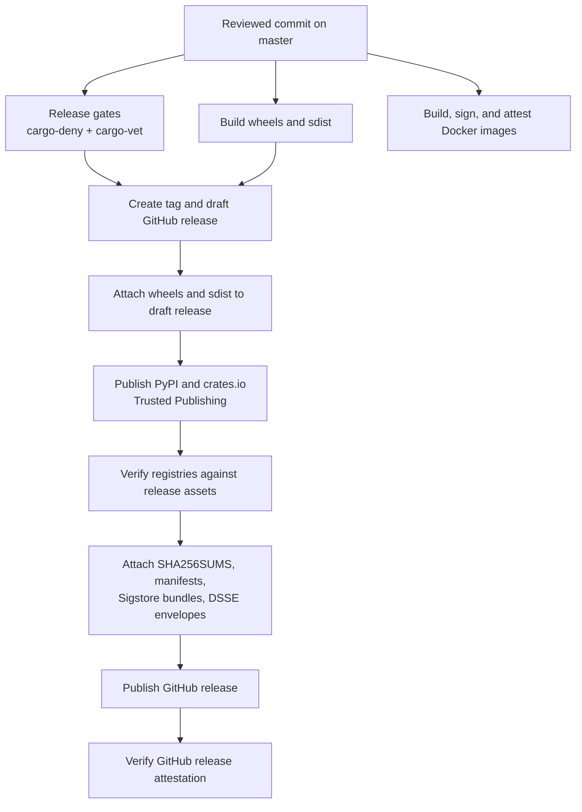

# 发布安全架构 (Release Security Architecture)

本页描述 NautilusTrader 发布流水线的安全模型。它解释了发布产物如何被构建、发布、证明 (attest) 和验证。

请将本页与以下内容配合使用：

- [发布 (Releases)](releases.md)，记录了发布工作流和检查清单。
- [安全策略 (Security Policy)](https://github.com/nautechsystems/nautilus_trader/blob/develop/SECURITY.md)，
  提供面向消费者的验证命令。
- [.github/OVERVIEW.md](https://github.com/nautechsystems/nautilus_trader/blob/develop/.github/OVERVIEW.md#security)，
  记录了 CI/CD 控制措施。

## 安全目标

发布流水线有四个目标：

- 从经过审查的仓库提交 (commit) 构建每一个官方产物。
- 发布 Python 和 Rust 包时不使用长期有效的包注册表令牌。
- 在发布 GitHub release 之前附加校验和 (checksum)、清单 (manifest) 和来源证明 (provenance)。
- 提供足够的公开数据，让用户能够验证下载的产物与发布内容一致。

GitHub release 是包完整性的锚点。稳定版发布会在任何包索引发布开始之前，将 wheel 和
sdist 资产附加到一个草稿 (draft) GitHub release 上。流水线先发布包索引，再将这些索引
与 GitHub release 资产进行核对，然后附加最终的完整性资产，最后才发布
GitHub release。

## 威胁模型

流水线防御以下威胁：

- 受到入侵或可变的第三方 GitHub Actions，通过将 actions 固定 (pin) 到 commit SHA 来防御。
- 从错误的工作流、分支或环境意外发布，通过将 OIDC 发布者绑定到
  `nautechsystems/nautilus_trader`、`build.yml` 以及 `release` 环境来防御。
- 长期有效的包注册表令牌被窃取，通过使用 PyPI 和 crates.io 的 Trusted Publishing 来防御。
- 注册表传播延迟或部分重跑，通过让发布和验证脚本具备幂等性 (idempotent)
  和重试容错能力来防御。
- 注册表替换或上传漂移，通过将 PyPI 和 crates.io 产物与发布清单
  及注册表元数据进行比对来防御。
- 静默的手动 crate 恢复，通过要求显式的 `CRATES_IO_MANUAL_PUBLISH_EXCEPTIONS`
  条目，并将这些例外记录到 `crates-manifest.json` 中来防御。

流水线不防御以下威胁：

- 拥有权限修改发布工作流并批准发布的恶意维护者。
- GitHub、PyPI、crates.io 或 Sigstore 遭到入侵，从而能够伪造用户所依赖的信任根。
- 在验证运行之前用户终端机器已被入侵。
- 交易所、券商、数据提供商或用户交易策略的运行时入侵。
- wheel 和 sdist 的逐位 (bit-identical) 可重建漂移。当前的保证是来源证明和
  摘要 (digest) 验证，而非可复现构建 (reproducible builds)。

## 信任根

- GitHub 仓库规则保护经过审查的源码、发布分支和发布标签。
  受保护的 `master` 分支和不可变的 `v*` 发布标签是相关的记录。
- GitHub Actions OIDC issuer 从
  `https://token.actions.githubusercontent.com` 提供短期有效的工作流身份。
- GitHub `release` 环境对包发布和发布审批进行门控 (gate)。
  该环境将部署限制到 `master`，并要求审查者批准。
- PyPI Trusted Publishing 在不使用持久令牌的情况下发布 wheel 和 sdist。
  它绑定到仓库 `nautechsystems/nautilus_trader`、工作流 `build.yml`
  以及环境 `release`。
- crates.io Trusted Publishing 在不使用持久令牌的情况下发布 Rust crate。
  它绑定到所有者 `nautechsystems`、仓库 `nautilus_trader`、工作流
  `build.yml` 以及环境 `release`。
- Sigstore Fulcio、Rekor 和 TUF 将产物绑定到 OIDC 身份和
  透明日志 (transparency log)。GitHub 产物证明、PyPI 发布证明以及
  Docker cosign 签名都依赖这一信任根。
- GitHub release 不可变性防止发布后资产和标签被替换。
  已发布的 release 资产和发布标签会变为不可变。

## 发布流程



Docker 工作流与包发布工作流是分开的，但它遵循
相同的身份模型：镜像签名和 SBOM 证明将镜像
摘要绑定到预期的 GitHub Actions 工作流身份。

## 产物记录

- Python wheel 会发布到 GitHub Releases、PyPI 以及 Nautech Systems
  包索引 (`packages.nautechsystems.io`)。`SHA256SUMS`、每个资产对应的
  `.sha256` 文件以及 `dist-manifest.json` 记录完整性。GitHub 产物
  证明、PyPI 发布证明、`.sigstore` bundle 以及
  `.intoto.jsonl` envelope 记录来源证明。
- Python sdist 使用与 wheel 相同的公开位置、完整性记录和来源
  记录。
- Rust crate 会发布到 crates.io。crates.io 校验和与
  `crates-manifest.json` 记录完整性。除非存在显式的手动例外，否则 crates.io 的 `trustpub_data`
  记录来源证明。
- Docker 镜像会发布到 GitHub Container Registry。镜像摘要是
  完整性记录。Sigstore cosign 签名和 SPDX SBOM 证明
  记录来源证明。
- GitHub release 记录通过 GitHub Releases 发布。已发布的
  release 资产和不可变标签记录完整性。GitHub release
  证明记录来源证明。

## 消费者验证对照表

详细命令位于
[验证发布 (Verifying releases)](https://github.com/nautechsystems/nautilus_trader/blob/develop/SECURITY.md#verifying-releases)。
下面的检查项展示了每个消费者应当验证的公开数据。

### Python wheel 和 sdist

验证：

- 产物摘要与 `SHA256SUMS`、对应的 `.sha256` 文件或
  `dist-manifest.json` 一致。
- GitHub 产物证明的身份与 `master` 或 `nightly` 上的
  `nautechsystems/nautilus_trader/.github/workflows/build.yml` 一致。
- PyPI 发布证明报告的仓库为 `nautechsystems/nautilus_trader`、
  工作流为 `build.yml`、环境为 `release`。

Fish 兼容示例：

```fish
set -gx TAG v1.228.0
set -gx REPO nautechsystems/nautilus_trader
set -gx ARTIFACT nautilus_trader-1.228.0.tar.gz
set -gx ISSUER https://token.actions.githubusercontent.com
set -gx IDENTITY \
  '^https://github\.com/nautechsystems/nautilus_trader/\.github/workflows/build\.yml@refs/heads/(master|nightly)$'

gh release download $TAG --repo $REPO --pattern $ARTIFACT --pattern $ARTIFACT.sha256
sha256sum -c $ARTIFACT.sha256
gh attestation verify $ARTIFACT \
  --repo $REPO \
  --cert-identity-regex $IDENTITY \
  --cert-oidc-issuer $ISSUER
```

### PyPI 发布来源证明

验证：

- PyPI 文件哈希与 `dist-manifest.json` 一致。
- PyPI 来源证明暴露了预期的 GitHub 发布者身份。
- `pypi-attestations verify` 接受所下载的文件 URL。

Fish 兼容示例：

```fish
set -gx VERSION 1.228.0
set -gx ARTIFACT nautilus_trader-1.228.0.tar.gz
set -gx PYPI_URL (curl -sS https://pypi.org/pypi/nautilus_trader/$VERSION/json | \
  jq -r --arg artifact "$ARTIFACT" '.urls[] | select(.filename == $artifact) | .url')

uv run --no-project --no-build --with pypi-attestations -- \
  pypi-attestations verify pypi \
  --repository https://github.com/nautechsystems/nautilus_trader \
  $PYPI_URL
```

### Rust crate

验证：

- crates.io 版本校验和与下载的 `.crate` 文件一致。
- `trustpub_data.provider` 为 `github`。
- `trustpub_data.repository` 为 `nautechsystems/nautilus_trader`。
- `published_by` 为 `null`，除非 `crates-manifest.json` 记录了显式的
  `manual_token_publish` 例外。

Fish 兼容示例：

```fish
set -gx CRATE nautilus-core
set -gx VERSION 0.58.0
set -gx REPO nautechsystems/nautilus_trader
set -gx VERSION_JSON (curl -sS https://crates.io/api/v1/crates/$CRATE/versions | \
  jq -c --arg version "$VERSION" '.versions[] | select(.num == $version)')
set -gx CRATE_SHA256 (printf '%s\n' "$VERSION_JSON" | jq -r '.checksum')

printf '%s\n' "$VERSION_JSON" | jq -e --arg repo "$REPO" \
  '.trustpub_data.provider == "github" and .trustpub_data.repository == $repo and .published_by == null'
curl -sSL https://static.crates.io/crates/$CRATE/$CRATE-$VERSION.crate -o $CRATE-$VERSION.crate
test (sha256sum $CRATE-$VERSION.crate | cut -d ' ' -f 1) = $CRATE_SHA256
```

### Docker 镜像

验证：

- 可变标签 (mutable tag) 解析到你打算运行的摘要。
- cosign 签名身份与 Docker 工作流一致。
- SPDX SBOM 证明绑定到同一个镜像摘要。

Fish 兼容示例：

```fish
set -gx IMAGE_BASE ghcr.io/nautechsystems/nautilus_trader
set -gx DIGEST (crane digest $IMAGE_BASE:latest)
set -gx IMAGE $IMAGE_BASE@$DIGEST
set -gx ISSUER https://token.actions.githubusercontent.com
set -gx IDENTITY \
  '^https://github\.com/nautechsystems/nautilus_trader/\.github/workflows/docker\.yml@refs/heads/(master|nightly)$'

cosign verify $IMAGE --certificate-identity-regexp $IDENTITY --certificate-oidc-issuer $ISSUER
cosign verify-attestation \
  --type https://spdx.dev/Document/v2.3 \
  $IMAGE \
  --certificate-identity-regexp $IDENTITY \
  --certificate-oidc-issuer $ISSUER
```

## 手动恢复姿态

正常发布仅使用 Trusted Publishing。手动包发布是
在部分发布失败之后的最后手段恢复路径。

手动恢复的规则：

- 当注册表或 Sigstore 验证器失败时，优先重新运行失败的作业或工作流。
- 发布后不要替换发布标签或 GitHub release 资产。
- 不要静默接受手动发布的 crate。
- 如果某个 crate 必须使用令牌恢复，请在
  `CRATES_IO_MANUAL_PUBLISH_EXCEPTIONS` 中逐一列出每个 `crate@version`。
- 在发布说明 (release notes) 和 `crates-manifest.json` 中记录该例外，并标注
  `release_status: "manual_token_publish"`。

没有任何常规发布路径依赖于长期有效的 PyPI 或 crates.io 令牌。

## 事件响应姿态

- PyPI 发布者漂移由 PyPI 来源证明验证器检测。停止
  发布，修复 PyPI Trusted Publisher，然后重新运行验证。
- crates.io 发布者漂移由 trusted-publishing 检查或
  注册表验证器检测。修复 crate 发布者设置后重跑。仅在
  部分恢复时使用手动例外。
- GitHub release 资产不匹配由校验和或清单验证检测。
  在发布之前停止发布，或者在资产已经发出的情况下发布一份公告 (advisory)。
- Sigstore、Rekor 或 TUF 延迟由可重试的透明性错误检测。
  以有界退避 (bounded backoff) 重试，若延迟持续则暂停发布封存 (sealing)。
- Sigstore 信任根问题在证明验证变得含糊时出现。
  暂停发布，对照注册表记录进行验证，并在受支持时轮换信任
  根。
- 工作流身份不匹配由 GitHub、PyPI 或 cosign 身份
  检查检测。在审查之前将其视为配置漂移或入侵。
- 手动 crate 发布例外在 crates.io 显示
  `published_by` 而非 `trustpub_data` 时被检测到。记录该显式例外，
  记录受影响的 crate，并保留审计轨迹。

## SLSA 姿态

Python 发布产物通过 GitHub 产物证明和 PyPI 发布证明携带构建来源证明。Docker 镜像携带 Sigstore 签名和 SPDX SBOM
证明。Rust crate 依赖 crates.io Trusted Publishing 元数据和
发布的 `crates-manifest.json`。

本页不针对所有产物类别断言某个具名的 SLSA 级别。任何未来的
SLSA 级别声明都必须引用本架构，指明它所覆盖的产物类别，
并包含 CI 验证，以确保已发布的来源证明能够解析为所声称的
谓词类型 (predicate type)。
