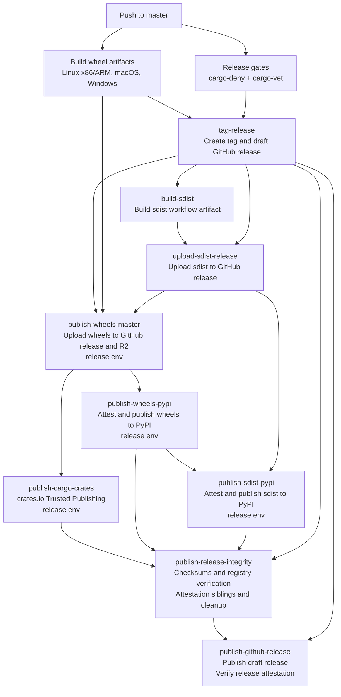

# 发布 (Releases)

本指南涵盖发布流程以及编写发布说明（Release Notes）的规范。

## 概览

NautilusTrader 采用三分支模型：

- **`develop`**：活跃开发分支；每次推送都会向 Cloudflare R2 发布 dev 版 wheel 包。
- **`nightly`**：预发布测试分支；发布 alpha 版 wheel 包和 CLI 二进制文件。
- **`master`**：稳定发布分支；触发完整的发布流水线。

推送到 `master` 会自动从 `pyproject.toml` 标记版本号、创建 GitHub 草稿发布、上传发布资产、向 crates.io 发布 Cargo crate、向 PyPI 发布 wheel 和 sdist、发布 GitHub release、构建 Docker 镜像，并触发文档重建。

## 稳定发布工作流

`build` 工作流将 GitHub release 作为稳定发布的锚点。它先以草稿形式创建 release，将 wheel 和 sdist 资产上传到该草稿 release，然后才把这些包发布到包索引。只有在完成 registry 验证和最终完整性资产之后，工作流才会发布该 GitHub release。



编辑 `.github/workflows/build.yml` 时，请保持以下排序规则不变：

- 在任何发布资产上传或包 registry 发布之前，必须先存在 GitHub 草稿 release。
- 在包索引发布（`packages.nautechsystems.io`、PyPI、crates.io）开始之前，wheel 和 sdist 资产必须已附加到 GitHub release。
- PyPI 和 crates.io 的 Trusted Publishing 作业必须保留 `environment: release` 和 `id-token: write`；这些注册依赖于 `release` 环境。
- 非 OIDC 的完整性和资产上传作业应避免使用 `environment: release`，除非它们确实需要 release 环境的 secret 或审批。
- `publish-release-integrity` 必须在 PyPI 和 crates.io 发布之后运行，以便在附加最终完整性资产之前对照 release 清单验证各 registry。
- `publish-github-release` 必须是稳定发布的最后一个作业。GitHub 建议先创建草稿 release，附加所有资产，然后在启用 release 不可变性之前发布该草稿。一旦为仓库启用了 GitHub release 不可变性，已发布的 release 资产和 release 标签便无法更改；只有标题和发布说明仍可编辑。该作业会在发布草稿后验证 GitHub 的 release attestation（认证）。

## 版本控制

本项目维护两个版本号：

| 文件                     | 范围          | 示例      |
|--------------------------|---------------|-----------|
| `pyproject.toml`         | Python 包     | `1.223.0` |
| `Cargo.toml`（workspace） | Rust crate    | `0.55.0`  |

它们各自独立升级。Python 版本号驱动发布标签（`v1.223.0`）。

## Crates.io 发布

`build` 工作流通过 `publish-cargo-crates` 作业发布 Cargo crate。该作业通过 GitHub Actions OIDC 使用 crates.io 的 Trusted Publishing，因此不使用持久化的 cargo token。请为每个 crate 在 crates.io 上配置：

| 字段        | 值                |
|-------------|-------------------|
| Owner       | `nautechsystems`  |
| Repository  | `nautilus_trader` |
| Workflow    | `build.yml`       |
| Environment | `release`         |

只有在 crate 的 trusted publisher 配置完成之后，才为其启用 Trusted Publishing Only。从未发布过的 crate 在 crates.io 允许配置 trusted publisher 之前，仍需要先进行一次手动初始发布。

CI 发布不要使用 `cargo publish --workspace`。发布作业运行 `scripts/ci/publish-cargo-crates.sh`，该脚本按依赖顺序逐个发布 crate，跳过 crates.io 上已存在的版本，并在发布依赖方之前等待每个新版本出现在 crates.io API 和 sparse index 中。如果某个可发布的 crate 依赖于一个标记为 `publish = false` 且不存在于 crates.io 上的本地 crate，脚本会在上传前失败。可选的本地依赖也算作阻塞项，因为发布一个解析到缺失 crate 的公开 feature 会导致该 feature 无法使用。

发布后验证仅在 crates.io 显示某个 crate 版本是由本仓库通过 trusted-publishing 发布时，才将其视为 `previously_published`。对于用户手动发布的 crate 版本，除非 `CRATES_IO_MANUAL_PUBLISH_EXCEPTIONS` 为每个需恢复的 `crate@version` 条目命名以用于紧急 token 发布恢复，否则验证仍会失败。被接受的手动条目会以 `release_status: "manual_token_publish"` 记录在 `crates-manifest.json` 中，而格式错误或未使用的例外条目会导致作业失败。错误的 trusted-publishing 仓库以及校验和或 sparse-index 不匹配同样会导致失败。

## 发布清单

### 预发布（在 `develop` 上）

- [ ] 完成 `RELEASES.md`：审阅所有条目，删除空章节
- [ ] 确保在 `pyproject.toml` 和 `Cargo.toml` workspace 中设置了版本号
- [ ] 确保为 CI 发布的每个 crate 配置了 crates.io 的 Trusted Publishing：
  `bash scripts/ci/check-crates-io-trusted-publishing.sh`
- [ ] 确保 `develop` 上的所有 CI 检查通过

### 发布

- [ ] 将 `develop` 合并到 `nightly`，验证 nightly CI 通过
- [ ] 将 `nightly` 合并到 `master`
- [ ] 验证 `build` 工作流完成：
  - 为 Linux x86/ARM、macOS、Windows 构建 wheel 包
  - `cargo-deny` 和 `cargo-vet` 通过
  - 创建标签和 GitHub 草稿 release
  - 在包 registry 发布之前，wheel 和 sdist 已附加到 GitHub release
  - Cargo crate 已发布到 crates.io，或因版本已存在而被跳过
  - wheel 和 sdist 已发布到 PyPI
  - release 校验和、registry 验证、crates 清单和 attestation siblings 已发布
  - 在所有发布资产和完整性资产附加完成后，GitHub release 已发布
- [ ] 验证 `docker` 工作流完成（镜像已构建并推送）
- [ ] 验证 `build-docs` 工作流完成（已触发文档重建）

### 发布后（在 `develop` 上）

- [ ] 在 `RELEASES.md` 中更新已发布版本的发布日期
- [ ] 在已完成的发布版本下方添加水平分隔线 `---`
- [ ] 在 `RELEASES.md` 顶部添加下一个版本的模板（见下文）
- [ ] 将 `pyproject.toml` 版本号升级到下一个发布编号
- [ ] 升级教程和操作指南 `Cargo.toml` 代码片段中的 crate 版本
  （`docs/concepts/rust.md`、`docs/how_to/run_rust_backtest.md`、
  `docs/how_to/run_rust_live_trading.md`）

## 发布说明

本节记录在 `RELEASES.md` 中编写发布说明的规范。

### 章节

按以下顺序使用章节：

1. Enhancements
2. Breaking Changes
3. Security
4. Fixes
5. Internal Improvements
6. Documentation Updates
7. Deprecations

某次发布中没有条目的章节应省略。

### Enhancements（功能增强）

新功能和用户可见的改进。

**格式**：

```markdown
- Added `subscribe_order_fills(...)` and `unsubscribe_order_fills(...)` for `Actor`
- Added BitMEX conditional orders support
- Added support for `OrderBookDepth10` requests (#2955), thanks @faysou
```

**指南**：

- 以 "Added" 开头。
- 代码元素使用反引号。
- 具体说明添加了什么，而非如何实现。

### Breaking Changes（破坏性变更）

可能破坏现有代码的更改。

**格式**：

```markdown
- Removed `nautilus_trader.analysis.statistics` subpackage - must import from `nautilus_trader.analysis`
- Renamed `BinanceAccountType.USDT_FUTURE` to `USDT_FUTURES`
- Changed `start` parameter to required for `Actor` data request methods
```

**指南**：

- 以 "Removed"、"Renamed" 或 "Changed" 开头。
- 简要说明迁移路径。

### Security（安全）

安全加固和修复，防止崩溃、未定义行为或数据损坏。
包括从内部改进中提升的重要加固改进。

**格式**：

```markdown
- Fixed non-executable stack for Cython extensions to support hardened Linux systems
- Fixed divide-by-zero and overflow bugs in model crate that could cause crashes
- Fixed core arithmetic operations to reject NaN/Infinity values and improve overflow handling
```

**指南**：

- 包括溢出/下溢修复、内存安全改进、FFI 防护、数据完整性修复。
- 关注用户影响：可能会发生什么。
- 排除例行的依赖更新、小型加固或仅测试的修复。
- 如果某次发布没有安全条目，则完全省略此章节。

### Fixes（修复）

改进正确性但不属于安全问题的 bug 修复。

**格式**：

```markdown
- Fixed reduce-only order panic when quantity exceeds position
- Fixed Binance order status parsing for external orders (#3006), thanks for reporting @bmlquant
```

**指南**：

- 以 "Fixed" 开头。

### Internal Improvements（内部改进）

实现细节和基础设施变更。

**格式**：

```markdown
- Added ARM64 support to Docker builds
- Ported `PortfolioAnalyzer` to Rust
- Improved clock and timer thread safety
- Upgraded Rust (MSRV) to 1.90.0
- Upgraded `pyo3` crates to v0.26.0
```

**指南**：

- 使用 "Added"、"Implemented"、"Improved"、"Optimized"、"Upgraded"、"Refined"、"Standardized"。
- 依赖升级需包含版本号。

### Documentation Updates（文档更新）

指南和示例的变更。

**格式**：

```markdown
- Added rate limit tables with links to official docs
- Improved dark and light themes for readability
- Fixed broken links
```

### Deprecations（弃用）

标记为将移除的功能。

**格式**：

```markdown
- Deprecated `some_config_option`; disable (`False`) to maintain consistent behaviour. Will be removed in future version
```

**指南**：

- 说明迁移路径并提供替代方案。

## 归属

- 致谢外部贡献者：`thanks @username` 或 `thanks for reporting @username`。
- 社区贡献和复杂功能包含 issue/PR 编号：`(#1234)`。

## 风格

- 使用句首大写（仅首字母大写）。
- 不以句号结尾。
- 代码元素使用反引号。
- 关注**变更了什么**，而非如何变更。

**要具体**：

```markdown
❌ Improved Binance adapter
✅ Improved Binance fill handling when instrument not cached
```

## 安全分类

如果变更涉及以下内容，应归入安全章节：

- 内存安全（威胁稳定性的溢出、下溢、除零）。
- 未定义行为或可能损坏状态的崩溃。
- 数据完整性（NaN/Infinity 传播、导致损坏的竞态条件）。
- 防止注入或利用的输入验证（SQL 注入、命令注入、路径遍历）。
- 构建加固（不可执行栈、FFI 防护）。
- 用户应了解的重要加固措施。

否则归入修复（用于逻辑 bug 和 panic）或内部改进（用于小型加固）。

注意：普通的逻辑 panic 归入修复，除非它们威胁系统稳定性或数据损坏。

## 示例

**安全**（可能导致崩溃/损坏）：

```markdown
- Fixed divide-by-zero in margin calculations that could crash the engine
- Fixed non-executable stack for Cython extensions to support hardened systems
```

**修复**（不正确但安全）：

```markdown
- Fixed Binance order status parsing for external orders
- Fixed position purge logic to prevent purging re-opened position
```

**功能增强**（面向用户）：

```markdown
- Added BitMEX conditional orders support
```

**内部改进**（实现层面）：

```markdown
- Implemented BitMEX ping/pong handling
```

## 发布说明模板

```markdown
# NautilusTrader <VERSION> Beta

Released on TBD (UTC).

### Enhancements

### Breaking Changes

### Security

### Fixes

### Internal Improvements

### Documentation Updates

### Deprecations

---
```
