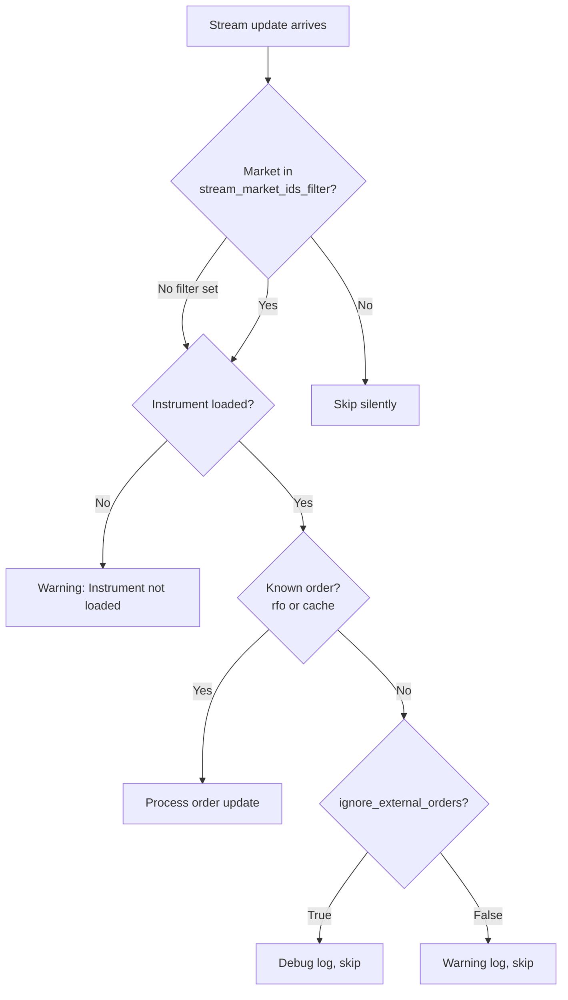

# Betfair

Betfair 成立于 2000 年，运营着全球最大的在线博彩交易所（Betting Exchange），
总部位于伦敦，在全球多地设有分支机构。

NautilusTrader 提供了一个适配器（Adapter），用于集成（Integration） Betfair REST API 和
Exchange Streaming API。

## 安装

安装带有 Betfair 支持的 NautilusTrader：

```bash
uv pip install "nautilus_trader[betfair]"
```

从源码构建并包含 Betfair 扩展：

```bash
uv sync --all-extras
```

## 示例

您可以在[此处](https://github.com/nautechsystems/nautilus_trader/tree/develop/examples/live/betfair/)找到实时示例脚本。

## Betfair 文档

Betfair 为开发者提供文档：

- [Betfair Developer Portal](https://developer.betfair.com/)：API 访问和文档的主要入口。
- [Exchange API Guide](https://developer.betfair.com/exchange-api/)：Betting、Accounts 和 Streaming API 的概述。

## 应用密钥

Betfair 要求使用应用密钥（Application Key）来验证 API 请求。注册并为账户充值后，
可通过 [API-NG Developer AppKeys Tool](https://apps.betfair.com/visualisers/api-ng-account-operations/) 获取密钥。

每个账户会分配两个应用密钥：一个 **Live** 密钥（需要一次性激活费用）和一个用于开发和测试的
**Delayed** 密钥。

:::info
有关详细的设置说明，请参阅 [Application Keys](https://betfair-developer-docs.atlassian.net/wiki/spaces/1smk3cen4v3lu3yomq5qye0ni/pages/2687105/Application+Keys) 文档。
:::

## API 凭证

通过环境变量或客户端配置提供您的 Betfair 凭证：

```bash
export BETFAIR_USERNAME=<your_username>
export BETFAIR_PASSWORD=<your_password>
export BETFAIR_APP_KEY=<your_app_key>
export BETFAIR_CERTS_DIR=<path_to_certificate_dir>
```

:::tip
建议使用环境变量来管理您的凭证。
:::

:::note
当前 Rust 注意事项：Rust 目前读取 `BETFAIR_USERNAME`、`BETFAIR_PASSWORD` 和
`BETFAIR_APP_KEY`，尚未读取 `BETFAIR_CERTS_DIR`。
:::

## SSL 证书

对于自动化交易系统，Betfair 推荐使用带 SSL 证书的[非交互式（机器人）登录](https://betfair-developer-docs.atlassian.net/wiki/spaces/1smk3cen4v3lu3yomq5qye0ni/pages/2687915/Non-Interactive+bot+login)。
`certs_dir` 配置是可选的，但在生产环境部署中推荐使用证书。

### 生成证书

使用 OpenSSL 创建一个 2048 位的 RSA 证书：

```bash
# 生成私钥和证书签名请求
openssl genrsa -out client-2048.key 2048
openssl req -new -key client-2048.key -out client-2048.csr

# 自签名证书（有效期 365 天）
openssl x509 -req -days 365 -in client-2048.csr -signkey client-2048.key -out client-2048.crt
```

### 上传到 Betfair

在使用证书之前，需将其关联到您的 Betfair 账户：

1. 进入 [My Betfair Account Security](https://myaccount.betfair.com/accountdetails/mysecurity?showAPI=1)。
2. 滚动到 **Automated Betting Program Access** 并点击 **Edit**。
3. 上传您的 `client-2048.crt` 文件。

### 目录结构

将证书文件放在一个目录中，并将 `BETFAIR_CERTS_DIR` 设置为该路径：

```
/path/to/certs/
├── client-2048.crt
└── client-2048.key
```

:::info
SSL 证书用于 Exchange Streaming API 连接。REST API 则使用用户名/密码配合应用密钥进行认证。
:::

:::warning
在 Betfair 网站上启用两步验证（2-Step Authentication）不会影响 API 访问。
无论 2FA 设置如何，基于证书的登录始终有效。
:::

## 概述

Betfair 适配器提供三个主要组件：

- `BetfairInstrumentProvider`：加载 Betfair 市场并将其转换为 Nautilus 金融工具（Instrument）。
- `BetfairDataClient`：通过 Exchange Streaming API 流式传输实时市场数据。
- `BetfairExecutionClient`：通过 REST API 提交订单（Order）（投注）并跟踪执行状态。

## 实现状态

NautilusTrader 目前提供一个稳定的 Python Betfair 适配器，以及一个正在开发中的 Rust 对等实现路径。

本页面仍是稳定版指南，现已在正文中标注了主要的 Rust 差异。关于 `crates/adapters/betfair`
中当前的 Rust 优先行为及规划中的切换路径，请参阅 [Betfair v2 迁移指南](betfair_v2.md)。

## 订单功能

Betfair 作为博彩交易所运营，与传统金融交易所相比具有独特的特性：

### 订单类型

| 订单类型               | 支持 | 说明                              |
|------------------------|------|-----------------------------------|
| `MARKET`               | ✓*   | Python 将常规市价订单映射为激进的 `LIMIT`；Rust 仅支持 BSP 的 `AT_THE_CLOSE`。 |
| `LIMIT`                | ✓    | 以特定赔率下单。                  |
| `STOP_MARKET`          | -    | *不支持*。                        |
| `STOP_LIMIT`           | -    | *不支持*。                        |
| `MARKET_IF_TOUCHED`    | -    | *不支持*。                        |
| `LIMIT_IF_TOUCHED`     | -    | *不支持*。                        |
| `TRAILING_STOP_MARKET` | -    | *不支持*。                        |

### 执行指令

| 指令          | 支持 | 说明                              |
|---------------|------|-----------------------------------|
| `post_only`   | -    | 不适用于博彩交易所。              |
| `reduce_only` | -    | 不适用于博彩交易所。              |

### 有效时间选项

| 有效时间      | 支持 | 说明                                      |
|---------------|------|-------------------------------------------|
| `GTC`         | ✓    | 映射为 Betfair 的 `PERSIST` 持久化模式。  |
| `GTD`         | -    | *不支持*。                                |
| `DAY`         | ✓    | 映射为 Betfair 的 `LAPSE` 持久化模式。    |
| `FOK`         | ✓    | 映射为 Betfair 的 `FILL_OR_KILL`。        |
| `IOC`         | ✓    | 映射为允许部分成交的 `FILL_OR_KILL`。     |

:::note
Betfair 使用持久化模型而非传统的有效时间机制。适配器将 `FOK` 映射为
Betfair 的 `FILL_OR_KILL`，而 `IOC` 则使用 `FILL_OR_KILL` 配合 `min_fill_size=0` 以允许部分成交。

当前的适配器还支持 BSP 收盘订单流。Rust 在 `AT_THE_CLOSE` 模式下仅接受 `MARKET` 订单。
Rust 还会将 `AT_THE_CLOSE` 或 `AT_THE_OPEN` 模式下的 `LIMIT` 订单映射为
Betfair 的 `LIMIT_ON_CLOSE` 指令。
:::

### 高级订单功能

| 功能             | 支持 | 说明                                    |
|------------------|------|-----------------------------------------|
| 订单修改         | ✓    | 仅限于不改变风险敞口的字段。            |
| 括号/OCO 订单    | -    | *不支持*。                              |
| 冰山订单         | -    | *不支持*。                              |

### 批量操作

| 操作             | 支持 | 说明                 |
|------------------|------|----------------------|
| 批量提交         | ✓    | Python 和 Rust 均支持 `SubmitOrderList`。 |
| 批量修改         | -    | *不支持*。           |
| 批量撤销         | ✓    | Python 和 Rust 均支持批量撤单请求。 |

### 持仓管理

| 功能              | 支持 | 说明                                  |
|-------------------|------|---------------------------------------|
| 查询持仓          | -    | 博彩交易所模型不同。                  |
| 持仓模式          | -    | 不适用于博彩交易所。                  |
| 杠杆控制          | -    | 博彩交易所无杠杆。                    |
| 保证金模式        | -    | 博彩交易所无保证金。                  |

### 订单查询

| 功能               | 支持 | 说明                                  |
|--------------------|------|---------------------------------------|
| 查询活跃订单       | ✓    | 列出所有活跃投注。                    |
| 查询订单历史       | ✓    | 历史投注数据。                        |
| 订单状态更新       | ✓    | 实时投注状态变更。                    |
| 交易历史           | ✓    | 投注撮合和结算报告。                  |

### 条件订单

| 功能              | 支持 | 说明                                  |
|-------------------|------|---------------------------------------|
| 订单列表          | -    | *不支持*。                            |
| OCO 订单          | -    | *不支持*。                            |
| 括号订单          | -    | *不支持*。                            |
| 条件订单          | -    | 仅支持基本投注条件。                  |

## Tick 方案与定价

Betfair 使用分层 tick 方案，不同价格区间的增量各不相同：

| 价格区间        | Tick 大小 |
|-----------------|-----------|
| 1.01 - 2.00     | 0.01      |
| 2.00 - 3.00     | 0.02      |
| 3.00 - 4.00     | 0.05      |
| 4.00 - 6.00     | 0.10      |
| 6.00 - 10.00    | 0.20      |
| 10.00 - 20.00   | 0.50      |
| 20.00 - 30.00   | 1.00      |
| 30.00 - 50.00   | 2.00      |
| 50.00 - 100.00  | 5.00      |
| 100.00 - 1000.00 | 10.00    |

最低价格为 1.01，最高价格为 1000.00。

## 订单修改

Betfair 上的订单修改有特定的约束：

- **价格和数量无法原子化地同时更改** —— 二者需要分别操作。
- **价格修改**使用 `ReplaceOrders`（撤销现有订单并以新价格创建新订单）。
- **数量减少**使用 `CancelOrders` 配合 `size_reduction` 参数。
- **数量增加**不受支持 —— 请改为提交新订单。

:::warning
一次替换操作会同时为原订单生成一个撤销事件，并为替换订单生成一个接受事件。
适配器会跟踪待处理的替换操作，以抑制合成的撤销事件。
:::

## 订单流成交处理

执行客户端处理来自 Betfair Exchange Streaming API 的订单更新。
有两个配置选项控制更新的过滤方式：

- **`stream_market_ids_filter`**：在市场级别进行过滤（提前退出，静默跳过）。
- **`ignore_external_orders`**：在订单级别进行过滤。Python 还使用它来控制
  全量镜像缓存检查的日志级别。Rust 目前仅跳过没有 `rfo` 的 OCM 更新。

下方的流程图对应稳定的 Python 执行路径。

Python 将 `stream_market_ids_filter` 与对账范围（`reconcile_market_ids_only`）分开处理。
当 `reconcile_market_ids_only=False` 且未显式配置 `reconcile_market_ids` 时，
Rust 目前会在对账期间回退到使用 `stream_market_ids_filter`。



Python 还会在 `check_cache_against_order_image` 中进行全量镜像对账时应用
`stream_market_ids_filter`。Rust 目前通过 `generate_mass_status()` 进行对账，
尚未执行同样的全量镜像缓存检查。

当 `ignore_external_orders=True` 时，Python 适配器会跳过缓存中未找到的订单和成交：

| 场景                           | 描述                                                |
|--------------------------------|-----------------------------------------------------|
| 流更新中的未知订单             | 不存在场所订单 ID 到客户端订单 ID 的映射。          |
| 全量镜像中的未知订单           | 镜像同步期间在缓存中未找到该订单。                  |
| 全量镜像中的未知成交           | 同步期间该成交与任何已知订单都不匹配。              |

:::info
对于共享同一 Betfair 账户的多节点设置，请同时设置 `stream_market_ids_filter`（仅限您自己的市场）
和 `ignore_external_orders=True`，以避免出现关于其他节点所管理订单的警告。
:::

### 成交处理

适配器在处理来自流的成交时会处理若干边界情况：

- **增量成交**：Betfair 报告的是累计已撮合数量。适配器通过跟踪每个订单上一次已知的
  已成交数量来计算增量成交。
- **超额成交保护**：会拒绝那些可能导致超出订单数量的成交。
- **去重**：已发布成交 ID 的缓存可防止因延迟消息或流重连重放而产生的重复成交事件。
- **竞态条件**：当流成交先于 HTTP 订单响应到达时，适配器会立即缓存场所订单 ID，
  以确保正确的订单匹配。
- **网络错误恢复**：当 HTTP 订单提交因网络错误（超时、连接重置）而失败时，
  订单仍可能已在场所成功下达。适配器会将订单保留在 SUBMITTED 状态并保留客户订单引用，
  以便流在重连时确认该订单。API 错误（即 Betfair 明确拒绝的情况）仍会立即拒绝。

## 速率限制

适配器使用相互独立的速率限制桶，使账户状态轮询和对账不会对下单造成节流：

| 桶      | 默认值 | 端点                                                 | 可配置                           |
|---------|--------|------------------------------------------------------|----------------------------------|
| General | 5/s    | 账户状态、对账、保活。                               |                                  |
| Orders  | 20/s   | `placeOrders`、`replaceOrders`、`cancelOrders`。     | `order_request_rate_per_second`。 |

订单状态和成交报告查询在遇到 `TOO_MANY_REQUESTS` 错误时，会在延迟 1 秒后重试一次；
订单操作则会带着错误消息直接拒绝。

Betfair 实际的 API 限制更为细致：

| 类别                     | 限制                 | 说明                                                 |
|--------------------------|----------------------|------------------------------------------------------|
| 订单操作                 | 1,000 笔事务/s       | `placeOrders`、`cancelOrders`、`replaceOrders` 跨所有指令的总和。 |
| 订单投影查询             | 3 个并发             | `listMarketBook`（带 `OrderProjection`）、`listCurrentOrders`、`listMarketProfitAndLoss`。 |
| 最佳实践                 | 5 请求/s             | 推荐每个市场上 `listMarketBook` 的请求频率。         |

:::info
有关速率限制的详情，请参阅 [Why am I receiving the TOO_MANY_REQUESTS error?](https://support.developer.betfair.com/hc/en-us/articles/360000406111)
和 [Market Data Request Limits](https://docs.developer.betfair.com/display/1smk3cen4v3lu3yomq5qye0ni/Market+Data+Request+Limits)。
:::

## 自定义数据类型

Betfair 适配器提供若干通过市场流传递的自定义数据类型。
所有自定义数据在订阅市场后会自动传递 —— 无需显式订阅，
不过策略可以为特定数据类型注册处理器。

### BetfairTicker

某个投注选项的实时 ticker 数据。

| 字段                  | 类型    | 描述                            |
|-----------------------|---------|---------------------------------|
| `instrument_id`       | str     | Nautilus 金融工具标识符。        |
| `last_traded_price`   | float   | 最近撮合价格（赔率）。           |
| `traded_volume`       | float   | 累计撮合成交量。                 |
| `starting_price_near` | float   | 近端 BSP 指标。                  |
| `starting_price_far`  | float   | 远端 BSP 指标。                  |

### BetfairStartingPrice

市场收盘后实现的 Betfair 起始价格（Betfair Starting Price, BSP）。

| 字段            | 类型  | 描述                            |
|-----------------|-------|---------------------------------|
| `instrument_id` | str   | Nautilus 金融工具标识符。        |
| `bsp`           | float | 最终起始价格（赔率）。           |

### BetfairRaceRunnerData

单匹赛马的实时 GPS 跟踪数据（Total Performance Data）。
适用于受支持的英国和爱尔兰赛事。

| 字段               | 类型  | 描述                                    |
|--------------------|-------|-----------------------------------------|
| `race_id`          | str   | Betfair 赛事标识符。                    |
| `market_id`        | str   | Betfair 市场标识符。                    |
| `selection_id`     | int   | Betfair 选项（参赛者）标识符。          |
| `latitude`         | float | GPS 纬度。                              |
| `longitude`        | float | GPS 经度。                              |
| `speed`            | float | 当前速度，单位 m/s（基于多普勒推算）。  |
| `progress`         | float | 距终点线的距离，单位米。                |
| `stride_frequency` | float | 步频，单位 Hz。                         |

### BetfairRaceProgress

带分段计时和排位的赛事汇总数据。

| 字段             | 类型       | 描述                                          |
|------------------|------------|-----------------------------------------------|
| `race_id`        | str        | Betfair 赛事标识符。                          |
| `market_id`      | str        | Betfair 市场标识符。                          |
| `gate_name`      | str        | 计时门（例如 "1f"、"2f"、"Finish"）。         |
| `sectional_time` | float      | 本段用时，单位秒。                            |
| `running_time`   | float      | 自赛事开始以来的总用时，单位秒。              |
| `speed`          | float      | 领头马速度，单位 m/s。                        |
| `progress`       | float      | 领头马距终点的距离，单位米。                  |
| `order`          | list[int]  | 当前赛事位次顺序下的选项 ID 列表。            |
| `jumps`          | list[dict] | National Hunt 赛事的跳栏障碍数据。            |

### 订阅自定义数据

当您订阅市场时，自定义数据会自动通过 Betfair 市场流传递。
若要在您的策略或 actor 中接收自定义数据，请使用 Betfair 客户端 ID 注册一个处理器：

```python
from nautilus_trader.adapters.betfair.constants import BETFAIR_CLIENT_ID
from nautilus_trader.adapters.betfair.data_types import BetfairRaceRunnerData
from nautilus_trader.adapters.betfair.data_types import BetfairRaceProgress
from nautilus_trader.adapters.betfair.data_types import BetfairTicker
from nautilus_trader.model.data import DataType

class MyStrategy(Strategy):
    def on_start(self):
        # 订阅 ticker 数据
        self.subscribe_data(DataType(BetfairTicker), client_id=BETFAIR_CLIENT_ID)

        # 订阅所有参赛者数据（通配符）
        self.subscribe_data(DataType(BetfairRaceRunnerData), client_id=BETFAIR_CLIENT_ID)

        # 或按 selection_id 订阅特定参赛者
        self.subscribe_data(
            DataType(BetfairRaceRunnerData, metadata={"selection_id": 49411491}),
            client_id=BETFAIR_CLIENT_ID,
        )

        # 订阅所有赛事进度更新（通配符）
        self.subscribe_data(DataType(BetfairRaceProgress), client_id=BETFAIR_CLIENT_ID)

        # 或按 race_id 订阅特定赛事
        self.subscribe_data(
            DataType(BetfairRaceProgress, metadata={"race_id": "35278018.1617"}),
            client_id=BETFAIR_CLIENT_ID,
        )

    def on_data(self, data):
        if isinstance(data, BetfairRaceRunnerData):
            self.log.info(
                f"Runner {data.selection_id}: speed={data.speed} m/s, "
                f"progress={data.progress}m to finish"
            )
        elif isinstance(data, BetfairRaceProgress):
            self.log.info(f"Race order: {data.order}")
        elif isinstance(data, BetfairTicker):
            self.log.info(f"LTP: {data.last_traded_price}")
```

:::info
使用 `DataType(BetfairRaceRunnerData)`（无 metadata）订阅会接收**所有**参赛者的数据。
添加 `metadata={"selection_id": <id>}` 则会过滤到特定参赛者。
同样，`DataType(BetfairRaceProgress)` 会接收所有赛事的进度，而
`metadata={"race_id": <id>}` 则会过滤到特定赛事。

赛事数据（RCM 消息）需要 Total Performance Data (TPD) 覆盖，以及一个具有 TPD 访问权限的
Betfair API 密钥。并非所有赛事都启用了 GPS 跟踪。
:::

### 从文件加载赛事数据

若要使用已录制的赛事数据进行回测，请使用文件解析器：

```python
from nautilus_trader.adapters.betfair.parsing.core import parse_betfair_rcm_file

for data in parse_betfair_rcm_file("path/to/rcm_data.json"):
    if isinstance(data, BetfairRaceRunnerData):
        print(f"Runner {data.selection_id} at {data.latitude}, {data.longitude}")
```

## 配置

### 数据客户端配置选项

| 选项                      | 默认值    | 描述 |
|---------------------------|-----------|------|
| `account_currency`        | 必填      | 用于数据和价格源的 Betfair 账户货币。 |
| `username`                | `None`    | Betfair 账户用户名；省略时从环境变量获取。 |
| `password`                | `None`    | Betfair 账户密码；省略时从环境变量获取。 |
| `app_key`                 | `None`    | 用于 API 认证的 Betfair 应用密钥。 |
| `certs_dir`               | `None`    | 包含 Betfair SSL 证书的登录目录。 |
| `instrument_config`       | `None`    | 可选的 `BetfairInstrumentProviderConfig`，用于限定可用市场范围。 |
| `subscription_delay_secs` | `3`       | 发送初始市场订阅请求前的延迟（秒）。 |
| `keep_alive_secs`         | `36,000`  | Betfair 会话的保活间隔（秒）。 |
| `subscribe_race_data`     | `False`   | 设为 `True` 时，订阅用于实时 GPS 跟踪数据的赛事变更消息（Race Change Messages, RCM）。 |
| `stream_conflate_ms`      | `None`    | 显式流合并间隔（毫秒）（`0` 表示禁用合并）。 |
| `stream_heartbeat_ms`     | `5,000`   | 流心跳间隔（毫秒）（500-5000）。`None` 表示省略。 |
| `proxy_url`               | `None`    | 可选的 HTTP 请求代理 URL。 |

:::warning
当 `stream_conflate_ms` 为 `None` 时，Betfair 会应用其默认的合并行为（通常处于启用状态）。
请显式设置 `stream_conflate_ms=0` 以确保不进行合并并接收每一次价格更新。
:::

:::note
当前 Rust 差异：

- Rust 尚未暴露 `certs_dir`。
- Rust 不使用 `instrument_config`；它通过 `BetfairDataConfig` 上的直接过滤字段来限定金融工具范围。
- Rust 使用固定的 36,000 秒保活间隔。
- Rust 目前要求提供 `stream_heartbeat_ms`；它不接受 `None` 来省略心跳。

:::

### 执行客户端配置选项

| 选项                         | 默认值   | 描述 |
|------------------------------|----------|------|
| `account_currency`           | 必填     | 用于下单和余额查询的 Betfair 账户货币。 |
| `username`                   | `None`   | Betfair 账户用户名；省略时从环境变量获取。 |
| `password`                   | `None`   | Betfair 账户密码；省略时从环境变量获取。 |
| `app_key`                    | `None`   | 用于 API 认证的 Betfair 应用密钥。 |
| `certs_dir`                  | `None`   | 包含 Betfair SSL 证书的登录目录。 |
| `instrument_config`          | `None`   | 可选的 `BetfairInstrumentProviderConfig`，用于限定对账范围。 |
| `calculate_account_state`    | `True`   | 设为 `True` 时，根据事件在本地计算账户状态。 |
| `request_account_state_secs` | `300`    | 向 Betfair 轮询账户状态的间隔（秒）（`0` 表示禁用）。 |
| `reconcile_market_ids_only`  | `False`  | 设为 `True` 时，对账仅覆盖 `instrument_config.market_ids`（若未设置则无效）。 |
| `reconcile_market_ids`       | `None`   | 仅 Rust。当 `reconcile_market_ids_only=True` 时用于对账的显式市场 ID。 |
| `stream_market_ids_filter`   | `None`   | 要从流中处理的市场 ID 列表；其余会被静默跳过。 |
| `ignore_external_orders`     | `False`  | 设为 `True` 时，忽略本地缓存中不存在的流订单。 |
| `use_market_version`         | `False`  | 设为 `True` 时，将最新的市场版本附加到订单请求上以进行价格保护。 |
| `order_request_rate_per_second` | `20`  | 订单端点的速率限制（请求/秒），独立于通用 API 端点。 |
| `stream_heartbeat_ms`        | `5,000`  | 订单流心跳间隔（毫秒）（500-5000）。`None` 表示省略。 |
| `proxy_url`                  | `None`   | 可选的 HTTP 请求代理 URL。 |

:::warning
如果您设置了 `stream_market_ids_filter`，请确保它包含您交易的所有市场。
在该过滤器之外的市场上下达的订单将错过来自流的实时成交和撤销更新。
:::

:::note
当前 Rust 差异：

- Rust 尚未暴露 `certs_dir` 或 `instrument_config`。
- Rust 使用 `calculate_account_state` 作为周期性账户状态轮询的开关。
- 当 `reconcile_market_ids_only=True` 时，Rust 使用 `reconcile_market_ids`。
- 如果 `reconcile_market_ids_only=False`，当 `reconcile_market_ids` 未设置时，
  Rust 目前会回退到使用 `stream_market_ids_filter` 进行启动时对账。
- Rust 目前仅对没有 `rfo` 的 OCM 更新应用 `ignore_external_orders`。
- Rust 目前要求提供 `stream_heartbeat_ms`；它不接受 `None` 来省略心跳。

:::

## 会话管理

Betfair 会话通常每 12-24 小时过期一次。当发生 `NO_SESSION` 或
`INVALID_SESSION_INFORMATION` 错误时，适配器会自动处理会话重连：

- HTTP 客户端会重连并获取新的会话令牌。
- 流式客户端会重新认证并重新订阅市场。
- 保活机制会主动延长会话。Python 暴露了 `keep_alive_secs`。Rust 目前使用固定的 10 小时间隔。

:::info
账户状态轮询或保活期间出现的会话错误会触发自动重连。
对于正常的会话过期，无需人工干预。
:::

## 市场版本价格保护

Betfair 市场具有一个 `version` 编号，每当市场盘口发生变化时（例如出现新的价格档位、
有投注被撮合），该编号都会递增。适配器可以将此版本附加到
`placeOrders` 和 `replaceOrders` 请求上，从而针对陈旧订单提供价格保护。

当 `use_market_version=True` 时，每个订单请求都会包含适配器最后看到的市场版本。
如果在 Betfair 处理订单时市场已超出该版本，Betfair 会让该投注**失效（lapse）**，
而不是将其与已变化的盘口进行撮合。

```python
from nautilus_trader.adapters.betfair.config import BetfairExecClientConfig

exec_config = BetfairExecClientConfig(
    account_currency="GBP",
    use_market_version=True,
)
```

适配器从金融工具的 `info` 字典中读取市场版本，该字典由 Exchange Streaming API 的
`MarketDefinition` 更新来填充。这意味着：

- 该版本反映的是最近一次流更新，而非 HTTP API 快照。
- 在市场发生变化与适配器收到更新后的版本之间存在固有延迟。
- 在收到第一条流 `MarketDefinition` 之前提交的订单将不包含版本。

:::warning
市场版本保护是保守的。在快速变动的市场中，版本可能在您的订单信号和提交之间发生推进，
导致即使价格仍然可接受，投注也会失效。请权衡这种保护与成交率之间的取舍。
:::

## 多节点部署

当多个交易节点在不同市场上共享单个 Betfair 账户时，请对每个节点进行配置以避免相互干扰：

1. 将 `stream_market_ids_filter` 设置为仅包含该节点的市场。
2. 将 `ignore_external_orders=True` 设置为抑制关于其他节点订单的警告。
3. 将 `reconcile_market_ids_only=True` 设置为限制对账范围。

这可以防止警告刷屏，并确保每个节点仅处理自己的订单和成交。

以下是一个最小示例，展示如何使用 Betfair 客户端配置实盘 `TradingNode`：

```python
from nautilus_trader.adapters.betfair import BETFAIR
from nautilus_trader.adapters.betfair import BetfairLiveDataClientFactory
from nautilus_trader.adapters.betfair import BetfairLiveExecClientFactory
from nautilus_trader.config import TradingNodeConfig
from nautilus_trader.live.node import TradingNode

# 配置 Betfair 数据和执行客户端（使用 AUD 账户货币）
config = TradingNodeConfig(
    data_clients={BETFAIR: {"account_currency": "AUD"}},
    exec_clients={BETFAIR: {"account_currency": "AUD"}},
)

# 使用 Betfair 适配器工厂构建 TradingNode
node = TradingNode(config)
node.add_data_client_factory(BETFAIR, BetfairLiveDataClientFactory)
node.add_exec_client_factory(BETFAIR, BetfairLiveExecClientFactory)
node.build()
```

## 贡献

:::info
如需了解更多功能或为 Betfair 适配器做出贡献，请参阅我们的
[contributing guide](https://github.com/nautechsystems/nautilus_trader/blob/develop/CONTRIBUTING.md)。
:::
