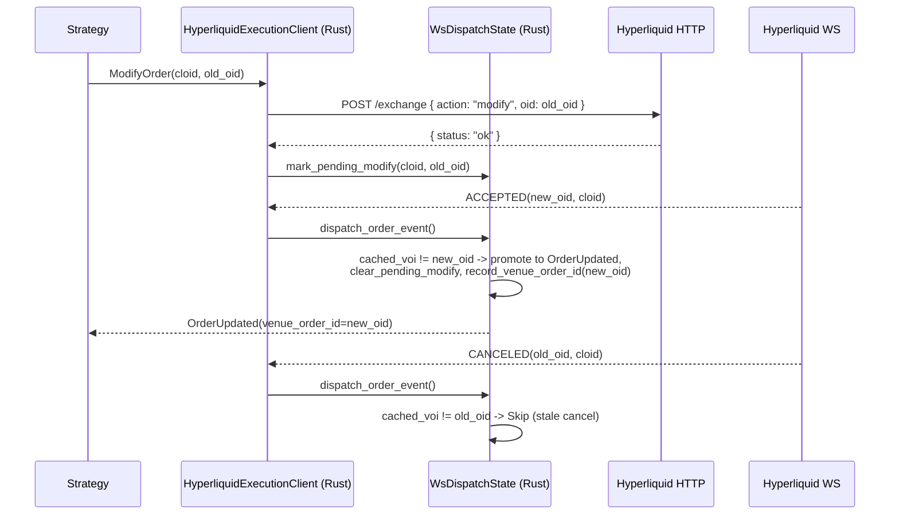

# Hyperliquid

[Hyperliquid](https://hyperliquid.gitbook.io/hyperliquid-docs) 是一个去中心化永续期货（Perpetual Futures）
和现货交易所，构建在 Hyperliquid L1 之上——这是一条专为交易优化的定制区块链。
HyperCore 提供完全链上的订单簿（Order Book）和撮合引擎。此集成（Integration）支持
Hyperliquid 上的实时市场数据（Data）摄取和订单执行（Execution）。

## 概述

此适配器（Adapter）使用 Rust 实现，并提供 Python 绑定。它直接集成
Hyperliquid 的 REST 和 WebSocket API，无需依赖外部客户端库。

Hyperliquid 适配器包含多个组件：

- `HyperliquidHttpClient`：底层 HTTP API 连接。
- `HyperliquidWebSocketClient`：底层 WebSocket API 连接。
- `HyperliquidInstrumentProvider`：金融工具（Instrument）解析和加载功能。
- `HyperliquidDataClient`：市场数据源管理器。
- `HyperliquidExecutionClient`：账户管理和交易执行网关。
- `HyperliquidLiveDataClientFactory`：Hyperliquid 数据客户端工厂（供交易节点构建器使用）。
- `HyperliquidLiveExecClientFactory`：Hyperliquid 执行客户端工厂（供交易节点构建器使用）。

:::note
大多数用户只需为实盘交易节点定义配置（如下所示），
无需直接使用这些底层组件。
:::

## 示例

您可以在[此处](https://github.com/nautechsystems/nautilus_trader/tree/develop/examples/live/hyperliquid/)找到实时示例脚本。

## Builder code 归因

提交到主网的订单会携带 NautilusTrader 的 builder code，且费率为**零**，因此
归因不会增加任何交易成本。这有助于我们衡量该集成的真实使用情况，并据此
优先安排后续维护。归因订单流的用户在大规模交易时，还可能有资格通过
[Institutional](https://nautilustrader.io/institutional/) 等级获得直接支持。

您可以在序列化配置中设置 `include_builder_attribution: false`，或在 Python 中设置
`include_builder_attribution=False` 来选择退出归因。

在以下三种情况下，builder 地址会从订单中省略：

- **测试网（Testnet）**：Hyperliquid 测试网会拒绝包含钱包未显式批准的 builder 地址的订单
  （水龙头注资的测试网钱包通常没有批准记录），因此测试网订单永远不会包含 builder。
- **金库交易（Vault trading）**（已配置 `vault_address`）：Hyperliquid 不允许金库批准
  builder 费用，因此包含 builder 地址会导致交易所拒绝该订单。
- **归因已禁用**（`include_builder_attribution=False`）：选择不归因其订单流的用户
  可以显式禁用 builder 归因。

```python
from nautilus_trader.adapters.hyperliquid import HyperliquidExecClientConfig

config = HyperliquidExecClientConfig(
    include_builder_attribution=False,
)
```

### Builder 费用批准

Hyperliquid 要求先进行一次性的 `ApproveBuilderFee` 批准，订单才能携带 builder
地址：来自从未批准过 builder 费用的钱包的订单会被拒绝，原因为
`Builder fee has not been approved`（任何先前的批准，包括 0% 费率，都能满足
该检查）。批准必须由主钱包（master wallet）的私钥签名，而在代理（API）钱包配置中
适配器并不持有该私钥，因此它以一次性脚本的形式运行，而非在执行客户端
启动时运行。0% 的最高费率仅允许归因：永远不会收取任何 builder 费用，
而提高费率则需要由您签名一次新的批准。

每个钱包运行一次批准脚本（读取 `HYPERLIQUID_PK`，或在 `HYPERLIQUID_TESTNET=true`
时读取 `HYPERLIQUID_TESTNET_PK`）：

```bash
cargo run -p nautilus-hyperliquid --bin hyperliquid-builder-fee-approve
```

或从 Python：

```python
from nautilus_trader.adapters.hyperliquid import builder_fee_approve

builder_fee_approve()
```

### 撤销批准

使用撤销可将先前批准的 builder 费用上限设为 0%（例如，来自某个收取 builder
费用的版本的批准）。撤销只是给费用设置上限；它不会移除批准记录，因此
除非禁用 `include_builder_attribution`，否则归因仍会继续。

```bash
cargo run -p nautilus-hyperliquid --bin hyperliquid-builder-fee-revoke
```

或从 Python：

```python
from nautilus_trader.adapters.hyperliquid import builder_fee_revoke

builder_fee_revoke()
```

Rust 脚本会打印该操作的摘要，并在签名前暂停等待按下 Enter 键；
如果摘要中有任何看起来不对的地方，请用 `Ctrl+C` 中止，或传入 `--yes` 跳过提示。
Python 绑定不会提示：调用前请自行检查当前生效的环境变量。

## 测试网设置

Hyperliquid 提供测试网（Testnet）环境，用于使用模拟资金测试策略。

:::info
**需要主网账户。** Hyperliquid 的测试网水龙头仅对此前曾在主网充值过的钱包有效。
您必须先为主网账户注资，才能获取测试网 USDC。
:::

### 获取测试网资金

要领取测试网 USDC，您必须先使用同一钱包地址在**主网**充值过：

1. 访问 [Hyperliquid 主网门户](https://app.hyperliquid.xyz/) 并用您的钱包进行一笔充值。
2. 使用同一钱包访问[测试网水龙头](https://app.hyperliquid-testnet.xyz/drip)。
3. 从水龙头领取 1,000 模拟 USDC。

:::note
**邮箱钱包用户**：邮箱登录会为主网和测试网生成不同的地址。
要使用水龙头，请从主网导出您的邮箱钱包，导入到 MetaMask 或 Rabby 中，
然后将扩展程序连接到测试网。
:::

### 创建测试网账户

1. 访问 [Hyperliquid 测试网门户](https://app.hyperliquid-testnet.xyz/)。
2. 连接您的钱包（MetaMask、WalletConnect 或邮箱）。
3. 测试网会自动为您的钱包地址创建账户。

### 导出私钥

要在 NautilusTrader 中使用您的测试网账户，需要导出钱包的私钥：

**MetaMask：**

1. 点击账户旁边的三点菜单。
2. 选择 "Account details"。
3. 点击 "Show private key"。
4. 输入密码并复制私钥。

:::warning
**切勿分享您的私钥。**
请使用环境变量安全存储私钥，切勿将其提交到版本控制系统。
:::

### 设置环境变量

将测试网凭证设置为环境变量：

```bash
export HYPERLIQUID_TESTNET_PK="your_private_key_here"
# 可选：用于金库交易
export HYPERLIQUID_TESTNET_VAULT="vault_address_here"
```

当配置中设置 `environment=HyperliquidEnvironment.TESTNET` 时，适配器会自动加载这些变量。

:::warning
**代理 / API 钱包**：如果 `HYPERLIQUID_TESTNET_PK` 是一个在主账户下批准的
[代理钱包（agent wallet）](#agent-wallets)（在 Hyperliquid UI 上创建 API 钱包时的
典型配置），则您还必须将 `HYPERLIQUID_ACCOUNT_ADDRESS` 设置为主账户地址。否则，
即使订单在交易场所上是实时有效的，`OrderStatusReport` 请求和 WebSocket 用户源也会
返回空结果。参见 [GH-4010](https://github.com/nautechsystems/nautilus_trader/issues/4010)。
:::

## 产品支持

Hyperliquid 提供线性永续期货、HIP-3 builder 部署的永续合约、原生现货市场，
以及 HIP-4 二元结果市场。

| 产品类型          | 数据源 | 交易 | 说明                                                    |
|-------------------|--------|------|---------------------------------------------------------|
| 现货（Spot）      | ✓      | ✓    | 原生现货市场。                                          |
| 永续期货          | ✓      | ✓    | 以 USDC 结算的线性永续合约（验证者运营）。              |
| HIP-3 永续合约    | ✓      | ✓    | builder 部署的永续合约，按各 dex 独立抵押品。需选择启用。 |
| HIP-4 结果市场    | ✓      | ✓    | 以 USDH 结算的二元结果。需选择启用。                    |

:::note
标准 Hyperliquid 永续合约以 USDC 结算。HIP-3 dex 可能以其自身的抵押品代币结算，
例如 USDH、USDE 或 USDT0，同时 Nautilus 的代码仍以 `USD` 报价。现货市场是标准
货币对。配置和选择启用的细节参见 [HIP-3 builder 部署的永续合约](#hip-3-builder-deployed-perpetuals)
和 [HIP-4 结果市场](#hip-4-outcome-markets)。Hyperliquid 当前的 API 文档将
`outcomeMeta` 标记为仅测试网可用，因此 HIP-4 的发现取决于所选环境是否能提供
该 payload。
:::

## 交易代码（Symbology）

Hyperliquid 对金融工具使用特定的代码格式：

### 现货市场

格式：`{Base}-{Quote}-SPOT`

示例：

- `PURR-USDC-SPOT` - PURR/USDC 现货交易对
- `HYPE-USDC-SPOT` - HYPE/USDC 现货交易对

在策略中订阅：

```python
InstrumentId.from_str("PURR-USDC-SPOT.HYPERLIQUID")
```

:::note
现货工具可能包含金库代币（以 `vntls:` 为前缀）。这些由金融工具提供者自动处理。
:::

### 永续期货

格式：`{Base}-USD-PERP`

示例：

- `BTC-USD-PERP` - 比特币永续期货
- `ETH-USD-PERP` - 以太坊永续期货
- `SOL-USD-PERP` - Solana 永续期货

在策略中订阅：

```python
InstrumentId.from_str("BTC-USD-PERP.HYPERLIQUID")
InstrumentId.from_str("ETH-USD-PERP.HYPERLIQUID")
```

### HIP-3 永续合约

格式：`{dex}:{Asset}-USD-PERP`

[HIP-3](https://hyperliquid.gitbook.io/hyperliquid-docs/hyperliquid-improvement-proposals-hips/hip-3-builder-deployed-perpetuals)
市场使用以冒号分隔的 dex 前缀。dex 名称标识该市场所属的 builder 部署的永续 dex。

示例：

- `xyz:TSLA-USD-PERP` - trade.xyz 上的特斯拉永续合约
- `xyz:GOLD-USD-PERP` - trade.xyz 上的黄金永续合约
- `flx:NVDA-USD-PERP` - Felix 上的英伟达永续合约
- `vntl:SPACEX-USD-PERP` - Ventuals 上的 SpaceX 永续合约

在策略中订阅：

```python
InstrumentId.from_str("xyz:TSLA-USD-PERP.HYPERLIQUID")
```

### HIP-4 结果方代币（outcome side tokens）

格式：`{outcome_index}-{YES|NO}-OUTCOME.HYPERLIQUID`，其中 `outcome_index`
是 `outcomeMeta` 中的 `outcome` 字段，中间段命名二元的一方。`-OUTCOME` 后缀
与 `-PERP` / `-SPOT` 对称。

[HIP-4](https://hyperliquid.gitbook.io/hyperliquid-docs/hyperliquid-improvement-proposals-hips/hip-4-outcome-markets)
结果方代币是二元合约，以 USDH 在 `0`（输方）或 `1`（赢方）结算。
Nautilus 代码使用上面那种人类可读的形式；线路（wire）上的 `raw_symbol`
使用交易场所的 coin 形式 `#{encoding}`（其中
`encoding = 10 * outcome_index + side`，`side` 为 `0` 表示 Yes / `1` 表示 No），
这也是 `l2Book` 和 `allMids` 接受的形式。

示例（outcome 25）：

- `25-YES-OUTCOME.HYPERLIQUID`：Yes 方。Encoding 为 `250`，线路 coin 为 `#250`，
  代币名为 `+250`，action asset id 为 `100_000_250`。
- `25-NO-OUTCOME.HYPERLIQUID`：No 方。Encoding 为 `251`，线路 coin 为 `#251`，
  代币名为 `+251`，action asset id 为 `100_000_251`。

在策略中订阅：

```python
InstrumentId.from_str("25-YES-OUTCOME.HYPERLIQUID")
```

:::note
结果（outcome）的全集是循环的。每次结算都会从 `outcomeMeta` 中移除已解决的
结果，而交易场所的下一次上架会推进索引。可用以下命令检查实时全集：
`curl -s -X POST https://api.hyperliquid.xyz/info -d '{"type":"outcomeMeta"}'`。
:::

关于交易流程、结算和当前限制，参见 [HIP-4 结果市场](#hip-4-outcome-markets)。

## HIP-3 builder 部署的永续合约

[HIP-3](https://hyperliquid.gitbook.io/hyperliquid-docs/hyperliquid-improvement-proposals-hips/hip-3-builder-deployed-perpetuals)
允许符合资格的部署者在 Hyperliquid 上启动无需许可的永续 dex。这些市场涵盖
股票（TSLA、NVDA、AAPL）、大宗商品（黄金、原油）、指数（标普 500），以及
IPO 前代币（SpaceX、OpenAI）。

HIP-3 工具默认被排除。要加载它们，请在请求的产品类型中包含
`HyperliquidProductType.PERP_HIP3`。

直接使用金融工具提供者：

```python
from nautilus_trader.adapters.hyperliquid.enums import HyperliquidProductType
from nautilus_trader.adapters.hyperliquid.providers import HyperliquidInstrumentProvider

provider = HyperliquidInstrumentProvider(
    client=client,
    product_types=[
        HyperliquidProductType.PERP,
        HyperliquidProductType.SPOT,
        HyperliquidProductType.PERP_HIP3,
    ],
)
```

在实盘 `TradingNode` 中使用时，将相同的 `product_types` 通过 Hyperliquid
客户端配置传入：

```python
from nautilus_trader.adapters.hyperliquid import HyperliquidDataClientConfig
from nautilus_trader.adapters.hyperliquid import HyperliquidExecClientConfig
from nautilus_trader.adapters.hyperliquid import HyperliquidEnvironment
from nautilus_trader.adapters.hyperliquid import HyperliquidProductType

HyperliquidDataClientConfig(
    product_types=(
        HyperliquidProductType.PERP,
        HyperliquidProductType.PERP_HIP3,
    ),
)

HyperliquidExecClientConfig(
    product_types=(
        HyperliquidProductType.PERP,
        HyperliquidProductType.PERP_HIP3,
    ),
)
```

一旦加载了 HIP-3 工具，您可以用 `InstrumentProviderConfig` 对其进行筛选：

```python
instrument_provider=InstrumentProviderConfig(
    load_all=True,
    filters={"market_types": ["perp_hip3"]},
)
```

### 与标准永续合约的区别

HIP-3 市场在同一个 HyperCore 撮合引擎上交易，并使用相同的订单 API。
主要区别如下：

- **更高的费用**：默认为标准永续费用的 2 倍。部署者获得其中的一半。
- **逐仓保证金（Isolated margin）**：HIP-3 市场默认仅支持逐仓保证金。
- **按 dex 独立抵押品**：每个 HIP-3 dex 通过其在 `allPerpMetas` 中的
  `collateralToken` 条目声明其结算代币。Nautilus 通过 `spotMeta` 解析该代币，
  并将代码的报价腿保持为 `USD`。如果某个非 USDC 抵押品代币无法从 `spotMeta`
  解析，工具加载会返回错误，而不是回退到 USDC。
- **部署者管理的预言机**：由部署者运营预言机源，而非验证者。
- **增长模式（Growth mode）**：部分 dex 启用增长模式，可将协议费用降低 90%。

完整的协议细节，参见 Hyperliquid 文档：

- [HIP-3 提案](https://hyperliquid.gitbook.io/hyperliquid-docs/hyperliquid-improvement-proposals-hips/hip-3-builder-deployed-perpetuals)
- [HIP-3 部署者操作](https://hyperliquid.gitbook.io/hyperliquid-docs/for-developers/api/hip-3-deployer-actions)
- [Asset IDs](https://hyperliquid.gitbook.io/hyperliquid-docs/for-developers/api/asset-ids)
- [费用](https://hyperliquid.gitbook.io/hyperliquid-docs/trading/fees)

### 通配符字符净化

一些 HIP-3 dex 部署的资产，其交易场所名称包含 `*` 或 `?` 字节
（例如 `dex:STREAMABCD****-USD-PERP`）。这些字节与 Nautilus 消息总线的
模式语法（`*` = 零个或多个，`?` = 一个字符）冲突，如果原样嵌入到主题字符串中，
会破坏订阅路由。

Hyperliquid 适配器在构造 `InstrumentId.symbol` 时会将这两个字节都替换为 `x`，
因此一个名为 `dex:STREAMABCD****` 的 HIP-3 资产对策略呈现为：

```python
InstrumentId.from_str("dex:STREAMABCDxxxx-USD-PERP.HYPERLIQUID")
```

该替换仅应用于主题、缓存、日志和配置中使用的 Nautilus 内部代码。
交易场所官方名称被保留在工具的 `raw_symbol` 字段中，供 HTTP 和 WebSocket
线路调用使用，而订单提交引用的是数值型资产索引，因此与 Hyperliquid 的
往返过程不受影响。

订阅交易场所名称中包含通配符字节的 HIP-3 工具时，请使用净化后的形式。
不含 `*` 或 `?` 的代码会原样透传。

该替换是有损的：两个不同的交易场所名称，例如 `dex:FOO*` 和 `dex:FOO?`，
会归一化为同一个 Nautilus 代码。工具加载器会检测冲突，保留第一个定义，
并记录一条带有被丢弃交易场所名称的警告；被丢弃的工具在交易场所重命名
解决该冲突之前，将无法通过 Nautilus 交易。

## HIP-4 结果市场

[HIP-4](https://hyperliquid.gitbook.io/hyperliquid-docs/for-developers/api/asset-ids#outcomes)
市场是全额抵押的二元合约。每个市场有两个结果方代币（Yes / No），它们在
解决日（resolution date）结算为 `1 USDH`（赢方）或 `0 USDH`（输方）。
Hyperliquid 当前的 API 文档通过 `outcomeMeta` 暴露结果元数据，并将该端点
标记为仅测试网可用。适配器将结果元数据视为尽力而为（best-effort），当
交易场所不返回该 payload 时，会跳过 HIP-4 工具。

### 加载结果工具

在数据客户端和执行客户端配置上的 `product_types` 中都包含
`HyperliquidProductType.OUTCOME`。这会在交易场所暴露 `outcomeMeta` 时选择
启用结果发现；Hyperliquid 当前文档将该元数据端点标记为仅测试网可用。

```python
from nautilus_trader.adapters.hyperliquid import HyperliquidDataClientConfig
from nautilus_trader.adapters.hyperliquid import HyperliquidProductType

HyperliquidDataClientConfig(
    product_types=(
        HyperliquidProductType.SPOT,
        HyperliquidProductType.PERP,
        HyperliquidProductType.OUTCOME,
    ),
)
```

提供者为每个结果发出两个 `BinaryOption` 工具（每方一个），以 USDH 计价。
代码使用 `{outcome_index}-{YES|NO}-OUTCOME.HYPERLIQUID` 形式。`expiration_ns`
从交易场所描述（`expiry:YYYYMMDD-HHMM`，UTC）解析。独立的二元合约携带其
自身的到期时间；命名结果和回退（fallback）结果继承自其父问题。默认值：
每跳（tick）`0.0001`，每手（lot）`0.01`。

每个工具的 `BinaryOption.info` 以键/值映射的形式携带解析后的交易场所元数据
（在 Python 中通过 `info["key"]` 消费，在 Rust 中通过 `Params.get_str(...)`）。
派生的标识符始终被填充；来自描述的字段在交易场所包含它们时才出现。

| 字段               | 来源                           | 说明                                              |
|--------------------|--------------------------------|---------------------------------------------------|
| `outcome_index`    | 派生                           | 来自 `outcomeMeta` 的 `outcome`                   |
| `outcome_side`     | 派生                           | `0` = Yes，`1` = No                               |
| `side_name`        | 派生                           | `"Yes"` 或 `"No"`                                 |
| `encoding`         | 派生                           | `10 * outcome_index + side`                       |
| `asset_id`         | 派生                           | `100_000_000 + encoding`                          |
| `market_name`      | `outcomeMeta.outcomes[*].name` | 交易场所市场标签                                  |
| `class`            | 描述                           | `priceBinary` 或 `priceBucket`                    |
| `underlying`       | 描述                           | 标的资产代码                                      |
| `expiry`           | 描述                           | `YYYYMMDD-HHMM` UTC                               |
| `target_price`     | 描述                           | 二元结算阈值                                      |
| `period`           | 描述                           | 重复周期（例如 `1d`、`3m`）                       |
| `price_thresholds` | 描述                           | 逗号分隔的阈值（bucket 市场）                     |
| `named_index`      | 命名结果描述                   | 在父 `named_outcomes` 数组中的位置                |
| `is_fallback`      | 回退结果描述                   | 对于问题的 `other` 结果为 `true`                 |
| `question`         | 父问题                         | 问题 id                                           |
| `question_name`    | 父问题                         | 问题标签                                          |
| `question_*`       | 父问题描述                     | 每个解析出的问题字段，带 `question_` 前缀         |

描述键从交易场所的 camelCase 转为 snake_case
（`targetPrice` -> `target_price`，`priceThresholds` -> `price_thresholds`）。
值保持为字符串以保留线路保真度；数值型标识符
（`outcome_index`、`outcome_side`、`encoding`、`asset_id`、`question`、
`named_index`）以 JSON 数字形式存储。

### 结算货币

结果以 USDH 结算（代币索引 360，在 `USDH/USDC` 现货对 `@230` 上交易）。
适配器在首次创建结果工具时以 8 位小数精度注册 USDH，因此
`BinaryOption.currency`、`quote_currency` 以及零费用结果成交上的佣金货币
都解析为 USDH。

USDH 现货余额与永续清算所（perp clearinghouse）视图合并，因此 `AccountState`
会与 USDC 及任何其他非零现货持仓一起携带 USDH。

### 交易流程

结果方代币（`{outcome_index}-{YES|NO}-OUTCOME.HYPERLIQUID`）通过标准订单路径
交易。像对任何永续或现货工具那样提交 `SubmitOrder`；执行客户端会通过相同的
`Order` action 将其路由到交易场所的 `#{encoding}` 订单簿（其中
`encoding = 10 * outcome_index + outcome_side`）。无需任何 HIP-4 专属调用。

结算由交易场所驱动；参见[结算分发](#settlement-dispatch)。

#### 高级工作流

对于需要在订单簿外管理结果方代币库存的策略，可以在
`HyperliquidHttpClient`（Rust 和 PyO3）上直接访问完整的 `userOutcome` action 集：

```python
from decimal import Decimal
from nautilus_trader.core.nautilus_pyo3 import HyperliquidEnvironment
from nautilus_trader.core.nautilus_pyo3 import HyperliquidHttpClient

client = HyperliquidHttpClient.from_env(HyperliquidEnvironment.MAINNET)

# 从 USDH 铸造配对的 Yes + No 结果方代币（例如双向做市）
await client.submit_split_outcome(50, Decimal("1.0"))

# 将配对的 Yes + No 销毁回 USDH（amount=None 合并最大数量）
await client.submit_merge_outcome(50, None)

# 多结果 priceBucket 辅助方法
await client.submit_merge_question(9, None)
await client.submit_negate_outcome(9, 52, Decimal("1.0"))
```

| Action                  | 用例 |
|-------------------------|------|
| `submit_split_outcome`  | 从报价货币铸造配对的 Yes + No 代币（初始做市、双向对冲） |
| `submit_merge_outcome`  | 将配对的 Yes + No 销毁回报价货币，无需穿越价差 |
| `submit_merge_question` | 原子地将完整的多结果篮子平回报价货币 |
| `submit_negate_outcome` | 将某个结果的 No 份额转换为同一问题中其余每个结果的 Yes 份额 |

对于方向性押注，普通的 `SubmitOrder` 路径就足够了；只有当您想在订单簿外
创建或销毁结果方代币库存时，才需要上面这些方法。

### 订单约束

结果方代币的行为类似现货代币（无保证金、无资金费、无强平）。执行客户端
会拒绝不适用的功能：

- `reduce_only` 订单。
- 触发型订单类型（`StopMarket`、`StopLimit`、`MarketIfTouched`、
  `LimitIfTouched`、追踪止损）。

支持有效时间为 `GTC`、`IOC` 或 `ALO` 的 `Limit` 和 `Market` 订单。交易场所
的最小名义价值为 10 USDH；请设置 `order_qty`，使得
`order_qty * limit_price >= 10`。

### 结算分发

到期时，交易场所会平掉所持的结果方代币余额，并为每一方发出一个 `Settlement`
成交。适配器通过标准的用户成交流（HTTP 轮询和 WebSocket）消费这些成交；
不会运行合成分发。

每个结算成交：

- `order_side = SELL`，零佣金。
- 赢方价格为 `1` USDH，输方为 `0`。
- 作为 `FillReport` 呈现。
- 当 WebSocket 分发将持仓关联到被跟踪的订单时，也会发出 `OrderFilled`。

统一覆盖独立的 `priceBinary` 结果和多结果 `priceBucket` 问题。

### 持仓对账

HIP-4 结果方代币在 `spotClearinghouseState` 上到达时，`coin` 被设为 `+E`
代币形式且没有 `token` 字段。适配器：

- 在反序列化期间将 `SpotBalance.token` 视为可选。
- 在生成 `PositionStatusReport` 时，将 `+E` / `#E` coin 解析为其对应的
  `BinaryOption` 工具。
- 当持仓状态筛选器是一个结果工具时，跳过永续清算所的获取
  （结果永远不会出现在 `assetPositions` 中）。

### 多结果（priceBucket）市场

交易场所通过 `outcomeMeta` 中顶层的 `questions` 数组暴露多结果市场。每个问题
引用一个回退结果加上一系列命名结果，这些命名结果各自的描述通过 `index:N`
指回该问题。每个结果方代币被建模为一个独立的 `BinaryOption` 工具；
`HyperliquidHttpClient` 上的 `submit_merge_question` 和 `submit_negate_outcome`
action 在问题层级操作，用于篮子平仓和跨结果轮换。

## 金融工具提供者

金融工具提供者支持在通过 `InstrumentProviderConfig(filters=...)` 加载工具时
进行筛选：

| 筛选键                      | 类型        | 描述                                        |
|-----------------------------|-------------|---------------------------------------------|
| `market_types`（或 `kinds`）| `list[str]` | `"perp"`、`"perp_hip3"` 或 `"spot"`。       |
| `bases`                     | `list[str]` | 基础货币代码，例如 `["BTC", "ETH"]`。       |
| `quotes`                    | `list[str]` | 报价货币代码，例如 `["USDC"]`。             |
| `symbols`                   | `list[str]` | 完整代码，例如 `["BTC-USD-PERP"]`。         |

仅加载永续工具的示例：

```python
instrument_provider=InstrumentProviderConfig(
    load_all=True,
    filters={"market_types": ["perp"]},
)
```

## 数据订阅

适配器支持以下数据订阅。所有永续数据类型（标记价格、指数价格、资金费率）
同时适用于标准永续合约和 HIP-3 永续合约。

| 数据类型          | 订阅 | 快照 | 历史 | Nautilus 类型                 | 说明                                  |
|-------------------|------|------|------|-------------------------------|---------------------------------------|
| 成交 ticks        | ✓    | -    | -    | `TradeTick`                   | WebSocket 成交。                      |
| 报价 ticks        | ✓    | -    | -    | `QuoteTick`                   | 最优买价/卖价。                       |
| 订单簿增量        | ✓    | ✓    | -    | `OrderBookDelta`              | L2 快照。                            |
| 订单簿深度        | ✓    | -    | -    | `OrderBookDepth10`            | 前 10 档 L2 快照。                    |
| Bars              | ✓    | -    | ✓    | `Bar`                         | 支持的时间间隔见下文。               |
| 标记价格          | ✓    | -    | -    | `MarkPriceUpdate`             | 永续标记价格 ticks。                 |
| 指数价格          | ✓    | -    | -    | `IndexPriceUpdate`            | 标的参考价格。                       |
| 资金费率          | ✓    | -    | ✓    | `FundingRateUpdate`           | `fundingHistory` 端点。              |
| 未平仓合约        | ✓    | -    | -    | `HyperliquidOpenInterest`     | 来自 `activeAssetCtx` 的自定义数据。 |
| 全部中间价        | ✓    | -    | -    | `HyperliquidAllMids`          | 来自 `allMids` 的自定义数据。        |
| 全部 dex 上下文   | ✓    | -    | -    | `HyperliquidAllDexsAssetCtxs` | 来自 `allDexsAssetCtxs` 的自定义数据。|

:::note
不支持历史报价和成交请求。Hyperliquid 不发布公开的成交带（trade-tape）端点；
实时成交可通过 WebSocket 的 `trades` 频道获取。`request_trades` 会返回明确的错误。
:::

### 订单簿精度控制

`l2Book` 订阅接受可选的 `nSigFigs` 和 `mantissa` 参数，用于稀释交易场所侧的
订单簿聚合。适配器在通过订单簿增量和深度订阅的 `subscribe_params` 传入时
会将它们转发。

Hyperliquid 接受的 `nSigFigs` 值为 `2`、`3`、`4`、`5`，或省略以获得完整精度。
`mantissa` 仅在 `nSigFigs=5` 时有效，并接受 `1`、`2` 或 `5`。

```python
from nautilus_trader.model.data import BookType

self.subscribe_order_book_deltas(
    instrument_id=instrument_id,
    book_type=BookType.L2_MBP,
    params={"n_sig_figs": 5, "mantissa": 2},
)
```

两个参数都省略时，将订阅完整深度的订单簿。

### Hyperliquid 专属数据

适配器发出两种 Hyperliquid 专属的自定义数据类型：

- `HyperliquidAllMids`，来自 WebSocket 的 `allMids` 源。每次更新在一个 payload
  中携带所有当前报告的中间价。
- `HyperliquidAllDexsAssetCtxs`，来自 WebSocket 的 `allDexsAssetCtxs` 源。
  每次更新携带跨默认永续 dex 和 HIP-3 builder dex 的、按工具归一化的
  资产上下文条目。
- `HyperliquidOpenInterest`，来自标记价格、指数价格和资金费率所共用的
  `activeAssetCtx` 源。

| 字段       | 类型             | 描述                                                     |
|------------|------------------|----------------------------------------------------------|
| `mids`     | `dict[str, str]` | 工具 ID 到中间价的映射。                                 |
| `ts_event` | `int`            | 更新发生时的 UNIX 纳秒时间戳。                           |
| `ts_init`  | `int`            | 对象构建时的 UNIX 纳秒时间戳。                           |

从 actor 或策略中使用 `DataType(HyperliquidAllMids)` 进行订阅。
对于 HIP-3 dex 专属的流，请在 `metadata["dex"]` 中传入交易场所 dex：

```python
from nautilus_trader.adapters.hyperliquid.constants import HYPERLIQUID_CLIENT_ID
from nautilus_trader.adapters.hyperliquid.data import HyperliquidAllMids
from nautilus_trader.model.data import DataType

self.subscribe_data(
    data_type=DataType(HyperliquidAllMids, metadata={"dex": "hyperliquid"}),
    client_id=HYPERLIQUID_CLIENT_ID,
)
```

`HyperliquidOpenInterest` 携带某个永续工具的最新未平仓合约。请在
`metadata["instrument_id"]` 中以规范的 Nautilus `instrument_id` 进行订阅：

| 字段            | 类型           | 描述                                                                        |
|-----------------|----------------|-----------------------------------------------------------------------------|
| `instrument_id` | `InstrumentId` | 规范的 Nautilus 工具 ID。                                                   |
| `open_interest` | `Decimal`      | 已解析为可直接算术运算的未平仓合约。                                        |
| `ts_event`      | `int`          | 更新发生时的 UNIX 纳秒时间戳。镜像 `ts_init`。                              |
| `ts_init`       | `int`          | 对象构建时的 UNIX 纳秒时间戳。                                              |

```python
from nautilus_trader.adapters.hyperliquid import HYPERLIQUID_CLIENT_ID
from nautilus_trader.adapters.hyperliquid import HyperliquidOpenInterest
from nautilus_trader.model.data import DataType

self.subscribe_data(
    data_type=DataType(
        HyperliquidOpenInterest,
        metadata={"instrument_id": str(self.instrument_id)},
    ),
    client_id=HYPERLIQUID_CLIENT_ID,
)
```

`HyperliquidOpenInterest` 复用与同一币种的标记价格、指数价格和资金费率
所共用的那个底层 `activeAssetCtx` 交易场所订阅。增加 OI 不会开启第二个
并行的 `activeAssetCtx` 订阅。

在 `TradingNode` 内运行的 Python 策略中，payload 会以具体的自定义数据类型
本身的形式投递到 `on_data`：

```python
from decimal import Decimal

from nautilus_trader.adapters.hyperliquid import HyperliquidOpenInterest

def on_data(self, data) -> None:
    if isinstance(data, HyperliquidOpenInterest):
        if data.open_interest > Decimal("1000"):
            self.log.info(f"OI {data.instrument_id} -> {data.open_interest}")
```

`HyperliquidAllDexsAssetCtxs` 暴露的是整个源的聚合，而非每个工具一个主题，
因此策略只需订阅一次，再筛选出它们需要的归一化条目：

| 字段              | 类型                              | 描述                                                                       |
|-------------------|-----------------------------------|----------------------------------------------------------------------------|
| `dex`             | `str`                             | 来自 Hyperliquid `perpDexs` 的永续 dex 标识符。`""` 是默认 dex。           |
| `instrument_id`   | `InstrumentId`                    | 该条目对应的规范 Nautilus 工具 ID。                                        |
| `mark_price`      | `Price`                           | 当前标记价格。                                                            |
| `oracle_price`    | `Price`                           | 当前预言机 / 指数参考价格。                                               |
| `prev_day_price`  | `Price`                           | 来自交易场所 payload 的前一日参考价格。                                    |
| `mid_price`       | `Price \| None`                   | 交易场所 payload 中存在时的中间价。                                        |
| `impact_prices`   | `HyperliquidImpactPrices \| None` | 存在时的最优买/卖冲击价格。                                                |
| `funding_rate`    | `Decimal`                         | 已解析为可直接算术运算的资金费率。                                        |
| `open_interest`   | `Decimal`                         | 已解析为可直接算术运算的未平仓合约。                                      |
| `premium`         | `Decimal \| None`                 | 交易场所 payload 中存在时的溢价。                                          |
| `day_ntl_volume`  | `Decimal`                         | 24 小时名义成交量。                                                       |
| `day_base_volume` | `Decimal`                         | 24 小时基础成交量。                                                       |
| `ts_event`        | `int`                             | 更新发生时的 UNIX 纳秒时间戳。镜像 `ts_init`。                            |
| `ts_init`         | `int`                             | 对象构建时的 UNIX 纳秒时间戳。                                            |

底层的 Hyperliquid 线路 payload 以 `ctxs: [[dex, ctxs[]], ...]` 形式到达。
适配器解码这种实时交易场所格式，并在策略看到数据之前将其归一化为下面所示的
每条目输出。

适配器不会臆造 `dex` 值。它从 Hyperliquid `meta` / `allPerpMetas` 引导出
有序的 dex 全集，并从实时的 `perpDexs` 信息端点解析 builder dex 标识符。
空字符串 `""` 代表 Hyperliquid 的默认永续 dex；诸如 `xyz`、`flx` 或 `vntl`
这样的非空值是交易场所定义的 builder dex 标识符。

该映射在连接时从已加载的工具中解析，且该源是按位置排列的（每条目没有币种名），
因此较晚上市的永续合约只有在重连后才会出现。某个 dex 的上下文计数不匹配时
会记录一条建议重连的警告；条目仍按位置保持对齐，这对于追加上市的情况是正确的。

```python
from nautilus_trader.adapters.hyperliquid import HYPERLIQUID_CLIENT_ID
from nautilus_trader.adapters.hyperliquid import HyperliquidAllDexsAssetCtxs
from nautilus_trader.model.data import DataType

self.subscribe_data(
    data_type=DataType(HyperliquidAllDexsAssetCtxs),
    client_id=HYPERLIQUID_CLIENT_ID,
)

def on_data(self, data) -> None:
    if isinstance(data, HyperliquidAllDexsAssetCtxs):
        for entry in data.entries:
            if entry.dex == "xyz":
                self.log.info(f"{entry.instrument_id} OI={entry.open_interest}")
```

### 支持的 Bar 时间间隔

| 分辨率     | Hyperliquid K 线   |
|------------|--------------------|
| 1-MINUTE   | `1m`               |
| 3-MINUTE   | `3m`               |
| 5-MINUTE   | `5m`               |
| 15-MINUTE  | `15m`              |
| 30-MINUTE  | `30m`              |
| 1-HOUR     | `1h`               |
| 2-HOUR     | `2h`               |
| 4-HOUR     | `4h`               |
| 8-HOUR     | `8h`               |
| 12-HOUR    | `12h`              |
| 1-DAY      | `1d`               |
| 3-DAY      | `3d`               |
| 1-WEEK     | `1w`               |
| 1-MONTH    | `1M`               |

## 订单功能

Hyperliquid 支持一套全面的订单类型和执行选项。

:::note
在下面的表格中，"永续合约（Perpetuals）"同时涵盖标准的验证者运营永续合约和
HIP-3 builder 部署的永续合约。相同的订单类型、有效时间选项和执行指令
适用于两者。
:::

### 订单类型

| 订单类型            | 永续合约   | 现货 | 说明                                                |
|---------------------|------------|------|-----------------------------------------------------|
| `MARKET`            | ✓          | ✓    | 以 IOC 限价单方式执行，从最优 BBO 起带可配置的滑点。 |
| `LIMIT`             | ✓          | ✓    |                                                     |
| `STOP_MARKET`       | ✓          | ✓    | 止损订单。                                          |
| `STOP_LIMIT`        | ✓          | ✓    | 带限价执行的止损订单。                              |
| `MARKET_IF_TOUCHED` | ✓          | ✓    | 市价止盈。                                          |
| `LIMIT_IF_TOUCHED`  | ✓          | ✓    | 带限价执行的止盈。                                  |

:::info
条件订单（止损和触价订单）使用 Hyperliquid 原生的触发订单功能实现，
并自动检测 TP/SL 模式。所有触发订单都根据
[标记价格](https://hyperliquid.gitbook.io/hyperliquid-docs/trading/robust-price-indices)
进行评估。
:::

:::note
市价订单需要已缓存的报价数据。适配器使用最优卖价（买入时）或最优买价
（卖出时）加上一个可配置的滑点缓冲（默认 50 bps）。价格在提交前会舍入到
Hyperliquid 的价格约束。请确保您为打算用市价订单交易的任何工具订阅了报价。

使用 Rust 原生执行客户端时，滑点缓冲由 `HyperliquidExecClientConfig` 上的
`market_order_slippage_bps` 控制，并可通过 `SubmitOrder.params` 中的
`market_order_slippage_bps` 键按订单覆盖。Python `TradingNode` 路径使用固定的
50 bps 滑点，并且其配置上不暴露此旋钮。
:::

:::note
`STOP_MARKET` 和 `MARKET_IF_TOUCHED` 订单不携带限价。适配器使用相同的可配置
滑点缓冲（默认 50 bps）从触发价格派生一个限价，舍入到 5 位有效数字，并钳制到
交易场所的小数限制（买入时向上取整，卖出时向下取整）。这能保证 Hyperliquid 的
`limit_px >= trigger_px`（买入）/ `limit_px <= trigger_px`（卖出）约束。
:::

:::warning
**价格归一化默认启用。** Hyperliquid 对订单价格强制最多 5 位有效数字，外加一个
基于 `szDecimals` 的按资产小数限制（永续合约为 `6 - szDecimals`，现货为
`8 - szDecimals`）。例如，如果 ETH 的交易价格为 $2,600（4 位整数），则尽管工具
具有 `price_precision=2`，也只允许 1 位小数。

默认情况下，适配器会将所有发出的限价和触发价格归一化到 5 位有效数字，并将其
钳制到工具的价格精度，以防止订单被拒绝。这意味着您提交的价格可能会略有偏移。
要禁用此功能并完全掌控价格格式化，请在您的 `HyperliquidExecClientConfig` 中设置
`normalize_prices=False`。

如果您禁用归一化，可以在您的策略中应用相同的舍入：

```python
from decimal import Decimal, ROUND_DOWN

def round_to_sig_figs(price: Decimal, sig_figs: int = 5) -> Decimal:
    if price == 0:
        return Decimal(0)
    shift = sig_figs - int(price.adjusted()) - 1
    if shift <= 0:
        factor = Decimal(10) ** (-shift)
        return (price / factor).to_integral_value() * factor
    return round(price, shift)
```

:::

### 有效时间

| 有效时间      | 永续合约   | 现货 | 说明                 |
|---------------|------------|------|----------------------|
| `GTC`         | ✓          | ✓    | Good Till Canceled（撤销前有效）。 |
| `IOC`         | ✓          | ✓    | Immediate or Cancel（立即成交或撤销）。 |
| `FOK`         | -          | -    | *不支持*。           |
| `GTD`         | -          | -    | *不支持*。           |

### 执行指令

| 指令          | 永续合约   | 现货 | 说明                             |
|---------------|------------|------|----------------------------------|
| `post_only`   | ✓          | ✓    | 等同于 ALO 有效时间。            |
| `reduce_only` | ✓          | ✓    | 仅平仓订单。                    |

:::info
会立即撮合成交的 post-only 订单会被 Hyperliquid 拒绝。适配器会检测到这一点
并生成一个 `OrderRejected` 事件。Post-only 订单通过 Hyperliquid 的 ALO
（Add-Liquidity-Only，仅增加流动性）通道路由。
:::

### 订单操作

| 操作              | 永续合约   | 现货 | 说明                                                  |
|-------------------|------------|------|-------------------------------------------------------|
| 提交订单          | ✓          | ✓    | 单笔订单提交。                                        |
| 提交订单列表      | ✓          | ✓    | 批量订单提交（单次 API 调用）。                       |
| 修改订单          | ✓          | ✓    | 需要交易场所订单 ID。                                 |
| 撤销订单          | ✓          | ✓    | 通过客户端订单 ID 撤销。                              |
| 撤销全部订单      | ✓          | ✓    | 对未结订单进行单次批量 `cancelByCloid`。             |
| 批量撤销          | ✓          | ✓    | 对所提供列表进行单次批量 `cancelByCloid`。           |

:::info
当交易场所在批量撤销响应中返回某个订单的权威性拒绝时（例如对已处于终态的
订单返回 `MissingOrder`），适配器会为该订单发出一个 `OrderCancelRejected` 事件，
并保持其他撤销不受影响。整个请求失败且交易场所结果未知时，不会携带这种
按订单的证据。
:::

:::info
在 NautilusTrader 之外下达的订单（例如通过 Hyperliquid 网页 UI 或其他客户端）
会被检测并作为外部订单跟踪。它们会出现在订单状态报告和持仓对账中。
:::

### 修改即撤销-重下（cancel-replace）

Hyperliquid 将订单修改实现为**撤销-重下（cancel-replace）**。
[exchange 端点](https://hyperliquid.gitbook.io/hyperliquid-docs/for-developers/api/exchange-endpoint#modify-an-order)
上的 `modify` action 会撤销原始订单（旧的 `oid`），并以一个新的 `oid` 开启一个
替换订单。两条腿共享同一个客户端订单 ID（`cloid`）。

modify 的 HTTP 响应只确认成功。随后
[`orderUpdates` WebSocket 订阅](https://hyperliquid.gitbook.io/hyperliquid-docs/for-developers/api/websocket/subscriptions)
会投递一个 `ACCEPTED(new_oid)` 状态报告，紧接着是针对原始腿的 `CANCELED(old_oid)`。

Rust 原生的 `HyperliquidExecutionClient`（通过 `HyperliquidExecutionClientFactory`
使用）在 Rust 侧通过执行客户端拥有的
[`WsDispatchState`](https://github.com/nautechsystems/nautilus_trader/tree/develop/crates/adapters/hyperliquid/src/websocket/dispatch.rs)
运行检测、去重和事件提升（promotion）。提交时，客户端以 `client_order_id` 为键
注册一个 `OrderIdentity`（策略、工具、方向、类型、数量、最后已知价格）。每个传入的
状态报告或成交都通过该分发路由：被跟踪的订单通过
`ExecutionEventEmitter::send_order_event` 发出类型化的 `OrderEventAny::*` 事件；
外部订单则回退到原始的 `OrderStatusReport` / `FillReport`，以便引擎进行对账。
该分发将报告的 `venue_order_id` 与该 `cloid` 的上次缓存值进行比较；当二者不同时，
它将 `ACCEPTED` 提升为 `OrderUpdated`，并抑制配对的过期撤销：

:::note
`nautilus_trader/adapters/hyperliquid/execution.py` 中的 Python
`HyperliquidExecutionClient` 仍在 `_handle_order_status_report_pyo3` 内部
运行其自己的等效检测，因为 pyo3 WebSocket 绑定会将原始报告转发给 Python。
下面描述的 Rust 分发是附加性的，用于 Rust 原生执行客户端。
:::



如果 Hyperliquid 对一个处理中的修改先投递 `CANCELED(old_oid)`、后投递
`ACCEPTED(new_oid)`，待处理修改（pending-modify）标记会让分发丢弃旧腿的撤销，
仍将随后的 `ACCEPTED` 通过 `OrderUpdated` 路径路由。该标记仅在确认 HTTP 成功后
才被设置，因此一个失败的修改绝不会留下过期的竞态状态。由于检测在其他情况下
依赖于已缓存的 `venue_order_id`，适配器还能恢复一个在 HTTP 调用上超时但仍然
到达交易场所的修改：最终的 WS `ACCEPTED(new_oid)` 看到旧的已缓存 `oid`，并
转换为 `OrderUpdated`。参见 [GH-3827](https://github.com/nautechsystems/nautilus_trader/issues/3827)。

:::note
当以下三个条件同时发生时，仍存在一个狭窄的边缘情况：

1. modify 的 HTTP 调用抛出异常（传输超时或连接错误）。
2. Hyperliquid 仍在交易所侧处理了该修改。
3. Hyperliquid 在 WebSocket 上先投递 `CANCELED(old_oid)`、后投递 `ACCEPTED(new_oid)`。

在条件 (1) 下，待处理修改标记没有被安装，因此提前到达的 `CANCELED(old_oid)`
会在替换的 `ACCEPTED(new_oid)` 到达之前作为 `OrderCanceled` 发出。周期性的
对账循环会根据交易所恢复正确的订单状态。
:::

针对替换腿的 `FillReport` 也可能抢在 `ACCEPTED(new_oid)` 之前到达。分发会缓冲
这类成交（当待处理修改标记已设置且报告的 `oid` 与缓存值不匹配时），并在
匹配的 `ACCEPTED` 到达时将它们排空，因此 `OrderFilled` 始终跟随在进行提升的
`OrderUpdated` 之后，并针对最新的状态。参见
[GH-3972](https://github.com/nautechsystems/nautilus_trader/issues/3972)。

:::note
有一个链式修改（chained-modify）的边缘情况被推迟处理：如果来自*前一条*腿的
延迟成交在一个*新的*处理中修改期间到达，而那个新修改随后失败，则被缓冲的成交
会被搁置，直到终态清理。对账（`request_fill_reports`）会恢复它。要完全解决这个
问题需要额外的设计工作（已退役 VOI 的跟踪，或在修改失败路径上排空）。
:::

## 订单簿

订单簿通过 L2 WebSocket 订阅维护。每条消息投递一个完整深度的快照
（清空 + 重建），而非增量增量（incremental deltas）。

:::note
存在一个限制：每个交易器实例对每个工具只能有一个订单簿。
:::

## 账户与持仓管理

`AccountState` 合并永续保证金和现货余额。永续保证金和全仓保证金使用情况
来自 `clearinghouseState`；非零现货代币（USDC、USDH、HYPE、金库代币、
HIP-4 结果方代币等）来自 `spotClearinghouseState`。当永续摘要存在时，
USDC 会被去重。

标准永续合约默认采用全仓保证金（cross margin）；HIP-3 永续合约默认采用
逐仓保证金（isolated）。连接时，执行客户端会根据 Hyperliquid 的清算所状态
对订单、成交和持仓进行对账。现货持仓从所持余额重建（仅多头）；HIP-4
结果方代币针对其匹配的 `BinaryOption` 工具进行对账。

:::note
杠杆直接通过 Hyperliquid 网页 UI 或 API 管理，而非通过适配器。
请在交易前在 Hyperliquid 上为每个工具设置您期望的杠杆。
:::

## 强平与 ADL 处理

Hyperliquid 通过 `userEvents` 订阅上的两个 WebSocket 接口来发出
交易场所发起的平仓信号：

- **`liquidation` 事件**：在账户被强平时发出。携带一个 `liquidation ID`、
  清算人地址、被清算用户、被清算名义持仓，以及被清算账户价值。适配器以
  warning 级别记录这些信息，以便运维可见。
- **成交级别的 `liquidation` 元数据**：`fills` 数组中的每个条目都可能携带一个
  可选的 `liquidation` 对象，包含 `method`、`markPx` 和 `liquidatedUser`。
  `method` 的值为 `market`（清算进订单簿）或 `backstop`（针对后备金库平仓，
  即当保险机制介入时相当于一次 ADL 平仓）。

适配器为每个强平成交发出标准的 `FillReport`。强平元数据会与成交一起记录，
以便您将平仓关联到交易场所侧的事件。无需任何策略侧的更改；现有的风控和
对账逻辑会像对待任何其他 TAKER 成交那样在这些成交上运行。

上游参考：

- [WebSocket `userEvents`（`liquidation` 和 `FillLiquidation`）](https://hyperliquid.gitbook.io/hyperliquid-docs/for-developers/api/websocket/subscriptions)
- [强平机制](https://hyperliquid.gitbook.io/hyperliquid-docs/trading/liquidations)

## 连接管理

适配器在 WebSocket 断开时使用指数退避（从 250ms 起，最高 5s）自动重连。
重连时，所有活动订阅会自动重新订阅，订单簿快照会被重建。无需任何手动干预。

每 30 秒发送一次心跳 ping 以保持连接存活（Hyperliquid 会在 60 秒后关闭
空闲连接）。

## API 凭证

向 Hyperliquid 客户端提供凭证有两种方式。要么将相应的值传给配置对象，
要么设置以下环境变量：

对于 Hyperliquid 主网客户端，您可以设置：

- `HYPERLIQUID_PK`
- `HYPERLIQUID_VAULT`（可选，用于金库交易）

对于 Hyperliquid 测试网客户端，您可以设置：

- `HYPERLIQUID_TESTNET_PK`
- `HYPERLIQUID_TESTNET_VAULT`（可选，用于金库交易）

对于在任一环境中进行代理（API）钱包交易，您还可以设置：

- `HYPERLIQUID_ACCOUNT_ADDRESS`（主账户地址；主网和测试网共用）

:::tip
我们建议使用环境变量来管理您的凭证。
:::

## 代理钱包（Agent wallets）

Hyperliquid 允许主账户批准一个
[代理钱包（agent wallet）](https://hyperliquid.gitbook.io/hyperliquid-docs/for-developers/api/nonces-and-api-wallets)
（也称 API 钱包或子密钥），由它代表主账户签名订单。
由代理签名的订单属于主账户，而非代理的地址。

如果您的 `HYPERLIQUID_PK`（或 `HYPERLIQUID_TESTNET_PK`）是一个代理钱包，
您还必须将 `account_address`（或 `HYPERLIQUID_ACCOUNT_ADDRESS` 环境变量）
设置为主账户地址。否则，适配器会查询代理的地址以获取余额、订单和 WebSocket
事件，而该地址什么都不拥有，提交的订单也将永远无法对账（没有
`OrderStatusReport`，没有成交呈现）。

执行工厂会解析出一个账户地址，并将同一个值传给 REST 账户查询和 WebSocket
用户订阅。签名仍使用所配置的私钥，而当设置了 `vault_address` 时，金库交易
仍会在已签名的 exchange payload 中发送 `vaultAddress`。

显式的配置值优先于环境变量。环境变量只填充被省略的配置值。

用于信息查询和 WebSocket 订阅的执行账户地址的解析顺序：

1. `account_address`（使用代理钱包时为主账户）。
2. `vault_address`（金库子账户）。
3. `HYPERLIQUID_ACCOUNT_ADDRESS`。
4. `HYPERLIQUID_VAULT` 或 `HYPERLIQUID_TESTNET_VAULT`。
5. 从私钥派生的地址（钱包本身）。

:::note
`HYPERLIQUID_ACCOUNT_ADDRESS` 是主网和测试网共用的单个环境变量
（不同于 `HYPERLIQUID_PK` / `HYPERLIQUID_TESTNET_PK`）。如果您的代理钱包在
两个环境中都在同一个主地址下获得批准，一个值即可覆盖两者。
:::

:::tip
邮箱登录的钱包会为主网和测试网生成不同的地址，因此主地址可能不同。
在这种情况下，建议在 `HyperliquidExecClientConfig` 中按环境显式设置
`account_address`，而不是依赖共用的环境变量。
:::

## 金库交易（Vault trading）

Hyperliquid 支持
[金库交易（vault trading）](https://hyperliquid.gitbook.io/hyperliquid-docs/trading/vaults)，
即由一个钱包代表某个金库（子账户）进行操作。订单用钱包的私钥签名，但在签名
payload 中包含金库地址。

要通过金库交易，请在您的执行客户端配置中设置 `vault_address`（或设置
`HYPERLIQUID_VAULT` / `HYPERLIQUID_TESTNET_VAULT` 环境变量）。

:::warning
对于普通的金库交易，请保持 `account_address` 未设置，以便 `vault_address`
成为用于 REST 查询和 WebSocket 用户订阅的账户地址。如果 `account_address`
和 `vault_address` 都被设置，则查询和订阅以 `account_address` 为准，而
`vault_address` 仍会进入已签名的 exchange payload。
:::

## 资金费率

Hyperliquid 永续期货使用固定的 1 小时资金费间隔。适配器在所有
`FundingRateUpdate` 对象上将 `interval` 设为 `60`（分钟）。

## 速率限制

适配器为 Hyperliquid 的 REST API 实现了一个令牌桶（token bucket）速率限制器，
每分钟容量为 1200 权重。HTTP 信息请求在遇到速率限制（429）和服务器错误（5xx）
响应时，会以指数退避（带完整抖动）自动重试。对于 WebSocket post 交易请求，
适配器将同时在途的消息上限设为 100，以匹配交易场所的限制。

## 配置

### 数据客户端配置选项

| 选项                | 默认值    | 描述 |
|---------------------|-----------|-------------------------------------------------|
| `environment`       | `None`    | 环境枚举（`MAINNET` 或 `TESTNET`）。 |
| `base_url_ws`       | `None`    | WebSocket 基础 URL 的覆盖值。 |
| `product_types`     | `None`    | 可选的待加载产品类型，例如对 HIP-3 永续合约使用 `PERP_HIP3`。 |
| `http_timeout_secs` | `10`      | 应用于 REST 调用的超时时间（秒）。 |
| `proxy_url`         | `None`    | 用于 HTTP 和 WebSocket 传输的可选代理 URL。 |
| `transport_backend` | `Sockudo` | WebSocket 传输后端。 |

### 执行客户端配置选项

| 选项                           | 默认值    | 描述 |
|--------------------------------|-----------|-------------------------------------------------------------------------------------------|
| `private_key`                  | `None`    | EVM 私钥；省略时从 `HYPERLIQUID_PK` 或 `HYPERLIQUID_TESTNET_PK` 加载。 |
| `vault_address`                | `None`    | 金库地址；省略时从 `HYPERLIQUID_VAULT` 或 `HYPERLIQUID_TESTNET_VAULT` 加载。 |
| `account_address`              | `None`    | 用于代理钱包交易的主账户地址；从 `HYPERLIQUID_ACCOUNT_ADDRESS` 加载。 |
| `environment`                  | `None`    | 环境枚举（`MAINNET` 或 `TESTNET`）；未设置时解析为 `MAINNET`。 |
| `base_url_ws`                  | `None`    | WebSocket 基础 URL 的覆盖值。 |
| `product_types`                | `None`    | 可选的待加载产品类型，例如对 HIP-3 永续合约使用 `PERP_HIP3`。 |
| `max_retries`                  | `None`    | 订单提交、撤销或修改请求的最大重试次数。仅 Rust。 |
| `retry_delay_initial_ms`       | `None`    | 重试之间的初始延迟（毫秒）。仅 Rust。 |
| `retry_delay_max_ms`           | `None`    | 重试之间的最大延迟（毫秒）。仅 Rust。 |
| `http_timeout_secs`            | `10`      | 应用于 REST 调用的超时时间（秒）。 |
| `normalize_prices`             | `True`    | 在提交前将订单价格归一化到 5 位有效数字。 |
| `include_builder_attribution`  | `True`    | 在符合条件的主网订单上包含零费用的 Nautilus builder 归因。 |
| `market_order_slippage_bps`    | `50`      | 应用于 MARKET 和止损触发派生的滑点缓冲（bps）。仅 Rust。 |
| `outcome_settlement_poll_secs` | `0`       | HIP-4 `outcomeMeta` 结算轮询间隔（秒）。仅 Rust；交易场所的 `Settlement` 成交已覆盖结算，因此默认禁用轮询。 |
| `proxy_url`                    | `None`    | 用于 HTTP 和 WebSocket 传输的可选代理 URL。 |
| `transport_backend`            | `Sockudo` | WebSocket 传输后端。 |

:::note
"仅 Rust"的选项在执行客户端通过 Rust 原生的
`HyperliquidExecutionClientFactory` 创建时适用。`market_order_slippage_bps`
和 `outcome_settlement_poll_secs` 不在 Python 的
`HyperliquidExecClientConfig` 上暴露，如果在该路径上设置它们，会被配置校验器
拒绝。`max_retries`、`retry_delay_initial_ms` 和 `retry_delay_max_ms` 已在
Python 配置上声明，但尚未转发给 Python 执行客户端。
:::

### 配置示例

```python
from nautilus_trader.adapters.hyperliquid import HYPERLIQUID
from nautilus_trader.adapters.hyperliquid import HyperliquidDataClientConfig
from nautilus_trader.adapters.hyperliquid import HyperliquidExecClientConfig
from nautilus_trader.adapters.hyperliquid import HyperliquidProductType
from nautilus_trader.config import InstrumentProviderConfig
from nautilus_trader.config import TradingNodeConfig

config = TradingNodeConfig(
    data_clients={
        HYPERLIQUID: HyperliquidDataClientConfig(
            instrument_provider=InstrumentProviderConfig(load_all=True),
            product_types=(
                HyperliquidProductType.PERP,
                HyperliquidProductType.PERP_HIP3,
            ),
            environment=HyperliquidEnvironment.TESTNET,
        ),
    },
    exec_clients={
        HYPERLIQUID: HyperliquidExecClientConfig(
            private_key=None,  # 从 HYPERLIQUID_TESTNET_PK 环境变量加载
            vault_address=None,  # 可选：从 HYPERLIQUID_TESTNET_VAULT 加载
            instrument_provider=InstrumentProviderConfig(load_all=True),
            product_types=(
                HyperliquidProductType.PERP,
                HyperliquidProductType.PERP_HIP3,
            ),
            environment=HyperliquidEnvironment.TESTNET,
            normalize_prices=True,  # 将价格舍入到 5 位有效数字
        ),
    },
)
```

:::note
当 `environment=HyperliquidEnvironment.TESTNET` 时，适配器自动使用测试网
环境变量（`HYPERLIQUID_TESTNET_PK` 和 `HYPERLIQUID_TESTNET_VAULT`）而非
主网变量。
:::

然后，创建一个 `TradingNode` 并添加客户端工厂：

```python
from nautilus_trader.adapters.hyperliquid import HYPERLIQUID
from nautilus_trader.adapters.hyperliquid import HyperliquidLiveDataClientFactory
from nautilus_trader.adapters.hyperliquid import HyperliquidLiveExecClientFactory
from nautilus_trader.live.node import TradingNode

# 使用配置实例化实盘交易节点
node = TradingNode(config=config)

# 向节点注册客户端工厂
node.add_data_client_factory(HYPERLIQUID, HyperliquidLiveDataClientFactory)
node.add_exec_client_factory(HYPERLIQUID, HyperliquidLiveExecClientFactory)

# 最后构建节点
node.build()
```

## 贡献

:::info
如需更多功能或为 Hyperliquid 适配器做贡献，请参阅我们的
[贡献指南](https://github.com/nautechsystems/nautilus_trader/blob/develop/CONTRIBUTING.md)。
:::
